# Migrating givefood.org.uk from Django/Postgres to Cloudflare

This document is a step-by-step plan for moving www.givefood.org.uk — the UK's largest public database of food banks and what they need donated — from a single Django/Postgres application on one shared server in Shoreditch to Cloudflare Workers, D1 and R2.

It is written for the two people who will execute it and then run the result for years. It is deliberately not promotional. Where the plan is uncertain, it says so and names the spike that resolves it. Where an earlier draft was wrong, this version carries the correction rather than the original claim, and several of those corrections are unflattering — the cost case in particular is materially worse than the first draft asserted.

**Everything here is judged against four goals, in the maintainer's own priority order:**

1. **Faster.**
2. **More resilient** — specifically, not one server in one datacentre.
3. **Quicker deploys.**
4. **Keep it simple.**

Goal 4 is a hard constraint that beats architectural elegance. Every additional Worker, queue, workflow or datastore in this plan has to earn its place against one of goals 1–3, and several candidates were cut for failing that test — they are named in [§1.5](#15-what-we-deliberately-left-out) so you can see what was rejected and why.

**Cost saving is not a goal, and this migration does not deliver one.** See [§7.3](#73-cost--the-corrected-arithmetic) for the honest arithmetic.

---

## 01. Executive summary, scope and the go/no-go case

### 1. What is being migrated, and why

#### 1.1 What the system is

| | |
|---|---|
| **Codebase** | ~37,700 lines of Python, Django 6.1, 11 apps |
| **Templates** | **181 files** — 149 `.html`, 16 `.txt`, 10 `.md`, 6 `.xml`. Earlier drafts said 148; the `.txt` files include the five LLM prompt templates, which are the most behaviour-critical files in the repo |
| **Languages** | 21 (`en` plus 20 catalogues), 285 msgids each, via `i18n_patterns(prefix_default_language=False)` |
| **Database** | Postgres 17, ~5 GB, 39 tables |
| **Hosting** | One Mythic Beasts VPS via Coolify, fronted by Cloudflare |
| **Consumers** | Governments, councils, universities, supermarkets, news sites, two mobile apps, and an unidentified job that publishes `github.com/givefood/data` |
| **Traffic** | ~9–11M food bank page views/month for that route family alone, having grown roughly 100× between Oct 2025 and Jul 2026 |

#### 1.2 Why move

**Goal 2 is the honest driver.** `gunicorn.conf.py` records, in the maintainer's own words:

> Six vCPUs are shared with five other Django sites on this box, and this app had more workers than any of them — 8, against opencompanies' 4 for 13x the database traffic (460 txn/s vs 36).

One box, one datacentre, six applications, and this one is the heaviest by an order of magnitude. A hardware failure, a noisy neighbour, or another 100× traffic step takes the whole thing down — including the food bank data that councils and supermarkets consume.

**Goal 1 is real but is mostly not a migration problem.** Cloudflare does not cache HTML by default, and `/needs/at/<slug>/` — the highest-traffic page on the site — has **no origin cache at all**: the `@cache_page` decorator is commented out at `gfwfbn/views.py:362`. Every one of those 9–11M page views hits Django and Postgres. Turning on edge caching fixes the largest part of goal 1 **without migrating anything**, which is why it is Phase 0 of this plan rather than a side effect of Phase 6.

**Goal 3 is a genuine but smaller win.** `wrangler deploy` in seconds versus a Docker build plus a Coolify restart, with gradual rollout and instant rollback to any of the last 100 versions.

#### 1.3 What "migrated" means here

The end state is **the whole site on Cloudflare with no Django origin remaining**, including `/admin/`. The Postgres decommission is a real end state, not aspirational — which is why the admin (10,103 lines, 113 URL patterns, 47 templates) is a first-class, fully-estimated part of the build rather than a phase that never happens.

#### 1.4 Fidelity requirement

Two different standards, deliberately:

- **APIs: byte-identical.** `gfapi1`, `gfapi2` (at **both** `/api/` and `/api/2/` — every v2 endpoint is live at two URLs) and `gfapi3`. Same field names, same field order, same float formatting, same null-vs-empty-string, same XML element shape, same CSV quoting and line endings. Any diff is a release blocker.
- **HTML: same design, roughly the same markup.** Byte-equality is explicitly **not** the target. Incidental whitespace, attribute order and minor markup shuffling are acceptable. The CSS is being kept, so class names and DOM structure the CSS selects on *are* part of the contract.

#### 1.5 What we deliberately left out

Under goal 4, these were considered and rejected. Listed so the omissions are visible and arguable:

| Rejected | Why |
|---|---|
| Five Workers split by app (www / api / admin / cron / media) | Four extra configs, deploys and route-precedence puzzles. Two Workers is enough — see [D1](#6-the-top-decisions). |
| A separate media Worker for R2 photos | The photo route is ~40 lines inside the existing router. |
| A tail-consumer Worker | Workers Logs with `observability.enabled` covers it. Add later on a specific need. |
| Cloudflare Images in the photo path | 21,342 unique transformations rebill **every calendar month** (~$8/mo in perpetuity) versus £0 for precomputing three widths at ingest. |
| Cache Reserve in front of R2 | Priced at R2 rates, and a Cache Reserve *hit* still costs a Class B. You would pay twice for the same bytes. |
| Vectorize | Solves no problem this site has. The hard lookups are geospatial and lexical, and it replaces neither. |
| Durable Objects, except one claim lock | Every other candidate use is served by a Queue or a plain D1 row. |
| Cloudflare Email Sending | Beta, and enabling Email **Routing** on `givefood.org.uk` rewrites the zone's MX records, which would break the Google Workspace mail the admin's `hd` check proves is in use. Keep Postmark. |
| Python Workers | Open beta; will not run Django, `psycopg2`, `dicttoxml`, `unicodecsv` or `feedparser`. |

---

### 2. Feasibility verdict

**It is technically feasible. It is not obviously worth doing in full, and it is definitely not worth doing on the current staffing.**

The strongest form of the recommendation:

> **Do Phase 0 and Phase 1. Re-measure. Then decide whether to continue.**
>
> Phase 0 (~10 person-days, £0 of new spend, no code migration) delivers the large majority of goal 1. Phase 1 (~17 person-days) moves 3.25 GB of blobs out of Postgres and proves the Worker routing, the deploy pipeline and the parity harness on a surface where the worst failure is a missing image. Together they are about six weeks of part-time work, and they are worth doing even if the migration is then abandoned.
>
> Everything after Phase 1 is the purchase of goal 2, at roughly 220 further person-days and £480–780/year of new spend.

#### 2.1 The case against doing this

Put plainly, because it deserves to be heard before the plan seduces anyone:

1. **It costs money and saves none.** The box is shared with five other Django applications and does not go away. The current *marginal* cost of hosting givefood on it is close to £0. Cloudflare will cost ~£39/month, up to ~£65 under plausible bot load. That is £470–780/year of genuinely new spend, for a charity.
2. **~250 person-days is 12 months at realistic charity staffing** — 1.4 effective FTE at 3.5 productive days/week. At the maintainer alone (0.6 FTE) it is ~28 months, by which point the plan is stale and the site has changed underneath it.
3. **The estimate assumes skills this repository shows no evidence of.** A pnpm TypeScript monorepo, a Django→Nunjucks transpiler over 181 templates, a byte-exact reimplementation of `dicttoxml` + `minidom.toprettyxml` **and PyYAML's scalar-style selection**, WebCrypto VAPID and RFC 8291 payload encryption, and 20 hand-written admin forms replacing `fields = "__all__"`. The current repo has vendored JS and no build tooling at all.
4. **Twelve months of building two systems is more complexity, not less** — directly against goal 4. Production only ever runs one system, Django/Postgres, right up until the single launch (§10.1.1a) — the cost here is developer attention split across two codebases for a year, not two live systems to operate. That is real, but it is a smaller cost than running two systems in production would have been.
5. **Real capability is lost.** No `psql` against production. No `EXPLAIN ANALYZE`. No `pg_stat_statements` — which the maintainer has already used to find a hotspot invisible in the code. No `manage.py shell` for a two-minute Friday-afternoon data fix. Log retention drops from "your own box" to 7 days. Sentry spans report `0ms` durations on Workers because the runtime coarsens timers.
6. **Key-person risk.** One of the two developers wrote the entire existing site. Under the single-launch model (§10.1.1a), pausing mid-build doesn't leave a half-migrated system in *production* — Django/Postgres keep running unchanged, exactly as before — but resuming an in-progress Worker/D1 build against a stale disposable copy still safely needs the author, and only the author.

#### 2.2 Do not proceed past Phase 1 if any of these is true

- [ ] **There is no second developer at ≥0.8 FTE.** At 0.6 FTE this is a two-year project and should be scoped to Phase 4 at most.
- [ ] **The three Phase 0 spikes do not all pass** ([§8.1](#81-the-three-phase-0-spikes)). In particular, if in-memory haversine cannot reproduce production nearest-search *ordering and* `distance_m`, Postgres never leaves, goal 2 is unmet, and the whole justification collapses.
- [ ] **£470–780/year of new recurring spend is not affordable or not approved.**
- [ ] **The charity is in a period where the need-review queue cannot tolerate disruption.** That queue is the single most operationally critical workflow the charity has, and it stays on Django, unchanged, until the single launch — the same moment everything else moves too (§10.1.1a).

#### 2.3 What is genuinely in the plan's favour

- The data model is unusually clean for a codebase of this age: **zero `DecimalField`, zero `JSONField`, zero `ArrayField`, zero `Meta.ordering`**, one `BinaryField`. Column types map to SQLite almost mechanically.
- The relational core, after blobs and logs leave, is **421.8 MB measured** — comfortably inside D1's 10 GB ceiling with ~23× headroom.
- The geospatial problem is small: **8,721 open points** (1,024 food banks + 1,961 locations + 5,736 donation points), ~113 KB packed. It does not need a spatial index at all.
- The full relational extraction from production takes **under 60 seconds**, which is what makes a ~20-minute write freeze possible.
- Every phase before the single launch carries zero production footprint at all (§10.1.1a) — not "reversible by deleting a route," but simply never live in the first place, which is a stronger position than the old incremental-widening design had.

---

### 3. Scope

#### 3.1 In scope

| Area | Detail |
|---|---|
| Public site (`givefood`) | 17 content pages, sitemaps ×21 languages, robots.txt, llms.txt, manifest ×21, two service workers, `/frag/` endpoints, `/aac/` |
| `/needs/` (`gfwfbn`) | 29 i18n page routes, 12 generic routes, 8 markdown routes, 4 GeoJSON endpoints, 2 RSS feeds |
| APIs (`gfapi1`/`2`/`3`) | 20 endpoints, dual-mounted, **byte-identical** |
| Dashboards (`gfdash`) | 20 read-only analytics pages, both raw-SQL rewrites |
| Write-to-your-MP (`gfwrite`) | 5 routes, **plus** the Turnstile / rate-limit / CSRF work that must land with them |
| Dumps (`gfdumps`) | Metadata in D1, payloads in R2, redirect layer permanent |
| **Admin (`gfadmin`)** | **In scope, planned in full, sequenced last.** 113 URL patterns, 3,570 view lines, 47 templates, 20 ModelForms |
| Auth (`gfauth`) | Google OAuth reimplemented in the Worker (maintainer's decision — not Cloudflare Access) |
| Crons (`gfoffline`) | 7 scheduled jobs → Cron Triggers + Queues |
| Binary assets | PlacePhoto, **map.png, favicon.png, screenshots** — three route families an earlier draft omitted entirely |

#### 3.2 Explicit non-goals

- **No new features.** Parity only. Improvements are noted as follow-ons and not built.
- **No cost reduction.** Reported honestly, never sold as a benefit.
- **No bot blocking, no WAF rate limiting, no traffic filtering** — the open-data mission wins, per the maintainer's decision. The one candidate exception is `/aac/`, which is CORS-open, uncredentialed and D1-metered ([§9](#9-open-questions-that-gate-the-decision)).
- **No redesign.** Same visual design, same CSS, same class names.
- **No behaviour "fixes" without sign-off.** Two candidates are flagged: Unicode-folded place search, and the `zh-hans`/`tlh` slug-redirect gap.
- **No PMTiles basemap migration.** The repo vendors pmtiles 4.5.0 and has a working test page at `/tests/maplibre/`; converting the 2.7 MB `parlcon.json` is a separate project.

#### 3.3 Deliberately dropped

`GfCredential` (43 rows, including the `/admin/credential/<name>/` view that returns any secret as `text/plain`) → Worker secrets. `django_tasks_database_dbtaskresult` (62 MB) → Queues are push-based, so there is nothing to poll or prune. `gfadmin/locale/` (20 directories translating one empty msgid). `firebase-messaging-sw.js` — nothing registers it; verified that the only `serviceWorker.register` in the repo is `webpush.js:111` for `/sw.js`. `/offline/render_proxy/` (an arbitrary-URL renderer billed to the account behind a query-string key). And `givefood/const/{topplaces,parlcon_mp,parlcon_party,item_classes}.py` — **~70 KB of confirmed dead constants**, with zero importers outside their own files.

---

### 4. Headline architecture

**Two Workers on one Cloudflare zone.** A `givefood` Worker holds a single catch-all route `www.givefood.org.uk/*` and serves the public site, all three API versions, the dashboards, the write tool, the admin and the same-origin binary routes, using Hono for routing and build-time-precompiled Nunjucks for templates. A `givefood-jobs` Worker has **no routes at all** and owns the crons, queue consumers and the need-extraction pipeline — separated for exactly three reasons: it holds every dangerous secret (OpenRouter, Browser Rendering, Postmark, WhatsApp, Firebase, VAPID) and the public Worker holds none; queue consumers are declared per-Worker and need different CPU and concurrency limits; and a needcheck run takes hours and must not be restarted by a CSS deploy. Data lives in **one D1 database** (the ~422 MB relational core), **R2** (photos, maps, favicons, screenshots, dumps, boundary GeoJSON, ops CSVs), **KV** (admin sessions, the slug-redirect map, cached aggregates) and **Analytics Engine** (the hit beacon and crawl aggregates, both rolled nightly into D1 so the history survives AE's 3-month retention).

**No Hyperdrive-behind-Postgres interim.** An earlier draft of this plan had the Workers read the existing Postgres live through Hyperdrive for the whole migration, so the application rewrite and the query rewrite (Postgres SQL → D1/SQLite) would land as two sequential single-variable changes rather than one simultaneous one — real risk reduction, at the cost of a second product, a dual-binding cache-invalidation scheme, and a whole extra phase later to swap Hyperdrive for D1 and retire it. **The maintainer decided against that trade: copy the data to D1 up front, and build every route directly against D1 from the start.** This is simpler — one datastore, one query dialect, nothing to swap out later — and it is honestly riskier in one specific way, in principle: there is no code-level fallback that reads live Postgres if a D1-backed route turns out wrong. In practice that risk never reaches production, because no D1-backed route serves real traffic before the single launch (§10.1.1a) — a bad build is caught against the proving-ground host, not discovered live. The mitigation is that Postgres is only ever **copied from, never migrated off of** until the single launch — it stays the untouched, sole-authoritative source throughout the entire build, regardless of phase number, so a bad D1 copy is fixed by re-running the copy, not by falling back to a live read. See §10.1.3 for the mechanics.

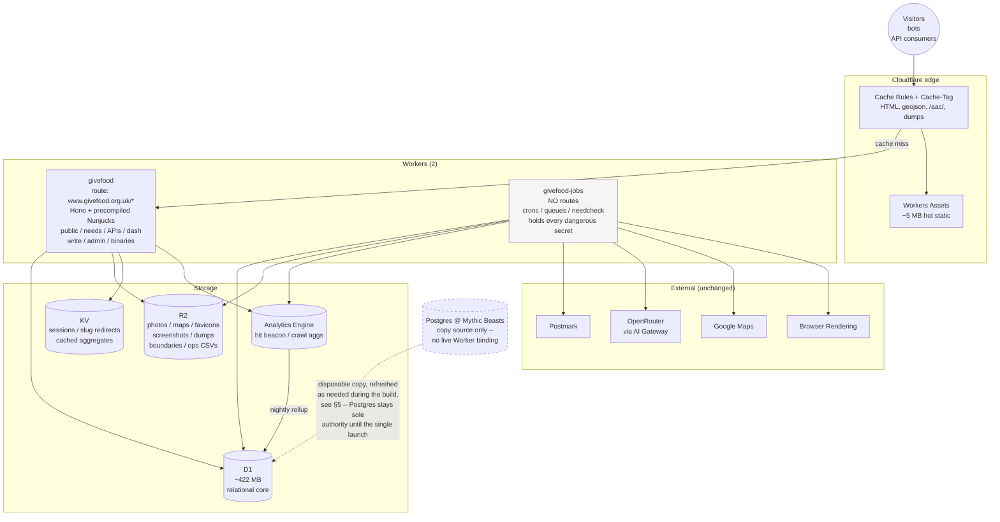

**The strangler mechanism is route precedence, not proxying — proven against a non-production host, not the live zone.** Cloudflare resolves the most specific Worker route first, and anything unmatched falls through to the origin exactly as it does today; that's still the mechanism for the Worker's own internal routing. What changed (§10.1.1a): the narrow-to-wide widening — `/needs/at/*/photo.jpg`, then `/api/*`, then `/needs/*`, then `/*` last — happens entirely against the proving-ground host (`<worker>.workers.dev` and a real custom domain used for proving, `beta.givefood.org.uk`), never against `www.givefood.org.uk`. No `fetch()` back to Django is ever needed on that proving-ground host either, which matters because a Route cannot be the target of a same-zone `fetch()`. **Every phase before the single launch has zero production footprint — there is nothing to roll back, because nothing has changed on the live zone.** The one production event is the single launch (§10.1.1a): the whole domain moves at once, data and traffic together, not phase by phase.

---

### 5. Fixed maintainer decisions

Two decisions are settled. This plan treats them as constraints, not options.

#### 5.1 PlacePhoto: R2 storage, same-origin serving, real image bytes

**1,776 MB across 7,114 rows moves to R2**, but the three photo routes stay on `www.givefood.org.uk` and **return image bytes directly from a Worker route**. A 302 redirect to an R2 domain is **not acceptable**.

The routes are registered *outside* `i18n_patterns` at `givefood/urls.py:14` (confirmed in `gfwfbn/urls/generic.py`), so there is exactly **one URL per photo**, not 21:

```
/needs/at/<slug>/photo.jpg
/needs/at/<slug>/<locslug>/photo.jpg
/needs/at/<slug>/donationpoint/<dpslug>/photo.jpg
```

Three load-bearing reasons, all of which a redirect breaks:

1. Existing links must keep working.
2. Templates request these paths through **Cloudflare Image Resizing on the same zone** — `gfwfbn/templates/wfbn/index.html:145-147` and 15 other `<picture>`/`<source>` elements across 5 templates prefix them with `https://www.givefood.org.uk/cdn-cgi/image/width=150,format=avif…`. A different hostname breaks the whole AVIF/WebP srcset pipeline.
3. The URLs must remain valid canonical URLs.

> ⚠️ **This interaction is unverified and there is a spike for it** ([§8.1](#81-the-three-phase-0-spikes), spike 3). Cloudflare's own troubleshooting documentation lists error 9524 — "The `/cdn-cgi/image/` resizing service could not perform resizing. This may happen when an **image URL is intercepted by a Worker**" — with the recommended workaround being to resize *inside* the Worker instead. Error 9403 additionally cautions against "Workers scoped to the entire domain `/*`", which is precisely this plan's topology. If the spike fails, either the Worker performs the transform itself via `fetch(..., {cf: {image: {...}}})` (which reinstates a ~$8/month Images cost), or all four widths used in the templates are precomputed and the `/cdn-cgi/image/` prefix is removed from the markup — a template change on pages the fidelity rule covers. **Run this spike before committing to Phase 1.**

Note also that `gfwfbn/templates/wfbn/foodbank/locations.html:91-92` puts `/cdn-cgi/image/` in front of the Google Static Maps proxy PNGs too, so the same dependency applies to a fourth route family.

#### 5.2 Dumps: R2 storage, separate domain permitted

**1,474 MB across 279 rows** — approximately **9.4 GB uncompressed**, because Postgres TOAST is compressing ~6.4×, so gzip before PUT or both the bill and the transfer time are six times larger — moves to R2 on `dumps.givefood.org.uk`.

The existing `/dumps/` URLs are **public contracts and must redirect, never 404**:

| URL | Action | Why |
|---|---|---|
| `/dumps/<type>/<format>/latest/` (×12) | **302** | Moving target. Documented on `/api/`, in `README.md:41`, `gfapi2/README.md:136`, `llms.txt:101`. Almost certainly what the invisible `github.com/givefood/data` publisher consumes. |
| `/dumps/<type>/<format>/<Y>-<M>-<D>/` | **301** | Immutable, citable by researchers. **Normalise the date in the Worker** — Django's URLconf uses three separate `<int:>` converters, so `/2026-8-9/` is a live URL alongside `/2026-08-09/` and a static redirect rule will 404 one of them. |
| `/dumps/`, `/dumps/<type>/`, `/dumps/<type>/<format>/` | **Stay on www**, rendered from the D1 metadata table | Never `ListObjects` — it is a Class A operation at 12.5× the price of a read. |

`givefood_dump` survives as a ~50 kB metadata table. A Cache Rule marking `dumps.givefood.org.uk` cache-eligible is **mandatory** — CSV/JSON/XML are not in Cloudflare's default cacheable extensions, so without it every download is an R2 GetObject.

`llms.txt:101` also advertises "CSV, JSON, XML, **and YAML** exports". No YAML dump has ever existed; fix the text in the same change.

---

### 6. The top decisions

| # | Decision | Choice | Why | Reversibility |
|---|---|---|---|---|
| **D1** | Worker topology | **Two Workers**: `givefood` (one catch-all route) and `givefood-jobs` (no routes) | Goal 4. One route pattern, no precedence puzzles, one deploy, one `wrangler tail`. Bundle size is not the constraint (~1 MB gzipped against a 10 MB cap); **startup time** is, and lazy `import()` of locale catalogues handles it. The second Worker earns its place on secret blast radius, per-Worker consumer limits, and deploy isolation from multi-hour crawls. | **High** — splitting the admin out later is a config change plus a route. Merging back is harder, because secrets would then coexist. |
| **D2** | Framework + templating | **Hono + Nunjucks precompiled at build time** (`nunjucks/browser/nunjucks-slim`, no compiler in the bundle) | Nunjucks is a Jinja2 port; Django's template language is Jinja2's sibling. Measured: 115 ``, 304 ``, 133 ``, 594 ``, 163 `` all transfer verbatim. ~90% of the port is a regex transpiler. `eval`/`new Function` are **banned on Workers**, so precompilation is mandatory, not an optimisation — and importing plain `nunjucks` throws at *runtime*, not build time. | **Low** — propagates into 181 files. The transpiler is kept in-repo as the audit trail and can be re-run. |
| **D3** | Transition data source *(revised)* | **Copy the relational core to D1 up front; build every route against D1 from the start.** No Hyperdrive-behind-Postgres interim. | Maintainer decision, overriding an earlier draft's Hyperdrive-first design. One datastore and one query dialect throughout, instead of a Postgres-reading phase followed by a later "swap to D1" phase — simpler, at the cost of the application rewrite and the query rewrite (`cube`/`earthdistance`/`pg_trgm`/`DISTINCT ON`, the five raw-SQL sites) landing together rather than sequentially. Postgres is copied from, never written to, and stays sole authority until the single launch (§10.1.1a), regardless of phase number, so a bad copy is fixed by re-running it. | **Low pre-launch, higher at launch itself** — reversibility is binary, not a gradient tied to phase progress: trivial (free) before the single launch, since D1 never holds a real write until then; a genuinely higher-stakes single rollback decision after it. See §10.10 for the post-launch procedure. |
| **D4** | Primary datastore | **One D1 database** for the whole relational core | Goal 4: one datastore, not four. Measured 421.8 MB VACUUMed against a 10 GB ceiling. `FoodbankHit` stays here in full (19 MB, 942 days of history) rather than being sharded into a second product for a rounding error of space. | **Medium** — the Phase 7 cutover is the one irreducible big bang. |
| **D5** | PlacePhoto *(fixed)* | **R2 storage, same-origin Worker route, image bytes** — never a redirect | Maintainer decision; three load-bearing reasons in [§5.1](#51-placephoto-r2-storage-same-origin-serving-real-image-bytes). Removes 1,776 MB from a 5 GB database. Cloudflare Images rejected: 21,342 unique transformations rebill every calendar month. | **Low** — the R2-backfill-and-read path is built and verified entirely against the disposable copy pre-launch (§10.1.1a); Django/Postgres keeps serving 100% of real photo traffic, blob column included, right up to the single launch, so there is no live fallback window to manage. |
| **D6** | Dumps *(fixed)* | **R2 on `dumps.givefood.org.uk`**, permanent 301/302 layer on www | Maintainer decision. Payloads average ~5.4 MB/row, which **exceeds D1's 2 MB row limit** — they physically cannot live in D1. Removes 1,474 MB. | **Medium** — the redirects are permanent and cheap; the R2 key layout is what would be expensive to change. |
| **D7** | Nearest-neighbour search | **In-memory haversine** over an ~113 KB packed index in R2, memoised in module scope | These four queries are **13.7M executions and 17.48 hours of Postgres time in 16 days — 8.6% of all DB time**. Replacing a 113 KB scan with a JS loop is faster, removes 4 D1 round trips per search, and deletes an unparameterised SQL surface (`LlToEarth` interpolates coordinates with **no bind parameters**, and two of the three search endpoints have no numeric guard). `R = 6378168` to match `earth_distance()` exactly; **`R = 6367000` for the v1 endpoints**, which have differed by 0.18% for years and whose consumers may diff them. | **High** — a bounding-box + haversine D1 query is the documented fallback. |
| **D8** | Place autocomplete | **D1 FTS5 `tokenize='trigram'`** for the substring pass, plain index for the prefix pass | Replaces `pg_trgm`. Benchmarked on the real 253,584 places: p50 0.02 ms, p95 2.03 ms, worst 5.30 ms, against the ~185 ms the existing docstring records for "hackney" in Postgres. **Must wrap the query as a quoted FTS5 phrase** — a bare bound parameter throws on `q=king's` and `q=-yn-`, which are real UK place names and currently return 228 and 9 results. R\*Tree is **unavailable on D1** (verified: `SQLITE_AUTH`), so there is no spatial-index alternative. | **High** — spike 2 settles it before any code; a KV prefix index is the fallback. |
| **D9** | Cache invalidation | **`Cache-Tag`, not URL/prefix purge** | Purge by tag left Enterprise in **April 2025** and is now on all plans, at no extra cost. Collapses 3,000 food banks × 21 languages from ~90,000 URL targets to **30 API calls**. Also fixes `givefood/utils/cache.py:183`, which hardcodes `url_limit = 30` when the documented cap is 100. **Ships in Phase 0, on Django, before any migration.** | **High** — tags are additive; URL purging can run alongside. |
| **D10** | Admin auth | **Port Google OAuth to the Worker; sessions in KV** | Maintainer decision, explicitly not Cloudflare Access. Sessions are small, short-lived and read on every admin request — KV's shape exactly. A server-side store makes logout an actual revocation, which signed stateless cookies cannot do. **CSRF is fixed, not reproduced**: `CsrfViewMiddleware` is commented out at `givefood/settings.py:97`, so the 17 `` tags are decorative and every mutating admin POST — including `need_notifications`, which mails thousands of subscribers — is currently open. | **Medium** — the store is swappable. This is more code to own forever than Access would have been; that was the explicit trade. |
| **D11** | Hit counting | **Keep the client beacon; write to Analytics Engine; nightly rollup into D1** | The beacon at `wfbn/includes/hit.html` is already a **separate uncached POST** with `keepalive:true`, so edge-caching the HTML changes nothing about counting — the hard part of this problem largely dissolves. AE absorbs 9–11M/month for free; the D1 rollup preserves all 40.2M hits back to 2024-01-31, which AE's 3-month retention could not. | **Medium** — post-migration counts become **sampled estimates**, and that discontinuity appears in the annual reports. Needs sign-off ([§9](#9-open-questions-that-gate-the-decision)). |

---

### 7. Headline numbers

#### 7.1 Data volumes

| Table | Rows | Postgres | Disposition |
|---|---:|---:|---|
| `givefood_placephoto` | 7,117 | 1,776 MB | → **R2** (essentially all TOAST) |
| `givefood_dump` | 279 | 1,474 MB | → **R2** (9.4 GB uncompressed) |
| `givefood_crawlitem` | 2,562,501 | 634 MB | 30-day window in D1 (171,415 rows / 22 MB); history → R2 |
| `givefood_postcode` | 1,795,944 | 457 MB | → D1 **trimmed** to 4 columns: **80 MB** |
| `givefood_place` | 253,584 | 161 MB | → D1 trimmed + FTS5: **26 MB** |
| `givefood_foodbankhit` | 709,644 | 130 MB | → D1 **in full**: 19 MB |
| `django_tasks_database_dbtaskresult` | 41,625 | 62 MB | **Dropped** — Queues are push-based |
| `givefood_foodbankchangetranslation` | 89,743 | 46 MB | → D1 (863 orphans dropped): 36 MB |
| `givefood_foodbankchange` | 33,931 | 38 MB | → D1: 29 MB |
| Everything else | | ~120 MB | → D1 |

**D1 fit — measured, not estimated.** The ten largest D1-bound tables were exported from production, loaded into a real SQLite file with the exact proposed schema, all indexes and the FTS5 trigram index, then `ANALYZE`d and `VACUUM`ed:

```
postcode                    80.1 MB      crawlitem (30d)          22.0 MB
foodbankchangetranslation   36.4 MB      foodbankdiscrepancy      21.7 MB
postcode_pcn_idx            30.0 MB      hit_day_foodbank_idx     19.4 MB
foodbankchangeline          29.4 MB      foodbankhit              19.0 MB
foodbankchange              29.4 MB      fcl_created_idx          18.2 MB
place                       26.5 MB      ... 54 more objects     111.5 MB
                            ---------------------------------------------
                            VACUUMed on disk:                    421.8 MB
```

Plus ~15 small tables and the derived geo index: **~427 MB against a 10 GB ceiling — 4.3%, roughly 23× headroom.** It does **not** fit the 500 MB Free tier; Workers Paid is required regardless.

The reason it fits is that **4,076 MB — 79% of the current database — never reaches D1.**

> **Correction to earlier drafts:** D1's maximum row size is **2,000,000 bytes (2 MB)**, not 1 MB. The claim that three constituency `boundary_geojson` rows "physically cannot be stored" is **false** — the largest, Argyll, is 1,605,556 bytes. They still move to R2, but on the real grounds: SQLite does not compress, so the 18 MB of Postgres TOAST becomes ~27 MB raw and drags a megabyte-class column through every `SELECT *` on a 650-row table.

#### 7.2 Effort

| Phase | Person-days |
|---|---|
| 0 · Edge caching + groundwork + spikes | 8–12 |
| 1 · R2 (photos, **maps, favicons, screenshots**, dumps, static) | 14–20 |
| 2 · APIs on Workers + D1 | 30–41 |
| 2.5 · Reference data → D1 + `/aac/` | 10–14 |
| 3 · `/needs/` | 30–40 |
| 4 · Rest of public site | 25–35 |
| 5 · Crons + need pipeline | 22–30 |
| 6 · **The admin** | 45–60 |
| 7 · D1 cutover | 12–18 |
| 8 · Decommission | 3–5 |
| Cross-cutting (parity harness, CI, observability, seed data) | 18–24 |
| **Total** | **211–290** |

**Midpoint ≈ 250 person-days.** At 1.4 effective FTE and 3.5 productive days per week: **~12 months to Phase 8, ~6 months to Phase 4**.

| Staffing | To Phase 8 | To Phase 4 (the cheap exit) |
|---|---|---|
| 1.4 FTE (recommended) | ~12 months | ~6 months |
| 0.6 FTE (maintainer alone) | **~28 months — the plan goes stale** | ~13 months |
| 2.0 FTE | ~8 months | ~4 months |

> ⚠️ **Treat 250 as a floor, not a mid-case.** It assumes the transpiler's 90%-automatable claim holds at the *file* level as well as the tag level, that 21 languages do not multiply every bug, and that the byte-exact serialisation work lands in the 7 days allotted. **Before committing to Phase 3, spend 3 days transpiling the ten hardest templates** — `wfbn/index.html` (45 translation tags), `foodbank/index.html`, `public/page.html`, and the whitespace-sensitive `md/*.md` — and re-baseline the whole of Phase 3 from that actual-versus-estimate. Do the same for two admin ModelForms before committing to Phase 6's 45–60.

#### 7.3 Cost — the corrected arithmetic

**The baseline is £0, not £15–40/month.** The box is shared with five other Django applications and does not go away. Migrating givefood off it frees capacity; it eliminates no line item. A downsize saving may exist and should be quantified by asking what the box would cost with five apps instead of six — but do not assume one.

**The request model must count billable Worker invocations, not page views.** Under a catch-all route, one food bank page view generates roughly **8.3 billable requests**:

| Per page view | Count | Source |
|---|---:|---|
| HTML | 1 | |
| Hit beacon POST | 1 | `wfbn/includes/hit.html`, `fetch(..., {keepalive:true})` |
| `/frag/` XHRs on load | 2 | `public/page.html:61-62` — `last-updated`, `need-hits` |
| `/frag/` XHRs during dwell | ~2 | `data-update="130"`, `csi.js` `setInterval` |
| geo.json | 1 | `GeoJSONPreload` emits `Link: rel=preload`; `wfbn.js` fetches it |
| photo.jpg or map.png | 1 | |
| manifest.json | ~0.3 | |
| **Total** | **~8.3** | |

11M views × 8.3 ≈ 91M, plus `/aac/` (fires on nearly every keystroke past 3 characters with only a 100 ms debounce), non-JS crawler traffic (invisible to `FoodbankHit` entirely, because it never executes the beacon), the APIs, RSS and sitemaps → **~100M billable requests/month**.

| Line | Arithmetic | Monthly |
|---|---|---:|
| Workers base | | $5.00 |
| Workers requests | (100M − 10M included) × $0.30/M | $27.00 |
| Workers CPU | cache hits bill 0 CPU; misses + beacons | ~$3.00 |
| **D1** | 427 MB vs 5 GB included; reads vs 25bn included | $0.00 |
| **R2** | ~4.2 GB vs 10 GB free; ops inside free tier; **egress free** | $0.00 |
| Queues | 1.35M ops − 1M included | $0.14 |
| Workflows | ~150 instances vs 500k steps included | $0.00 |
| Analytics Engine | 11M data points − 10M included | $0.25 |
| Workers Logs | sampled | $0.00 |
| **Browser Rendering** — needcheck | 1,024 renders/day × ~15 s = 128 h/mo − 10 included | $10.62 |
| **Browser Rendering** — screenshots | ~4,600/mo × ~30 s | $3.45 |
| AI Gateway / Turnstile | included | $0.00 |
| Containers (daily dump generation) | inside **all three** inclusions | $0.00 |
| Cloudflare zone | **stay on Free**: 10 Cache Rules, design needs ~8 | $0.00 |
| **Total** | | **≈ $49/mo (~£39)** |

**Sensitivity:**

| Scenario | Monthly |
|---|---:|
| Base | ~£39 |
| 4× my bot/crawler assumption | ~£65 |
| needcheck actually runs 4×/day, as `docs/crons.md` claims | ~£65 |
| Both | ~£90 |

Two things worth stating plainly:

- **Cache hit ratio is a latency lever, not a cost lever.** Requests are billed whether they hit the Worker cache or invoke the Worker. At a poor 70% hit ratio the bill moves by roughly $1.30. That decouples goal 1 from money, which is freeing — optimise the cache for speed without watching the meter.
- **This is £470–780/year of new spend that replaces nothing.** Sell it as buying speed and resilience at ~£40/month. A board hears "roughly a wash" and "£40/month for resilience" very differently, and only one of those is true.

> ⚠️ **One assumption drives roughly 55% of this estimate and is unverified: that Workers Cache *hits* are billed as requests.** Confirm it against a live meter during Phase 1 rather than from documentation.
>
> ⚠️ **`docs/crons.md` says needcheck runs 4×/day; production `CrawlSet` data shows once daily at ~15:00 UTC.** Reconcile against the Coolify scheduled-task configuration before budgeting — it is a 4.6× difference on the largest non-Workers line, and it is also the strongest argument for per-food-bank adaptive scheduling driven by `days_between_needs`.
>
> ⚠️ **Goal 3 and Browser Rendering cost pull against each other.** The Workers Cache key includes the Worker version, so every deploy cold-starts the photo, map and screenshot caches. Until the R2 backfill of maps and screenshots lands in Phase 1, more frequent deploys directly increase a third-party Google Static Maps and Browser Rendering bill.

---

### 8. Kill criteria and the point of no return

#### 8.1 The three Phase 0 spikes

Run these **before any commitment**, in the first two weeks. Local D1 runs the same workerd build as production and is the closest thing to the staging database this project has never had.

| # | Question | Method | If NO |
|---|---|---|---|
| **1** | Does in-memory haversine reproduce production nearest-search **ordering and** `distance_m` to the integer? | Load the 8,721-point set; run 200 postcodes; diff against live `/api/2/foodbanks/search/` | **Abandon or descope.** Nearest-food-bank is the site's core function. Without it on D1, Postgres never leaves and goal 2 is unmet. |
| **2** | Does D1 FTS5 `tokenize='trigram'` work **remotely** and serve `/aac/` substring matching, with correct escaping? | Create the virtual table locally *and* against `--remote`; test the real-world escaping cases | Prefix-only autocomplete (the code already gates substring at 3+ characters) with a documented quality loss, or a KV prefix index. |
| **3** | Does `/cdn-cgi/image/` still resize a path served by a Worker route? | On a staging zone, put a Worker route on one photo path and request it through `/cdn-cgi/image/width=300,format=avif/<path>`. Test **both** the `/*` catch-all and a narrow `/needs/at/*/photo.jpg` route — they may behave differently | Either the Worker transforms via `fetch(..., {cf:{image:{}}})`, reinstating ~$8/month, or precompute all four template widths and remove the prefix from the markup — an HTML change under the fidelity rule. |

```bash
# Spike 2, in full — note the escaping that a bare bound parameter gets WRONG
wrangler d1 execute givefood-spike --local --command \
  "CREATE VIRTUAL TABLE place_fts USING fts5(name_fold, content='place', content_rowid='id', tokenize='trigram');"
wrangler d1 execute givefood-spike --local --command \
  "INSERT INTO place_fts(place_fts) VALUES('rebuild');"

# q = "king's"  ->  MATCH '"king''s"'   (wrap as a quoted phrase; double internal quotes)
# q = "-yn-"    ->  MATCH '"-yn-"'      (bare, this throws: no such column: yn)
wrangler d1 execute givefood-spike --remote --command \
  "SELECT p.name FROM place_fts f JOIN place p ON p.id = f.rowid
   WHERE f.name_fold MATCH '\"ackne\"' ORDER BY p.population DESC LIMIT 5;"

# Confirm the plan does not depend on features D1 does not have:
wrangler d1 execute givefood-spike --remote --command \
  "CREATE VIRTUAL TABLE t USING rtree(id, minLat, maxLat, minLng, maxLng);"
# expected: SQLITE_AUTH — R*Tree is NOT available. Do not design around it.
```

```bash
# Spike 3 — the /cdn-cgi/image/ interaction, on a staging zone
curl -sI "https://staging.givefood.org.uk/cdn-cgi/image/width=300,format=avif/needs/at/<slug>/photo.jpg" \
  | egrep -i '^(HTTP|content-type|cf-)'
# Look for: 200 + image/avif  ->  PASS
#           error 9524 / 9403 ->  FAIL, take the fallback in §5.1
```

#### 8.2 Kill criteria

Agree these **before starting**. Each has a checkpoint, and freezing happens at a **phase boundary**, never mid-phase — every boundary pre-launch is a coherent, tested, working state against the proving-ground host and its disposable D1 copy, not a production deployment (§10.1.1a). Full detail and the current wording: §10.13.

| # | Criterion | Checked at | Action |
|---|---|---|---|
| **K1** | Spike 1 fails | End Phase 0 | **Abandon, or descope to Phase 4.** |
| **K2** | After **5 dedicated days** on the serialisation layer, strict API parity still fails on >1% of the corpus | Mid Phase 2 | **Abandon.** An API you cannot prove identical is a contract you cannot keep, to consumers you have no way to notify. Expect **YAML**, not XML, to be the hardest of the three — PyYAML's scalar-style selection for multiline need text is not reproducible by configuring js-yaml. |
| **K3** | Cumulative actual > 1.5× cumulative estimate | End Phase 3 — **a scheduled review with a date and a named owner**, not a threshold someone must notice | **Descope to Phase 4 and stop.** |
| **K4** | Phase 6 tracking > 2× estimate at its 50% mark | Mid Phase 6 | **Stop and never launch.** Under the single-launch model there is no permanent partial-split fallback — Django/Postgres keep serving 100% of production exactly as before, cheaper than the old "keep Django for `/admin/` indefinitely" contingency. |
| **K5** | An undiagnosable parity regression survives 2 days of investigation | Any phase | **Pause the phase.** Losing the ability to verify is worse than not launching — you would be launching blind to 3,000 food banks' data. |
| **K6** | The maintainer is unavailable > 4 weeks mid-migration | Any phase | **Freeze at the last completed boundary.** Cheap: production stays on Django/Postgres, untouched: there is no half-migrated system to resume, only unfinished build work. |
| **K7** | Traffic doubles again and Phase 0 caching does not hold the origin | Continuous | **Accelerate Phases 3–4, or buy a bigger box.** A capacity emergency is not the time to be mid-rewrite. |

#### 8.3 The point of no return

**Phases 0–6 carry no production footprint at all.** Django and Postgres keep serving 100% of real traffic throughout the build; freezing at any boundary just means the build stops there — there is nothing to roll back.

**The point of no return is the moment in Phase 7 when the first write lands in D1 that is not in Postgres** — the 00:45 mark in the cutover runbook, when the write freeze lifts.

- **Before it:** stop the build, or don't launch. Nothing in production has changed, at any point, for any phase.
- **After it:** rollback requires a reverse sync — built, rehearsed and timed at T-7 (§10.8.4, §10.10). Earlier drafts of this plan described three different rollback mechanisms and the runbook implemented none; that gap is closed.

**The second and final point of no return is D+30**, when Postgres is stopped. Do not let that date slip past unnoticed — it is the last moment the old system can be restarted without a restore. The VPS itself is retained until **D+90**, because a charity's data problems surface on a reporting cadence, not a daily one.

#### 8.4 The cheap exit

*(Revised 2026-09-01 to match §10.1.1a/§10.1.4's single-launch model. Under the old incremental-widening design this section described, "stopping after Phase 4" meant the public site and all three APIs were already live on `www.givefood.org.uk`. Under the current model nothing is live on the production domain until the single launch — see §10.1.4 for the authoritative version of this reframing.)*

**Stopping after Phase 4 is not failure.** You would have: the entire public site and all three APIs built and fully proven against the proving-ground host, ready to cut over — photos, maps, favicons, screenshots, dumps and static assets backfilled to R2; edge-cached HTML with working tag-based invalidation proven; ~3.9 GB out of a 5 GB database ready to move — with Django and Postgres still serving **100% of real production traffic**, unchanged, exactly as before the migration started. Phase 0's caching win is the one exception: that lands live, on Django, immediately, independent of everything else.

If that gets cut over as its own single launch (§10.1.1a): **Faster** — fully delivered. **Resilient** — mostly; the public site survives a box outage from cache, the admin (never built at this stopping point) does not, since it never launches. **Quicker deploys** — yes, for everything ported. **Simple** — one Django app on one box, with a Workers front end for everything else. If it never gets cut over at all, none of that is realized, and Django/Postgres simply keep running exactly as they do today — a legitimate, zero-risk place to stop, not a partial production state.

For a two-person charity that may well be the right place to stop. Build the plan so that stopping there — with or without ever launching what's built — is a decision, not a defeat.

---

### 9. Open questions that gate the decision

These need answers from the maintainer before or during Phase 0. Several change the shape of the plan.

- [ ] **Is a second developer available, and at what fraction of their time?** This single answer determines whether the plan runs to Phase 8 or should be openly scoped to stop at Phase 4.
- [ ] **What publishes `github.com/givefood/data`?** Nothing in this repository does — no `subprocess`, no GitPython, no `api.github.com` call anywhere. It is an invisible consumer of the `/dumps/*/latest/` URLs that cannot be tested against and will break silently if the redirects are wrong.
- [ ] **Confirm the trimmed `Postcode` table.** Only 3 of ~20 columns are read (`postcode`, `lat_lng`, `county`, at `givefood/views.py:1569`). Trimming takes the largest table from 457 MB to 80 MB and the whole database from ~610 MB to ~427 MB. The dropped columns are public ONS data, re-importable at any time.
- [ ] **What is the real needcheck schedule?** `docs/crons.md` says 4×/day; production shows once daily at ~15:00 UTC. It is the largest non-Workers cost line and a 4.6× discrepancy.
- [ ] **Approve or reject Unicode-folded place search.** It would make `mon` find `Ynys-Môn`, which it does not today — a deliberate improvement on a public endpoint affecting ~8,442 place names. The alternative reproduces SQLite's ASCII-only `upper()` and regresses search for Welsh and Gaelic on a site that serves Welsh as a first-class language. **There is no neutral option**, and `/aac/` cannot be in the strict-parity corpus if we fold.
- [ ] **Should 21 language variants of the 26 place sitemaps survive?** `robots.txt` currently advertises **43 sitemaps covering ~5.58M place URLs**, each of which runs four KNN searches when crawled. Trimming place sitemaps to English-only is a one-line change that cuts the advertised crawl surface by 95% and would do more for goals 1 and 2 than several migration phases.
- [ ] **Is `/aac/` an exception to the no-rate-limiting decision?** It is CORS-open, uncredentialed, fires on nearly every keystroke, and D1 bills rows *scanned*. This is the one place where "serve everyone" has a direct cost consequence.
- [ ] **Do post-migration hit counts need to be exact, or are sampled estimates acceptable?** They appear in the annual reports. Exact counts mean a Durable Object per food bank and a round trip on the beacon path.
- [ ] **Which of the 43 `GfCredential` values are rotated by hand?** Moving them to Worker secrets changes the model from admin-editable to deploy-time.
- [ ] **Is £470–780/year of new recurring spend approved?**

---

### 10. Contents

| § | Section |
|---|---|
| 01 | [Executive summary, scope and the go/no-go case](#01-executive-summary-scope-and-the-gono-go-case) |
| 02 | [Current state: the system as it is today](#02-current-state-the-system-as-it-is-today) |
| 03 | [Target architecture on Cloudflare](#03-target-architecture-on-cloudflare) |
| 04 | [Schema translation: Postgres to D1, and the geographic subsystem](#04-schema-translation-postgres-to-d1-and-the-geographic-subsystem) |
| 05 | [Data migration: extract, transform, load, verify](#05-data-migration-extract-transform-load-verify) |
| 06 | [Porting the application: routes, templates, i18n and the public site](#06-porting-the-application-routes-templates-i18n-and-the-public-site) |
| 07 | [Porting the APIs and preserving public contracts](#07-porting-the-apis-and-preserving-public-contracts) |
| 08 | [Background jobs, the AI need-extraction pipeline, and notifications](#08-background-jobs-the-ai-need-extraction-pipeline-and-notifications) |
| 09 | [Admin, authentication, security and secrets](#09-admin-authentication-security-and-secrets) |
| 10 | [Delivery plan, testing, cutover runbook and rollback](#10-delivery-plan-testing-cutover-runbook-and-rollback) |
| 11 | [Risks, cost model, spikes and open questions](#11-risks-cost-model-spikes-and-open-questions) |

---

## 02. Current state: the system as it is today

This section is the baseline. Everything the migration must reproduce is recorded here, measured
from the repository at `/Users/jasoncartwright/Sites/foodcharity` and from the production database
(read-only) on 2026-08-29. It is reference material: use it as the checklist the port is graded
against, not as narrative.

Where a figure here contradicts `README.md`, `docs/crons.md` or one of the app-level `README.md`
files, **this section is right and the documentation is stale** — every discrepancy is called out
explicitly in §2.11 so nobody plans against the wrong number.

---

### 2.1 System shape in one diagram

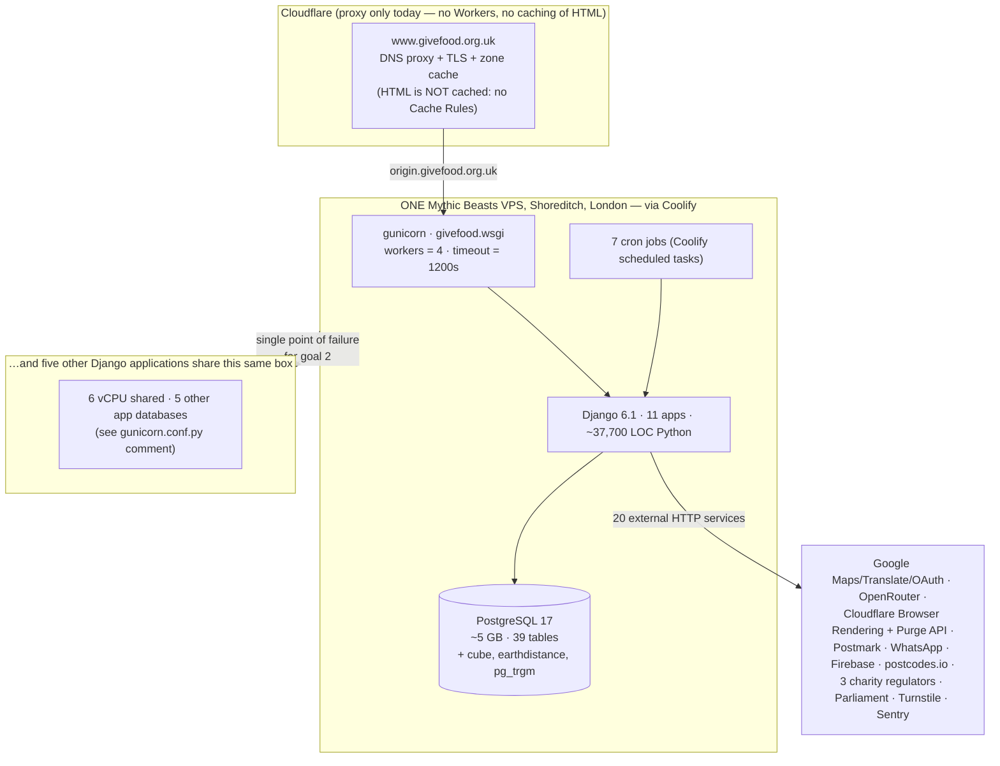

**The one-line summary:** a single Django monolith on a single shared VPS in a single datacentre,
fronted by Cloudflare in proxy-only mode, serving ~9–11 M food bank page views a month plus a
heavy scraped tail, with essentially **no HTML edge caching** and a per-process in-memory cache
that exists in four divergent copies.

---

### 2.2 The eleven Django apps

`INSTALLED_APPS` order and mount points are from `givefood/settings.py` and `givefood/urls.py`.
LOC is Python only, excluding migrations and `__pycache__`.

| App | LOC | Mounted at | Namespace | Purpose |
|---|---:|---|---|---|
| `givefood` | 17,575 | `/` (root) + `i18n_patterns` | — | Public marketing/institutional site **and** the shared foundation: `templates/public/page.html` is the single base template every other app extends; owns `settings.py`, the middleware chain, both caches, `decache()`, the 33 model classes, `utils/`, `const/` |
| `gfadmin` | 10,103 | `/admin/` | `admin` (app_name `gfadmin`) | Hand-rolled admin. **Not** `django.contrib.admin` — that app is not even installed. 113 URL patterns, 47 templates, 20 ModelForms. Home of the need-review queue |
| `gfwfbn` | 3,847 | `/needs/` ×2 + `/md/needs/` | `wfbn-generic`, `wfbn`, `wfbn-md` | "What food banks need" — the primary public surface. Every food bank, location, donation point, place and constituency page |
| `gfoffline` | 1,661 | `/offline/` | `offline` | Cron/background work: 13 management commands + 10 key-guarded HTTP endpoints |
| `gfapi2` | 1,373 | `/api/2/` **and** `/api/` | `api2`, `gfapi2` | Current public API. Every endpoint is live at **two** URLs |
| `gfdumps` | 1,294 | `/dumps/` | `dumps` | Nightly bulk data exports (4 types × 3 formats) |
| `gfdash` | 834 | `/dashboard/` | `dash` (app_name `gfdash`) | 20 public read-only analytics dashboards |
| `gfwrite` | 340 | `/write/` | `write` | Write-to-your-MP letter tool |
| `gfapi1` | 272 | `/api/1/` | *(global names, no namespace)* | Deprecated API v1 — still live, still consumed |
| `gfapi3` | 171 | `/api/3/` | `api3` | Future API v3 (2 real endpoints) |
| `gfauth` | 167 | `/auth/` | `auth` (app_name `gfauth`) | Google OAuth sign-in. 34 lines of view code |
| | **37,637** | | | |

**Namespace trap.** `gfadmin/urls/__init__.py` sets `app_name = "gfadmin"` while `givefood/urls.py`
mounts it with `namespace="admin"`. Both `` and `` resolve,
and the templates use both. The same applies to `gfdash` (`app_name="gfdash"`, mounted as `dash`) and
`gfwfbn` (`app_name="gfwfbn"`, mounted three times under three different namespaces). Any router
port must preserve both aliases or fix every call site in one pass.

#### Template inventory — 181 files, not 148

The brief and several surveys say "150 HTML templates". The real count across all nine
`templates/` directories:

| Extension | Count | Notes |
|---|---:|---|
| `.html` | 149 | |
| `.txt` | 16 | **includes the five LLM prompt templates** |
| `.md` | 10 | the `/md/` mirror — whitespace-sensitive |
| `.xml` | 6 | RSS + all sitemaps |
| **Total** | **181** | |

The five `.txt` prompt templates are the highest-consequence files in the repository and are missing
from every "template port" estimate:

| Prompt template | Bytes | Rendered by | Consequence of a whitespace change |
|---|---:|---|---|
| `gfoffline/templates/foodbank_need_prompt.txt` | 4,663 | `givefood/utils/crawlers.py:414` | Changes what the model extracts for **all 3,000+ food banks** |
| `gfoffline/templates/foodbank_detail_prompt.txt` | — | `gfoffline/views.py:90` | Discrepancy detection |
| `gfoffline/templates/categorisation_prompt.txt` | — | `gfoffline/views.py:184` | Item categorisation |
| `gfadmin/templates/admin/prompts/check.txt` | — | `gfadmin/views.py:1002` | AI food-bank check |
| `gfadmin/templates/admin/prompts/orderline_prompt.txt` | — | `givefood/models/orders.py:136` | Order parsing |

All five go through `render_to_string()`, so they need the same template engine and identical
variable semantics as the HTML.

---

### 2.3 Complete URL map

This is the checklist. Every pattern below exists today. `L` in the "×21" column means the pattern is
inside `i18n_patterns(..., prefix_default_language=False)` and therefore exists at both the bare path
(English) **and** at `/<lang>/<path>` for the other 20 languages.

#### 2.3.1 Root — `givefood/urls.py`, inside `i18n_patterns` (×21 each)

| Pattern | View | Cache | Notes |
|---|---|---|---|
| `/` | `views.index` | 1 h | Homepage. `get_site_stats()` + 8 recent needs + 8 most-viewed + 5 articles |
| `/register-foodbank/` | `views.register_foodbank` | **none** | noindex. Turnstile-gated via `/human/` |
| `/about-us/` | `views.about_us` | 1 week | 36 translated strings |
| `/colophon/` | `views.colophon` | 1 week | **Live `requests.get` to raw.githubusercontent.com on cache miss** |
| `/bot/` | `views.bot` | 1 week | URL is embedded in `BOT_USER_AGENT`; food banks allowlist it |
| `/apps/` | `views.apps` | 1 day | |
| `/frag/<slug:frag>/` | `views.frag` | **none** | 4 allowed values only. Highest-volume dynamic endpoint — see §2.3.9 |
| `/human/` | `views.human` | none | `@require_POST`. Turnstile interstitial |
| `/news/` | `views.news` | 1 h | Last 100 `FoodbankArticle` |
| `/flag/` | `views.flag` | 1 day | noindex |
| `/(scotland\|england\|wales\|northern-ireland)/` | `views.country` | 1 h | `re_path` |
| `/(scotland\|england\|wales\|northern-ireland)/geo.json` | `views.country_geojson` | 1 h | 4 dp coords |
| `/donate/` | `views.donate` | 1 week | |
| `/donate/managed/<slug>-<key>/` | `views.managed_donation` | 1 h | noindex; `key` is a capability token |
| `/donate/managed/<slug>-<key>/geo.json` | `views.managed_donation_geojson` | 1 h | |
| `/donate/managed/<slug>-<key>/items/` | `views.managed_donation_items` | **none** | |
| `/annual-reports/` | `views.annual_report_index` | 1 week | |
| `/(2019\|2020\|…\|2025)/` | `views.annual_report` | 1 week | `render("public/ar/%s.html" % year)` — the regex is the **only** guard against template-path injection |
| `/<uuid:pk>/` | `views.uuid_redir` | none | Tries Foodbank → Location → DonationPoint. Published in JSON-LD `sameAs` |
| `/robots.txt` | `views.robotstxt` | 1 week | Emits **43 `Sitemap:` directives** (21 langs × 2 + `/md/sitemap.xml`) |
| `/manifest.json` | `views.manifest` | 1 day | Hand-built dict, `lang` = `request.LANGUAGE_CODE` |
| `/sitemap.xml` | `views.sitemap` | 1 week | |
| `/sitemap_places_index.xml` | `views.sitemap_places_index` | 1 week | 253,584 ÷ 10,000 = **26 child sitemaps** |
| `/sitemap_places.xml` | `views.sitemap_places` | 1 week | |
| `/sitemap_places_<int:page>.xml` | `views.sitemap_places` | 1 week | Page 26 is `OFFSET 250000`; measured **424.95 ms mean** |

#### 2.3.2 Root — untranslated (×1)

| Pattern | View | Cache | Notes |
|---|---|---|---|
| `/llms.txt` | `views.llmstxt` | 1 week | 144 lines. Hardcodes `{{domain}}/dumps/`; **claims a YAML export that has never existed** |
| `/.well-known/security.txt` | `views.securitytxt` | 1 week | Two literal lines |
| `/sitemap_external.xml` | `views.sitemap_external` | 1 week | Deliberately links off-site |
| `/privacy/` | `views.privacy` | 1 week | **Untranslated but footer-linked from every page** |
| `/firebase-messaging-sw.js` | `views.service_worker` | 1 h | Interpolates 6 Firebase creds. **Nothing registers it** (§2.9) |
| `/sw.js` | `views.vapid_service_worker` | 1 h | Fully static content generated by a view. Registered by `webpush.js:111` |
| `/whatsapp_hook/` | `views.whatsapp_hook` | none | GET = Meta verification, POST = inbound commands. **No `X-Hub-Signature-256` check** |
| `/services/` | `views.services` | **none** | Static, uncached, untranslated, linked twice from the homepage |
| `/aac/` | `views.address_autocomplete` | 1 day | `Access-Control-Allow-Origin: *`. See §2.3.10 |
| `/tests/maplibre/` | `views.maplibre_test` | none | 395-line public developer test page |
| `/wp-login.php` | `RedirectView` | — | Rickroll |
| `/what-food-banks-need/` | `RedirectView` | — | Legacy → `/needs/` (non-permanent) |
| `/md/` | `views.md_index` | 1 h | `text/markdown; charset=utf-8` |
| `/md/sitemap.xml` | `views.md_sitemap` | 1 week | |
| `/md/sitemap.md` | `views.md_sitemap_md` | 1 week | |

**Not routed:** `/favicon.ico`. The file exists at `givefood/static/img/favicon.ico` (15,086 bytes)
but no URL pattern serves it, and `page.html` links only the `.svg` and `.png`. Every browser and
crawler requests it unconditionally and gets a 404 from Django.

#### 2.3.3 `gfwfbn` generic — `/needs/…`, registered **before** `i18n_patterns` (×1, no language prefix)

This is why the photo URLs are one URL each rather than 21, and it is the single fact that makes the
same-origin R2 photo requirement tractable.

| Pattern | View | Cache | Storage today |
|---|---|---|---|
| `POST /needs/at/<slug>/hit/` | `foodbank_hit` | `@never_cache` | Raw `INSERT … ON CONFLICT DO UPDATE`. Returns **204** |
| `/needs/at/<slug>/photo.jpg` | `foodbank_photo` | 1 week | **`PlacePhoto.blob` (bytea)** → moving to R2 |
| `/needs/at/<slug>/<locslug>/photo.jpg` | `foodbank_location_photo` | 1 week | ditto |
| `/needs/at/<slug>/donationpoint/<dpslug>/photo.jpg` | `foodbank_donationpoint_photo` | 1 week | ditto |
| `/needs/at/<slug>/favicon.png` | `foodbank_favicon` | 1 week | ⚠️ **No storage.** Live `google.com/s2/favicons` fetch per cache miss |
| `/needs/at/<slug>/donationpoint/<dpslug>/favicon.png` | `foodbank_donationpoint_favicon` | 1 week | ⚠️ **No storage** |
| `/needs/at/<slug>/screenshots/(homepage\|shoppinglist\|donationpoints\|contacts\|locations).png` | `foodbank_screenshot` | 1 week | ⚠️ **No storage.** Live Cloudflare Browser Rendering call, `waitUntil: networkidle0`, `timeout: 45000`. 1,071 × 5 = **5,355 URLs** |
| `/needs/webpush/config/` | `webpush_config` | 1 h | `{"vapidPublicKey": …}` |
| `POST /needs/webpush/subscribe/<slug>/` | `webpush_subscribe` | none | `@csrf_exempt` |
| `POST /needs/webpush/unsubscribe/<slug>/` | `webpush_unsubscribe` | none | `@csrf_exempt` |
| `POST /needs/mobsub/` | `mobsub` | none | **Shipped iOS/Android app contract**, keyed on `Foodbank.uuid` |
| `/needs/mobsub/delete/` | `delete_mobsub` | none | **No `@require_POST`, no `@csrf_exempt`** — works only because CSRF middleware is disabled |

#### 2.3.4 `gfwfbn` i18n — `/needs/…` and `/<lang>/needs/…` (×21 each)

| Pattern | View | Cache | Notes |
|---|---|---|---|
| `/needs/tt-old-data/` | `RedirectView` | — | → `/dashboard/trusselltrust/old-data/` |
| `/needs/` | `index` | 1 h | `?address=` `?lat_lng=` `?item=`. `?lattlong=` **301s** to `?lat_lng=`. No params → **301 to `/`** |
| `/needs/rss.xml` | `rss` | 1 day | `application/rss+xml` |
| `/needs/getlocation/` | `get_location` | `@never_cache` | Calls `freeipapi.com` with the client IP |
| `/needs/geo.json` | `geojson` | 1 week | **~8,800 features**, 4 dp, `address` stripped |
| `/needs/manifest.json` | `RedirectView` | — | **301** → `/manifest.json` |
| `/needs/at/place/<county>/<place>/` | `place` | 1 day | **253,584 URLs.** Delegates to `index()` → 4 KNN queries |
| `/needs/at/<slug>/` | `foodbank` | ⚠️ **NONE** | `@cache_page` **commented out at `gfwfbn/views.py:362`**. The highest-traffic page on the site has no origin cache |
| `/needs/at/<slug>/rss.xml` | `rss` | 1 day | |
| `/needs/at/<slug>/geo.json` | `geojson` | 1 week | 6 dp; includes `lb` boundary features |
| `/needs/at/<slug>/news/` | `foodbank_news` | 1 day | **404** unless `rss_url` or `news_url` |
| `/needs/at/<slug>/charity/` | `foodbank_charity` | 1 day | **404** unless charity details |
| `/needs/at/<slug>/nearby/` | `foodbank_nearby` | 1 week | `find_locations(..., skip_first=True)` |
| `/needs/at/<slug>/updates/(subscribe\|confirm\|unsubscribe)/` | `updates` | none | `@csrf_exempt`. **POST to unsubscribe returns a bare 200** — RFC 8058 one-click |
| `/needs/at/<slug>/map.png` | `foodbank_map` | 1 week | ⚠️ **No storage.** Google Static Maps proxy. **`og:image` on 7 page types** |
| `/needs/at/<slug>/maps/<int:size>.png` | `foodbank_map` | 1 week | size ∈ {300, 600, 1080}; anything else **400** |
| `/needs/at/<slug>/donationpoints/` | `foodbank_donationpoints` | 1 day | 404 if none |
| `/needs/at/<slug>/donationpoint/<dpslug>/` | `foodbank_donationpoint` | 1 day | Emits a `Link: rel=preload` for opening hours |
| `/needs/at/<slug>/donationpoint/<dpslug>/openinghours/` | `foodbank_donationpoint_openinghours` | 1 h | HTML **fragment**, `X-Robots-Tag: noindex`, fetched by `csi.js` |
| `/needs/at/<slug>/locations/` | `foodbank_locations` | 1 day | 404 if none |
| `/needs/at/<slug>/<locslug>/` | `foodbank_location` | ⚠️ **two stacked `@cache_page`** | Week (orphaned) then Day at `views.py:833,836`. Net advertised max-age is **7 days** |
| `/needs/at/<slug>/<locslug>/geo.json` | `geojson` | 1 week | |
| `/needs/at/<slug>/<locslug>/map.png` | `foodbank_location_map` | 1 week | ⚠️ **No storage.** Draws `boundary_geojson` as a Static Maps `path=` |
| `/needs/at/<slug>/<locslug>/maps/<int:size>.png` | `foodbank_location_map` | 1 week | Used at size 300 as list thumbnails |
| `/needs/in/constituencies/` | `constituencies` | 1 week | `?postcode=` → postcodes.io → 302 |
| `/needs/in/constituency/` | `RedirectView` | — | 🐞 target is `/in/constituencies/` — **missing the `/needs/` prefix, redirects to a 404** |
| `/needs/in/constituency/<slug>/` | `constituency` | 1 week | |
| `/needs/in/constituency/<slug>/mp_photo_threefour.png` | `mp_photo_redirect` | none | 302 → `photos.givefood.org.uk` |
| `/needs/in/constituency/<slug>/geo.json` | `geojson` | 1 week | Prepends the boundary as `type: "b"` |

**Map/favicon/screenshot route count:** 1,071 food banks × 3 map sizes + 1,974 locations × 3 = **9,135
map URLs**; plus 5,355 screenshot URLs; plus ~6,800 favicon URLs. None of them has any persistence
layer — every cache miss is a billed third-party API call.

#### 2.3.5 `gfwfbn` markdown — `/md/needs/…` (×1)

All eight return `Content-Type: text/markdown; charset=utf-8`, all `@cache_page(DAY)` except
`nearby` (week). Advertised via `<link rel="alternate" type="text/markdown">` on every HTML page,
in `/md/sitemap.xml`, `/md/sitemap.md` and `/llms.txt`.

`at/<slug>/` · `at/<slug>/locations/` · `at/<slug>/donationpoints/` · `at/<slug>/donationpoint/<dpslug>/` ·
`at/<slug>/news/` · `at/<slug>/charity/` · `at/<slug>/nearby/` · `at/<slug>/<locslug>/`

#### 2.3.6 APIs — **every gfapi2 endpoint is live at two URLs**

`givefood/urls.py:96-99` mounts `gfapi2.urls` twice: at `/api/2/` with `namespace="api2"` and at
`/api/` with no namespace argument (taking the instance namespace `gfapi2` from `app_name`).

| Path (both `/api/…` and `/api/2/…`) | View | Formats | Cache |
|---|---|---|---|
| `` | `index` | HTML | 1 day |
| `docs/` | `docs` | HTML | 1 day |
| `foodbanks/` | `foodbanks` | json, xml, yaml, geojson | 1 h |
| `foodbank/<slug>/` | `foodbank` | json, xml, yaml, geojson | 1 day |
| `foodbanks/search/` | `foodbank_search` | json, xml, yaml (**geojson → 400**) | 1 day |
| `locations/` | `locations` | json, xml, yaml, geojson | **1 month** |
| `locations/search/` | `location_search` | json, xml, yaml | 1 day |
| `donationpoints/` | `donationpoints` | **geojson only** — anything else 400 | 1 week |
| `donationpoints/search/` | `donationpoint_search` | json, xml, yaml | 1 day |
| `needs/` | `needs` | json, xml, yaml | 1 h |
| `need/<uuid:id>/` | `need` | json, xml, yaml | 1 day |
| `constituencies/` | `constituencies` | json, xml, yaml | 1 day |
| `constituency/<slug>/` | `constituency` | json, xml, yaml, geojson | 1 week |

`/api/1/` (deprecated, still live, **no CORS header**): `` · `foodbanks/` (json, csv) ·
`foodbanks/search/` (`?lattlong=` — v1 spelling) · `foodbank/<slug>/` · `needs/` (`?limit=100|1000`) ·
`need/<uuid>/`

`/api/3/`: `` (literal body `Give Food API 3`) · `donationpoints/company/<slug>/` (the only endpoint
anywhere returning a JSON error body) · `slugfromid/<uuid>/` (returns a bare slug as `text/plain`)

⚠️ **Cache purge asymmetry.** `Foodbank.save()` builds its purge list by reversing `api2:` names, so
only the `/api/2/…` forms are ever purged. The `/api/…` aliases go stale to TTL — up to a **month**
for `/api/locations/`.

#### 2.3.7 `/dumps/`, `/dashboard/`, `/write/`, `/auth/`, `/offline/`

| Path | View | Cache | Public contract? |
|---|---|---|---|
| `/dumps/` | `dump_index` | **none** | Linked from README, llms.txt, `/api/` |
| `/dumps/<type>/` | `dump_type` | 1 h | Navigational |
| `/dumps/<type>/<format>/` | `dump_format` | 1 h | Navigational |
| `/dumps/<type>/<format>/latest/` | `dump_latest` | 1 h | ✅ **Yes** — 12 URLs, documented in 4 places |
| `/dumps/<type>/<format>/<Y>-<M>-<D>/` | `dump_serve` | 1 day | ✅ **Yes.** ⚠️ Three separate `<int:>` converters, so `/2026-8-9/` is **as valid as** `/2026-08-09/` |

`/dashboard/` — 20 patterns, all `@cache_page` 1 h or 1 day, none authenticated, none in `robots.txt`:
`` · `items-requested-weekly/` · `items-requested-weekly/by-year/` · `most-requested-items/` ·
`most-excess-items/` · `item-categories/` · `item-groups/` · `trusselltrust/old-data/` ·
`trusselltrust/most-requested-items/` · `articles/` · `beautybanks/` · `excess/` · `foodbanks-found/` ·
`bean-pasta-index/` · `deliveries/(count|items|weight|calories)/` · `donationpoints/supermarkets/` ·
`charity-income-expenditure/` · `price-per/kg/` · `heatmap/` · `price-per/calorie/` ·
`price-per/item-category/` · `price-per-kg/` (301 → `price-per/kg/`)

`/write/` — 5 patterns, no caching: `` · `to/<slug>/` · `to/<slug>/email/` · `to/<slug>/email/send/` ·
`to/<slug>/email/done/`

`/auth/` — 3 patterns: `` · `sign-out/` · `receiver/` (**a registered redirect URI in the Google
Cloud console — the path cannot change**)

`/offline/` — 10 patterns, all guarded by `?key=<offline_key>` in the **query string**:
`precacher/` · `oc_geocode/` (dead — body is `pass`) · `discrepancy_check/` ·
`foodbank_need_check/<slug>/` · `pluscodes/` · `place_ids/` · `need_categorisation/` · `load_mps/` ·
`refresh_mps/` · `render_proxy/` (⚠️ **arbitrary-URL renderer billed to the account**)

#### 2.3.8 `/admin/` — 113 patterns

Gated by `LoginRequiredAccess` on resolved `app_name`, not path prefix.

| Group | Count | Notable |
|---|---:|---|
| core | 12 | `/admin/` (need-review queue), `search/`, `proxy/` (⚠️ **unrestricted SSRF**, but load-bearing — 4 templates iframe it), `proxy/gmaps/(textsearch\|placedetails)/`, `clearcache/`, `frag/<slug>/` |
| foodbanks | 35 | `foodbank/<slug>/tab/<slug:tab>/` (htmx lazy tabs), `check/` (6 external fetches + Gemini), `use-ai/<field>/`, 6 partial edit forms |
| orders | 12 | |
| needs | 15 | `need/<uuid>/notifications/` — fans out to 4 channels + up to 98 emails **synchronously** |
| geography | 13 | 5 loaders that read CSV/GeoJSON from the container filesystem |
| stats | 6 | |
| credentials | 5 | ⚠️ `credential/<str:name>/` **returns any secret as `text/plain` on GET** |
| crawl_sets | 3 | `crawl-set/<int>.json` — shape is test-pinned |
| items | 3 | |
| subscriptions | 2 | |
| testers | 7 | `needtestbed/` fires **14 sequential OpenRouter calls in one request** |

🐞 `parlcon_form` is registered **twice** (`geography.py:9` and `:14`) with the same name — the second
wins, so `` with no args cannot resolve the create URL.

#### 2.3.9 `/frag/` — the highest-volume dynamic endpoint

`givefood/static/js/csi.js` finds every `*[data-include]` on DOMContentLoaded, fetches it, and
re-fetches every `data-update` seconds. `public/page.html:61-62` puts **two** of these in the footer
of **every page on the site** with `data-update="130"`.

| Frag | Cost per call | Cacheable? |
|---|---|---|
| `last-updated` | `Foodbank.objects.latest("modified")` | Yes |
| `need-hits` | ⚠️ `SUM(hits)` over **709,644 rows** of `givefood_foodbankhit` | Yes |
| `ip-address` | Returns early, reads `CF-Connecting-IP` | **No** — per-user |
| `news` | 5 featured articles + 5 favicon `` | Yes |

The view has **no `@cache_page` at all**. Two uncached DB-hitting XHRs fire on every page load
site-wide, plus two more every 130 s per open tab.

#### 2.3.10 `/aac/` — address autocomplete

`givefood/static/js/autocomplete.js:64-67` fires on every keystroke past 2 characters with a **100 ms
debounce**, so typing "newcastle upon tyne" is 8–15 requests.

Two passes over `givefood_place` (253,584 rows) plus one over `givefood_postcode` (1,795,944 rows):

```sql
-- givefood/views.py:1497-1517 — raw SQL, deliberately
SELECT name, lat_lng, county FROM (
    SELECT name, lat_lng, county, population
    FROM givefood_place
    WHERE UPPER(name::text) LIKE %s ESCAPE '\'      -- prefix pass, then substring pass
      AND UPPER(name::text) NOT LIKE %s ESCAPE '\'  -- (substring only when len(q) >= 3)
    OFFSET 0                                        -- planner fence, deliberate
) matches
ORDER BY population DESC NULLS LAST, name ASC
LIMIT %s
```

Measured on production: prefix pass 3.10 ms, substring pass 2.90 ms, postcode prefix 0.96 ms.
Backed by `place_name_upper_trgm` (GIN, `gin_trgm_ops`), `place_name_upper_like`
(`text_pattern_ops`) and `postcode_norm_like` (`text_pattern_ops`).

**Response contract:** bare JSON array of `{"n": name, "l": "lat,lng", "t": "p"|"c", "c": county}`,
max 20, `[]` below 2 characters, `Access-Control-Allow-Origin: *`.
`_like_escape()` at `views.py:1475` escapes `\`, `%`, `_` — user input reaches a LIKE pattern.

#### 2.3.11 Crawl surface — what robots.txt actually advertises

`givefood/views.py:830-838` loops all 21 languages emitting `translate_url()` of both `sitemap` and
`sitemap_places_index`, giving **43 `Sitemap:` directives**. `sitemap_places.xml` emits
``, which resolves in the *active* language, so `/cy/sitemap_places_1.xml`
lists Welsh-prefixed place URLs.

| | Count |
|---|---:|
| Place URLs advertised (22 langs × 26 sitemaps × 10,000) | **5,578,848** |
| Food bank page URLs (1,071 × ~8 page types × 22 langs) | ~188,000 |
| Locations, donation points, constituencies × 22 | ~180,000 |
| **Total advertised indexable surface** | **≈ 6.1 M** |

`robots.txt` sets `Crawl-delay: 2` (0.5 req/s = 1.3 M/month per compliant crawler); Google ignores it.
Each `/needs/at/place/…/` render delegates to `index()` and runs **four earthdistance KNN queries**.

**Open question for §03:** whether 21 non-English variants of 253,584 place sitemaps earn their
place. Trimming the place sitemap to English-only would cut the advertised crawl surface by **95%**
(5.58 M → 254 k) in a one-line change. That would do more for goals 1 and 2 than several migration
phases — but it is a behaviour change and needs the maintainer's decision.

---

### 2.4 Data model

**28 concrete models + 5 abstract mixins = 33 classes.** (The brief's "33 models" counts both.)
All in one Django app, all `givefood_<lowercased model>` table names, all `BigAutoField` PKs.

Abstract mixins in `givefood/models/base.py`: `TimestampedModel` (`created`/`modified`),
`CreatedModel` (`created`), `EditableModel` (`edited`), `UUIDModel` (`uuid`, **not unique, not PK**),
`PhysicalPlace` (19 address/geo columns).

#### 2.4.1 Production table sizes, measured 2026-08-29

| Table | Rows | PG size | Disposition |
|---|---:|---:|---|
| `givefood_placephoto` | 7,117 | **1,776 MB** (3.7 MB heap — all TOAST) | → **R2**, same-origin (decided) |
| `givefood_dump` | 279 | **1,474 MB** (32 kB heap — all TOAST) | → **R2**, separate domain (decided). `SUM(size)` = **9,413 MB uncompressed** |
| `givefood_crawlitem` | 2,562,501 | 634 MB | Operational log, ~5,845/day, **no retention policy** |
| `givefood_postcode` | 1,795,944 | 457 MB | Exactly **one** production reader |
| `givefood_place` | 253,584 | 161 MB | `/aac/` + place pages + sitemaps |
| `givefood_foodbankhit` | 709,644 | 130 MB | **40,347,178 total hits** across 942 days |
| `django_tasks_database_dbtaskresult` | 41,625 | 62 MB | The task queue |
| `givefood_foodbankchangeline` | 332,440 | 57 MB | |
| `givefood_foodbankchangetranslation` | 89,743 | 46 MB | **No `created`, no `modified`** |
| `givefood_foodbankchange` | 33,931 | 38 MB | **The core "needs" table** |
| `givefood_foodbankdiscrepancy` | 95,344 | 27 MB | 95,142 are `status='New'` |
| `givefood_parliamentaryconstituency` | 650 | 18 MB | Boundary GeoJSON in TOAST; max row **1,568 kB** |
| `givefood_foodbankarticle` | 17,199 | 9.5 MB | |
| `givefood_foodbankdonationpoint` | 5,745 | 6.5 MB | |
| `givefood_foodbank` | 1,071 | 3.7 MB | **The root entity** |
| `givefood_foodbanklocation` | 1,972 | 3.6 MB | 257 have `boundary_geojson` (3,363 kB) |
| `givefood_orderline` | 15,583 | 3.1 MB | |
| `givefood_foodbanksubscriber` | 5,858 | 1.5 MB | 5,855 confirmed |
| `givefood_charityyear` | 4,198 | 1.4 MB | |
| `givefood_order` | 1,050 | 1.3 MB | |
| `givefood_orderitem` | 1,200 | 424 kB | |
| `django_session` | 706 | 456 kB | |
| `givefood_crawlset` | 4,163 | 400 kB | |
| `givefood_webpushsubscription` | 49 | 128 kB | |
| `givefood_whatsappsubscriber` | 49 | 88 kB | |
| `givefood_mobilesubscriber` | 47 | 80 kB | |
| `givefood_constituencysubscriber` | 53 | 72 kB | ⚠️ **Nothing ever reads this table** |
| `givefood_slugredirect` | 57 | 72 kB | Read on every 404 |
| `givefood_gfcredential` | 43 | — | **API keys and secrets in a database table** |
| `givefood_ordergroup` | 8 | — | |
| `givefood_foodbankgroup` | 3 | — | Orphan; its Foodbank columns were dropped in migration 0008 |
| `givefood_dropped_places` | 6,888 | — | Archive created by migration 0010 |
| `givefood_dropped_foodbank_columns` | 443 | — | Archive created by migration 0008 |

**Total ≈ 5 GB, of which 4,076 MB (79%) is blobs and operational logs.**

#### 2.4.2 Schema facts that constrain any port

| Fact | Verified how | Why it matters |
|---|---|---|
| **Zero** `DecimalField`, `JSONField`, `ArrayField`, `HStoreField` | grep across all apps | Money is integer pence (`Order.cost`) or whole pounds (`CharityYear.income`). No fixed-point type to emulate |
| **Zero** `Meta.ordering` on any model | grep | No implicit `ORDER BY` to reproduce — every ordering is explicit at the call site |
| **Zero** `db_table` overrides, all `managed = True` | grep | Table names are predictable |
| One `BinaryField`: `PlacePhoto.blob` | `givefood/models/geo.py:87` | The only blob column |
| `USE_TZ = False`, `TIME_ZONE = "UTC"` | `settings.py:210,213` | Django writes naive UTC… |
| …but every datetime column is `timestamp WITH time zone` | `information_schema` | ⚠️ The columns predate the flag. Text rendering carries `+00` **and trims trailing fractional zeros** (`.377+00`). A raw `COPY` is **not** load-safe |
| Almost every FK is `on_delete=DO_NOTHING` | `models/*.py` | Referential integrity **is** `Foodbank.delete()` at `models/foodbank.py:598-623`, which explicitly deletes across ten tables |
| Real orphans exist: 863 translations, 13,261 crawl items | production query | Caused by `needs_deleteall` using queryset `.delete()`, bypassing the cascade |
| `foodbank.id` max = **6,755,286,043,852,800** | production query | Legacy Google Datastore IDs — 75% of `Number.MAX_SAFE_INTEGER` |
| Three columns are `NOT NULL` in Django and nullable-with-NULLs in production | production NULL audit | `foodbankchange.nonpertinent` (**18,943 NULLs**), `placephoto.photo_ref` (26), `foodbankchangetranslation.change_text` (5). The admin queue filters `nonpertinent=False`, which **excludes NULL** |
| `html_attributions` is `''` in **all 7,117** PlacePhoto rows | production query | The Google Places attribution requirement is **not currently being met** — carry the column, but do not claim the migration preserves a behaviour that does not exist |
| `givefood_foodbank_slug_key` (UNIQUE on `slug`) exists in the DB only | `pg_indexes` | Not in `models.py`, not in any migration |
| One unique index is literally named `"foodbank_id,delivery_date,delivery_provider"` | `pg_indexes` | A name containing commas — a blind translation emits invalid SQL |
| `FoodbankChangeTranslation.language` is `varchar(7)` in prod, `max_length=2` in the model | `information_schema` | 3,336 rows hold `zh-hans`. `makemigrations` would generate a shrinking `AlterField` that fails |

#### 2.4.3 Postgres-specific features in use

| Feature | Where | Purpose |
|---|---|---|
| `cube` + `earthdistance` extensions | migration `0001_initial.py:25-26` | Nearest-food-bank search |
| 3 partial GiST indexes `USING gist (ll_to_earth(lat,lng)) WHERE is_closed = false` | migration `0004_hand_built_indexes.py:29-34` | KNN ordering via the `<->` operator |
| `pg_trgm` + `gin_trgm_ops` on `UPPER(Place.name)` | `models/geo.py:73-76` | `/aac/` substring pass |
| `text_pattern_ops` expression indexes ×2 | `models/geo.py:68-71,126-131` | `LIKE 'prefix%'` under a non-C collation |
| `UniqueConstraint(..., include=['hits'])` | `models/analytics.py:22-31` | Covering index on `FoodbankHit` |
| `DISTINCT ON` | `gfadmin/views.py:3101`, `gfapi2/views.py:21` | ⚠️ the second is a **public API endpoint** |
| `~*` regex operator + `to_char()` | `gfdash/views.py:385` | Bean & Pasta Index |
| `OFFSET 0` planner fence + `name::text` cast | `givefood/views.py:1515` | ⚠️ A bare `OFFSET` is a **syntax error** in SQLite |
| `ON CONFLICT (a,b) DO UPDATE` | `gfwfbn/views.py:1219` | Hit counter — this one **is** portable |
| `GenericForeignKey` (the only one) | `models/analytics.py:65-67` | `CrawlItem` → `FoodbankChange`. The **sole** reason `django_content_type` is load-bearing |

#### 2.4.4 The four nearest-neighbour queries — 8.6% of all database time

`pg_stat_statements`, reset 2026-08-13, 16 days:

| Query | Calls | Total ms | Mean ms |
|---|---:|---:|---:|
| Foodbank KNN | 3,455,361 | 21,153,041 | 6.12 |
| FoodbankLocation KNN (from `find_locations`) | 3,455,361 | 15,149,239 | 4.38 |
| FoodbankDonationPoint KNN | 3,415,458 | 13,920,301 | 4.08 |
| FoodbankLocation KNN (donation-point leg) | 3,415,458 | 12,696,023 | 3.72 |
| **All `ll_to_earth` queries** | **13,742,830** | **17.48 hours** | |
| *(all statements in the DB)* | *694,701,267* | *204.23 hours* | |
| Place page `.first()` lookup | 3,428,974 | 3,614,134 | 1.05 |
| Places sitemap `OFFSET` page | 1,578 | 670,569 | **424.95** |
| PlacePhoto fetch | 19,027 | 279,360 | 14.68 |

The searchable point set is only **8,721 open points** (1,024 food banks + 1,961 locations + 5,736
donation points) — 285,561 bytes as CSV. `earth_distance()` is haversine on a sphere of
**R = 6,378,168 m**; `givefood/utils/geo.py:493`'s Python haversine uses **R = 6,367,000**, so
`/api/1/` distances differ from `/api/2/` distances by **0.175%** for the same pair of points. Both
are published.

#### 2.4.5 `save()` methods that do real work

Eleven models override `save()` with side effects. A single `Foodbank.save()` is ~8 SQL queries plus
up to 4 outbound HTTP calls plus a Cloudflare purge:

| Model | Line | What it does beyond the INSERT/UPDATE |
|---|---|---|
| `Foodbank` | `foodbank.py:626` | slug, lat/lng split, `get_bounds()` (2 aggregates), footprint, phone cleanup, **geocode(delivery_address)**, **place_has_photo() → Google Places**, **admin_regions_from_postcode() → postcodes.io**, parlcon lookup, pluscode, 3 count queries, 2 `.latest()` queries, then **`decache_async.enqueue`** with ~90 URLs and ~26 prefixes across 21 languages |
| `FoodbankLocation` | `foodbank.py:935` | copies 6 parent fields, geo block, then **a full parent `Foodbank.save()`** |
| `FoodbankDonationPoint` | `foodbank.py:1268` | + `store_id` scraping, incl. **a live `requests.get()` for Asda** (`:1313`), + parent resave |
| `FoodbankChange` | `needs.py:285` | text cleaning, parent resave, then **19 `translate_need_async` tasks** (21 languages − `en` − `tlh`) |
| `Order` | `orders.py:97` | **two Gemini calls**, two saves, deletes+recreates all OrderLines, parent resave |
| `OrderLine` | `orders.py:248` | 2 queries then a **Gemini fallback** |
| `FoodbankArticle` | `articles.py:57` | re-reads its own row to detect a `featured` flip, then a 21-language homepage purge |
| `FoodbankSubscriber` | `subscribers.py:40` | sha256 keys derived from `get_cred("salt")` |
| `Dump` | `operations.py:38` | `len(self.the_dump.encode('utf-8'))` — **materialises the whole dump in memory** |
| `Place`, `Postcode`, `ParliamentaryConstituency`, `FoodbankChangeLine`, `FoodbankChangeTranslation`, `FoodbankDiscrepancy`, `OrderItem`, `OrderGroup`, `WhatsappSubscriber`, `ConstituencySubscriber` | various | Pure CPU (slugify, splits, denormalisation) |

⚠️ `FoodbankSubscriber.sub_key`/`unsub_key` are generated **once** (`if not self.sub_key`) and then
**stored in the row**. The salt is never used on read. Existing keys migrate as ordinary column data;
the salt only affects subscribers created after the migration.

#### 2.4.6 Migrations 0001–0012

All applied on production, verified 2026-08-29 — **including 0009 and 0010**, so the NULL-PK and
duplicate-`gbpnid` hazards do not exist in the data. `django_tasks_database` 0001–0019 are also all
applied. **The "two pending migrations" in the brief is stale.**

| Migration | Contains |
|---|---|
| `0001_initial` | 28 `CreateModel`, `CreateExtension` ×3 (`cube`, `earthdistance`, `pg_trgm`) |
| `0002_reconcile_declared_indexes` | 10 indexes `0001` claimed but production lacked. `CONCURRENTLY`, `state_operations=[]` |
| `0003_lookup_indexes` | 16 slug/uuid/parlcon indexes; drops 2 duplicates |
| `0004_hand_built_indexes` | ⚠️ **19 indexes as raw SQL** — the only record of DDL that exists nowhere else in the repo. 3 GiST partials, 6 partial/covering btrees, the `INCLUDE` on FoodbankHit |
| `0005_unique_constraints` | `Foodbank.name`, `PlacePhoto.place_id` |
| `0006_drop_redundant_hit_index` | Drops a strict prefix that doubled write cost |
| `0007_missing_unique_constraints` | 4 uniques the models declared but the DB never had |
| `0008_drop_orphan_columns` | Drops 4 dead Foodbank columns, archives to `givefood_dropped_foodbank_columns` |
| `0009_repair_charityyear_pk` | Fixed 4,183 NULL ids and a missing PK |
| `0010_dedupe_places` | Archived 6,449 duplicate `gbpnid` rows |
| `0011_crawlitem_foodbank_start_index` | Adds `(foodbank_id, start DESC)`; drops a 111 MB byte-identical duplicate |
| `0012_autovacuum_insert_thresholds` | Purely Postgres tuning |

`gfoffline/management/commands/checkschema.py` (411 lines, read-only) exists because the project ran
on `migrate --run-syncdb` for years. It imports `0004`'s `INDEXES` list by name to suppress it from
the "unmanaged index" report — which is why **0004 must remain the canonical inventory of hand-built
DDL**. Run it before any extraction:

```bash
uv run python manage.py checkschema --preflight
```

---

### 2.5 Middleware chain

`givefood/settings.py:91-107`, executed top-down on request:

| # | Middleware | What it does | Port note |
|---:|---|---|---|
| 1 | `SecurityMiddleware` | Django stock | |
| 2 | `GZipMiddleware` | Compresses >200-byte bodies | Cloudflare does this at the edge |
| 3 | `CommonMiddleware` | **`APPEND_SLASH=True`** — 301s `/foo` → `/foo/` | No platform equivalent; must be an explicit router rule |
| 4 | `WhiteNoiseMiddleware` | Serves `/static/` with 1-year max-age | → Workers Assets |
| 5 | `SessionMiddleware` | DB-backed sessions (`django_session`, 706 rows) | Only `user_data` + `next_url` are ever stored |
| — | ~~`CsrfViewMiddleware`~~ | ⚠️ **COMMENTED OUT** at `settings.py:97` | See below |
| 6 | `MessageMiddleware` | | |
| — | ~~`XFrameOptionsMiddleware`~~ | Commented out | |
| 7 | `LocaleMiddleware` | Language resolution | See §2.7 |
| 8 | `SlugRedirectMiddleware` | 301s old food bank slugs, preserving the language prefix | 🐞 regex is `^(/[a-z]{2})?/needs/at/…` — **cannot match `/zh-hans/` or `/tlh/`** |
| 9 | `LoginRequiredAccess` | `resolve(path).app_name in ["gfadmin"]` → requires `email_verified` **and** `hd == "givefood.org.uk"` | The **entire** access-control model. No roles, no permissions, no `auth_user` table |
| 10 | `OfflineKeyCheck` | `app_name in ["gfoffline"]` → `?key=` must equal `get_cred("offline_key")` | Secret in a query string, logged everywhere. Plain `!=` comparison |
| 11 | `GeoJSONPreload` | Adds `Link: <geojson>; rel=preload; as=fetch; crossorigin=anonymous` for 7 url_names | |
| 12 | `RenderTime` | ⚠️ `response.content.replace(b"PUTTHERENDERTIMEHERE", …)` on **every** response, incl. `image/jpeg` and JSON | **Forces full body buffering.** Fundamentally incompatible with streaming an R2 object body |
| 13 | `RedirectToWWW` | 301s `origin.givefood.org.uk` → `www`, except for `gfoffline` | Should be a zone Redirect Rule |

**Four of these call `resolve(request.path)`** (8, 9, 10, 13 — plus 11), so the URLconf is walked
several times per request. None catches `Resolver404`; unmatched paths work only because
`Resolver404` subclasses `Http404`.

#### 2.5.1 CSRF is not enforced anywhere

```python
# givefood/settings.py:97
    # "django.middleware.csrf.CsrfViewMiddleware",
```

`django-session-csrf` is a declared dependency and `givefood/views.py:16` imports `anonymous_csrf`,
but `session_csrf.CsrfMiddleware` is not in `MIDDLEWARE` either. So the **17 `` tags
across 14 admin templates emit tokens that nothing validates.**

Every mutating admin POST is CSRF-open, including `foodbank_delete`, `needs_deleteall`,
`credential_delete`, and `need_notifications` — which mails thousands of subscribers.

`givefood/checks.py:5` defines `check_session_csrf_enabled`, whose entire purpose is to catch this
condition. It is **never registered** (no `apps.py`, no `register()` call anywhere), so it never runs.
`givefood/tests/test_checks.py` tests it and passes. Dead code with green tests.

Aggravating factor: `<body data-instant-allow-query-string data-instant-allow-external-links>` in
both `public/page.html` and `admin/page.html` enables link prefetching, and **nine admin views mutate
state or spend money on GET** (`order_delete`, `donationpoint_delete`, `discrepancy_action`,
`clearcache`, `credentials_decache`, and the six loaders).

---

### 2.6 Caching design

#### 2.6.1 Two locmem caches

```python
# givefood/settings.py:169-185
CACHES = {
    'default': {  # cache_page output
        'BACKEND': 'django.core.cache.backends.locmem.LocMemCache',
        'LOCATION': 'givefoodorguk-pages',
        'OPTIONS': {'MAX_ENTRIES': 3000},
    },
    'data': {     # expensive objects
        'BACKEND': 'django.core.cache.backends.locmem.LocMemCache',
        'LOCATION': 'givefoodorguk-data',
        'OPTIONS': {'MAX_ENTRIES': 500},
    },
}
```

`gunicorn.conf.py` sets `workers = 4`, so **every entry exists up to four times and the four copies
diverge**. `decache()` clears only the calling worker's copy — the code comment at
`givefood/utils/cache.py:191-196` acknowledges this.

The `"data"` cache holds (all 3600 s TTL, `givefood/utils/cache.py`):

| Accessor | Line | Cost to rebuild |
|---|---|---|
| `get_slug_redirects()` | `:12` | 57 rows → dict |
| `get_all_foodbanks()` / `get_all_open_foodbanks()` | `:37`, `:48` | Lazy querysets over 1,071 rows |
| `get_all_locations()` / `get_all_open_locations()` | `:59`, `:70` | 1,974 rows |
| `get_site_stats()` | `:81` | **5 aggregate queries**, incl. a count over 332,440 rows |
| `get_all_constituencies()` | `:138` | 650 rows, `.defer("boundary_geojson")` |
| `get_cred(name)` | `:200` | ⚠️ **API keys and secrets, from a database table** |

#### 2.6.2 `@cache_page` TTLs

From `givefood/const/cache_times.py`: `SECONDS_IN_HOUR` 3600, `SECONDS_IN_DAY` 86400,
`SECONDS_IN_WEEK` 604800, `SECONDS_IN_MONTH` 2419200.

| TTL | Applied to |
|---|---|
| **none** | `/needs/at/<slug>/` ⚠️, `/frag/`, `/services/`, `/dumps/`, `register_foodbank`, `managed_donation_items`, `/write/` ×5, all 113 admin routes |
| 1 hour | index, country, country_geojson, managed_donation ×2, news, `/md/`, both service workers, `/api/2/foodbanks/`, `/api/2/needs/`, openinghours, webpush_config, most `/dashboard/` |
| 1 day | manifest, apps, flag, **`/aac/`**, place, all `/md/needs/` except nearby, foodbank_news/charity/locations/donationpoints, most `/api/2/` detail |
| 1 week | all static content pages, all sitemaps, robots.txt, llms.txt, security.txt, **all photo/map/favicon/screenshot routes**, all geo.json, nearby, constituencies |
| 1 month | `/api/1/foodbanks/`, `/api/1/foodbank/<slug>/`, **`/api/2/locations/`** |

#### 2.6.3 `decache()` — the invalidation contract

```python
# givefood/utils/cache.py:156-197
def decache(urls=None, prefixes=None):
    domain = "www.givefood.org.uk"
    # POST https://api.cloudflare.com/client/v4/zones/<cf_zone_id>/purge_cache
    #   prefixes -> {"prefixes": ["www.givefood.org.uk" + p, ...]}   (no scheme)
    #   urls     -> {"files": ["https://www.givefood.org.uk" + u]}
    url_limit = 30            # ⚠️ the documented Cloudflare cap is 100 operations/request
    ...
    caches["default"].clear()  # one gunicorn worker only
```

`Foodbank.save(do_decache=True)` at `models/foodbank.py:717-758` builds, per food bank:

- **prefixes:** `/needs/at/<slug>/` × 21 languages, plus `api2:foodbanks`, `api2:locations`,
  `api2:foodbank(slug)`, `api2:constituency(parlcon_slug)`, `wfbn-md:md_foodbank(slug)` → **~26**
- **urls:** `index`, `wfbn:rss`, `wfbn:geojson`, `api_foodbanks` — each × 21 languages — plus
  sitemap, the CSV variant, `api2:locations`, donationpoints geojson, `api_foodbank(slug)`,
  constituency page + geojson, `md_index` → **~90**

At 30 URLs per API call that is **4+ purge requests per single food bank save**, and rebuilding all
3,000 food banks would be ~900 API calls.

Other callers: `models/foodbank.py:1366` (donation point → `/api/3/donationpoints/`),
`models/articles.py:73-79` (only on a `featured` flip), `models/orders.py:214-225`,
`gfdumps/management/commands/dump.py:644-645`, `gfadmin/views.py:2872`.

#### 2.6.4 What Cloudflare actually caches today

Proxy mode only — **no Workers, no Cache Rules.** Cloudflare does not cache HTML, JSON, CSV or XML by
default, so:

| Content | Cached at the edge? |
|---|---|
| `/static/*` (1-year max-age) | ✅ |
| `photo.jpg`, `map.png`, `favicon.png`, screenshots (`.jpg`/`.png` are default-cacheable) | ✅ |
| **All HTML** — including all 1,071 food bank pages | ❌ |
| `geo.json`, `/aac/`, all API responses, all dumps | ❌ |

**This is the single largest gap between the current site and goal 1.** The 9–11 M monthly food bank
page views are origin-served today.

#### 2.6.5 Billable request multiplier

One food bank page view is **not** one request. With everything the page fires:

| Component | Requests |
|---|---:|
| HTML | 1 |
| Hit beacon POST (`includes/hit.html`, `keepalive:true`) | 1 |
| `/frag/last-updated/` + `/frag/need-hits/` on load | 2 |
| …re-fired every 130 s (`data-update="130"`) | +2 per 130 s dwell |
| `geo.json` (preloaded by `GeoJSONPreload`, fetched by `wfbn.js`) | 1 |
| `photo.jpg` or `map.png` | 1 |
| `manifest.json` (~30% of views) | 0.3 |
| **≈ per page view** | **≈ 8.3** |

Plus `/aac/` at 8–15 requests per address typed, and non-JS crawlers which never fire the beacon at
all — so `FoodbankHit` **systematically undercounts the traffic that actually reaches the origin**.

---

### 2.7 Internationalisation

#### 2.7.1 The 21 languages

`settings.py:233-255` — **21 entries, not 22.** `en` plus 20 translations.

| Code | Name | RTL | Code | Name | RTL |
|---|---|---|---|---|---|
| `en` | English | | `pt` | Português | |
| `pl` | Polski | | `gd` | Gàidhlig | |
| `cy` | Cymraeg | | `ga` | Gaeilge | |
| `bn` | বাংলা | | `it` | Italiano | |
| `ro` | Română | | `ta` | தமிழ் | |
| `pa` | ਪੰਜਾਬੀ | | `fr` | Français | |
| `ur` | اردو | **✓** | `lt` | Lietuvių | |
| `ar` | العربية | **✓** | `zh-hans` | 简体中文 | |
| `gu` | ગુજરાતી | | `tr` | Türkçe | |
| `es` | Español | | `bg` | Български | |
| | | | `tlh` | tlhIngan Hol | |

`gu` and `tlh` are **not** in Django's `LANG_INFO` and are injected at `settings.py:216-231`.
`LANGUAGES_SKIP_TRANSLATE = {"tlh"}` — Klingon has a hand-written UI catalogue but need text is never
machine-translated into it.

`locale/` has **20 directories** (no `en`). Note the directory is `locale/zh_Hans/` while the language
code is `zh-hans`.

> **Revised 2026-08-30 — maintainer decision: 4 languages, not 21, for the Workers port.** `en`, `cy`
> (Cymraeg), `ga` (Gaeilge), `gd` (Gàidhlig) — English plus the UK and Ireland's three indigenous
> minority languages. The other 17 (`pl`, `bn`, `ro`, `pa`, `ur`, `ar`, `gu`, `es`, `pt`, `it`, `ta`,
> `fr`, `lt`, `zh-hans`, `tr`, `bg`, `tlh`) are dropped. This applies to **both** halves of i18n in this
> codebase: the site's `i18n_patterns` UI catalogues (WP 3.2/3.3 below) **and** `FoodbankChange`'s
> per-need machine translation fan-out (`needs.py:285`, table row above and §5's need-pipeline
> phase) — 3 `translate_need_async` tasks per publish (`cy`, `ga`, `gd`), not 19. This is a scope
> decision for the *Workers rewrite*, not (yet) a change to the live Django app — `settings.py`'s
> `LANGUAGES` list and the 19-task translation fan-out there are unchanged unless/until the maintainer
> separately says to change production too.
>
> **Not re-derived below:** every downstream count computed against the original 21-language scope —
> `decache_async`'s "~90 URLs and ~26 prefixes" (line 998, and §7.7's ~7,704 arithmetic), the
> 43-sitemap/5.58M-place-URL crawl-surface analysis (§9's M13, §11.5's D+5, §6.11's Decision D below),
> `robots.txt`'s 44 `Disallow` lines, and the ~250 pd top-line estimate's "21 languages do not multiply
> every bug" caveat (§3) — is **smaller** now, not larger, but hasn't been recomputed line by line.
> Re-derive the ones that matter (crawl surface, decache fan-out) when their phase (4, 5) actually
> starts; don't treat the old 21-language numbers in those sections as current. §10.2.4's WP 3.2 row
> below **has** been updated.

#### 2.7.2 Catalogue inventory

**285 translatable msgids per language** (284 for `tlh`). Total `locale/` = 1.8 MB; all `.mo` files =
712 KB. Untranslated (`msgstr ""`) ranges from 22 (pa) to 55 (fr, ro) — 8–19% of each catalogue falls
back to the English msgid, and that fallback must be preserved.

⚠️ **There is no `compilemessages` step anywhere** — not in the `Dockerfile`, not in `pyproject.toml`,
not in CI. The `.mo` files are compiled on a developer's machine and committed.

⚠️ **`gfadmin/locale/` is 160 KB of dead weight** — 20 language directories each containing exactly
one msgid (`"Search"`) with `msgstr ""` in every single language.

#### 2.7.3 Template usage

| Tag | Occurrences |
|---|---:|
| ``/`` | 594 / 594 |
| `` | **562** |
| ``/`` | 304 / 304 |
| `` | **211** |
| `` | 163 |
| `` | 145 |
| `` | 133 |
| `` | 119 |
| `` | 115 |
| `` | 110 |
| `` | 24 |
| `` | 20 |
| `` | 6 |
| `` (django-template-partials) | 6 |
| `` / `` | 2 / 2 |
| `` / `` / `` | 1 / 1 / 1 |

41 of 149 HTML templates contain a translation tag; 46 carry ``.

**`givefood/templatetags/custom_tags.py` defines 4 filters and ZERO custom tags** — `friendly_phone`,
`full_phone`, `friendly_url`, `comma_separated`, each a one-line delegate to `givefood/utils/text.py`.
Everything else is Django stdlib/humanize (`linebreaksbr` 55, `intcomma` 46, `safe` 36, `date` 30,
`timesince` 29, `slugify` 19, `floatformat` 19, `truncatechars` 18, `urlencode` 16 …) plus `|bulma`
(django-bulma, 8 uses, admin forms only).

#### 2.7.4 How a request actually resolves to a language

`i18n_patterns(..., prefix_default_language=False)` plus Django 6.1's `LocaleMiddleware` gives
**exactly two rules**:

1. **The URL path prefix wins, and is the only thing that ever wins.**
2. **No prefix ⇒ hard-coded `en`.** The session key, the `django_language` cookie and
   `Accept-Language` are all computed and then **discarded**.

Verified live against production:

| Request | Status | `content-language` | `vary` |
|---|---|---|---|
| `GET /` with `Accept-Language: pl` | 200 | `en` | `Accept-Language, Accept-Encoding` |
| `GET /cy/` | 200 | `cy` | `Accept-Encoding` |
| `GET /zh-hans/` | 200 | `zh-hans` | `Accept-Encoding` |
| `GET /tlh/` | 200 | `tlh` | `Accept-Encoding` |
| `GET /en/` | **404** | `en` | `Accept-Encoding` |
| `GET /de/` | **404** | `en` | `Accept-Language, Accept-Encoding` |

`/en/` 404s because `LocalePrefixPattern` emits an empty prefix for the default language, but
`get_language_from_path('/en/')` still returns `en` — which is why that 404 lacks
`Vary: Accept-Language` while `/de/` has it.

**There is no `set_language` view.** `path('i18n/', ...)` is not in the URLconf; no language cookie is
ever set.

**Crucially: no URL path segment is translated.** Every `path()` in `givefood/urls.py`,
`gfwfbn/urls/*.py` uses literal English strings — none is wrapped in `gettext_lazy`. So
`translate_url()` reduces, in practice, to *swap or insert the leading `/<lang>` segment*.

#### 2.7.5 Per-request i18n cost

`givefood/context_processors.py` runs on **every** page render and calls `translate_url()`
**22 times** plus `resolve()` twice, producing:

`canonical_path` · `flag_path` · `instance_id` · `version` (= `SOURCE_COMMIT[:7]`, the static
cache-buster) · `app_name` · `domain` · `page_translatable` (a probe: `"/cy/" == translate_url(path,"cy")[:4]`)
· `languages` (21 × `{code, name, url}`) · `language_code` / `language_name` / `language_direction` ·
`facebook_locale`

`page.html` then emits `<html lang dir class="txt-dir-…">`, a `<link rel="canonical">`, and **21
`hreflang` alternates** gated on `page_translatable`.

#### 2.7.6 Dynamic content translation

`FoodbankChangeTranslation` — **89,743 rows across 19 languages**, filled asynchronously.

`FoodbankChange.get_text()` at `models/needs.py:216-258`:

1. If `change_text` is one of `"Facebook"`, `"Unknown"`, `"Nothing"` → return the sentinel untranslated
2. If `get_language() == "en"` → return `change_text`
3. Look in `_prefetched_objects_cache['foodbankchangetranslation_set']`, else a per-object `.get()`
4. Fall back to English on a missing row **or an empty string**
5. Strip blank lines, rejoin with `\n`

The prefetch that avoids the N+1 is at `givefood/utils/geo.py:233-242`.

Write path: `FoodbankChange.save()` enqueues `translate_need_async` for every language except `en`
and `tlh` — **19 tasks per publish**, each doing a Google Translate v2 REST call.

Row counts per language show three deployment tiers: `ur/pa/ro/cy/pl/gd` ~6,020; `ar/pt/es` ~5,800;
`ga` 5,167; `bn/gu` ~3,833; `bg/lt/it/fr/ta/tr/zh-hans` ~3,337.

⚠️ **Email templates are English-only.** None of `wfbn/emails/*.{txt,html}` or `admin/emails/*`
contains ``. 5,855 subscribers receive English notifications regardless of the language
they subscribed in.

---

### 2.8 Cron jobs and the background task queue

#### 2.8.1 The seven scheduled tasks

Configured in **Coolify**, not in the repo. `docs/crons.md` records them, and **is wrong about the
first one**.

| Job | `docs/crons.md` says | Production actually does | Entry point |
|---|---|---|---|
| Need Check | `45 7,11,15,19 * * *` (4×/day) | ⚠️ **once daily at ~15:00 UTC** — `givefood_crawlset` shows exactly one `need` set per day for 20 consecutive days | `gfoffline/.../needcheck.py` |
| Articles | `20 8-22/2 * * *` | ✅ confirmed (8 runs/day) | `getarticles.py` |
| Charity Info | `30 5 * * *` | ✅ confirmed | `charityinfo.py` |
| Dump | `30 4 * * *` | ✅ | `gfdumps/.../dump.py` |
| Days Between Needs | `30 3 * * 0` | ✅ weekly Sunday | `days_between_needs.py` |
| Task Worker | `* * * * *` `db_worker --batch --max-tasks 50 --queue-name *` | ✅ every minute | `django_tasks_db` |
| Prune Task Results | `10 3 * * *` `--min-age-days 14` | ✅ | `django_tasks_db` |

`cleanup_subs` is a management command with **no cron entry at all** — nothing runs it.

#### 2.8.2 The need-extraction pipeline as it actually is

⚠️ **The brief describes gemini-2.5-flash-lite via OpenRouter's async batch API across three crons in
a 24 h window, plus an LLM "material change?" gate. None of that is in the code.**

What `main` actually does (`givefood/utils/crawlers.py:281-590`):

```python
need_check_kwargs = {
    "prompt": need_prompt,
    "temperature": 0,
    "model": "openai/gpt-oss-120b",     # NOT gemini-2.5-flash-lite
    "response_schema": response_schema,  # strict json_schema
    "cred_name": "openrouter_liveneed",
    "seed": 1,                           # pins sampling, NOT provider
}
```

- `needcheck` creates a `CrawlSet` and enqueues **one `do_foodbank_need_check_async` per open food
  bank** (1,024 tasks) onto the django-tasks `needcheck` queue, ordered `?`.
- Each task: Cloudflare Browser Rendering `/markdown` (3 attempts, `waitUntil` ladder
  `networkidle0 → networkidle0 → networkidle2`, 45 s nav timeout, challenge-page detection,
  data-URI stripping) → **synchronous** `POST openrouter.ai/api/v1/chat/completions` → clean → compare.
- The `provider: {require_parameters: true}` flag at `utils/ai.py:136-139` exists because **~1 call
  in 10** was landing on a provider that ignored `response_format` and answered in prose.
- Suppression is **prompt priming** (the previous published list, prompt lines 34-44) plus
  `need_items_key()` at `utils/text.py:72-88` — an order- and punctuation-insensitive frozenset
  comparison, with **zero extra model calls**.
- Two safety guards that must survive any port: an **empty extraction alongside an existing published
  need** writes a `FoodbankDiscrepancy` and skips (`crawlers.py:486-514`); a **render failure**
  likewise (`:311-333`). Neither ever wipes a live shopping list.

**Measured behaviour**, `givefood_crawlitem` where `crawl_type='need'`, last 7 days (n=7,168):

| metric | value |
|---|---|
| mean | 22.53 s |
| p50 | 13.25 s |
| p95 | **73.82 s** |
| max | **1,016 s (16.9 min)** |

Drain rate is **~5 tasks/min**, so the full sweep takes **≈ 3.4 hours**. `needcheck` never sets
`crawl_set.finish`, so every `need` CrawlSet in production has `finish IS NULL`.

Failure history (14-day retention window): 20,781 SUCCESSFUL, 5,141 FAILED, 694 READY, **7 stuck in
RUNNING since 2026-08-04**. Of the failures, 3,368 were a `varchar(9)` postcode overflow incident on
4–8 Aug (which poisoned *every* queue), and 1,748 were **OpenRouter running out of credits** across
6–7 Aug. **django-tasks does not retry a FAILED task** — a food bank that errors simply gets no check
that day.

#### 2.8.3 The task queue

`settings.py:110-114`: `TASKS = {"default": {"BACKEND": "django_tasks_db.DatabaseBackend", "QUEUES": []}}`

Eight task types across five queues:

| Task | Defined at | Queue | Priority | 14-day volume |
|---|---|---|---|---|
| `do_foodbank_need_check_async` | `crawlers.py:578` | `needcheck` | — | 20,781 ok / 5,141 fail |
| `translate_need_async` | `general.py:194` | `translate` | — | 8,291 ok / 2,874 fail |
| `decache_async` | `cache.py:149` | `decache` | 20 | 638 ok / 173 fail |
| `send_email_async` | `notifications.py:81` | `email` | — | 1,788 ok / 664 fail |
| `send_firebase_notification_async` | `notifications.py:276` | *default* | 10 | 142 / 45 |
| `send_webpush_notification_async` | `notifications.py:434` | *default* | 10 | 142 / 45 |
| `send_whatsapp_notification_async` | `notifications.py:660` | *default* | 10 | 142 / 45 |
| `foodbank_article_crawl_async` | `crawlers.py:70` | *default* | 30 | 101 / 38 |

`--queue-name '*'` in the cron is load-bearing: four of the five queues are non-default and the
default worker would silently ignore them.

#### 2.8.4 The other management commands

| Command | Purpose | Runtime shape |
|---|---|---|
| `checkschema` | 411 lines of Postgres catalogue introspection, read-only | seconds |
| `import_places` | Reads `givefood/data/places.csv` (**61 MB**), `delete()` + `bulk_create` **in one transaction** | minutes |
| `import_postcodes` | 1.79 M rows, `ignore_conflicts=True`; preloads a **1.8 M-element Python set** (~200 MB RSS) | tens of minutes |
| `newlang <lang>` | Backfills a new language **synchronously** — ~1,000 serial Google Translate calls | ~1 h |
| `place_populations` | One Gemini call per Place with `population IS NULL` — **currently 0 rows, complete** | n/a |
| `regenerate_need_ids` | 33,931 individual `UPDATE`s | minutes |
| `resaver <Model>` | `instance.save()` on every row — **full side effects** | unbounded |
| `set_foodbank_bounds` | Recomputes bbox; has `--dry-run` and `--slug` | 1–2 min |
| `cleanup_subs` | Deletes unconfirmed subscribers >28 days, one at a time | seconds |

#### 2.8.5 Delete detection — there is none

Every delete in the codebase is a **hard delete**. No soft-delete flag, no tombstone, no audit table,
across all 39 tables. Sites that delete:

| Site | What |
|---|---|
| `gfwfbn/views.py:1185` | Public unsubscribe |
| `gfwfbn/views.py:1341`, `:1412` | Webpush / mobsub unsubscribe |
| `gfadmin/views.py:427` | `needs_deleteall` — queryset `.delete()`, **bypasses the cascade** |
| `givefood/models/foodbank.py:609-618` | `Foodbank.delete()` — 10-table manual cascade |
| `givefood/utils/crawlers.py:147`, `:206` | ⚠️ **charityinfo, DAILY**: `CharityYear.objects.filter(foodbank=…).delete()` then reinsert |
| `cleanup_subs.py:29`, `notifications.py:427`, `dump.py:640` | |

This is the single hardest constraint on the launch's T-7→T-0 catch-up specifically (§5.11) — it doesn't affect the disposable build-time copy, which is refreshed by full reload, not incremental diff, and so has no delete-blindness to begin with.

---

### 2.9 External services

Twenty distinct services. All are HTTPS; none requires a persistent connection.

| Service | Purpose | Called from | Auth |
|---|---|---|---|
| **Google Maps Geocoding** | `?address=` → lat/lng; `get_place_id()` | `utils/geo.py:61`, `:85`; 4 search endpoints; `Foodbank.save()` | `gmap_geocode_key` |
| **Google Maps Places** (Details + Photo) | `place_has_photo()`, `photo_from_place_id()` | `utils/geo.py:107-155`; the 3 photo views | `gmap_places_key` |
| **Google Maps Static Maps** | `map.png` ×9,135 URLs, `og:image` on 7 page types | `gfwfbn/views.py:485`, `:925` | `gmap_static_key` |
| **Google Maps JS key** | Interpolated into homepage/country templates | `views.py:197`, `:269` | `gmap_key` |
| **Google Cloud Translate v2** | 19 languages × every published need | `utils/general.py:179-221` | `gcp_translate_key` (in the query string) |
| **Google OAuth / Identity** | The **entire** admin auth model | `gfauth/views.py:20` | client ID `927281004707-…` hardcoded in **two** files |
| **Google s2/favicons** | `favicon.png` routes, 5 per homepage | `utils/general.py:167` | none |
| **Google Gemini** (`google-genai`) | Order parsing, discrepancy check, item categorisation, foodbank check | `utils/ai.py:17-83` | `gemini_api_key` |
| **OpenRouter** | Need extraction (`openai/gpt-oss-120b`) + the 14-model admin bench | `utils/ai.py:86-151` | `openrouter_liveneed`, `openrouter_needtestbed` |
| **Cloudflare Browser Rendering** | `/markdown` for needcheck; `/screenshot`; `/content` for `render_proxy` | `utils/general.py:27-164`; `gfoffline/views.py:344` | `cf_need_browser_render`, `gf_browser_api`, `cf_account_id` |
| **Cloudflare Purge API** | `decache()` | `utils/cache.py:160-189` | `cf_api_key`, `cf_zone_id` |
| **Cloudflare Turnstile** | siteverify on 3 public forms | `utils/general.py:15-24` | `turnstile_secret`; sitekey `0x4AAAAAAABxtIRWlPcEGwhj` |
| **postcodes.io** | Postcode → constituency/county/ward/LSOA/MSOA. **The entire constituency-assignment mechanism** | `utils/geo.py:508-532`; 3 `save()` methods; `/write/`; `constituencies` | none |
| **Charity Commission E&W** | 3 endpoints, incl. financial history | `crawlers.py:110,140,149` | `ew_charity_api_key` |
| **Charity Commission NI** | CSV export, first row only | `crawlers.py:237` | none |
| **OSCR** (Scotland) | 2 endpoints | `crawlers.py:178,207` | `scot_charity_api_key` |
| **members-api.parliament.uk** | MP id, name, contact, thumbnail | `utils/geo.py:578`; `gfoffline/views.py:273-323` | none |
| **Postmark** | All outbound email | `utils/notifications.py:100-146` | `postmark_server_token` |
| **Meta Graph v24.0** (WhatsApp) | Template notifications + inbound webhook | `notifications.py:475-665`; `views.py:1330` | `whatsapp_accesstoken`, `whatsapp_webhookverifytoken` |
| **Firebase Cloud Messaging** | Mobile push, **topic-addressed** (`foodbank-<uuid>`) | `notifications.py:149-282` | `firebase_service_account` (+ 6 config values) |
| **Web Push / VAPID** (`pywebpush`) | 49 browser subscriptions | `notifications.py:285-472` | `VAPID_PRIVATE_KEY`, `VAPID_PUBLIC_KEY`, `VAPID_ADMIN_EMAIL` |
| **freeipapi.com** | IP → lat/lng for the no-JS location path | `gfwfbn/views.py:198` | none |
| **mapit.mysociety.org** | Area geometry for admin area-locations | `gfadmin/views.py:1671-1725` | `mapit_key` |
| **OpenCage** | Alternative geocoder | `utils/geo.py:158-177` | `oc_geocode_key` — **only caller is dead code** |
| **api.bankthefood.org** | 3 food banks' structured needs | `crawlers.py:346-376` | per-call bearer token |
| **raw.githubusercontent.com** | `pyproject.toml` for the colophon page | `views.py:993` | none |
| **Sentry** | Errors + traces, `traces_sample_rate=1.0`, `send_default_pii=True` | `settings.py:44-49` | `SENTRY_DSN` env |
| **Plausible / gtag AW-448372895** | Analytics | `page.html:19-23`, `:90-96` | client-side |
| **maptiles.opencommons.uk** | MapLibre basemap for **every** map | `wfbn.js:112` + 3 templates | none — third party, hardcoded |
| **photos.givefood.org.uk** | MP portraits | `models/political.py:47` | already a separate host |
| **ratings.food.gov.uk** | FSA hygiene badge | `foodbank/includes/fsa.html:3` | client-side |
| **connect.facebook.net** | Page plugin for the `"Facebook"` sentinel | `includes/facebook_embed.html` | appId 224169065968597 |

#### 2.9.1 `GfCredential` — the secret store

`givefood/models/operations.py:18-24` — two columns, `cred_name` and `cred_value`, **no unique
constraint**. `get_cred()` resolves by `filter(cred_name=…).latest("created")`, so **rotation works by
inserting a newer row** and old values persist. 43 rows.

28 distinct names in use: `VAPID_ADMIN_EMAIL`, `VAPID_PRIVATE_KEY`, `VAPID_PUBLIC_KEY`,
`cf_account_id`, `cf_api_key`, `cf_need_browser_render`, `cf_zone_id`, `ew_charity_api_key`,
`firebase_api_key`, `firebase_app_id`, `firebase_auth_domain`, `firebase_messaging_sender_id`,
`firebase_project_id`, `firebase_service_account`, `firebase_storage_bucket`, `gcp_translate_key`,
`gemini_api_key`, `gf_browser_api`, `gmap_geocode_key`, `gmap_key`, `gmap_places_key`,
`gmap_static_key`, `mapit_key`, `oc_geocode_key`, `offline_key`, `postmark_server_token`, `salt`,
`scot_charity_api_key`, `turnstile_secret`, `whatsapp_accesstoken`, `whatsapp_webhookverifytoken`,
`openrouter_liveneed`, `openrouter_needtestbed`.

⚠️ **`GET /admin/credential/<name>/` returns any of them as `text/plain`.**
⚠️ `gfadmin/context_processors.py` is registered **globally** (`settings.py:130`), so four Google Maps
keys, `offline_key` and `os.environ['DB_HOST']` are computed on **every** template render — including
public pages — and written into inline JS on every admin page.

---

### 2.10 Static assets and frontend

#### 2.10.1 How static is served

```python
# givefood/settings.py:268-270
STATIC_URL = "/static/"
STATIC_ROOT = os.path.abspath(os.path.join(BASE_DIR, "givefood", "static"))
WHITENOISE_MAX_AGE = 60 * 60 * 24 * 365   # 1 year
```

⚠️ **`STATIC_ROOT` points at the source directory.** No `STATICFILES_DIRS`, no `STATICFILES_STORAGE`,
**no content hashing**, and `collectstatic` is **never run** — it appears nowhere in the `Dockerfile`,
`pyproject.toml` or any script. WhiteNoise scans the source tree at startup.

Live headers on `/static/css/wfbn.css`: `cache-control: public, max-age=31536000`,
`etag: W/"6a92e33a-e98"` (mtime+size), `vary: Accept-Encoding`. **A one-year cache on unhashed
filenames.**

Cache busting is a manual `?v={{ version }}` query string, where `version = SOURCE_COMMIT[:7]`, on
**only 17 of ~30** referenced files: the 9 CSS files and `admin.js autocomplete.js burger.js csi.js
gf.js htmx.js tabber.js wfbn.js`. Everything else — including **`webpush.js`**, `echarts.js`,
`maplibre-gl.js`, all 149 images, all 6 fonts and `parlcon.json` — has **no bust and a one-year TTL**.

There are **zero `` tags** in the codebase; every reference is a hardcoded `/static/…`.

#### 2.10.2 Inventory — 194 files, 40 MB

| Directory | Size | Files | Contents |
|---|---:|---:|---|
| `img/` | **34 MB** | 149 | see below |
| `geojson/` | 2.6 MB | 1 | `parlcon.json` — all 650 constituency boundaries in one file |
| `js/` | 2.3 MB | 18 | see below |
| `fonts/` | 1.1 MB | 6 | |
| `css/` | 1.0 MB | 14 | |
| `root/` | 8 KB | 2 | `humans.txt`, `security.txt` — **unrouted** |
| `maptest/` | 12 KB | 1 | `maplibre.html` — a full HTML page served under `/static/` |
| — | 4 KB | 1 | `wfbn_manifest.json` — a second, orphaned PWA manifest |

**`img/` breakdown:**

| Subdir | Size | Note |
|---|---:|---|
| `ar/` | **27 MB** | Annual-report media 2020–2025. Includes **`ar/2025/androidapp.mp4` at 11 MB — 27% of the entire static payload** |
| `appscreenshots/` | 2.0 MB | `2.png` alone is 1.2 MB |
| `manifestscreens/` | 624 KB | 3 × 1402×2356 |
| `hplogos/` | 244 KB | 15 partner logos |
| everything else | ~4 MB | `map.png` 693 KB, `givefoodbot.png` 450 KB, `app.png` 266 KB, `gb.svg` 186 KB, favicons, markers, flags |

**Strip `ar/` and `appscreenshots/` and the everyday image set is ~5 MB.**

**`js/`:** `echarts.js` **1,121,883 B** (vendored 6.1.0) · `maplibre-gl.js` **1,048,713 B** (v5.20.2)
· `htmx.js` 36,716 · `highlight.pack.js` 23,243 · `pmtiles.js` 20,410 (4.5.0) · `admin.js` 16,702 ·
`wfbn.js` 15,753 · `webpush.js` 10,169 · `autocomplete.js` 9,837 · `api2.js` 4,268 ·
`instantpage-5.2.0.js` 3,051 · `tabber.js` 1,994 · `gf.js` 1,190 · `csi.js` 931 · `burger.js` 386 ·
`email-tester.js` 274 · `chart-colors.js` 270.
**echarts + maplibre are 94% of the JS by bytes.**

**`css/`:** `bulma.min.css` 556,058 · `materialdesignicons.min.css` 346,651 · `maplibre-gl.css` 70,024
· then 10 files totalling ~24 KB.

**`fonts/`:** `materialdesignicons-webfont.woff` **576 KB** + `.woff2` **396 KB** (the `.woff` is a
legacy fallback nothing modern needs) + 3 Söhne `.woff2` at 32–36 KB each, all three `<link
rel="preload">`ed at `page.html:9-11`.

#### 2.10.3 Data files outside `static/`

| File | Size | Read by | On a request path? |
|---|---:|---|---|
| `givefood/data/places.csv` | **61 MB** | `import_places` | No |
| `givefood/data/parlcon/` | **27 MB** | `parlcon_loader_geojson` | No — ⚠️ and the file it reads (`gb.geojson`) **no longer exists**, so boundary data can only be regenerated from the database |
| `givefood/data/2024-candidates.csv` | 5.5 MB | admin loader | No |
| `givefood/data/bank-holidays.json` | 22 KB | ⚠️ `models/foodbank.py:43-52`, **read at module import**, used by donation-point opening hours | **Yes** |
| `givefood/data/london_postcodes.txt` | 1 KB | ⚠️ `gfdash beautybanks`, **CWD-relative read on every cache miss** | Yes |
| `givefood/data/sa_locations.csv` | 76 KB | admin loader | No |
| `givefood/data/2024_mps.csv` | 88 KB | `/offline/load_mps/` | No |
| `givefood/data/mp_twitter.csv` | 43 KB | admin loader | No |

**~93 MB of build-time data is shipped in every deploy.**

#### 2.10.4 Dead code confirmed

| Item | Evidence |
|---|---|
| `givefood/const/topplaces.py` (13.5 KB) | **Zero importers** — grep across the whole repo |
| `givefood/const/parlcon_mp.py` (26 KB) | Zero importers |
| `givefood/const/parlcon_party.py` (24.8 KB) | Zero importers |
| `givefood/const/item_classes.py` (5.9 KB) | Zero importers |
| `firebase-messaging-sw.js` | The **only** `serviceWorker.register` in the codebase is `webpush.js:111` registering `/sw.js`. There is no Firebase JS SDK on any page |
| `gfadmin/locale/` (160 KB) | 20 languages, one msgid, empty in all of them |
| `givefood/views.py:1138 slug_redirect()` | Docstring claims the middleware calls it; nothing does |
| `givefood/checks.py` | Never registered — no `apps.py`, no `register()` |
| `gfoffline/views.py:36-53` `fire_oc_geocode` | Body is `pass` |
| 4 admin templates | `find_locations.html`, `foodbanks_christmascards.html`, `foodbanks_deliveryaddresses.html`, `nocalories.html` — no view references them |
| `/static/img/mp/4510.jpg` | Cited as an example in the public API docs; **the directory does not exist** |
| `givefood_constituencysubscriber` (53 rows) | Written at `gfwrite/views.py:80`, read by nothing |

---

### 2.11 Deployment topology

#### 2.11.1 The box

```dockerfile
# Dockerfile
FROM python:3.12-slim-bookworm
COPY --from=ghcr.io/astral-sh/uv:0.10.10 /uv /uvx /bin/
RUN uv sync --frozen --no-install-project   # deps in their own layer
COPY . /app
RUN uv sync --frozen
CMD ["gunicorn", "givefood.wsgi:application", "-c", "gunicorn.conf.py", "-b", "0.0.0.0:8000"]
```

```python
# gunicorn.conf.py — verbatim, and this comment is load-bearing for the cost model
timeout = 1200
# Six vCPUs are shared with five other Django sites on this box, and this app
# had more workers than any of them - 8, against opencompanies' 4 for 13x the
# database traffic (460 txn/s vs 36). Halved rather than cut to what traffic
# alone implies, because the 1200s timeout above says some endpoints tie a
# worker up for a long time and the spare capacity absorbs that.
workers = 4
```

| Layer | Detail |
|---|---|
| Host | One Mythic Beasts VPS, Shoreditch, London. **6 vCPU shared with five other Django applications** |
| Orchestration | Coolify (Docker) — also owns the 7 cron schedules |
| Runtime | Python 3.12, Django 6.1, gunicorn, **4 workers**, **1200 s timeout** |
| Database | PostgreSQL 17 on the same host (`DB_HOST` from `.env`), `CONN_MAX_AGE = 600`. **Five app databases on the cluster** |
| Static | WhiteNoise from the source tree |
| Edge | Cloudflare, **proxy mode only** |
| Hostnames | `www.givefood.org.uk` (public), `origin.givefood.org.uk` (Coolify direct — used by the cron endpoints, exempted from the WWW redirect) |
| Deploy | Git push → Coolify → Docker build → container restart. Migrations run from the Coolify start command |
| `ALLOWED_HOSTS` | `localhost`, `www.givefood.org.uk`, `origin.givefood.org.uk`, `$COOLIFY_FQDN` |
| Env | `.env` — ⚠️ `SECRET_KEY` contains a single-quote, so `source .env` in zsh corrupts the rest of the file. Parse it, never source it |

**The 1200-second timeout exists because `/offline/foodbank_need_check/<slug>/` runs the full
extraction synchronously in a web request** — p95 74 s, max 1,016 s.

#### 2.11.2 What the deployment costs today

⚠️ **The box does not go away when givefood leaves it.** Five other Django applications share those
six vCPUs and that Postgres cluster. So the **marginal** hosting cost of givefood today is close to
**£0**, not the £15–40/month a dedicated box of that shape would cost.

Any cost comparison in §07 must be framed as *"the migration adds £X/month of new spend and buys
speed and resilience with it"*, not as a saving. Cost reduction is not a goal; misstating the
baseline is the fastest way to lose a charity board's confidence in the rest of the plan.

#### 2.11.3 Test suite — what it actually guarantees

766 tests. `TESTING.md` states, in the project's own words:

> **Empty Database Testing**: Some views (like the homepage) expect database data and will fail
> gracefully with an empty database. Tests are designed to handle this.

- **27 `if response.status_code == 200:` guards** — assertions that pass vacuously against an empty DB
- `gfapi2/tests.py` defines `TestAPI2DonationPointSearch` **twice** (lines 231 and 288); the first
  class is shadowed and **never runs**
- All 35 `gfadmin` test modules authenticate by forging `session['user_data']` directly
- `pytest.ini_options`: `addopts = "--reuse-db --nomigrations"`
- Plain `uv run pytest` fails 572 DB tests locally; pointing `TEST_DB_*` at a local PG17 on port 5433
  gets 766 passing

**This is a smoke suite, not a migration safety net.** A suite that passes against an empty database
creates false confidence, which during a migration is worse than no suite. §06 builds the real one.

#### 2.11.4 Known-wrong documentation

| Source | Claim | Reality |
|---|---|---|
| `docs/crons.md` | needcheck `45 7,11,15,19 * * *` | Once daily at ~15:00 UTC |
| `gfoffline/README.md:126` | Need extraction uses DeepSeek | `openai/gpt-oss-120b` |
| Brief / prior notes | gemini-2.5-flash-lite via OpenRouter async batch, 3 crons, 24 h window | Synchronous chat completions, 1 cron, django-tasks fan-out |
| Brief / prior notes | An LLM "material change?" gate suppressing ~60% | No such gate. `grep -ri material` returns nothing |
| Brief / prior notes | Two `django_tasks_database` migrations pending on prod | **All applied.** `givefood` 0001–0012 and `django_tasks_database` 0001–0019 |
| `gfdumps/README.md` | Filesystem storage, CSV-only, 28-day retention, `<type>_<date>.csv` | Postgres TEXT column, 3 formats, 14 days + every 1st-of-month forever, `<type>-<YYYYMMDD>.<fmt>` |
| `gfwrite/README.md` | "Rate limiting via server configuration" | **No rate limiting anywhere in the codebase** — `grep -rn 'ratelimit\|throttl'` returns zero |
| `gfwfbn/README.md` | Documents `/socialmedia/`, `/subscribe/`, `/subscribe/sample/` | None exist in the URLconf |
| `/llms.txt:101` | "CSV, JSON, XML, **and YAML** exports" | No YAML dump has ever existed |
| `/llms.txt` | "20 languages" | `LANGUAGES` has 21 entries |
| `gfapi2` docs tables | Constituency responses include an `mp{}` object and `urls.parliament` | The views never emit either |

---

### 2.12 Baseline summary — what the migration must reproduce

```
□  181 template files (149 .html, 16 .txt incl. 5 LLM prompts, 10 .md, 6 .xml)
□  ~290 distinct URL patterns, of which ~29 exist ×21 languages
□  20 public API endpoints, each live at TWO URLs for gfapi2
□  28 concrete models, 39 production tables, ~5 GB
□  5 middleware behaviours (APPEND_SLASH, slug redirects, i18n prefix, login gate, geojson preload)
□  21 languages × 285 msgids, with 8–19% falling back to English
□  19-language dynamic need translation (89,743 rows)
□  7 cron jobs + 8 task types across 5 queues
□  ~30 external services
□  40 MB static + 93 MB of build-time data files
□  9,135 map PNG URLs, 5,355 screenshot URLs, ~6,800 favicon URLs — none with any storage layer
□  ~6.1 M URLs advertised in 43 sitemaps
```

**And five things it must deliberately NOT reproduce**, all of which are live defects rather than
behaviour:

1. **No CSRF on any mutating admin POST** (`settings.py:97`)
2. **`GET /admin/credential/<name>/` returning secrets as `text/plain`**
3. **`GET /admin/proxy/?url=` as an unrestricted SSRF** — but it is load-bearing (four templates
   iframe it so reviewers can see the source page beside the AI's extraction), so it needs an
   allowlist derived from `Foodbank.url`/`shopping_list_url`, not deletion
4. **`POST /write/to/<slug>/email/send/` with no CSRF, no Turnstile and no rate limiting**, relaying
   attacker-controlled `subject`, `body` and `Cc` from `mail@givefood.org.uk` to a sitting MP
5. **`/whatsapp_hook/` with no `X-Hub-Signature-256` verification** — anyone who can POST to it can
   subscribe or unsubscribe an arbitrary phone number and trigger outbound messages

Each is called out again with a work package in §04.

---

## 03. Target architecture on Cloudflare

This section describes the end state: what runs where, how a request flows through it, and what stays outside. It is written to be built from, not admired. Every extra moving part is justified against the four goals — **faster**, **more resilient**, **quicker deploys**, **keep it simple** — or it is named as something we deliberately left out.

Three corrections to earlier drafts are folded in here and are load-bearing:

1. **D1's maximum row size is 2,000,000 bytes, not 1,000,000.** The three large constituency boundaries (Argyll 1,605,556 B; Na h-Eileanan an Iar 1,459,164 B; Orkney and Shetland 1,419,845 B) *can* be stored in D1. They still move to R2, but on the real grounds (SQLite does not compress, so 18 MB of Postgres TOAST becomes ~27 MB raw and a megabyte-class column travels with every `SELECT *` on a 650-row table) — not on a false constraint.
2. **The `/cdn-cgi/image/` × Worker-route interaction is unverified and Cloudflare documents it as a failure mode.** It is the first thing we ship and it is a fixed maintainer constraint. It gets a spike (§3.11) and a designed fallback, not an assumption.
3. **Three image route families were missing from the design entirely** — `map.png`, `favicon.png` and `screenshots/*.png`. They are `og:image` targets, they are proxies to billed third-party APIs with no persistence layer, and one of them (`map.png`) sits behind `/cdn-cgi/image/` too. They are in the architecture now (§3.7).

---

### 3.1 Worker topology

**Two Workers. Not five, not one.**

| Worker | Triggers | Routes |
|---|---|---|
| `givefood` | `fetch` | `www.givefood.org.uk/*` — one catch-all |
| `givefood-jobs` | `scheduled`, `queue`, Workflow entrypoint | **none** |

There are **no service bindings between them.** Shared code travels in pnpm workspace packages, which costs nothing at runtime; a service-binding call spends a subrequest against a 32-invocation-per-request ceiling and buys nothing here.

#### Why one Worker for the entire request path

Public site, `/needs/`, all three API versions, `/dashboard/`, `/write/`, `/dumps/` redirects, `/admin/`, `/auth/` and every media route live in one Worker behind an internal Hono router.

- **One route pattern.** No reasoning about "most specific wins" at 3am.
- **One deploy, one rollback, one `wrangler tail`, one config.**
- **The admin shares the session store, the templates and the database with the public site.** Splitting it buys a second bundle to keep in sync.
- **Bundle size is not the constraint.** ~181 precompiled templates plus 20 locale catalogues plus Hono plus app code is ~3–4.5 MB raw, ~700 KB–1 MB gzipped, against a 10 MB gzip cap. Seven to ten times headroom.
- **Startup time is the only real pressure** — 1 s to parse global scope — and it is handled by lazy `import()` of locale catalogues and of the admin template chunk, not by splitting Workers.

#### Why the second Worker is genuinely required

Not elegance. Three concrete reasons, strongest first:

1. **Secret blast radius.** `givefood-jobs` holds the OpenRouter key, the Browser Rendering token, Google Translate, the two Charity Commission keys, Postmark, WhatsApp, Firebase and VAPID. The public Worker holds none of them. A bug in a template cannot leak a crawler credential.
2. **Different limits, different config.** Queue consumers want `limits.cpu_ms` raised and per-family `max_concurrency`; the public Worker wants a lean, fast-starting bundle. Queue consumers are declared per-Worker regardless.
3. **Deploy isolation.** A needcheck sweep drains ~1,024 queued food banks over roughly three hours. Deploying a CSS fix must not restart it, and a broken crawler deploy must not touch the site.

#### Explicitly not created — and why

| Not created | Reason |
|---|---|
| A separate media Worker | The photo/map/favicon/screenshot routes are ~80 lines in the same router. A third Worker adds a config, a deploy and a route-precedence question to save nothing. |
| A separate API Worker | The API handlers are pure data assembly over the same D1 and share the serialisation package. |
| A separate admin Worker | Shares sessions, templates and data with the public site. Revisit only if the startup-time spike (§3.11) says the admin chunk is too heavy to lazy-load. |
| A tail-consumer Worker | Workers Logs with `observability.enabled` covers it. Add later on a specific need. |
| Durable Objects | Nothing in the request path needs strongly-consistent per-object state. The one candidate — a per-food-bank claim lock for needcheck — is a jobs-side concern and only becomes necessary if the pipeline ever overlaps runs. It runs once daily today. |
| Vectorize | Solves no problem this site has. The lookups that matter are geospatial and lexical. |
| Cloudflare Images | See §3.7 — a recurring ~$8/month for something precomputation does once for £0. |
| Cache Reserve | Priced at R2 rates, and a Cache Reserve *hit* still costs a Class B — you would pay for the same bytes twice in front of R2. |

#### The architecture

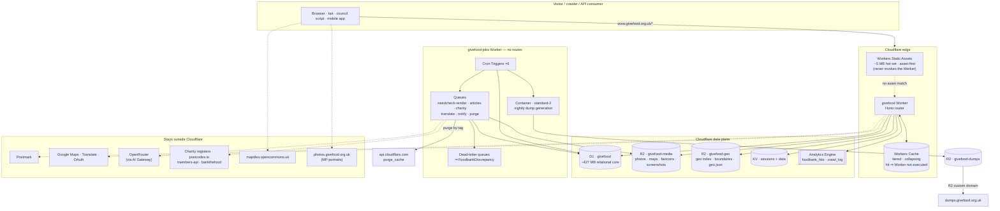

---

### 3.2 Framework and templating

#### Decision: Hono + Nunjucks precompiled at build time

**Nunjucks is a Jinja2 port; Django's template language is Jinja2's sibling.** That is the whole argument and it is decisive. Measured across the real template tree (`find */templates -name '*.html' | wc -l` and friends):

| Construct | Count | Nunjucks equivalent |
|---|---:|---|
| `` / `` | 594 | identical |
| `` | 562 | `{{ url('name', args) }}` — regex + a generated reverse table |
| `` / `` | 304 | identical (`` → ``) |
| `` | 211 | custom extension, ~100 lines |
| `` | 163 | identical |
| `` | 133 | identical, context inherits |
| `` | 115 | identical |
| `` | 110 | deleted |
| `` | 145 | `{{ _("…") }}` |
| `` | 20 | `{{ csrf_token() }}` global |

Roughly **90% of the port is a regex transpiler**, written once as `tools/django-to-njk/` and kept in the repo as the migration's audit trail so it can be re-run when Django templates change mid-migration.

**The template inventory is 181 files, not 148.** Counted: 149 `.html` + 16 `.txt` + 10 `.md` + 6 `.xml`. The non-HTML files carry the *strictest* fidelity requirements and must not be forgotten:

| File | Why it matters |
|---|---|
| `gfoffline/templates/foodbank_need_prompt.txt` (4,663 B) | The need-extraction prompt for all ~1,024 open food banks. A whitespace change alters what the model extracts. |
| `gfoffline/templates/foodbank_detail_prompt.txt` | Discrepancy detection prompt. |
| `gfoffline/templates/categorisation_prompt.txt` | Item categorisation. |
| `gfadmin/templates/admin/prompts/check.txt`, `orderline_prompt.txt` | AI check and order parsing. |
| 6 `.xml` | Public RSS feed and all sitemaps. |
| 10 `.md` | The `/md/` mirror, whitespace-sensitive, advertised to LLM crawlers. |

All five prompt templates go through `render_to_string()` (`givefood/utils/crawlers.py:414`, `gfoffline/views.py:90,184`, `gfadmin/views.py:1002,3477`, `givefood/models/orders.py:136,262`), so they need the same engine and identical variable semantics.

#### The non-negotiable implementation detail

`eval()` and `new Function` are **banned on Workers**. Every JS template engine compiles via `new Function`.

- Build step runs `nunjucks.precompile()` → plain JS modules.
- Runtime imports **`nunjucks/browser/nunjucks-slim`** (~20 KB gzip, no compiler).
- Importing plain `nunjucks` throws `EvalError: Code generation from strings disallowed for this context` **at runtime, not build time**, and will pass any test that mocks the renderer.

```jsonc
// .eslintrc — this is a lint rule, not a matter of vigilance
{
  "rules": {
    "no-restricted-imports": ["error", {
      "paths": [{
        "name": "nunjucks",
        "message": "Import nunjucks/browser/nunjucks-slim. The full build reaches new Function and throws EvalError on Workers."
      }]
    }]
  }
}
```

#### Rejected alternatives

| Option | Why rejected |
|---|---|
| **React Router v8 / Remix** | Cloudflare supports it well, but ``/`` has no analogue, so all 149 HTML templates become hand-written components with zero mechanical transfer. It also ships a client React runtime to people looking for a food bank on a constrained connection, and burns meaningfully more CPU per render on a site that is almost entirely server-rendered content. |
| **Astro** | Closest runner-up. Content-site orientation and zero-JS output genuinely suit the public pages. But `<slot />` is not named-block override, so the 304 blocks need restructuring; file-based routing fights `i18n_patterns` and the 562 named-URL reverses; and it says nothing about gfadmin's 47 form-heavy templates. |
| **Eta** | Fast, tiny, has a precompile story — but EJS-flavoured syntax means a full rewrite of all 181 files, and `layout()` is not block inheritance. |
| **Handlebars** | Its runtime build is genuinely eval-free, which is its one advantage. But it is deliberately logic-less: no ``, no arbitrary expressions, no inheritance. All 594 `` blocks would need custom helpers. |
| **itty-router instead of Hono** | Smaller, but no middleware model — and Django's `MIDDLEWARE` list maps 1:1 onto Hono's onion. The size saving is irrelevant against a 10 MB budget. |

#### Filters and tags

`givefood/templatetags/custom_tags.py` defines **4 filters and zero custom tags** — `friendly_phone`, `full_phone`, `friendly_url`, `comma_separated`, each a one-line delegate to `givefood/utils/text.py`. Port them verbatim.

The other 24 are Django stdlib/humanize. `Intl.DateTimeFormat`, `Intl.NumberFormat` and `Intl.RelativeTimeFormat` cover `date`, `intcomma`, `floatformat`, `filesizeformat`, `timesince` and `naturaltime` across all 21 locales with no date library.

`|bulma` (django-bulma, 8 uses, admin forms only) has no port path. **Hand-write the six affected forms.** Real work hiding behind a small usage count — budget a day.

#### Two semantic gotchas a regex cannot catch

1. **Django auto-calls callables in templates.** `{{ obj.get_absolute_url }}` invokes the method; Nunjucks renders the function object. Write a script that cross-references every `{{ x.y }}` against the 33 model classes and appends `()`. Do not assume there are none — this silently ships garbage that no status-code test catches.
2. **Django fails silently on missing variables** (renders `''`); Nunjucks renders `undefined` or throws. Set `throwOnUndefined: false` plus a global undefined→`''` coercion, or literal `undefined` reaches production HTML.

#### i18n — 21 languages, catalogues unchanged

The `.po` files stay in the repo as the source of record and stay byte-compatible with `makemessages`, so any translator workflow survives.

- Build step compiles each `locale/<lang>/LC_MESSAGES/django.po` (285 msgids each) → `packages/i18n/dist/<lang>.js`, dropping empty and fuzzy entries so misses fall through to the msgid, exactly as gettext does.
- **Lazy `import()` keyed on the resolved locale.** Statically importing 20 catalogues means parsing all of them inside the 1 s startup window in order to use one.
- `` becomes a Nunjucks extension reproducing Django's `%(name)s` placeholder semantics. This is the highest-value piece of the i18n port: all 211 blocktrans blocks and all 20 catalogues transfer **unmodified**.
- The `` island at `gfwfbn/templates/wfbn/index.html:189-191` (which forces the `?item=` option *value* to English while translating the label) ports as an explicit `t(key, 'en')` call.
- The language table for `name_local` and `bidi` is hand-written: `gu` and `tlh` are injected into Django's `LANG_INFO` at `settings.py:216-231` and do not exist upstream. `ar` and `ur` are the only RTL entries.

**Delete `gfadmin/locale/`** — 20 directories, one msgid (`"Search"`), empty `msgstr` in every language. 160 KB translating nothing.

**Delete four dead constant modules** confirmed to have zero importers repo-wide: `givefood/const/topplaces.py` (13.5 KB), `parlcon_mp.py` (26 KB), `parlcon_party.py` (24.8 KB), `item_classes.py` (5.9 KB). Their only references are four lines in `givefood/README.md`.

---

### 3.3 Binding map

> **Confirmed 2026-08-30: the provisioned `givefood` D1 database (`1cae445f-9719-453d-9cf6-1060f8b3ea7e`) has read replication enabled.** This plan's D1 platform research never actually covered the Sessions API despite being scoped to (see the unresolved "D1 Sessions API and read replication" item that should have landed here and didn't) -- a real gap, not a stated decision. Read replicas mean a read can land on a replica that hasn't caught up with a just-completed write, so the data-access layer (`packages/db`, WP 2.2) MUST use the [D1 Sessions API](https://developers.cloudflare.com/d1/best-practices/read-replication/#use-sessions-api) (`env.DB.withSession()`), propagating the returned bookmark across a request (and, for the admin's read-after-write flows, across requests -- e.g. in the session/response) rather than calling `env.DB.prepare()` on the binding directly. Bare `prepare()` calls will work in every local/dev test and intermittently return stale data in production, which is exactly the failure mode this note exists to prevent. Add this to the WP 2.2 acceptance criteria when that phase is scoped.

#### Worker `givefood`

| Binding | Type | Name | Purpose |
|---|---|---|---|
| `DB` | D1 | `givefood` | The relational core, ~427 MB measured. **Read replication is enabled -- use the Sessions API, not bare `prepare()`. See the note above.** |
| `MEDIA` | R2 | `givefood-media` | PlacePhoto derivatives, static map PNGs, favicons, screenshots |
| `GEO` | R2 | `givefood-geo` | `geo/index.bin` point set; constituency and location boundaries; precomputed `geo.json` |
| `ASSETS` | Assets | `./dist/static` | ~5 MB hot static set (css/js/fonts/small img) |
| `SESSIONS` | KV | `givefood-sessions` | Admin sessions, 12 h TTL |
| `DATA` | KV | `givefood-data` | Slug-redirect map, site stats, `/frag/` payloads, all-foodbanks/all-locations blobs |
| `HITS` | Analytics Engine | `foodbank_hits` | Per-request hit beacon |
| `PURGE_Q` | Queue producer | `cache-purge` | Cache-tag purges from admin writes |
| `JOBS_Q` | Queue producer | `jobs` | Admin-triggered work: article crawl, notifications, photo backfill |
| `SITE_DOMAIN` | var | — | `https://www.givefood.org.uk` |
| `GOOGLE_OAUTH_CLIENT_ID` | var | — | `927281004707-…apps.googleusercontent.com` |
| `TURNSTILE_SITEKEY` | var | — | `0x4AAAAAAABxtIRWlPcEGwhj` |
| `GOOGLE_OAUTH_CLIENT_SECRET` | secret | — | OAuth code exchange |
| `SESSION_HMAC_KEY` | secret | — | Signs the session and CSRF cookies |
| `SUBSCRIBER_SALT` | secret | — | Used only when generating *new* `sub_key`/`unsub_key`; existing keys are stored column data and migrate with the table |
| `TURNSTILE_SECRET` | secret | — | siteverify for the three public forms |
| `GMAP_STATIC_KEY`, `GMAP_PLACES_KEY`, `GMAP_GEOCODE_KEY` | secrets | — | Only reached from queued backfill and `?address=` geocoding |
| `POSTMARK_TOKEN` | secret | — | Subscribe/confirm, flag, registration, write-to-MP |
| `CF_API_KEY`, `CF_ZONE_ID` | secrets | — | Cache-tag purge |

#### Worker `givefood-jobs`

| Binding | Type | Name | Purpose |
|---|---|---|---|
| `DB` | D1 | `givefood` | Same database |
| `MEDIA`, `GEO`, `DUMPS`, `OPS` | R2 | 4 buckets | Media ingest; geo index rebuild; dump output; source CSVs out of the repo |
| `BROWSER` | Browser Rendering | — | `/markdown` Quick Action for needcheck; `/screenshot` for the five screenshot routes |
| `NEEDCHECK`, `DUMP` | Workflow | — | See §3.10 for why needcheck is *probably not* a Workflow |
| `RENDER_Q`, `ARTICLES_Q`, `CHARITY_Q`, `TRANSLATE_Q`, `NOTIFY_Q`, `PURGE_Q`, `JOBS_Q` | Queue producer + consumer | — | Fan-out per job family |
| `*_DLQ` | Queue | — | One dead-letter queue per family; **the consumer writes a `FoodbankDiscrepancy`** |
| `HITS`, `CRAWLS` | Analytics Engine | — | Rollup source; crawl aggregates |
| `OPENROUTER_KEY` | secret | — | Via AI Gateway |
| `CF_BROWSER_TOKEN`, `CF_ACCOUNT_ID` | secrets | — | Browser Rendering |
| `GCP_TRANSLATE_KEY` | secret | — | 19-language need translation |
| `EW_CHARITY_KEY`, `SCOT_CHARITY_KEY` | secrets | — | Charity registers |
| `POSTMARK_TOKEN`, `WHATSAPP_TOKEN`, `FIREBASE_SERVICE_ACCOUNT`, `VAPID_PRIVATE_KEY`, `VAPID_PUBLIC_KEY`, `VAPID_ADMIN_EMAIL` | secrets | — | Notification channels |

**`GfCredential` (43 rows) and `get_cred()` are deleted.** Every secret becomes a Worker secret. The half-dozen shared between both Workers (`CF_API_KEY`, `POSTMARK_TOKEN`, `GMAP_*`) go in **Secrets Store** so there is one canonical copy and one rotation — noting it is open beta and its `.get()` is async, so it cannot sit in module scope.

The admin's `GET /admin/credential/<name>/`, which today returns any secret as `text/plain`, is deleted with the table.

---

### 3.4 `wrangler.jsonc`, annotated

```jsonc
// workers/site/wrangler.jsonc
{
  "$schema": "node_modules/wrangler/config-schema.json",
  "name": "givefood",
  "main": "./src/index.ts",

  // >= 2026-08-04 turns on nodejs_compat and nodejs_compat_v2 with no flag.
  // >= 2026-07-21 is required for the Workers Cache API used below.
  "compatibility_date": "2026-08-28",

  // ONE route, eventually. Most-specific-wins never has to be reasoned
  // about. During the build this same narrow-to-wide pattern
  // (/needs/at/*/photo.jpg, then /api/*, then /needs/*, then /* last) is
  // proven entirely against the proving-ground host (§10.1.1a) -- this
  // block stays commented out/disabled until the single launch, since
  // activating it here would intercept real production traffic on
  // www.givefood.org.uk the moment a deploy landed with it active.
  // "routes": [
  //   { "pattern": "www.givefood.org.uk/*", "zone_name": "givefood.org.uk" }
  // ],

  // Workers Cache. NOT optional on a catch-all route -- see 3.6.
  // Tiered, collapses concurrent misses, and serves hits WITHOUT
  // executing the Worker (so a hit costs 0 CPU-ms).
  "cache": { "enabled": true },

  "assets": {
    "directory": "./dist/static",
    "binding": "ASSETS",
    // BOTH "none" deliberately. The router owns trailing-slash policy
    // (Django's APPEND_SLASH). Letting the asset layer emit its own 301s
    // would fight the router and produce redirect chains across 3,000+
    // food bank URLs. "force-trailing-slash" only affects ASSET lookups
    // anyway -- it will look like it works on /static/ and do nothing else.
    "html_handling": "none",
    "not_found_handling": "none"
  },

  "d1_databases": [
    { "binding": "DB", "database_name": "givefood", "database_id": "<uuid>" }
  ],

  "r2_buckets": [
    { "binding": "MEDIA", "bucket_name": "givefood-media" },
    { "binding": "GEO",   "bucket_name": "givefood-geo"   }
  ],

  "kv_namespaces": [
    { "binding": "SESSIONS", "id": "<id>" },
    { "binding": "DATA",     "id": "<id>" }
  ],

  "analytics_engine_datasets": [
    { "binding": "HITS", "dataset": "foodbank_hits" }
  ],

  "queues": {
    "producers": [
      { "queue": "cache-purge", "binding": "PURGE_Q" },
      { "queue": "jobs",        "binding": "JOBS_Q"  }
    ]
  },

  "vars": {
    "SITE_DOMAIN": "https://www.givefood.org.uk",
    "GOOGLE_OAUTH_CLIENT_ID": "927281004707-tboi1tsphl4bgtqn72e76rmc7r2q22tk.apps.googleusercontent.com",
    "TURNSTILE_SITEKEY": "0x4AAAAAAABxtIRWlPcEGwhj"
  },

  // Declares required secret NAMES so `wrangler dev` and deploy both
  // fail loudly if one is missing. Values are set with `wrangler secret put`.
  "secrets": [
    "GOOGLE_OAUTH_CLIENT_SECRET", "SESSION_HMAC_KEY", "SUBSCRIBER_SALT",
    "TURNSTILE_SECRET", "POSTMARK_TOKEN",
    "GMAP_STATIC_KEY", "GMAP_PLACES_KEY", "GMAP_GEOCODE_KEY",
    "CF_API_KEY", "CF_ZONE_ID"
  ],

  "observability": { "enabled": true, "head_sampling_rate": 1 },

  // 30s is ample: HTML rendering is I/O-bound and waiting on D1 does not
  // count toward CPU. Raise only if a gfdash aggregation says otherwise.
  "limits": { "cpu_ms": 30000 },

  // Smart Placement pins compute near a origin database it's latency-bound
  // on. There is no such origin here -- every binding is D1/R2/KV, not a
  // single-region Postgres -- so this is skipped, not "measured before
  // keeping" as an earlier draft (written when Hyperdrive-behind-Postgres
  // was still the design) had it.
  // "placement": { "mode": "smart" },

  "preview_urls": true,

  "tail_consumers": []
}
```

```jsonc
// workers/jobs/wrangler.jsonc -- differs by having NO routes and NO assets
{
  "name": "givefood-jobs",
  "main": "./src/index.ts",
  "compatibility_date": "2026-08-28",

  // Verified against production CrawlSet data: ONE need sweep per day at
  // ~15:00 UTC. docs/crons.md documents 4x daily and is WRONG.
  // Reconcile against the Coolify scheduled-task config before deploying.
  "triggers": {
    "crons": [
      "0 15 * * *",        // needcheck  (was 45 7,11,15,19 in docs -- see above)
      "20 8-22/2 * * *",   // getarticles
      "30 5 * * *",        // charityinfo
      "30 4 * * *",        // dump
      "30 3 * * 0",        // days_between_needs  (one SQL statement, not a fan-out)
      "10 3 * * *",        // crawlitem retention prune (repurposed slot)
      "*/5 * * * *"        // /frag/ payload refresh into KV
    ]
  },

  // Cron Triggers on a >= 1 hour interval get 15 min CPU;
  // sub-hourly gets 30s. The */5 job is trivial either way.
  "limits": { "cpu_ms": 300000 },

  "queues": {
    "producers": [
      { "queue": "needcheck-render", "binding": "RENDER_Q" },
      { "queue": "cache-purge",      "binding": "PURGE_Q"  }
    ],
    "consumers": [
      {
        "queue": "needcheck-render",
        "max_batch_size": 5,
        "max_batch_timeout": 30,
        "max_retries": 3,
        // Under Browser Rendering's 30 Quick Actions/sec paid ceiling,
        // and polite to food banks' own (often tiny) hosting.
        "max_concurrency": 25,
        // NON-NEGOTIABLE. Without a DLQ, "messages that repeatedly fail
        // processing will eventually be discarded" -- silently. The DLQ
        // consumer writes a FoodbankDiscrepancy so failures land in the
        // queue the maintainer already reads every day.
        "dead_letter_queue": "needcheck-render-dlq"
      },
      { "queue": "needcheck-render-dlq", "max_batch_size": 10, "max_retries": 1 },
      { "queue": "cache-purge", "max_batch_size": 100, "max_batch_timeout": 30,
        "max_retries": 3, "dead_letter_queue": "cache-purge-dlq" }
    ]
  },

  "browser": { "binding": "BROWSER" },
  "d1_databases": [{ "binding": "DB", "database_name": "givefood", "database_id": "<uuid>" }],
  "r2_buckets": [
    { "binding": "MEDIA", "bucket_name": "givefood-media" },
    { "binding": "GEO",   "bucket_name": "givefood-geo"   },
    { "binding": "DUMPS", "bucket_name": "givefood-dumps" },
    { "binding": "OPS",   "bucket_name": "givefood-ops"   }
  ],
  "analytics_engine_datasets": [
    { "binding": "HITS",   "dataset": "foodbank_hits" },
    { "binding": "CRAWLS", "dataset": "crawl_log"     }
  ],
  "observability": { "enabled": true, "head_sampling_rate": 1 }
}
```

Run `wrangler types` in each Worker directory and **commit the output**. Hand-written `Env` interfaces drift from the config.

---

### 3.5 Request lifecycle

Hono's onion middleware model maps 1:1 onto Django's `MIDDLEWARE` list, in the same order.

```ts
// workers/site/src/index.ts
const app = new Hono<{ Bindings: Env; Variables: Vars }>();

app.use('*', serverTiming);          // was RenderTime -- see below
app.use('*', slugRedirect);          // was SlugRedirectMiddleware
app.use('*', resolveLanguage);       // was LocaleMiddleware + i18n_patterns
app.use('*', geoJsonPreload);        // was GeoJSONPreload (runs after routing)

app.route('/needs',     wfbnApp);
app.route('/api',       apiApp);     // dual-mounted at /api and /api/2 -- see below
app.route('/dashboard', dashApp);
app.route('/write',     writeApp);
app.route('/dumps',     dumpsApp);
app.route('/auth',      authApp);
app.route('/admin',     adminApp);   // adminApp.use('*', requireGoogleSession)
app.route('/',          publicApp);

app.notFound(appendSlashThen404);    // was CommonMiddleware APPEND_SLASH
export default app;
```

| Django middleware | Target | Notes |
|---|---|---|
| `SecurityMiddleware` | Cloudflare + response headers | Set explicitly in the Worker; `_headers` does **not** apply to Worker-generated responses. |
| `GZipMiddleware` | Cloudflare edge | Automatic. Delete. |
| `CommonMiddleware` (`APPEND_SLASH`) | `app.notFound()` handler | See below. |
| `WhiteNoiseMiddleware` | Workers Static Assets | Asset-first routing. |
| `SessionMiddleware` | KV sessions, admin only | See below — and public pages must emit **no** `Set-Cookie`. |
| `MessageMiddleware` | Deleted | Only used by the admin; replaced by a query-param flash. |
| `LocaleMiddleware` + `i18n_patterns` | `resolveLanguage` | See below. |
| `SlugRedirectMiddleware` | `slugRedirect` | 57 rows from `DATA` KV. Bug fixed — see below. |
| `LoginRequiredAccess` | `requireGoogleSession` on `/admin/*` | OAuth ported to the Worker per the maintainer's decision. |
| `OfflineKeyCheck` | **Deleted** | `/offline/` ceases to be an HTTP surface. |
| `GeoJSONPreload` | `geoJsonPreload` | Trivial `Link:` header. |
| `RenderTime` | `serverTiming` | **Not a body rewrite** — see below. |
| `RedirectToWWW` | **Deleted** | Becomes a zone Redirect Rule; `origin.givefood.org.uk` ceases to exist. |

#### Language resolution — reproduce exactly, do not "improve"

Verified live against production. There are exactly two rules:

1. **The URL path prefix wins, and is the only thing that ever wins.**
2. **No prefix ⇒ hard-coded `en`.** Session, cookie and `Accept-Language` are all computed by Django and then *discarded*.

```ts
const PREFIXES = new Set([
  'pl','cy','bn','ro','pa','ur','ar','gu','es','pt','gd',
  'ga','it','ta','fr','lt','zh-hans','tr','bg','tlh',
]);   // 20 -- 'en' is NOT here, and /en/ must 404 (it 404s today)

export const resolveLanguage: MiddlewareHandler = async (c, next) => {
  const url = new URL(c.req.url);
  const first = url.pathname.split('/')[1] ?? '';
  const prefixed = PREFIXES.has(first);

  c.set('lang', prefixed ? first : 'en');
  c.set('pathAfterPrefix', prefixed ? url.pathname.slice(first.length + 1) : url.pathname);

  await next();

  // Reproduce Django's header contract exactly.
  c.header('Content-Language', c.get('lang'));
  // Vary: Accept-Language appears ONLY when no prefix matched. This is why
  // /de/ (404) carries it and /en/ (404) does not. Cosmetic today, but it is
  // in the wire contract and third parties may read it.
  if (!prefixed) c.header('Vary', 'Accept-Language', { append: true });
};
```

**Do not add content negotiation.** It would change behaviour for every visitor and fragment the edge cache 21-fold, directly undermining the caching strategy that goal 1 depends on.

`translate_url()` reduces to leading-segment arithmetic, because **no URL path segment is translated** — every `path()` in `givefood/urls.py`, `gfwfbn/urls/i18n.py` and `gfwfbn/urls/md.py` uses literal English strings. That single fact removes the need for a reverse-URL engine and is worth several days.

`page_translatable` becomes a static set-membership test against the routes inside `i18n_patterns`, driving the language switcher and the 21 `hreflang` links.

#### `APPEND_SLASH`

No platform equivalent. `html_handling: "force-trailing-slash"` only affects **static asset lookups** — reaching for it will appear to work on `/static/` and do nothing for the 3,000+ food bank URLs that actually need it.

```ts
app.notFound(async (c) => {
  const url = new URL(c.req.url);
  if (!url.pathname.endsWith('/')) {
    url.pathname += '/';
    if (app.router.match(c.req.method, url.pathname).length) {
      return c.redirect(url.toString(), 301);   // Django's APPEND_SLASH is a 301
    }
  }
  return c.html(await render404(c), 404);
});
```

#### Slug redirects — and the bug we must decide on

`givefood/middleware.py:171` uses `r'^(/[a-z]{2})?/needs/at/([-\w]+)(/[-\w]+)?/?$'`. The `[a-z]{2}` **cannot match `zh-hans` or `tlh`**, so renamed food banks silently fail to redirect in exactly those two languages today. Match against the known 20-prefix set instead. This is a fix, and it must be recorded as a deliberate behaviour change.

The 57-row map lives in `DATA` KV as one JSON value, memoised in module scope for 300 s. D1 remains the editable source of truth.

#### `RenderTime` — do not port as a body rewrite

`response.content.replace(b"PUTTHERENDERTIMEHERE", …)` runs on **every** response including `image/jpeg` and `application/json`, forces full buffering, and is fundamentally incompatible with streaming an R2 object body — which is exactly the mechanism the photo migration depends on.

Replace with `Server-Timing: render;dur=N`. If the visible HTML comment must survive, use `HTMLRewriter` gated on `Content-Type: text/html` so binary and JSON stream untouched.

**Trap:** `Date.now()` does not advance during code execution on Workers — a literal port reports 0 ms for everything. Use `performance.now()`, and expect timer coarsening even then.

#### Admin auth — Google OAuth in the Worker

The maintainer chose to port the OAuth flow rather than adopt Cloudflare Access.

1. `/auth/` renders the sign-in page.
2. `/auth/start` generates `state` (32 random bytes) + a PKCE `code_verifier`, stores both in a short-lived `__Host-oauth` cookie (`Secure; HttpOnly; SameSite=Lax; Path=/; Max-Age=600`), redirects to Google with `scope=openid email profile` and `hd=givefood.org.uk`.
3. **`/auth/receiver/` — keep this exact path.** It is a registered redirect URI in the Google Cloud console. Validates `state`, exchanges the code with `client_secret` + `code_verifier`, verifies the ID token against Google's JWKS (`https://www.googleapis.com/oauth2/v3/certs`, RS256 via `crypto.subtle`, **cached by `kid` — keys rotate**), checks `iss`, `aud`, `exp`, `nbf`.
4. **The gate is unchanged:** `email_verified === true && hd === "givefood.org.uk"`. That is the entire access-control model today and it stays.

**Session store: KV.** Sessions are small, short-lived and read on *every* admin request; KV edge-cached reads are single-digit milliseconds. D1 would mean a read-and-touch per request against a single-threaded database. Signed stateless cookies avoid a store but make revocation impossible — unacceptable for an admin that can publish to 3,000 food bank pages and mail thousands of subscribers. Cookie: `__Host-gfsession`, `Secure; HttpOnly; SameSite=Lax; Path=/`. 12 h TTL, sliding refresh under 1 h remaining. Logout deletes the KV key *and* clears the cookie.

The one honest cost: **KV is eventually consistent, so a logout can take up to ~60 s to propagate globally.** A session created and then read by the same person in the same colo is fine.

**CSRF is fixed, not reproduced.** `CsrfViewMiddleware` is commented out at `settings.py:97`, so the 20 `` tags are decorative and every mutating admin POST — including `need_notifications`, which mails thousands of subscribers — is currently open. Implement `SameSite=Lax`, **plus** an `Origin`/`Sec-Fetch-Site` check on every mutating request, **plus** the double-submit token the templates already emit. Also close the GET-mutation holes at `order_delete`, `donationpoint_delete`, `discrepancy_action`, `clearcache`, `credentials_decache` and the six loaders — `<body data-instant-allow-query-string>` means a prefetcher can fire them today.

`/admin/proxy/?url=` is load-bearing (four templates iframe it so reviewers see the source page beside the AI's extraction) and is a full SSRF. Port it with an allowlist derived per request from `Foodbank.url`, `shopping_list_url`, `locations_url`, `contacts_url`, `donation_points_url`.

#### Two small things that are easy to miss

- **`/favicon.ico` is not routed today.** `givefood/static/img/favicon.ico` exists (15,086 B) but `page.html:12-13` links only the `.svg` and `.png`, and there is no URL pattern. Every browser and unfurler requests it unconditionally, and under a catch-all route that becomes a billed Worker 404. Put the file in `dist/static/` so asset-first routing serves it for free.
- **Public HTML must emit no `Set-Cookie`.** `SessionMiddleware` and `MessageMiddleware` are both active today. A `Set-Cookie` on a cached path makes the response uncacheable to both Cloudflare and the Cache API, which would silently nullify the entire caching design. **Verify with `curl -sI https://www.givefood.org.uk/needs/at/<slug>/ | grep -i set-cookie` before anything else in Phase 0.** It is a five-minute check guarding the phase that carries goal 1.

---

### 3.6 Caching architecture

#### The fact that shapes everything

> **Workers run *before* the cache on a Worker route.**

On a catch-all `www.givefood.org.uk/*` route, a zone Cache Rule does **not** protect the Worker. The zone cache sits between the Worker and any origin it fetches, not between the eyeball and the Worker. Every request invokes the Worker.

Therefore **Workers Cache (`ctx.cache`, `"cache": { "enabled": true }`) is not an optimisation — it is what makes the catch-all route viable.** Its three properties are exactly the ones needed:

- **Serves hits without executing the Worker** — zero CPU billed on a hit.
- **Tiered** — a cold colo checks an upper tier before reaching D1 or R2.
- **Collapses concurrent misses** — a burst on a cold food bank page invokes the Worker once, not 200 times.

`caches.default` (the older Cache API) has none of these: it is per-colo and does not collapse, so on a ~300-PoP network a cold object means up to ~300 independent misses.

Two caveats to design around, both real:

1. **The Workers Cache key includes the Worker version.** Every deploy is a cold cache. That interacts badly with goal 3 — see §3.7 for the cost consequence on media routes, and the mitigation (precomputed R2 derivatives, so a cold cache costs an R2 Class B, not a Google API call).
2. **Workers Cache purge is rate-limited at Free-tier rates (5/min) regardless of account plan.** Batching to 100 tags per call is mandatory, not an optimisation.

#### Which layer applies when

| When | HTML caching mechanism | Notes |
|---|---|---|
| Pre-launch (Phase 0 through however many phases get built) | **Zone Cache Rules, on Django, for 100% of production** | This is where the goal-1 win lands, immediately, before any Worker code touches real traffic. Every Worker route in Phases 1–4 is proven against the proving-ground host in the meantime (§10.1.1a) — there is no live split between Django-served and Worker-served production routes at any point pre-launch. |
| Post-launch | **Workers Cache only** | Zone Cache Rules become irrelevant the moment the single launch flips every route to the Worker at once. |
| `dumps.givefood.org.uk` (R2 custom domain, no Worker) | **Zone Cache Rule, permanently** | CSV/JSON/XML are not default-cacheable — see §3.8. |

#### Replacing the two locmem tiers

`givefood/settings.py:169-185` has two deliberately-separated caches. They are replaced by different things.

**Tier 1 — `default` (`cache_page` output, `MAX_ENTRIES: 3000`).** Deleted. Set explicit `Cache-Control: public, max-age=N` matching `givefood/const/cache_times.py` and let the cache do it:

| Constant | Seconds | Routes |
|---|---:|---|
| `SECONDS_IN_HOUR` | 3600 | `/`, country pages + geojson, `/needs/`, `/news/`, `/md/`, managed donations, service workers, `openinghours` |
| `SECONDS_IN_DAY` | 86400 | `/manifest.json`, `/apps/`, `/flag/`, `/aac/`, foodbank sub-pages, all `/md/needs/` bar nearby |
| `SECONDS_IN_WEEK` | 604800 | All `geo.json`, all media routes, `/nearby/`, constituencies, sitemaps, `/about-us/`, `/donate/`, `/privacy/`, `/colophon/`, `/bot/`, annual reports, `llms.txt`, `robots.txt`, `security.txt` |
| `SECONDS_IN_MONTH` | 2419200 | `/api/1/foodbanks/`, `/api/1/foodbank/<slug>/`, `/api/2/locations/` |

**`/needs/at/<slug>/` needs an explicit TTL decision.** Its `@cache_page` is commented out at `gfwfbn/views.py:362`, so it emits no `Cache-Control` at all today. A rule set to "respect origin" does nothing for the single highest-traffic page family on the site. Give it `SECONDS_IN_DAY` plus tag-based invalidation, so a published need is visible immediately and everything else is edge-served.

This is strictly better than today regardless: locmem is per-gunicorn-worker, so with `workers = 4` there are four divergent copies and `decache()` clears exactly one.

**Tier 2 — `data` (expensive objects, `MAX_ENTRIES: 500`).** Split by what each entry actually is:

| Contents | Goes to |
|---|---|
| `get_cred()` — 43 credentials | **Worker secrets / Secrets Store.** Never KV. |
| `get_slug_redirects()` — 57 rows | `DATA` KV, one JSON value, module-scope memo 300 s |
| `get_site_stats()` — 5 aggregate queries | `DATA` KV, 3600 s, refreshed by cron |
| `get_all_foodbanks/locations/open_*` | `DATA` KV as compact JSON (1,071 + 1,974 rows ≈ 1–3 MB, inside the 25 MiB value cap — **measure before committing**) |
| `get_all_constituencies()` | `DATA` KV, `boundary_geojson` already deferred |

#### Purge: cache tags, not URLs

**Purge by cache tag left Enterprise in April 2025 and is available on Free, Pro, Business and Enterprise.** This is the single most consequential platform finding for this site.

Emit from the Worker on every cacheable response, with the language **deliberately omitted** from the food-bank tag:

```ts
c.header('Cache-Tag', [`fb-${slug}`, 'needs-index', 'api-v2'].join(','));
```

One tag then clears all 21 language variants, plus `/md/`, plus every API representation, in one operation.

The arithmetic. `Foodbank.save(do_decache=True)` at `givefood/models/foodbank.py:717-758` builds, per food bank: one prefix per language for `wfbn:foodbank`, four page URLs × 21 languages, plus six API prefixes and seven API URLs — roughly **90 URLs and 26 prefixes each**. Rebuilding all 3,000 food banks by URL is ~90,000 targets. **By tag it is 3,000 tags at 100 per API call = 30 calls.** On Free's 5 purge-requests/minute that is six minutes for a total rebuild; on Pro it is six seconds.

```ts
// producer -- called from any write path
await env.PURGE_Q.send({ tags: [`fb-${slug}`] });

// consumer in givefood-jobs -- dedupes and batches
export async function purgeConsumer(batch: MessageBatch<{tags: string[]}>, env: Env) {
  const tags = [...new Set(batch.messages.flatMap(m => m.body.tags))];
  for (let i = 0; i < tags.length; i += 100) {          // 100 ops/request, NOT 30
    await fetch(
      `https://api.cloudflare.com/client/v4/zones/${env.CF_ZONE_ID}/purge_cache`,
      { method: 'POST',
        headers: { 'Authorization': `Bearer ${env.CF_API_KEY}`,
                   'Content-Type': 'application/json' },
        body: JSON.stringify({ tags: tags.slice(i, i + 100) }) }
    );
  }
  batch.ackAll();
}
```

Two fixes taken while in there:

- `givefood/utils/cache.py:183` hardcodes `url_limit = 30` with a comment claiming 30 is the cap. **The documented figure is 100** operations per request — a free 3.3× reduction in API calls, and worth applying to the *existing* Django code in Phase 0.
- Prefix purges cannot target query strings (purging `/foo` *does* clear `/foo?a=b`, but you cannot purge `/foo?a=b`). Worth a comment so nobody debugs it at 2am.

Routing purges through a Queue also solves the burst problem: a bulk import saving 500 food banks produces one deduped batch, not 500 racing API calls.

#### `/frag/` — the highest-volume dynamic endpoint

`givefood/templates/public/page.html:61-62` puts two `data-include` spans in the footer of **every page**, both with `data-update="130"`. `csi.js` fetches them on `DOMContentLoaded` and every 130 seconds thereafter. `need-hits` currently aggregates `SUM(hits)` over 709,644 rows per call, uncached.

| Frag | Target |
|---|---|
| `last-updated` | Precomputed into `DATA` KV by the `*/5` cron; served `Cache-Control: public, max-age=120`. Zero database work per request. |
| `need-hits` | Same. |
| `news` | Cached 1 h. |
| `ip-address` | Stays uncached and per-user, reading `CF-Connecting-IP` (already the first source in `get_user_ip`). |

#### Cache Rules to create

Watch the per-zone budget: **Free 10, Pro 25, Business 50.** This design needs about eight, so Free is workable — but confirm the zone's plan before designing a ninth.

| Match | Behaviour |
|---|---|
| `/static/*` | Eligible, Edge TTL 1 year, `immutable` |
| HTML surface | Eligible, Edge TTL from origin `Cache-Control` (Phase 0 only) |
| `dumps.givefood.org.uk/*` | **Eligible** — CSV/JSON/XML are not default-cacheable |
| `/aac/`, `/frag/*`, `/api/*` | Eligible, per-route TTL |

Enable **Smart Tiered Cache** (free, all plans) so misses concentrate on one upper tier.

#### ⚠️ The API language trap — must be resolved before any API caching

`gfapi2/views.py:85` and `:508` emit `foodbank.full_name()` and `location.full_name()`, which branch on `get_language()` (`givefood/models/foodbank.py:261-279` — Welsh returns `alt_name`, and `cy`/`gd` invert the word order). The API is mounted **outside** `i18n_patterns` (`givefood/urls.py:93-96`), so `LocaleMiddleware` derives the language from `Accept-Language`. And `@cache_page` runs *inside* the middleware stack, so the cache key is learned before `Vary: Accept-Language` is patched on — and Cloudflare only honours `Vary` for `Accept-Encoding` anyway.

Today the blast radius is one locmem cache per gunicorn worker. **A Cache Rule on `/api/*` makes it one global edge entry for up to a month.**

**Resolve this in Phase 0, before enabling API caching.** The recommended fix is one line in Django: activate `en` unconditionally in the API views, pinning the API to English. That is a deliberate, testable change and it makes the responses cacheable. The alternative — preserving the language-dependent behaviour — requires adding `Accept-Language` to the cache key and carrying the gettext catalogue into the API layer, for a behaviour that is currently an accident rather than a feature. **This needs the maintainer's decision, and it is on the open-questions list.**

#### Assumed hit ratio, and why it barely matters for cost

Design target: **>97% cache hit ratio on `/needs/at/<slug>/`**. Achievable because these pages change only when a need is published, and a tag purge is precise rather than blanket.

Sensitivity, at a poor 70%: ~3× the Worker executions and ~3× the D1 rows read, still comfortably inside the 25-billion-rows-read allowance. **Because requests are billed whether they hit the Worker cache or invoke the Worker, cache hit ratio is a latency and D1-load lever, not a cost lever.** That decouples goal 1 from money, which is freeing.

What *would* hurt is an unindexed query on a hot path: D1 bills rows **scanned**, so one full scan of `postcode` is 1,794,776 billable rows and ~14,000 of those exhaust the monthly allowance. **Make `EXPLAIN QUERY PLAN` showing `SCAN` a CI failure.**

> ⚠️ **Needs verification:** whether a Workers Cache *hit* is billed as a Workers request. The delivery cost model assumes it is, and that assumption drives roughly half the estimate. Confirm against a live meter during Phase 1 rather than from documentation.

---

### 3.7 Media routes — PlacePhoto and the three families that were missing

#### The routes, all same-origin, all on `www.givefood.org.uk`

All of these are registered at `givefood/urls.py:14` → `gfwfbn/urls/generic.py`, **outside `i18n_patterns`**, except the map routes which are inside it. The photo, favicon and screenshot routes therefore have **one URL each, not 21**.

| Route | Count | Today | Target |
|---|---:|---|---|
| `/needs/at/<slug>/photo.jpg` | 1,071 | `PlacePhoto.blob` from Postgres; on miss, 2 synchronous Google Places calls **plus an INSERT inside the user's request** | R2 read |
| `/needs/at/<slug>/<locslug>/photo.jpg` | 1,974 | same | R2 read |
| `/needs/at/<slug>/donationpoint/<dpslug>/photo.jpg` | 5,745 | same | R2 read |
| `/needs/at/<slug>/map.png`, `/maps/<size>.png` | 1,071 × 3 | **Live proxy to `maps.googleapis.com/maps/api/staticmap` with no persistence** (`gfwfbn/views.py:485`) | R2 read |
| `/needs/at/<slug>/<locslug>/map.png`, `/maps/<size>.png` | 1,974 × 3 | same | R2 read |
| `/needs/at/<slug>/favicon.png` | 1,071 | **Live fetch of `google.com/s2/favicons` per cache miss**; 5 per homepage render | R2 read |
| `/needs/at/<slug>/donationpoint/<dpslug>/favicon.png` | 5,745 | same | R2 read |
| `/needs/at/<slug>/screenshots/(homepage\|shoppinglist\|donationpoints\|contacts\|locations).png` | 1,071 × 5 | **Live Cloudflare Browser Rendering call, `waitUntil: networkidle0`, 45 s timeout** | R2 read |

**Why the last three families must move too, and why it is urgent.** They are `og:image` targets on seven page types, so social and chat unfurlers hotlink them. They have no persistence beyond `@cache_page`. And the Workers Cache key includes the Worker version — so **every deploy cold-starts these caches and re-triggers thousands of billed third-party API calls.** Goal 3 (quicker deploys) would directly increase the Google Maps and Browser Rendering bills. Precomputing to R2 removes that coupling entirely and is the reason this is architecture, not an optimisation.

#### Data model

Keep the `PlacePhoto` row, drop the blob (`givefood_placephoto`: 1,776 MB → ~4 MB):

```sql
CREATE TABLE placephoto (
  id                INTEGER PRIMARY KEY,
  place_id          TEXT,           -- unique; 0 NULLs; the lookup key
  photo_ref         TEXT,           -- 26 NULLs in production; UNIQUE is NULL-distinct in SQLite
  html_attributions TEXT,           -- see note below
  r2_key            TEXT NOT NULL,
  bytes             INTEGER NOT NULL,
  md5               TEXT NOT NULL,
  created TEXT, modified TEXT
);
CREATE UNIQUE INDEX placephoto_place_id_uniq  ON placephoto(place_id);
CREATE UNIQUE INDEX placephoto_photo_ref_uniq ON placephoto(photo_ref);
```

> **`html_attributions` is the empty string in all 7,117 production rows.** Earlier drafts described it as a Google Places licensing requirement "that must keep being surfaced". It is not currently being surfaced, because there is nothing in it. Carry the column (it costs nothing) but do not claim the migration preserves an attribution behaviour that does not exist. Flag it to the maintainer as a **pre-existing compliance question, separate from this work.**

#### Bucket layout

Key by the **URL path**, not by `place_id`. This removes the database from the media path entirely — the Worker becomes a single `env.MEDIA.get()` with no lookup and no D1 dependency, which is what makes the media routes the safest possible first thing to ship.

```
media/needs/at/<slug>/photo.jpg                        (+ /w150 /w300 /w540 variants — see below)
media/needs/at/<slug>/<locslug>/photo.jpg
media/needs/at/<slug>/donationpoint/<dpslug>/photo.jpg
media/needs/at/<slug>/map.png                          (600px default)
media/needs/at/<slug>/maps/300.png  /600.png  /1080.png
media/needs/at/<slug>/<locslug>/maps/300.png  /600.png  /1080.png
media/needs/at/<slug>/favicon.png
media/needs/at/<slug>/donationpoint/<dpslug>/favicon.png
media/needs/at/<slug>/screenshots/<page_name>.png
```

Slug changes are 57 rows over the site's entire history (`givefood_slugredirect`); the backfill rewrites the key when one happens.

Object metadata set at PUT:

```js
httpMetadata: {
  contentType: 'image/jpeg',                          // or image/png
  cacheControl: 'public, max-age=604800'              // matches @cache_page(SECONDS_IN_WEEK)
},
customMetadata: { photoRef, htmlAttributions, sourceEtag }
```

#### The route

```ts
// workers/site/src/routes/media.ts
// NOTE: registration order matters. The two-segment location route is the most
// general and MUST come after the donationpoint route -- exactly as in
// gfwfbn/urls/generic.py:12-17.
mediaApp.get('/at/:slug/photo.jpg',                          serveMedia);
mediaApp.get('/at/:slug/favicon.png',                        serveMedia);
mediaApp.get('/at/:slug/screenshots/:page{.+\\.png}',        serveMedia);
mediaApp.get('/at/:slug/donationpoint/:dp/photo.jpg',        serveMedia);
mediaApp.get('/at/:slug/donationpoint/:dp/favicon.png',      serveMedia);
mediaApp.get('/at/:slug/:loc/photo.jpg',                     serveMedia);

async function serveMedia(c: Context) {
  const url = new URL(c.req.url);

  // NORMALISE ?size= AWAY. photo_from_place_id() (givefood/utils/geo.py:107)
  // only honours it on the very first Google fetch; for a stored photo it is
  // ignored. Keeping it in the cache key fragments the cache on a parameter
  // that changes nothing.
  const key = 'media' + url.pathname;

  const inm = c.req.header('If-None-Match');
  const obj = await c.env.MEDIA.get(key, {
    onlyIf: inm ? { etagDoesNotMatch: inm.replace(/^W\//, '').replace(/"/g, '') } : undefined,
    range:  c.req.raw.headers,
  });

  if (obj === null) {
    // Missing object. Enqueue a backfill and 404 now -- the Google Places /
    // Static Maps / Browser Rendering call NEVER happens in the user's request.
    c.executionCtx.waitUntil(c.env.JOBS_Q.send({ type: 'media-backfill', key }));
    return c.body(null, 404);
  }
  if (!('body' in obj)) {
    return new Response(null, { status: 304, headers: { etag: obj.httpEtag } });
  }

  const h = new Headers();
  obj.writeHttpMetadata(h);                      // contentType + cacheControl from the object
  h.set('etag', obj.httpEtag);
  h.set('cache-tag', `media, media-${c.req.param('slug')}`);
  return new Response(obj.body, { headers: h }); // STREAMED -- never buffered
}
```

#### ⚠️ The `/cdn-cgi/image/` question — a blocking spike, not an assumption

18 `<picture>`/`<source>`/`` elements across five templates prefix these same-origin paths with Cloudflare Image Resizing:

| Template | Lines | Widths requested |
|---|---|---|
| `gfwfbn/templates/wfbn/index.html` | 145–147 | 150, 300 |
| `gfwfbn/templates/wfbn/foodbank/index.html` | 129–135 | 540, 1080 |
| `gfwfbn/templates/wfbn/foodbank/location.html` | 119–121 | 540, 1080 |
| `gfwfbn/templates/wfbn/foodbank/donationpoint.html` | 113–115 | 540, 1080, `format=auto` |
| `gfwfbn/templates/wfbn/foodbank/donationpoints.html` | 78–80, 97–99 | 150, 300 |
| `gfwfbn/templates/wfbn/foodbank/locations.html` | 82–84 (photo), **91–93 (map!)** | 150, 300 |

Cloudflare's own troubleshooting documentation names this interaction as a failure mode:

> **Error 9524** — "The `/cdn-cgi/image/` resizing service could not perform resizing. This may happen when an image URL is intercepted by a Worker." Recommended workaround: "Resize within the Worker instead of using `/cdn-cgi/image/`."
> **Error 9403** — request loop; "Verify your Worker path and image path on the server do not overlap", cautioning specifically against "Workers scoped to the entire domain `/*`" — which is precisely the recommended topology in §3.1.

**This is unverified and it is the first thing we ship.** It gets a spike (§3.11). Three outcomes, with designs:

| Outcome | Design |
|---|---|
| **A — it works** | Nothing changes. Templates untouched. |
| **B — it fails (recommended fallback, and arguably the better design anyway)** | Drop `/cdn-cgi/image/` from the 18 elements and precompute the exact widths the templates ask for (150, 300, 540, 1080) at ingest. `/photo.jpg 1080w, /needs/at/<slug>/photo.jpg?w=540 540w">`. This is an HTML change on five templates — same visual result, same classes, same DOM structure, so it falls inside "roughly the same HTML" — and it removes a Cloudflare product dependency, costs £0/month, and makes deploys cheaper. **Under the keep-it-simple constraint this may be preferable regardless of the spike result.** |
| **C — last resort** | The Worker transforms via `fetch(sourceURL, { cf: { image: {...} } })` against a private R2 hostname to break the loop. Adds a hostname and reinstates the recurring Cloudflare Images cost. Only if A and B both fail. |

#### Why not Cloudflare Images

7,117 photos × 4 widths = 28,468 unique transformations. `format` is free (so AVIF/WebP negotiation costs nothing), but **a unique transformation is billed once per calendar month** — roughly $12/month in perpetuity, versus £0 for precomputing at ingest. Precompute.

#### `place_has_photo` — a real behavioural change, not a mechanical port

`place_has_photo` is a denormalised boolean set inside `save()` on `Foodbank` (`givefood/models/foodbank.py:663`), `FoodbankLocation` (`:964`) and `FoodbankDonationPoint` (`:1284`), each of which currently makes a **live Google Places call** (`givefood/utils/geo.py:144-155`).

With photos in R2 it must consult R2 (an `env.MEDIA.head()`), or better be maintained by the ingest consumer as an explicit write. Under the single-launch model (§10.1.1a) this needs no live, multi-deploy Django rollout at all — Django's own code and blob column are never touched before launch:

1. Backfill R2 and populate `r2_key` against the disposable copy during the build, re-run as often as useful.
2. Build and verify the Worker's R2-reading `place_has_photo` logic against that disposable copy — no DB-blob fallback needed, because nothing here is live yet.
3. At the single launch, the final ETL simply does not carry the `blob` column into D1's schema; Django's own copy of it in Postgres is untouched and irrelevant once traffic moves.

There is no "doing two steps together removes the rollback path" hazard here, because there is no live window in which both the old and new read paths need to coexist — the launch is the one moment either path is real.

#### Cost model — media routes

| Line | Arithmetic | Monthly |
|---|---|---:|
| R2 storage | 1.7 GB photos + 4 precomputed widths ≈ 2.7 GB; + ~9,100 map PNGs, ~6,800 favicons, ~5,355 screenshots ≈ 1.5 GB → **~4.2 GB** vs 10 GB free tier | **£0.00** |
| R2 Class A (one-off backfill) | ~50,000 PUTs vs 1M/month free | **£0.00** |
| R2 Class B, 97% hit ratio | 1M media requests → ~30k GetObject vs 10M free | **£0.00** |
| R2 Class B, **0% hit ratio** | 1M GetObject — still inside the 10M free tier | **£0.00** |
| R2 egress | free by design | **£0.00** |
| Workers requests | ~$0.30/M above the 10M included | absorbed |
| Workers CPU | hits bill 0 CPU-ms; ~30k misses × ~2 ms | ~£0.00 |
| **Google Static Maps / Places / s2-favicons** | **eliminated from the request path** — they become one-off backfill plus per-write refresh | **£0.00 recurring** |
| **Browser Rendering (screenshots)** | eliminated from the request path; ~5,355 renders on backfill, then only on refresh | **≈£0.00 recurring** |

**Marginal recurring cost of the media path: effectively £0**, and 1,776 MB leaves a 5 GB database.

Two honesty notes on the wider bill, which belongs in the delivery section but must not be misrepresented here:

- **The Mythic Beasts box does not go away.** `gunicorn.conf.py` records, in the maintainer's own words, that "six vCPUs are shared with five other Django sites on this box". Migrating givefood off it frees capacity but eliminates no line item. The current *marginal* cost of hosting givefood is close to £0.
- **This migration therefore adds spend rather than saving it** — on the order of £30–50/month once Workers requests, Browser Rendering for needcheck, Queues and Analytics Engine are counted. That is the honest framing: **we are buying speed and resilience for roughly £40/month.** Cost is not a goal and must not be sold as one.

---

### 3.8 Dumps — R2 on a custom domain

`givefood_dump` is 279 rows holding **9,413 MB uncompressed** (max single dump 143 MB), compressed to 1,474 MB by Postgres TOAST — a 6.4× ratio that R2 will not give you for free.

#### Layout

Bucket `givefood-dumps` on custom domain **`dumps.givefood.org.uk`** (a separate domain is permitted for dumps).

```
<type>/<format>/<YYYY-MM-DD>.<ext>          # dated, immutable
<type>/<format>/latest.<ext>                # CopyObject, rewritten by the 04:30 job
archive/<type>/<format>/<YYYY-MM-DD>.<ext>  # 1st-of-month, excluded from the lifecycle rule
```

**Gzip before PUT** with `Content-Encoding: gzip`. Not doing so multiplies both the bill and the transfer time by six.

```js
await env.DUMPS.put(key, gzippedStream, {
  httpMetadata: {
    contentType: { json: 'application/json', xml: 'application/xml' }[fmt] ?? 'text/csv',
    contentEncoding: 'gzip',
    // Reproduces Dump.file_name() exactly: "foodbanks-20260829.csv"
    contentDisposition: `attachment; filename="${type}-${ymd.replace(/-/g,'')}.${fmt}"`,
    cacheControl: 'public, max-age=31536000, immutable',   // dated objects never change
  },
});
```

**A Cache Rule marking `dumps.givefood.org.uk/*` cache-eligible is mandatory.** CSV, JSON and XML are not in Cloudflare's default cacheable extension list, so without it every download is an R2 GetObject.

#### Data model

`givefood_dump` survives as a **metadata table**: `dump_type`, `dump_format`, `created`, `row_count`, `size`, `r2_key`. **1,474 MB → ~50 kB.** The three listing pages keep working unchanged and — critically — never need `ListObjects`, which is a Class A operation at 12.5× the price of a read.

Retention becomes an **R2 lifecycle rule** (delete after 14 days, `archive/` prefix excluded), replacing a nightly `DELETE` that rewrites 1.4 GB of TOAST. **Leave everything on Standard storage** — Infrequent Access saves under £0.03/month here and one archive crawler erases it in retrieval fees.

#### Redirect layer — which URLs are public contracts

`gfdumps/urls.py` defines five patterns. Their dispositions differ:

| URL | Verdict | Action |
|---|---|---|
| `/dumps/` | HTML index | **Stays on www**, rendered from the D1 metadata table |
| `/dumps/<type>/` | HTML | **Stays on www** |
| `/dumps/<type>/<format>/` | HTML listing | **Stays on www**; link targets become absolute `dumps.givefood.org.uk` URLs |
| `/dumps/<type>/<format>/latest/` | **Public contract.** Documented on `/api/`, in `README.md:41`, `gfapi2/README.md:136`, `llms.txt:101` | **302** — a moving target; keep the option to move it again |
| `/dumps/<type>/<format>/<Y>-<M>-<D>/` | **Public contract.** Citable, immutable, researchers reference these | **301** |

**The date must be normalised in the Worker.** Django's pattern is three separate `<int:>` converters joined by literal hyphens (`gfdumps/urls.py:12`), so `/dumps/foodbanks/csv/2026-8-9/` resolves today just as `2026-08-09` does. A static redirect rule will 404 one of the two live forms.

```ts
dumpsApp.get('/:type/:format/:date{\\d{4}-\\d{1,2}-\\d{1,2}}/', (c) => {
  const [y, m, d] = c.req.param('date').split('-').map(Number);
  const ymd = `${y}-${String(m).padStart(2,'0')}-${String(d).padStart(2,'0')}`;
  const ext = c.req.param('format');
  return c.redirect(`https://dumps.givefood.org.uk/${c.req.param('type')}/${ext}/${ymd}.${ext}`, 301);
});

dumpsApp.get('/:type/:format/latest/', (c) => {
  const ext = c.req.param('format');
  return c.redirect(`https://dumps.givefood.org.uk/${c.req.param('type')}/${ext}/latest.${ext}`, 302);
});
```

Keep both redirects **forever**. There is no code in this repository that writes to `github.com/givefood/data` — no `subprocess`, no GitPython, no `api.github.com` call anywhere — so whatever populates that repo is invisible from here and almost certainly consumes the `/latest/` URLs. It cannot be tested against.

Also fix `llms.txt:101`, which advertises "CSV, JSON, XML, **and YAML** exports". No YAML dump exists.

#### Generation

The three small datasets (foodbanks ~12 MB, donationpoints ~10 MB, articles ~6.5 MB) generate fine in a Workflow, one step per dataset × format, each streaming into an R2 multipart upload and returning `{key, etag, rows, bytes}` — never the payload, because the non-stream step result cap is 1 MiB and the isolate cap is 128 MB.

**`items` cannot.** A single `items.xml` is ~143 MB from 332,440 rows. Generate the whole set in a **Cloudflare Container** (`standard-2`: 1 vCPU / 6 GiB / 12 GB) running the existing Python `gfdumps/management/commands/dump.py` essentially unchanged, streaming to R2 via the S3 API. A daily five-minute run costs **150 vCPU-min / 15 GiB-h / 30 GB-h per month — inside all three Workers Paid inclusions, i.e. £0.** The field-list constants and the CSV/JSON/XML shapes are locked by `gfdumps/tests.py`; rewriting them in JS risks a public schema for zero saving.

**Make the run atomic.** Write to a `staging/` prefix; copy into place only when all 12 objects exist. Production already contains a half-failed run (2026-08-15 has 6 of 12 rows) which `dump_latest` silently papers over by serving an older date.

> **Note for the serialisation work:** there are **two** CSV dialects to reproduce, not one. `gfapi1/views.py:62` uses `unicodecsv` with the default `QUOTE_MINIMAL`; `gfdumps/management/commands/dump.py:434,486,544,596` all use `QUOTE_ALL`. Under `QUOTE_MINIMAL`, `None` and `''` both render as a bare empty field and `True`/`False` as capitalised bare words; under `QUOTE_ALL`, `None` renders as `""`. Both use `\r\n`.

---

### 3.9 Repository layout

pnpm TypeScript monorepo, living in the existing repo alongside Django for the duration of the migration.

```
foodcharity/
├─ package.json                     # pnpm workspaces, "packageManager": "pnpm@10.11.1"
├─ pnpm-workspace.yaml
├─ tsconfig.base.json               # strict: true
├─ .nvmrc                           # pin to the Workers Builds image (Node 24)
│
├─ workers/
│  ├─ site/
│  │  ├─ wrangler.jsonc             # routes + assets + D1 + R2 + KV + AE + cache
│  │  ├─ src/index.ts               # Hono app: middleware chain, APPEND_SLASH
│  │  ├─ src/routes/
│  │  │    public.ts  wfbn.ts  media.ts  dumps.ts
│  │  │    api1.ts    api2.ts  api3.ts
│  │  │    admin.ts   auth.ts  dash.ts   write.ts
│  │  └─ worker-configuration.d.ts  # `wrangler types` output -- COMMITTED
│  └─ jobs/
│     ├─ wrangler.jsonc             # crons + queues + workflows, NO routes, NO assets
│     └─ src/{scheduled,queues,workflows}/
│
├─ packages/
│  ├─ db/            # D1 schema, migrations, typed query functions
│  ├─ models/        # 33 model classes as types + domain logic
│  │                 #   slugify, full_name (cy/gd word order + alt_name),
│  │                 #   get_text (translation fallback), need_items_key
│  ├─ templates/     # 181 sources + precompile build + nunjucks-slim runtime
│  │  ├─ src/**/*.njk        (149 html + 6 xml + 10 md)
│  │  ├─ prompts/*.txt       (5 LLM prompts -- byte-fidelity critical)
│  │  ├─ build.ts            nunjucks.precompile -> dist/*.js
│  │  └─ runtime.ts          env + 28 filters + globals (url, _, csrf_token, now)
│  ├─ i18n/          # locale/**/django.po UNCHANGED + .po->JS compiler
│  │                 #   + the  Nunjucks extension
│  ├─ urls/          # generated name->pattern reverse table, reverse(),
│  │                 #   APPEND_SLASH matcher, language-prefix helpers
│  ├─ geo/           # haversine (R=6378168 for api2, R=6367000 for api1),
│  │                 #   bounded top-K, index encoder/decoder
│  ├─ serialise/     # THE API FIDELITY PACKAGE -- see the note below
│  └─ shared/        # utils/text.ts, const, Turnstile, Postmark
│
├─ containers/
│  └─ pyjobs/        # Dockerfile + surviving Python:
│                    #   dump.py, import_places, import_postcodes,
│                    #   newlang (gettext), checkschema, resaver
│
├─ tools/
│  ├─ django-to-njk/ # the template transpiler -- KEEP, it is the audit trail
│  ├─ po-to-json/    # catalogue compiler
│  ├─ url-extract/   # Django URLconf -> reverse table
│  ├─ pg-to-d1/      # schema + data conversion -- both the disposable-copy
│  │                 # build-time refresh and the single launch's final ETL
│  └─ gfdiff/        # the parity harness (two modes)
│
└─ (the existing Django tree -- keeps running production, unmodified, for
   the whole build; its code is deleted from the repo app-by-app only as
   each app becomes redundant relative to the Worker-side rebuild, not as
   each phase goes live, since nothing goes live until the single launch)
```

Workers Builds: **root directory** `workers/site` and `workers/jobs`; **build watch paths** `workers/site/*, packages/*` so a jobs-only change does not rebuild the site. Six concurrent builds on Paid covers both Workers plus previews.

#### `packages/serialise` — the highest-risk package, specified

The API fidelity requirement is absolute, and three of its four hazards were missing from earlier drafts:

| Format | Must reproduce |
|---|---|
| **JSON** | `indent=2` (gfapi2) or no indent (gfapi1/gfapi3); `ensure_ascii=True` — **every** non-ASCII codepoint escaped to `\uXXXX`, which matters for Welsh, Gaelic and Polish food bank names; datetimes as `YYYY-MM-DDTHH:mm:ss.SSS` with **no** `Z` (`USE_TZ=False`, so `Date#toISOString` is wrong). |
| **JSON — floats** ⚠️ | `distance_mi` at `gfapi2/views.py:415,570,725` is `round(miles(...), 2)` — a Python **float**. `json.dumps(1.0)` → `1.0`; `JSON.stringify(1.0)` → `1`. A search from a food bank's own coordinates (which `/nearby/` does) yields `distance_mi: 0.0`. Python also switches to exponential at ≥1e16 and <1e-4, JS at 1e21 and 1e-7. Needs a `Float` wrapper type and a custom stringifier. **Also affects `/needs/geo.json`**, where coordinates are rounded to 4dp (all-items) and 6dp (scoped) — `round(51.0, 4)` is `51.0` in Python and `51` in JS, and the UK straddles the 0.0 meridian. |
| **XML** | Header exactly `<?xml version="1.0" ?>` (the encoding attribute is lost in the parse/re-emit round trip); **tab** indentation; the singular-name map **including the literal `<None>` elements** on `/api/2/donationpoints/search/?format=xml`; **self-closing `<tag/>` with no space for null and empty-string values**; and **newlines inside text content emitted raw and NOT re-indented** — which affects essentially every response, since every `needs`/`excess` field contains them. |
| **YAML** ⚠️ | PyYAML emits multiline `change_text` as a **single-quoted folded scalar** — each embedded newline becomes a blank line plus continuation indent. `js-yaml` emits either a literal block (`|-`) or a double-quoted scalar; **no option reproduces PyYAML's form.** Keys are sorted (`sort_keys` defaults `True`). This is harder than XML, not easier. Measure YAML traffic through AI Gateway in Phase 0 and, if negligible, take the decision to the maintainer explicitly: *YAML moves to structural rather than byte parity.* |
| **CSV** | Two dialects (see §3.8). `\r\n` terminators; capitalised `True`/`False`. |

`Foodbank.schema_org_str()` is `json.dumps(indent=4, sort_keys=True)` and is literally in the HTML of all 1,071 food bank pages. It falls under the tolerant HTML rule for *formatting*, but reproducing it exactly is cheap and worth doing; `givefood/tests/test_schema_org.py` becomes a parity test.

---

### 3.10 Geographic strategy, briefly

Two separate problems. Full treatment belongs to the data section; the architectural consequences are here.

**Nearest-neighbour** replaces `cube`/`earthdistance`/GiST with a ~113 KB packed binary index of all 8,768 open points (1,071 food banks + 1,961 locations + 5,736 donation points), held in `GEO` R2, loaded once per isolate into module scope with a 300 s staleness check. Haversine plus bounded top-K in JS: ~8,800 iterations, well under 1 ms, zero D1 rows. This replaces queries measured at **13,742,830 executions and 17.48 hours of Postgres time over 16 days — 8.6% of all database time.**

Radius constants are not a detail: **`R = 6378168`** matches `earth_distance()` exactly (so `/api/2/*/search/` `distance_m` stays byte-identical), while `givefood/utils/geo.py:493` uses **`R = 6367000`** for the pure-Python haversine behind `/api/1/foodbanks/search/`. The two APIs have differed by 0.175% for years. Keep both.

**Two divergences to decide on deliberately, not discover:**

1. **`/nearby/` ordering.** `find_locations` (`givefood/utils/geo.py:246-301`) issues two queries, each `LIMIT quantity` by chord distance, then merges and re-sorts by great-circle. With `skip_first=True` and a food bank having 20+ clustered locations (routine for Trussell), the true rank-20 item may never be fetched. A global in-memory scan returns the correct item and therefore **differs from production**. Choose: emulate the two-leg merge, or do a global scan and record it as a known divergence.
2. **`find_donationpoints`** applies its optional `foodbank=` filter *after* slicing (`geo.py:435-437`) — on a sliced Django queryset that raises `TypeError`, so that path is either dead or broken today. Check before porting.

**Do not embed need text in the geo index.** An earlier draft suggested embedding display fields to "skip D1 entirely for search". `/api/2/locations/search/` returns `latest_need.change_text` (`gfapi2/views.py:588-593`); a 300-second-stale copy of need text on a public API is a correctness regression on the site's whole point. The blob carries only slug, name, coordinates and type; need text comes from the D1 hydration step.

**Staleness contract:** a food bank that closes can appear in nearest-search for up to 300 seconds. Mitigate by having the save path both rebuild the index *and* push a purge, so in practice the window is seconds. **This is a maintainer decision, not a risk-register line.**

**Place autocomplete** replaces `pg_trgm` with a plain indexed range scan for the prefix pass and D1 **FTS5 `tokenize='trigram'`** for the substring pass. Two things earlier drafts got wrong:

- **`_like_escape()` must be replaced, not dropped.** Bound parameters do not protect against FTS5 query-expression syntax. Reproduced against the probe database: `q=king's` → `fts5: syntax error near "'"`, `q=-yn-` → `no such column: yn`. Production returns 228 and 9 matches respectively. Fix: wrap the term as a phrase — `'"' + q.replace('"','""') + '"'` — which restores exact LIKE-equivalence. Add `king's`, `-yn-`, `a OR b` and `"` to the `/aac/` test corpus, plus the D1 50-byte LIKE-pattern guard.
- **The rows-read criterion must be realistic.** Common three-character substrings yield large candidate sets (`ton` 14,123; `ing` 9,278; `and` 5,961) — 20× better than the 253,584-row scan a naive `LIKE` port would do, and fast (under 7 ms locally), but 28× the "<500 rows" figure an earlier draft asserted. State it as: *no `EXPLAIN QUERY PLAN` shows `SCAN` over `place`; p95 under 30 ms; worst-case candidate set under 20,000 rows.*
- **Unicode folding contradicts strict parity.** SQLite's `upper()` is ASCII-only, so a literal port regresses search for 8,442 Welsh and Gaelic place names. Folding fixes that but changes the result set (`mon` folded 3,876 vs unfolded 3,872). **`/aac/` cannot be both folded and in the strict byte-parity corpus.** Pick one; this is on the open-questions list.

**Boundaries** (650 constituencies, 27 MB raw; 257 locations, 3.4 MB) go to `GEO` R2 gzipped, served through the existing `geo.json` routes. Not because D1 cannot hold them — the row limit is 2 MB and the largest is 1,605,556 B — but because SQLite does not compress and a megabyte-class column would travel with every constituency query.

**`/needs/geo.json`** (~8,800 features) is precomputed to R2 on write rather than assembled per request. Preserve the `f`/`l`/`lb`/`d`/`b` type codes and the 4dp/6dp precision split, and mind the float-formatting hazard above.

**Sitemaps.** `sitemap_places` uses deep `OFFSET` pagination measured at **425 ms mean** — the slowest geographic query on the site — and on SQLite it both degrades and bills every skipped row. Pre-generate the 26 pages to R2 nightly, removing 253,584 billable row reads per full crawl.

> **Separate and worth raising:** `robots.txt` advertises 43 sitemaps because `givefood/views.py:830-838` loops all 21 languages over both the main and place sitemap indexes. That is **22 × 26 × 10,000 ≈ 5.58 million advertised place URLs**, each of which runs four nearest-searches. Trimming the place sitemap to English only is a one-line change that would cut the advertised crawl surface by 95% and do more for goals 1 and 2 than several migration phases. Not part of this architecture, but it should be on the table.

---

### 3.11 Spikes that gate this architecture

Ordered. Run all of these in Phase 0, before committing to anything downstream.

| # | Spike | Cost | If it fails |
|---|---|---|---|
| 1 | **`/cdn-cgi/image/` × Worker route.** On a staging zone, put a Worker route on one photo path; request `https://<zone>/cdn-cgi/image/width=300,format=avif/<that path>`. Test both a narrow route and a `/*` catch-all. Also test the map route (`locations.html:91-93`). | ½ day | Design B in §3.7 — drop `/cdn-cgi/image/`, precompute 150/300/540/1080. Recommended anyway on simplicity grounds. |
| 2 | **`Set-Cookie` on public HTML.** `curl -sI https://www.givefood.org.uk/needs/at/<slug>/ \| grep -i set-cookie` | 5 min | The entire caching design is blocked until `SessionMiddleware`/`MessageMiddleware` are excluded from public paths. |
| 3 | **D1 FTS5 `tokenize='trigram'`** against 253,584 places, local **and** `--remote`. | ½ day | KV prefix index, prefix-only second pass, documented quality regression. |
| 4 | **Cold-start parse time** of ~181 precompiled templates plus lazy catalogues against the 1 s startup budget. | ½ day | Split the admin templates into a lazily-imported chunk; if still tight, split the admin into its own Worker — the one split I would accept. |
| 5 | **Workers Cache GA status** and whether a cache *hit* is billed as a request. | 1 hour | Falls back to `caches.default` + `waitUntil(put)` — ten lines' difference, per-colo instead of tiered. The billing answer moves ~half the cost estimate. |
| 6 | **`{{ obj.method }}` auto-call enumeration** across all 149 HTML templates vs the 33 model classes. | 1 day | **No fallback.** This is a silent-failure class and must be enumerated, not spiked. |
| 7 | **In-memory haversine parity** — 200 sampled coordinates, `distance_m` to the integer and identical ordering, across all four search endpoints. | 1 day | *(revised — no Hyperdrive fallback exists; see §4, §6 D3)* Falls back to a bounding-box + haversine **D1 SQL** query (D7) — slower and a real rewrite, but still on D1, not a reason to keep Postgres. If even that can't match production ordering, nearest-food-bank search cannot move off Postgres at all, goal 2 is unmet, and the migration's justification is gone. This is the highest-stakes spike. |
| 8 | **PyYAML scalar-style reproduction** — try `js-yaml` against a real `/api/2/foodbank/<slug>/?format=yaml` response. | ½ day | Take the "YAML is structural, not byte" decision to the maintainer explicitly. |

---

### 3.12 What stays off Cloudflare

End state: **no Django origin, Postgres decommissioned, the Mythic Beasts box no longer serving givefood** (it keeps running for the five other sites). These remain external.

| Stays external | Why |
|---|---|
| **Postmark** | One JSON POST from a Worker; keeps existing DKIM alignment, templates, suppression list and sender reputation on a domain that emails food banks and MPs. Cloudflare Email Sending is **beta**, Paid-only, with reputation-scaled daily quotas. |
| **⚠️ Email Routing — never enable it on `givefood.org.uk`** | Enabling it **rewrites the zone's MX records**. The admin middleware's Google `hd` claim check proves this is a Google Workspace domain, so it would break all staff email. This is the single highest-consequence footgun in the whole platform surface. If inbound processing is ever wanted, use a subdomain carrying no human mailboxes. |
| **Google Maps** (Static Maps, Places, Geocoding) | Plain `fetch`; keys move to secrets. Reached only from queued backfill and `?address=` geocoding after §3.7 lands. |
| **Google Translate v2** | Plain REST GET. The `google-cloud-translate` SDK is a declared dependency imported **nowhere** — do not port it. |
| **Google OAuth** | The identity provider; only the flow moves into the Worker. `/auth/receiver/` stays a registered redirect URI. |
| **OpenRouter** | Fronted by **AI Gateway** for logging, cost tracking and retries, but the account and billing stay OpenRouter's. It is not a Unified Billing provider, and moving off it forfeits `provider: {require_parameters: true}` — the guard added deliberately after ~1 call in 10 landed on a provider that ignored `response_format` and answered in prose. |
| **Charity Commission (E&W, NI), OSCR, `members-api.parliament.uk`, `api.postcodes.io`, `api.bankthefood.org`, `mapit.mysociety.org`** | Public/third-party APIs, called from queue consumers. |
| **`maptiles.opencommons.uk`** | Third-party basemap, browser-side, hardcoded in four templates and `wfbn.js:112`. Worth a **separate** decision on self-hosting PMTiles in R2 — the repo already vendors pmtiles 4.5.0 and has a working style at `/tests/maplibre/` — but that is its own project, not part of this migration. |
| **`photos.givefood.org.uk`** (MP portraits) | Already a separate host, already outside the database, referenced in `og:image` tags social platforms have cached. Leave it alone. |
| **Plausible, gtag `AW-448372895`, Facebook SDK, FSA ratings badge** | Client-side script tags, unaffected. |
| **Sentry** | `@sentry/cloudflare` with `nodejs_compat`. ⚠️ **Behaviour regression:** Workers spans report `0ms` durations because the runtime coarsens timers. Keep Sentry for exceptions; put real latency in Analytics Engine doubles, or someone will conclude post-migration that the site became infinitely fast. Also drop `traces_sample_rate: 1.0` and `send_default_pii: True` rather than inheriting them at Workers request volume. |

#### Moves to Cloudflare, but not to a Worker

The Python that is genuinely load-bearing runs in a **Container**, inside the Workers Paid inclusions: `dump.py` (field-list constants locked by tests, 143 MB artifacts), `import_places` (61 MB `places.csv`), `import_postcodes` (1.79 M rows), `newlang` (gettext toolchain), `checkschema`, `resaver`.

**Python Workers is not a path.** It is open beta, needs the `python_workers` flag, targets FastAPI/Langchain/Pydantic, and will not run Django, `psycopg2`, `dicttoxml`, `unicodecsv` or `feedparser`.

Conversely, `feedparser` **is** worth rewriting in JS (`fast-xml-parser` plus a normaliser) — reserve Containers for Python that is genuinely load-bearing, and validate the rewrite against all 480 live feeds before cutover, because a silent parse regression looks exactly like "that food bank stopped posting".

#### Deleted rather than ported

`gfauth` (167 lines) → Worker OAuth · `LoginRequiredAccess`, `OfflineKeyCheck`, `RedirectToWWW` → router and zone rules · `db_worker` and `prune_db_task_results` crons → Queues are push-based · `django_tasks_database_dbtaskresult` (62 MB) → deleted with them · `GfCredential` (43 rows) and the plaintext-secret admin screen · `gfadmin/locale/` (160 KB translating nothing) · `topplaces.py`, `parlcon_mp.py`, `parlcon_party.py`, `item_classes.py` (~70 KB of dead constants) · `/offline/render_proxy/` (arbitrary-URL renderer behind a query-string key) · `/tests/maplibre/` · `givefood/checks.py` (never registered; green tests describing behaviour that does not exist) · `slug_redirect()` at `views.py:1138` (dead duplicate) · four orphan admin templates.

**`firebase-messaging-sw.js`** — nothing in the repo registers it; the only `serviceWorker.register` call is `webpush.js:111` for `/sw.js`. Almost certainly deletable, but **check Cloudflare Analytics for the path first**, since an already-registered service worker persists in browsers until its URL 404s.

**`/sw.js` becomes a real static file.** It is generated by a Python view (`givefood/views.py:1251-1327`) but has zero dynamic content. Serve it from the root with `Service-Worker-Allowed: /`.

#### One feature that may not earn its place

**Web push.** RFC 8291 payload encryption (ECDH + HKDF-SHA256 + AES-128-GCM + `aes128gcm` framing) plus ES256 VAPID JWTs is achievable in WebCrypto but is the single hardest cryptographic item in the port — for **49 subscriptions**. A wrong HKDF info string yields an opaque 400 from Mozilla, Apple or Google with almost no test population to debug against. Recommend a one-day spike with a WebCrypto-native library; if it goes badly, **retiring the channel is a legitimate answer** rather than carrying that surface forever. FCM (47 registrations) is easier because sends are topic-addressed, so there are no device tokens to migrate.

---

### 3.13 Corrections to earlier drafts, in one place

For anyone who read an earlier version of this design:

| Was | Now |
|---|---|
| "Three constituency boundaries exceed D1's 1 MB row limit and physically cannot be stored" | The limit is **2 MB**. All three fit. They move to R2 because SQLite does not compress, not because they cannot be stored. |
| `/cdn-cgi/image/` "keeps working untouched" | **Unverified, and documented by Cloudflare as a failure mode.** Spike 1 gates it; §3.7 has the fallback. |
| Only three photo routes need R2 | **Nine route families** — photos, maps, favicons and screenshots. Maps are behind `/cdn-cgi/image/` too (`locations.html:91-93`). |
| "148 templates" | **181 template files**, including five LLM prompt templates with the strictest fidelity requirement in the repo. |
| needcheck is gemini-2.5-flash-lite via OpenRouter's batch API, 4×/day, with an LLM "material change?" gate | **`openai/gpt-oss-120b` via synchronous chat completions**, fanned out over django-tasks, **once daily at ~15:00 UTC**. Suppression is prompt priming plus `need_items_key()` frozenset comparison — zero extra model calls. `docs/crons.md` is wrong. **No Workflow is required**: a Cron Trigger plus a Queue is the simpler and correct shape. |
| "Cache tags require Enterprise" | Available on **all plans since April 2025**. |
| `url_limit = 30` is the purge cap | The documented cap is **100** operations per request. |
| `SUBSCRIBER_SALT` must migrate byte-identically or 5,855 unsubscribe links break | The keys are **stored column data** (`givefood/models/subscribers.py:44-57`, guarded by `if not self.sub_key`) and migrate with the table. The salt only affects newly-generated keys. Carry it anyway; downgrade the severity. |
| `html_attributions` is a licensing requirement being surfaced | It is the **empty string in all 7,117 rows**. Carry the column; flag the compliance question separately. |
| The migration is cost-neutral | The box is **shared with five other Django sites** and does not go away. This is **net-new spend of roughly £40/month** buying speed and resilience. |
| Cache Rules protect the Worker | **Workers run before the cache on a Worker route.** Workers Cache is what makes a catch-all route viable. |
| Serialisation is JSON indent + `ensure_ascii` + datetimes | Also **Python float formatting** (`distance_mi`, geo.json coordinates), **PyYAML's single-quoted folded scalars**, **two CSV dialects**, and XML's **self-closing empty elements and raw un-indented newlines**. |

---

## 04. Schema translation: Postgres to D1, and the geographic subsystem

This section turns the 39 production tables into a D1 schema, states the type-mapping rules that
must be applied mechanically or data corrupts silently, and then spends most of its length on the
geographic subsystem — which is the site's core function, 8.6% of all Postgres time, and the single
highest-risk part of the migration.

Read §4.1 before anything else. Four things asserted in earlier sections are wrong, and two of them
would cause you to build the wrong thing.

---

### 4.1 Corrections to earlier sections

| # | Earlier claim | Reality | What changes |
|---|---|---|---|
| **C1** | "Three constituency `boundary_geojson` rows exceed D1's **1 MB** hard row limit and physically cannot be stored." | **D1's limit is 2,000,000 bytes (2 MB).** The three largest rows are Argyll 1,605,556 B, Na h-Eileanan an Iar 1,459,164 B, Orkney and Shetland 1,419,845 B. **All three fit.** | The "boundaries must go to R2" decision loses its stated justification. See C2. |
| **C2** | Constituency and location boundaries move to R2. | They fit in D1, and the maintainer's rule is explicit: *"Prefer keeping data in ONE place over sharding it across four products for marginal gains. If keeping something in D1 is simpler and fast enough, keep it in D1 and say so."* 650 + 257 rows, ~30 MB uncompressed — **0.3% of a 10 GB budget**. | **Keep `boundary_geojson` in D1.** Supersedes the earlier R2 recommendation. One datastore, one lookup path, no new moving part. Enforced by a hard rule: nothing in the codebase issues `SELECT *` on `parliamentaryconstituency` or `foodbanklocation`. |
| **C3** | The FTS5 substring query is `WHERE place_fts MATCH ?1` with a bound parameter. | Bound parameters do **not** protect against FTS5 *query-expression* syntax. `q=king's` → `fts5: syntax error near "'"`. `q=-yn-` → `no such column: yn`. Both are real UK place-name queries returning 228 and 9 matches in production today. | The FTS5 query **must** phrase-quote the input. This is the direct successor to `_like_escape()` at `givefood/views.py:1475`, which the earlier design dropped without replacing. §4.8.6. |
| **C4** | Add a Unicode-folded `name_fold` column so `mon` finds `Ynys-Môn` — flagged as a deliberate improvement. | New features are not a goal; parity is. And the improvement is unnecessary: SQLite's ASCII-only `upper()` is only a problem **if you call `upper()` at query time**. Export Postgres's own `upper(name)` as a stored column and there is nothing to fold. | **Store `name_upper` = the exact output of Postgres `UPPER(name)`, computed at export.** Byte-identical `/aac/` results, no regression for the 8,442 non-ASCII place names, no behaviour change to sign off, and `/aac/` stays in the STRICT parity corpus. Supersedes `name_fold`. §4.8.6. |
| **C5** | The `/aac/` acceptance criterion is "rows read per keystroke < 500". | Unachievable and will be quietly waived. Measured candidate-set sizes on the probe database: `ton` 14,123, `ing` 9,278, `and` 5,961, `mon` 3,876. That is 20× better than the 253,584-row scan a naive `LIKE '%x%'` port would do, and the latency is fine, but it is 28× the stated criterion. | Restated criterion in §4.8.9. |

One thing an earlier section got right that is worth repeating because it is counter-intuitive:
**D1 runs with `PRAGMA foreign_keys = 1`, and a constraint violation does not fail the statement —
it resets the Durable Object and rolls the whole database back.** That governs §4.5.

---

### 4.2 Table-by-table disposition — all 39 tables

Row counts are exact as at 2026-08-29. "D1 size" figures for the ten largest tables are **measured**,
not estimated: 3.4 M rows were loaded into a real SQLite file with the proposed schema, all indexes
and the FTS5 index, then `ANALYZE`d, `VACUUM`ed and measured with `dbstat`
(`scratchpad/sizeprobe*.py`, `scratchpad/d1size.sqlite`).

#### 4.2.1 → D1 (24 tables)

| Table | Rows | PG | Transformation | D1 |
|---|---:|---:|---|---:|
| `postcode` | 1,795,944 | 457 MB | Drop 7 unread columns; drop the display `postcode` column (verified reconstructable for **1,795,944 / 1,795,944** rows) → `VIRTUAL` generated column. PK **is** the prefix index. | **80 + 30 idx** |
| `foodbankchangetranslation` | 89,743 → **88,880** | 46 MB | Drop 863 orphans. Add the `(need_id, language)` UNIQUE the model never declared — verified **0 duplicates**. `language` stays TEXT (production is `varchar(7)`, holds `zh-hans`; the model's `max_length=2` is wrong). | **36** |
| `foodbankchangeline` | 332,440 | 57 MB | Straight. ⚠ `created` is copied from the parent need at `givefood/models/needs.py:375`, **not** insert time — never use it as a sync watermark. | **29 + 34 idx** |
| `foodbankchange` | 33,931 | 38 MB | UUID dashless. **Preserve NULL** on `nonpertinent` (18,943 NULLs) and `is_categorised` (382). Drop `need_id_str` (verified `= need_id::text` for all rows). | **29 + 5 idx** |
| `place` | 253,584 | 161 MB | Drop 10 unread columns. **Add `name_upper`** (§4.8.6). | **26 + 30 idx** |
| `foodbankdiscrepancy` | 95,344 | 27 MB | Straight. Not pruned: 95,142 of 95,344 are `status='New'`, so pruning by status saves 0.2%. | **22 + 4 idx** |
| `foodbankhit` | 709,644 | 130 MB | **Keep the whole history** (40,347,178 hits, 942 days). Reshape to `WITHOUT ROWID` PK `(foodbank_id, day)`, dropping the surrogate `id`. | **19 + 19 idx** |
| `crawlitem` | 2,562,501 → **171,415** | 634 MB | **30-day window.** `content_type_id` + `object_id` → one nullable `need_pk` (verified: the only content type ever used is `foodbankchange`). History → R2 archive. | **22 + 25 idx** |
| `foodbankarticle` | 17,199 | 9.5 MB | Straight. | 4 + 4 idx |
| `placephoto` | 7,117 | 1776 MB | **Metadata only** — `blob` → R2. Add `r2_key`, `bytes`, `md5`. | 4 |
| `foodbankdonationpoint` | 5,745 | 6.5 MB | **Preserve tri-state `wheelchair_accessible`** (832 NULL / 4,907 true / 6 false → schema.org `isAccessibleForFree`). | 5 |
| `charityyear` | 4,198 | 1.4 MB | Straight — migration 0009 is applied, so no NULL PKs. | 1 |
| `crawlset` | 4,163 | 400 kB | 30-day window, matching `crawlitem`. | 0.3 |
| `foodbanklocation` | 1,972 | 3.6 MB | **`boundary_geojson` stays** (257 populated, 3,363 kB, max 266 kB) — see C2. | 6 |
| `foodbank` | 1,071 | 3.7 MB | Straight. Carry `givefood_foodbank_slug_key`, a UNIQUE index that exists **only in the database** — not in `models.py`, not in any migration. | 3 |
| `parliamentaryconstituency` | 650 | 18 MB | **`boundary_geojson` stays** — see C1/C2. SQLite does not compress, so 18 MB of TOAST becomes ~27 MB raw. Still 0.3% of budget. | **27** |
| `orderitem` | 1,200 | 424 kB | Straight. | 0.3 |
| `order` | 1,050 | 1.3 MB | Straight. `unique_together` NULL-distinct semantics are identical in SQLite — do **not** "fix" with COALESCE. | 1 |
| `orderline` | 15,583 | 3.1 MB | Straight. | 2 |
| `foodbanksubscriber` | 5,858 | 1.5 MB | Straight. `sub_key`/`unsub_key` are in already-delivered email — byte-exact. | 1 |
| `constituencysubscriber` | 53 | 72 kB | Straight. Nothing reads it; port the table, do not build a channel. | <0.1 |
| `webpushsubscription` | 49 | 128 kB | Straight. | <0.1 |
| `whatsappsubscriber` | 49 | 88 kB | Straight. | <0.1 |
| `mobilesubscriber` | 47 | 80 kB | Straight. | <0.1 |
| `slugredirect` | 57 | 72 kB | D1 is the editable source of truth; the read path is a KV blob (read on every 404). | <0.1 |
| `dump` | 279 | 1474 MB | **Metadata only** — `the_dump` → R2. Add `r2_key`. | <0.1 |

#### 4.2.2 → R2 (4 datasets, 3.25 GB out of Postgres)

| Source | Rows | Raw | Destination |
|---|---:|---:|---|
| `placephoto.blob` | 7,117 | **1,700 MB** (avg 245 kB, max 3,436 kB) | `givefood-photos`, **served same-origin from a Worker route** — §4.7 and section 05 |
| `dump.the_dump` | 279 | **9,413 MB uncompressed** (TOAST compressing 6.4×; max single 143 MB) | `givefood-dumps`, `dumps.givefood.org.uk`, **gzipped before PUT** |
| `crawlitem` pre-window | 2,391,086 | ~180 MB gz | `givefood-archive/crawlitem/YYYY-MM.ndjson.gz` |
| geo point index (derived) | 8,720 | ~148 kB | `givefood-geo/geo/index.bin` — §4.8.3 |

#### 4.2.3 → Dropped (11 tables)

| Table | Rows | Why |
|---|---:|---|
| `django_tasks_database_dbtaskresult` | 41,625 / 62 MB | Cloudflare Queues is push-based. Nothing to poll, nothing to prune. Archive to R2. |
| `django_session` | 706 | Holds only `user_data` and `next_url`; both disappear under the ported OAuth flow. ⚠ Audit every other `request.session[...]` use first — only the login flow has been traced. |
| `django_content_type` | 43 | Its sole load-bearing use is `CrawlItem`'s GenericForeignKey, which collapses to `need_pk`. |
| `django_migrations` | 50 | Django bookkeeping. |
| `auth_permission` / `auth_group` / `auth_group_permissions` | 148 / 0 / 0 | There has never been an `auth_user` table. Inert scaffolding. |
| `cspreports_cspreport` | 0 | Empty. |
| `givefood_dropped_places` | 6,888 | Archive table from migration 0010 → R2, drop. |
| `givefood_dropped_foodbank_columns` | 443 | Archive table from migration 0008 → R2, drop. |
| `givefood_foodbankgroup` | 3 | Its columns on `Foodbank` were removed by 0008. Nothing references it; 0008 deliberately left the table. Remove it now. |

---

### 4.3 Does it fit? Yes — **~457 MB, 4.6% of the 10 GB ceiling**

```
postcode                    80.1 MB      crawlitem (30d)          22.0 MB
foodbankchangetranslation   36.4 MB      foodbankdiscrepancy      21.7 MB
postcode_pcn_idx            30.0 MB      hit_day_foodbank_idx     19.4 MB
foodbankchangeline          29.4 MB      foodbankhit              19.0 MB
foodbankchange              29.4 MB      fcl_created_idx          18.2 MB
place                       26.5 MB      ... 54 more objects     111.5 MB
                                          ─────────────────────────────
              measured, VACUUMed:                       421.8 MB
              + boundary_geojson kept in D1 (C2):        ~30 MB
              + ~15 small tables not in the probe:        <5 MB
                                          ─────────────────────────────
                                          TOTAL          ~457 MB
```

**~22× headroom.** It does not fit the 500 MB Free tier, but Workers Paid is required anyway.

Two things to hold on to:

- The 10 GB per-database cap **cannot be raised**, and D1 has no `ATTACH`, so there are no
  cross-database joins. Any future split must fall on a boundary the application can serve with two
  round trips. At 457 MB and a slow-growing relational core, that is not a near-term concern.
- **D1 meters rows *scanned*, not returned.** One unindexed scan of `postcode` is 1,794,776 billable
  rows; ~14,000 such queries exhaust the entire 25-billion monthly allowance. Make
  `EXPLAIN QUERY PLAN` showing `SCAN` on a hot path a CI failure. Cost is not the point — the point is
  that an index forgotten after import is invisible until the bill arrives.

---

### 4.4 Type mapping rules

Three of these are silent-corruption paths: they produce no error, no exception and no visible symptom.

| Postgres | D1 / SQLite | Rule |
|---|---|---|
| `bigint` / `integer` PK | `INTEGER PRIMARY KEY` | rowid alias — **no separate index**, which alone saves 32 MB on `postcode`. No `AUTOINCREMENT`: it adds an `sqlite_sequence` write per insert for no benefit. |
| `bigint` FK | `INTEGER` | ⚠ Legacy Google Datastore IDs reach **6,755,286,043,852,800** — 75% of `Number.MAX_SAFE_INTEGER`. Zero rows exceed 2^53 today, so JSON round-tripping is safe, but the margin is 1.33×, not "nowhere near". Assert it in CI (§4.9). |
| `boolean` | `INTEGER` | **`true`→1, `false`→0, `NULL`→NULL.** ⚠ `pg_dump` emits `true`/`false`, which SQLite stores as the literal **strings** `'true'`/`'false'` in an INTEGER-affinity column — and `WHERE published = 1` then returns zero rows, silently. Verify with `SELECT typeof(published), count(*) … GROUP BY 1` after load. |
| `uuid` | `TEXT`, **32-char dashless** | ⚠ Django's SQLite backend stores `char(32)` undashed; Postgres dumps dashed. `foodbankchange.need_id` is a **public URL identifier** (there is a `regenerate_need_ids` command), so getting this wrong 404s every `/needs/uuid/` and admin need URL with no error. Export as `replace(uuid::text,'-','')`; normalise on input in the router so both forms resolve. |
| `timestamp with time zone` | `TEXT` | ⚠ Every datetime column in production is `timestamptz`, despite `USE_TZ=False`. The raw text rendering carries a `+00` suffix **and trims trailing fractional zeros** (`…:11.377+00`). Export via `to_char(col AT TIME ZONE 'UTC','YYYY-MM-DD HH24:MI:SS.US')`, which always emits 6 digits. `.377` parsed as 377 µs instead of 377000 µs turns an API field from `…:11.377` into `…:11.000`. |
| `date` | `TEXT` `YYYY-MM-DD` | `(col AT TIME ZONE 'UTC')::date::text`. Note `charity_reg_date` and `charityyear.date` are `DateField` in the model but `timestamptz` in production. |
| `double precision` | `REAL` | 8-byte IEEE-754 both sides. Exact. |
| `character varying(n)` / `text` | `TEXT` | No length enforcement in SQLite; validation stays in the app, as Django's forms already do. |
| `bytea` | — | → R2. Only `placephoto.blob`. |
| `numeric` / `DecimalField` | — | **None exist.** All money is integer pence (`Order.cost`) or whole pounds (`CharityYear.income`). Assert this in the DDL generator rather than assuming it. |

The resulting timestamp format sorts lexicographically in chronological order — so every
`ORDER BY created DESC` index works unchanged — and is consumed directly by `strftime()`, which the
`to_char` and `Trunc` rewrites in the dashboards depend on.

> **Generate the DDL, do not hand-write it.** The model files are not a safe source. Three columns are
> `NOT NULL` in Django and nullable-with-NULLs in production, found by having a load *fail*:
> `foodbankchangetranslation.change_text` (5 NULLs), `placephoto.photo_ref` (26), and worst,
> `foodbankchange.nonpertinent` (**18,943 NULLs**, model says `default=False`). The admin review queue
> filters `nonpertinent=False`, which in SQL **excludes NULL** — coerce those to `0` and 18,943 needs
> appear in the maintainer's review queue overnight. Emit `NOT NULL` only where production both
> declares it and has no NULLs, driven by a live NULL audit.

---

### 4.5 Foreign keys: declare none

D1 runs with `PRAGMA foreign_keys = 1`, and a violation returns, verbatim:

> *"Durable Object was reset and rolled back to its last known good state because the application left
> the database in a state where constraints were violated."*

That is a database-wide rollback, not a failed statement. Meanwhile the data contains real orphans:

| Orphan | Count |
|---|---:|
| `foodbankchangetranslation.need_id` → deleted need | **863** |
| `crawlitem.object_id` → deleted need | **13,261** of 19,304 (69%) |
| everything else (14 relationships checked) | 0 |

Production has only 19 FK constraints for far more model-level FKs, and **every Django FK here is
`on_delete=DO_NOTHING`** — so cascades already live in application code. Declaring no FKs therefore
**preserves current behaviour exactly**, removes the DO-reset failure mode, and removes all
load-ordering constraints from the import.

**What replaces `on_delete=DO_NOTHING`.** `Foodbank.delete()` at `givefood/models/foodbank.py:598-623`
*is* the referential integrity for ten tables. Port it as a single atomic `db.batch()` — which is
**stronger** than what Django gives today, because Django's version is ten separate statements with no
transaction:

```ts
// packages/db/src/foodbank.ts
export async function deleteFoodbank(db: D1Database, id: number) {
  const kill = (t: string) => db.prepare(`DELETE FROM ${t} WHERE foodbank_id = ?`).bind(id);
  await db.batch([                       // D1 batches ARE transactions: all or nothing
    kill("foodbankhit"),
    kill("foodbankchangeline"),
    kill("foodbankchange"),
    kill("foodbanklocation"),
    kill("foodbankarticle"),
    kill("foodbanksubscriber"),
    kill("foodbankdonationpoint"),
    kill("foodbankdiscrepancy"),
    kill("charityyear"),
    kill("crawlitem"),
    db.prepare(`UPDATE "order" SET foodbank_id = NULL WHERE foodbank_id = ?`).bind(id),
    db.prepare(`DELETE FROM foodbank WHERE id = ?`).bind(id),
  ]);
}
```

The three real `CASCADE`s (`WebPushSubscription`, `MobileSubscriber`, `WhatsappSubscriber`) and the one
`SET_NULL` (`Order.foodbank`) become explicit steps in the same function, so **all deletion logic lives
in one place**.

Index every FK column. On D1 an unindexed join is a billing incident as well as a slow page.

---

### 4.6 The D1 DDL

Real statements for the core tables. The remaining ~15 follow the same pattern and are generated from
`information_schema` plus the NULL audit.

```sql
-- ============================ 001_core.sql ============================
-- givefood D1 schema. Generated from information_schema + live NULL audit.
-- NO FOREIGN KEY constraints: see 4.5.
-- All timestamps are TEXT 'YYYY-MM-DD HH:MM:SS.ffffff', UTC, no offset.
-- All UUIDs are TEXT, 32-char dashless, lowercase.

CREATE TABLE foodbank (
  id INTEGER PRIMARY KEY,
  uuid TEXT NOT NULL,
  name TEXT NOT NULL, alt_name TEXT, slug TEXT NOT NULL,
  address TEXT NOT NULL,                  -- CRLF-separated; 1,066 of 1,071 rows contain \r\n
  postcode TEXT NOT NULL, country TEXT NOT NULL,
  lat_lng TEXT NOT NULL,                  -- "lat,lng" string; the API emits this verbatim
  latitude REAL, longitude REAL,
  delivery_address TEXT, delivery_lat_lng TEXT,
  network TEXT, network_id TEXT, notes TEXT,
  charity_number TEXT, charity_just_foodbank INTEGER NOT NULL,
  charity_id TEXT, charity_name TEXT, charity_type TEXT,
  charity_reg_date TEXT, charity_postcode TEXT, charity_website TEXT,
  charity_objectives TEXT, charity_purpose TEXT,
  facebook_page TEXT, bankuet_slug TEXT, fsa_id TEXT,
  contact_email TEXT NOT NULL, notification_email TEXT,
  phone_number TEXT, secondary_phone_number TEXT, delivery_phone_number TEXT,
  url TEXT NOT NULL, shopping_list_url TEXT NOT NULL,
  rss_url TEXT, news_url TEXT, donation_points_url TEXT,
  locations_url TEXT, contacts_url TEXT,
  place_id TEXT, plus_code_compound TEXT, plus_code_global TEXT,
  place_has_photo INTEGER,                -- now derived from R2, not the DB; see 4.7
  county TEXT, district TEXT, ward TEXT, lsoa TEXT, msoa TEXT,
  parliamentary_constituency_id INTEGER,
  parliamentary_constituency_name TEXT, parliamentary_constituency_slug TEXT,
  mp TEXT, mp_party TEXT, mp_parl_id INTEGER,   -- dead: write code commented out at foodbank.py:680-682
  address_is_administrative INTEGER NOT NULL,
  is_closed INTEGER NOT NULL, is_school INTEGER,
  no_locations INTEGER NOT NULL, no_donation_points INTEGER,
  days_between_needs INTEGER NOT NULL, footprint INTEGER,
  bounds_north REAL, bounds_south REAL, bounds_east REAL, bounds_west REAL,
  latest_need_id INTEGER,                 -- circular ref to foodbankchange; fine, no FK declared
  last_order TEXT, last_need TEXT, last_rfi TEXT, last_crawl TEXT,
  last_social_media_check TEXT, last_discrepancy_check TEXT,
  last_need_check TEXT, last_charity_check TEXT,
  created TEXT NOT NULL, modified TEXT NOT NULL, edited TEXT
);
CREATE UNIQUE INDEX foodbank_name_uniq   ON foodbank(name);
CREATE UNIQUE INDEX foodbank_slug_uniq   ON foodbank(slug);   -- DB-only; absent from models.py
CREATE INDEX foodbank_uuid_idx           ON foodbank(uuid);
CREATE INDEX foodbank_parlcon_slug_idx   ON foodbank(parliamentary_constituency_slug);
CREATE INDEX foodbank_modified_idx       ON foodbank(modified);
CREATE INDEX foodbank_edited_idx         ON foodbank(edited);
CREATE INDEX foodbank_last_need_idx      ON foodbank(last_need);
CREATE INDEX foodbank_closed_edited_idx  ON foodbank(is_closed, edited DESC);
-- ⬇ the GiST earthdistance replacement. Partial + expression indexes port verbatim to SQLite.
CREATE INDEX foodbank_open_latlng_idx    ON foodbank(latitude, longitude) WHERE is_closed = 0;

CREATE TABLE foodbanklocation (
  id INTEGER PRIMARY KEY, uuid TEXT NOT NULL,
  foodbank_id INTEGER NOT NULL,
  foodbank_name TEXT NOT NULL, foodbank_slug TEXT NOT NULL,
  foodbank_network TEXT NOT NULL, foodbank_phone_number TEXT, foodbank_email TEXT NOT NULL,
  name TEXT NOT NULL, slug TEXT NOT NULL,
  address TEXT, postcode TEXT,            -- optional here; overrides PhysicalPlace
  country TEXT NOT NULL, lat_lng TEXT NOT NULL, latitude REAL, longitude REAL,
  place_id TEXT, plus_code_compound TEXT, plus_code_global TEXT, place_has_photo INTEGER,
  county TEXT, district TEXT, ward TEXT, lsoa TEXT, msoa TEXT,
  parliamentary_constituency_id INTEGER,
  parliamentary_constituency_name TEXT, parliamentary_constituency_slug TEXT,
  mp TEXT, mp_party TEXT, mp_parl_id INTEGER,
  is_closed INTEGER NOT NULL,             -- copied from the parent food bank in save()
  is_donation_point INTEGER NOT NULL, is_mobile INTEGER NOT NULL,
  boundary_geojson TEXT,                  -- STAYS in D1 (C2). 257 populated, max 266 kB.
  phone_number TEXT, email TEXT,
  modified TEXT NOT NULL, edited TEXT
);
CREATE UNIQUE INDEX loc_fb_name_uniq    ON foodbanklocation(foodbank_id, name);
CREATE INDEX loc_foodbank_slug_idx      ON foodbanklocation(foodbank_id, slug);
CREATE INDEX loc_uuid_idx               ON foodbanklocation(uuid);
CREATE INDEX loc_parlcon_slug_idx       ON foodbanklocation(parliamentary_constituency_slug);
CREATE INDEX loc_open_latlng_idx        ON foodbanklocation(latitude, longitude) WHERE is_closed = 0;
-- is_donation_point is NOT in the partial predicate above, matching production, where the
-- donation-point leg of find_donationpoints() does an index scan with a heap filter.
CREATE INDEX loc_open_dp_latlng_idx     ON foodbanklocation(latitude, longitude)
                                        WHERE is_closed = 0 AND is_donation_point = 1;

CREATE TABLE foodbankdonationpoint (
  id INTEGER PRIMARY KEY, uuid TEXT NOT NULL,
  foodbank_id INTEGER NOT NULL,
  foodbank_name TEXT NOT NULL, foodbank_slug TEXT NOT NULL, foodbank_network TEXT NOT NULL,
  name TEXT NOT NULL, slug TEXT NOT NULL,
  address TEXT NOT NULL, postcode TEXT NOT NULL, country TEXT NOT NULL,
  lat_lng TEXT NOT NULL, latitude REAL, longitude REAL,
  place_id TEXT, plus_code_compound TEXT, plus_code_global TEXT, place_has_photo INTEGER,
  county TEXT, district TEXT, ward TEXT, lsoa TEXT, msoa TEXT,
  parliamentary_constituency_id INTEGER,
  parliamentary_constituency_name TEXT, parliamentary_constituency_slug TEXT,
  mp TEXT, mp_party TEXT, mp_parl_id INTEGER,
  is_closed INTEGER NOT NULL, in_store_only INTEGER NOT NULL,
  phone_number TEXT, url TEXT, opening_hours TEXT,
  wheelchair_accessible INTEGER,          -- ⚠ TRI-STATE: 832 NULL / 4,907 true / 6 false
  company TEXT, company_slug TEXT, store_id TEXT, notes TEXT,
  modified TEXT NOT NULL, edited TEXT
);
CREATE UNIQUE INDEX dp_fb_name_uniq  ON foodbankdonationpoint(foodbank_id, name);
CREATE INDEX dp_foodbank_slug_idx    ON foodbankdonationpoint(foodbank_id, slug);
CREATE INDEX dp_uuid_idx             ON foodbankdonationpoint(uuid);
CREATE INDEX dp_parlcon_slug_idx     ON foodbankdonationpoint(parliamentary_constituency_slug);
CREATE INDEX dp_company_slug_name    ON foodbankdonationpoint(company_slug, name);
CREATE INDEX dp_open_latlng_idx      ON foodbankdonationpoint(latitude, longitude) WHERE is_closed = 0;

CREATE TABLE foodbankchange (
  id INTEGER PRIMARY KEY,
  need_id TEXT NOT NULL,                  -- 32-char dashless; need_id_str dropped
  foodbank_id INTEGER, foodbank_name TEXT,
  distill_id TEXT, name TEXT, uri TEXT,
  change_text TEXT NOT NULL,              -- sentinels 'Nothing' / 'Unknown' / 'Facebook' are contract
  change_text_original TEXT,
  excess_change_text TEXT, excess_change_text_original TEXT,
  published INTEGER NOT NULL DEFAULT 0,
  nonpertinent INTEGER,                   -- ⚠ NULLABLE: 18,943 NULLs. NULL is NOT 0.
  is_categorised INTEGER,                 -- ⚠ NULLABLE: 382 NULLs.
  notified TEXT, input_method TEXT NOT NULL,
  created TEXT NOT NULL, modified TEXT NOT NULL
);
CREATE UNIQUE INDEX need_need_id_uniq      ON foodbankchange(need_id);
CREATE INDEX change_foodbank_created_idx   ON foodbankchange(foodbank_id, created DESC);
CREATE INDEX change_published_foodbank_idx ON foodbankchange(published, foodbank_id);
CREATE INDEX change_pub_created_idx        ON foodbankchange(published, created DESC) WHERE published = 1;
CREATE INDEX change_uncategorised_idx      ON foodbankchange(is_categorised) WHERE is_categorised IS NULL;

CREATE TABLE foodbankchangeline (
  id INTEGER PRIMARY KEY,
  need_id INTEGER NOT NULL, foodbank_id INTEGER NOT NULL,
  item TEXT NOT NULL, type TEXT NOT NULL, category TEXT NOT NULL, group_name TEXT NOT NULL,
  created TEXT NOT NULL                   -- ⚠ copied from the parent need, NOT insert time
);
CREATE INDEX fcl_need_cat_type ON foodbankchangeline(need_id, category, type);
CREATE INDEX fcl_type_idx      ON foodbankchangeline(type);
CREATE INDEX fcl_created_idx   ON foodbankchangeline(created);
-- ⬇ serves the /needs/?item= category search without the unbounded IN() list. See 4.8.5.
CREATE INDEX fcl_cat_need_idx  ON foodbankchangeline(category, need_id) WHERE type = 'need';

CREATE TABLE foodbankchangetranslation (
  id INTEGER PRIMARY KEY,
  need_id INTEGER NOT NULL, foodbank_id INTEGER NOT NULL,
  language TEXT NOT NULL,                 -- up to 7 chars ('zh-hans'); model's max_length=2 is wrong
  change_text TEXT,                       -- ⚠ NULLABLE: 5 NULLs
  excess_change_text TEXT
);
CREATE UNIQUE INDEX translation_need_lang_uniq ON foodbankchangetranslation(need_id, language);

CREATE TABLE foodbankhit (                -- surrogate id dropped
  foodbank_id INTEGER NOT NULL, day TEXT NOT NULL,
  hits INTEGER NOT NULL DEFAULT 0,
  PRIMARY KEY (foodbank_id, day)
) WITHOUT ROWID;                          -- the PK IS foodbankhit_foodbank_day_uniq
-- INCLUDE(hits) has no SQLite equivalent; a trailing key column gives the same covering behaviour.
CREATE INDEX hit_day_foodbank_idx ON foodbankhit(day, foodbank_id, hits);

CREATE TABLE place (
  id INTEGER PRIMARY KEY, gbpnid INTEGER NOT NULL,
  name TEXT,
  name_upper TEXT,                        -- ⬅ derived: the exact output of Postgres UPPER(name). §4.8.6
  lat_lng TEXT, county TEXT, county_slug TEXT NOT NULL,
  name_slug TEXT NOT NULL, population INTEGER
);
CREATE UNIQUE INDEX place_gbpnid_uniq   ON place(gbpnid);
CREATE INDEX place_county_name_slug_idx ON place(county_slug, name_slug, id);
CREATE INDEX idx_place_pop_name         ON place(population DESC, name);
CREATE INDEX place_name_upper_idx       ON place(name_upper);   -- prefix pass; replaces text_pattern_ops
-- ⬇ the pg_trgm gin_trgm_ops replacement. Substring pass only. §4.8.6
CREATE VIRTUAL TABLE place_fts USING fts5(
  name_upper, content='place', content_rowid='id', tokenize='trigram');

CREATE TABLE postcode (
  id INTEGER PRIMARY KEY,
  pcn TEXT NOT NULL,                      -- postcode_normalized, e.g. 'SW1A1AA'
  postcode TEXT GENERATED ALWAYS AS       -- verified reconstructable for 1,795,944 / 1,795,944
      (substr(pcn, 1, length(pcn) - 3) || ' ' || substr(pcn, -3)) VIRTUAL,
  lat_lng TEXT NOT NULL, county TEXT
);
-- SQLite's BINARY collation serves LIKE 'X%' natively, so postcode_norm_like simplifies away.
CREATE INDEX postcode_pcn_idx ON postcode(pcn);

CREATE TABLE parliamentaryconstituency (
  id INTEGER PRIMARY KEY,
  name TEXT, slug TEXT NOT NULL, country TEXT,
  mp TEXT, mp_party TEXT, mp_parl_id INTEGER NOT NULL, mp_display_name TEXT, email TEXT,
  centroid TEXT NOT NULL,                 -- "lat,lng" string, split at runtime
  latitude REAL NOT NULL, longitude REAL NOT NULL,
  boundary_geojson TEXT                   -- STAYS in D1 (C1/C2). 650 rows, max 1,568 kB < 2 MB limit.
);
CREATE INDEX parlcon_slug_idx ON parliamentaryconstituency(slug);
-- ⚠ NO unique index on name, matching production — but Foodbank.save() resolves the FK by name
--   (foodbank.py:675) inside a try/except that only catches DoesNotExist. See 4.7.

CREATE TABLE crawlitem (
  id INTEGER PRIMARY KEY, crawl_set_id INTEGER, crawl_type TEXT NOT NULL,
  start TEXT NOT NULL, finish TEXT, foodbank_id INTEGER NOT NULL,
  url TEXT,
  need_pk INTEGER                         -- ⬅ GenericForeignKey collapsed; only ever foodbankchange
);
CREATE INDEX crawlitem_fb_start_idx   ON crawlitem(foodbank_id, start DESC);
CREATE INDEX crawlitem_set_idx        ON crawlitem(crawl_set_id, need_pk);
CREATE INDEX crawlitem_need_idx       ON crawlitem(need_pk) WHERE need_pk IS NOT NULL;
CREATE INDEX crawlitem_type_start_idx ON crawlitem(crawl_type, start DESC);

CREATE TABLE placephoto (
  id INTEGER PRIMARY KEY,
  place_id TEXT, photo_ref TEXT,          -- ⚠ 26 NULL photo_ref; UNIQUE is NULL-distinct in SQLite
  html_attributions TEXT,                 -- '' in all 7,117 rows today; see 4.7
  r2_key TEXT NOT NULL, bytes INTEGER NOT NULL, md5 TEXT NOT NULL,
  created TEXT, modified TEXT
);
CREATE UNIQUE INDEX placephoto_place_id_uniq  ON placephoto(place_id);
CREATE UNIQUE INDEX placephoto_photo_ref_uniq ON placephoto(photo_ref);

CREATE TABLE dump (
  id INTEGER PRIMARY KEY, dump_type TEXT NOT NULL, dump_format TEXT NOT NULL,
  row_count INTEGER, size INTEGER, r2_key TEXT NOT NULL, created TEXT NOT NULL
);
CREATE INDEX dump_type_format_created_idx ON dump(dump_type, dump_format, created DESC);
```

**The pattern for the remaining tables.** `foodbankdiscrepancy`, `foodbankarticle`, `charityyear`,
`crawlset`, `order` / `orderline` / `orderitem` / `ordergroup`, the five subscriber tables and
`slugredirect` are all mechanical: `INTEGER PRIMARY KEY`, `TEXT` for everything textual and temporal,
`INTEGER` for booleans and FKs, `NOT NULL` only where the NULL audit permits. Their index translations:

```sql
CREATE INDEX disc_status_created_idx ON foodbankdiscrepancy(status, created DESC);
CREATE INDEX disc_foodbank_idx       ON foodbankdiscrepancy(foodbank_id);
CREATE UNIQUE INDEX article_url_uniq ON foodbankarticle(url);
CREATE INDEX article_fb_pub_idx      ON foodbankarticle(foodbank_id, published_date DESC);
CREATE INDEX article_featured_idx    ON foodbankarticle(featured, published_date DESC) WHERE featured = 1;
CREATE INDEX charityyear_fb_date_idx ON charityyear(foodbank_id, date DESC);
CREATE UNIQUE INDEX order_fb_date_provider_uniq
  ON "order"(delivery_date, foodbank_id, delivery_provider);   -- NULL-distinct, same as Postgres
CREATE INDEX order_fb_delivery_idx   ON "order"(foodbank_id, delivery_datetime DESC);
CREATE UNIQUE INDEX sub_email_fb_uniq ON foodbanksubscriber(email, foodbank_id);
CREATE INDEX sub_fb_confirmed_idx     ON foodbanksubscriber(foodbank_id, confirmed);
CREATE UNIQUE INDEX webpush_fb_endpoint_uniq ON webpushsubscription(foodbank_id, endpoint);
CREATE UNIQUE INDEX whatsapp_phone_fb_uniq   ON whatsappsubscriber(phone_number, foodbank_id);
CREATE UNIQUE INDEX slugredirect_old_uniq    ON slugredirect(old_slug);
```

Two translation notes from migration `0004`, which is the **only** record of 19 indexes that exist on
production and nowhere else in the codebase:

- **Partial and expression indexes port verbatim.** `WHERE published = true` → `WHERE published = 1`;
  `WHERE featured = true` → `WHERE featured = 1`. SQLite supports both.
- **`INCLUDE` has no equivalent.** `foodbankhit_day_foodbank_covering_idx` becomes a trailing key column.
- **The three GiST entries have no translation at all.** That is §4.8.
- Production has an index literally named `"foodbank_id,delivery_date,delivery_provider"` — with commas
  in the name. A blind `pg_indexes` translation emits invalid SQL. Renamed above.

**Run `manage.py checkschema` against production immediately before extraction** and treat every
`UNMANAGED INDEX` line as DDL that exists nowhere in the repo and must be captured before Postgres is
retired.

---

### 4.7 `save()` side effects that must become application-layer code

There is no ORM on Workers, so eleven `save()` overrides become explicit functions. The important thing
is not that they are ported, but that the **synchronous** and **asynchronous** halves are separated —
a single `Foodbank.save()` today is roughly 8 SQL queries plus up to 4 outbound HTTP calls plus a
Cloudflare purge, and a bulk location import runs all of that once per row.

| Model | Side effect | Where | Becomes |
|---|---|---|---|
| `Foodbank` | `slug = slugify(name)`; `lat_lng` split into `latitude`/`longitude`; phone-number space stripping | `foodbank.py:634-652` | **Sync**, in the write function. Django's `slugify` must be reproduced exactly — it is every public URL on the site. |
| `Foodbank` | `get_bounds()` (2 aggregate queries) → `bounds_*`; `get_footprint()` (trig) | `:641-646` | **Sync**, one SQL statement. `bounds_*` is read by `gfwfbn/views.py:375-381` to seed the MapLibre viewport — recomputing per request would be a regression. |
| `Foodbank` | `geocode(delivery_address)` → Google Maps | `:655` | **Async** — Queue message. |
| `Foodbank` | `place_has_photo(place_id)` → Google Places | `:663` | **Changed, not ported.** With photos in R2 this must consult R2 (`env.PHOTOS.head()`), or be maintained as an explicit write by the photo-ingest consumer. This is a **behavioural change**, and it is a sequencing hazard: see the checklist. |
| `Foodbank` | `admin_regions_from_postcode()` → postcodes.io; then `ParliamentaryConstituency.objects.get(name=…)` | `:667-685` | **Async** — Queue. ⚠ The name lookup is unindexed and `name` has **no unique constraint**, so a duplicate raises `MultipleObjectsReturned`, which the `except DoesNotExist` at `:683` does **not** catch. Match on the ONS `PCON24CD` code instead — it is present in both `static/geojson/parlcon.json` and the 2024 constituencies CSV. |
| `Foodbank` | `pluscode()` | `:687` | **Sync** — pure computation, `open-location-code` npm package. |
| `Foodbank` | `no_locations` / `no_donation_points` recount (3 queries) | `:692-693` | **Sync**, one statement. |
| `Foodbank` | `last_need` and `latest_need` recompute (2 `.latest()` queries) | `:696-713` | **Sync**, one statement each. |
| `Foodbank` | `decache_async.enqueue(~90 urls, ~26 prefixes)` | `:717-758` | **Async** — replaced entirely by one `Cache-Tag: fb-<slug>` purge. See section 05. |
| `FoodbankLocation` / `FoodbankDonationPoint` | copies 4–6 fields off the parent, then calls **`self.foodbank.save()`** — a full parent resave | `:935`, `:1268` | **Debounced async.** A bulk import currently re-saves the parent once per row and purges Cloudflare each time. Becomes one "recompute foodbank aggregates" queue message per food bank per batch. |
| `FoodbankDonationPoint` | `store_id` scraping, including a live `requests.get(self.url)` for Asda | `:1313` | **Async** — Queue. |
| `FoodbankChange` | on publish, enqueues `translate_need_async` for every language except `en` and `tlh` — **19 tasks** | `needs.py:305-318` | **Async** — Queue. Make it an explicit call at the publish site rather than a `save()` side effect, so `need_categorisation` (`gfoffline/views.py:170`) stops re-firing 19 translations per categorised need for no reason. |
| `FoodbankChangeLine` | `created` copied from `self.need.created`; `group = ITEM_CATEGORY_GROUPS[category]` | `needs.py:372-375` | **Sync.** Do not "fix" `created` to `now()` — it would break the needs-over-time dashboards. |
| `FoodbankSubscriber` | `sub_key`/`unsub_key` = `sha256("sub-<ts>-<salt>")[:16]`, generated once and **stored** | `subscribers.py:44-57` | **Sync.** Note: existing keys migrate as ordinary column data. The salt only affects *newly created* subscribers — carry it for consistency, but the widely-repeated claim that 5,855 unsubscribe links break without it is **wrong**; the confirm and unsubscribe views look up the stored column. |
| `Dump` | `size = len(the_dump.encode('utf-8'))` — materialises the whole payload to measure it | `operations.py:38` | **Changed.** Take `size` from the R2 object metadata. A 143 MB payload will not fit a 128 MB isolate. |

`html_attributions` is a Google Places licensing requirement and the column must be carried — **but it
is the empty string in all 7,117 rows**, so it is not currently being surfaced. Carry the column; flag
the compliance question to the maintainer as pre-existing, and do not claim the migration preserves a
behaviour that does not exist.

---

### 4.8 The geographic subsystem

The highest-risk part of the migration, and the one whose replacement must be proven before anything
else is committed to. Four queries here account for **13,742,830 executions and 17.48 hours of
Postgres time over 16 days — 8.6% of all database time**, driven almost entirely by the 253,584 place
pages (`/needs/at/place/<county>/<place>/`), each of which runs all four.

### 4.8.1 Every geographic query in the codebase

| # | Function | File | Callers | Mechanism |
|---|---|---|---|---|
| G1 | `find_locations(lat_lng, quantity, skip_first)` | `utils/geo.py:246-301` | `gfwfbn/views.py:85` (`/needs/`), `:667` (`/nearby/`), `:823` (`/md/…/nearby/`), `gfapi2/views.py:551` (`/api/2/locations/search/`) | **Two** earthdistance KNN queries (Foodbank, FoodbankLocation), each `[:quantity]`, merged and re-sorted in Python |
| G2 | `find_donationpoints(lat_lng, quantity, foodbank)` | `:407-449` | `gfwfbn/views.py:86`, `gfapi2/views.py:703` | Two KNN queries (DonationPoint, Location where `is_donation_point`), merged |
| G3 | `find_locations_by_category(lat_lng, category, 20000, 20)` | `:304-404` | `gfwfbn/views.py:93` (`/needs/?item=`) | Two KNN queries + an `Exists()` subquery + a **20 km radius filter** |
| G4 | `find_foodbanks(lattlong, quantity, skip_first)` | `:209-228` | `gfapi1/views.py:125`, `Foodbank.nearby()` at `foodbank.py:305` | **Pure Python haversine** over the cached open-foodbank list. No SQL. |
| G5 | `find_parlcons(lattlong, quantity, skip_first)` | `:452-471` | `ParliamentaryConstituency.nearby()` at `political.py:39` | Pure Python haversine over 650 cached rows |
| G6 | `_place_matches(like, not_like, limit)` | `views.py:1480-1517` | `/aac/` | Raw SQL, `pg_trgm` + `text_pattern_ops`, `OFFSET 0` planner fence |
| G7 | Postcode prefix | `views.py:1566-1571` | `/aac/` | `postcode_normalized__startswith`, 1,795,944 rows |
| G8 | Place page lookup | `gfwfbn/views.py:342-358` | `/needs/at/place/…/` | `filter(county_slug, name_slug).first()` — 3,428,974 calls in 16 days |
| G9 | GeoJSON assembly | `gfwfbn/views.py:207-339` | 4 URL shapes | ~8,800 features, coordinates rounded 4dp (all-items) / 6dp (scoped) |
| G10 | `get_bounds()` / `get_footprint()` | `foodbank.py:444-498` | `save()`, `set_foodbank_bounds` | 2 aggregates + trig |
| G11 | `admin_regions_from_postcode()` | `:508-532` | 3 `save()` sites, `gfwrite/views.py:20`, `gfwfbn/views.py:1054` | **postcodes.io HTTP** — this is the *entire* constituency-assignment mechanism |
| G12 | `is_uk(lat_lng)` | `:191-206` | `gfwfbn/views.py:82`, `gfapi2` ×3 | Plain bounding box, 49.1–61.061 N, −14.015517–2.0919117 E |

**There is no point-in-polygon anywhere in the codebase.** `grep` for `shapely|GEOSGeometry|point_in|
within(` returns nothing. Constituencies are assigned by calling postcodes.io on save. That removes an
entire class of problem from this migration — no geometry engine is needed, and the boundary GeoJSON is
display-only.

### 4.8.2 What earthdistance actually does today

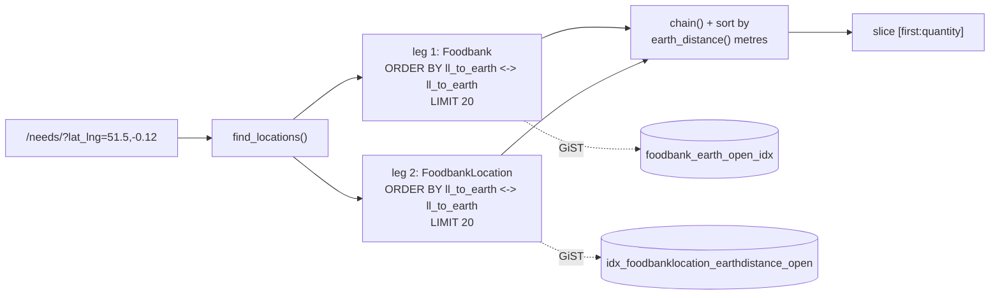

Verified generated SQL and plan (London point, production):

```sql
SELECT "givefood_foodbank".*,
       earth_distance(ll_to_earth(51.5,-0.12), ll_to_earth(latitude,longitude)) AS "distance"
FROM "givefood_foodbank"
WHERE NOT "givefood_foodbank"."is_closed"
ORDER BY ll_to_earth(latitude,longitude) <-> ll_to_earth(51.5,-0.12) ASC
LIMIT 20;
--  Limit  (actual time=1.043..1.790 rows=20)
--    ->  Index Scan using foodbank_earth_open_idx
--          Order By: ((ll_to_earth(latitude, longitude))::cube <-> '(...)'::cube)
--  Execution Time: 2.019 ms
```

The three things that matter:

1. **`ll_to_earth()` maps degrees to 3-D Cartesian metres on a sphere of R = 6,378,168 m.**
   Confirmed by the magnitude of the literal in the plan: √(3970494² + 8315² + 4991606²) = 6,378,200.
2. **`earth_distance(a,b)` is great-circle metres on that sphere** — i.e. plain haversine with
   R = 6378168, exactly reproducible in JS. This is the value surfaced as `distance_m`.
3. **`<->` is chord distance** (straight-line through the sphere) and is what the GiST index answers.
   The docstring on `NearestFirst` at `utils/geo.py:24-53` says so explicitly.

> **Ordering by chord and ordering by great-circle are provably identical.** Both are strictly
> increasing functions of the central angle θ: chord = 2R·sin(θ/2), great-circle = R·θ, on
> θ ∈ [0, π]. A strictly monotonic transform cannot reorder. So the `<->` ordering *is* the
> great-circle ordering, and a JS haversine sort reproduces it exactly.
>
> **Confirmed empirically as well as analytically:** over 300 random UK points, the top-20 by chord and
> the top-20 by great-circle were identical **300 times out of 300** (`scratchpad/geo_divergence.py`).

**A radius inconsistency already in production, which must be preserved deliberately.**
`distance_meters()` at `utils/geo.py:479-494` uses **R = 6,367,000**, not 6,378,168. So `/api/1/
foodbanks/search/` (which goes through G4) reports distances **0.1754% smaller** than `/api/2/*/search/`
(which goes through G1/G2) for the same pair of points. Measured on the London → Manchester pair:
**262,277.6 m vs 261,818.3 m — a 459 m difference over 262 km**, and about **8.8 m on a 5 km
distance**. The two APIs have differed for years and consumers may diff them. **Keep both constants,
per endpoint.**

**One more thing earthdistance is doing that is easy to miss:** `LlToEarth.as_sql` interpolates its
coordinates **directly into the SQL string with no bind parameters** (`as_sql` returns an empty params
list). Only `/api/2/foodbanks/search/` has the `.isdigit()` guard at `gfapi2/views.py:379`;
`location_search` and `donationpoint_search` rely on `is_uk()`'s bare `float()` raising. Porting that
shape into D1 string concatenation would convert a Postgres oddity into a live injection hole. The
in-memory design below removes the surface entirely.

### 4.8.3 The replacement: an in-memory point index

**The decisive fact is cardinality.** The entire searchable set is **8,720 open points**, counted
directly from the probe database: 1,024 open food banks + 1,961 open locations + 5,735 open donation
points (of which 893 locations are also flagged `is_donation_point`). As `type,id,lat,lng` CSV that is
~286 kB; packed binary, **~113 kB**. Replacing a 113 kB in-isolate scan with four D1 round trips would
be slower, not faster.

**Index format** — one R2 object, four parallel typed-array views over one `ArrayBuffer`:

```
offset  bytes  content
     0      4  u32 magic  0x47464958 ("GFIX")
     4      4  u32 version
     8      4  u32 count            (8,720)
    12      n  Uint8Array  type     0=foodbank 1=location 2=donationpoint
                                    bit 2 (value 4) set = also is_donation_point (893 locations)
  12+n     4n  Int32Array  id
       4n     Int32Array  fb_id     parent food bank id (== id for type 0); needed by 4.8.5
       4n     Int32Array  lat       degrees x 1e7   (61.061e7 < 2^31; precision ~1.1 cm)
       4n     Int32Array  lng       degrees x 1e7
```

17 bytes/point → **148,252 bytes**. Zero-copy views, no JSON parse, no allocation per query.

The `is_donation_point` flag is a bit on `type` rather than a fifth array because `find_donationpoints`
(G2) needs exactly that predicate — `is_closed = 0 AND is_donation_point = 1` — and folding it into the
type byte keeps the `accept()` predicate a single comparison.

Why Int32 scaled integers rather than Float64: it halves the object, the precision (1.1 cm) is four
orders of magnitude finer than anything that matters here, and it makes the file bit-reproducible so a
rebuild that changes nothing produces an identical object and therefore an identical ETag.

**Build.** One SQL statement in the jobs Worker, run on every Foodbank / Location / DonationPoint write
(the same hook that fires `decache_async` today) and by a nightly safety-net cron:

```sql
SELECT 0 AS t, id, id AS fb_id, latitude, longitude
  FROM foodbank              WHERE is_closed = 0
UNION ALL
SELECT 1 | (CASE WHEN is_donation_point = 1 THEN 4 ELSE 0 END), id, foodbank_id, latitude, longitude
  FROM foodbanklocation      WHERE is_closed = 0
UNION ALL
SELECT 2, id, foodbank_id, latitude, longitude
  FROM foodbankdonationpoint WHERE is_closed = 0
ORDER BY 1, 2;
```

**Load and memoise** in the request Worker:

```ts
// packages/geo/src/index.ts
export interface GeoIndex { count: number; type: Uint8Array; id: Int32Array;
                            fbId: Int32Array; lat: Int32Array; lng: Int32Array; etag: string; }

let cached: GeoIndex | null = null;
let checkedAt = 0;
const STALE_MS = 300_000;                  // 5 minutes

export async function loadIndex(env: Env): Promise<GeoIndex> {
  const now = Date.now();
  if (cached && now - checkedAt < STALE_MS) return cached;
  const obj = await env.GEO.get("geo/index.bin");
  if (!obj) { if (cached) return cached; throw new Error("geo index missing"); }
  if (cached && obj.httpEtag === cached.etag) { checkedAt = now; return cached; }
  const buf = await obj.arrayBuffer();
  const dv = new DataView(buf);
  if (dv.getUint32(0, true) !== 0x47464958) throw new Error("bad geo index magic");
  const n = dv.getUint32(8, true);
  let o = 12;
  const type = new Uint8Array(buf, o, n);            o += n;
  // Int32Array requires 4-byte alignment; the builder pads after `type` to guarantee it.
  o = (o + 3) & ~3;
  const id   = new Int32Array(buf, o, n);            o += n * 4;
  const fbId = new Int32Array(buf, o, n);            o += n * 4;
  const lat  = new Int32Array(buf, o, n);            o += n * 4;
  const lng  = new Int32Array(buf, o, n);
  cached = { count: n, type, id, fbId, lat, lng, etag: obj.httpEtag };
  checkedAt = now;
  return cached;
}
```

**Query** — plain haversine, partial top-K selection, no full sort:

```ts
const R_EARTHDISTANCE = 6378168;   // matches earth_distance() exactly  -> API 2, /needs/
const R_LEGACY        = 6367000;   // matches utils/geo.py:493          -> API 1 only
const D2R = Math.PI / 180;
const S = 1e-7;

export interface Hit { type: number; id: number; distance: number; }

export function nearest(
  ix: GeoIndex, lat: number, lng: number, k: number,
  accept: (t: number, i: number) => boolean, R = R_EARTHDISTANCE,
): Hit[] {
  const phi1 = lat * D2R, sinPhi1 = Math.sin(phi1), cosPhi1 = Math.cos(phi1);
  const lam1 = lng * D2R;
  // Bounded insertion list. k is 20 or 21 in every call site, so a linear
  // insert beats a heap and is a great deal easier to read at 3am.
  const out: Hit[] = [];
  let worst = Infinity;
  for (let i = 0; i < ix.count; i++) {
    if (!accept(ix.type[i], i)) continue;
    const phi2 = ix.lat[i] * S * D2R;
    const dLam = ix.lng[i] * S * D2R - lam1;
    const dPhi = phi2 - phi1;
    const sdp = Math.sin(dPhi / 2), sdl = Math.sin(dLam / 2);
    const a = sdp * sdp + cosPhi1 * Math.cos(phi2) * sdl * sdl;
    const d = R * 2 * Math.asin(Math.sqrt(Math.min(1, a)));   // clamp: FP drift at d=0
    if (out.length === k && d >= worst) continue;
    let j = out.length;
    while (j > 0 && out[j - 1].distance > d) j--;
    out.splice(j, 0, { type: ix.type[i], id: ix.id[i], distance: d });
    if (out.length > k) out.pop();
    worst = out.length === k ? out[k - 1].distance : Infinity;
  }
  return out;
}
```

`Math.min(1, a)` is not decoration — without it, floating-point drift at distance zero can push `a`
marginally above 1 and `Math.asin` returns `NaN`, which then sorts unpredictably. Distance zero happens
on every `/nearby/` page, because the query point is the food bank's own coordinates.

**Hydration.** Take the top-K ids, group by type, and issue **one** `WHERE id IN (?,…)` per type — three
statements, ≤21 parameters each, comfortably inside D1's 100-bound-parameter cap. Reorder in JS to the
distance order returned above; SQL `IN` does not preserve order.

> **Do not embed display fields in the index blob.** An earlier design suggested carrying them so search
> could "skip D1 entirely". `/api/2/locations/search/` returns `needs.needs` = `latest_need.change_text`
> (`gfapi2/views.py:588-593`), which changes on every publish. A 5-minute-stale copy of need text in a
> public API response is a correctness regression on the one field the whole site exists to publish.
> The index carries geometry only. It is also language-blind, while `foodbank_queryset()` prefetches
> `FoodbankChangeTranslation` filtered on `get_language()`.

**Staleness.** A food bank that closes can appear in search results for up to 5 minutes. For a directory
people use to find food that is a real, user-visible contract and it should be stated to the maintainer,
not buried. Mitigation: the write path rebuilds the object *and* enqueues a purge, so the window is
seconds in practice; the 300 s memo is a backstop against a missed rebuild, not the normal path.

**Cost.** One R2 `GetObject` per isolate per 5 minutes. At ~200 colos that is roughly 1.7 M Class B
operations/month, inside the 10 M free tier. Zero D1 rows read for the search itself.

### 4.8.4 Worked example: where results can diverge, and by how much

Take `/needs/at/<slug>/nearby/` — `find_locations(foodbank.lat_lng, 20, skip_first=True)` at
`gfwfbn/views.py:667`.

**Production, step by step:**

```python
foodbanks = ...order_by(NearestFirst(lat, lng))[:quantity]   # quantity == 20
locations = ...order_by(NearestFirst(lat, lng))[:quantity]   # quantity == 20
...
if skip_first:
    first_item = 1
    quantity = quantity + 1        # ⚠ incremented AFTER both slices were taken
return foodbanksandlocations[first_item:quantity]            # -> [1:21]
```

So each leg fetches exactly 20, the merge is re-sorted globally, and the slice asks for **global ranks
1 through 20** — 20 items.

**Case A — `skip_first=False` (the `/needs/` index, `/api/2/locations/search/`): provably exact.**
The slice is `[0:20]`. Any member of the true global top-20 has at most 19 items closer globally, hence
at most 19 closer *within its own leg*, hence sits within its leg's top-20 and was fetched. A global
scan and the two-leg merge return the same 20 items in the same order. **No divergence.**

**Case B — `skip_first=True` (both `/nearby/` routes): can diverge at rank 20 only.**
The item at global rank 20 has exactly 20 items closer. If **all 20 of those are in the same leg** and
the rank-20 item is also in that leg, then within its leg it is the 21st — and the leg only fetched 20.
Production never sees it and emits the other leg's next candidate instead. A global scan returns the
correct item.

The trigger is a food bank with **≥20 of its own open locations closer than any other candidate**.

**This has been measured, not reasoned about.** `scratchpad/geo_divergence.py` simulates both
algorithms over the real open-point set (1,024 food banks + 1,961 locations) from the probe database:

| Test | Result |
|---|---|
| chord-order vs great-circle-order, top 20, 300 random UK points | **0 / 300 differ** — confirms §4.8.2 |
| `skip_first=False`, 300 random UK points | **0 / 300 diverge** — confirms Case A is exact |
| `skip_first=True`, 300 random UK points | **0 / 300 diverge** |
| `skip_first=True`, 93 points *at the locations of the clustered food banks* | **1 / 93 diverges** |

And the trigger set is small and enumerable. Food banks with ≥20 open locations:

```
foodbank_id 6393797369921536 -> 596 open locations   (area-based; almost certainly Salvation Army)
foodbank_id 5382244910759936 ->  26
foodbank_id 6295884044173312 ->  22
foodbank_id 5712046691713024 ->  21
-- every other food bank has <= 16. Four food banks in total out of 1,024.
```

The single divergence found was at `lat=51.2687 lng=1.1714`, and it was at **array index 19 — the
twentieth and final row**, exactly as the analysis predicts. Production emitted location `5712046691713024`;
the global scan emits `432`.

| Route | Divergence risk | Ranks affected |
|---|---|---|
| `/needs/` index (G1, `skip_first=False`) | **none — proven and measured** | — |
| `/api/2/locations/search/` (G1, `skip_first=False`) | **none — proven and measured** | — |
| `/api/2/donationpoints/search/` (G2) | **none** — `skip_first` is never used | — |
| `/needs/at/<slug>/nearby/` (G1, `skip_first=True`) | **only for the 4 clustered food banks** | rank 20 only, the last row |
| `/md/needs/at/<slug>/nearby/` (G1, `skip_first=True`) | same | rank 20 only |

**Decision.** Either:

- **(i) Reproduce production** — run `nearest()` twice with a type filter, limit each leg to 20, merge,
  slice `[1:21]`. Faithful, about six extra lines, and a reader has to understand the bug to understand
  the code.
- **(ii) Global scan** — one call, and accept that the last row of `/nearby/` can differ for 4 of 1,071
  food banks.

**Recommendation: (ii), the global scan.** The measurement changes the answer from what a
parity-first instinct would suggest. The blast radius is *the twentieth row of one page for four food
banks*, on a page whose content is "other food banks near this one" — where the twentieth entry
carries no meaningful information and is not an API contract (both `/nearby/` routes are HTML, under
the tolerant parity mode). Against that, option (i) means carrying a reproduction of a
slicing bug into new code that one or two people maintain for years, where the natural reading of the
code is wrong and only a comment saves you. **Simplicity beats byte-parity here**, and the four
affected food banks are named above so the decision is auditable rather than a hand-wave.

Two things this requires, and they are not optional:

- [ ] Add `/needs/at/<slug>/nearby/` for **all four** clustered food banks to the parity harness's
      **known-divergence allowlist**, with a comment pointing at this section — otherwise someone
      spends two days treating a deliberate decision as a regression.
- [ ] Re-run `geo_divergence.py` **after** the D1 load, because the trigger set is data-dependent: if a
      fifth food bank crosses 20 open locations, the allowlist needs a fifth entry.

**SPIKE G1 — already run, and it must be re-run against the loaded D1 before cutover.**

```bash
cd scratchpad && python3 geo_divergence.py
# measured 2026-08-30:
#   (b) chord vs great-circle, top-20, 300 points : 0 differ
#   (a) skip_first=False                          : 0 / 300
#   (a) skip_first=True                           : 0 / 300  (random UK points)
#       ... 1 / 93 at the clustered food banks, at index 19
```

**Acceptance gate:** if (b) is anything other than 0, the monotonicity assumption is wrong and the whole
in-memory design must be re-derived — but note that would falsify a mathematical proof, so a bug in the
simulation is far more likely than a bug in the maths; re-check before concluding anything. If
`skip_first=False` is anything other than 0, the merge analysis is wrong and Case A is not exact, which
*would* affect the API.

### 4.8.5 The category search (G3) — the D1 parameter cap

`find_locations_by_category` has a problem that a mechanical port will hit at runtime:

```python
foodbank_ids_with_category = list(
    Foodbank.objects.filter(...).annotate(needs_category=Exists(has_category))
        .filter(needs_category=True).values_list('id', flat=True)
)
locations = FoodbankLocation.objects.filter(
    is_closed=False, foodbank_id__in=foodbank_ids_with_category   # ⚠ unbounded list
)
```

`utils/geo.py:347-360`, with a comment explaining it avoids column ambiguity. That list is unbounded —
for a common category like "Pasta" it will contain several hundred food bank ids. **D1 caps bound
parameters at 100 per statement.**

**Replacement.** Precompute the category → food bank mapping into a second small R2 object, rebuilt
whenever a need is published (52 categories × ~1,000 food banks, a few tens of KB):

```
givefood-geo/geo/categories.json   { "Pasta": [12, 88, 341, ...], "Tinned Tomatoes": [...] }
```

Then the query is: load the index, load the category set, run `nearest()` with an `accept` predicate
that also tests set membership, and apply the 20 km ceiling by discarding hits beyond
`max_distance_meters`. That removes the `Exists()` subquery, the unbounded `IN()`, and the
column-ambiguity workaround in one move — and it is one file in a bucket that already exists, not a new
primitive.

```ts
const cats = await loadCategories(env);           // memoised exactly like the index
const ids  = new Set(cats[category] ?? []);
// `nearest()` passes the array position to accept(), so fb_id is available per point.
const hits = nearest(ix, lat, lng, 20,
                     (t, i) => (t & 3) <= 1 && ids.has(ix.fbId[i]));
return hits.filter(h => h.distance <= 20000);     // the 20 km ceiling, applied after
```

This is why the index carries the `fb_id` array (§4.8.3): the category is a property of the *parent
food bank's* `latest_need`, but the points being ranked are food banks **and** their locations. Without
`fb_id` the predicate cannot be evaluated in the loop.

Note `(t & 3) <= 1` — masking off the `is_donation_point` bit, so this leg matches production's
`Foodbank` + `FoodbankLocation` pair and excludes donation points, as `find_locations_by_category` does.

**Also confirmed dead:** `find_donationpoints(..., foodbank=...)` applies its optional filter **after**
slicing (`utils/geo.py:435-437`), which in Django raises `TypeError: Cannot filter a query once a slice
has been taken`. I grepped every call site: `gfwfbn/views.py:86` and `gfapi2/views.py:703` both call it
with two positional arguments only. **The branch has never executed.** Do not port it.

### 4.8.6 Place matching: replacing `pg_trgm` (G6)

Two passes today, both over 253,584 rows:

1. **Prefix** — `UPPER(name) LIKE 'HACKNEY%'`, limit 10, via `place_name_upper_like` (`text_pattern_ops`).
2. **Substring** — `UPPER(name) LIKE '%HACKNEY%' AND NOT LIKE 'HACKNEY%'`, filling to 10, via
   `place_name_upper_trgm` (`gin_trgm_ops`), and only when `len(query) >= 3`.

Both ordered `population DESC NULLS LAST, name ASC`. Measured 3.10 ms and 2.90 ms in production; the
docstring records ~185 ms for the ORM form of the same query.

**Three problems and their fixes:**

**(a) SQLite has no trigram index.** FTS5 with `tokenize='trigram'` is the direct replacement, and D1's
supported-extensions list names FTS5 including `fts5vocab`. Verified on a real local D1 against the
253,584 real rows: `MATCH 'ackne'` returns both `Hackney` and `South Hackney` — true infix matching.

**(b) SQLite's `upper()` is ASCII-only** (`upper('môn')` → `'MÔN'`), while Postgres's is Unicode-aware.
Calling `upper()` at query time therefore regresses search for the 8,442 non-ASCII place names.
**Fix: never call it.** Export Postgres's own output as a stored column:

```sql
-- in the extraction query
SELECT id, gbpnid, name, upper(name) AS name_upper, lat_lng, county,
       county_slug, name_slug, population
FROM givefood_place ORDER BY id;
```

This is exact by construction — the stored value *is* what Postgres compares against today. The query
side uses JS `toUpperCase()`, which matches Python's `query.upper()` at `views.py:1537` for every input
these two agree on, which is the relationship that already holds in production. **No behaviour change,
no sign-off needed, and `/aac/` stays in the STRICT parity corpus.** This supersedes the `name_fold`
proposal (C4).

**(c) Bound parameters do not escape FTS5 query syntax** (C3). `_like_escape()` at `views.py:1475`
escapes `\ % _` for LIKE; FTS5 needs different handling entirely. Reproduced against the probe database:
`q=king's` → `fts5: syntax error near "'"`; `q=-yn-` → `no such column: yn`. Production returns 228 and
9 matches for those. Both are ordinary UK place-name substrings — *King's Lynn*, *Bishop's Stortford*,
*Llanfair-yn-neubwll*. **Fix: wrap the whole query as an FTS5 phrase**, doubling internal quotes:

```ts
const ftsPhrase = (q: string) => `"${q.replace(/"/g, '""')}"`;
```

Verified on the probe database that this restores exact LIKE-equivalence: `king's` 228 = 228,
`-yn-` 9 = 9, `a OR b` 0 = 0, `say "hi"` 0 = 0.

**The queries:**

```sql
-- pass 1: prefix.  ?1 = 'HACKNEY', ?2 = 'HACKNEZ' (last char incremented)
SELECT name, lat_lng, county FROM place
 WHERE name_upper >= ?1 AND name_upper < ?2
 ORDER BY population IS NULL, population DESC, name ASC
 LIMIT ?3;

-- pass 2: substring, only when length(q) >= 3 and pass 1 returned < 10
SELECT p.name, p.lat_lng, p.county
  FROM place_fts f JOIN place p ON p.id = f.rowid
 WHERE f.name_upper MATCH ?1              -- ?1 = ftsPhrase('HACKNEY')
   AND p.name_upper NOT LIKE ?2           -- ?2 = 'HACKNEY%'  (excludes pass-1 hits)
 ORDER BY p.population IS NULL, p.population DESC, p.name ASC
 LIMIT ?3;
```

`population IS NULL, population DESC` is the portable form of `NULLS LAST`. SQLite 3.30+ does support
`NULLS LAST`, but the portable form costs nothing and removes a version dependency.

**Two Postgres artefacts that must be deleted, not translated:**

- **`OFFSET 0`.** A bare `OFFSET` is a **syntax error** in SQLite — the grammar requires `LIMIT` first.
  The idiom is `LIMIT -1 OFFSET 0`, but SQLite's planner is far simpler than Postgres's and the fence is
  almost certainly unnecessary. Drop it; confirm with `EXPLAIN QUERY PLAN`.
- **`name::text`.** Postgres cast syntax. The column is already TEXT — drop it entirely.

**The 50-byte guard.** D1 caps LIKE/GLOB patterns at **50 bytes**, with no Postgres equivalent. `/aac/`
sets `Access-Control-Allow-Origin: *`, is uncredentialed and takes arbitrary `?q=`. Both the prefix
range and the `NOT LIKE` exclusion take user input. Reject `q` longer than 40 characters with an empty
array before touching D1 — matching the existing "empty array below 2 characters" behaviour rather than
throwing.

**Response shape is unchanged and is contract:** a bare JSON array of
`{"n": name, "l": "lat,lng", "t": "p"|"c", "c": county}`, terse keys, max 20, `[]` below 2 characters,
`Access-Control-Allow-Origin: *`, `Cache-Control: public, max-age=86400`.

### 4.8.7 Postcode lookup at 1.79 M rows (G7)

Verified: `Postcode` has **exactly one** production read — `givefood/views.py:1569` — and it is a
**prefix match only**, selecting three columns:

```python
Postcode.objects.filter(postcode_normalized__startswith=postcode_query)
                .values('postcode', 'lat_lng', 'county')[:min(10, 20 - len(results))]
```

Everything else that touches `Postcode` is `import_postcodes` and the tests. So this is the **easy half**
of autocomplete and should be stated as such: **no trigram, no FTS5, no fuzzy matching is needed.**

**Schema.** Make the primary key *be* the prefix index:

```sql
CREATE TABLE postcode (
  id INTEGER PRIMARY KEY,
  pcn TEXT NOT NULL,
  postcode TEXT GENERATED ALWAYS AS
      (substr(pcn, 1, length(pcn) - 3) || ' ' || substr(pcn, -3)) VIRTUAL,
  lat_lng TEXT NOT NULL, county TEXT
);
CREATE INDEX postcode_pcn_idx ON postcode(pcn);
```

```sql
SELECT postcode, lat_lng, county FROM postcode
 WHERE pcn >= ?1 AND pcn < ?2 ORDER BY pcn LIMIT ?3;
```

SQLite's default `BINARY` collation serves `LIKE 'X%'` from an ordinary index natively, so the hand-built
`postcode_norm_like` (`text_pattern_ops`) index **simplifies away** — its whole purpose was working
around Postgres's non-C collation.

**The trim — flagged for the maintainer, not decided here.** Only `postcode`, `lat_lng` and `county` are
ever read, out of ~11 columns. Dropping `district`, `ward`, `country`, `region`, `lsoa`, `msoa` and
`police`, and making the display `postcode` a generated column:

| Option | D1 size | Notes |
|---|---:|---|
| **Trimmed** (3 stored + 1 generated) | **80 MB + 30 MB idx** | Recommended. Takes the total D1 from ~570 MB to ~457 MB. |
| Full (~11 columns) | ~350 MB | Also fits. |

The display-column drop is **verified reconstructable for 1,795,944 of 1,795,944 rows**. The dropped
columns are public ONS data, re-importable at any time — so this is cheap to reverse either way, which
is why it is a flag rather than a decision.

**Optional later normalisation, deliberately not taken now:** `county` has 56 distinct values across
1.8 M rows; an integer FK to a lookup table would save ~19 MB. That is 4% of the budget in exchange for a
join on `/aac/`. Under the simplicity rule, no.

### 4.8.8 Constituency lookup (G5, G11)

Three separate things, none of which needs geometry.

**Nearest constituencies** (`ParliamentaryConstituency.nearby()`, rendered on
`gfwfbn/templates/wfbn/constituency/constituency.html:113`): 650 rows, already pure-Python haversine over
a cached queryset, using the `centroid` `"lat,lng"` string. Port to the same `nearest()` function over a
650-entry array loaded from D1 once per isolate and memoised. **Use R = 6,367,000** — this path goes
through `distance_meters`, not `earth_distance`.

**Postcode → constituency** (G11) is `admin_regions_from_postcode()`, a synchronous
`api.postcodes.io` call, and it is the *entire* assignment mechanism. Two distinct uses:

- **Write path** (three `save()` methods): move to a Queue consumer. §4.7.
- **Read path** (`gfwrite/views.py:20`, `gfwfbn/views.py:1054` — a user types a postcode and gets
  redirected to a constituency page): **you already have the answer locally.** The `postcode` table being
  ported to D1 can carry the constituency, making this a single indexed lookup with no external call.
  That removes a third-party dependency from a user-facing request path — a straightforward win for
  goals 1 and 2 — but it **adds a column to the trim decision above**, so raise it with the maintainer as
  part of the same question.

**Boundary GeoJSON** stays in D1 (C1/C2). The `geo.json` Worker route reads exactly one row by slug and
streams it; nothing does `SELECT *`. Keep the current `@cache_page(SECONDS_IN_WEEK)` as
`Cache-Control: public, max-age=604800`, so the edge answers essentially all of this traffic.

⚠ **`gfadmin/views.py:2631-2652` (`parlcon_loader_geojson`) is already broken** — it reads
`./givefood/data/parlcon/gb.geojson`, which no longer exists in the repo. Boundary data can therefore
**only** be regenerated from the *database*. Export it before touching anything.

### 4.8.9 Accuracy and latency budget

| Query | Production | D1 / Worker target | Basis |
|---|---|---|---|
| Nearest-N (G1/G2) | 2.0 ms Postgres × 4 queries ≈ 18 ms DB per place page | **< 5 ms CPU, 0 D1 rows** | 8,720 iterations × ~5 trig calls. Needs measurement (§4.8.10), but the magnitude is an order of ~1–3 ms. |
| Geo index fetch | n/a | **1 R2 GET per isolate per 5 min** | ~1.7 M Class B/month, inside the free tier |
| Hydration | included above | **3 statements, ≤21 params each, ~60 rows read** | one `IN()` per type |
| `/aac/` prefix (G6.1) | 3.10 ms | **< 5 ms**, `SEARCH … USING INDEX place_name_upper_idx` | measured 1.32–1.58 ms on the probe DB |
| `/aac/` substring (G6.2) | 2.90 ms | **< 30 ms p95** | measured p50 0.02 ms, p95 2.03 ms, worst 5.30 ms over 200 random 2-char prefixes |
| `/aac/` postcode (G7) | 1.30 ms | **< 5 ms**, ~10 rows read | PK-backed prefix scan |
| Place page (G8) | 1.05 ms × 3.4 M calls | **< 5 ms** | `place_county_name_slug_idx` ports verbatim |
| Constituency nearby (G5) | in-memory | **< 1 ms** | 650 points |

**Accuracy budget:**

| Property | Requirement |
|---|---|
| `distance_m` on `/api/2/*/search/` | **integer-identical** to production. R = 6,378,168, haversine. |
| `distance_mi` on `/api/2/*/search/` | `round(m × 0.000621371192, 2)` — and ⚠ a Python **float**, so `0.0` must serialise as `0.0`, not `0`. See section 06. |
| `distance_m` on `/api/1/foodbanks/search/` | **integer-identical** using R = **6,367,000**. Do not unify the radii. |
| Result **ordering** | identical for `skip_first=False`; see §4.8.4 for the one `skip_first=True` case |
| `/aac/` response bytes | **identical**, including ordering and the terse `{n,l,t,c}` keys |
| GeoJSON coordinate rounding | 4 dp all-items, 6 dp scoped. ⚠ `round(51.0, 4)` is `51.0` in Python and `51` in JS, and the UK straddles the 0.0 meridian. |

**Restated `/aac/` rows-read criterion**, replacing the unachievable "< 500 rows per keystroke" (C5).
Measured candidate-set sizes for common three-character substrings on the real 253,584 rows: `ton`
14,123, `ing` 9,278, `and` 5,961, `mon` 3,876, `bur` 3,210, `new` 2,482. The criterion should be:

- [ ] **No `EXPLAIN QUERY PLAN` on either pass shows `SCAN place`** (only `SEARCH … USING INDEX` and
      `SCAN … VIRTUAL TABLE place_fts`)
- [ ] **p95 latency < 30 ms** over the benchmark set `{ton, ing, and, mon, bur, new, hackney, king's, -yn-, sw1a}`
- [ ] **Worst-case candidate set < 20,000 rows**

At $0.001 per million rows read this is a latency and correctness criterion, not a cost one — but a
criterion nobody can pass gets waived, and then nobody notices when it regresses to a full scan.

### 4.8.10 Spikes, in order, and the fallback if the primary design fails

| # | Spike | Cost | Gate |
|---|---|---|---|
| **G1** | ✅ **DONE 2026-08-30.** Nearest-N divergence, `scratchpad/geo_divergence.py`. Chord vs great-circle 0/300; `skip_first=False` 0/300; `skip_first=True` 0/300 random, 1/93 at the 4 clustered food banks, at the last row. **Re-run against the loaded D1 before cutover** — the trigger set is data-dependent. | done; ½ day to re-run | (b) = **0** and `skip_first=False` = **0**. Either non-zero ⇒ the design is re-derived, not patched. |
| **G2** | ✅ **DONE 2026-09-01.** FTS5 trigram on production D1, `--local` and `--remote`, after loading the real 253,584 place rows via `tools/pg-to-d1/extract_core.py geo`. `MATCH '"ackne"'` against real remote D1 returns `Hackney`, `Hackness` (×2), `Mackney`, `Blackney`, `Blacknest`, `Blackness`, `Bracknell`, `Upper Hackney` — genuine infix matches, 11.2ms `sql_duration_ms`, 111 rows read. `EXPLAIN QUERY PLAN` on all three `/aac/` queries (place prefix, place substring, postcode prefix) shows `SEARCH … USING INDEX` / `SCAN f VIRTUAL TABLE` only, never `SCAN place`. | done | Table creates; a substring `MATCH` returns true infix matches; `EXPLAIN QUERY PLAN` shows no `SCAN place`. |
| **G3** | **Distance parity.** Compute `distance_m` in JS for 200 sampled coordinates against live `/api/2/foodbanks/search/` and `/api/1/foodbanks/search/`. | ½ day | Integer-identical on both, with their different radii. |
| **G4** | **Worker CPU.** Time `nearest()` over 8,720 points in a real Worker, 1,000 iterations. | 1 hour | < 5 ms p95. Falls out of G1 for free if run in `workerd`. |
| **G5** | **FTS5 escaping.** `q` ∈ `{king's, -yn-, a OR b, ", NEAR(a b), *}` against the probe DB with `ftsPhrase()`. | 1 hour | Match counts identical to production `LIKE`; no `OperationalError`. |

**Fallbacks, in order of preference, if a spike fails:**

**If G1 (b) fails** — chord and great-circle ordering differ. This would falsify a mathematical proof, so
the far more likely cause is a bug in the simulation than in the maths; re-check before concluding
anything. If it genuinely fails, the whole in-memory approach is unsafe and the fallback is the D1
bounding-box query below, which reproduces Postgres's *index* behaviour more literally.

**If G4 fails** (CPU too high) — three options, cheapest first:
1. **Precompute unit-sphere XYZ per point** and rank by dot product instead of haversine (3 multiplies
   and 2 adds per point, no trig; `acos` only for the top K). Dot-product ordering is *exactly* chord
   ordering, so it matches Postgres's `<->` by construction. Index grows to 29 bytes/point (253 KB).
2. **Coarse pre-filter by bounding box in JS** before the trig, using a degree delta sized from a
   generous radius. Typically eliminates 95% of points at the cost of two comparisons each.
3. Push the whole thing back into D1 (below).

**If the in-memory design is abandoned entirely — the D1 fallback.** This is the design to reach for,
and it is genuinely viable: `acos`, `cos`, `sin`, `radians` and `min` are all on D1's function allowlist
(verified), and the partial indexes are the direct analogue of the GiST ones.

```sql
SELECT id, name, slug,
       6378168.0 * acos(min(1.0,
         cos(radians(?1)) * cos(radians(latitude)) * cos(radians(longitude) - radians(?2))
         + sin(radians(?1)) * sin(radians(latitude)))) AS distance
FROM foodbanklocation
WHERE is_closed = 0
  AND latitude  BETWEEN ?3 AND ?4        -- uses loc_open_latlng_idx
  AND longitude BETWEEN ?5 AND ?6
ORDER BY distance
LIMIT 20;
```

Bounding box sized from a target radius: `dLat = r / 111_320`, `dLng = dLat / cos(lat)`. Start at 25 km
and widen (50 km, 150 km, unbounded) until 20 results are found — three round trips in the worst case,
which is rural Scotland.

Costs relative to the primary design: **4 D1 round trips per search restored**, rows-read billing
restored, and the spherical-law-of-cosines form (which is what `acos` gives you) loses precision below
about 1 metre — irrelevant here, but note it is a *different* formula from haversine and will produce
sub-metre differences in `distance_m`, which **would break byte-parity on the API**. If this fallback is
taken, `distance_m` must be recomputed in JS from the returned coordinates before serialisation, using
haversine, so the published number is unchanged. That caveat is easy to miss and expensive to discover.

**R\*Tree is not an option.** Verified on real local D1: `CREATE VIRTUAL TABLE … USING rtree` returns
`SQLITE_AUTH`. (`workerd`'s function allowlist does contain `rtreecheck` and its PRAGMA table comments on
the R\*Tree module, so the module may be compiled in but is not authorised. Either way it is undocumented
and unusable — treat the question as settled and do not spend a spike on it.)

---

### 4.9 Checklist for this section

Schema:

- [ ] Generate the DDL from `information_schema` plus a live NULL audit — **not** from `models.py`
- [ ] Assert zero `numeric`/`money` columns in the generator rather than assuming it
- [ ] Declare **no** foreign keys; index every FK column
- [ ] Port `Foodbank.delete()`'s ten-table cascade as a single `db.batch()`
- [ ] Run `manage.py checkschema` against production and capture every `UNMANAGED INDEX`
- [ ] Export boundary GeoJSON from the **database** before anything else (`parlcon_loader_geojson` is broken)

Type mapping — each of these is a silent-corruption path:

- [ ] `true`/`false` → `1`/`0`; verify with `SELECT typeof(published), count(*) … GROUP BY 1`
- [ ] UUIDs dashless and lowercase; test a known `/needs/uuid/<uuid>/` in **both** forms before cutover
- [ ] Timestamps via `to_char(… ,'YYYY-MM-DD HH24:MI:SS.US')`; assert no `+00` survives
- [ ] `nonpertinent` (18,943), `is_categorised` (382), `wheelchair_accessible` (832) keep their NULLs
- [ ] `SELECT max(id)` on every table ≤ `Number.MAX_SAFE_INTEGER` — assert in CI, not just at migration
- [ ] `place.name_upper` exported as Postgres `upper(name)`, and diffed against all 253,584 rows

Geographic:

- [x] **SPIKE G1 run and green** (2026-08-30) — re-run against the loaded D1 before cutover
- [ ] Record the `/nearby/` rank-20 decision, and put the 4 clustered food banks on the parity
      harness's known-divergence allowlist
- [ ] `ftsPhrase()` escaping in place; `king's` and `-yn-` in the `/aac/` edge-case corpus
- [ ] 40-character guard on `?q=` before any D1 call (50-byte LIKE cap)
- [ ] Both radii preserved: 6,378,168 for API 2 / `/needs/`, 6,367,000 for API 1 and `find_parlcons`
- [ ] `Math.min(1, a)` clamp present — distance zero occurs on every `/nearby/` page
- [ ] Geo index carries **geometry only**; no need text, no names, no translations
- [ ] `categories.json` built and memoised; the unbounded `foodbank_id__in` is gone
- [ ] `find_donationpoints(foodbank=…)` **not** ported — verified dead
- [ ] `OFFSET 0` and `name::text` removed, not translated

Sequencing hazard to resolve before the `placephoto.blob` column is dropped:

- [ ] R2 backfilled → **then** deploy code that reads R2 with a DB fallback and stops deriving
      `place_has_photo` from the blob table → **then** verify for a week → **then** drop the column.
      Three deploys. Dropping the column while Django still calls `place_has_photo()` silently sets it
      false and 404s every photo that exists in R2.

Open questions for the maintainer, carried into section 08:

- [ ] **Trim the postcode table?** 3 columns (80 MB) vs ~11 (350 MB). Reversible — public ONS data.
- [ ] **Add `constituency` to the postcode table** so the read-path postcode → constituency lookup stops
      calling postcodes.io on a user-facing request?
- [ ] **`/nearby/` rank-20**: confirm the recommendation (global scan + allowlist, §4.8.4). The
      measured blast radius is the last row of one page for 4 of 1,071 food banks.

---

## 05. Data migration: extract, transform, load, verify

This section is the runbook for moving the data. It is written to be executed, not
read: every command below is a real command, every SQL statement is real SQL against
the real schema, and every number was measured read-only against the live database on
2026-08-29 unless explicitly marked as an estimate.

The choreography of the cutover night — the freeze, the go/no-go, the rollback — lives
in the cutover runbook section. The Worker code that *serves* the migrated data lives in
the storage-and-serving and application-porting sections. This section owns: getting the
bytes out, transforming them correctly, getting them in, and proving it worked.

### 5.0 Five corrections to earlier assumptions

Four of these change the plan. Read them before anything else.

| # | Widely-repeated claim | Measured reality | Consequence |
|---|---|---|---|
| **C1** | D1's maximum row size is **1 MB**, so the three largest constituency boundaries "physically cannot be stored" | The documented limit is **2,000,000 bytes (2 MB)**. The largest boundary is ~1.6 MB. **All 650 fit.** | Boundaries still move to R2, but for the *real* reasons (§5.10.3), not an imaginary hard stop. Delete the "assert 650 objects or three vanish silently" framing from the go/no-go; it guards nothing. |
| **C2** | `USE_TZ = False`, so Django writes naive strings and a raw `COPY` is load-safe | Every datetime column in production is **`timestamp with time zone`**. The text rendering carries `+00` **and trims trailing fractional zeros** (`2019-07-11 19:56:11.377+00`). | A raw `COPY` silently corrupts sub-second precision. Every timestamp must go through `to_char(... , 'YYYY-MM-DD HH24:MI:SS.US')`. §5.4.3. |
| **C3** | Two `django_tasks_database` migrations are pending on prod | **Nothing is pending.** `givefood` 0001–0012 and `django_tasks_database` 0001–0019 are all applied. | The migration-first blocker is gone. 0009 (charityyear PK) and 0010 (dedupe places) are applied, so the NULL-PK and duplicate-`gbpnid` hazards **do not exist in the data**. Verify anyway (§5.1 step 3). |
| **C4** | The models are a safe source for the D1 DDL | Three columns are `NOT NULL` in Django and nullable-with-NULLs in production. Worst: `foodbankchange.nonpertinent` has **18,943 NULLs** and the admin review queue filters `nonpertinent=False`, which in SQL **excludes NULL**. | Generate the DDL from `information_schema` **plus a live NULL audit**. Coercing those 18,943 NULLs to `0` dumps 18,943 needs into the maintainer's review queue overnight. §5.4.2. |
| **C5** | The `salt` credential must migrate byte-identically or 5,858 unsubscribe links break | `sub_key`/`unsub_key` are generated **once**, guarded by `if not self.sub_key`, and **stored in the row** (`givefood/models/subscribers.py:44-57`). The salt is never used on read. | Existing keys migrate as ordinary column data. Carry the salt so *newly-generated* keys keep the same format — a one-line note, not a blocker. |

One more, not a correction but a decision this section makes and the earlier drafts did not:

> **We are not using Workers Analytics Engine.** Neither `FoodbankHit` nor `CrawlItem`
> needs it. Keeping both in D1 is simpler, keeps hit counts **exact** rather than sampled,
> removes a 3-month retention wall, removes a nightly rollup cron, and removes a whole
> product from the things one person has to debug at 3am. The arithmetic and the named
> trigger for revisiting it are in §5.9. Datastores after migration: **D1, R2, KV. Three.**

---

### 5.1 Preflight — do these before touching anything

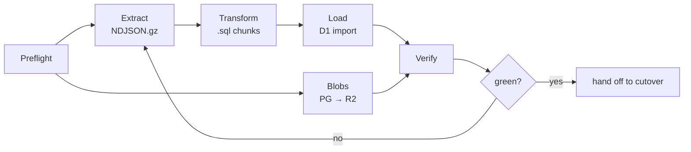

#### Step 1 — Never `source .env`

`SECRET_KEY` in `/Users/jasoncartwright/Sites/foodcharity/.env` contains **exactly one
unbalanced single-quote**. `source .env` in zsh opens a quote and swallows the rest of the
file, including `DB_PASS`. Parse it in Python, take values **verbatim**, and never strip
quotes.

#### Step 2 — Pin the session read-only

Every script in this section routes through `gfexport.py`, which sets:

```python
env["PGPASSWORD"] = e["DB_PASS"]          # environment, never argv — `ps` can read argv
env["PGOPTIONS"] = (
    "-c default_transaction_read_only=on "   # an accidental write is impossible, not unlikely
    "-c statement_timeout=0 "                # a full-table COPY legitimately outruns 60s
    "-c idle_in_transaction_session_timeout=0 "
    "-c TimeZone=UTC"                        # makes to_char() independent of server config
)
```

`default_transaction_read_only=on` is the control that matters. It is not a convention;
it makes the extraction physically incapable of writing.

#### Step 3 — Confirm the schema is where you think it is

```bash
cd /Users/jasoncartwright/Sites/foodcharity
uv run manage.py showmigrations | grep -c '\[ \]'          # expect: 0
uv run manage.py checkschema --preflight                    # expect: no MISSING lines

# 0009 and 0010 applied? (both are data repairs; loading before them is silently wrong)
python3 tools/q.py "SELECT count(*) FROM givefood_charityyear WHERE id IS NULL"   # expect 0
python3 tools/q.py "SELECT count(*) FROM (SELECT gbpnid FROM givefood_place
                    GROUP BY 1 HAVING count(*) > 1) d"                            # expect 0
```

`gfoffline/management/commands/checkschema.py` is 411 lines of Postgres catalogue
introspection and is the single best description of what the schema *actually* is. It
does not survive the migration. **Run it now and save the output into the archive** — it
is the only record of hand-built DDL that exists outside migration `0004`.

#### Step 4 — Set up the workspace

```bash
export GF=/Users/jasoncartwright/Sites/foodcharity
export MIG=$GF/../gf-migration          # sibling dir, NOT inside the repo
mkdir -p $MIG/{tools,sql,out,blobs,state,verify,baseline}
cd $MIG

# tools/ holds gfexport.py, gfsql.py, q.py, gen_ddl.py, photos_to_r2.py,
# dumps_to_r2.py, verify.py, parity.py  (all listed in this section)

python3 -c "import boto3, psycopg2" || pip install boto3 psycopg2-binary
node --version    # >= 22
npx wrangler --version
npx wrangler whoami      # MUST be logged in — nothing below works otherwise
```

> ⚠️ At the time of writing, `wrangler whoami` on the development machine reports **not
> logged in**, so nothing in §5.5 has been executed against a real D1. The local-D1
> results quoted throughout *were* executed (workerd runs the same D1 build locally), but
> the remote import timing in §5.13 is an **estimate**. Resolving that is the first
> rehearsal step.

---

### 5.2 Disposition — all 39 tables, one table

Row counts are exact (`count(*)`, 2026-08-29 19:00 UTC). "D1" sizes are measured from a
real SQLite file built with the proposed schema, all indexes and the FTS5 index, then
`ANALYZE`d and `VACUUM`ed (§5.13).

#### → D1 (26 tables, ~442 MB / 421.8 MiB measured)

| Table | Rows | PG | Transformation | D1 |
|---|---:|---:|---|---:|
| `givefood_postcode` | 1,795,944 | 457 MB | Drop 7 unread columns; **drop the display `postcode` column** — verified reconstructable from `postcode_normalized` for **1,795,944 / 1,795,944** rows, so it becomes a VIRTUAL generated column | **80 MB** + 30 MB idx |
| `givefood_foodbankchangetranslation` | 89,743 → **88,880** | 46 MB | Drop 863 orphans; add the `(need_id, language)` UNIQUE the model never declared (verified **0 duplicates**); `language` stays TEXT (prod is `varchar(7)`, holds `zh-hans`) | **36 MB** |
| `givefood_foodbankchangeline` | 332,440 | 57 MB | Straight. ⚠️ `created` is **copied from the parent need**, not insert time — never use it as a sync watermark | **29 MB** + 34 MB idx |
| `givefood_foodbankchange` | 33,931 | 38 MB | UUID dashless; **preserve NULL** on `nonpertinent` (18,943) and `is_categorised` (382) | **29 MB** + 5 MB idx |
| `givefood_place` | 253,584 | 161 MB | Drop 10 unread columns; add derived `name_fold` (§5.4.5) | **26 MB** + 30 MB idx |
| `givefood_foodbankdiscrepancy` | 95,344 | 27 MB | Straight — see §5.2.1 for why it is *not* pruned | **22 MB** + 4 MB idx |
| `givefood_crawlitem` | 2,562,501 → **171,415** | 634 MB | **30-day rolling window**; generic FK collapsed to one `need_pk`; full history → R2 (§5.9.2) | **22 MB** + 25 MB idx |
| `givefood_foodbankhit` | 709,644 | 130 MB | **Entire 942-day history kept.** `WITHOUT ROWID` PK `(foodbank_id, day)`, surrogate `id` dropped | **19 MB** + 19 MB idx |
| `givefood_foodbankarticle` | 17,199 | 9.5 MB | Straight | 4 MB + 4 MB |
| `givefood_orderline` | 15,583 | 3.1 MB | Straight | 2 MB |
| `givefood_placephoto` | 7,117 | 1776 MB | **Metadata only** — `blob` → R2; add `r2_key`, `bytes`, `md5` | 4 MB |
| `givefood_foodbanksubscriber` | 5,858 | 1.5 MB | Straight. `sub_key`/`unsub_key` are in already-delivered email — byte-exact | 1 MB |
| `givefood_foodbankdonationpoint` | 5,745 | 6.5 MB | **Preserve tri-state `wheelchair_accessible`** (832 NULL / 4,907 true / 6 false → schema.org `isAccessibleForFree`) | 5 MB |
| `givefood_charityyear` | 4,198 | 1.4 MB | Straight (0009 applied — no NULL PKs) | 1 MB |
| `givefood_crawlset` | 4,163 | 400 kB | 30-day window, matching `crawlitem` | 0.3 MB |
| `givefood_foodbanklocation` | 1,972 | 3.6 MB | `boundary_geojson` → R2 (257 populated, 3,363 kB) | 2 MB |
| `givefood_orderitem` | 1,200 | 424 kB | Straight | 0.3 MB |
| `givefood_foodbank` | 1,071 | 3.7 MB | Straight. ⚠️ `givefood_foodbank_slug_key` is a UNIQUE index that exists **only in the database** — not in `models.py`, not in any migration. Carry it | 3 MB |
| `givefood_order` | 1,050 | 1.3 MB | Straight. `unique_together` NULL-distinct semantics survive identically in SQLite | 1 MB |
| `givefood_parliamentaryconstituency` | 650 | 18 MB | `boundary_geojson` → R2 (§5.10.3); keeps `centroid`/`latitude`/`longitude` | 0.2 MB |
| `givefood_dump` | 279 | 1474 MB | **Metadata only** — `the_dump` → R2; add `r2_key` | <0.1 MB |
| `givefood_slugredirect` | 57 | 72 kB | D1 is source of truth; **read path is KV** (§5.10.2) | <0.1 MB |
| `givefood_constituencysubscriber` | 53 | 72 kB | Straight. Nothing reads it — port the table, do not build a channel | <0.1 MB |
| `givefood_webpushsubscription` | 49 | 128 kB | Straight | <0.1 MB |
| `givefood_whatsappsubscriber` | 49 | 88 kB | Straight | <0.1 MB |
| `givefood_mobilesubscriber` | 47 | 80 kB | Straight | <0.1 MB |
| `givefood_ordergroup` | 8 | 48 kB | Straight | <0.1 MB |

#### → R2 (5 datasets, ~11.4 GB raw / ~3.4 GB gzipped)

| Source | Count | Raw bytes | Bucket |
|---|---:|---:|---|
| `placephoto.blob` | 7,117 | **1,700 MB** (avg 245 kB, max 3,436 kB) | `givefood-photos` — **same-origin**, §5.6 |
| `dump.the_dump` | 279 | **9,413 MB uncompressed** (max single 143 MB) | `givefood-dumps` — separate domain, §5.8 |
| `parliamentaryconstituency.boundary_geojson` | 650 | 27 MB | `givefood-geo` |
| `foodbanklocation.boundary_geojson` | 257 | 3.4 MB | `givefood-geo` |
| `crawlitem` pre-window history | 2,391,086 | ~180 MB gz | `givefood-archive`, §5.9.2 |

#### → KV (3 keys)

Slug-redirect map (57 rows, read on every 404), the geo point index (§5.10.1), site
stats. All are derived, all are rebuilt on write, none is a source of truth.

#### → Dropped (10 tables)

| Table | Rows | Why |
|---|---:|---|
| `django_tasks_database_dbtaskresult` | 41,625 / 62 MB | Cloudflare Queues is push-based; nothing to poll, nothing to prune |
| `django_session` | 706 | Holds only `user_data` (Google claims) and `next_url`; both disappear under the ported OAuth flow. **Audit for other `request.session[...]` uses first** — only the login flow was traced |
| `django_content_type` | 43 | Its sole load-bearing use is `CrawlItem`'s GenericForeignKey, which collapses to `need_pk` |
| `django_migrations` | 50 | Django bookkeeping |
| `auth_permission` / `auth_group` / `auth_group_permissions` | 148 / 0 / 0 | There has never been an `auth_user` table; inert scaffolding |
| `cspreports_cspreport` | 0 | Empty |
| `givefood_dropped_places` | 6,888 | Archive created by migration 0010 → R2, then drop |
| `givefood_dropped_foodbank_columns` | 443 | Archive created by 0008 → R2, then drop |
| `givefood_foodbankgroup` | 3 | Its columns on `Foodbank` were removed by 0008; nothing references it. 0008 deliberately left the table — this is the moment to remove it |
| `givefood_gfcredential` | 43 | → Workers Secrets. **Never KV.** Archive the values offline before dropping |

#### 5.2.1 Two things deliberately NOT pruned

- **`foodbankdiscrepancy`.** Earlier drafts proposed keeping only `status='New'` plus 90
  days. Measured: **95,142 of 95,344 rows are `'New'`.** Pruning by status saves 0.2%. It
  is 22 MB. Keep it whole. Whether to work the queue down is an operational decision, not
  a migration one.
- **`foodbankhit`.** 19 MB against a 10 GB ceiling, and the maintainer said preserve it.
  See §5.9.1.

---

### 5.3 Extract

#### 5.3.1 Format: gzipped NDJSON via `row_to_json()`, streamed

**Rejected**, with reasons, because each rejection is a data-loss bug avoided:

| Option | Why not |
|---|---|
| `pg_dump` | Produces Postgres DDL and `COPY` blocks needing a full rewrite |
| `COPY ... FORMAT csv` | Writes `NULL` as an *unquoted* empty field and `''` as a *quoted* empty field. `csv.reader` returns `''` for **both**, destroying a distinction the API exposes as `null` vs `""` |
| `COPY ... FORMAT text` | Escapes `\r`, `\t`, `\\` — and the data contains all three (1,066 of 1,071 `foodbank.address` values contain `\r\n`) |

`row_to_json()` streamed through `COPY ... TO STDOUT` is lossless on every axis that
matters. Verified output for a real row:

```json
{"id":1,"created":"2023-05-16 09:30:21.722605","uuid":"cea1a83fa96641d989fd25a4ab5ff43b",
 "name":"Peace Centre","address":"The Peace Centre\r\nThurncourt Road\r\nThurnby Lodge\r\nLeicester",
 "alt_name":null,"latitude":52.6382077,"is_closed":false,"footprint":0}
```

CRLF preserved as JSON escapes; `null` distinct from `""`; UTF-8 native; boolean as a JSON
boolean; full float precision. There are **zero `numeric`/`money` columns** in the schema
(asserted by `gen_ddl.py`, §5.4.2), so JSON float is exact.

#### 5.3.2 Never holding 5 GB in memory

`COPY (…) TO STDOUT` streams server-side; `psql` writes to a pipe; Python reads
line-by-line and gzips. Peak RSS is **one row plus the gzip window**.

`tools/gfexport.py`:

```python
#!/usr/bin/env python3
"""Stream one table out of the live givefood Postgres as gzipped NDJSON.

Read-only by construction:
  * .env is parsed in Python, never sourced (SECRET_KEY holds an unbalanced ')
  * PGPASSWORD is passed in the environment, never on the command line
  * PGOPTIONS pins default_transaction_read_only=on for the whole session
"""
import argparse, gzip, hashlib, os, subprocess, sys, time

ENV_PATH = os.environ.get("GF_ENV", "/Users/jasoncartwright/Sites/foodcharity/.env")


def load_env(path=ENV_PATH):
    """Values taken VERBATIM. Do not strip quotes: SECRET_KEY contains an
    unbalanced apostrophe and `source .env` fails on it."""
    out = {}
    with open(path, encoding="utf-8") as fh:
        for raw in fh:
            line = raw.rstrip("\n")
            if not line.strip() or line.lstrip().startswith("#") or "=" not in line:
                continue
            k, v = line.split("=", 1)
            out[k.strip()] = v
    return out


def psql_env(env_file=ENV_PATH):
    e = load_env(env_file)
    env = dict(os.environ)
    env["PGPASSWORD"] = e["DB_PASS"]
    env["PGOPTIONS"] = ("-c default_transaction_read_only=on "
                        "-c statement_timeout=0 "
                        "-c idle_in_transaction_session_timeout=0 "
                        "-c TimeZone=UTC")
    env["PGCONNECT_TIMEOUT"] = "15"
    return e, env


def copy_to_ndjson(sql, out_path, env_file=ENV_PATH, chunk=1 << 20):
    """Returns (rows, uncompressed_bytes, sha256, seconds)."""
    e, env = psql_env(env_file)
    cmd = ["psql", "-h", e["DB_HOST"], "-p", os.environ.get("DB_PORT", "5432"),
           "-U", e["DB_USER"], "-d", e["DB_NAME"],
           "-v", "ON_ERROR_STOP=1", "--no-psqlrc",
           "-c", "COPY (%s) TO STDOUT" % sql.rstrip().rstrip(";")]
    rows = nbytes = 0
    digest = hashlib.sha256()
    t0 = time.time()
    with subprocess.Popen(cmd, env=env, stdout=subprocess.PIPE,
                          stderr=subprocess.PIPE, bufsize=chunk) as p:
        with gzip.open(out_path, "wb", compresslevel=6) as gz:
            for line in p.stdout:                 # one row at a time
                # row_to_json already emitted valid JSON with \n, \r and \\ as
                # JSON escapes. The only COPY-level escape that can appear is
                # \\ for a literal backslash. Undo it.
                line = line.replace(b"\\\\", b"\\")
                digest.update(line); nbytes += len(line); rows += 1
                gz.write(line)
        err = p.stderr.read().decode("utf-8", "replace")
    if p.returncode != 0:
        sys.stderr.write(err); raise SystemExit(p.returncode)
    return rows, nbytes, digest.hexdigest(), time.time() - t0


if __name__ == "__main__":
    ap = argparse.ArgumentParser()
    ap.add_argument("--sql"); ap.add_argument("--sql-file")
    ap.add_argument("--name", required=True); ap.add_argument("--out", default="out")
    a = ap.parse_args()
    sql = a.sql if a.sql else open(a.sql_file, encoding="utf-8").read()
    os.makedirs(a.out, exist_ok=True)
    path = os.path.join(a.out, a.name + ".ndjson.gz")
    rows, nbytes, sha, secs = copy_to_ndjson(sql, path)
    print("%-28s rows=%-9d raw=%-10d gz=%-10d sha256=%s  %.1fs"
          % (a.name, rows, nbytes, os.path.getsize(path), sha[:16], secs))
```

The `sha256` of the uncompressed stream is the extraction's own integrity check and is
recorded in `state/extract-manifest.json`. Re-running the same export and getting the same
hash proves nothing changed between attempts.

#### 5.3.3 The commands

Every timestamp goes through `to_char(... AT TIME ZONE 'UTC', 'YYYY-MM-DD HH24:MI:SS.US')`
(see §5.4.3). Every UUID goes through `replace(uuid::text,'-','')` (§5.4.4).

```bash
cd $MIG

# --- foodbank: the root entity -------------------------------------------------
python3 tools/gfexport.py --name foodbank --out out --sql "
SELECT row_to_json(t) FROM (
  SELECT id, replace(uuid::text,'-','') AS uuid,
         name, alt_name, slug, address, postcode, country,
         lat_lng, latitude, longitude,
         delivery_address, delivery_lat_lng,
         network, network_id, notes,
         charity_number, charity_just_foodbank, charity_id, charity_name,
         charity_type, (charity_reg_date AT TIME ZONE 'UTC')::date::text AS charity_reg_date,
         charity_postcode, charity_website, charity_objectives, charity_purpose,
         facebook_page, bankuet_slug, fsa_id,
         contact_email, notification_email,
         phone_number, secondary_phone_number, delivery_phone_number,
         url, shopping_list_url, rss_url, news_url,
         donation_points_url, locations_url, contacts_url,
         place_id, plus_code_compound, plus_code_global, place_has_photo,
         county, district, ward, lsoa, msoa,
         parliamentary_constituency_id, parliamentary_constituency_name,
         parliamentary_constituency_slug, mp, mp_party, mp_parl_id,
         address_is_administrative, is_closed, is_school,
         no_locations, no_donation_points, days_between_needs, footprint,
         bounds_north, bounds_south, bounds_east, bounds_west,
         latest_need_id,
         (last_order AT TIME ZONE 'UTC')::date::text AS last_order,
         to_char(last_need               AT TIME ZONE 'UTC','YYYY-MM-DD HH24:MI:SS.US') AS last_need,
         to_char(last_rfi                AT TIME ZONE 'UTC','YYYY-MM-DD HH24:MI:SS.US') AS last_rfi,
         to_char(last_crawl              AT TIME ZONE 'UTC','YYYY-MM-DD HH24:MI:SS.US') AS last_crawl,
         to_char(last_social_media_check AT TIME ZONE 'UTC','YYYY-MM-DD HH24:MI:SS.US') AS last_social_media_check,
         to_char(last_discrepancy_check  AT TIME ZONE 'UTC','YYYY-MM-DD HH24:MI:SS.US') AS last_discrepancy_check,
         to_char(last_need_check         AT TIME ZONE 'UTC','YYYY-MM-DD HH24:MI:SS.US') AS last_need_check,
         to_char(last_charity_check      AT TIME ZONE 'UTC','YYYY-MM-DD HH24:MI:SS.US') AS last_charity_check,
         to_char(created  AT TIME ZONE 'UTC','YYYY-MM-DD HH24:MI:SS.US') AS created,
         to_char(modified AT TIME ZONE 'UTC','YYYY-MM-DD HH24:MI:SS.US') AS modified,
         to_char(edited   AT TIME ZONE 'UTC','YYYY-MM-DD HH24:MI:SS.US') AS edited
  FROM givefood_foodbank ORDER BY id) t"

# --- postcode: trimmed from 11 columns to 3 stored ------------------------------
python3 tools/gfexport.py --name postcode --out out --sql "
SELECT row_to_json(t) FROM (
  SELECT id, postcode_normalized AS pcn, lat_lng, county
  FROM givefood_postcode ORDER BY id) t"

# --- place: trimmed, name_fold added at transform time --------------------------
python3 tools/gfexport.py --name place --out out --sql "
SELECT row_to_json(t) FROM (
  SELECT id, gbpnid, name, lat_lng, county, county_slug, name_slug, population
  FROM givefood_place ORDER BY id) t"

# --- translations: the JOIN silently drops the 863 orphans ----------------------
python3 tools/gfexport.py --name translation --out out --sql "
SELECT row_to_json(t) FROM (
  SELECT t.id, t.need_id, t.foodbank_id, t.language, t.change_text, t.excess_change_text
  FROM givefood_foodbankchangetranslation t
  JOIN givefood_foodbankchange c ON c.id = t.need_id
  ORDER BY t.id) t"

# --- crawlitem: 30-day window, generic FK collapsed -----------------------------
python3 tools/gfexport.py --name crawlitem --out out --sql "
SELECT row_to_json(t) FROM (
  SELECT id, crawl_set_id, crawl_type, foodbank_id, url, object_id AS need_pk,
         to_char(start  AT TIME ZONE 'UTC','YYYY-MM-DD HH24:MI:SS.US') AS start,
         to_char(finish AT TIME ZONE 'UTC','YYYY-MM-DD HH24:MI:SS.US') AS finish
  FROM givefood_crawlitem
  WHERE start >= now() - interval '30 days' ORDER BY id) t"

# --- foodbankhit: the WHOLE 942-day history, surrogate id dropped ---------------
python3 tools/gfexport.py --name hit --out out --sql "
SELECT row_to_json(t) FROM (
  SELECT foodbank_id, day::text AS day, hits
  FROM givefood_foodbankhit ORDER BY foodbank_id, day) t"

# --- placephoto: metadata + a SERVER-SIDE md5 of every blob ---------------------
#     md5(blob) over all 1.7 GB completes in 13.5s and makes end-to-end
#     byte-verification of the R2 upload nearly free.
python3 tools/gfexport.py --name placephoto_meta --out out --sql "
SELECT row_to_json(t) FROM (
  SELECT id, place_id, photo_ref, html_attributions,
         octet_length(blob) AS bytes, md5(blob) AS md5,
         to_char(created  AT TIME ZONE 'UTC','YYYY-MM-DD HH24:MI:SS.US') AS created,
         to_char(modified AT TIME ZONE 'UTC','YYYY-MM-DD HH24:MI:SS.US') AS modified
  FROM givefood_placephoto ORDER BY id) t"

# --- dump: metadata only, the_dump handled separately ---------------------------
python3 tools/gfexport.py --name dump_meta --out out --sql "
SELECT row_to_json(t) FROM (
  SELECT id, dump_type, dump_format, row_count, size,
         to_char(created AT TIME ZONE 'UTC','YYYY-MM-DD HH24:MI:SS.US') AS created
  FROM givefood_dump ORDER BY id) t"
```

The remaining 18 tables follow the same shape and are generated by
`tools/gen_export.py`, which reads `information_schema` and emits one `gfexport.py`
invocation per table with the timestamp/UUID transforms applied automatically.

#### 5.3.4 Measured extraction throughput

From the development machine, over the internet, to Mythic Beasts:

| Table | Rows | Raw NDJSON | gzipped | Time |
|---|---:|---:|---:|---:|
| `postcode` | 1,795,944 | 150 MB | 24 MB | **9.0 s** |
| `crawlitem` (90-day probe) | 578,388 | 134 MB | 21 MB | 6.9 s |
| `place` | 253,584 | 47 MB | 7.9 MB | 1.7 s |
| `foodbankhit` | 709,644 | 42 MB | 2.9 MB | 2.3 s |
| `foodbankchangetranslation` | 89,743 | — | 11.5 MB | ~4 s |
| `placephoto_meta` (incl. md5 of 1.7 GB) | 7,117 | 4.5 MB | 2.7 MB | **13.5 s** |

> **The entire relational extraction completes in under 60 seconds.** That single fact
> reshapes the cutover: the freeze window is bounded by the *load*, not the export, so the
> full load happens days earlier and only a small delta is frozen.

#### 5.3.5 The TOASTed blob columns

`bytea` and multi-megabyte `text` cannot go through JSON — base64 costs 33% and buffering
1,700 MB is not an option. They are extracted separately, one row at a time, straight to
R2: photos in §5.6.2, dumps in §5.8.2, boundaries in §5.10.3.

---

### 5.4 Transform

#### 5.4.1 Encoding — 22 languages, one rule

The database is `UTF8`, collation `en_US.utf8`. `row_to_json` emits UTF-8 escaping only
`"`, `\` and C0 controls. Every stage opens files with `encoding="utf-8"` **explicitly**.

> Never let Python pick a locale default. A `.gz` opened in text mode without
> `encoding=` on a differently-configured machine silently mangles the **80,672 of 89,743**
> translation rows that contain non-ASCII — Arabic, Bengali, Tamil, Urdu, Gujarati,
> Punjabi, Simplified Chinese, Cyrillic — and the **8,442 of 253,584** place names with
> Welsh and Gaelic diacritics.

Verified end-to-end through the real pipeline (Postgres → NDJSON → `.sql` → local D1):
`Ynys Môn` arrives as `Ynys Môn`.

#### 5.4.2 NULL vs empty string, and the NOT NULL drift

`row_to_json` distinguishes them; every downstream stage must too.

```python
def lit(v):
    if v is None:  return "NULL"     # NOT ''
    if v is True:  return "1"
    if v is False: return "0"        # only for real False, never for None
    if isinstance(v, (int, float)): return repr(v)
    return "'" + v.replace("'", "''") + "'"
```

Concretely, and each of these is a live production fact:

| Field | Value in prod | Must load as | If you get it wrong |
|---|---|---|---|
| `placephoto.html_attributions` | `''` in **all 7,117 rows** | `''` | API stops emitting `""` |
| `foodbank.alt_name` | `null` for most | `NULL` | `full_name()`'s Welsh branch changes behaviour |
| `foodbankchange.nonpertinent` | **18,943 NULLs** | `NULL` | 18,943 needs appear in the review queue overnight |
| `foodbankchange.is_categorised` | **382 NULLs** | `NULL` | The categorisation batch job's partial index stops matching |
| `foodbankdonationpoint.wheelchair_accessible` | 832 NULL / 4,907 true / 6 false | tri-state | schema.org `isAccessibleForFree` becomes wrong |

**Generate the DDL from the database plus a NULL audit, never from `models.py`.**
`tools/gen_ddl.py` emits `NOT NULL` only where production both declares it *and* has no
NULLs, and warns on every divergence:

```python
#!/usr/bin/env python3
"""Emit D1 DDL from information_schema + a live NULL audit."""
import subprocess
from gfexport import psql_env

TYPE_MAP = {"bigint":"INTEGER","integer":"INTEGER","smallint":"INTEGER",
            "boolean":"INTEGER","double precision":"REAL","real":"REAL",
            "character varying":"TEXT","text":"TEXT","uuid":"TEXT",
            "timestamp with time zone":"TEXT","timestamp without time zone":"TEXT",
            "date":"TEXT","time without time zone":"TEXT","bytea":"BLOB"}

def q(sql):
    e, env = psql_env()
    p = subprocess.run(["psql","-h",e["DB_HOST"],"-U",e["DB_USER"],"-d",e["DB_NAME"],
                        "-At","-F","\t","--no-psqlrc","-c",sql],
                       env=env, capture_output=True, text=True, check=True)
    return [l.split("\t") for l in p.stdout.splitlines()]

assert not q("SELECT 1 FROM information_schema.columns WHERE table_schema='public' "
             "AND data_type IN ('numeric','money') LIMIT 1"), "unexpected DECIMAL column"

for (table,) in q("SELECT table_name FROM information_schema.tables "
                  "WHERE table_schema='public' AND table_name LIKE 'givefood_%' ORDER BY 1"):
    cols = q(f"""SELECT column_name, data_type, is_nullable FROM information_schema.columns
                 WHERE table_schema='public' AND table_name='{table}' ORDER BY ordinal_position""")
    probes = ", ".join(f'count(*) FILTER (WHERE "{c}" IS NULL)' for c, _, _ in cols)
    nulls = [int(x) for x in q(f"SELECT {probes} FROM {table}")[0]]
    out = []
    for (c, t, nullable), nnull in zip(cols, nulls):
        st = TYPE_MAP[t]
        nn = " NOT NULL" if (nullable == "NO" and nnull == 0) else ""
        out.append('  "id" INTEGER PRIMARY KEY' if (c == "id" and st == "INTEGER")
                   else f'  "{c}" {st}{nn}')
        if nullable == "NO" and nnull:
            print(f"-- WARN {table}.{c}: declared NOT NULL, {nnull} NULLs in data")
    print(f'CREATE TABLE "{table[len("givefood_"):]}" (\n' + ",\n".join(out) + "\n);")
```

The `assert` at the top matters: there are **zero `numeric`/`money` columns**. All money is
integer pence (`Order.cost`) or whole pounds (`CharityYear.income`), so there is no
fixed-point type to emulate and JSON float is lossless.

#### 5.4.3 Timestamps — one rule, applied at export

```sql
to_char(col AT TIME ZONE 'UTC', 'YYYY-MM-DD HH24:MI:SS.US')
```

- `AT TIME ZONE 'UTC'` makes it independent of session state.
- `.US` **always** emits 6 digits. Verified: `.377+00` → `.377000`; `00:00:00+00` →
  `.000000`. The raw `timestamptz` rendering trims trailing zeros, so `.377` parsed as
  377 µs instead of 377000 µs turns an API field from `…:11.377` into `…:11.000`.
- No `+00` suffix — matching what Django's SQLite backend writes and what `strftime()`
  consumes. Verified on D1: `strftime('%Y-%m','2026-08-29 18:17:40.938764')` → `'2026-08'`.
- Lexicographic TEXT order **is** chronological order, so every `ORDER BY created DESC`
  index works unchanged.

`DateField` → `(col AT TIME ZONE 'UTC')::date::text` giving `YYYY-MM-DD`. Note that
`charity_reg_date`, `charityyear.date` and `foodbank.last_order` are `DateField` in the
model but **`timestamptz` in production** — take them as dates, to match what Django reads
back.

#### 5.4.4 UUIDs — dashless, and this is a silent-404 class of bug

Django's SQLite backend stores `UUIDField` as **32-char hex with no hyphens**; Postgres
dumps them dashed. Four columns are affected and all four are public identifiers:
`foodbank.uuid`, `foodbanklocation.uuid`, `foodbankdonationpoint.uuid` (the shipped
iOS/Android apps POST these to `/needs/mobsub/`) and `foodbankchange.need_id` (the
`/api/1/need/<uuid>/` and `gfadmin:need` URL segment). **Verified: 0 NULLs across all four.**

- Export: `replace(uuid::text,'-','')`
- Worker: normalise on input — lowercase, strip dashes — so **both** URL forms resolve.
- `need_id_str` is **dropped**. Verified `need_id_str = need_id::text` for all 33,931 rows;
  it exists only because `need_id` is a native `uuid` in Postgres. As TEXT the distinction
  vanishes, and two indexes become one.

#### 5.4.5 Coordinates, and the one derived column

`latitude`/`longitude` export as JSON floats (exact IEEE754). `lat_lng` is a
comma-joined **string** column and travels verbatim — it is what the API emits, and it was
verified consistent with the float columns for every row.

`place.name_fold` is computed at transform time:

```python
import unicodedata
def fold(s):
    """Unicode case-fold + strip combining marks."""
    if s is None: return None
    d = unicodedata.normalize("NFKD", s)
    return "".join(c for c in d if not unicodedata.combining(c)).casefold()
```

Verified against real data: `Ynys-Môn → ynys-mon`, `Pentre-dŵr → pentre-dwr`,
`Eilean Leòdhais → eilean leodhais`, `Llanarmon-yn-Iâl → llanarmon-yn-ial`.

> ⚠️ **This is a deliberate behaviour change and needs the maintainer's sign-off before
> the parity harness is configured.** SQLite's `upper()` is ASCII-only (verified on D1:
> `upper('môn')` → `'MôN'`) while Postgres `UPPER()` is Unicode-aware, so a literal port
> *regresses* search for 8,442 Welsh and Gaelic place names. Folding fixes that — and
> changes results: measured, `q=mon` returns 3,876 substring candidates folded versus
> 3,872 unfolded, `q=dwr` 54 versus 39, `q=ia` 2,399 versus 2,371.
>
> **This conflicts with putting `/aac/` in the strict byte-equality parity corpus.** Pick
> one, in Phase 0: fold and move `/aac/` to structural comparison with an allowlist of
> queries expected to differ, or do not fold and accept the Welsh regression. Do not
> discover the contradiction when the harness goes red.

`name` itself is stored unchanged, so the `{"n": …}` API field stays byte-identical.

---

### 5.5 Load into D1

#### 5.5.1 Mechanism

| Option | Verdict |
|---|---|
| `wrangler d1 execute --file` | ✅ **Local rehearsal and small tables.** 5 GiB file cap; must respect the 100 KB statement limit; must contain no `BEGIN`/`COMMIT` |
| **`wrangler d1 import`** | ✅ **Production.** Wraps the REST flow (init with an md5 etag → presigned R2 upload → ingest → poll) and handles the upload. ⚠️ Confirm the exact flag surface with `npx wrangler d1 import --help` before the rehearsal |
| D1 REST import API directly | ✅ Use when you want the `final_bookmark` for Time Travel and scripted resume (§5.5.4) |
| Workers writing batches | ❌ D1 caps **100 bound parameters per statement**. At ~30 columns that is 3 rows per statement; 1.8 M postcodes = 600,000 statements |

> ⚠️ **Imports block the database for their duration.** This is a maintenance-window
> operation, which is precisely why the full load happens at T-7d and not on cutover night.

#### 5.5.2 Chunking against the documented limits

D1 caps a statement at **100,000 bytes**. `tools/gfsql.py` targets 90 KB:

```python
#!/usr/bin/env python3
"""NDJSON -> D1-safe .sql. Multi-row INSERTs chunked under D1's 100 KB
statement limit; no BEGIN/COMMIT (the D1 import rejects them)."""
import gzip, json, sys, argparse
MAXSTMT = 90_000                      # 100 KB hard limit, 10 KB safety margin

def lit(v):
    if v is None: return "NULL"
    if v is True: return "1"
    if v is False: return "0"
    if isinstance(v, (int, float)): return repr(v)
    return "'" + v.replace("'", "''") + "'"

ap = argparse.ArgumentParser()
ap.add_argument("--in", dest="inp", required=True)
ap.add_argument("--table", required=True)
ap.add_argument("--cols", required=True)          # comma-separated
ap.add_argument("--out", required=True)
a = ap.parse_args()
cols = a.cols.split(",")
# ON CONFLICT DO UPDATE, not plain INSERT: a re-run must not trip a UNIQUE index,
# because on D1 a constraint violation resets the Durable Object and rolls back
# the WHOLE DATABASE, not just the statement.
head = 'INSERT INTO "%s" (%s) VALUES ' % (a.table, ",".join('"%s"' % c for c in cols))
tail = ' ON CONFLICT DO NOTHING;\n'
n = stmts = 0
with gzip.open(a.inp, "rt", encoding="utf-8") as fh, open(a.out, "w", encoding="utf-8") as out:
    buf, size = [], 0
    for line in fh:
        o = json.loads(line)
        tup = "(" + ",".join(lit(o.get(c)) for c in cols) + ")"
        if buf and size + len(tup) + 1 > MAXSTMT - len(head) - len(tail) - 2:
            out.write(head + ",".join(buf) + tail); stmts += 1; buf, size = [], 0
        buf.append(tup); size += len(tup) + 1; n += 1
    if buf:
        out.write(head + ",".join(buf) + tail); stmts += 1
print("%s: %d rows -> %d statements" % (a.table, n, stmts), file=sys.stderr)
```

Verified end-to-end on real local D1: 650 constituencies → 2 statements, **max statement
89,850 bytes**, loaded in 0.94 s with `Ynys Môn` intact.

Statement counts for the real tables: `postcode` ≈ 1,800; `place` ≈ 620; `changeline` ≈
750; `crawlitem` (30d) ≈ 900; `hit` ≈ 500.

**Literals, not bound parameters** — the 100-parameter cap makes parameterised bulk
loading useless, and `lit()`'s `'` → `''` escaping is the only quoting needed. It is
exercised by the parity harness on the 5,912 rows containing an apostrophe.

#### 5.5.3 Order: free, because we declare no foreign keys

Verified on real local D1: `PRAGMA foreign_keys` returns **1**, and a violation returns
*"Durable Object was reset and rolled back to its last known good state because the
application left the database in a state where constraints were violated."* That is a
database-wide rollback, not a failed statement.

Production has only 19 FK constraints for far more model-level FKs, and the data contains
real orphans:

| Orphan | Count |
|---|---:|
| `foodbankchangetranslation.need_id` → deleted need | **863** |
| `crawlitem.object_id` → deleted need | **13,261 of 19,304 (69%)** |
| Everything else (14 relationships checked) | **0** |

Since every Django FK here is `on_delete=DO_NOTHING`, cascades already live in application
code — `Foodbank.delete()` at `givefood/models/foodbank.py:598-623` explicitly deletes
across ten tables. **Declaring no FKs preserves current behaviour exactly, removes the
DO-reset failure mode, and removes all load-ordering constraints.** Port
`Foodbank.delete()` as an atomic `db.batch()`, which is *stronger* than what Django gives
today. Index every FK column: D1 bills rows **scanned**, so an unindexed join is a billing
incident as well as a slow page.

```bash
# Load largest-first so a failure surfaces early. Order is otherwise irrelevant.
for t in postcode place foodbankchangetranslation foodbankchangeline foodbankchange \
         crawlitem foodbankdiscrepancy foodbankhit foodbankarticle placephoto \
         foodbanksubscriber foodbankdonationpoint charityyear crawlset \
         foodbanklocation foodbank orderline orderitem "order" ordergroup \
         parliamentaryconstituency constituencysubscriber webpushsubscription \
         mobilesubscriber whatsappsubscriber slugredirect dump; do
  python3 tools/gfsql.py --in out/$t.ndjson.gz --table $t \
          --cols "$(cat sql/cols/$t.txt)" --out sql/$t.sql
  python3 tools/d1_import.py --db givefood --file sql/$t.sql --state state/$t.json
done

# Virtual tables must be built AFTER the data, and cannot be exported by
# `wrangler d1 export` — script their rebuild into any restore.
npx wrangler d1 execute givefood --remote --command \
  "INSERT INTO place_fts(place_fts) VALUES('rebuild');"
npx wrangler d1 execute givefood --remote --command "PRAGMA optimize;"
```

#### 5.5.4 Resumability

Per-table state files plus the `final_bookmark` from each import. Because the md5 etag
deduplicates, re-running a completed table is a no-op; a partial table is recovered by
`DELETE FROM <t>` then re-import, which is cheap because tables load independently.

```python
#!/usr/bin/env python3
"""tools/d1_import.py -- init -> upload -> ingest -> poll, with a resume file."""
import hashlib, json, os, requests, sys, time

API = "https://api.cloudflare.com/client/v4/accounts/%s/d1/database/%s/import"
HDR = {"Authorization": "Bearer " + os.environ["CF_API_TOKEN"],
       "Content-Type": "application/json"}

def api(db_id, body):
    r = requests.post(API % (os.environ["CF_ACCOUNT_ID"], db_id), headers=HDR, json=body)
    r.raise_for_status()
    j = r.json()
    if not j.get("success"):
        raise SystemExit(json.dumps(j.get("errors"), indent=2))
    return j["result"]

def poll(db_id, bookmark, state_path):
    while True:
        r = api(db_id, {"action": "poll", "current_bookmark": bookmark})
        if r.get("success") or r.get("status") == "complete":
            json.dump({"done": True, "bookmark": r.get("at_bookmark", bookmark)},
                      open(state_path, "w"))
            return r
        time.sleep(3)

def import_file(db_id, path, state_path):
    st = json.load(open(state_path)) if os.path.exists(state_path) else {}
    if st.get("done"):
        print("skip (already done):", path); return st
    etag = hashlib.md5(open(path, "rb").read()).hexdigest()
    if st.get("etag") == etag and st.get("bookmark"):
        return poll(db_id, st["bookmark"], state_path)        # resume mid-ingest
    up = api(db_id, {"action": "init", "etag": etag})
    requests.put(up["upload_url"], data=open(path, "rb")).raise_for_status()
    ing = api(db_id, {"action": "ingest", "etag": etag, "filename": up["filename"]})
    json.dump({"etag": etag, "bookmark": ing["at_bookmark"]}, open(state_path, "w"))
    return poll(db_id, ing["at_bookmark"], state_path)
```

> ⚠️ The exact JSON field names above (`upload_url`, `filename`, `at_bookmark`) come from
> the platform research, not from a live call — see the warning in §5.1. **Validate them
> against `npx wrangler d1 import --help` and one small table in the first rehearsal**, and
> if they differ, fall back to `wrangler d1 import` per table (which gives per-table
> resumability anyway, since each table is an independent file).

**Take a Time Travel bookmark before the first import.** A bad load is
`wrangler d1 time-travel restore --bookmark=<b>`; restore granularity is to the minute and
whole-database, so it is the coarse safety net and per-table re-import is the fine one.

```bash
npx wrangler d1 time-travel info givefood --json | tee state/pre-load-bookmark.json
```

#### 5.5.5 ID sequences after load

`INTEGER PRIMARY KEY` **without** `AUTOINCREMENT` assigns `max(rowid)+1`, so no `setval`
equivalent is needed. The next new food bank gets id 6,755,286,043,852,801 — ugly, and
worth watching:

> `foodbank.id` maxes at **6,755,286,043,852,800** — legacy Google Datastore IDs, **75% of
> `Number.MAX_SAFE_INTEGER`**. 792 food banks, 11,520 needs, 6,111 articles, 1,392
> locations and 921 orders are above int32. Zero rows exceed 2⁵³ today, so JSON
> round-tripping is safe — but the margin is 1.33×, not "nowhere near". §5.12.4 asserts it,
> and the assertion belongs in CI, not just in the migration.

---

### 5.6 PlacePhoto → R2, served same-origin

#### 5.6.1 The constraint, and why a redirect fails it

Photos must stay on `www.givefood.org.uk` and return **real image bytes**. Three
independent reasons, all load-bearing:

1. **Existing links.** Three URL patterns, registered *outside* `i18n_patterns` in
   `gfwfbn/urls/generic.py`, so there is exactly **one URL per photo, not 21**:
   - `/needs/at/<slug>/photo.jpg`
   - `/needs/at/<slug>/<locslug>/photo.jpg`
   - `/needs/at/<slug>/donationpoint/<dpslug>/photo.jpg`
2. **Cloudflare Image Resizing on the same zone.** 18 `<picture>`/`<source>` elements
   across 5 templates prefix these paths, e.g.
   `gfwfbn/templates/wfbn/index.html:145-147`:
   `https://www.givefood.org.uk/cdn-cgi/image/width=150,format=avif{{ donationpoint.photo_url }}`
3. **Canonical, absolute, same-zone metadata URLs.** `SITE_DOMAIN` is hardcoded at
   `givefood/const/general.py:149`; `Foodbank.schema_org()` builds `@id`/`sameAs` from it.

> ⚠️ **UNVERIFIED, AND IT GATES PHASE 1.** Cloudflare's own troubleshooting documentation
> lists error **9524** — *"an image URL is intercepted by a Worker"* — and error **9403**,
> which cautions specifically against *"Workers scoped to the entire domain `/*`"*, which
> is the recommended topology. **Spike this before committing to the design** (half a day,
> and it belongs in Phase 0 next to the haversine and FTS5 spikes):
>
> ```bash
> # On a staging zone, put a Worker route on one photo path, then:
> curl -sI "https://<staging>/cdn-cgi/image/width=300,format=avif/needs/at/<slug>/photo.jpg"
> # Expect: 200 image/avif. NOT 9524 / 9403.
> # Test BOTH the /* catch-all topology and a narrow /needs/at/*/photo.jpg route.
> ```
>
> If it fails, the design changes materially: either the Worker performs the transform
> itself via `fetch(..., {cf:{image:{...}}})` — which reinstates the ~$8/month Cloudflare
> Images cost this plan avoids — or all four widths used in the markup (150/300/540/1080)
> are precomputed and the `/cdn-cgi/image/` prefix is removed from the templates, which is
> an HTML change on pages the fidelity rule covers.

#### 5.6.2 Extraction and upload — never buffering 1.7 GB

**Key naming: `photo/<place_id>.jpg`.** `place_id` is unique
(`givefood_placephoto_place_id_uniq`) with **0 NULLs**, and it is what
`photo_from_place_id()` looks up — not the row id.

```python
#!/usr/bin/env python3
"""tools/photos_to_r2.py -- stream blobs out of PG one row at a time, PUT to R2,
verify md5 against the server-side hash taken during extraction."""
import hashlib, json, os, boto3, psycopg2
from concurrent.futures import ThreadPoolExecutor
from gfexport import load_env

e = load_env()
s3 = boto3.client("s3",
    endpoint_url="https://%s.r2.cloudflarestorage.com" % os.environ["CF_ACCOUNT_ID"],
    aws_access_key_id=os.environ["R2_KEY"],
    aws_secret_access_key=os.environ["R2_SECRET"], region_name="auto")

def conn():
    return psycopg2.connect(host=e["DB_HOST"], dbname=e["DB_NAME"], user=e["DB_USER"],
                            password=e["DB_PASS"],
                            options="-c default_transaction_read_only=on")

TL = __import__("threading").local()
def one(row_id):
    if not hasattr(TL, "c"): TL.c = conn()
    with TL.c.cursor() as c:                        # one row, never the table
        c.execute("SELECT place_id, photo_ref, html_attributions, blob "
                  "FROM givefood_placephoto WHERE id=%s", (row_id,))
        place_id, ref, attr, blob = c.fetchone()
    b = bytes(blob)
    key = "photo/%s.jpg" % place_id
    s3.put_object(Bucket="givefood-photos", Key=key, Body=b,
                  ContentType="image/jpeg",
                  CacheControl="public, max-age=604800",   # matches @cache_page(SECONDS_IN_WEEK)
                  Metadata={"photoref": ref or "", "htmlattributions": attr or ""})
    return {"id": row_id, "place_id": place_id, "key": key,
            "bytes": len(b), "md5": hashlib.md5(b).hexdigest()}

meta = [json.loads(l) for l in __import__("gzip").open("out/placephoto_meta.ndjson.gz","rt")]
with ThreadPoolExecutor(max_workers=12) as ex, open("blobs/photo_manifest.jsonl","w") as out:
    for m in ex.map(one, [r["id"] for r in meta]):
        out.write(json.dumps(m) + "\n")
```

**Parallelism 12** is bounded by the Mythic Beasts uplink, not R2. 7,117 objects averaging
245 kB = 1.7 GB; at a conservative 20 MB/s that is **~90 seconds**. Every object is a
single-part PUT (max 3,436 kB, far under the 5 GiB single-part cap). Cost: 1.7 GB of
storage and 7,117 Class A operations — **both inside the R2 free tier**.

#### 5.6.3 `html_attributions` — say the true thing

The surveys describe this as "a Google Places licensing requirement that must keep being
surfaced". **It is the empty string in all 7,117 rows.** It is not currently surfaced,
because there is nothing in it.

Carry the column and the R2 `customMetadata` (both cost nothing), but do **not** tell the
maintainer the migration preserves an attribution behaviour that does not exist. Flag it
as a **pre-existing compliance question**, separate from this work.

#### 5.6.4 `place_has_photo` — a real behaviour change, not a mechanical port

`place_has_photo` is a denormalised boolean set inside `save()` on `Foodbank`
(`givefood/models/foodbank.py:663`), `FoodbankLocation` (`:964`) and
`FoodbankDonationPoint` (`:1284`), and it is the cheap 404 gate on all three photo routes.
Today `place_has_photo()` in `givefood/utils/geo.py` calls **Google Places**. After the
move it must consult R2.

Sequence this as expand → migrate → contract, in **three deploys**, because the column
drop and the code that stops reading it must not ship together:

1. Backfill R2 and verify the manifest.
2. Deploy Django code that serves the photo route from R2 with a DB-blob fallback, and
   stops deriving `place_has_photo` from the blob table.
3. Verify for a week.
4. **Only then** drop `givefood_placephoto.blob`.

---

### 5.7 The three image route families with no storage layer

These were missing from every earlier draft and they are genuine data-migration work,
because there is data to generate and somewhere to put it.

| Route family | URLs | Today | Consequence if ignored |
|---|---:|---|---|
| `/needs/at/<slug>/map.png` and `/maps/<size>.png`, plus the location variants | **9,135** (1,071 × 3 + 1,972 × 3) | `gfwfbn/views.py:485` does a live `requests.get` to Google Static Maps and returns the bytes. **No model, no persistence** — only `@cache_page(WEEK)` | These are the **`og:image` on seven page types**, so every social and chat unfurler hotlinks them. And because the Workers Cache key includes the **Worker version**, every deploy cold-starts them — so goal 3 (quicker deploys) would directly multiply a billed third-party API call |
| `/needs/at/<slug>/favicon.png` and the donation-point variant | ~6,800 | `gfwfbn/views.py:508-524` fetches `google.com/s2/favicons` live per cache miss. 5 render per homepage | Live third-party fetch on a hot path, with no store |
| `/needs/at/<slug>/screenshots/(homepage\|shoppinglist\|donationpoints\|contacts\|locations).png` | **5,355** | `givefood/utils/general.py:27-46` POSTs to Browser Rendering with `waitUntil: networkidle0, timeout: 45000` | A 45-second call with no persistence, and unpriced Browser Rendering |

**All three get the same treatment as photos**: precompute into R2 at migration time,
keyed by the URL path so the serving Worker needs no lookup, rebuild on the same event
that already fires `decache_async`, and serve as a pure R2 read.

```bash
# Seed all three families. Runs against the LIVE Django site, which already
# generates them — no need to reimplement the generation logic to migrate it.
python3 tools/seed_images.py --family maps        --bucket givefood-maps        # 9,135
python3 tools/seed_images.py --family favicons    --bucket givefood-favicons    # ~6,800
python3 tools/seed_images.py --family screenshots --bucket givefood-shots       # 5,355
```

`seed_images.py` walks the slug list from D1, fetches each URL from
`https://www.givefood.org.uk`, and PUTs the bytes to R2 under the **request path** as key
(`needs/at/<slug>/map.png`). Rate-limit to ~5 concurrent — screenshots take up to 45
seconds each, so that family is a ~15-hour background job and must be started early. It is
idempotent and resumable from a manifest, exactly like the photos.

> **Simplicity note.** One R2 bucket per family, keyed by path, is deliberately dumber than
> a shared bucket with a prefix scheme. It means each serving route is
> `env.<BUCKET>.get(url.pathname.slice(1))` with **no database lookup at all** — which is
> also what makes these routes survivable if D1 is ever unavailable.

---

### 5.8 Dump → R2, separate domain

#### 5.8.1 Layout

Bucket `givefood-dumps` on custom domain **`dumps.givefood.org.uk`** (the maintainer has
permitted a separate domain here).

```
<type>/<format>/<YYYY-MM-DD>.<ext>       # dated, immutable
<type>/<format>/latest.<ext>             # a copy, rewritten by the 04:30 job
```

`givefood_dump` survives as a **metadata table** (`dump_type`, `dump_format`, `created`,
`row_count`, `size`, `r2_key`) — **1,474 MB → ~50 kB**. That keeps the three listing pages
working unchanged and, critically, means they never call `ListObjects`, which is a **Class
A operation at 12.5× the price of a read**.

#### 5.8.2 Extraction — chunked, and gzipped before PUT

A 143 MB text column cannot be a single `SELECT` into memory, and gzip is not optional:
`SUM(size)` is **9,413 MB uncompressed** held in 1,474 MB on disk, i.e. **Postgres TOAST
is compressing 6.4×**. R2 stores what you hand it, so uploading raw costs 9.4 GB of
transfer and storage for what compresses to ~1.5 GB.

```python
#!/usr/bin/env python3
"""tools/dumps_to_r2.py -- stream each dump out in 8 MB slices, gzip, PUT."""
import gzip, io, json, os, boto3, psycopg2
from gfexport import load_env

CHUNK = 8 * 1024 * 1024          # characters
EXT   = {"csv": "csv", "json": "json", "xml": "xml"}
CT    = {"json": "application/json", "xml": "application/xml", "csv": "text/csv"}

def stream_dump(cur, dump_id):
    off = 1
    while True:
        cur.execute("SELECT substr(the_dump, %s, %s) FROM givefood_dump WHERE id=%s",
                    (off, CHUNK, dump_id))
        part = cur.fetchone()[0]
        if not part: break
        yield part.encode("utf-8")
        off += CHUNK

e = load_env()
cn = psycopg2.connect(host=e["DB_HOST"], dbname=e["DB_NAME"], user=e["DB_USER"],
                      password=e["DB_PASS"],
                      options="-c default_transaction_read_only=on")
s3 = boto3.client("s3",
    endpoint_url="https://%s.r2.cloudflarestorage.com" % os.environ["CF_ACCOUNT_ID"],
    aws_access_key_id=os.environ["R2_KEY"],
    aws_secret_access_key=os.environ["R2_SECRET"], region_name="auto")

rows = [json.loads(l) for l in gzip.open("out/dump_meta.ndjson.gz", "rt")]
with open("blobs/dump_manifest.jsonl", "w") as man, cn.cursor() as cur:
    for r in rows:
        d = r["created"][:10]                                   # YYYY-MM-DD
        key = "%s/%s/%s.%s" % (r["dump_type"], r["dump_format"], d, EXT[r["dump_format"]])
        body = io.BytesIO()
        n = 0
        with gzip.GzipFile(fileobj=body, mode="wb", compresslevel=6) as gz:
            for part in stream_dump(cur, r["id"]):
                gz.write(part); n += len(part)
        body.seek(0)
        s3.put_object(
            Bucket="givefood-dumps", Key=key, Body=body,
            ContentType=CT[r["dump_format"]],
            ContentEncoding="gzip",
            # Reproduces Dump.file_name() EXACTLY: "<type>-<YYYYMMDD>.<fmt>"
            ContentDisposition='attachment; filename="%s-%s.%s"' % (
                r["dump_type"], d.replace("-", ""), r["dump_format"]),
            CacheControl="public, max-age=31536000, immutable")   # dated objects never change
        man.write(json.dumps({"id": r["id"], "key": key, "bytes": n,
                              "declared": r["size"]}) + "\n")
```

Note the manifest records **both** the streamed byte count and the `size` column Django
populated with `len(the_dump.encode('utf-8'))` — §5.12.3 asserts they agree for all 279
rows, which verifies the chunked `substr()` reassembly end to end.

**Parallelism 4** (each worker holds one gzip stream and the largest input is 143 MB) →
~4 minutes. Then copy the newest of each combination to `latest.<ext>`:

```bash
python3 tools/dumps_promote_latest.py    # 12 CopyObject calls, one per type/format
```

Retention becomes an **R2 lifecycle rule** — delete after 14 days, with first-of-month
objects written under an `archive/` prefix the rule excludes. That replaces a nightly
`DELETE` that currently rewrites 1.4 GB of TOAST. **Leave everything on Standard storage**:
Infrequent Access saves under £0.03/month here and one archive crawler erases it in
retrieval fees.

#### 5.8.3 URL compatibility — which are public contracts

| Existing URL | Verdict | Action |
|---|---|---|
| `/dumps/` | HTML index | **Stays on www**, rendered from the D1 metadata table |
| `/dumps/<type>/` | HTML | **Stays on www** |
| `/dumps/<type>/<format>/` | HTML listing | **Stays on www**; link targets become absolute `dumps.givefood.org.uk` |
| `/dumps/<type>/<format>/latest/` | **Public contract.** Documented on `/api/`, in `README.md:41`, `gfapi2/README.md:136` and `llms.txt:101` | **302** — it is a moving target and you want to keep the option to move it again |
| `/dumps/<type>/<format>/<Y>-<M>-<D>/` | **Public contract.** Citable, immutable, cited by researchers | **301** |

> ⚠️ **Normalise the date in the redirect.** `gfdumps/urls.py` uses three separate
> `<int:>` converters joined by literal hyphens, so **`/dumps/foodbanks/csv/2026-8-9/`
> resolves today** exactly as `2026-08-09` does. `parseInt` + `padStart(2,'0')` each
> segment before building the R2 key. This is why a ~30-line Worker beats a static Bulk
> Redirect rule, which would 404 one of the two live forms.

**Keep both redirects forever.** There is **no code in this repository that writes to
`github.com/givefood/data`** — no `subprocess`, no GitPython, no `api.github.com` call
anywhere — so whatever publishes that repo is invisible from here and almost certainly
scrapes the `latest/` URLs. It cannot be tested against. **Ship the redirects before the R2
cutover, not with it**, and ask the maintainer what publishes that repo.

Two other fixes to make in the same change:
- `llms.txt:101` advertises *"CSV, JSON, XML, **and YAML** exports"*. **No YAML dump has
  ever existed.**
- A Cache Rule on `dumps.givefood.org.uk` marking responses cache-eligible is
  **mandatory**: CSV/JSON/XML are not in Cloudflare's default cacheable extensions, so
  without it every download is an R2 GetObject.

---

### 5.9 CrawlItem and FoodbankHit

This is where earlier drafts reached for Workers Analytics Engine. **Neither table needs
it**, and not adding it is worth more than the marginal saving.

#### 5.9.1 FoodbankHit — keep the entire history in D1, keep the counts exact

**709,644 rows, 40,347,178 hits, 942 days (2024-01-31 →), measured at 19 MB table + 19 MB
index.** Against a 10 GB ceiling that is a rounding error, and the maintainer said preserve
it.

**Every live consumer needs at most 28 days** — verified by reading the code, not assumed:

| Consumer | File:line | Window |
|---|---|---|
| Homepage "most viewed" | `givefood/views.py:170-179` | 7 days |
| Country page "most viewed" | `givefood/views.py:245-254` | 7 days |
| `/md/` index "most viewed" | `givefood/views.py:717-726` | 7 days |
| `/frag/need-hits/` (footer, every page, every 130 s) | `givefood/views.py:1060` | 7 days |
| Admin food bank list | `gfadmin/views.py:281-300` | **28 days** |
| **gfdash** | — | **never queries it** (verified by grep) |
| **Annual reports** | `givefood/templates/public/ar/*.html` | **static HTML, zero references** |

So keeping all 942 days serves every consumer with **33× margin**, and preserves the
historical series the maintainer values for reporting.

**The write path — and why it is easier than it looks.** The counter is not a server-side
increment during page render. It is a **browser beacon**:

```html
<!-- gfwfbn/templates/wfbn/includes/hit.html -->
<script>fetch("", {method:"POST", keepalive:true});</script>
```

`@never_cache`, `@csrf_exempt`, `@require_POST`, returns **204**. Because it is a
**separate uncached POST**, edge-caching the HTML does not hide it — it always reaches the
Worker. It also requires JavaScript, which is why non-executing bots never fire it and why
the table shows ~347 hits/food-bank/day rather than the full scraped volume.

**Therefore: preserve the beacon exactly**, or the numbers become incomparable across the
migration.

**Decision: write straight to D1 with the same upsert. No Analytics Engine.**

```sql
-- Verified working on real local D1 against a WITHOUT ROWID composite-PK table
INSERT INTO foodbankhit (foodbank_id, day, hits) VALUES (?1, ?2, 1)
  ON CONFLICT (foodbank_id, day) DO UPDATE SET hits = hits + 1;
```

The arithmetic, stated honestly:

| | Value |
|---|---|
| Beacons/month (July 2026 measured) | **11,067,922** |
| D1 rows-written included on Workers Paid | **50,000,000/month** |
| Average write rate | **4.2/second** |
| Peak single-row contention (128,417 hits on one food bank in one day) | **1.5/second on one row** |

4.2 writes/second is nothing for SQLite, and D1 serialises all writes to one Durable
Object anyway, so a sharded design would not help. This choice:

- keeps hit counts **exact**, not sampled estimates — they appear in the site footer and in
  the annual reports, and changing the methodology mid-series is a change to a published
  figure;
- removes a fourth datastore, a nightly rollup cron, an Analytics Engine SQL API dependency
  and the "never use `COUNT()`, always `SUM(_sample_interval)`" footgun;
- removes Analytics Engine's **3-month retention wall**, which would otherwise have forced
  a rollup table anyway.

> **Named trigger to revisit.** If monthly `rows_written` exceeds **35 million** (roughly
> 3× today), move the beacon to Analytics Engine with a nightly rollup into this same
> table. Put that threshold on the monthly cost check. It is a contained change: the read
> path does not move.

#### 5.9.2 CrawlItem — 30-day window in D1, full history to R2

**2,562,501 rows / 634 MB**, growing at ~5,845/day. The table only starts at
**2025-09-04** — one year of data, not the four the surveys imply.

What actually reads it, grepped rather than guessed:

| Consumer | File:line | Window needed | 30-day margin |
|---|---|---|---|
| Admin index, 24 h counts by `crawl_type` | `gfadmin/views.py:67` | 1 day | 30× |
| Per-food-bank last **100** by `-start` | `gfadmin/views.py:726` | ~18 days at 5.5 crawls/fb/day | 1.7× |
| `Foodbank.crawl_items()`, last 100 by `-finish` | `givefood/models/foodbank.py:442` | ~18 days | 1.7× |
| 50 most recent CrawlSets | `gfadmin/views.py:3240` | ~5 days | 6× |
| Items for one CrawlSet, and the `.json` endpoint | `gfadmin/views.py:3273, 3286` | same | 6× |
| The crawl item that produced a given need | `givefood/models/needs.py:276` | **unbounded** | degrades |
| Per-food-bank **total** count | `gfadmin/views.py:561` | **unbounded** | degrades |

**30 days = 171,415 rows, measured at 22 MB + 25 MB of indexes.** (A 90-day window measured
74 MB + 83 MB — the `crawl_type_start_idx` alone was 47 MB at 90 days versus 14 MB at 30.)

The two unbounded consumers degrade *gracefully*, and one of them already does:

- **Need → crawl item** shows "not found" for old needs. It **already dangles for 13,261 of
  19,304 rows (69%)** and the UI at `gfadmin/views.py:3291` already handles it.
- **Per-food-bank total** becomes a total-within-window. **Relabel the template** —
  "Crawls (30d)" — rather than silently changing what a number means.

The generic FK collapses to one nullable `need_pk` column: verified the **only** content
type ever used is `foodbankchange`, which deletes `django_content_type` and the
`get_for_model()` round trip with it.

```bash
# Archive the full history before the window is applied. ~180 MB gzipped.
for m in $(python3 tools/q.py -At "SELECT DISTINCT to_char(start,'YYYY-MM')
                                   FROM givefood_crawlitem ORDER BY 1"); do
  python3 tools/gfexport.py --name "crawlitem-$m" --out blobs/archive --sql "
    SELECT row_to_json(t) FROM (
      SELECT id, crawl_set_id, crawl_type, foodbank_id, url, object_id AS need_pk,
             to_char(start  AT TIME ZONE 'UTC','YYYY-MM-DD HH24:MI:SS.US') AS start,
             to_char(finish AT TIME ZONE 'UTC','YYYY-MM-DD HH24:MI:SS.US') AS finish
      FROM givefood_crawlitem
      WHERE to_char(start,'YYYY-MM') = '$m' ORDER BY id) t"
  aws s3 cp blobs/archive/crawlitem-$m.ndjson.gz \
      s3://givefood-archive/crawlitem/$m.ndjson.gz --endpoint-url $R2_ENDPOINT
done
```

A nightly Cron Trigger prunes D1 past 30 days — one statement, no new primitive:

```sql
DELETE FROM crawlitem WHERE start < datetime('now','-30 days');
DELETE FROM crawlset  WHERE start < datetime('now','-30 days');
```

This repurposes the existing `10 3 * * *` `prune_db_task_results` cron slot, which becomes
free when `django_tasks_database_dbtaskresult` is dropped.

---

### 5.10 Derived artefacts

Three things are computed at migration time rather than migrated. Each replaces a
Postgres capability D1 does not have.

#### 5.10.1 The geo point index — replacing cube/earthdistance/GiST

D1 has no `cube`, no `earthdistance`, no GiST, and **no R\*Tree** (verified on local D1:
`CREATE VIRTUAL TABLE … USING rtree` returns **`SQLITE_AUTH`**). The whole searchable set
is **8,768 open points** — 1,071 food banks + 1,961 locations + 5,736 donation points —
which is ~350 kB as compact JSON.

```sql
COPY (SELECT json_agg(p) FROM (
  SELECT 'f' AS t, id, slug, name, latitude AS y, longitude AS x, NULL::text AS fb
    FROM givefood_foodbank WHERE is_closed = false
  UNION ALL
  SELECT 'l', id, slug, name, latitude, longitude, foodbank_slug
    FROM givefood_foodbanklocation WHERE is_closed = false
  UNION ALL
  SELECT 'd', id, slug, name, latitude, longitude, foodbank_slug
    FROM givefood_foodbankdonationpoint WHERE is_closed = false
) p) TO STDOUT
```

Written to KV, memoised in Worker module scope, rebuilt by the same event that already
fires `decache_async`. Haversine and a partial top-N in JS: ~8,800 trig evaluations, well
under 1 ms, **zero D1 reads**.

Two constants that are **not** details:

- `earth_distance()` operates on a sphere of **R = 6378168 m**, so `/api/2/*/search/`
  `distance_m` stays byte-identical only if the JS uses the same radius.
- `givefood/utils/geo.py:493` `distance_meters()` uses **R = 6367000**, so
  `/api/1/foodbanks/search/` distances are 0.175% smaller. **Keep both, per endpoint.**
  They have differed for years and consumers may diff them.

The `min(1.0, …)` clamp before `acos` prevents a domain error from floating-point drift at
distance zero. `acos`, `cos`, `sin`, `radians` and `min` are all on D1's function allowlist
(verified: returns 5,900 m for a known 5.9 km pair), so a D1 bounding-box + haversine query
is the documented fallback if the in-memory index disappoints.

#### 5.10.2 `place_fts` — replacing `gin_trgm_ops`

```sql
CREATE VIRTUAL TABLE place_fts USING fts5(name_fold, content='place',
                                          content_rowid='id', tokenize='trigram');
INSERT INTO place_fts(place_fts) VALUES('rebuild');
```

Verified on real local D1: `MATCH 'ackne'` returns both `Hackney` and `South Hackney` —
true infix matching. Benchmarked on the real 253,584 places and 1,795,944 postcodes:
**p50 0.02 ms, p95 2.03 ms, worst observed 5.30 ms**, against the ~185 ms the existing
docstring records for `hackney` in Postgres. Every plan shows `SEARCH … USING INDEX`, never
`SCAN`.

> ⚠️ **`_like_escape()` has no successor in the naive port, and real UK place names crash
> it.** `givefood/views.py:1475` carefully escapes `\`, `%` and `_` before the LIKE. Bound
> parameters do **not** protect against FTS5 *query expression* syntax. Reproduced against
> the real 253,584-row probe database:
>
> | Query | Naive `MATCH ?` | Production today |
> |---|---|---|
> | `king's` | `OperationalError: fts5: syntax error near "'"` | 228 matches |
> | `-yn-` | `OperationalError: no such column: yn` | 9 matches |
>
> Affected names are not exotic: King's Lynn, Bishop's Stortford, St Michael's,
> Llanfair-yn-neubwll. `/aac/` is `Access-Control-Allow-Origin: *`, uncredentialed and
> takes arbitrary `?q=`.
>
> **The fix, verified to restore exact LIKE-equivalence** (`king's` 228 = 228, `-yn-`
> 9 = 9, `a OR b` 0 = 0, `say "hi"` 0 = 0) — wrap the whole query as an FTS5 phrase:
>
> ```js
> const phrase = '"' + q.replace(/"/g, '""') + '"';
> ```
>
> Add `q=king's`, `q=-yn-`, `q=a OR b` and `q="` to the `/aac/` edge-case corpus. Add the
> **50-byte D1 LIKE/GLOB pattern cap** as a hard input guard on both the prefix pass and
> the `NOT LIKE` exclusion.

**Correcting the acceptance criterion.** The 500-rows-per-keystroke target in earlier
drafts is not achievable and would be quietly waived. Measured candidate sets for common
three-character substrings: `ton` 14,123 · `ing` 9,278 · `and` 5,961 · `mon` 3,876 ·
`bur` 3,210 · `new` 2,482. That is 20× better than the 253,584-row scan a naive `LIKE`
port would do, and the cost is negligible ($0.001/M rows) — but it is 28× the stated
criterion. **Restate it as:** *no `EXPLAIN QUERY PLAN` shows `SCAN` over `place`; p95
latency under 30 ms; worst-case candidate set under 20,000 rows*, benchmarked on
`ton`/`ing`/`and`, not on `st` (which is 2 characters and never reaches the substring pass).

#### 5.10.3 Boundary GeoJSON → R2

650 constituencies (27 MB, largest ~1.6 MB) plus 257 locations (3.4 MB), gzipped to
`boundaries/parlcon/<slug>.geojson.gz` and `boundaries/location/<fb>/<loc>.geojson.gz`,
served through the existing `geo.json` Worker routes at the current week-long TTL.

**All 650 fit inside D1's 2 MB row limit** (correction C1). They move for two real reasons:
SQLite does not compress, so the 18 MB of Postgres TOAST becomes **~90 MB raw** — the one
table that gets *bigger* on migration — and a megabyte-class TEXT column would otherwise
travel with every `SELECT *` on a 650-row table.

> ⚠️ `gfadmin/views.py:2631-2652` `parlcon_loader_geojson` reads
> `./givefood/data/parlcon/gb.geojson`, **which no longer exists in the repo**. Boundary
> data therefore cannot currently be regenerated from source — **the database is the only
> copy.** Export it before touching anything.

---

### 5.11 The launch's T-7→T-0 catch-up and reconciliation

This is part of the single Phase 7 launch (§10.1.1a, §10.2.8), not an ongoing sync design: the full load happens at T-7d, days ahead of the actual traffic flip, purely to keep the import's own blocking duration off the live freeze window; the freeze itself catches up only what changed in Postgres in the T-7→T-0 gap — a bounded, one-time reconciliation, not a recurring divergence-management problem, because nothing besides Django/Postgres is live in that window. **The catch-up design in earlier drafts was wrong in a way that loses data**, and this is the corrected version.

#### 5.11.1 The problem: delta sync cannot detect deletes

There are **no soft deletes anywhere in 39 tables** — no tombstone, no flag, no audit
table. Both watermark strategies (`modified > wm`, `id > max_id`) are structurally blind to
rows that disappear. Confirmed hard-delete sites:

| Site | File:line | Frequency |
|---|---|---|
| **`charityinfo` cron: `CharityYear.objects.filter(foodbank=…).delete()` then reinsert** | `givefood/utils/crawlers.py:147, :206` | **daily, ~807 food banks** |
| `translate_need`: delete-then-insert per (need, language) | `givefood/utils/general.py:207` | per publish × 19 |
| Public unsubscribe | `gfwfbn/views.py:1185` | continuous |
| Webpush / mobsub unsubscribe | `gfwfbn/views.py:1341, :1412` | continuous |
| Dead-endpoint webpush pruning | `givefood/utils/notifications.py:427` | per notify |
| `needs_deleteall` (queryset `.delete()`, bypassing the cascade) | `gfadmin/views.py:427` | admin |
| `Foodbank.delete()` ten-table cascade | `givefood/models/foodbank.py:609-618` | rare |
| Dump retention | `gfdumps/management/commands/dump.py:640` | daily |
| `cleanup_subs` | `gfoffline/management/commands/cleanup_subs.py:29` | manual |

The `CharityYear` case is the worst: it has no `modified` column, so a naive `id > max_id`
catch-up picks up the new rows and **never removes the old ones**. That is ~4,198 duplicate
rows per day of the T-7→T-0 window; left uncaught, a 3-day gap between the bulk load and
the flip would launch with ~12,000 phantom rows, and every
`/needs/at/<slug>/charity/` page would render each financial year three or four times —
a defect in the one-time launch catch-up, not in anything live before it.

#### 5.11.2 The second problem: updates without a watermark

`FoodbankSubscriber` extends `CreatedModel` — `created` only, no `modified`. Confirmation
flips `confirmed` False→True on an **existing** row, and `post_to_subscriber` updates
`last_contacted`. Neither changes any watermark. The same applies to
`WhatsappSubscriber.last_notified`, `WebPushSubscription`, `MobileSubscriber` and
`ConstituencySubscriber`.

A subscriber who signs up in Postgres before T-7 and confirms between T-7 and T-0 would
arrive in the launched D1 with `confirmed=False` if this isn't handled, never receive a
notification post-launch, and **nothing would alert** — the row exists, the count is right,
only the boolean is wrong. Real risk to the launch catch-up; no subscriber is ever live
against D1 before it.

#### 5.11.3 The third problem: the translation race

`FoodbankChangeTranslation` has no timestamps at all. Deriving its delta from the parent's
`modified` **races the async translate task**: `FoodbankChange.save()` enqueues 19 tasks at
T (`givefood/models/needs.py:317`), `db_worker` drains them at T+90s or later, and by then
the delta cycle has already advanced the watermark past T. The rows are then picked up by
`id > max_id` alone, with **no matching DELETE** — and hit the new `UNIQUE(need_id,
language)`, which on D1 **resets the Durable Object and rolls back the whole database**.

#### 5.11.4 The corrected design

| Class | Tables | Strategy |
|---|---|---|
| **Full reload every cycle** | `charityyear`, `foodbankchangetranslation`, all 5 subscriber tables, `order`, `orderline`, `orderitem`, `ordergroup`, `crawlset`, `slugredirect`, `parliamentaryconstituency`, `dump` (metadata) | Truncate and reload. Total ~13 MB gzipped, ~2 minutes. Removes the delete-blindness *and* the update-blindness in one move |
| **Watermark + PK reconciliation** | `foodbank`, `foodbankchange`, `foodbanklocation`, `foodbankdonationpoint`, `foodbankarticle`, `foodbankdiscrepancy`, `place`, `placephoto`, `foodbankchangeline` | `WHERE modified > :wm` (or `id > :max_id` for changeline), **plus** a PK-set `EXCEPT` in both directions |
| **Re-window** | `crawlitem` | Re-export the 30-day window; the prune handles the rest |
| **Bounded re-sync** | `foodbankhit` | `WHERE day >= current_date - 2` — rows keep incrementing all day |
| **Reference, not in the delta** | `postcode`, `place` (unless re-imported) | Immutable; full reload only when `import_postcodes` / `import_places` runs |

**Every delta statement uses `ON CONFLICT … DO UPDATE`**, never a plain `INSERT`, so a
re-run cannot trip a unique index and reset the database.

The reconciliation step — this is what earlier drafts were missing and it goes in the
go/no-go, not just in a checksum:

```bash
python3 tools/reconcile_pks.py --table foodbank --pk id
# 1. SELECT id FROM givefood_foodbank ORDER BY id            -> pg.txt
# 2. SELECT id FROM foodbank ORDER BY id  (via wrangler)     -> d1.txt
# 3. comm -23 pg.txt d1.txt   -> rows in PG, missing from D1  (MUST be empty)
# 4. comm -13 pg.txt d1.txt   -> rows in D1, deleted from PG  (MUST be empty)
```

At 332,440 rows (`foodbankchangeline`, the largest reconciled table) the PK set is ~4 MB of
text and the comparison takes seconds. A count-and-checksum comparison **cannot** substitute
for this: each side checksums its own rows, so a row present in D1 that was deleted from
Postgres passes both.

#### 5.11.5 Measured 24-hour write volume — why the freeze is cheap

| Table | Rows changed in 24 h |
|---|---:|
| `crawlitem` | 5,718 |
| `foodbank` (`modified`) | 1,034 |
| `foodbankhit` (today) | 1,023 |
| `foodbankdiscrepancy` | 394 |
| `foodbankchangetranslation` (by parent) | 57 |
| `foodbankchange` (created / modified) | 32 / 32 |
| `foodbankarticle` | 2 |
| `placephoto` | 1 |

**Under 9,000 rows a day, total.** A delta cycle is ~2 seconds of export plus one `.sql`
file per table. That is what makes a ~20-minute write freeze possible, and it also makes
the reverse sync (D1 → Postgres, for rollback) genuinely cheap — see the cutover section,
which owns that mechanism.

> ⚠️ **One ordering fix for the cutover, recorded here because it is a data-loss risk.**
> Do **not** disable `db_worker` before draining the queue, and do **not** check only for
> `RUNNING`. `db_worker` *is* the drain; the enqueued work is subscriber emails, 19-language
> translations and cache purges, and the table is then dropped. Poll until **both** are
> zero:
>
> ```sql
> SELECT status, count(*) FROM django_tasks_database_dbtaskresult GROUP BY status;
> -- REQUIRED before disabling db_worker: READY = 0 AND RUNNING = 0
> ```
>
> Production has been observed with **694 READY rows** draining at ~5/minute, so budget 30
> minutes and abort if it has not emptied.

---

### 5.12 The verification harness

Four layers. Each catches a class the others cannot.

#### 5.12.1 Row counts and content checksums, per table

`md5()` is **not** on D1's function allowlist, so the hash is computed in the harness: pull
`SELECT * ORDER BY id` from both sides, canonicalise to identical JSON, hash in Python.

```python
#!/usr/bin/env python3
"""tools/verify.py -- per-table row count + order-independent content hash."""
import hashlib, json, subprocess, sys
from q import run as pg

def canon(rows):
    h = hashlib.sha256()
    for r in rows:                                  # already ordered by pk
        h.update(json.dumps(r, sort_keys=True, separators=(",", ":"),
                            ensure_ascii=False).encode("utf-8"))
        h.update(b"\n")
    return h.hexdigest()

def d1(sql):
    out = subprocess.run(["npx","wrangler","d1","execute","givefood","--remote",
                          "--json","--command",sql],
                         capture_output=True, text=True, check=True).stdout
    return json.loads(out)[0]["results"]

FAIL = 0
for table, pk, cols in json.load(open("verify/tables.json")):
    sel = ", ".join(cols)
    p = [json.loads(l) for l in pg(
        f"SELECT row_to_json(t) FROM (SELECT {sel} FROM givefood_{table} "
        f"ORDER BY {pk}) t", tuples_only=True).splitlines()]
    d = d1(f"SELECT {sel} FROM {table} ORDER BY {pk}")
    ok = len(p) == len(d) and canon(p) == canon(d)
    FAIL += 0 if ok else 1
    print("%-34s pg=%-9d d1=%-9d %s" % (table, len(p), len(d), "OK" if ok else "*** MISMATCH ***"))
sys.exit(1 if FAIL else 0)
```

#### 5.12.2 PK-set reconciliation

`tools/reconcile_pks.py` from §5.11.4, run over all nine watermark-synced tables. **Both
directions must be empty.** This is the only check that catches a row deleted in Postgres
but still present in D1.

#### 5.12.3 Invariants — run on both sides, compare

These are the checks a row count would pass and a data-loss bug would fail:

```sql
-- run on BOTH sides; the expected values are measured production facts
SELECT 'nonpertinent_null'   k, count(*) v FROM foodbankchange WHERE nonpertinent IS NULL
UNION ALL SELECT 'is_categorised_null', count(*) FROM foodbankchange WHERE is_categorised IS NULL
UNION ALL SELECT 'wheelchair_null',     count(*) FROM foodbankdonationpoint WHERE wheelchair_accessible IS NULL
UNION ALL SELECT 'wheelchair_true',     count(*) FROM foodbankdonationpoint WHERE wheelchair_accessible = 1
UNION ALL SELECT 'attributions_empty',  count(*) FROM placephoto WHERE html_attributions = ''
UNION ALL SELECT 'address_with_cr',     count(*) FROM foodbank WHERE address LIKE '%' || char(13) || '%'
UNION ALL SELECT 'subscribers_confirmed', count(*) FROM foodbanksubscriber WHERE confirmed = 1
UNION ALL SELECT 'translations',        count(*) FROM foodbankchangetranslation
UNION ALL SELECT 'hits_total',          sum(hits) FROM foodbankhit;
```

| Invariant | Expected | Catches |
|---|---:|---|
| `nonpertinent_null` | **18,943** | tri-state flattening → review-queue flood |
| `is_categorised_null` | **382** | partial index stops matching |
| `wheelchair_null` / `wheelchair_true` | **832 / 4,907** | schema.org `isAccessibleForFree` |
| `attributions_empty` | **7,117** | NULL/`''` collapse |
| `address_with_cr` | **1,066** | CRLF stripped by a CSV round trip |
| `subscribers_confirmed` | *(match PG)* | the §5.11.2 update-blindness bug |
| `translations` | **88,880** | the full-reload table |
| `hits_total` | **40,347,178** | any FoodbankHit loss |

Plus the dump reassembly check:

```bash
python3 - <<'PY'
import json
bad = [m for m in map(json.loads, open("blobs/dump_manifest.jsonl"))
       if m["bytes"] != m["declared"]]
assert not bad, bad                     # streamed bytes must equal Dump.size for all 279
print("dump reassembly OK: 279/279")
PY
```

#### 5.12.4 Field spot-checks — the hardest fields, sampled

```python
HARD = [
  ("uuid dashless+lowercase",
   "SELECT uuid FROM foodbank ORDER BY id",
   lambda v: len(v) == 32 and v == v.lower() and "-" not in v),

  ("timestamp 6-digit microseconds",
   "SELECT created FROM foodbankchange ORDER BY id",
   lambda v: re.fullmatch(r"\d{4}-\d\d-\d\d \d\d:\d\d:\d\d\.\d{6}", v)),

  ("no timezone suffix",
   "SELECT created FROM foodbankchange ORDER BY id LIMIT 1000",
   lambda v: "+" not in v and not v.endswith("Z")),

  ("CRLF preserved",
   "SELECT address FROM foodbank WHERE id = 1",
   lambda v: "\r\n" in v),

  ("non-ASCII intact (Tamil, Arabic, Bengali)",
   "SELECT change_text FROM foodbankchangetranslation "
   "WHERE language IN ('ta','ar','bn') ORDER BY id LIMIT 200",
   lambda v: v is None or v.encode("utf-8").decode("utf-8") == v),

  ("postcode reconstruction",
   "SELECT pcn, postcode FROM postcode ORDER BY random() LIMIT 5000",
   lambda r: r["postcode"] == r["pcn"][:-3] + " " + r["pcn"][-3:]),

  ("float bit-exact vs lat_lng string",
   "SELECT latitude, longitude, lat_lng FROM foodbank ORDER BY id",
   lambda r: abs(float(r["lat_lng"].split(",")[0]) - r["latitude"]) == 0.0),

  ("booleans are integers, never strings",
   "SELECT typeof(published) t, count(*) FROM foodbankchange GROUP BY 1",
   lambda r: r["t"] == "integer"),
]

# Non-negotiable, and this one belongs in CI as well as the migration:
SAFE = 9_007_199_254_740_991          # Number.MAX_SAFE_INTEGER
for t, col in [("foodbank","id"), ("foodbankchange","id"), ("foodbankarticle","id"),
               ("foodbanklocation","id"), ("\"order\"","id"),
               ("foodbank","latest_need_id"), ("foodbankchangeline","need_id"),
               ("foodbankchangetranslation","need_id"), ("crawlitem","need_pk")]:
    mx = d1_scalar(f'SELECT max("{col}") FROM {t}')
    assert mx is None or mx <= SAFE, f"{t}.{col} = {mx} exceeds Number.MAX_SAFE_INTEGER"
```

> **Why the boolean check matters.** `pg_dump` emits `true`/`false`, and SQLite stores those
> as the literal **strings** `'true'`/`'false'` in an INTEGER-affinity column. `WHERE
> published = 1` then returns **zero rows, with no error**. This is the single most
> dangerous silent-corruption path in the whole migration, and `typeof()` is the only thing
> that catches it.

#### 5.12.5 R2 verification

```python
for m in map(json.loads, open("blobs/photo_manifest.jsonl")):
    head = s3.head_object(Bucket="givefood-photos", Key=m["key"])
    assert head["ContentLength"] == m["bytes"], m["key"]
    # single-part PUT => ETag == md5, so this compares against the SERVER-SIDE
    # md5(blob) taken during extraction: end-to-end byte verification.
    assert head["ETag"].strip('"') == m["md5"], m["key"]
assert len(open("blobs/photo_manifest.jsonl").readlines()) == 7117
```

Then a live fetch of 50 random photo URLs **through the Worker**, byte-compared against
Django's, plus one fetch through `/cdn-cgi/image/width=300,format=avif/…` asserting a
200 and `content-type: image/avif` (the §5.6.1 spike, re-run as a permanent check).

#### 5.12.6 Automated response diffing — route families × languages

This is what proves the *data* migrated correctly, as opposed to the *bytes*. The
general-purpose harness lives in the testing section; what follows is the **data-parity
corpus** and the checks specific to this migration.

Two modes, and the split is the maintainer's fidelity rule:

- **STRICT — byte equality.** `/api/1/*`, `/api/2/*`, `/api/*`, `/api/3/*`, dumps, all four
  `geo.json` families, photo JPEGs. Any difference fails the build.
- **TOLERANT — canonicalised DOM.** All HTML. Normalise whitespace, sort attributes, then
  assert: the multiset of every `class` token (the CSS is being kept, so class names are
  contract), every `id`, every `href`/`src`, the element tree, all visible text,
  every `<meta>` pair, `<link rel="canonical">`, the full 21-entry `hreflang` set, parsed
  JSON-LD deep-equal, and `h1`–`h6` in document order.

```python
#!/usr/bin/env python3
"""tools/parity.py -- diff Django vs the D1-backed Worker across a sampled corpus."""
import re, requests, difflib
from lxml import html as LH

OLD = "https://origin.givefood.org.uk"           # Django, bypassing the edge
NEW = "https://preview.givefood.workers.dev"     # D1-backed, behind Access

BYTE_EXACT = re.compile(r"^/(api/1|api/2|api/3|api)/|\.jpg$|geo\.json$|^/aac/")
VOLATILE = [(re.compile(rb"Took [\d.]+ms"),      b"Took Xms"),   # RenderTime middleware
            (re.compile(rb"\?v=[0-9a-f]{7}"),    b"?v=VER"),     # SOURCE_COMMIT buster
            (re.compile(rb"instance_id: \w+"),   b"instance_id: X")]

def norm_html(b):
    for pat, rep in VOLATILE: b = pat.sub(rep, b)
    doc = LH.fromstring(b)
    for el in doc.iter():
        if el.text: el.text = " ".join(el.text.split())
        if el.tail: el.tail = " ".join(el.tail.split())
        el.attrib.update(dict(sorted(el.attrib.items())))
    return LH.tostring(doc, pretty_print=True)

def check(path):
    hdr = {"Host": "www.givefood.org.uk", "Accept-Language": "en"}   # PIN the language
    a = requests.get(OLD + path, headers=hdr, timeout=30)
    b = requests.get(NEW + path, timeout=30)
    if a.status_code != b.status_code:
        return "STATUS %s != %s" % (a.status_code, b.status_code)
    if BYTE_EXACT.search(path):
        if a.content != b.content:
            d = list(difflib.unified_diff(a.text.splitlines(), b.text.splitlines(), n=1))[:20]
            return "BYTE DIFF\n" + "\n".join(d)
        for h in ("content-type","access-control-allow-origin","cache-control",
                  "content-disposition","content-language","vary"):
            if a.headers.get(h) != b.headers.get(h):
                return "HEADER %s: %r != %r" % (h, a.headers.get(h), b.headers.get(h))
        return None
    return None if norm_html(a.content) == norm_html(b.content) else "HTML STRUCTURE DIFF"
```

**The corpus — generated, not hand-listed.** ~1,400 URLs: ~350 byte-exact API responses
across 3 versions × 4 formats × **both `/api/` and `/api/2/` prefixes** (every gfapi2
endpoint is live at two URLs and only the `/api/2/` forms are in the current purge list),
plus ~1,050 structural checks covering all 21 languages.

```python
LANGS = ["", "pl","cy","bn","ro","pa","ur","ar","gu","es","pt","gd","ga",
         "it","ta","fr","lt","zh-hans","tr","bg","tlh"]        # 'en' has no prefix
```

**Stratify the 50 sampled food banks** to cover every branch, or the corpus tests one code
path 50 times: highest-traffic; a closed one; `change_text` equal to each of `"Nothing"`,
`"Unknown"` and `"Facebook"`; one with `alt_name` set (Welsh); one with a service-area
`boundary_geojson`; one with no charity details; one with no `rss_url` (so `/news/` 404s);
one with zero locations (so `/locations/` 404s); one with donation points.

**Edge cases — where a port silently changes behaviour:**

| URL | Expected today |
|---|---|
| `/en/` | **404** (not a redirect) |
| `/de/` | 404 **with** `Vary: Accept-Language` |
| `/needs/?lat_lng=junk` | **500** |
| `/api/1/needs/?limit=abc` | **500** |
| `/api/2/donationpoints/search/?format=xml` | emits literal `<None>` elements |
| `/needs/at/durham/` | 301 → `/needs/at/county-durham/` |
| `/dumps/foodbanks/csv/2026-8-9/` | valid, non-zero-padded |
| `/aac/?q=king's`, `?q=-yn-` | 228 and 9 matches |
| `/needs/at/<slug>/photo.jpg?size=2048` | 200, the stored bytes |

> ⚠️ **Run the harness Django-vs-Django before trusting a single result.** Production
> against a second Django instance, or production against itself twice. It must produce
> **zero diffs**. If it diffs against itself the normalisation is wrong and every
> subsequent result is noise. This is one day of work and it is the difference between a
> safety net and a source of false alarms.

> ⚠️ **Two float-serialisation traps that will fail STRICT mode**, neither of which is a
> data problem but both of which surface here first: `json.dumps(1.0)` → `1.0` while
> `JSON.stringify(1.0)` → `1`. That hits `distance_mi` (`gfapi2/views.py:415, :570, :725`,
> a `round(..., 2)` float) and the `geo.json` coordinate rounding
> (`round(x, 4)`/`round(x, 6)`, and the UK straddles the 0.0 meridian). Both belong to the
> serialisation work package in the application-porting section; they are noted here
> because the parity corpus is where they will be discovered.

---

### 5.13 Expected wall-clock for a full run

Measured where marked; the D1 load is the one genuine estimate.

| # | Stage | Duration | Blocking? |
|---|---|---|---|
| 1 | Preflight, `checkschema`, workspace | 20 min | — |
| 2 | **Relational extraction, all 26 tables** | **< 60 s** ✅ measured | read-only, invisible to the site |
| 3 | Transform to `.sql` (~5,000 statements total) | ~3 min ✅ measured locally | offline |
| 4 | **D1 load, ~3.5 M rows** | **20–40 min** ⚠️ **estimated** | **yes — imports block D1** |
| 5 | `place_fts` rebuild + `PRAGMA optimize` | ~2 min | yes |
| 6 | **PlacePhoto → R2** (7,117 objects, 1.7 GB, 12-way) | **~90 s** ✅ measured basis | no |
| 7 | **Dump → R2** (279 objects, 9.4 GB → ~1.5 GB gz, 4-way) | **~4 min** | no |
| 8 | Boundaries → R2 (907 objects, 30 MB) | ~30 s | no |
| 9 | CrawlItem archive → R2 (2.39 M rows, ~180 MB gz) | ~5 min | no |
| 10 | Map/favicon/screenshot seeding (§5.7) | **~15 h** ⚠️ screenshots dominate | no — start days early |
| 11 | Verification: counts + checksums | ~6 min | — |
| 12 | Verification: PK reconciliation (9 tables) | ~2 min | — |
| 13 | Verification: invariants + spot-checks | ~1 min | — |
| 14 | Verification: R2 manifests (7,396 HEADs) | ~3 min | — |
| 15 | **Parity harness, full corpus (~1,400 URLs, ~3,700 requests)** | **~12 min** at concurrency 10 | — |
| | **Total, excluding step 10** | **~55–80 minutes** | of which ~25–45 min blocks D1 |

**The delta cycle at cutover — the only part inside the freeze:**

| Stage | Duration |
|---|---|
| Full-reload tables (~13 MB gz) | ~2 min |
| Watermark deltas (< 9,000 rows) | ~30 s |
| PK reconciliation | ~2 min |
| Invariants + spot-checks | ~1 min |
| **Total frozen** | **~6 min** |

> ⚠️ **Step 4 is the least certain number in this section and the cutover plan depends on
> it.** Local SQLite ingests the same 3.5 M rows in **14 seconds**; the remote path adds
> ~200 MB of upload plus D1's own serialised ingest, and imports are not parallel. **The
> first rehearsal step (T-14d) is to measure it against a throwaway production D1.** The
> design deliberately keeps this *outside* the freeze — the full load happens at T-7d — so
> even a 3× overrun costs a longer maintenance window, not a longer outage.

**Rehearse three times.** Full extract → transform → load into a throwaway D1, on three
consecutive days, running the whole verification suite each time. That throwaway database
is the staging environment this project has never had, and it costs a few pounds.

---

### 5.14 Unverified, and the spikes that close each gap

Nothing below is papered over. Each row is a real gap with a named, cheap resolution.

| # | Unknown | Why it matters | Spike | Cost |
|---|---|---|---|---|
| **U1** | Does a Worker route on a photo path break `/cdn-cgi/image/`? Cloudflare documents errors **9524** and **9403** as exactly this failure | **Gates Phase 1.** The photo design, the same-origin constraint and the "no Cloudflare Images cost" claim all rest on it | Staging zone, one photo route, `curl` through `/cdn-cgi/image/`; test both `/*` and a narrow route | ½ day |
| **U2** | Real D1 import wall-clock for ~442 MB / 3.5 M rows, and the exact REST field names | The cutover schedule; §5.5.4's `d1_import.py` is written from documentation, not a live call | `wrangler d1 import` one small table, then the full set, against a throwaway D1 | ½ day |
| **U3** | Does FTS5 `tokenize='trigram'` work on **remote** D1, not just local? | The entire `/aac/` design | One `wrangler d1 execute --remote --command "CREATE VIRTUAL TABLE t USING fts5(x, tokenize='trigram')"` | **10 min** |
| **U4** | Is there a per-request row cap on `wrangler d1 execute --json`? | `verify.py` pulls `SELECT * ORDER BY id` from 332,440-row tables in one call | Try it; page by pk range if capped | 1 h |
| **U5** | Whether anything besides the OAuth login flow reads `django_session` | The 706-row table cannot be dropped until audited | `grep -rn "request.session\[" --include="*.py"` across all 11 apps | 30 min |
| **U6** | Whether any consumer depends on `?size=` returning different photo dimensions | Today it only affects the first-ever Google fetch and is ignored for stored photos | Cloudflare Analytics: count distinct `?size=` values on photo paths | 1 h |
| **U7** | What publishes `github.com/givefood/data` | It is an invisible consumer of the `/dumps/*/latest/` URLs and cannot be tested against | **Ask the maintainer.** No code in this repo writes to it | — |
| **U8** | Whether the maintainer accepts folded place search (§5.4.5) | It changes `/aac/` results and contradicts strict parity on that endpoint | **Ask, before configuring the harness** | — |
| **U9** | Whether the trimmed `postcode` table is acceptable | 457 MB → 80 MB, but drops 7 columns nothing currently reads | **Ask.** They are public ONS data, re-importable at any time | — |

**Two things that are settled and need no spike**, because they were executed against a
real local D1 (workerd) rather than inferred: `PRAGMA foreign_keys` returns **1** and a
violation resets the Durable Object; `CREATE VIRTUAL TABLE … USING rtree` returns
**`SQLITE_AUTH`**, so the bounding-box + haversine geo design is not a compromise, it is
the only option.

---

## 06. Porting the application: routes, templates, i18n and the public site

This section covers the user-facing surface only: the URL router, the 112 public-surface
templates, internationalisation, static assets, and per-app work packages for `givefood`,
`gfwfbn`, `gfdumps`, `gfdash` and `gfwrite`.

Out of scope here and owned elsewhere: the three APIs and their byte-fidelity serialisation
layer (§07), `gfadmin` and `gfauth` (§09), the data layer and D1 queries (§04), crons, the
need-extraction pipeline and its five LLM prompt templates (§08), caching and purge
strategy (§03), and the cutover runbook (§10).

**Corrected inventory.** Earlier drafts said "150 templates". The real count is **181
template files** across nine `templates/` directories:

| App | `.html` | `.txt` | `.md` | `.xml` | Total | Owned by |
|---|---:|---:|---:|---:|---:|---|
| `givefood` | 41 | 3 | 2 | 5 | **48** | §06 (this section) |
| `gfwfbn` | 26 | 3 | 8 | — | **37** | §06 (this section) |
| `gfdash` | 20 | — | — | — | **20** | §06 (this section) |
| `gfwrite` | 4 | 2 | — | — | **6** | §06 (this section) |
| `gfdumps` | 1 | — | — | — | **1** | §06 (this section) |
| `gfadmin` | 47 | 4 | — | — | **51** | §09 |
| `gfapi2` | 13 | — | — | — | **13** | §07 |
| `gfauth` | 1 | — | — | — | **1** | §09 |
| `gfoffline` | 1 | 3 | — | — | **4** | §08 |
| **Total** | **154** | **15** | **10** | **5** | **181** | |

**112 templates are in scope for this section.** The `.txt`, `.md` and `.xml` files are not
incidental — they include the public RSS feed, all five sitemap templates, `robots.txt`,
`llms.txt` and the ten-file `/md/` mirror that is advertised to LLM crawlers. They carry
*tighter* fidelity requirements than the HTML, because their consumers are machines.

---

### 6.1 Routing

#### 6.1.1 What has to be reproduced

`givefood/urls.py` mounts three blocks in a specific order, and the order is load-bearing:

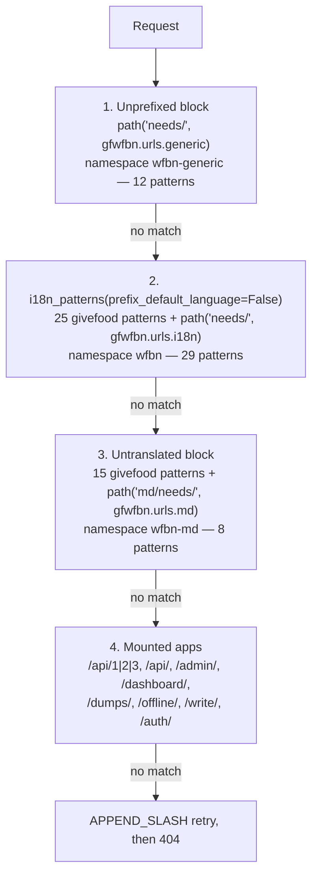

The three `gfwfbn` namespaces exist because the *same view module* is mounted three times at
three different points, and they behave differently:

| Namespace | Mount | Language prefixed? | Patterns | What lives there |
|---|---|---|---|---|
| `wfbn-generic` | `givefood/urls.py:13`, **before** `i18n_patterns` | **No** — one URL each | 12 | Hit beacon, `photo.jpg` ×3, `favicon.png` ×2, `screenshots/*.png`, webpush ×3, mobsub ×2 |
| `wfbn` | `givefood/urls.py:47`, **inside** `i18n_patterns` | **Yes** — 21 URLs each | 29 | Every HTML page, `geo.json` ×4, `rss.xml` ×2, `map.png` ×4 |
| `wfbn-md` | `givefood/urls.py:87`, **after** `i18n_patterns` | **No** | 8 | The `/md/needs/` Markdown mirror |

That `wfbn-generic` is unprefixed is the single fact that makes the PlacePhoto same-origin
constraint tractable: **there is exactly one canonical URL per photo, not 21.**

#### 6.1.2 Language resolution — reproduce it exactly, do not improve it

`prefix_default_language=False` plus Django 6.1's `LocaleMiddleware` produces behaviour that
is counter-intuitive and must be pinned by tests rather than reimplemented from instinct.
Verified live against production:

| Request | Status | `Content-Language` | `Vary` |
|---|---|---|---|
| `GET /` with `Accept-Language: pl` | 200 | `en` | `Accept-Language, Accept-Encoding` |
| `GET /cy/` | 200 | `cy` | `Accept-Encoding` |
| `GET /zh-hans/` | 200 | `zh-hans` | `Accept-Encoding` |
| `GET /tlh/` | 200 | `tlh` | `Accept-Encoding` |
| `GET /en/` | **404** | `en` | `Accept-Encoding` |
| `GET /de/` | **404** | `en` | `Accept-Language, Accept-Encoding` |

Two rules, and only two:

1. **The URL path prefix wins, and is the only signal that ever wins.**
2. **No prefix ⇒ hard-coded `en`.** The session key `_language`, the `django_language`
   cookie and `Accept-Language` are all computed by `get_language_from_request()` and then
   *discarded*. There is no content negotiation on this site.

`/en/` 404s because `LocalePrefixPattern` emits an empty prefix for the default language, so
`/en/...` matches no route — but `get_language_from_path('/en/')` still returns `en`, which
is why that 404 lacks `Vary: Accept-Language` while `/de/` has it.

> **Do not add `Accept-Language` negotiation.** It would change behaviour for every visitor
> *and* fragment the edge cache 21-fold, directly undermining goal 1. This is the cheapest
> possible way to make the site slower.

There is also **no `set_language` view**: `path('i18n/', include('django.conf.urls.i18n'))`
is not in the URLconf, so `/i18n/setlang/` does not exist and no language cookie is ever set.
Do not build one.

#### 6.1.3 The simplification that saves a week: no URL segment is translated

Every `path()` and `re_path()` in `givefood/urls.py`, `gfwfbn/urls/generic.py`,
`gfwfbn/urls/i18n.py` and `gfwfbn/urls/md.py` uses a **literal English string**. Not one is
wrapped in `gettext_lazy`. So `django.urls.translate_url` — which is called 22 times per
request by `givefood/context_processors.py` — reduces in practice to *swap or insert the
leading `/<lang>` segment*.

**Consequence: the Worker needs prefix arithmetic plus a name→pattern reverse table. It does
not need a reverse-URL engine, and it does not need per-language pattern tables.** This is
worth roughly a week of work that a naive reading of `i18n_patterns` would have cost.

#### 6.1.4 Implementation

One Hono router in the single `givefood` Worker. Middleware declaration order mirrors
Django's `MIDDLEWARE` list, because Hono's onion model maps onto it 1:1.

```ts
// workers/site/src/index.ts
import { Hono } from "hono";
import { LANGS, resolveLanguage } from "@gf/i18n";
import { slugRedirect } from "./middleware/slug-redirect";
import { geoJsonPreload } from "./middleware/geojson-preload";
import { serverTiming } from "./middleware/server-timing";

const app = new Hono<{ Bindings: Env; Variables: Vars }>();

app.use("*", serverTiming);      // was RenderTime — header, NOT a body rewrite (6.1.6)
app.use("*", slugRedirect);      // was SlugRedirectMiddleware
app.use("*", resolveLanguage);   // was LocaleMiddleware + i18n_patterns
app.use("*", geoJsonPreload);    // was GeoJSONPreload

// --- block 1: unprefixed, matched BEFORE the language router ---
app.route("/needs", wfbnGeneric);          // 12 patterns, namespace wfbn-generic

// --- block 2: language-prefixed ---
app.route("/", publicI18n);                // 25 givefood patterns
app.route("/needs", wfbnI18n);             // 29 patterns, namespace wfbn

// --- block 3: untranslated ---
app.route("/", publicUntranslated);        // 15 givefood patterns
app.route("/md/needs", wfbnMd);            // 8 patterns, namespace wfbn-md

// --- block 4: mounted apps ---
app.route("/api", apiApp);                 // §07
app.route("/admin", adminApp);             // §09
app.route("/dashboard", dashApp);
app.route("/dumps", dumpsApp);
app.route("/write", writeApp);

app.notFound(appendSlashThen404);          // was CommonMiddleware APPEND_SLASH
export default app;
```

`resolveLanguage` is the whole of `i18n_patterns`:

```ts
// packages/i18n/src/resolve.ts
export const LANGS = ["en","pl","cy","bn","ro","pa","ur","ar","gu","es","pt",
                      "gd","ga","it","ta","fr","lt","zh-hans","tr","bg","tlh"] as const;
const PREFIXES = new Set(LANGS.filter(l => l !== "en"));   // 20 — 'en' is NOT a valid prefix

export const resolveLanguage: MiddlewareHandler = async (c, next) => {
  const url = new URL(c.req.url);
  const first = url.pathname.split("/")[1] ?? "";

  if (PREFIXES.has(first)) {
    c.set("lang", first);
    c.set("langPrefixed", true);
    c.req.path = url.pathname.slice(first.length + 1) || "/";   // strip /<lang>
  } else {
    c.set("lang", "en");            // hard default. No Accept-Language. No cookie.
    c.set("langPrefixed", false);
  }
  // NOTE: `/en/...` deliberately falls through unmatched -> 404, matching production.

  await next();

  c.res.headers.set("content-language", c.get("lang"));
  if (!c.get("langPrefixed")) c.res.headers.append("vary", "Accept-Language");
};
```

`translate_url` and `page_translatable`:

```ts
// packages/urls/src/translate.ts
import { I18N_ROUTES } from "./generated/manifest";   // Set<string> of route names inside i18n_patterns

/** Swap or insert the leading language segment. Query string preserved. */
export function translateUrl(path: string, lang: string, qs = ""): string {
  const parts = path.split("/");
  if (PREFIXES.has(parts[1] ?? "")) parts.splice(1, 1);
  const bare = parts.join("/") || "/";
  const out = lang === "en" ? bare : `/${lang}${bare}`;
  return qs ? `${out}?${qs}` : out;
}

/** Was: "/cy/" === translate_url(path, "cy")[:4] — a probe. Now a set lookup. */
export function pageTranslatable(routeName: string | null): boolean {
  return routeName !== null && I18N_ROUTES.has(routeName);
}
```

`I18N_ROUTES` and the reverse table are **generated at build time from the Django URLconf**,
never hand-written, so they cannot drift while both stacks coexist:

```bash
# tools/url-extract/extract.py — run in CI, fails the build if the output changed
uv run python tools/url-extract/extract.py > packages/urls/src/generated/manifest.ts
git diff --exit-code packages/urls/src/generated/manifest.ts
```

#### 6.1.5 `APPEND_SLASH`

`givefood/settings.py:23` sets `APPEND_SLASH = True`, so every slashless request to a slash
URL currently 301s. Search engines and external consumers have those redirects baked in.

There is **no platform equivalent**. In particular, `html_handling: "force-trailing-slash"`
in the Workers Assets config only affects *static asset lookups*, not Worker routes —
reaching for it will look like it works on `/static/` and do nothing for the 3,000+ food bank
URLs that actually need it. Implement it explicitly:

```ts
const appendSlashThen404: NotFoundHandler = async (c) => {
  const url = new URL(c.req.url);
  if (!url.pathname.endsWith("/")) {
    const probe = new URL(url); probe.pathname += "/";
    if (app.router.match("GET", probe.pathname).length) {
      return c.redirect(probe.toString(), 301);
    }
  }
  return c.html(await render404(c), 404);
};
```

Set both `html_handling` and `not_found_handling` to `"none"` in `wrangler.jsonc`. Django
owns trailing-slash policy; letting the asset layer emit its own 301s produces redirect
chains across every food bank URL.

#### 6.1.6 The five middlewares

| Django middleware | Disposition |
|---|---|
| `RedirectToWWW` (`middleware.py:77`) | **Deleted from code.** Becomes a zone-level Redirect Rule. `origin.givefood.org.uk` ceases to exist at end state, so the `gfoffline` exemption goes with it. |
| `SlugRedirectMiddleware` (`middleware.py:157`) | 57 rows. Load the whole `{old: new}` map into `DATA` KV as one value; module-scope memo, 300 s. Regex-check at the top of the router. **See the bug below.** |
| `LoginRequiredAccess` (`middleware.py:45`) | §09 (admin). Scoped to `/admin/*` only. |
| `OfflineKeyCheck` (`middleware.py:26`) | **Deleted.** `/offline/` stops being an HTTP surface — §08. |
| `GeoJSONPreload` (`middleware.py:95`) | Trivial Hono middleware after routing: `Link: <…geo.json>; rel=preload; as=fetch; crossorigin=anonymous` for `index`, `foodbank`, `foodbank_locations`, `foodbank_donationpoints`, `foodbank_location`, `foodbank_nearby`, `constituency`. |
| `RenderTime` (`middleware.py:11`) | **Do not port as a body rewrite.** See below. |

**`RenderTime` must not be ported literally.** It does
`response.content.replace(b"PUTTHERENDERTIMEHERE", …)` on *every* response including
`image/jpeg` from the photo views and `application/json` from the geojson views. That forces
full body buffering, which is fundamentally incompatible with streaming an R2 object body —
the exact mechanism the PlacePhoto migration depends on. Replace with a
`Server-Timing: render;dur=N` header. If the visible HTML comment must survive, use
`HTMLRewriter` **gated on `Content-Type: text/html`** so binary and JSON stream untouched.

> ⚠️ **`Date.now()` does not advance during code execution on Workers.** A literal port
> reports 0 ms for everything. Use `performance.now()`, and expect timer coarsening even
> then. This is the same platform behaviour that makes Sentry spans report `0ms`.

#### 6.1.7 Three routing bugs to decide on, not discover

| # | Bug | Evidence | Recommendation |
|---|---|---|---|
| R1 | `SlugRedirectMiddleware`'s regex is `r'^(/[a-z]{2})?/needs/at/…'` — it cannot match `zh-hans` (7 chars) or `tlh` (3 chars). Renamed food banks silently fail to redirect in exactly those two languages. | `givefood/middleware.py:171` | **Fix.** Match against the known 20-prefix set instead of a character-count regex. Note the behaviour change in the release notes. |
| R2 | `foodbank_location` has **two stacked `@cache_page` decorators** — `SECONDS_IN_WEEK` at `:833` (orphaned from a deleted view) above `SECONDS_IN_DAY` at `:836`. Net effect: location pages advertise a 7-day `max-age`. | `gfwfbn/views.py:833,836` | **Fix to 1 day** and record it. The 7-day value was never intended. |
| R3 | `path("in/constituency/", RedirectView.as_view(url="/in/constituencies/"))` is missing the `/needs/` prefix, so it redirects to a 404. | `gfwfbn/urls/i18n.py:44` | **Fix** to `/needs/in/constituencies/`. Nothing can depend on a redirect to a 404. |

---

### 6.2 The template port

#### 6.2.1 Engine: Hono + build-time-precompiled Nunjucks

**Nunjucks is a Jinja2 port; Django's template language is Jinja2's sibling.** That is the
entire argument, and it is decisive. Measured across the **112 public-surface templates**:

| Django construct | Count | Nunjucks equivalent | Automatable? |
|---|---:|---|---|
| `` | **401** | `{{ url('name', args) }}` + generated reverse table | ✅ regex + codegen |
| `` / `` / `` | 345 | identical — Nunjucks **has** `elif` | ✅ verbatim |
| `…` | **211** | custom extension (~100 lines) | ⚠️ once, then verbatim |
| `` / `` | 197 | identical (`` → ``) | ✅ regex |
| `` | 147 | `{{ _("…") }}` | ✅ regex |
| `` | 123 | identical | ✅ verbatim |
| `` | 107 | identical, context inherits | ✅ verbatim |
| `` | 79 | delete | ✅ delete |
| `` | 68 | identical | ✅ verbatim |
| `` | 20 | `` | ✅ regex |
| `` | 4 | `{{ now(fmt) }}` global | ✅ regex |
| `` | 3 | `{{ csrf_token() }}` global | ✅ regex |
| `` | 1 | hand-port to a filter | ⚠️ hand |
| `` | 1 | `t(key, 'en')` | ⚠️ hand |

**~90% of the port is a regex transpiler.** Write it once as `tools/django-to-njk/`, keep it
in the repo as the migration's audit trail, and re-run it whenever a Django template changes
mid-migration.

Alternatives rejected, briefly: **React Router / Remix / any JSX** — `` +
`` has no analogue, so 112 templates become hand-written components with zero
mechanical transfer, and it ships a client React runtime to people looking for a food bank on
a constrained connection. **Astro** — closest runner-up, but `<slot />` is not named-block
override and file-based routing fights the 401 named-URL reverses. **Eta / Handlebars** —
both lose template inheritance outright.

#### 6.2.2 The non-negotiable implementation detail

`eval()` and `new Function` are **banned on Workers**
(<https://developers.cloudflare.com/workers/runtime-apis/web-standards/>). Every JS template
engine compiles templates via `new Function`. Therefore:

- Build step runs `nunjucks.precompile()` → plain JS modules.
- Runtime imports **`nunjucks/browser/nunjucks-slim`** (~20 KB gzip, no compiler).
- Importing plain `nunjucks` throws `EvalError: Code generation from strings disallowed for
  this context` **at runtime, not build time** — and it will pass any test that mocks the
  renderer.

```json
// .eslintrc — non-negotiable, this is not a matter of vigilance
"no-restricted-imports": ["error", {
  "paths": [{ "name": "nunjucks",
              "message": "Import nunjucks/browser/nunjucks-slim. Plain nunjucks bundles the compiler, which throws EvalError on Workers." }]
}]
```

#### 6.2.3 Inheritance mapping

`givefood/templates/public/page.html` (98 lines) is extended by **68 templates across seven
apps** — `givefood`, `gfwfbn`, `gfdash`, `gfwrite`, `gfdumps`, `gfapi2`, `gfauth`. It defines
five blocks, and every child overrides some subset:

| Block | Line | Used by |
|---|---:|---|
| `` | 26 | per-page `<meta>`, `og:`, JSON-LD, page CSS |
| `` | 41 | every page |
| `` | 44 | a handful |
| `` | 45 | every page |
| `` | 87 | map pages, dashboards |

Context flags it honours: `headless` (line 47, suppresses the footer — set by `human()`) and
`is_flag_page` (line 52). Note `is_home` (`views.py:207`) and `is_country_page`
(`views.py:279`) are set but referenced nowhere — **dead, do not port**.

**Sequence `page.html` first and freeze it.** Whatever templating decision lands here is
immediately binding on 68 downstream templates in six other apps. Budget review time, not
typing time.

#### 6.2.4 Filters and tags

`givefood/templatetags/custom_tags.py` is the **only** tag library in the project and defines
**four filters and zero custom tags**, each a one-line delegate to `givefood/utils/text.py`:

| Filter | Uses | Delegates to |
|---|---:|---|
| `friendly_phone` | 10 | `make_friendly_phone` — UK spacing |
| `full_phone` | 10 | `make_full_phone` — `0…` → `+44…` |
| `friendly_url` | 5 | `make_url_friendly` — strips scheme, strips `QUERYSTRING_RUBBISH` via `furl`, strips trailing `/` |
| `comma_separated` | 0 on the public surface | `", ".join(value.splitlines())` |

Port all four verbatim into `packages/templates/src/filters.ts` alongside the `utils/text.ts`
port. This is an afternoon, and it is the entire bespoke template-language surface.

The other 23 filters used on the public surface are Django stdlib/humanize:

```
intcomma 33 · linebreaksbr 21 · date 20 · floatformat 16 · safe 14 · truncatechars 9
urlencode 6 · timesince 5 · upper 4 · slugify 4 · linebreaks 4 · bulma 4 · lower 3
title 2 · default 2 · add 2 · truncatewords 1 · slice 1 · filesizeformat 1 · dictsort 1
```

`Intl.DateTimeFormat`, `Intl.NumberFormat` and `Intl.RelativeTimeFormat` cover `date`,
`intcomma`, `floatformat`, `filesizeformat` and `timesince` across all 21 locales with **no
date library**.

**`|bulma` (4 uses, django-bulma) has no port path.** It appears in
`public/register_foodbank.html:46`, `public/flag.html:36`, `write/constituency.html:63` and
`write/email.html:56`. **Hand-write those four forms.** This is real unbudgeted work hiding
behind a tiny usage count — call it a day, and note that `slugify` must reproduce Django's
exact Unicode/hyphen-collapsing behaviour because it is used to build URLs.

#### 6.2.5 Two semantic gotchas that regex cannot catch

**(1) Django auto-calls callables in templates. Nunjucks does not.**
`{{ obj.get_absolute_url }}` invokes the method in Django and renders the *function object*
in Nunjucks. This is invisible to a regex transpiler, produces garbage silently, and will not
be caught by any test that only checks status codes. Templates in this codebase lean on it
heavily — `{{ foodbank.full_name }}`, `{{ foodbank.latest_need.get_change_text }}`,
`{{ foodbank.locations }}`.

Mitigation — a mandatory, budgeted enumeration pass:

```bash
# tools/django-to-njk/find-callables.py
# Cross-references every {{ x.y }} in the 112 templates against the 33 model classes
# and emits the list of accessors that need () appended. 1 person-day. Not optional.
uv run python tools/django-to-njk/find-callables.py --templates givefood gfwfbn gfdash gfwrite gfdumps \
  > tools/django-to-njk/callables.txt
```

**(2) Django fails silently on missing variables; Nunjucks renders `undefined` or throws.**

```ts
new nunjucks.Environment(loader, {
  autoescape: true,
  throwOnUndefined: false,          // match Django
});
// plus a global finalize hook: undefined|null -> "" (Django's TEMPLATE_STRING_IF_INVALID)
env.addFilter("__finalize", (v: unknown) => (v === undefined || v === null ? "" : v));
```

Without this, literal `undefined` ships into production HTML.

#### 6.2.6 Whitespace: the `/md/` mirror is the sharp edge

The ten `.md` templates deliberately pack tags onto shared lines to control blank-line
placement. From `gfwfbn/templates/wfbn/foodbank/md/index.md`:

```
## Items needed
```

Nunjucks does **not** auto-trim whitespace around `` either, so this ports correctly —
**provided the transpiler does not "tidy" tags onto their own lines.** Add an explicit rule
to the transpiler and a byte-comparison golden test for all ten `.md` files.

The `/md/` mirror is advertised in `robots.txt`, in `/md/sitemap.xml`, in `llms.txt` and via
`<link rel="alternate" type="text/markdown">` on every food bank page. It is consumed by LLM
crawlers. **Byte-compare it, do not eyeball it.**

#### 6.2.7 Realistic per-template estimate

| Category | Files | Rate | Days | Notes |
|---|---:|---|---:|---|
| **Base layout + 7 includes** | 8 | — | **6.0** | `page.html` is the contract for 68 children. Frozen once, reviewed hard. |
| Static content pages (`about_us`, `apps`, `bot`, `services`, `privacy`, `donate`, `colophon`, `ar/index`, 7× `ar/YYYY`) | 15 | 0.15 d | 2.3 | 12 are static behind week-long caches. `ar/*` are long but inert. |
| Error pages `403/404/500` | 3 | 0.1 d | 0.3 | |
| `givefood` dynamic pages (`index`, `country`, `news`, `flag`, `register_foodbank`, `human`, `managed_donation`, `managed_donation_items`, `frags/news`) | 9 | 0.35 d | 3.2 | `index.html` has 38 translation tags |
| Sitemap/robots XML + txt (5 xml, `robots.txt`, `llms.txt`) | 7 | 0.25 d | 1.8 | Machine-consumed — byte tests |
| `/md/` mirror (`md/index.md`, `md/sitemap.md`, `md/sitemap.xml` + 8 wfbn `.md`) | 11 | 0.3 d | 3.3 | Whitespace-sensitive, golden tests |
| `gfwfbn` HTML pages | 20 | 0.4 d | 8.0 | `wfbn/index.html` has 45 translation tags |
| `gfwfbn` includes (6 foodbank + 3 wfbn) | 9 | 0.2 d | 1.8 | |
| `gfwfbn` email templates (3 `.txt` + 3 `.html`) | 6 | 0.2 d | 1.2 | English-only — see 6.3.6 |
| `gfwfbn/rss.xml` | 1 | 0.4 d | 0.4 | Public feed, `<link rel=alternate>` |
| `gfdash` | 20 | 0.3 d | 6.0 | Server-rendered echarts option literals |
| `gfwrite` (4 html + 2 txt) | 6 | 0.35 d | 2.1 | Includes 2 hand-written `\|bulma` forms |
| `gfdumps/dumps.html` | 1 | 0.3 d | 0.3 | |
| `tests/maplibre.html` | 1 | — | 0 | **Delete** — 395-line dev test page |
| **Subtotal** | **117**\* | | **36.7** | |
| Transpiler build + tuning | — | — | **4.0** | `tools/django-to-njk/` |
| Callable-enumeration pass (6.2.5) | — | — | **1.0** | |
| 4 hand-written `\|bulma` forms | — | — | **1.0** | |
| **Total template port** | | | **~43 person-days** | |

\* 117 > 112 because the `ar/YYYY` files and includes are counted individually above; the
delta is the deleted maplibre test page plus rounding.

That works out at **~0.33 person-days per template averaged**, which is the right order for a
transpiled port with tolerant-mode parity testing. It would be roughly 3× that if byte-equal
HTML were the target — which is precisely why the maintainer's relaxation to "roughly the
same HTML" matters and must be carried through the estimates.

---

### 6.3 Internationalisation on Workers

#### 6.3.1 What exists

- **21 languages** (`givefood/settings.py:231-251`), not 22.
- **20 `.po`/`.mo` pairs** under `locale/` — no `en`, which needs no catalogue.
- **286 msgids** per catalogue (285 for `tlh`); 1.1 MB of `.po`, 712 KB of `.mo`.
- `gu` and `tlh` are injected into `django.conf.locale.LANG_INFO` at `settings.py:216-231`
  because Django does not ship them.
- `LANGUAGES_SKIP_TRANSLATE = {"tlh"}` — Klingon has a hand-written UI catalogue but dynamic
  need text is never machine-translated into it.
- `ar` and `ur` are the only RTL entries (`bidi: True`).
- **`gfadmin/locale/` is 20 directories containing exactly one msgid (`"Search"`) with an
  empty `msgstr` in every language.** 160 KB translating nothing. **Delete it.**

There is **no `compilemessages` step anywhere** — not in the `Dockerfile`, not in
`pyproject.toml`, not in any script. The `.mo` files are compiled on a developer's machine
and committed. Nothing would catch a stale catalogue.

#### 6.3.2 Build-time compilation, lazy runtime loading

Keep the `.po` files in the repo as the source of record, **byte-compatible with
`makemessages`**, so any translator workflow survives untouched.

```bash
# packages/i18n/build.ts — runs in CI, output is committed and diff-checked
pnpm --filter @gf/i18n build
# locale/cy/LC_MESSAGES/django.po -> packages/i18n/dist/cy.js
```

```ts
// packages/i18n/build.ts (shape)
import { po } from "gettext-parser";
for (const lang of LANGS.filter(l => l !== "en")) {
  const parsed = po.parse(readFileSync(`locale/${lang.replace("-","_")}/LC_MESSAGES/django.po`));
  const out: Record<string,string> = {};
  for (const [msgid, entry] of Object.entries(parsed.translations[""])) {
    if (!msgid) continue;                                   // header
    if (entry.comments?.flag?.includes("fuzzy")) continue;  // gettext ignores fuzzy
    const msgstr = entry.msgstr[0];
    if (!msgstr) continue;                                  // empty -> fall through to msgid
    out[msgid] = msgstr;
  }
  writeFileSync(`dist/${lang}.js`, `export default ${JSON.stringify(out)};`);
}
```

> ⚠️ Note the directory naming mismatch: the locale directory is `locale/zh_Hans/` while the
> language code is `zh-hans`. Get this wrong once and Simplified Chinese silently falls back
> to English on every string.

**Load lazily with dynamic `import()` keyed on the resolved locale.** Statically importing 21
catalogues means parsing all of them inside the **1-second global-scope startup budget** in
order to use one:

```ts
// packages/i18n/src/catalogue.ts
const cache = new Map<string, Record<string,string>>();

export async function catalogue(lang: string): Promise<Record<string,string>> {
  if (lang === "en") return {};
  let c = cache.get(lang);
  if (!c) { c = (await import(`../dist/${lang}.js`)).default; cache.set(lang, c!); }
  return c!;
}

/** gettext semantics: a missing or empty msgstr falls through to the msgid (the English source). */
export function t(cat: Record<string,string>, msgid: string): string {
  return cat[msgid] || msgid;
}
```

Between 8% (`pa`, 22 untranslated) and 19% (`fr`/`ro`, 55 untranslated) of each catalogue is
still English fallback today. **That fallback behaviour is production behaviour and must be
preserved** — dropping empty `msgstr` entries at build time achieves it exactly.

#### 6.3.3 `` — the highest-value piece of the whole i18n port

211 of the 358 translation tags on the public surface are `blocktrans`, several with named
placeholder interpolation, e.g.
`gfwfbn/templates/wfbn/foodbank/includes/subscribe.html:52-54` uses
``.

A Nunjucks custom extension reproducing Django's `%(name)s` semantics means **all 211 blocks
and all 20 catalogues transfer unmodified.** No re-extraction, no re-translation, no
translator disruption.

```ts
// packages/i18n/src/blocktrans.ts — ~100 lines
export class BlockTransExtension {
  tags = ["blocktrans"];
  parse(parser, nodes, lexer) {
    const tok = parser.nextToken();
    const args = parser.parseSignature(null, true);   // "with a=b c=d"
    parser.advanceAfterBlockEnd(tok.value);
    const body = parser.parseUntilBlocks("endblocktrans");
    parser.advanceAfterBlockEnd();
    return new nodes.CallExtension(this, "run", args, [body]);
  }
  run(ctx, kwargs, body) {
    const msgid = body().trim();                     // the literal source string, as makemessages sees it
    const cat = ctx.lookup("__catalogue") as Record<string,string>;
    let out = cat[msgid] || msgid;
    for (const [k, v] of Object.entries(kwargs ?? {})) {
      out = out.split(`%(${k})s`).join(String(v));   // Django's placeholder syntax
    }
    return new nunjucks.runtime.SafeString(out);
  }
}
```

**One forced-English island** exists at `gfwfbn/templates/wfbn/index.html:189-191`:

```django
<option value="">
```

It renders the `?item=` option **value** in English while the label is translated, so the
submitted query parameter is always the English category name. This is a wire contract with
the `find_locations_by_category` view. Port it as an explicit `t(await catalogue('en'), key)`
call and add it to the edge-case corpus.

#### 6.3.4 The language switcher and `hreflang`

`givefood/context_processors.py` runs on **every** request and calls `translate_url` 22 times
plus `resolve()` twice. In the Worker this becomes pure string arithmetic (6.1.3) plus one
set lookup.

Context values every page needs:

| Variable | Source | Worker equivalent |
|---|---|---|
| `language_code` | `request.LANGUAGE_CODE` | `c.get("lang")` |
| `language_name` | `get_language_info(code)['name_local']` | hand-written table (Django lacks `gu`/`tlh`) |
| `language_direction` | `'rtl' if bidi else 'ltr'` | `ar`/`ur` → `rtl`, else `ltr` |
| `canonical_path` | `SITE_DOMAIN + translate_url(path, code)` | `translateUrl()` |
| `flag_path` | `canonical_path + "?" + QUERY_STRING` | ditto |
| `page_translatable` | probe: `"/cy/" == translate_url(path,"cy")[:4]` | `I18N_ROUTES.has(name)` |
| `languages` | 21 × `{code, name, url}` | `LANGUAGES.map(...)` with `translateUrl` |
| `facebook_locale` | `FACEBOOK_LOCALES.get(code, "en_GB")` | const map |
| `version` | `os.environ['SOURCE_COMMIT'][:7]` | `CF_VERSION_METADATA` binding or build-time const |
| `instance_id` | `os.environ['COOLIFY_CONTAINER_NAME'][:7]` | colo id, or drop |
| `domain` | `SITE_DOMAIN` | env var |

`page.html:24-25` emits **21 `hreflang` alternates on every translated page**, gated on
`page_translatable`. Untranslated pages (`/privacy/`, `/api/`, `/dumps/`, `/dashboard/`,
`/write/`, `/md/`) emit none and the switcher is suppressed. Reproduce that gating exactly —
it is a live SEO contract across 3,000 food banks × 21 languages.

Also reproduce the two language-conditional branches in `page.html`: the Charity Commission
register link swaps to the Welsh register when `language_code == 'cy'` (line 36), and the
`/api/` footer link appends "(English)" when `language_code != 'en'` (line 60).

RTL handling: `<html dir="{{ language_direction }}" class="txt-dir-{{ language_direction }}">`
plus flipped Bulma `is-pulled-left`/`is-pulled-right` in `page.html:51,70`,
`langswitcher.html:2` and ten `gfwfbn` foodbank templates. `gfwfbn/foodbank/includes/fsa.html:3`
passes `data-welsh="true"` to the FSA ratings badge when `language_code == 'cy'`.

#### 6.3.5 Dynamic content: `FoodbankChangeTranslation`

88,880 rows (after dropping 863 orphans — §04), 19 languages, machine-translated need text.
The read path is `FoodbankChange.get_text()` at `givefood/models/needs.py:216-258`, and it
has a **five-step fallback chain** that must be reproduced exactly:

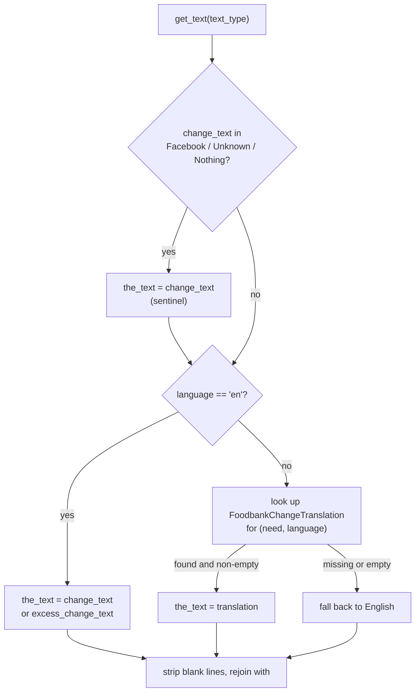

> ⚠️ **A real quirk to reproduce, not fix silently.** The sentinel branch at `needs.py:218-219`
> assigns `the_text = self.change_text` and is then **overwritten** by the very next
> `if current_language == "en"` / `else` block. So for a sentinel value in a non-English
> language, the code *does* look up a translation. If one exists, `need_text` becomes the
> translated word — and `gfwfbn/templates/wfbn/includes/need_text.html` compares
> `need_text == "Unknown"` **literally**, so the comparison fails and the translated sentinel
> renders as raw shopping-list text. Reproduce the code path, add it to the edge-case corpus
> with a food bank whose `change_text` is `"Unknown"` viewed at `/cy/`, and raise it with the
> maintainer as a follow-on fix.

The N+1 avoidance at `givefood/utils/geo.py:233-242` uses a language-filtered `Prefetch`. In
the Worker this becomes a single `WHERE need_id IN (?,…) AND language = ?` on the hydration
query. Do **not** embed need text in the geo index blob (§04) — it is 5-minute-stale and
language-blind, and it is the single thing on the site that must be current.

The three sentinel values `"Nothing"`, `"Unknown"`, `"Facebook"` are compared as exact
strings in at least six places and appear in API responses. They are part of the public data
contract, not internal markers.

#### 6.3.6 Emails are English-only, deliberately

None of `gfwfbn/templates/wfbn/emails/{notification,confirm,confirmed}.{txt,html}` contains
``. Notification bodies hard-code English and link to **unprefixed**
`https://www.givefood.org.uk/needs/at/<slug>/`. **Preserve this.** A port that helpfully
localises them is a behaviour change 5,855 subscribers would notice.

#### 6.3.7 Bundle arithmetic

| Component | Uncompressed | ~gzip |
|---|---:|---:|
| 112 precompiled templates (from ~420 KB of source, 2–4×) | ~1.2–1.7 MB | ~200–320 KB |
| 20 locale catalogues (from 1.1 MB of `.po`) | ~600–900 KB | ~150–250 KB |
| Hono + `nunjucks-slim` + app code | ~1.0–1.5 MB | ~250–350 KB |
| **Total** | **~3–4 MB** | **~600–900 KB** |

Against **10 MB compressed / 64 MB uncompressed** on Workers Paid: 10× headroom. **Script
size is not a constraint.** The **1-second startup budget** is the thing to watch, which is
why catalogues are lazily imported.

> **Spike required (½ day, Phase 0):** measure real cold-start parse time for ~112
> precompiled templates plus a lazily-imported catalogue against the 1 s budget. V8 lazily
> compiles function bodies so this should be tens of milliseconds, but it is the one limit
> this design approaches and it is the trigger for splitting the admin into its own Worker.

---

### 6.4 Static assets and the frontend

#### 6.4.1 What exists

`givefood/settings.py:268-270`: `STATIC_ROOT` points at the **source directory**
(`givefood/static`), there are no `STATICFILES_DIRS`, no manifest storage, **no content
hashing**, and `collectstatic` is **never run** — WhiteNoise scans the tree at startup.
`WHITENOISE_MAX_AGE = 31536000` (one year) on every file.

Measured: **40 MB across 194 files.**

| Directory | Size | Disposition |
|---|---:|---|
| `img/ar/**` | **27 MB** | → **R2** (cold; includes an 11 MB `ar/2025/androidapp.mp4`) |
| `img/appscreenshots/**` | 2.0 MB | → **R2** (cold) |
| `img/` remainder (logos, favicons, map markers, country SVGs, hplogos, manifest screens) | ~5 MB | → Workers Assets |
| `geojson/parlcon.json` | 2.6 MB | → **R2** (fetched by `/write/` and the constituency index) |
| `js/` | 2.3 MB | → Workers Assets (`echarts.js` 1.1 MB + `maplibre-gl.js` 1.0 MB = 94%) |
| `fonts/` | 1.1 MB | → Workers Assets, **drop `materialdesignicons-webfont.woff`** (576 KB legacy; every browser that runs this site prefers the `.woff2`) |
| `css/` | 1.0 MB | → Workers Assets |
| `maptest/`, `root/`, `wfbn_manifest.json` | 24 KB | **Audit for deletion** — all appear orphaned |

**Hard limits that bite:** Workers Assets caps an individual file at **25 MiB** and a version
at 20,000 (Free) / 100,000 (Paid) files. Nothing in `static/` exceeds 25 MiB, but three repo
data files do or approach it — see 6.4.4.

#### 6.4.2 Cache busting

Only **17** referenced files carry `?v={{ version }}` (from `SOURCE_COMMIT[:7]`):
`about_us.css`, `admin.css`, `autocomplete.css`, `bulma.min.css`, `gf.css`, `hp.css`,
`managed_donation.css`, `materialdesignicons.min.css`, `wfbn.css`, `admin.js`,
`autocomplete.js`, `burger.js`, `csi.js`, `gf.js`, `htmx.js`, `tabber.js`, `wfbn.js`.

Everything else — `echarts.js`, `maplibre-gl.js`, `maplibre-gl.css`, `pmtiles.js`,
`webpush.js`, `instantpage-5.2.0.js`, `highlight.pack.js`, all 149 images, all 6 fonts,
`parlcon.json` — has **no version parameter and a one-year TTL**.

> **Assume every current `/static/…` URL is pinned in real browsers until 2027.** Introduce
> content hashing at build time, but **keep every existing unhashed path serving as an alias**
> through at least one full year. `webpush.js` is in the unbusted set, so a change to the push
> flow will not reach returning browsers.

There are **zero `` template tags** in the codebase — every reference is a
hard-coded `/static/…` string, which makes the alias approach straightforward.

#### 6.4.3 Configuration

```jsonc
// workers/site/wrangler.jsonc (asset-relevant excerpt)
"assets": {
  "directory": "./dist/static",
  "binding": "ASSETS",
  "html_handling": "none",        // Django owns trailing-slash policy (6.1.5)
  "not_found_handling": "none"
}
```

```
# dist/static/_headers — applies ONLY to asset responses, never to Worker-generated ones
/static/*
  Cache-Control: public, max-age=31536000, immutable
```

> ⚠️ **`_headers` does not apply to responses generated by Worker code**, even when the URL
> matches. Essentially all givefood HTML is Worker-generated, so every security header,
> `Cache-Control`, `Vary` and `Content-Language` must be set in the Worker. A `_headers` file
> will appear to work in testing against `/static/*` and silently do nothing for real pages.

Asset requests are **free and unlimited** and never invoke the Worker.

#### 6.4.4 Repo data files that are not static assets

Currently shipped inside the Docker image on every deploy:

| File | Size | Read by | Disposition |
|---|---:|---|---|
| `givefood/data/places.csv` | **61 MB** | `import_places` | → R2 ops bucket (**exceeds the 25 MiB asset cap**) |
| `givefood/data/parlcon/**` | **27 MB** | `parlcon_loader_geojson` | → R2 ops bucket |
| `givefood/data/2024-candidates.csv` | 5.5 MB | admin loader | → R2 ops bucket |
| `givefood/data/bank-holidays.json` | 22 KB | **`givefood/models/foodbank.py:43-52` at module import — on a request path** (donation-point opening hours) | **Bundle it.** Small, hot, updated once a year. |
| `givefood/data/london_postcodes.txt` | 1 KB | `gfdash` `beautybanks` on every cache miss, via a **CWD-relative path** | **Make it a module constant.** The CWD will not exist in a Worker. |
| `givefood/data/sa_locations.csv`, `2024_mps.csv`, `mp_twitter.csv` | 207 KB | admin loaders | → R2 ops bucket (§09) |

That is **~93 MB of build-time data removed from every deploy**, which directly serves goal 3.

> **Note:** `parlcon_loader_geojson` (`gfadmin/views.py:2631`) reads
> `./givefood/data/parlcon/gb.geojson`, which **no longer exists in the repo**. Boundary data
> can currently only be regenerated from the *database*. Export it before touching anything.

#### 6.4.5 Client-side JavaScript — no rewrite

`wfbn.js`, `csi.js`, `gf.js`, `autocomplete.js`, `webpush.js`, `burger.js`, `tabber.js` are
plain browser JS with no server dependency. **They port unchanged.** Three things they assume
must stay true:

1. `wfbn.js:407` hard-codes `'/needs/at/' + foodbankSlug + '/'` in map popups.
2. `gfwfbn/templates/wfbn/constituency/index.html:168` hard-codes
   `'/needs/in/constituency/' + slug + '/'`.
3. `csi.js` writes fragment responses straight into `innerHTML`, so the content-type contract
   for `/frag/` is implicit but real.

`webpush.js:111` registers `/sw.js` with `scope: '/'`. That is the **only**
`serviceWorker.register` call in the entire codebase — `firebase-messaging-sw.js` is
registered by nothing. See the tick-list.

#### 6.4.6 Two Phase-0 checks that gate everything

**(a) `/cdn-cgi/image/` × Worker route — BLOCKER, unverified.**

18 `<picture>`/`<source>` elements across five templates prefix same-origin photo and map
paths with `https://www.givefood.org.uk/cdn-cgi/image/width=…,format=avif`:

```
gfwfbn/templates/wfbn/index.html:145-147
gfwfbn/templates/wfbn/foodbank/donationpoint.html:113-115
gfwfbn/templates/wfbn/foodbank/donationpoints.html:78-80, 97-99
gfwfbn/templates/wfbn/foodbank/location.html:119-121
gfwfbn/templates/wfbn/foodbank/locations.html:82-84, 91-92   ← also wraps map.png
```

Cloudflare's troubleshooting docs document this as a failure mode:
**Error 9524** — *"The `/cdn-cgi/image/` resizing service could not perform resizing. This may
happen when an image URL is intercepted by a Worker."* Recommended workaround: *"Resize
within the Worker instead."* **Error 9403** cautions specifically against *"Workers scoped to
the entire domain `/*`"* — which is the recommended topology (§02).

Today these paths have no Worker route, which is why they work.

```bash
# SPIKE — half a day, Phase 0, BEFORE any Phase 1 commitment.
# On a staging zone: put a Worker route on one photo path, then request it through
# the resizing prefix. Test BOTH topologies, because they may differ.
curl -sI "https://staging.givefood.org.uk/cdn-cgi/image/width=300,format=avif/needs/at/<slug>/photo.jpg"
# PASS = a resized image. FAIL = 9524 or 9403.
```

**If it fails, the design changes materially.** Options, in order: (i) the Worker does the
transform itself via `fetch(url, {cf:{image:{width, format}}})` — which reinstates the
Cloudflare Images cost the plan currently rejects on ~£6/month-forever grounds; or
(ii) precompute all four widths used in the markup (150/300/540/1080) at ingest and **remove
the `/cdn-cgi/image/` prefix from the templates** — an HTML change on pages the fidelity rule
covers, and therefore a maintainer decision.

**(b) `Set-Cookie` on cacheable HTML — 5 minutes, do it first.**

`SessionMiddleware` (`settings.py:96`) and `MessageMiddleware` (`settings.py:98`) are both
active. A `Set-Cookie` on a cached path makes the response uncacheable to both Cloudflare and
the Cache API, which would **silently nullify the entire Phase 0 caching work** — the phase
carrying the whole of goal 1.

```bash
for u in / /needs/ /cy/needs/at/<slug>/ /about-us/; do
  echo "== $u"; curl -sI "https://www.givefood.org.uk$u" | grep -i '^set-cookie' || echo "  (none - good)"
done
```

---

### 6.5 Work package: `givefood` (public site) — 22–28 person-days

The `givefood` app is simultaneously the public marketing site *and* the shared foundation:
`public/page.html` is extended by 68 templates across seven apps, `context_processors.py`
injects into every render, and `utils/cache.py` owns `decache()`. **It is not a leaf task and
must be sequenced first.**

| # | Task | Acceptance criteria | pd |
|---|---|---|---:|
| G1 | Port `public/page.html` + 7 includes (`debugcomment`, `langswitcher`, `mapconfig`, `maplegend`, `appbadges`, `country`, `serviceareadisclaimer`). **Freeze the block contract.** | Tolerant parity green on the base layout in `en`, `cy` and `ar`. The five block names and the `headless`/`is_flag_page` flags behave identically. 21 `hreflang` links present on translated pages, absent on `/privacy/`. | 6.0 |
| G2 | Router: three-block ordering, `i18n_patterns`, `APPEND_SLASH`, generated reverse table (401 `` sites). | The seven live-verified header cases in 6.1.2 pass as pinned tests, including `/en/` → 404 and the `Vary` split. `git diff --exit-code` on the generated manifest passes in CI. | 5.0 |
| G3 | Middleware: `SlugRedirect` (KV, **regex fixed for `zh-hans`/`tlh`**), `GeoJSONPreload`, `Server-Timing`. Delete `RedirectToWWW` (zone rule), `OfflineKeyCheck`. | `/needs/at/durham/` 301s to `/needs/at/county-durham/` in **all 21 languages**, including `/zh-hans/` and `/tlh/`. `Link: rel=preload` present on the seven route names. | 2.5 |
| G4 | 15 static content pages + 3 error pages + `frags/news.html`. | Tolerant parity. | 2.6 |
| G5 | Dynamic pages: `index`, `country` ×4 + `country_geojson`, `news`, `flag`, `register_foodbank`, `human`, `managed_donation` ×3. Includes the two `\|bulma` forms hand-written and the `/human/` Turnstile interstitial. | `?thanks=1` redirect preserved. Turnstile sitekey `0x4AAAAAAABxtIRWlPcEGwhj` and the two-step form flow work. `country_geojson` coordinates round to **4 dp** — see the float trap in 6.6. | 4.5 |
| G6 | Machine-readable: `robots.txt` (44 `Disallow` + **43 `Sitemap`** lines), 5 sitemap XML, `llms.txt`, `manifest.json` ×21, `security.txt`, `/md/` (3 templates + 2 views). | `robots.txt` emits exactly 43 `Sitemap:` directives (21 langs × 2 + `/md/sitemap.xml`). `/md/*` byte-compares. `security.txt` body is the exact two literal lines. | 4.0 |
| G7 | `/sw.js` becomes a **real static file** (its content is entirely static). `firebase-messaging-sw.js`: **delete after checking analytics** (see tick-list). | `/sw.js` served from the root as `application/javascript` with `Service-Worker-Allowed: /`. Existing push subscriptions keep working. | 0.5 |
| G8 | `/frag/<slug>/` — 4-value whitelist, redesigned for caching. | `ip-address` uncached and per-user from `CF-Connecting-IP`. `last-updated` and `need-hits` served from KV, refreshed by a 5-minute cron — **zero database work per request**. `news` cached 1 h. 404 outside the whitelist, 403 on falsy text. | 1.5 |
| G9 | `/aac/` address autocomplete. | See 6.6 — the parity mode for this endpoint is an open decision. | 2.0 |
| G10 | `/whatsapp_hook/` GET verification + POST → Queue (return 200 immediately). **Add `X-Hub-Signature-256` verification**, which does not exist today. | GET echoes `hub.challenge` as `text/plain` on token match, 403 otherwise. POST always returns 200. Unsigned POSTs rejected but still 200 to Meta. | 1.5 |
| G11 | `/<uuid>/` redirect (Foodbank → Location → DonationPoint, in that order), `/wp-login.php` rickroll, `/what-food-banks-need/` → `/needs/`. Delete `/tests/maplibre/`. | 302 to the canonical page; 404 otherwise. | 0.5 |

**Deletions in this package** (confirmed dead, zero importers outside `README.md`):
`givefood/const/topplaces.py` (13.5 KB), `parlcon_mp.py` (26 KB), `parlcon_party.py`
(24.8 KB), `item_classes.py` (5.9 KB) — **70 KB**. Also `givefood/checks.py` (never
registered; green tests describing behaviour that does not exist), `views.py:1138`
`slug_redirect()` (dead duplicate of the middleware), and `gfadmin/locale/`.

---

### 6.6 Work package: `gfwfbn` — 26–34 person-days

The primary public surface: 1,415 lines of views, 37 templates, 49 URL patterns across three
namespaces, and the 9–11 M/month route family.

| # | Task | Acceptance criteria | pd |
|---|---|---|---:|
| W1 | 20 HTML pages + 9 includes: `index`, `foodbank/{index,locations,location,donationpoints,donationpoint,donationpoint_openinghours,charity,news,nearby,updates}`, `constituency/{index,constituency}`. | Tolerant parity across **50 stratified food banks × 8 page types × 3 languages** (`en`, `cy` for `alt_name` + Welsh word order, `ar` for RTL). The 404-on-empty-collection boundaries hold: `/news/` 404s without `rss_url`/`news_url`; `/locations/` 404s at `no_locations == 0`; `/donationpoints/` 404s at `no_donation_points == 0`; `/charity/` 404s without `charity_name`. | 9.0 |
| W2 | `wfbn/rss.xml` — merges 10 needs + 10 articles, sorted by date desc. | `application/rss+xml`. `atom:link rel=self` present. Need permalink fragment `SITE_DOMAIN + /needs/at/<slug>/#need-<need_id>` preserved. | 0.5 |
| W3 | 8 `/md/needs/` templates. | **Byte-compared** golden tests for all 8. `Content-Type: text/markdown; charset=utf-8`. | 2.5 |
| W4 | `geo.json` ×4 (all-items, per-foodbank, per-location, per-constituency). Precompute to R2 on write — ~8,800 features cannot be assembled per request. | `properties.type` vocabulary exactly `f` / `l` / `lb` / `d` / `b`. **4 dp for the all-items feed, 6 dp for scoped feeds.** `address` stripped from the all-items feed only. **See the float trap below.** | 3.5 |
| W5 | Nearest-search: in-memory haversine over the ~8,721-point index. | Result ordering and `distance_m` match production across 200 sampled postcodes. `R = 6378168` for the v2 paths. **Known divergence documented** — see below. | 3.0 |
| W6 | **`photo.jpg` ×3 from R2, same-origin**, streamed, `?size=` normalised to an allowlist. | Byte-identical JPEG for 200 sampled photos. `/cdn-cgi/image/` prefix resolves (**gated on the 6.4.6(a) spike**). 404 when `place_has_photo` is false. `Cache-Control: max-age=604800`. | 3.0 |
| W7 | **`map.png` ×4 → R2.** *This had no work package in earlier drafts.* 1,071 food banks × 3 sizes + 1,974 locations × 3 = **9,135 URLs**, and they are the `og:image` on **seven** page types. Currently a live Google Static Maps proxy with **no persistence** (`gfwfbn/views.py:485`). | All 9,135 precomputed into R2 at ingest, rebuilt on Foodbank/Location save. **Zero Google Static Maps calls on the request path.** `size` restricted to exactly 300 / 600 / 1080, anything else → 400. Location variant renders `boundary_geojson` downsampled to ≤100 points at 4 dp. | 3.0 |
| W8 | **`favicon.png` ×2 → R2.** *No work package in earlier drafts.* Live `google.com/s2/favicons` fetch per cache miss (`gfwfbn/views.py:519`), rendered 5× per homepage. | Served from R2. Falls back to the bundled `DEFAULT_FAVICON` rather than 404ing, matching `views.py:30-32`. | 1.0 |
| W9 | **`screenshots/*.png` → R2.** *No work package in earlier drafts.* 1,071 × 5 = **5,355 URLs**, each currently a synchronous Cloudflare Browser Rendering call with `waitUntil: networkidle0` and a **45-second timeout**. | Generated by a Queue consumer, served as a pure R2 read. The five-name enumeration in the URL preserved. First-request behaviour changes from "slow 200" to "404 until generated" — **flag to maintainer**. | 1.5 |
| W10 | Subscribe / confirm / unsubscribe, webpush ×3, mobsub ×2, hit beacon. | **POST to unsubscribe returns a bare 200 with an empty body** (RFC 8058 one-click — breaking this downgrades deliverability for every notification email). `/needs/mobsub/` returns `{"success": true}` keyed on `Foodbank.uuid`, matching the shipped iOS/Android binaries. Hit beacon returns **204**. | 3.0 |
| W11 | `/needs/getlocation/` — **delete the freeipapi.com call**, use `request.cf.latitude/longitude`. | Same 302 shape to `/needs/?lat_lng=lat,lng`. One fewer third-party dependency, lower latency, and the visitor's IP stops leaving Cloudflare. | 0.5 |
| W12 | `mp_photo_redirect` 302 to `photos.givefood.org.uk/2024-mp/<id>.jpg`; `manifest.json` → `/manifest.json` 301; `tt-old-data` redirect; **fix the `/needs/in/constituency/` 404 redirect (R3)**. | All four resolve. | 0.5 |

#### The float trap in `geo.json` and `country_geojson`

`gfwfbn/views.py:216-220` rounds coordinates to 4 dp (all-items) and 6 dp (scoped);
`givefood/views.py:318-420` rounds to 4 dp. `geo.json` is in the **STRICT byte-equality**
parity corpus.

```python
>>> import json; json.dumps(round(51.0, 4))
'51.0'
```
```js
> JSON.stringify(Number((51.0).toFixed(4)))
'51'
```

**Python emits `51.0`; JavaScript emits `51`.** The UK straddles the 0.0 meridian, so
longitudes near zero hit this constantly, and any food bank at a whole-degree latitude hits it
too. This is the same defect class as `distance_mi` in the API (§07) and it must use the same
`pyJson()` float serialiser from `packages/serialise` — which forces a decimal point and
reproduces Python's exponential thresholds (`≥1e16`, `<1e-4`, with `e+16`/`e-05` spelling).

**Do not solve this twice.** `packages/serialise` is shared between §06 and §07.

#### Known divergence in `/nearby/`

`givefood/utils/geo.py:246-301` issues **two** queries, each `ORDER BY NearestFirst` (chord
distance) `LIMIT 20`, then chains, re-sorts by great-circle `distance`, and slices. For
`skip_first=True` (which `/nearby/` uses) the return is `[1:21]`. If one leg alone fills ranks
0–19 — routine for a Trussell food bank with 20+ clustered locations — the true rank-20 item
is that leg's rank 20 and is never fetched; production emits the *other* leg's candidate
instead.

A global in-memory top-21 scan returns the **correct** item and therefore **differs from
production**.

> **Decide explicitly and write it down:** either emulate two-leg-limit-then-merge in JS to
> reproduce production exactly, or do the global scan and add `/needs/at/<slug>/nearby/` and
> `/md/needs/at/<slug>/nearby/` to a documented known-divergence list. Otherwise someone burns
> days treating a fix as a regression.

Two adjacent items worth checking before porting: `find_donationpoints` applies its optional
`foodbank=` filter **after** slicing (`geo.py:435-437`), which in Django raises `TypeError` on
a sliced queryset — so that path is either dead or broken today; and
`find_locations_by_category` materialises an unbounded id list into `foodbank_id__in=[…]`
(`geo.py:347-360`), which on D1 hits the hard **100-bound-parameter cap** for any category
matching more than ~100 food banks.

#### `/needs/at/<slug>/` has no origin cache today

`@cache_page` is **commented out** at `gfwfbn/views.py:362`, so the site's highest-traffic
page emits **no `Cache-Control` at all**. A Cache Rule set to "respect origin" will therefore
do nothing. It needs an **explicit override TTL** plus tag-based invalidation from day one
(§03), and its current origin RPS is unknown — pull the real figure from Cloudflare Analytics
in Phase 0 before sizing anything.

---

### 6.7 Work package: `gfdumps` — 2–3 person-days

Per the fixed maintainer decision, dump payloads move to R2 and **may** be served from a
different domain. The three listing pages stay on `www`.

| # | Task | Acceptance criteria | pd |
|---|---|---|---:|
| D1 | Port `gfdumps/dumps.html` (one template, three `stage` values: `index`, `types`, `format`). Render from the D1 metadata table — **never `ListObjects`**, which is a Class A operation at 12.5× the price of a read. | Three listing pages render with `size` and `row_count`. Link targets are absolute `https://dumps.givefood.org.uk/…`. | 1.0 |
| D2 | Redirect layer. `/dumps/<t>/<f>/latest/` → **302**; `/dumps/<t>/<f>/<Y>-<M>-<D>/` → **301**. | **Both date forms resolve.** The Django URLconf uses three separate `<int:>` converters joined by literal hyphens, so `/dumps/foodbanks/csv/2026-8-9/` is a valid live URL alongside `2026-08-09`. The redirect Worker must `parseInt` + `padStart(2,'0')` each segment — a static Bulk Redirect rule will 404 one of the two live forms. | 1.0 |
| D3 | Fix `llms.txt`, which hardcodes `{{domain}}/dumps/` and advertises **"CSV, JSON, XML, and YAML exports"**. There has never been a YAML dump. | Text corrected in the same change. | 0.2 |

> ⚠️ **Nothing in this repository writes to `github.com/givefood/data`** — no `subprocess`, no
> GitPython, no `api.github.com` call anywhere. Whatever publishes that repo is external,
> invisible from here, and almost certainly consumes the 12 `/latest/` URLs. **It cannot be
> tested against.** Ship the redirects *before* the R2 cutover and keep them permanently. Ask
> the maintainer what publishes it.

---

### 6.8 Work package: `gfdash` — 6–8 person-days

20 read-only analytics pages over data that changes at most a few times a day. No auth (the
`LoginRequiredAccess` middleware gates `gfadmin` only), so these are public and crawlable.

| # | Task | Acceptance criteria | pd |
|---|---|---|---:|
| S1 | Port 20 templates. Keep the **server-rendered echarts option-literal** pattern — it needs no change and avoids inventing JSON endpoints. Keep `echarts.js` vendored (1.1 MB) rather than a CDN, given the CSP posture. | Tolerant parity. **The HTML `<table>` beneath every chart is preserved** — it is the accessible and scrapeable fallback, and researchers cite the numbers. | 5.0 |
| S2 | Rewrite the two raw-SQL queries. `gfdash/views.py:385`: `to_char` → `strftime('%Y-%m', …)`, `~* 'beans'` → `LIKE '%beans%'` (SQLite's `LIKE` is already ASCII-case-insensitive, and both patterns are plain literals), `published = True` → `published = 1`. `views.py:410`: same `to_char` fix; build `metric_sql` from an **allow-list map**, never string interpolation. | Both produce the same buckets as production. `sum(weight)/1000` **keeps integer division** — SQLite truncates identically, so do not "fix" it to float or every published weight figure changes. | 1.0 |
| S3 | Fix the three shape problems: `weekly_itemcount` / `weekly_itemcount_year` pull **25,345 rows including full `change_text` bodies** to count lines in Python — push into SQL with `length(x) - length(replace(x, char(10), '')) + 1`. `foodbanks_found` has an O(n²) `.index()` inside its own loop — use `enumerate`. `?days=` parses **before** the allow-list check, so `?days=abc` is a 500 — parse defensively and return 400. | Row counts unchanged; `?days=abc` returns 400 not 500. | 1.5 |
| S4 | `beautybanks` — the highest D1 risk on the site. It OR-chains a `LIKE` per London postcode prefix (read from a **CWD-relative** file) plus a `LIKE` per each of 39 products into one statement. | Precompute a `matches_beautybanks` boolean at need-ingest and an `is_london` boolean on Foodbank, so the dashboard becomes an indexed filter. `london_postcodes.txt` becomes a module constant. | 1.0 |
| S5 | `/dashboard/price-per-kg/` → `/dashboard/price-per/kg/` permanent redirect preserved. Delete the dead `foodbank_locations_found` view (no URL, verbatim copy of `foodbanks_found`). | 301 still issued. | 0.2 |

**Sequencing note:** `heatmap` and `beautybanks` fetch `/needs/geo.json` and the constituency
geojson **at request time**. `gfdash` cannot ship before `gfwfbn`.

---

### 6.9 Work package: `gfwrite` — 5–6 person-days

175 lines, five routes, six templates. Small — but the security work must land *with* it.

| # | Task | Acceptance criteria | pd |
|---|---|---|---:|
| R1 | Port the five routes and six templates, including **two hand-written `\|bulma` forms** (`ConstituentDetailsForm` 4 fields, `EmailForm` 6). | Tolerant parity. The `readonly` `to_field` is HTML-only, and `send` correctly **ignores it** in favour of `constituency.email` from the database (`views.py:142`) — preserve that. | 2.0 |
| R2 | **Add Turnstile** on the constituency form and again on the compose form, verified server-side. Copy the existing pattern from `gfwfbn/views.py:1118`, including the `?turnstilefail=true` redirect convention. | A submission without a valid token is rejected. | 1.0 |
| R3 | **Add real CSRF.** `CsrfViewMiddleware` is commented out at `settings.py:97`, so the `` tags at `constituency.html:65` and `email.html:58` are decorative and nothing validates them. | Signed double-submit token in a `__Host-` cookie, `SameSite=Lax`, validated on every mutating request, plus an `Origin`/`Sec-Fetch-Site` check. | 1.0 |
| R4 | **Add a WAF rate-limiting rule** on `http.request.uri.path matches "^/write/to/[^/]+/email/send/$"`. | ~3 requests/hour/IP. This is dashboard configuration, no code. | 0.3 |
| R5 | Fix the two 500s: `GET /write/to/<slug>/email/send/` falls off the end returning `None` → `ValueError` → 500. And stop discarding `send_email`'s return value, so a Postmark failure no longer shows "Email Sent". | GET returns 405. A Postmark failure surfaces to the user. | 0.5 |
| R6 | `parlcon.json` (2.6 MB) served from R2, gzipped, content-hashed. Postcode → constituency lookup keeps using `api.postcodes.io` but should move to the D1 `postcode` table once §04 lands — one indexed lookup, no external call. | `/write/` renders; the map loads. | 0.5 |
| R7 | **Do not reimplement `slugify`.** `views.py:24` derives the constituency URL by slugifying the postcodes.io name and matching it against the stored `slug`. A JS slugify with different Unicode handling silently 404s constituencies with apostrophes, accents or ampersands. | Replace derive-then-redirect with a D1 lookup on the ONS `PCON24CD` code (present in both `parlcon.json` properties and the 2024 CSV). **Before cutover, diff a candidate JS slugify against all 650 stored slugs.** | 0.5 |

> ⚠️ **Today `POST /write/to/<slug>/email/send/` has no CSRF, no Turnstile and no rate limit,
> and it relays an attacker-controlled `subject` and `body` from `mail@givefood.org.uk` to a
> sitting MP — while also delivering the same body to any `Cc` address the caller names.** A
> faithful port carries that onto the new platform. It is a defect to fix, not behaviour to
> preserve.
>
> Also note `givefood/utils/notifications.py:117-118`: `reply_to == "test@example.com"`
> diverts mail away from the MP. `reply_to` is the user-supplied address, so this is reachable
> from the public form. Decide deliberately whether to preserve or remove it.

---

### 6.10 The long-tail tick-list

Everything below is a public URL or contract that a route-by-route port can miss. Tick each
one against the parity harness (§10), not against a reading of the code.

#### Machine-readable and SEO

- [ ] `/robots.txt` in **all 21 languages** — 44 `Disallow` lines (`/aac/`, `/at/*/hit/`, plus
      `wfbn:get_location` and `flag` per language) and **exactly 43 `Sitemap:` directives**
      (21 langs × 2 + `/md/sitemap.xml`). `Crawl-delay: 2`. `text/plain`.
- [ ] `/sitemap.xml` × 21 — `<urlset>`/`<url>`/`<loc>`/`<changefreq>` shape; conditional
      emission of `foodbank_locations` / `foodbank_donationpoints` / `foodbank_news` /
      `foodbank_charity`; per-food-bank `<changefreq>`; `Content-Type: text/xml`.
- [ ] `/sitemap_places_index.xml` × 21 and `/sitemap_places[_N].xml` — **`PLACES_PER_SITEMAP = 10000`**
      over 253,584 places = 26 child sitemaps. Replace the `OFFSET 250000` deep pagination
      (measured **425 ms mean**, the slowest geographic query on the site) with keyset
      pagination, or pre-generate the 26 pages to R2 on a cron.
- [ ] `/sitemap_external.xml` — untranslated; deliberately points at food banks' **own**
      external URLs.
- [ ] `/md/`, `/md/sitemap.xml`, `/md/sitemap.md` + 8 `/md/needs/…` routes —
      `text/markdown; charset=utf-8`, byte-compared. Note `md/sitemap.md` emits **relative**
      links for food banks/locations/donation points but **absolute** ones for
      pages/countries/constituencies. Reproduce, do not tidy.
- [ ] `/llms.txt` — `text/plain; charset=utf-8`. Two dynamic values (`foodbanks`,
      `donationpoints` counts). **Fix** the `{{domain}}/dumps/` link, the phantom YAML claim,
      and "20 languages" (it is 21).
- [ ] `/.well-known/security.txt` — the exact two literal lines
      (`Contact: mailto:mail@givefood.org.uk`, `Expires: 2030-01-01T00:00:00.000Z`). Note the
      stale unrouted duplicate at `givefood/static/root/security.txt`.
- [ ] `<link rel="canonical">` on every page; 21 `hreflang` alternates gated on
      `page_translatable`.
- [ ] The `schema.org` NGO JSON-LD block in `page.html:27-40`, in particular
      `@id: https://www.givefood.org.uk/#organization`, which food bank pages reference.
- [ ] `Foodbank.schema_org_str()` — `json.dumps(indent=4, sort_keys=True)` is literally in the
      HTML of all 1,071 food bank pages. Formatting falls under the tolerant HTML rule, but
      **content (keys and values) must match**, and reproducing the serialisation exactly is
      cheap and worth doing. `givefood/tests/test_schema_org.py` becomes a parity test.

#### App-shell and service workers

- [ ] `/manifest.json` × 21 — `lang` from the request, `description` via `gettext()`,
      3 screenshots at 1402×2356, `prefer_related_applications: true`,
      `Cache-Control: max-age=86400`. Linked from `page.html:15`.
- [ ] `/needs/manifest.json` → `/manifest.json` **301**.
- [ ] `/sw.js` — becomes a real static file at the domain root with
      `Service-Worker-Allowed: /`. Push payload contract `{head|title, body, icon, url, tag}`.
      Already registered in subscribed browsers, so **the path cannot move**.
- [ ] `/firebase-messaging-sw.js` — **nothing registers it.** The only
      `serviceWorker.register` in the codebase is `webpush.js:111` for `/sw.js`, and there is
      no Firebase JS SDK on any page. It also leaks six Firebase config values.
      **Check Cloudflare Analytics for the path first** — an already-registered SW persists in
      browsers until its URL 404s — then delete.
- [ ] `/favicon.ico` is **unrouted**. `givefood/static/img/favicon.ico` exists (15,086 bytes)
      but `page.html` links only the `.svg` and `.png`. Under the catch-all route every
      browser request for it becomes a **billed Worker 404**. Route it to the asset (one line,
      fixes a real 404 and removes a per-visitor billed request).

#### Redirects and legacy URLs

- [ ] `origin.givefood.org.uk` → `www.givefood.org.uk` 301 — becomes a zone Redirect Rule.
- [ ] `/what-food-banks-need/` → `/needs/` (non-permanent today; preserve the status code).
- [ ] `/wp-login.php` → `RICK_ASTLEY` — absorbs WordPress scanner traffic. Keep it.
- [ ] `/needs/at/<old-slug>/[<subpage>/]` → new slug, **preserving the language prefix**.
      57 `SlugRedirect` rows. **Regex fixed for `zh-hans` and `tlh` (R1).**
- [ ] `/needs/tt-old-data/` → `/dashboard/trusselltrust/old-data/`.
- [ ] `/needs/in/constituency/` → `/needs/in/constituencies/` — **fixing R3**, which currently
      redirects to a 404.
- [ ] `/dashboard/price-per-kg/` → `/dashboard/price-per/kg/` (permanent).
- [ ] `/dumps/<t>/<f>/latest/` **302** and `/dumps/<t>/<f>/<Y>-<M>-<D>/` **301**, with
      non-zero-padded dates normalised.
- [ ] `/needs/?lattlong=` → `?lat_lng=` **301** (legacy misspelling, still linked externally).
- [ ] `/needs/` with **neither** `address` nor `lat_lng` → **301 to `/`**
      (`gfwfbn/views.py:95`), which makes the bare search-form state of `wfbn/index.html`
      unreachable.
- [ ] `/needs/in/constituency/<slug>/mp_photo_threefour.png` → 302 to
      `photos.givefood.org.uk/2024-mp/<mp_parl_id>.jpg`.
- [ ] `/<uuid>/` → Foodbank, then FoodbankLocation, then FoodbankDonationPoint, **in that
      order**. Published in JSON-LD `sameAs`, so a permanent identifier.

#### Fragments, forms and interactive endpoints

- [ ] `/frag/<slug>/` — exactly four values: `ip-address`, `last-updated`, `need-hits`,
      `news`. 404 outside the list, 403 on falsy text. Fired **twice on every page load
      site-wide** plus every 130 s from `page.html:61-62`. `csi.js` writes the response into
      `innerHTML`.
- [ ] `/human/` — `@require_POST`, requires `target` **and** `action` (403 without either),
      renders `headless=True`, and reposts to the **hard-coded absolute**
      `https://www.givefood.org.uk{{ target }}`.
- [ ] `/flag/` and `/register-foodbank/` — Turnstile-gated, email via Postmark, redirect to
      `?thanks=1`. `noindex`. `flag_email.txt` carries `get_user_ip(request)`.
- [ ] `/aac/?q=` — **`Access-Control-Allow-Origin: *`**, terse `{"n","l","t","c"}` shape,
      `t` ∈ `p`/`c`, max 20, `[]` below 2 characters, substring pass only at 3+ characters.
      `Cache-Control: max-age=86400`. **Add the D1 50-byte LIKE-pattern guard** — the endpoint
      is public and uncredentialed. **Add FTS5 phrase quoting** (see below).
- [ ] `/needs/at/<slug>/updates/(subscribe|confirm|unsubscribe)/` — `?key=` parameter name;
      **POST to unsubscribe returns a bare 200** (RFC 8058); `?turnstilefail=true&email=`
      failure redirect.
- [ ] `/needs/webpush/{config,subscribe/<slug>,unsubscribe/<slug>}/` — `{"vapidPublicKey": …}`;
      JSON body `{endpoint, p256dh, auth, browser}`; unpadded base64url tolerated.
- [ ] `/needs/mobsub/` and `/needs/mobsub/delete/` — keyed on `Foodbank.uuid`, **not slug**.
      Shipped iOS/Android binaries depend on the exact field names.
- [ ] `POST /needs/at/<slug>/hit/` — **HTTP 204, no body**, `keepalive: true`. Disallowed in
      `robots.txt` as `/at/*/hit/`.
- [ ] `/whatsapp_hook/` — GET echoes `hub.challenge` as `text/plain` on token match, 403
      otherwise; POST **always** returns 200 (Meta de-registers a webhook that stops doing so).
- [ ] `/needs/at/<slug>/donationpoint/<dp>/openinghours/` — an HTML **fragment**, not a page,
      with `X-Robots-Tag: noindex`, pulled by `csi.js` with `data-update="3600"`.
- [ ] `/needs/getlocation/` — 302 to `/needs/?lat_lng=…`, uncached, disallowed in
      `robots.txt` in all 21 languages.

#### Content pages

- [ ] Annual reports: `/annual-reports/` plus `/2019/` … `/2025/`. The URL regex is the
      **only** guard against template-path injection (`render(request, "public/ar/%s.html" % year)`).
      Adding 2026 requires editing `urls.py:44` **and** adding a template — in the Worker,
      make it an explicit allow-list map.
- [ ] Country pages `/england/`, `/scotland/`, `/wales/`, `/northern-ireland/` + `/geo.json`
      siblings, per-country map centre and search placeholder.
- [ ] `/donate/managed/<slug>-<key>/` + `/geo.json` + `/items/` — the `key` is a capability
      token in URLs already shared with donors; `OrderGroup.public` must be true; `noindex`.
- [ ] `/privacy/` — **untranslated** (outside `i18n_patterns`) yet linked from every page
      footer and listed in `sitemap.xml` as a single English URL.
- [ ] `/services/` — untranslated **and** uncached despite being fully static; linked twice
      from the homepage.
- [ ] `/colophon/` — performs a **live `requests.get` to `raw.githubusercontent.com`** for
      `pyproject.toml` inside the page render. A GitHub outage 500s a public page today.
      **Generate the dependency list at build time** and bake it in.
- [ ] `/bot/` — documents `BOT_USER_AGENT`, and **the URL appears inside the user-agent string
      itself**, which food bank site owners allowlist. It must not move.
- [ ] `/apps/`, `/news/`, `/about-us/`, `/donate/`.
- [ ] `/tests/maplibre/` — 395-line publicly reachable dev test page. **Delete.**

#### Cache-control values to preserve per URL family

| TTL | Routes |
|---|---|
| `SECONDS_IN_HOUR` (3600) | `index`, `country`, `country_geojson`, `managed_donation`, `managed_donation_geojson`, `news`, `md_index`, `/sw.js`, `firebase-messaging-sw.js`, `wfbn:index`, `openinghours`, `webpush_config` |
| `SECONDS_IN_DAY` (86400) | `manifest`, `apps`, `flag`, `/aac/`, `rss`, `place`, `foodbank_locations`, `foodbank_donationpoints`, `foodbank_news`, `foodbank_charity`, `foodbank_donationpoint`, `foodbank_location` (**after fixing R2**), all 7 non-nearby `md_*` |
| `SECONDS_IN_WEEK` (604800) | `annual_report*`, `donate`, `about_us`, all sitemaps, `robots.txt`, `llms.txt`, `security.txt`, `privacy`, `colophon`, `bot`, all `geo.json`, all `map.png`, all `photo.jpg`, all `favicon.png`, `screenshots/*`, `foodbank_nearby`, `constituencies`, `constituency`, `md_foodbank_nearby` |
| **None** | `foodbank` (**the `@cache_page` is commented out — needs an explicit Cache Rule TTL**), `services`, `register_foodbank`, `managed_donation_items`, `frag`, `human`, `whatsapp_hook`, `updates`, `mp_photo_redirect`, webpush/mobsub POSTs |
| `@never_cache` | `get_location`, `foodbank_hit` |

#### Header contracts

- [ ] `Content-Language: <lang>` on **every** response.
- [ ] `Vary: Accept-Language` **only** when the path carried no recognised language prefix.
- [ ] `Access-Control-Allow-Origin: *` on `/aac/` — the only CORS header in the public app.
- [ ] `Link: <…geo.json>; rel=preload; as=fetch; crossorigin=anonymous` on the seven
      `GeoJSONPreload` route names.
- [ ] `X-Robots-Tag: noindex` on the opening-hours fragment.
- [ ] `Content-Disposition: attachment; filename="<type>-<YYYYMMDD>.<fmt>"` on dump downloads.
- [ ] `<meta name="robots" content="noindex">` on `flag`, `register_foodbank`,
      `managed_donation`, `managed_donation_items`.

---

### 6.11 Open decisions for the maintainer

These are genuine forks, not things to be settled by an implementer at 3am.

| # | Decision | Recommendation |
|---|---|---|
| **A** | **Does `/cdn-cgi/image/` survive a Worker route?** Unverified, documented as failure modes 9524/9403, and it gates Phase 1 — the first thing shipped. | **Spike in Phase 0 (½ day).** See 6.4.6(a). If it fails, either resize in the Worker (reinstating ~£6/month of Images cost) or precompute four widths and remove the prefix from the markup — an HTML change on pages the fidelity rule covers. |
| **B** | **`/aac/` — Unicode folding vs STRICT parity.** These contradict each other. §04 adopts a folded `name_fold` column so `mon` finds `Ynys-Môn`; but folding provably changes the result set (measured: `q=mon` 3876 vs 3872 matches; `q=dwr` 54 vs 39). SQLite's `upper()` is ASCII-only, so *not* folding is a real search regression for 8,442 Welsh and Gaelic place names on a site that serves Welsh. | **Fold, and move `/aac/` from STRICT to structural comparison** with an allow-list of queries expected to differ. Get sign-off **before** the harness is configured, or Phase 2.5 opens with a suite that is red by design. |
| **C** | **FTS5 query escaping.** The plan drops `_like_escape()` (`views.py:1475`) without replacing it. Bound parameters do **not** protect against FTS5 query-expression syntax: `q=king's` and `q=-yn-` produce uncaught errors on a public, CORS-open endpoint. Production returns 228 and 9 matches today. | **Wrap as a phrase**: `'"' + q.replace('"','""') + '"'`. Verified to restore exact LIKE-equivalence. Add `king's`, `-yn-`, `a OR b` and `"` to the edge-case corpus. |
| **D** | ~~Do 21 language variants of the 26 place sitemaps earn their place?~~ **RESOLVED 2026-08-30**, superseded by the broader 4-language decision at §2.7.1: place sitemaps exist in `en`/`cy`/`ga`/`gd` only, not 21. Crawl-surface arithmetic still needs re-deriving for 4 languages, not 21 (§2.7.1's "not re-derived" note) — smaller than either the original 21-language number or the English-only floor this row used to recommend, since `cy`/`ga`/`gd` are real (if much smaller) advertised surfaces, not zero. | — |
| **E** | **The `/nearby/` known divergence** (6.6). | Document it as a known divergence and use the global scan, unless byte-identical output is worth emulating the two-leg quirk. |
| **F** | **Reproduce or fix `?size=` on photo URLs?** It is accepted, threaded through, and has **no effect** on a stored photo — `photo_from_place_id()` only honours it on the very first Google fetch. But it *is* part of the cache key, silently multiplying entries for identical bytes. | **Normalise it away** to an allow-list of the four widths the markup actually uses. Confirm no external consumer passes arbitrary sizes. |
| **G** | **`firebase-messaging-sw.js` deletion.** Nothing registers it, but an already-registered service worker persists in browsers until its URL 404s. | Check Cloudflare Analytics for the path, then delete. |
| **H** | **The `get_text()` sentinel quirk** (6.3.5) — a translated `"Unknown"` fails the literal comparison in `need_text.html` and renders as raw shopping-list text. | Reproduce for parity; raise as a follow-on fix. Add to the edge-case corpus. |
| **I** | **The `test@example.com` mail diversion** in `notifications.py:117-118`, reachable from the public `/write/` form. | Preserve or remove — but decide, do not discover. |

---

### 6.12 Effort summary

| Work package | Person-days |
|---|---:|
| Template port (transpiler, 112 templates, callables pass, hand-written forms) — 6.2.7 | **43** |
| i18n implementation (catalogue build, `blocktrans` extension, switcher, dynamic translation) | **8** |
| Static assets and frontend (hashing, R2 split, `_headers`, data-file relocation) | **5** |
| `givefood` work package (router, middleware, machine-readable, frag, aac, whatsapp) — 6.5 | **22–28** |
| `gfwfbn` work package (pages, geo.json, nearest, photos, **maps, favicons, screenshots**) — 6.6 | **26–34** |
| `gfdumps` — 6.7 | **2–3** |
| `gfdash` — 6.8 | **6–8** |
| `gfwrite` — 6.9 | **5–6** |
| **Total for the public-facing application port** | **117–135** |

Note this is **higher** than earlier drafts, for three defensible reasons: the template count
is 181 files not 148 (of which 112 are in scope, not ~100); the `map.png`, `favicon.png` and
`screenshots/*.png` route families had **no work package at all** and together are 14,490
URLs across three `og:image`-bearing and social-unfurler-visible contracts; and `gfwrite`
carries security work (Turnstile, CSRF, rate limiting) that must land with the port rather
than after it.

The template estimate assumes **"same design, roughly the same HTML"** throughout. Byte-equal
HTML across 112 templates would roughly triple the template line and is explicitly not the
target.

---

## 07. Porting the APIs and preserving public contracts

The APIs are the one part of this migration where "roughly the same" is not acceptable. Governments, councils, universities, supermarkets, news sites and apps parse these responses. There is no versioned client, no API key, no way to email consumers, and no telemetry telling us who they are. If a field changes shape, we find out when someone's dashboard breaks — or, worse, we never find out and the wrong data propagates.

This section is therefore written to a different standard from the rest of the plan. Everything else is "port it and check it looks right". This is "port it and **prove it is byte-identical**".

The good news: this is the *smallest* subsystem in the codebase — 1,816 lines across three apps, no templates on the data paths, no i18n on the data paths, and no writes. It is also the sharpest possible test of the whole migration approach, which is why §7.10 sequences it as Phase 2, before any HTML.

---

### 7.1 Frozen-contract policy

Adopt this verbatim as project policy, before any code is written.

> **The Give Food public API contract is frozen.**
>
> For every endpoint under `/api/`, `/api/1/`, `/api/2/` and `/api/3/`, the following are frozen and may not change during the migration:
>
> 1. The URL, including the trailing slash and the `/api/` ↔ `/api/2/` dual mount.
> 2. Every query parameter name, including the v1 misspelling `lattlong`.
> 3. Every response field name, its nesting, and its **order within its object**.
> 4. The exact byte serialisation in every allowed format — JSON, XML, YAML, GeoJSON, CSV.
> 5. HTTP status codes, including the ones that are arguably wrong (see §7.3).
> 6. The response headers listed in §7.7.
>
> **Bugs in the current output are part of the contract.** They are reproduced deliberately, documented in §7.3, and fixed only by a separate, announced change *after* the migration completes — never as a side effect of it.
>
> A byte diff on any API response, in either direction, is a **release blocker**. Not a warning, not a follow-up ticket. The route does not cut over.
>
> Improvements — better error codes, consistent field naming, new fields — are recorded as follow-ons in §7.9 and shipped as a deliberate `/api/4/`, if ever.

The reason for the "bugs are frozen" clause is concrete: `/api/2/donationpoints/search/?format=xml` currently emits elements literally named `<None>`. Somebody's parser handles that. Fixing it silently is a breaking change dressed up as a tidy-up.

---

### 7.2 Complete endpoint inventory

#### 7.2.1 Mounting — every gfapi2 endpoint is live at two URLs

`givefood/urls.py:92-95`:

```python
path('api/1/', include('gfapi1.urls')),
path('api/2/', include('gfapi2.urls', namespace="api2")),
path('api/3/', include('gfapi3.urls', namespace="api3")),
path('api/',   include('gfapi2.urls')),          # <-- alias, no namespace kwarg
```

Because `gfapi2/urls.py:4` sets `app_name = "gfapi2"`, the unnamespaced fourth include takes instance namespace `gfapi2`. Verified by `django.urls.resolve`:

| Path | Resolves to |
|---|---|
| `/api/foodbanks/` | `gfapi2:foodbanks` |
| `/api/2/foodbanks/` | `api2:foodbanks` |
| `/api/docs/` | `gfapi2:docs` |
| `/api/2/docs/` | `api2:docs` |

**All 13 gfapi2 endpoints are therefore reachable at 26 URLs.** Two consequences:

- The Worker router must mount the same handler set at both prefixes. A port that implements only `/api/2/` silently breaks every consumer using the shorter form.
- `Foodbank.save()`'s purge list (`givefood/models/foodbank.py:738-757`) names **only** the `api2:` reverses, so the `/api/…` aliases have never been purged and go stale to TTL — up to a month for `/api/locations/`. This is a live bug that the cache-tag work in Phase 0 fixes for free (one tag, both URLs).

> **Action before Phase 2:** pull 30 days of request counts for `/api/*` vs `/api/2/*` from Cloudflare Analytics. If the alias is genuinely unused we still keep it (it costs nothing), but the number informs how hard we work on its cache behaviour.

#### 7.2.2 gfapi1 — `/api/1/` (deprecated, still live)

URL names are **global and unnamespaced** (`api_foodbanks`, `api_foodbank`, …), and `givefood/models/foodbank.py:730,747,751` reverses them for cache purging. **Removing gfapi1 breaks `Foodbank.save()`.** No CORS header on any v1 endpoint.

| Endpoint | Params | Formats | Cache | Response shape |
|---|---|---|---|---|
| `GET /api/1/` | — | html | `WEEK` | `public/api.html`, 356 lines. Anchors `#all-food-banks`, `#food-bank-search`, `#food-bank`, `#needs`. |
| `GET /api/1/foodbanks/` | `format` ∈ `json`\|`csv` | json, csv | `MONTH` | Top-level **array**, **no indent**. 20 keys: `name, slug, url, shopping_list_url, phone, email, address, postcode, parliamentary_constituency, mp, mp_party, ward, district, country, charity_number, charity_register_url, closed, latt_long, network, self`. **Includes closed food banks** (`get_all_foodbanks()`), unlike v2. |
| `GET /api/1/foodbanks/search/` | `lattlong`, `address` | json | `DAY` | Array of 25 keys — the above minus `closed`/`network`, plus `distance_m`, `distance_mi`, `needs`, `number_needs`, `need_id`, `updated`, `updated_text`. |
| `GET /api/1/foodbank/<slug>/` | — | json | `MONTH` | Object, 27 keys, incl. `locations[]` (10 keys each), `need_found`, `need_self`, `updated`, `updated_text`. |
| `GET /api/1/needs/` | `limit` ∈ `100`\|`1000` | json | `HOUR` | Array of 8 keys: `id, created, foodbank_name, foodbank_slug, foodbank_self, needs, url, self`. |
| `GET /api/1/need/<uuid>/` | — | json | `DAY` | Same 8 keys, single object. Looked up by `need_id`, **not** `pk`. |

Notes that matter:

- `address` differs between two v1 endpoints. `/api/1/foodbanks/` uses `foodbank.full_address()` → `"{address}\r\n{postcode}"`. `/api/1/foodbank/<slug>/` uses bare `foodbank.address`. **Frozen inconsistency.**
- `latt_long` — two `t`s. So is the query parameter, `lattlong`.
- `charity_register_url()` (`givefood/models/foodbank.py:326-340`) returns `None` for any country outside {Scotland, NI, England, Wales, Isle of Man} — including for food banks with a charity number in an unlisted country.
- `updated` is `str(datetime)` → `"2020-11-27 09:55:57.877000"`, space separator, six microsecond digits. `created` and `need_found` are raw datetimes → `DjangoJSONEncoder` → ISO with **three** decimal places. Three different renderings in one API. See §7.4.6.

#### 7.2.3 gfapi2 — `/api/2/` and `/api/` (current)

Format allow-lists are enforced in `gfapi2/func.py:22-32`:

```python
STD_FORMATS         = ["json", "xml", "yaml"]
STD_FORMATS_GEOJSON = ["json", "xml", "yaml", "geojson"]
ALLOWED_FORMATS = {
    "foodbank": STD_FORMATS_GEOJSON,     "foodbanks": STD_FORMATS_GEOJSON,
    "location": STD_FORMATS,             "locations": STD_FORMATS_GEOJSON,
    "donationpoints": STD_FORMATS_GEOJSON,
    "need": STD_FORMATS,                 "needs": STD_FORMATS,
    "constituency": STD_FORMATS_GEOJSON, "constituencies": STD_FORMATS,
}
```

| Endpoint | Params | Formats | Cache | Notes |
|---|---|---|---|---|
| `GET ""` (index) | — | html | `DAY` | `gfapi2/templates/index.html`. Uses Postgres **`DISTINCT ON`** (`gfapi2/views.py:21`) over `Dump`. |
| `GET docs/` | — | html | `DAY` | 401 lines + `api_formats.html` + `method_fields.html` + 9 `method_table/*.html` + `api2.js`. **Non-deterministic** — see §7.6. |
| `GET foodbanks/` | `format` | json, xml, yaml, **geojson** | `HOUR` | Open food banks only. `name` is `full_name()` → **language-dependent**. XML root `<foodbanks>`, items `<foodbank>`. |
| `GET foodbank/<slug>/` | `format` | json, xml, yaml, **geojson** | `DAY` | Largest single object: `locations[]`, `donationpoints[]`, `nearby_foodbanks[]`, `need{}`. Serves closed food banks. **No top-level `country`** (present on the list endpoint). |
| `GET foodbanks/search/` | `lat_lng`, `address`, `format` | json, xml, yaml (geojson → 400) | `DAY` | The only endpoint with numeric validation. 10 results. §7.5. |
| `GET locations/` | `format` | json, xml, yaml, **geojson** | `MONTH` | geojson `name` is `location.full_name()` → `"{loc}, {foodbank.full_name()}"` → **language-dependent**. |
| `GET locations/search/` | `lat_lng`, `address`, `format` | json, xml, yaml (geojson → 400) | `DAY` | 20 mixed results, `type` ∈ `"organisation"`\|`"location"`. |
| `GET donationpoints/` | `format` | **geojson only** (default `geojson`; anything else → 400) | `WEEK` | Open donation points **plus** one synthetic `"{name} delivery address"` feature per open food bank with a non-empty `delivery_address`. Undocumented on the docs page. |
| `GET donationpoints/search/` | `lat_lng`, `address`, `format` | json, xml, yaml (geojson → 400) | `DAY` | 20 mixed results, `type` ∈ `"donationpoint"`\|`"location"`. Undocumented. Emits `<None>` in XML. |
| `GET needs/` | `format` | json, xml, yaml | `HOUR` | Hard-coded latest 100 published, `-created`. No `limit` param, no pagination. |
| `GET need/<uuid>/` | `format` | json, xml, yaml | `DAY` | By `need_id`. Non-UUID path segment 404s at the router. |
| `GET constituencies/` | `format` | json, xml, yaml | `DAY` | All 650, unordered, 4 keys. |
| `GET constituency/<slug>/` | `format` | json, xml, yaml, **geojson** | `WEEK` | geojson appends `constituency.boundary_geojson_dict()` as a final feature — **multi-MB responses**, three constituencies over 1.4 MB. |

Response-shape details that are easy to lose in a rewrite:

- **GeoJSON coordinates are `[lng, lat]`**, produced by `float(lat_lng.split(",")[1])` and `[0]` — i.e. parsed from the comma-joined `lat_lng` *string*, not from the `latitude`/`longitude` float columns. Reproduce it that way; the two can disagree.
- `wheelchair_accessible` is genuinely tri-state (`null` / `true` / `false`) and feeds schema.org `isAccessibleForFree`. 832 rows are NULL. Never coerce.
- `needs`/`excess` are **newline-separated strings**, not arrays, and carry the sentinels `"Unknown"`, `"Nothing"`, `"Facebook"` verbatim.
- Every emitted URL is a **hard-coded literal** `"https://www.givefood.org.uk/..."` (about 40 of them in `gfapi2/views.py`), always pointing at `/api/2/` even when the request arrived on `/api/`. A preview deployment therefore emits production URLs — which for parity testing is a convenience, not a bug.

#### 7.2.4 gfapi3 — `/api/3/` (future)

No CORS header. No docs page.

| Endpoint | Params | Formats | Cache | Notes |
|---|---|---|---|---|
| `GET /api/3/` | — | text/html | **none** | Body is exactly `Give Food API 3`. Pinned by `gfapi3/tests.py:25`. |
| `GET /api/3/donationpoints/company/<slug>/` | — | json | `HOUR` | **Only** endpoint with a structured JSON error: `{"error": "Company not found"}`, status 404. **Only** endpoint returning needs as arrays (`items[]`, `excess[]`), emptied to `[]` for the three sentinels. Field names differ from v2: `phone_number`, `secondary_phone_number`, flat `url`/`shopping_list_url`. Purged by prefix from `FoodbankDonationPoint.save()`. |
| `GET /api/3/slugfromid/<uuid>/` | — | text/plain | `DAY` | Body is the bare slug — no quotes, no trailing newline, `Content-Type: text/plain`. Unknown uuid → `HttpResponse("Not found", status=404)` with `text/html; charset=utf-8`. Both pinned by `gfapi3/tests.py:42-68`. |

---

### 7.3 The frozen-bug register

Every one of these is reproduced deliberately. Put this table in a code comment beside the handler that reproduces it, so the next person does not "fix" it.

| # | Behaviour | Where | Reproduce as |
|---|---|---|---|
| B1 | XML items in an unmapped list are named `<None>`, because `xml_item_name()` has no entry for `donationpoints`. | `gfapi2/func.py:66-75` | Hits **two** endpoints: `/api/2/donationpoints/search/?format=xml` (top-level) **and** `/api/2/foodbank/<slug>/?format=xml` (the nested `donationpoints` key). Emit `<None>` in both. |
| B2 | Each **location**'s `politics.mp_parl_id` carries the **food bank's** value, not the location's. | `gfapi2/views.py:170` | `"mp_parl_id": foodbank.mp_parl_id` inside the location loop. The donation-point loop uses the correct value. |
| B3 | Constituency responses emit `/api/2/foodbank/<location-slug>/` URLs that 404, because `ParliamentaryConstituency.foodbanks()` mixes location dicts into the food bank list. | `givefood/models/political.py:118-135` | Build the URL from whatever `foodbank.get("slug")` returns, without validating it. |
| B4 | `/api/1/needs/?limit=abc` returns **500**, not 400 — `int(limit)` runs before the allow-list check. | `gfapi1/views.py:220` | `Number()` parse then throw. `?limit=50` correctly returns 400. |
| B5 | `/api/2/locations/search/` and `/api/2/donationpoints/search/` return **500** on malformed `lat_lng` (`is_uk()`'s bare `float()` raises). Only `/api/2/foodbanks/search/` has the `.isdigit()` guard. | `gfapi2/views.py:379` vs `:548,:699` | Reproduce the asymmetry exactly. |
| B6 | `/api/1/foodbanks/search/` has **no** `is_uk()` check and no numeric validation → 500 on garbage, and happily returns results for a coordinate in the Atlantic. | `gfapi1/views.py:114-125` | |
| B7 | A failed geocode returns the literal string `"0,0"`, which is truthy. In v2 this then fails `is_uk()` → 400. In v1 it returns the 10 food banks nearest the Gulf of Guinea. | `givefood/utils/geo.py:61-82` | |
| B8 | `/api/1/foodbanks/` includes **closed** food banks with `"closed": true`; `/api/2/foodbanks/` excludes them. Do not "harmonise". | `gfapi1/views.py:23` vs `gfapi2/views.py:76` | |
| B9 | `/api/2/foodbank/<slug>/` omits top-level `country` and omits `politics.mp_parl_id`; the list endpoint includes both. | `gfapi2/views.py:234-272` | |
| B10 | The `need` object is keyed `created` on the detail endpoint but `found` on the search and list endpoints. | `gfapi2/views.py:276` vs `:407,:788` | |
| B11 | `/api/2/docs/` documents an `mp{}` object and `urls.parliament` that no view emits, and `needs.number` on the foodbank detail (only search emits it). | `gfapi2/templates/method_table/{constituency,constituencies,foodbank}.html` | Port the docs page **as written**. Fixing the docs is a content change, flagged in §7.9. |
| B12 | A food bank whose `latest_need` is NULL causes a 500 in `/api/1/foodbanks/search/`, `/api/1/foodbank/<slug>/`, `/api/2/foodbanks/search/`, `/api/2/locations/search/` and `/api/2/donationpoints/search/` — all dereference it unguarded. | `gfapi1/views.py:143`, `gfapi2/views.py:401,588` | See the verification step below. |

**Verify B12 before deciding whether to reproduce it.** Run read-only against production:

```sql
SELECT count(*) AS open_without_latest_need
FROM givefood_foodbank
WHERE is_closed = false AND latest_need_id IS NULL;
```

If the answer is 0, the code path is unreachable today and reproducing the crash is theoretical. If it is non-zero, those food banks are currently 500-ing five endpoints and that is worth telling the maintainer about separately from the migration.

---

### 7.4 Serialisation fidelity

This is the highest-risk work in the whole migration and it needs its own package: `packages/serialise/`. No npm library reproduces any of these four formats byte-for-byte. All four are hand-written.

```
packages/serialise/
├─ pyjson.ts     json.dumps(indent=2, ensure_ascii=True) + DjangoJSONEncoder
├─ pyfloat.ts    Python repr(float) — shared by all four
├─ pyxml.ts      dicttoxml(attr_type=False) + minidom.toprettyxml()
├─ pyyaml.ts     yaml.dump(default_flow_style=False, allow_unicode=True)
├─ pycsv.ts      unicodecsv excel dialect (QUOTE_MINIMAL)
└─ __tests__/    golden files captured from production
```

#### 7.4.1 Floats — the defect that will fail parity first

**`JSON.stringify` cannot serialise a Python float.** `json.dumps(1.0)` emits `1.0`; `JSON.stringify(1.0)` emits `1`. There is no replacer, reviver or option that fixes this, because JS has no float/int distinction to preserve.

Where this bites, concretely:

| Field | Endpoints | Integral value reachable? |
|---|---|---|
| `distance_mi` = `round(miles(d), 2)` | `/api/1/foodbanks/search/`, `/api/2/{foodbanks,locations,donationpoints}/search/` | **Yes.** A search from a food bank's own coordinates gives `0.0`. The docs' own example searches are near-exact matches. Each response carries 10–20 of these. |
| GeoJSON `coordinates: [lng, lat]` | every `?format=geojson` response, all four | **Yes** for `lng` near the Greenwich meridian — and `-0.0` is reachable, which `JSON.stringify` renders as `0`. |

Python's `repr(float)` and JS's number-to-string both produce the shortest round-tripping decimal, so the mantissa agrees. They differ on four things:

| | Python | JavaScript |
|---|---|---|
| Integral value | `1.0` | `1` |
| Negative zero | `-0.0` | `0` |
| Exponential threshold (large) | `≥ 1e16` | `≥ 1e21` |
| Exponential threshold (small) | `< 1e-4` | `< 1e-6` |
| Exponent spelling | `1e+16`, `1e-05` (≥2 digits, sign always) | `1e+21`, `1e-7` |

```ts
// packages/serialise/pyfloat.ts
/** Reproduce CPython's repr(float) exactly, for values reachable in this API. */
export function pyFloatRepr(x: number): string {
  if (Number.isNaN(x)) return "NaN";            // json.dumps default: bare NaN
  if (x === Infinity) return "Infinity";
  if (x === -Infinity) return "-Infinity";
  if (x === 0) return Object.is(x, -0) ? "-0.0" : "0.0";

  const a = Math.abs(x);
  if (a >= 1e16 || a < 1e-4) {
    const [mantissa, exp] = x.toExponential().split("e");   // shortest round-trip
    const sign = exp.startsWith("-") ? "-" : "+";
    const digits = exp.replace(/^[+-]/, "").padStart(2, "0");
    return `${mantissa}e${sign}${digits}`;
  }
  const s = String(x);
  return /[.e]/.test(s) ? s : s + ".0";
}

/** Python round(x, 2): round-half-to-EVEN on the exact decimal value.
 *  JS toFixed rounds half-AWAY-from-zero. They differ only when the double
 *  sits exactly on a .xx5 boundary — reachable for values like 0.125.       */
export function pyRound2(x: number): number {
  const scaled = x * 100;
  const floor = Math.floor(scaled);
  if (scaled - floor === 0.5) {                  // exact tie
    return (floor % 2 === 0 ? floor : floor + 1) / 100;
  }
  return Number(x.toFixed(2));
}
```

`distance_m` is `int(distance)` — **truncation toward zero**, so `Math.trunc()`, never `Math.round()`.

#### 7.4.2 JSON

`JsonResponse(data, safe=False, json_dumps_params={'indent': 2})` in gfapi2; **no indent** in gfapi1 and gfapi3. Encoder is `DjangoJSONEncoder`.

Rules, all of which need explicit implementation:

1. **`ensure_ascii=True`** — every codepoint outside `0x20..0x7e` becomes `\uXXXX`, astral characters as a surrogate pair of two escapes. Escapes used: `\"`, `\\`, `\b`, `\f`, `\n`, `\r`, `\t`, then `\uXXXX`. `/` is **not** escaped. `0x7f` **is** escaped. This matters: `Ynys Môn`, `Pentre-dŵr`, `Eilean Leòdhais` and every Welsh, Gaelic, Polish and Arabic string in the data.
2. **Separators** — with `indent` set, Python uses `(',', ': ')`. Empty containers render as `[]` and `{}` on one line.
3. **Key order** — insertion order of the Python dict literal. Not sorted. The dict literals in `gfapi2/views.py` **are** the contract.
4. **Datetimes** — `DjangoJSONEncoder`: `isoformat()`, then if microseconds are non-zero truncate to **three** decimal places. `USE_TZ = False` so values are naive: `"2020-11-27T09:55:57.877"`, **no `Z`, no offset**. `Date#toISOString()` is wrong on two counts.
5. **Dates** (`need_found` is a `DateField`) → `"YYYY-MM-DD"`.
6. `None` → `null`; `""` → `""`. Never conflate.

```ts
// packages/serialise/pyjson.ts
const ESC: Record<string, string> = {
  '"': '\\"', "\\": "\\\\", "\b": "\\b", "\f": "\\f",
  "\n": "\\n", "\r": "\\r", "\t": "\\t",
};

function pyStr(s: string): string {
  let out = '"';
  for (let i = 0; i < s.length; i++) {           // UTF-16 units: gives surrogate pairs
    const ch = s[i], c = s.charCodeAt(i);
    if (ESC[ch]) out += ESC[ch];
    else if (c < 0x20 || c > 0x7e) out += "\\u" + c.toString(16).padStart(4, "0");
    else out += ch;
  }
  return out + '"';
}

export type PyValue =
  | null | boolean | string | number
  | { __pyfloat: number }                        // force float rendering
  | { __pydatetime: string }                     // pre-formatted, emitted as a JSON string
  | PyValue[] | { [k: string]: PyValue };

export function pyJson(v: PyValue, indent: number | null = 2, depth = 0): string {
  const pad = indent === null ? "" : "\n" + " ".repeat(indent * (depth + 1));
  const close = indent === null ? "" : "\n" + " ".repeat(indent * depth);
  const sep = indent === null ? "," : "," + pad;

  if (v === null) return "null";
  if (typeof v === "boolean") return v ? "true" : "false";
  if (typeof v === "string") return pyStr(v);
  if (typeof v === "number") return Number.isInteger(v) ? String(v) : pyFloatRepr(v);
  if (Array.isArray(v)) {
    if (v.length === 0) return "[]";
    return "[" + pad + v.map(x => pyJson(x, indent, depth + 1)).join(sep) + close + "]";
  }
  if ("__pyfloat" in v) return pyFloatRepr(v.__pyfloat);
  if ("__pydatetime" in v) return pyStr(v.__pydatetime);
  const keys = Object.keys(v);                   // insertion order — do NOT sort
  if (keys.length === 0) return "{}";
  return "{" + pad +
    keys.map(k => pyStr(k) + ": " + pyJson(v[k], indent, depth + 1)).join(sep) +
    close + "}";
}
```

> **Note on integers.** `foodbank.id` reaches 6,755,286,043,852,800 — legacy Google Datastore IDs, 75% of `Number.MAX_SAFE_INTEGER`. No row exceeds 2^53 today, so `number` is safe, but the contract harness asserts it (§7.8.5) and IDs must be treated as opaque keys, never arithmetic operands.

#### 7.4.3 XML

> **Resolved 2026-08-30, alongside the JSON and YAML calls above.** `packages/serialise` moved XML to structural parity too, on the same reasoning as JSON: no library reproduces `dicttoxml`+`minidom`'s exact quirks (the `<None>` tag, raw unindented newlines, self-closing null/empty), so matching them byte-for-byte would mean hand-writing all of that logic regardless of whether a library sits underneath. `js2xmlparser` (one dependency, `xmlcreate`) now builds the actual XML string; `packages/serialise/src/xml.ts` supplies only the item-naming logic (still reproducing the `<None>` tag for `donationpoints`, since that's domain knowledge no library has) and reshapes the value tree to fit. See `packages/serialise/src/yaml.ts` too -- `js-yaml` replaced the hand-rolled YAML emitter for the same reason once byte parity was already off the table for it.

`gfapi2/func.py:52-57`:

```python
xml_str = dicttoxml.dicttoxml(data, attr_type=False, custom_root=obj_name, item_func=xml_item_name)
xml_str = parseString(xml_str).toprettyxml()
```

Measured properties of that pipeline — all must be reproduced:

| Property | Value |
|---|---|
| Header | `<?xml version="1.0" ?>` — the `encoding` attribute is **lost** in the `parseString` → `toprettyxml` round trip |
| Indent | a literal **TAB** per level (`minidom` default) |
| Newline | `\n` |
| Root element | the `obj_name` string passed to `ApiResponse` |
| List item names | `xml_item_name()` map; **`None` for unmapped plurals** (B1) |
| Null and empty string | **self-closing, no space**: `<html_attributions/>`, not `<tag></tag>` — and both `None` and `""` render identically, so the null/empty distinction is *already lost* in XML |
| Booleans | lowercase `true` / `false` |
| Element with a single text child | written on **one line**: `<id>abc</id>` (minidom special case) |
| Newlines inside text | emitted **raw and un-indented** — `<needs>Beans\nPasta</needs>`. Every `needs`/`excess` field is multi-line, so this affects essentially every XML response |
| Datetimes | `isoformat()` with **six** microsecond digits: `2020-11-27T09:55:57.877123` |
| Key order | dict insertion order |
| Content-Type | `text/xml` (not `application/xml`) |

The singular map, verbatim:

```ts
// packages/serialise/pyxml.ts
const SINGULAR: Record<string, string | undefined> = {
  foodbanks: "foodbank",
  nearby_foodbanks: "foodbank",
  locations: "location",
  needs: "need",
  constituencies: "constituency",
  // donationpoints is DELIBERATELY absent -> element name "None" (frozen bug B1)
};
const itemName = (plural: string) => SINGULAR[plural] ?? "None";
```

GeoJSON never reaches the XML path — `func.py:41-44` routes both `json` and `geojson` to `JsonResponse` — so there is no `<features>` case to worry about.

#### 7.4.4 YAML — the hardest of the four, and the likeliest descope

`yaml.dump(data, encoding='utf-8', allow_unicode=True, default_flow_style=False)`.

| Property | Value |
|---|---|
| **Key order** | **SORTED alphabetically** — `sort_keys` defaults to `True`. This is the only format where key order differs from the dict literal. |
| Non-ASCII | raw UTF-8 (`allow_unicode=True`) |
| `None` | `null` |
| `""` | `''` |
| Booleans | `true` / `false` |
| Datetimes | unquoted timestamp, **six** digits: `2020-11-27 09:55:57.877000` |
| Line width | folds plain scalars at ~80 columns — long addresses fold, long URLs (no spaces) cannot |
| **Multiline strings** | PyYAML emits a **single-quoted folded scalar** in which each embedded newline becomes a blank line plus continuation indent: `needs: 'Beans\n\n    Pasta'` |
| Content-Type | `text/yaml` |

That last row is the blocker. `js-yaml`'s `dump` emits either a literal block (`needs: \|-`) or a double-quoted scalar for the same input. **There is no configuration option that produces PyYAML's form.** Reproducing it means porting PyYAML's scalar-style analysis for the styles reachable in this data (plain, single-quoted-folded, null, bool, number, timestamp) — genuinely several days of work on top of the rest of WP 2.3.

**Recommendation, and it needs a decision before Phase 2:**

1. **Phase 0, week 1:** measure YAML usage. Add three lines to `gfapi2/func.py` and let Coolify's log capture do the rest:

   ```python
   # TEMPORARY (remove after 14 days) — measuring format usage for the migration
   import logging
   logging.getLogger("gfapi2.format").info("apiformat obj=%s format=%s", obj_name, format)
   ```

   After 14 days: `grep -c 'format=yaml' <coolify logs> ` against the json/xml counts.

2. If YAML is a rounding error — which I expect, since nothing in the docs pushes people towards it and it is not in any dump — **take the decision to the maintainer explicitly**: YAML moves from byte parity to structural parity (same keys, same values, valid YAML that parses to the same object), and that is announced. Do not discover this mid-Phase-2, because it is a plausible trigger for the kill criterion.

3. If YAML has real users, budget the emitter port properly — and note it, not XML, is the long pole.

#### 7.4.5 CSV

Only one API endpoint emits CSV: `/api/1/foodbanks/?format=csv`. `unicodecsv.writer(response)` with the **default `excel` dialect**:

| Property | Value |
|---|---|
| Delimiter | `,` |
| Quote char | `"`, doubled to escape |
| Quoting | **`QUOTE_MINIMAL`** — quote only if the value contains `,`, `"`, `\r` or `\n` |
| Line terminator | `\r\n` |
| `None` | bare empty field (unquoted) |
| `""` | bare empty field (unquoted) — **null/empty distinction is lost**, and that is the existing contract |
| Booleans | `True` / `False`, capitalised, unquoted |
| Encoding | UTF-8, no BOM |
| Header | the 19 names at `gfapi1/views.py:64-84` — the 20-key JSON shape **minus `self`** |
| `Content-Disposition` | `attachment; filename="foodbanks.csv"` |

Every `address` value contains `\r\n` from `full_address()`, so every row has at least one quoted multi-line field.

> **The dumps use a different dialect.** `gfdumps/management/commands/dump.py:434,486,544,596` all pass `quoting=csv.QUOTE_ALL`, where `None` renders as `""` and `True` as `"True"`. `packages/serialise` must implement **both** dialects. The dumps port is covered in its own section; flagged here so the CSV work is scoped once.

```ts
// packages/serialise/pycsv.ts
export function pyCsvRow(vals: unknown[], quoteAll = false): string {
  return vals.map(v => {
    const s = v === null || v === undefined ? ""
            : typeof v === "boolean" ? (v ? "True" : "False")
            : typeof v === "number"  ? (Number.isInteger(v) ? String(v) : pyFloatRepr(v))
            : String(v);
    const needs = quoteAll || /[,"\r\n]/.test(s);
    return needs ? '"' + s.replace(/"/g, '""') + '"' : s;
  }).join(",") + "\r\n";
}
```

#### 7.4.6 Datetimes: the same value, three renderings

This trips people up, so state it as a rule.

| Source value | JSON | XML | YAML |
|---|---|---|---|
| `datetime.fromtimestamp(need.created.timestamp())` (gfapi2 `created`/`found`) | `"2020-11-27T09:55:57.877"` | `2020-11-27T09:55:57.877123` | `2020-11-27 09:55:57.877000` |
| `str(need.created)` (gfapi1 `updated`, gfapi3 `found`) | `"2020-11-27 09:55:57.877000"` | n/a | n/a |
| raw datetime (gfapi1 `created`, `need_found`) | `"2020-11-27T09:55:57.877"` | n/a | n/a |

So: JSON truncates to three decimals via `DjangoJSONEncoder`; XML and YAML keep six; and the two v1 fields that go through `str()` use a space separator and six digits **inside a JSON string**.

Implementation rule: carry a `{ __pydatetime: string }` wrapper through the data assembly and let each serialiser format it. Do not pass a JS `Date`.

> `datetime.fromtimestamp(x.timestamp())` is an identity round-trip only because Django sets `os.environ['TZ']` to `TIME_ZONE` (`"UTC"`) when `USE_TZ = False`. A Worker has no local timezone other than UTC, so the round trip is trivially identity there. Nothing to do — noted so nobody "fixes" it.

#### 7.4.7 Null versus empty string — where it survives and where it does not

| Format | Distinction preserved? |
|---|---|
| JSON | **Yes** — `null` vs `""`. Must be preserved exactly. |
| YAML | **Yes** — `null` vs `''`. |
| XML | **No** — both render as a self-closing element. Already lost; do not "improve". |
| CSV | **No** — both render as a bare empty field. Already lost. |

Fields where this is live in the data: `alt_name` (NULL for most food banks), `charity_register_url()` (returns `None` for unlisted countries), `excess_change_text` (nullable), `delivery_address` (empty string, filtered with `__exact=''`), `html_attributions` (empty string in all 7,117 rows).

---

### 7.5 The nearest-food-bank endpoints

Four endpoints do geographic search. They use **two different Earth radii** and **two different code paths**, and both differences are part of the contract.

| Endpoint | Implementation | Radius | Results | Guards |
|---|---|---|---|---|
| `/api/1/foodbanks/search/` | `find_foodbanks()` — pure-Python haversine over the cached open-food-bank list, `sorted()`, slice | **6,367,000 m** (`givefood/utils/geo.py:493`) | 10 | none |
| `/api/2/foodbanks/search/` | inline `EarthDistance`/`LlToEarth` ORM, `ORDER BY NearestFirst` | **6,378,168 m** (Postgres `ll_to_earth`) | 10 | comma + `.isdigit()` + `is_uk()` |
| `/api/2/locations/search/` | `find_locations(ll, 20, False)` — two KNN queries merged | 6,378,168 m | 20 | `is_uk()` only |
| `/api/2/donationpoints/search/` | `find_donationpoints(ll, 20)` — two KNN queries merged | 6,378,168 m | 20 | `is_uk()` only |

**The two radii differ by 0.175%**, so `/api/1/` and `/api/2/` report measurably different `distance_m` for the same pair of points. That has been true for years and consumers may diff them. Keep both constants, per endpoint. Do not unify.

#### 7.5.1 Replacing `cube`/`earthdistance`

`ll_to_earth(lat,lng)` maps to 3-D Cartesian metres on a sphere of R = 6,378,168 m, and `earth_distance()` is **exactly haversine on that sphere** — reproducible in JS. The `<->` operator used for `ORDER BY` is *chord* distance, which is monotonic in great-circle distance, so **ordering is provably identical** while the reported value stays a true metre distance.

The searchable set is 1,024 open food banks + 1,961 open locations + 5,736 open donation points = **8,721 points, ~113 kB packed**. In-memory haversine in the Worker is both simpler and faster than any D1 query, and it removes the `django-earthdistance` dependency, the three GiST indexes, and — importantly — an **unparameterised SQL surface**: `LlToEarth.as_sql` interpolates coordinates directly into SQL text with no bind parameters, and only `/api/2/foodbanks/search/` guards the input.

```ts
// packages/geo/haversine.ts
export const R_EARTHDISTANCE = 6378168;   // api/2/* — matches Postgres earth_distance()
export const R_PYTHON        = 6367000;   // api/1/* — matches givefood/utils/geo.py:493

export function haversine(lat1: number, lng1: number, lat2: number, lng2: number, R: number) {
  const rad = Math.PI / 180;
  const dLat = (lat2 - lat1) * rad, dLng = (lng2 - lng1) * rad;
  const a = Math.sin(dLat / 2) ** 2
          + Math.cos(lat1 * rad) * Math.cos(lat2 * rad) * Math.sin(dLng / 2) ** 2;
  return 2 * R * Math.asin(Math.min(1, Math.sqrt(a)));   // clamp: FP drift at distance 0
}
```

Note the Python source uses `2 * asin(sqrt(a))` and Postgres `earth_distance` uses `2*R*asin(chord/2R)` — algebraically the same. Reproduce the `asin(sqrt(a))` form so intermediate rounding matches the Python path for `/api/1/`.

#### 7.5.2 The merge is exact — one worry we can retire

`find_locations()` and `find_donationpoints()` issue **two independent queries**, each `LIMIT quantity`, then `chain()`, re-sort in Python by great-circle distance, and slice. That looks like it could disagree with a global top-N scan.

It does not, for the API. With `skip_first=False` and `quantity=20`, each leg is `LIMIT 20`, so any member of the true global top-20 can have at most 19 items closer than it — and therefore is always present in its own leg's 20. **A global in-memory top-20 returns exactly the same set, in the same order.**

The divergence exists only for `skip_first=True`, which the APIs never use: `Foodbank.nearby()` (feeding `nearby_foodbanks` on `/api/2/foodbank/<slug>/`) calls `find_foodbanks(ll, 10, True)` — the single-list, globally-sorted path, so it is exact too. `find_locations(..., skip_first=True)` is used only by the HTML `/needs/at/<slug>/nearby/` pages, which are covered by tolerant parity in another section.

**So: a global in-memory top-N is contract-exact for all four API search endpoints.** That is a real simplification and it should be stated plainly rather than hedged.

#### 7.5.3 Numeric behaviour to reproduce

```ts
const distance_m  = Math.trunc(d);              // Python int() truncates, never rounds
const distance_mi = pyRound2(d * 0.000621371192); // givefood/utils/geo.py:476 — exact constant
```

The mile constant is `0.000621371192`, not a rounder value. Use it verbatim.

#### 7.5.4 The `is_uk()` bounding box

```
sw_lat = 49.1        sw_lng = -14.015517
ne_lat = 61.061      ne_lng = 2.0919117
```

Strict `<` / `>` comparisons, checked in that order (`givefood/utils/geo.py:191-206`). Reproduce the constants exactly — a food bank on the boundary is a real edge case in Shetland and the Isles of Scilly.

#### 7.5.5 Geocoding

`?address=` still calls Google Geocoding with `region=uk` from the Worker — a plain `fetch()` with the key from a Worker secret. Failure returns the string `"0,0"` (B7). Keep the failure mode.

---

### 7.6 The API documentation pages

Three HTML pages, all cached, all part of the public surface.

| Page | Template | Cache | Notes |
|---|---|---|---|
| `/api/1/` | `givefood/templates/public/api.html` (356 lines) | `WEEK` | Static v1 docs. Anchors are externally linked. Rendered by `givefood.views.api`, imported into `gfapi1/urls.py` as `api_index`. |
| `/api/2/` and `/api/` | `gfapi2/templates/index.html` (92 lines) | `DAY` | Dumps table, "Useful Links", "Rules", contact. Uses **`DISTINCT ON`** — rewrite as a window function (below). Links every latest dump via ``, so the dumps-to-R2 redirect layer and this page change together. |
| `/api/2/docs/` and `/api/docs/` | `docs.html` (401 lines) + `api_formats.html` + `method_fields.html` + 9 `method_table/*.html` | `DAY` | Driven by `givefood/static/js/api2.js` (130 lines). |

**`api2.js` behaviour that must survive** (`givefood/static/js/api2.js:37,44-45,66-82,101`):

- each method pane carries `data-method-url`, e.g. `/api/2/foodbank/:foodbank:/`
- `:token:` segments are substituted from `<select class="api_method_argument">`
- `?format=` is appended when the chosen format is not `json`
- the assembled URL is written into `.method_url` and fetched live by XHR
- `#hash` deep-links a method (`#foodbanks/search` → element id `foodbanks-search`) and is updated as the user navigates
- results are highlighted with `highlight.pack.js`

The nine `#hash` fragment names — `foodbanks`, `foodbank`, `foodbanks/search`, `locations`, `locations/search`, `needs`, `need`, `constituencies`, `constituency` — are externally linked and must keep resolving. Note `donationpoints` and `donationpoints/search` are **live but undocumented**; do not add them (that would be a new feature).

**Two non-determinism problems**, which is why the docs pages are excluded from byte parity:

1. `gfapi2/views.py:57` — `ParliamentaryConstituency.objects.all().order_by("?")[:5]`. A random-order scan of 650 rows on every cache miss, producing different HTML each time.
2. `gfapi2/views.py:51-55` — `eg_needs` is the 5 most recently published needs, which change several times a day.
3. `/api/2/` — the dumps table changes nightly.

Handling: **structural parity only** for these three URLs, plus one deliberate, flagged change — replace `order_by("?")` with a fixed list of five constituency names. That is not observable as a regression (the output is already non-deterministic) and it removes a full random scan from a cached page. **Flag it to the maintainer rather than doing it silently.**

The `DISTINCT ON` rewrite for the index page:

```sql
-- was: .order_by('dump_type','dump_format','-created').distinct('dump_type','dump_format')
SELECT * FROM (
  SELECT d.*,
         row_number() OVER (PARTITION BY dump_type, dump_format ORDER BY created DESC) AS rn
  FROM dump d
) WHERE rn = 1
ORDER BY dump_type, dump_format;
```

Once dumps move to R2 this should read the small `dump` metadata table (or a manifest), never `ListObjects` — that is a Class A operation at 12.5× the price of a read.

---

### 7.7 Caching, CORS and headers

#### 7.7.1 Per-endpoint TTLs — reproduce exactly

| TTL | Seconds | Endpoints |
|---|---|---|
| `HOUR` | 3,600 | `api/2/foodbanks/`, `api/2/needs/`, `api/1/needs/`, `api/3/donationpoints/company/` |
| `DAY` | 86,400 | `api/2/` index, `api/2/docs/`, `api/2/foodbank/<slug>/`, all three `api/2/*/search/`, `api/2/need/<uuid>/`, `api/2/constituencies/`, `api/1/foodbanks/search/`, `api/1/need/<uuid>/`, `api/3/slugfromid/` |
| `WEEK` | 604,800 | `api/1/` docs, `api/2/donationpoints/`, `api/2/constituency/<slug>/` |
| `MONTH` | 2,419,200 | `api/1/foodbanks/`, `api/1/foodbank/<slug>/`, `api/2/locations/` |
| **none** | — | `api/3/` index |

In the Worker these become explicit `Cache-Control: public, max-age=N, s-maxage=N` on the response, plus a Cache Rule marking `/api/*` cache-eligible. **Cloudflare does not cache JSON by default**, so without the Cache Rule nothing changes.

#### 7.7.2 CORS — asymmetric, and the asymmetry is the contract

| | `Access-Control-Allow-Origin: *`? |
|---|---|
| gfapi2, **2xx only** | **Yes** — `gfapi2/func.py:62`, set after the response is built |
| gfapi2, **4xx** | **No** — `HttpResponseBadRequest()` returns at `func.py:37`, *before* the header is set |
| gfapi1 | **No**, ever |
| gfapi3 | **No**, ever |

So a browser client hitting `/api/2/foodbanks/search/` with a bad `lat_lng` currently sees an opaque CORS failure, not a 400. **Reproduce this.** Adding the header to error responses would change what client-side error handling sees — that is a breaking change, not a fix.

No `Access-Control-Allow-Methods`, no `Access-Control-Allow-Headers`, no preflight handling. `OPTIONS` falls through to the view and returns a 200 body. There is no method restriction anywhere in the three apps — `POST`, `PUT` and `DELETE` all return the same body as `GET` (only `@cache_page` distinguishes them). Reproduce that too.

#### 7.7.3 `Vary: Accept-Language` — decide this before Phase 0 caching, not after

The API apps are mounted **outside `i18n_patterns`** (`givefood/urls.py:92-95`), so `LocaleMiddleware.process_response` always runs its no-path-prefix branch: it patches **`Vary: Accept-Language`** onto the response and sets **`Content-Language: <negotiated>`**. Both headers are on every API response today.

That would be harmless, except that two endpoints emit language-dependent content:

| Endpoint | Field | Method | Cache TTL |
|---|---|---|---|
| `/api/2/foodbanks/` | `name` | `Foodbank.full_name()` — returns `alt_name` for `cy`; inverts word order for `cy`/`gd` (`givefood/models/foodbank.py:261-279`) | 1 hour |
| `/api/2/locations/?format=geojson` | `properties.name` | `FoodbankLocation.full_name()` → `"{loc}, {foodbank.full_name()}"` | **1 month** |

**Cloudflare only honours `Vary: Accept-Encoding`.** Today the blast radius is one locmem cache per gunicorn worker. A Cache Rule on `/api/*` makes it **one global edge entry for up to a month** — so whichever language warms the cache is served to every consumer worldwide.

> **Decision required before WP 0.1 (the Phase 0 Cache Rules), not before Phase 2.**
>
> **Recommended: pin the API to English.** Activate `en` unconditionally in the API views — a one-line change to Django, testable and deployable immediately, before any Worker exists:
>
> ```python
> # gfapi2/views.py — at the top of each view, or as a decorator
> from django.utils.translation import override
> with override("en"):
>     ...
> ```
>
> This is the only option that makes the API cacheable at the edge without a language-keyed cache. It changes output for any consumer currently sending `Accept-Language: cy` — which is very unlikely, since nothing in the docs suggests the API is localised, but it is a change and must be announced.
>
> The alternative — preserving language variance — means adding `Accept-Language` to the cache key via a Cache Rule custom cache key, carrying the gettext catalogue and the `cy`/`gd` word-order rule into the Worker, and accepting 22× cache fragmentation on a route family the whole plan wants edge-served.
>
> **Do not enable Cache Rules on `/api/*` until this is decided.** If the decision is deferred, exclude `/api/*` from the Phase 0 Cache Rules.

`Vary` and `Content-Language` themselves stay on the response either way — they are part of the wire contract.

#### 7.7.4 Cache tags for the APIs

Emit alongside the HTML tags:

```
Cache-Tag: api-v2, fb-<slug>          # /api/2/foodbank/<slug>/, both prefixes
Cache-Tag: api-v2, api-foodbanks      # /api/2/foodbanks/
Cache-Tag: api-v2, api-needs          # /api/2/needs/, /api/2/need/<uuid>/
Cache-Tag: api-v1, fb-<slug>          # /api/1/foodbank/<slug>/
```

One `fb-<slug>` purge then invalidates the food bank's HTML in 21 languages, its `/md/` mirror, **and both API prefixes** — which fixes the never-purged `/api/…` alias as a side effect. Purge by tag is available on all plans since April 2025; the current `decache()` `url_limit = 30` should be raised to the documented 100.

#### 7.7.5 Error bodies

| Condition | Status | Body | Content-Type |
|---|---|---|---|
| bad/disallowed `format`; missing or non-UK location | 400 | **empty** | `text/html; charset=utf-8` |
| unknown slug or need id | 404 | full rendered `404.html` | `text/html` |
| gfapi3 unknown company | 404 | `{"error": "Company not found"}` | `application/json` |
| gfapi3 unknown uuid | 404 | `Not found` | `text/html; charset=utf-8` |
| B4, B5, B6, B12 | 500 | `500.html` | `text/html` |

The empty-bodied 400 with an HTML content type is odd but it is what consumers see. Reproduce it.

---

### 7.8 The contract test harness

#### 7.8.1 Why the existing tests are not the safety net

`TESTING.md` states, in the project's own words, that "some views (like the homepage) expect database data and will fail gracefully with an empty database". In the API suites specifically:

- `gfapi2/tests.py` defines `class TestAPI2DonationPointSearch` **twice** — at line 231 and line 288. The first is shadowed and **never runs**.
- Most assertions are guarded by `if response.status_code == 200:`, so they pass vacuously against an empty test database.

Keep them as smoke tests. They are not the contract.

#### 7.8.2 `tools/gfcontract` — a Node CLI, not a Worker

Two subcommands. It must run locally and in CI, and reach two origins.

```bash
# Capture golden files from production. Do this FIRST, before changing anything.
pnpm gfcontract capture \
  --origin https://www.givefood.org.uk \
  --corpus corpus/api.json \
  --out    tests/golden/api/ \
  --concurrency 4

# Replay against a candidate and diff, byte for byte.
pnpm gfcontract verify \
  --candidate https://pr-123-givefood-api.givefood.workers.dev \
  --golden    tests/golden/api/ \
  --junit     reports/contract.xml
```

```
tools/gfcontract/
├─ corpus/api.json          generated, committed
├─ capture.ts               paired fetch, retry on 5xx, writes body + header manifest
├─ verify.ts                Buffer-vs-Buffer, header subset, invariant assertions
├─ invariants.ts            format-specific structural assertions (§7.8.4)
└─ report.ts               junit + a per-URL unified diff
```

#### 7.8.3 The corpus — generated, not hand-listed

```ts
// tools/gfcontract/corpus.ts  —  run once against prod, commit the output
const PREFIXES = ["/api", "/api/2"];            // BOTH mounts, always
const STD  = ["json", "xml", "yaml"];
const GEO  = [...STD, "geojson"];

// 20 slugs, STRATIFIED to cover every branch, not random:
//   busiest by hits · one closed · change_text "Nothing" / "Unknown" / "Facebook"
//   one with alt_name (Welsh) · one with a location boundary_geojson
//   one with no charity details · one with zero locations · one with donation points
//   one with a delivery_address · one with wheelchair_accessible NULL/true/false
const SLUGS: string[] = [...];
const NEEDS: string[] = [...];       // 10 need_id_str, incl. one with excess text, one "Nothing"
const CONS:  string[] = [...];       // 10 slugs, INCLUDING the 3 with >1.4 MB boundaries
const COORDS = [
  "51.178889,-1.826111",             // from the docs page
  "52.090833,0.131944",              // from the docs page
  "51.5,-0.12",                      // central London, dense
  "60.15,-1.15",                     // Shetland, sparse
  "49.92,-6.32",                     // Isles of Scilly, near the is_uk() boundary
  "51.4779,0.0",                     // Greenwich meridian -> tests -0.0 / 0.0 in geojson
];
const EXACT_FB_COORDS: string[] = [...]; // 3 food banks' OWN lat_lng -> forces distance_mi 0.0

function* urls(): Generator<string> {
  for (const p of PREFIXES) {
    for (const f of GEO)  yield `${p}/foodbanks/?format=${f}`;
    for (const f of GEO)  yield `${p}/locations/?format=${f}`;
    yield `${p}/donationpoints/`;                          // geojson-only, default
    yield `${p}/donationpoints/?format=json`;              // must 400
    for (const f of STD)  yield `${p}/needs/?format=${f}`;
    for (const f of STD)  yield `${p}/constituencies/?format=${f}`;
    for (const s of SLUGS) for (const f of GEO)  yield `${p}/foodbank/${s}/?format=${f}`;
    for (const n of NEEDS) for (const f of STD)  yield `${p}/need/${n}/?format=${f}`;
    for (const c of CONS)  for (const f of GEO)  yield `${p}/constituency/${c}/?format=${f}`;
    for (const c of [...COORDS, ...EXACT_FB_COORDS]) for (const f of STD) {
      yield `${p}/foodbanks/search/?lat_lng=${c}&format=${f}`;
      yield `${p}/locations/search/?lat_lng=${c}&format=${f}`;
      yield `${p}/donationpoints/search/?lat_lng=${c}&format=${f}`;
    }
    yield `${p}/foodbanks/search/?address=Bexhill-on-Sea`;
    yield `${p}/foodbanks/search/?address=ZE2%209AU`;
  }
  // ---- gfapi1 ----
  yield "/api/1/foodbanks/";
  yield "/api/1/foodbanks/?format=csv";
  for (const s of SLUGS)  yield `/api/1/foodbank/${s}/`;
  for (const c of [...COORDS, ...EXACT_FB_COORDS]) yield `/api/1/foodbanks/search/?lattlong=${c}`;
  yield "/api/1/foodbanks/search/?address=Gartocharn,%20Scotland";
  yield "/api/1/needs/?limit=100";
  yield "/api/1/needs/?limit=1000";
  for (const n of NEEDS) yield `/api/1/need/${n}/`;
  // ---- gfapi3 ----
  yield "/api/3/";
  for (const co of ["tesco","sainsburys","asda","waitrose","morrisons","co-op"])
    yield `/api/3/donationpoints/company/${co}/`;
  yield "/api/3/donationpoints/company/doesnotexist/";      // 404 JSON
  for (const u of FB_UUIDS) yield `/api/3/slugfromid/${u}/`;
  yield "/api/3/slugfromid/00000000-0000-4000-8000-000000000000/";   // 404 text/plain
  // ---- frozen-bug and error boundary cases ----
  yield "/api/2/foodbanks/?format=csv";                    // 400
  yield "/api/2/needs/?format=geojson";                    // 400
  yield "/api/2/foodbanks/search/?format=geojson&lat_lng=51.5,-0.12"; // 400
  yield "/api/2/foodbanks/search/";                        // 400, no params
  yield "/api/2/foodbanks/search/?lat_lng=51.5";           // 400, no comma
  yield "/api/2/foodbanks/search/?lat_lng=abc,def";        // 400, isdigit guard
  yield "/api/2/locations/search/?lat_lng=abc,def";        // B5 — 500
  yield "/api/2/donationpoints/search/?lat_lng=abc,def";   // B5 — 500
  yield "/api/1/foodbanks/search/?lattlong=abc";           // B6 — 500
  yield "/api/1/needs/?limit=abc";                         // B4 — 500
  yield "/api/1/needs/?limit=50";                          // 400
  yield "/api/2/foodbank/no-such-foodbank/";               // 404 HTML
  yield "/api/2/donationpoints/search/?lat_lng=51.5,-0.12&format=xml"; // B1 — <None>
  yield "/api/2/foodbank/" + SLUGS[0] + "/?format=xml";                // B1 — nested <None>
  yield "/api/2/foodbanks/search/?address=%3Cscript%3E";   // geocode fail -> "0,0" -> 400 (B7)
}
```

That comes out at roughly **650 requests**: ~550 byte-exact gfapi2 across two prefixes × four formats, ~46 gfapi1, ~19 gfapi3, ~35 error boundaries. At concurrency 4 with a polite delay it is a few minutes and it is safe to run against production.

**Pin `Accept-Language: en` on every capture and verify request.** Then add a small separate set with `Accept-Language: cy` against `/api/2/foodbanks/` and `/api/2/locations/?format=geojson` — that set is the evidence for the §7.7.3 decision, and after the decision it becomes the assertion that the API is language-invariant.

#### 7.8.4 Comparison rules

**Mode: STRICT byte-equality.** `Buffer.compare(golden, candidate) === 0`. No normalisation. No exceptions except the three below.

Headers compared as an exact subset:

```ts
const CONTRACT_HEADERS = [
  "content-type", "access-control-allow-origin", "cache-control",
  "content-disposition", "content-language", "vary",
];
```

Three carve-outs, each with a reason and a replacement assertion:

| URL | Why | Replaced by |
|---|---|---|
| `/api/2/docs/`, `/api/docs/` | `order_by("?")` + rotating example needs | structural: same `#hash` ids, same `data-method-url` values, same `<select>` option *shapes* |
| `/api/2/`, `/api/` | dumps table changes nightly | structural: same table columns, same link targets modulo the dump date |
| `/api/2/constituency/<slug>/?format=geojson` | multi-MB boundary payloads | SHA-256 + byte length recorded instead of the body; the non-geojson formats stay byte-exact |

Anything else that diffs is a blocker.

#### 7.8.5 Format invariants — cheap assertions that localise a failure fast

A byte diff tells you *that* something broke. These tell you *what*.

```ts
// tools/gfcontract/invariants.ts
export const XML_INVARIANTS = [
  ["header",            (b: Buffer) => b.subarray(0, 22).toString() === '<?xml version="1.0" ?>'],
  ["tab indent",        (b: Buffer) => b.includes(Buffer.from("\n\t"))],
  ["self-closing null", (b: Buffer) => !/<(\w+)><\/\1>/.test(b.toString())],
  ["raw newline in text", (b: Buffer, url: string) =>
      !url.includes("/needs/") || /<needs>[^<]*\n[^<]*<\/needs>/.test(b.toString())],
  ["None items",        (b: Buffer, url: string) =>
      !url.includes("donationpoints") || b.includes(Buffer.from("<None>"))],
];

export const JSON_INVARIANTS = [
  ["2-space indent",  (b: Buffer, url: string) => !url.startsWith("/api/2") || b.includes(Buffer.from('\n  "'))],
  ["ensure_ascii",    (b: Buffer) => b.every(x => x < 0x80)],
  ["no tz suffix",    (b: Buffer) => !/\d\d:\d\d:\d\d\.\d{3}(Z|[+-]\d\d:\d\d)/.test(b.toString())],
  ["float has point", (b: Buffer) => !/"distance_mi":\s*\d+(,|\})/.test(b.toString())],
];

export const YAML_INVARIANTS = [
  ["keys sorted",     (b: Buffer) => keysAreSortedInEachBlock(b)],
  ["no block scalar", (b: Buffer) => !/:\s*\|-?\s*\n/.test(b.toString())],
];

export const CSV_INVARIANTS = [
  ["crlf",            (b: Buffer) => b.includes(Buffer.from("\r\n"))],
  ["bool capitalised",(b: Buffer) => /(,|^)(True|False)(,|\r)/m.test(b.toString())],
  ["no BOM",          (b: Buffer) => !(b[0] === 0xef && b[1] === 0xbb && b[2] === 0xbf)],
];
```

The `"float has point"` invariant is the one that catches the §7.4.1 defect immediately and by name, rather than as an opaque byte diff 40,000 characters into a search response.

Plus the integer-safety assertion, which belongs in CI permanently and not just at migration time:

```ts
const MAX_SAFE = 9007199254740991;
for (const id of everyIntegerIdInTheCorpus) {
  if (id > MAX_SAFE) throw new Error(`id ${id} exceeds Number.MAX_SAFE_INTEGER`);
}
```

#### 7.8.6 Where it runs

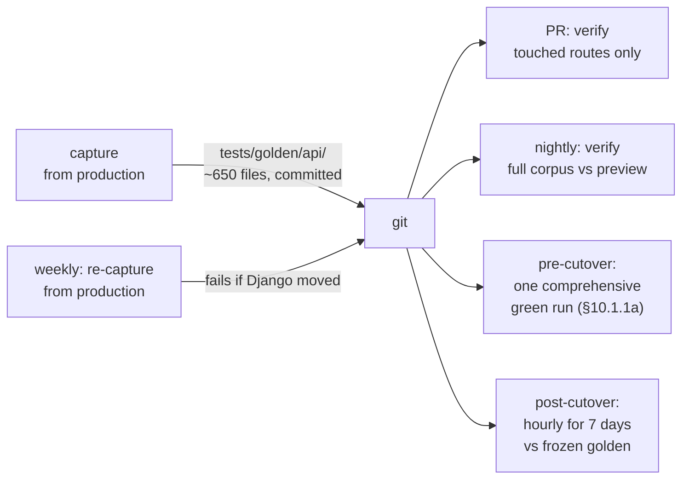

| Trigger | Corpus | Gate |
|---|---|---|
| Per PR | routes the PR touches | **Blocking** |
| Nightly | full 650, production vs latest preview | **Blocking** |
| Before the single domain cutover (§10.1.1a — not per-route anymore) | full 650, green in one comprehensive run against the proving-ground host | **Blocking** |
| Hourly for 7 days after cutover | full 650, candidate vs frozen golden | Alerts to the same WhatsApp channel as the pipeline health check |
| Weekly | re-capture from production, fail on drift | Warning — catches Django changes made mid-migration |

The weekly re-capture matters more than it looks. The migration runs for months while Django is still being edited; without it, a golden file silently becomes a record of what the API used to do.

#### 7.8.7 Capture the golden files *first*

**Step 0 of Phase 2, before a line of TypeScript is written:**

```bash
pnpm gfcontract capture --origin https://www.givefood.org.uk \
  --corpus corpus/api.json --out tests/golden/api/ --concurrency 4
git add tests/golden/api && git commit -m "Freeze API contract: 650 golden responses from production"
```

This is also the artefact that makes rollback verifiable: after cutover, `gfcontract verify --candidate https://www.givefood.org.uk` diffs live production against a frozen pre-migration baseline, and keeps working after Django is gone.

---

### 7.9 gfapi1: deprecation position

**Position: keep it, unchanged, indefinitely. Do not deprecate it as part of this migration.**

The reasoning:

1. **It cannot be removed without code changes elsewhere.** `givefood/models/foodbank.py:730,747,751` reverses `api_foodbanks` and `api_foodbank` in `Foodbank.save()`'s purge list. Deleting gfapi1 raises `NoReverseMatch` on every food bank save.
2. **It is 272 lines and five handlers.** The marginal cost of porting it alongside gfapi2 is small — mostly the CSV writer, which is needed for the dumps anyway.
3. **We do not know who uses it.** No API keys, no telemetry, no contact list. The `/api/1/foodbanks/?format=csv` endpoint in particular is exactly the shape a council analyst pulls into a spreadsheet once a quarter, and would not appear in a 30-day traffic sample.
4. **Deprecation is a communication problem, not an engineering one,** and this migration should not also be a comms project. Mid-migration is the worst possible time to change what consumers see.

What we *will* do:

| Action | When |
|---|---|
| Port gfapi1 unchanged, byte-exact, with the same frozen bugs (B4, B6, B8) | Phase 2 |
| Measure `/api/1/*` traffic by endpoint over 90 days after cutover | Post-migration |
| Add a `Deprecation` / `Sunset` header (RFC 8594) **only** if the maintainer decides to retire it, with ≥12 months' notice on the `/api/1/` docs page and in `llms.txt` | Not in this plan |

**Follow-ons — improvements deliberately not made now**, recorded so they are not lost:

- B4/B5/B6: return 400 rather than 500 for malformed input.
- B2: emit the location's own `mp_parl_id`.
- B3: stop emitting `/api/2/foodbank/<location-slug>/` URLs that 404.
- B1: add `donationpoints` to `xml_item_name()`.
- B11: correct the `method_table` docs to match what the views emit.
- CORS on 4xx responses.
- Consistent `created` vs `found` key naming.
- The `latt_long` / `lattlong` spelling.

Every one of these is a breaking change. They belong in a `/api/4/`, announced, or nowhere.

---

### 7.10 Work packages

Phase 2 of the delivery plan. Estimates are person-days.

| WP | Task | Depends on | Acceptance criteria | pd |
|---|---|---|---|---|
| **2.0** | **Capture 650 golden responses from production** (§7.8.7). Nothing else starts first. | — | `tests/golden/api/` committed; `gfcontract verify` against production is green (a self-comparison sanity check). | 1 |
| **2.0b** | **Decide `Accept-Language`** (§7.7.3) and, if pinning to English, ship the Django `override("en")` change and re-capture. | 2.0 | `/api/2/foodbanks/` returns identical bytes for `Accept-Language: en` and `cy`. `/api/*` may now be added to the Phase 0 Cache Rules. | 1 |
| **2.1** | Monorepo skeleton, Hono router with **both** `/api/*` and `/api/2/*` mounts, `wrangler types`, Workers Builds root directory + watch paths. | — | `wrangler deploy --dry-run` clean. A `packages/templates` change does not rebuild the API Worker. | 3 |
| **2.2a** | *(revised 2026-08-30 — no Hyperdrive; see §4, §6 D3, §10.1.3)* Extract the ~15-query core from Postgres, read-only, transform to the D1 DDL, load into `givefood`. This disposable copy is re-run as often as useful during the build; the API's data is captured for real only as part of Phase 7's single comprehensive launch ETL (§10.2.8), not at a WP-numbered "cutover" of its own. | 2.1 | Row counts match source exactly. Spot-checksum (10 rows/table, full-column MD5) matches. | 4 |
| **2.2b** | D1 query layer (`packages/db`), the same ~15 queries in D1 SQL, through the Sessions API (`env.DB.withSession()` — this database has read replication enabled). Includes the `DISTINCT ON` → window-function rewrite. | 2.2a | Query results match Django ORM output for a fixed fixture set. | 3 |
| **2.3** | **`packages/serialise`** — `pyfloat`, `pyjson`, `pyxml`, `pyyaml`, `pycsv` (both dialects). Highest-risk WP in the phase. | 2.1 | All format invariants (§7.8.5) pass. Unit tests cover: `0.0`, `-0.0`, `1e16`, `1e-5`, `\u00f4`, astral chars, a multi-line `needs`, `null` vs `""`, `<None>`, a CRLF address. | **8** |
| **2.4** | The 20 handlers, dual-mounted, reproducing every frozen bug in §7.3. | 2.2b, 2.3 | Byte parity green across all 650 golden files. | 6 |
| **2.5** | In-memory haversine (§7.5) — **two radii**, `Math.trunc` for `distance_m`, `pyRound2` for `distance_mi`, the exact `is_uk()` box. | 2.2b | `distance_m` matches to the integer and `distance_mi` to the byte, across all corpus coordinates including the exact-food-bank ones. | 3 |
| **2.6** | The three documentation pages + `api2.js` + 9 method tables. | 2.1 | `#hash` deep links resolve; live XHR preview works; structural parity green. | 3 |
| **2.7** | *(This row is superseded — see §10.2.2's WP 2.6 and §10.1.1a: no per-phase production widening anymore, one single domain-wide cutover later. This table predates that decision as well as the WP-numbering correction; treat §10.2.2 as authoritative.)* ~~Route cutover, widening: `/api/2/*` → 48h → `/api/*` → 48h → `/api/1/*` and `/api/3/*`.~~ | 2.4–2.6 | ~~48 hours of green nightly parity at each step before widening.~~ | 1 |
| | **Total** | | | **31** |

That is within the 30–41 pd range in the delivery plan (§10.2.2, revised for the same reason): WP 2.3 was already at the top of its original range from float formatting, and dropping Hyperdrive for a real D1 copy-and-query layer (2.2a + 2.2b, 7 pd combined) added roughly 3 pd net over the old single Hyperdrive-binding WP 2.2 (4 pd) — real work a live connection previously let this table skip past.

#### 7.10.1 Spikes and open questions

| # | Question | Method | Resolution needed by |
|---|---|---|---|
| S1 | **What is YAML usage?** | Two-line log statement in `gfapi2/func.py`, 14 days of Coolify logs, `grep -c` (§7.4.4). | **Phase 0** — it decides whether WP 2.3 is 8 days or 12. **Resolved 2026-08-30, by decision rather than measurement**: the 14-day log capture was never run, and no production request-log access was available when WP 2.3 started. The maintainer decided directly, without waiting on the measurement: YAML moves to structural parity (see §7.4.4's note and `packages/serialise/src/pyyaml.ts`). JSON, XML and CSV remain byte-exact — verified against the real pinned libraries (`dicttoxml` 1.7.16, `json.dumps`, `unicodecsv` 0.14.1), matching production's `uv.lock`. |
| S2 | **Is any open food bank missing `latest_need`?** | The SQL in §7.3. | Before WP 2.4 — decides whether B12 is theoretical. |
| S3 | **What is `/api/*` vs `/api/2/*` traffic?** | Cloudflare Analytics, 30 days. | Before WP 2.7 — informs cache-tag/alias handling only; there is no cutover ordering left to inform (§10.1.1a). |
| S4 | **Does PyYAML fold any address in the real data at 80 columns?** | Capture all YAML golden files (WP 2.0) and grep for continuation indents. | Before WP 2.3 — a "no" makes the YAML emitter materially simpler. |
| S5 | **Are Workers Cache hits billed as requests?** | Verify against a live meter during Phase 1. Documentation is ambiguous and this drives a large share of the cost model. | Phase 1 — cost reporting only, not a design gate. |

#### 7.10.2 Kill criterion

Restating the delivery plan's **K2**, because it lives here:

> If, after **five dedicated days** on `packages/serialise`, byte parity still fails on more than 1% of the golden corpus, **abandon the migration** and stop at Phase 1.
>
> An API that cannot be proved identical is a contract that cannot be kept. Governments, councils, universities and supermarkets parse these responses with no version negotiation and no way to be notified. Shipping "close enough" to them is worse than not migrating at all.

The most likely trigger is YAML (§7.4.4), which is why S1 runs in Phase 0 — so that the team knows before starting whether the hard part is real.

---

## 08. Background jobs, the AI need-extraction pipeline, and notifications

This section covers everything that is not an HTTP request from a member of the public: the seven cron jobs, the need-extraction pipeline, the task queue, the thirteen management commands, the ten `/offline/` endpoints, and the four notification channels.

It all runs in **one Worker, `givefood-jobs`**, with no routes at all. That Worker is the only place OpenRouter, Browser Rendering, Google Translate, Postmark, WhatsApp, Firebase and the VAPID private key exist. The public `givefood` Worker holds none of them. That separation is the entire justification for a second Worker (§8.3.1) and it is worth it.

---

### 8.0 Two corrections to the brief, before anything else

Both were found by reading the code, and both change what gets built. **Do not plan against the briefing note; plan against this.**

#### 8.0.1 There is no three-stage OpenRouter async batch pipeline

The briefing describes needcheck as "gemini-2.5-flash-lite extracting needs via OpenRouter's async batch API across three cron jobs in a 24h window". None of that is in the repository.

| Claim | Reality (verified) | Where |
|---|---|---|
| gemini-2.5-flash-lite | `openai/gpt-oss-120b` | `givefood/utils/crawlers.py:439` |
| OpenRouter *async batch* API | Synchronous `POST /api/v1/chat/completions`, `timeout=60` | `givefood/utils/ai.py:139-147` |
| Three cron jobs, 24h window | **One** cron, `needcheck`, fanning out via django-tasks | `gfoffline/management/commands/needcheck.py:24` |
| A `NeedBatchItem` staging model | Does not exist (`grep` over `givefood/models/` returns nothing) | — |
| `needcheck_submit` / `needcheck_collect` commands | Do not exist; the thirteen commands are listed in §8.2 | — |
| 4× daily (`45 7,11,15,19 * * *` per `docs/crons.md`) | Production `givefood_crawlset` shows **one** `need` crawl set per day, ~15:00 UTC, for the last 20 days | live DB |

**Consequence for the design: there is no long asynchronous wait, so there is no reason to use Cloudflare Workflows.** A Cron Trigger that fans 1,024 messages onto a Queue reproduces the current architecture exactly, one primitive instead of three. That is a genuine simplification under the keep-it-simple constraint and it is what §8.5 specifies. Earlier drafts of this plan specified a Workflow with `step.waitForEvent` and a 50-step sleep/poll loop against a batch endpoint that is never called — **do not build that.**

`docs/crons.md` is also wrong about the schedule. Fix it in Phase 0.

> **Task 8.0.1-a** — Read the Coolify scheduled-task configuration, which is the actual source of truth, and record the real needcheck cron expression in this document and in `docs/crons.md`. It changes the Browser Rendering line in the cost model by 4.6× ($9.72/month at 1×/day vs $40.95 at 4×/day) and is the largest non-Workers cost in the whole migration.

#### 8.0.2 There is no LLM "material change?" gate

The briefing describes an LLM gate suppressing ~60% of extractions. There is no second model call. Suppression is two mechanisms, both free:

1. **Prompt priming** — `gfoffline/templates/foodbank_need_prompt.txt:34-44` injects the last published need as a `PREVIOUS LIST (reference for wording only)` block, instructing the model to reuse prior wording for items still on the page. This kills cosmetic re-wording drift (`Tin` vs `Tinned`) at source. Placeholder needs (`Facebook`, `Unknown`, `Nothing`) are excluded from priming at `crawlers.py:410-412`.
2. **`need_items_key()`** — `givefood/utils/text.py:72-88`. Per line, `re.sub(r"[^a-z0-9]", "", line.lower())`, collected into a `frozenset`. Order-insensitive and punctuation-insensitive *within* a line, deliberately **not** merging across lines. Compared against the last published need and against the last 10 *unpublished* needs (`crawlers.py:516-538`).

`need_items_key` **is** the false-positive suppression. Its semantics are load-bearing: a JS reimplementation that trims differently, or splits on `/`, will either flood or starve the review queue. It is the single highest-value unit test in the port (§8.5.9).

---

### 8.2 Complete inventory of non-request work

Everything in this table moves. Nothing stays on the Mythic Beasts box.

| # | Thing | Current trigger | Volume | Cloudflare target |
|---|---|---|---|---|
| 1 | `needcheck` | cron (see §8.0.1) | 1,024 open food banks/run | Cron Trigger → Queue |
| 2 | `getarticles` | `20 8-22/2 * * *` (8×/day) | ~480 food banks with `rss_url` | Cron Trigger → Queue |
| 3 | `charityinfo` | `30 5 * * *` | 807 food banks with a charity number | Cron Trigger → Queue ×3 |
| 4 | `dump` | `30 4 * * *` | 12 artefacts, largest 143 MB | Cron Trigger → **Container** |
| 5 | `days_between_needs` | `30 3 * * 0` | 1,024 rows | Cron Trigger, **one SQL statement** |
| 6 | `db_worker` | `* * * * *` | drains 5 queues @ ~5 tasks/min | **Deleted** — Queues are push-based |
| 7 | `prune_db_task_results` | `10 3 * * *` | — | **Repurposed** to prune `crawlitem` |
| 8 | `cleanup_subs` | **NO CRON — never scheduled** | 5,858 subscriber rows | Cron Trigger (newly scheduled) |
| 9 | `discrepancy_check` | `/offline/` GET, no cron | 1 food bank per call | Cron Trigger → Queue |
| 10 | `need_categorisation` | `/offline/` GET, no cron | ≤500 needs per call | Cron Trigger → Queue |
| 11 | `pluscodes`, `place_ids` | `/offline/` GET, no cron | backfill | Cron Trigger (pluscodes), Queue (place_ids) |
| 12 | `load_mps`, `refresh_mps` | `/offline/` GET | 650 constituencies, 3 GETs each | Manual job (§8.13) |
| 13 | `precacher` | `/offline/` GET | — | **Deleted** — locmem has no analogue |
| 14 | `fire_oc_geocode` | `/offline/` GET | — | **Deleted** — function body is `pass` |
| 15 | `render_proxy` | `/offline/` GET | — | **Deleted** — arbitrary-URL SSRF billed to the account |
| 16 | `import_places`, `import_postcodes` | manual | 253k / 1.79M rows, 61 MB CSV | Container (§8.13) |
| 17 | `newlang`, `regenerate_need_ids`, `resaver`, `set_foodbank_bounds`, `place_populations`, `checkschema` | manual | varies | Container or admin-triggered Queue (§8.13) |
| 18 | 4 notification channels | admin POST | 5,855 / 49 / 47 / 49 subscribers | Queue fan-out (§8.14) |
| 19 | Translation fan-out | `FoodbankChange.save()` | **19 tasks per publish today; 3 in the port** (§2.7.1 — `cy`/`ga`/`gd` only) | Queue |
| 20 | Cache purge | model `save()` | ~90 URLs + 26 prefixes/save | Queue (see §5, caching) |
| 21 | Media ingest — photos, favicons, screenshots, maps | lazy, in-request | 7,114 / ~1,000 / 5,355 / 9,135 objects | Queue → R2 (§8.11) |

Row 21 is the completeness gap the review found: `map.png`, `favicon.png` and `screenshots/*.png` currently have **no persistence at all** — they are live third-party fetches behind `@cache_page(WEEK)`. They are jobs, and they are in this section.

---

### 8.3 The primitive-choice rule

Applied to every job below, in this order. **Stop at the first one that works.**

```
Cron Trigger alone
  └─ if the work needs fan-out or exceeds 15 min wall clock
     → Cron Trigger + Queue
        └─ if a step must survive a multi-hour external wait with per-step retry
           → Workflow
              └─ if it needs Python, a filesystem, or >128 MB of memory
                 → Container
                    └─ if it needs a serial lock or exact strongly-consistent counting
                       → Durable Object
```

**Result across 21 jobs: 6 Cron Triggers, 8 Queues, 1 Container, 0 Workflows, 0 Durable Objects.**

That is three primitives the maintainer has to learn, not six. Each one earns its place:

- **Cron Trigger** — replaces Coolify's crontab. Directly serves goal 2 (the schedule no longer depends on one box being up).
- **Queue** — the only way to get real fan-out. A Worker invocation may have only **six connections simultaneously awaiting response headers**, so `Promise.all` over 20 renders does *not* parallelise. Queues give up to 250 concurrent consumer invocations, and — critically — retries and a dead-letter queue, neither of which django-tasks has today.
- **Container** — the only way to keep Python that is genuinely load-bearing (§8.8, §8.13). A daily 5-minute `standard-2` run is inside all three Workers Paid inclusions, i.e. it costs nothing extra.

**Explicitly not used, and why:**

| Rejected | Reason |
|---|---|
| **Workflows** | The only candidate was needcheck, and §8.0.1 establishes there is no long async wait to survive. A Queue with retries does the same job with one fewer concept to debug at 3am. |
| **Durable Objects** | The only candidate was a per-food-bank claim lock against concurrent needcheck runs. At 1×/day with a ~20-minute sweep there is no overlap to serialise. If the schedule ever returns to 4×/day, revisit — but do not build 1,024 DOs speculatively. A DO that awaits a 45s render also costs ~$70/month to sit and wait. |
| **Analytics Engine for crawl rows** | Used for *aggregates* only (§8.15). The admin's per-food-bank crawl list needs individual rows, which sampling cannot guarantee. |

---

### 8.4 Replacing django-tasks and `db_worker`

#### 8.4.1 What exists today

`givefood/settings.py:109-114` configures `django_tasks_db.DatabaseBackend`. Eight task types across five queues, drained by `manage.py db_worker --batch --max-tasks 50 --queue-name *` every minute:

| Task | Defined | Queue | Priority | Enqueued from |
|---|---|---|---|---|
| `do_foodbank_need_check_async` | `crawlers.py:578` | `needcheck` | default | `needcheck.py:24` |
| `translate_need_async` | `general.py:194` | `translate` | default | `needs.py:317` (×19 per publish) |
| `decache_async` | `cache.py:149` | `decache` | 20 | 4 model `save()` sites |
| `send_email_async` | `notifications.py:81` | `email` | default | `notifications.py:71` |
| `send_firebase_notification_async` | `notifications.py:276` | *default* | 10 | `gfadmin/views.py:2000` |
| `send_webpush_notification_async` | `notifications.py:434` | *default* | 10 | `gfadmin/views.py:2003` |
| `send_whatsapp_notification_async` | `notifications.py:660` | *default* | 10 | `gfadmin/views.py:2006` |
| `foodbank_article_crawl_async` | `crawlers.py:70` | *default* | 30 | `gfadmin/views.py:1988` |

Measured drain rate on production: **~5 tasks/min**, not the 50/min the `--max-tasks 50` implies. A 1,024-message needcheck sweep therefore takes ~3.4 hours to drain. Production has been observed with 694 `READY` rows and **7 tasks stuck in `RUNNING` since 2026-08-04** — django-tasks has no visibility timeout and no reaper, so they will sit there forever.

#### 8.4.2 What replaces it

Cloudflare Queues. Both crons disappear.

```jsonc
// workers/jobs/wrangler.jsonc — queues section
"queues": {
  "producers": [
    { "queue": "needcheck",   "binding": "NEEDCHECK_Q" },
    { "queue": "articles",    "binding": "ARTICLES_Q" },
    { "queue": "charity-ew",  "binding": "CHARITY_EW_Q" },
    { "queue": "charity-sco", "binding": "CHARITY_SCO_Q" },
    { "queue": "charity-ni",  "binding": "CHARITY_NI_Q" },
    { "queue": "translate",   "binding": "TRANSLATE_Q" },
    { "queue": "notify",      "binding": "NOTIFY_Q" },
    { "queue": "media",       "binding": "MEDIA_Q" },
    { "queue": "purge",       "binding": "PURGE_Q" },
    { "queue": "jobs-dlq",    "binding": "DLQ" }
  ],
  "consumers": [
    { "queue": "needcheck",   "max_batch_size": 1,  "max_batch_timeout": 5,  "max_concurrency": 20, "max_retries": 3, "dead_letter_queue": "jobs-dlq" },
    { "queue": "articles",    "max_batch_size": 5,  "max_batch_timeout": 30, "max_concurrency": 15, "max_retries": 3, "dead_letter_queue": "jobs-dlq" },
    { "queue": "charity-ew",  "max_batch_size": 5,  "max_batch_timeout": 30, "max_concurrency": 5,  "max_retries": 5, "dead_letter_queue": "jobs-dlq" },
    { "queue": "charity-sco", "max_batch_size": 5,  "max_batch_timeout": 30, "max_concurrency": 3,  "max_retries": 5, "dead_letter_queue": "jobs-dlq" },
    { "queue": "charity-ni",  "max_batch_size": 5,  "max_batch_timeout": 30, "max_concurrency": 3,  "max_retries": 5, "dead_letter_queue": "jobs-dlq" },
    { "queue": "translate",   "max_batch_size": 10, "max_batch_timeout": 10, "max_concurrency": 10, "max_retries": 5, "dead_letter_queue": "jobs-dlq" },
    { "queue": "notify",      "max_batch_size": 10, "max_batch_timeout": 10, "max_concurrency": 10, "max_retries": 3, "dead_letter_queue": "jobs-dlq" },
    { "queue": "media",       "max_batch_size": 5,  "max_batch_timeout": 30, "max_concurrency": 10, "max_retries": 3, "dead_letter_queue": "jobs-dlq" },
    { "queue": "purge",       "max_batch_size": 100,"max_batch_timeout": 30, "max_concurrency": 1,  "max_retries": 5, "dead_letter_queue": "jobs-dlq" },
    { "queue": "jobs-dlq",    "max_batch_size": 10, "max_batch_timeout": 30, "max_concurrency": 2,  "max_retries": 1 }
  ]
}
```

Notes on the numbers, because they are not arbitrary:

- **`needcheck` is `max_batch_size: 1`.** Measured per-item durations on `givefood_crawlitem` over 7 days (n=7,168): avg 22.53s, p50 13.25s, p95 **73.82s**, max **1,016.32s (16.9 min)**. A queue consumer invocation is capped at 15 minutes. A batch of 5 sequential p95 items is 6 minutes — survivable; a batch of 5 that includes one tail item is not. Batch size 1 plus the hard timeouts in §8.5.4 bounds a single invocation at ~325s.
- **`max_concurrency: 20` on needcheck**, not 250. Two reasons: Browser Rendering Quick Actions are rate-limited to **30/second** on Paid, and 1,024 small food bank websites do not deserve a 250-way hammering. 1,024 × 22.5s ÷ 20 ≈ **19 minutes** for the whole sweep, against 3.4 hours today. That alone is a goal-1 win.
- **`purge` is `max_concurrency: 1`** so the consumer can dedupe tags across a batch of 100 before calling the purge API. Tag purges are rate-limited to 5 requests/minute on the Free zone plan.
- **`max_retries` is 5 for the charity registers**, which are flaky and rate-limited, and 3 elsewhere.

#### 8.4.3 Every queue has a dead-letter queue, and the DLQ writes a discrepancy

**This is not optional.** Cloudflare's documentation is explicit: with no `dead_letter_queue` configured, "messages that repeatedly fail processing will eventually be discarded". Given this project's documented history of a silent extraction failure being read as "this food bank needs nothing", silent discard is the single most dangerous default on the platform for this codebase.

The DLQ consumer writes a `FoodbankDiscrepancy` — the same table the render-failure path already writes to (`crawlers.py:311-323`) — so failures surface in the admin queue the maintainer already reads every morning, not in a log nobody opens.

```ts
// workers/jobs/src/queues/dlq.ts
export async function handleDlq(batch: MessageBatch<DlqBody>, env: Env) {
  for (const msg of batch.messages) {
    const { queue, body, error } = msg.body;
    // Resolve the food bank if the original message carried one; many do.
    const slug = (body as any)?.slug ?? null;
    const fb = slug ? await getFoodbankBySlug(env.DB, slug) : null;
    await env.DB.prepare(
      `INSERT INTO foodbankdiscrepancy
         (foodbank_id, foodbank_name, discrepancy_type, discrepancy_text, url, status, created, modified)
       VALUES (?1, ?2, 'website', ?3, ?4, 'New', ?5, ?5)`
    ).bind(
      fb?.id ?? null,
      fb?.name ?? null,
      `Background job '${queue}' failed after all retries: ${String(error).slice(0, 500)}`,
      fb?.url ?? null,
      isoNow(),
    ).run();
    msg.ack();
  }
}
```

#### 8.4.4 Retry classification — the trap Queues introduces

django-tasks **never retries a failed task**. Cloudflare Queues **will**, up to `max_retries`. That is an improvement for transient failures and a disaster for permanent ones.

Production evidence: on 6–7 August 2026, OpenRouter ran out of credits and 1,748 needcheck tasks failed with `"...credits. Add more using https://openrouter.ai/settings/credits","code":402`. Under Queues with blind retries that becomes 1,024 × 3 = **3,072 futile calls per sweep** against an empty balance.

Every consumer classifies before it retries:

```ts
// workers/jobs/src/lib/retry.ts
export class PermanentError extends Error {}

/** Decide what to do with a failed HTTP call. */
export function classify(status: number, body: string): "retry" | "delay" | "permanent" {
  if (status === 429) return "delay";                    // honour Retry-After
  if (status === 402) return "permanent";                // out of credits — do NOT hammer
  if (status === 401 || status === 403) return "permanent"; // bad key
  if (status >= 500) return "retry";
  if (status >= 400) return "permanent";                 // malformed request
  return "retry";
}

export function applyDecision(msg: Message, d: ReturnType<typeof classify>, retryAfterSec = 60) {
  if (d === "permanent") { msg.ack(); throw new PermanentError("dead-lettered"); }
  if (d === "delay") { msg.retry({ delaySeconds: retryAfterSec }); return; }
  msg.retry();
}
```

Permanent failures skip the retry ladder and go straight to the DLQ, so a 402 produces **one discrepancy per food bank once**, not 3,072 API calls.

#### 8.4.5 Priority

Queues have no priority field. The four existing priorities become queue separation plus `max_concurrency`:

| django-tasks priority | Queue | `max_concurrency` |
|---|---|---|
| 30 (`foodbank_article_crawl_async`) | `articles` | 15 |
| 20 (`decache_async`) | `purge` | 1 (batched, dedup) |
| 10 (notifications) | `notify` | 10 |
| default | per-job | — |

#### 8.4.6 What gets deleted

- The `db_worker` cron (1,440 wasted invocations/day).
- The `prune_db_task_results` cron.
- `django_tasks_database_dbtaskresult` — **62 MB / 41,625 rows** out of the database.
- The `django-tasks` and `django-tasks-db` dependencies.
- The two `django_tasks_database` migrations pending on production, which stop mattering entirely.
- The documented gotcha that a long-running worker holds stale code until restarted — every Queue delivery runs the currently deployed Worker.

#### 8.4.7 ⚠ Cutover hazard: drain before you disable

`db_worker` **is** the drain. Disabling it does not pause the queue, it strands it. The queue at that moment contains subscriber emails, 19-language translations and cache purges, and §8.4.6 then deletes the table holding them.

> **Task 8.4.7-a — belongs in the cutover runbook, not here, but is specified here because this section owns the queue.**
>
> 1. At T−30min, disable **only** the work-*producing* crons: `needcheck`, `getarticles`, `charityinfo`, `dump`, `days_between_needs`. **Leave `db_worker` running.**
> 2. Poll until the queue is empty:
>    ```sql
>    SELECT status, count(*) FROM django_tasks_database_dbtaskresult
>     WHERE finished_at IS NULL GROUP BY status;
>    ```
>    Both `READY` and `RUNNING` must be **0**. Checking `RUNNING` alone — as an earlier draft of the runbook did — passes trivially the moment the drain stops, and strands every queued task.
> 3. Only then disable `db_worker`.
> 4. Budget **30 minutes** for the drain at the observed ~5 tasks/min. Abort the cutover if the queue is not empty in time.
> 5. Note the 7 tasks stuck in `RUNNING` since 2026-08-04 will never clear. Record their IDs, confirm they are all `do_foodbank_need_check_async` (they are), and exclude them from the check by `started_at > '2026-08-05'`.

---

### 8.5 The needcheck pipeline, in forensic detail

This is the most operationally important thing the charity runs. It is the only writer of the site's headline dataset. Get it wrong and 3,000 food bank pages, an API consumed by councils and supermarkets, and the daily review queue all go wrong together.

#### 8.5.1 Topology

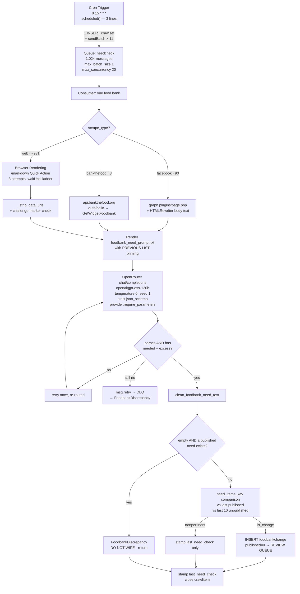

#### 8.5.2 The cron handler — three lines, deliberately

A `scheduled()` handler on a ≥1-hour interval gets 15 minutes of CPU, but there is no reason to use any of it. Enqueue and return.

```ts
// workers/jobs/src/scheduled.ts
export async function scheduled(event: ScheduledController, env: Env, ctx: ExecutionContext) {
  switch (event.cron) {
    case "0 15 * * *": return void ctx.waitUntil(startNeedcheck(env, event.scheduledTime));
    case "20 8-22/2 * * *": return void ctx.waitUntil(startArticles(env));
    case "30 5 * * *": return void ctx.waitUntil(startCharityInfo(env));
    case "30 4 * * *": return void ctx.waitUntil(startDump(env));
    case "30 3 * * 0": return void ctx.waitUntil(daysBetweenNeeds(env));
    case "10 3 * * *": return void ctx.waitUntil(pruneCrawlItems(env));
    case "0 4 * * *": return void ctx.waitUntil(cleanupSubs(env));
  }
}

async function startNeedcheck(env: Env, scheduledTime: number) {
  const runId = `needcheck-${new Date(scheduledTime).toISOString().slice(0, 10)}`;

  // Idempotency: the run id is derived from the scheduled date, and the crawlset carries it.
  // A duplicate cron delivery (Cron Triggers are at-least-once) finds the row and does nothing.
  const existing = await env.DB.prepare(
    `SELECT id FROM crawlset WHERE crawl_type = 'need' AND run_id = ?1`
  ).bind(runId).first<{ id: number }>();
  if (existing) return;

  const { meta } = await env.DB.prepare(
    `INSERT INTO crawlset (crawl_type, run_id, start) VALUES ('need', ?1, ?2)`
  ).bind(runId, isoNow()).run();
  const crawlSetId = meta.last_row_id;

  const slugs = await env.DB.prepare(
    `SELECT slug FROM foodbank WHERE is_closed = 0 ORDER BY slug`
  ).all<{ slug: string }>();

  // sendBatch caps at 100 messages / 256 KB. 1,024 slugs = 11 calls.
  for (const chunk of chunked(slugs.results, 100)) {
    await env.NEEDCHECK_Q.sendBatch(
      chunk.map(r => ({ body: { slug: r.slug, crawlSetId, runId } }))
    );
  }
  await env.DB.prepare(
    `UPDATE crawlset SET expected = ?1 WHERE id = ?2`
  ).bind(slugs.results.length, crawlSetId).run();
}
```

Two deliberate changes from Django:

- **`ORDER BY slug`, not `ORDER BY RANDOM()`.** `needcheck.py:22` randomises to spread load across a serial drain. With a Queue the ordering is irrelevant and a deterministic order makes a partial run easy to reason about.
- **`crawlset.run_id` and `crawlset.expected` are new columns.** `run_id` gives free cron dedup. `expected` fixes a real bug: **nothing ever sets `crawl_set.finish` for `crawl_type='need'`.** `charityinfo.py:32` and `getarticles.py:39` both stamp it; `needcheck.py` returns immediately and no task closes the set. Confirmed on production — every `need` CrawlSet has `finish IS NULL`, so `CrawlSet.time_taken()` always returns `None` and the admin shows nothing. The consumer now decrements a counter and stamps `finish` when it reaches zero.

#### 8.5.3 The consumer, stage by stage

**Stage 1 — open the CrawlItem.** Written immediately (`crawlers.py:285-291`) so a crash leaves a row with `finish IS NULL`, which is how a stall is detected. `content_type`/`object_id` collapse to a single nullable `need_pk` — verified that `foodbankchange` is the only content type ever used.

**Stage 2 — scrape_type branch** (`crawlers.py:297-301`). Measured on open food banks: **90 facebook, 3 bankthefood, ~931 web**.

**Stage 3a — `web`: Cloudflare Browser Rendering `/markdown`.** This is already a Cloudflare Quick Action (`general.py:114-164`) so it ports as a binding call rather than a REST call, dropping one API token.

The three details that must survive verbatim, all of which exist because of a specific production incident:

| Detail | Why | Source |
|---|---|---|
| `MARKDOWN_WAIT_UNTILS = ("networkidle0", "networkidle0", "networkidle2")` | A site holding one connection open forever — GoDaddy, Wix, a chat widget, an analytics beacon — never reaches `networkidle0` and times out on *every* attempt. The third attempt relaxes to `networkidle2` and renders those in about a second. Cloudflare caps per-navigation timeout at 60s, so waiting longer is not an option. | `general.py:82-88` |
| `MARKDOWN_CHALLENGE_MARKERS` | Anti-bot interstitials render as a **200 with non-empty markdown**. Six lowercase substrings (`"just a moment"`, `"verify you're not a robot"`, …) detect them explicitly and force a retry. Without this a Cloudflare challenge page is fed to the model as the food bank's shopping list. | `general.py:63-77` |
| `MARKDOWN_DATA_URI_RES` — two line-bounded regexes | Cardiff's header carries its logo twice as a base64 SVG: **162,212 characters on one line**, of which 211 are the actual nav links. That took the prompt to 110,107 tokens against a 131,072 context. The `[^<>\n]` and `[^\s)\n]` character classes exclude newlines deliberately — an unbounded `[^<>]*` spans from the first image to the last and swallows everything between. | `general.py:90-107` |

```ts
const MARKDOWN_WAIT_UNTILS = ["networkidle0", "networkidle0", "networkidle2"] as const;
const CHALLENGE_MARKERS = [
  "verify you're not a robot", "verify you are not a robot", "just a moment",
  "checking your browser", "enable javascript and cookies to continue",
  "please wait while we verify",
];
const DATA_URI_RES = [/\(<data:[^<>\n]*>\)/g, /\(data:[^\s)\n]*\)/g];

async function getMarkdown(env: Env, url: string): Promise<string | null> {
  for (let attempt = 0; attempt < 3; attempt++) {
    const waitUntil = MARKDOWN_WAIT_UNTILS[Math.min(attempt, 2)];
    let res: Response;
    try {
      res = await env.BROWSER.fetch(new Request("https://browser/markdown", {
        method: "POST",
        headers: { "content-type": "application/json" },
        body: JSON.stringify({
          url,
          rejectResourceTypes: ["image"],
          rejectRequestPattern: ["/^.*\\.(css)/"],
          gotoOptions: { waitUntil, timeout: 45000 },
        }),
        // Hard ceiling so one invocation cannot approach the 15-minute consumer limit.
        signal: AbortSignal.timeout(65_000),
      }));
    } catch { continue; }
    if (!res.ok) continue;
    let json: any;
    try { json = await res.json(); } catch { continue; }
    if (!json.success) continue;
    const result: string | undefined = json.result;
    if (!result) continue;
    const low = result.toLowerCase();
    if (CHALLENGE_MARKERS.some(m => low.includes(m))) continue;   // check BEFORE stripping
    return DATA_URI_RES.reduce((s, re) => s.replace(re, "()"), result);
  }
  return null;
}
```

On `null`, the consumer writes a `FoodbankDiscrepancy(discrepancy_type="website", ...)`, stamps `last_need_check`, closes the CrawlItem and **returns without touching the published need**. This is safeguard #1 and it must not be optimised away.

> **⚠ Verify in the Phase 0 spike:** the exact request shape of the Browser Rendering *binding* for `/markdown`. The current code uses the REST endpoint `POST /accounts/{id}/browser-rendering/markdown`. The binding form above is written to the shape the REST API accepts; if the binding differs, keep the REST call — it works today and the token is one secret.

**Stage 3b — `facebook`** (90 food banks). A GET to the `v16.0/plugins/page.php` embed with a 10s timeout, then `htmlbodytext()` — BeautifulSoup decomposing `svg/style/script/iframe/canvas` and returning `soup.body.get_text()`. In the Worker this becomes `HTMLRewriter`, which is native, streaming and cheaper. The v16.0 endpoint is old enough to re-verify against live traffic before cutover.

**Stage 3c — `bankthefood`** (3 food banks). Two or three POSTs: `auth/hello/` with a hard-coded widget device payload, retried once on `Status == "EXPIRED"`, then `GetWidgetFoodbank/` with a bearer token. The food bank key is scraped from the URL with `re.search(r"/(\d+)/", ...)`. Ports as plain `fetch`; three food banks, so a per-invocation token fetch is fine.

**Stage 4 — prompt priming.** `crawlers.py:404-423`, then `render_to_string("foodbank_need_prompt.txt", {...})`.

**Stage 5 — the extraction call.** `givefood/utils/ai.py:86-151`. Every parameter is load-bearing:

```ts
const NEED_SCHEMA = {
  type: "object",
  properties: {
    needed: { type: "array", description: "A list of food items the food bank is requesting or has low stock of. Items should be in Title Case and not repeated.", items: { type: "string" } },
    excess: { type: "array", description: "A list of food items the food bank has an excess of. Items should be in Title Case and not repeated.", items: { type: "string" } },
  },
  required: ["needed", "excess"],
} as const;

const body = {
  model: "openai/gpt-oss-120b",
  messages: [{ role: "user", content: prompt }],
  temperature: 0,
  seed: 1,
  response_format: { type: "json_schema", json_schema: { name: "response", strict: true, schema: NEED_SCHEMA } },
  // NON-NEGOTIABLE. Without it OpenRouter routes to providers that ignore response_format and
  // answer in prose — a 200 with unparseable content. Measured at roughly 1 call in 10 (Mancer),
  // and the plain-text answer was read as "no needs found". See ai.py:129-139.
  provider: { require_parameters: true },
};
```

| Parameter | Why it cannot change without measurement |
|---|---|
| `openai/gpt-oss-120b` | Benchmarked against deepseek-v4-flash; matched the baseline exactly on every food bank both returned for. Called **without** a reasoning override — that is the benchmarked configuration. |
| `temperature: 0`, `seed: 1` | Pins sampling so an unchanged page yields the same extraction run to run. The seed does **not** pin the provider, so cross-provider quantization drift remains — which is what the nonpertinent suppression catches. |
| `provider.require_parameters` | See above. This is the guard against silent prose corruption. |
| `strict: true` json_schema | The code indexes `needed` and `excess` directly. `json_object` alone would not guarantee those keys. |

**Do not "upgrade" this to Workers AI.** `@cf/openai/gpt-oss-120b` exists first-party at $0.35/M in / $0.75/M out, but: gpt-oss is **not** among the nine models supporting Workers AI JSON Mode; Cloudflare states outright that it "can't guarantee that the model responds according to the requested JSON Schema"; and Workers AI has **no documented `seed` parameter**. Trading a hard routing guarantee for a soft best-effort one, on the code path whose comments document exactly how expensive that failure mode was, is not a trade worth making. Route through **AI Gateway** (a two-line base-URL change, free, gives logging/cost/retries) and keep Workers AI as a *fallback leg* in a Universal-endpoint chain only.

**Stage 6 — parse, or fail.** `crawlers.py:451-474`. Two attempts. A non-200 backs off; an unparseable 200 retries **immediately without sleeping**, because a repeat call is re-routed to a different provider.

The blocking `sleep(60)` at `crawlers.py:459` **must not survive the port.** A Worker charges wall clock during a blocked await. It becomes `msg.retry({ delaySeconds: 60 })`, which costs nothing.

```ts
let need: { needed: string[]; excess: string[] } | null = null;
let last: { status: number; text: string } | null = null;

for (let attempt = 0; attempt < 2; attempt++) {
  const res = await fetch(OPENROUTER_URL, {
    method: "POST",
    headers: { authorization: `Bearer ${await env.OPENROUTER_KEY.get()}`, "content-type": "application/json" },
    body: JSON.stringify(body),
    signal: AbortSignal.timeout(65_000),
  });
  if (!res.ok) {
    last = { status: res.status, text: (await res.text()).slice(0, 500) };
    const d = classify(res.status, last.text);
    if (d === "permanent") { applyDecision(msg, d); return; }   // 402 → DLQ, no retry storm
    if (attempt + 1 < 2) continue;
    msg.retry({ delaySeconds: 60 });                            // was sleep(60)
    return;
  }
  const j: any = await res.json();
  const content = j?.choices?.[0]?.message?.content;
  let parsed: any = null;
  try { parsed = JSON.parse(content); } catch { /* fall through and re-route */ }
  if (parsed && Array.isArray(parsed.needed) && Array.isArray(parsed.excess)) { need = parsed; break; }
}

// An unparseable reply is a FAILURE, not an empty shopping list. Misreading it blamed the food
// bank's website for a bad provider and quietly held the published need at its old contents.
if (!need) { msg.retry(); return; }
```

**Stage 7 — clean.** `clean_foodbank_need_text` (`text.py:91-115`): `html.unescape`, collapse double spaces, strip, drop empty lines, strip each line, `"Uht" → "UHT"`. Six operations in order. Port verbatim with a unit test per operation.

**Stage 8 — the empty-extraction safeguard.** `crawlers.py:486-514`. **This is the single most important piece of defensive code in the repository.**

```ts
if (!needText && !excessText && lastPublished &&
    (lastPublished.change_text || lastPublished.excess_change_text)) {
  await writeDiscrepancy(env, foodbank,
    `Empty needs extracted for ${foodbank.url} despite an existing published need; skipped to avoid wiping it`);
  await stampAndClose(env, foodbank, crawlItemId);
  return;   // change_state: ["Empty extraction skipped"]
}
```

A completely empty extraction where the food bank previously had needs is almost always a failed or blocked render, not a genuine change. Without this, one bad render publishes an empty shopping list to a food bank's public page.

**Stage 9 — the change decision.** `crawlers.py:516-538`.

```ts
const key = (t: string | null) => {
  if (!t) return new Set<string>();
  const s = new Set<string>();
  for (const line of t.split("\n")) {
    const tok = line.toLowerCase().replace(/[^a-z0-9]/g, "");
    if (tok) s.add(tok);
  }
  return s;
};
const same = (a: Set<string>, b: Set<string>) =>
  a.size === b.size && [...a].every(x => b.has(x));

let isNonpertinent = false, isChange = false;
const changeState: string[] = [];

// Suppress a repeat of something already sitting unreviewed in the queue.
for (const prev of lastTenUnpublished) {
  if (same(key(needText), key(prev.change_text)) &&
      same(key(excessText), key(prev.excess_change_text))) {
    isNonpertinent = true; changeState.push("Nonpub same");
  }
}

if (lastPublished === null) {
  if (needText || excessText) { isChange = true; changeState.push("First need"); }
} else {
  if (!same(key(needText), key(lastPublished.change_text)))     { isChange = true; changeState.push("Last pub need change"); }
  if (!same(key(excessText), key(lastPublished.excess_change_text))) { isChange = true; changeState.push("Last pub excess change"); }
}
```

**Stage 10 — feeding the review queue.** Only when `isChange && !isNonpertinent`:

```sql
INSERT INTO foodbankchange
  (need_id, foodbank_id, foodbank_name, uri,
   change_text, change_text_original, excess_change_text, excess_change_text_original,
   input_method, published, nonpertinent, is_categorised, created, modified)
VALUES (?1, ?2, ?3, ?4, ?5, ?5, ?6, ?6, 'ai', 0, 0, 0, ?7, ?7);
```

`published = 0` is what puts it in front of a human. The admin index reads:

```sql
SELECT * FROM foodbankchange
 WHERE published = 0 AND nonpertinent = 0
 ORDER BY created DESC;
```

⚠ **`nonpertinent` is nullable in production with 18,943 NULLs**, and `nonpertinent = 0` in SQL **excludes NULL**. New rows must be written with an explicit `0` (as above) and the migration must preserve the existing NULLs, or 18,943 old needs appear in the review queue overnight. Detail belongs to §7 (data), flagged here because this is the query it breaks.

**Stage 11 — always.** Stamp `foodbank.last_need_check`, close the CrawlItem, decrement the CrawlSet counter and stamp `finish` at zero.

#### 8.5.4 Limits arithmetic — why this fits

| Limit | Worst case per invocation | Headroom |
|---|---|---|
| Consumer wall clock: **15 min** | 3 renders × 65s + 2 completions × 65s + DB ≈ **325s** | 2.7× |
| Consumer CPU: 30s default | Parsing + regex over ≤160 KB of markdown ≈ **<100ms** | vast |
| Subrequests: 10,000 | 3 + 2 + ~8 D1 ≈ **13** | vast |
| Simultaneous connections awaiting headers: **6** | 1 (`max_batch_size: 1`) | — |
| Isolate memory: 128 MB | one markdown string, ≤160 KB post-strip | vast |
| Browser Rendering: 30 Quick Actions/s | `max_concurrency: 20` ÷ ~22.5s ≈ **0.9/s** | 33× |

The `AbortSignal.timeout(65_000)` calls are what make the first row true. Without them the observed 1,016s tail item would blow the consumer limit.

#### 8.5.5 Idempotency

| Level | Mechanism | Effect |
|---|---|---|
| Cron | `crawlset.run_id = needcheck-YYYY-MM-DD`, checked before insert | A duplicate cron delivery is a no-op |
| Message | Queue redelivery re-renders and re-extracts | `temperature 0` + `seed 1` + priming make it produce the same text; the `need_items_key` comparison against the last 10 unpublished needs then marks it `Nonpertinent` rather than creating a duplicate |
| Row | No unique constraint on `(foodbank, created)` | The nonpertinent check **is** the dedup. It is checked against the last **10** unpublished needs, so a redelivery within a normal review backlog is caught |
| Discrepancy | None | A retried render failure can write two discrepancies. Acceptable — the queue is a review list, and 95,142 of 95,344 rows are already `status='New'` |

The redelivery path is genuinely safe **only because** the extraction is deterministic and the nonpertinent check exists. Both are therefore correctness features, not optimisations.

#### 8.5.6 Safeguards, and what would have caught June 2026

The June 2026 incident was a **flood into the review queue**, not a drought — extraction became unstable after a render/model rework and produced plausible-but-wrong needs at volume. Note what that means: a volume floor check would have passed, and so would an error-rate check.

Existing safeguards, all of which port verbatim:

| # | Safeguard | Code | Catches |
|---|---|---|---|
| S1 | Render failure → discrepancy, published need untouched | `crawlers.py:311-333` | Browser Rendering down, site unreachable |
| S2 | Challenge-marker detection | `general.py:74-77` | Anti-bot interstitial served as a 200 |
| S3 | Data-URI stripping | `general.py:90-107` | Context-window exhaustion from inlined SVGs |
| S4 | `require_parameters` | `ai.py:136-139` | Provider ignoring `response_format`, answering in prose |
| S5 | Unparseable reply = failure, not empty | `crawlers.py:447-474` | Bad provider read as "needs nothing" |
| S6 | **Empty extraction + existing published need → skip** | `crawlers.py:486-514` | The catastrophic case: wiping a live shopping list |
| S7 | Nonpertinent suppression vs last 10 unpublished | `crawlers.py:521-524` | Queue flooding from re-extraction of the same content |
| S8 | Prompt priming | prompt template lines 34-44 | Cosmetic wording drift registering as change |

Safeguards that **do not exist today** and must be added, because S1–S8 would not have caught June 2026:

| # | New safeguard | Trips on | Implementation |
|---|---|---|---|
| **S9** | **Churn-distribution invariant** | The median Jaccard distance between today's `need_items_key` and each food bank's last published one exceeding its own 30-day baseline by >2× | A prompt or model regression moves the *whole distribution*; a per-food-bank check cannot see that. This is the invariant that would have caught June 2026. |
| **S10** | **Queue ceiling** | `count(*) WHERE published=0 AND nonpertinent=0 AND created > now-24h` exceeding 3× the 30-day median | Cheap, coarse, catches a flood within one run |
| **S11** | Extraction-rate floor | `extracted_today < 0.8 × staged_today` | Systematic parse failure |
| **S12** | Render-rate floor | `staged_today < 0.8 × open_foodbank_count` | Browser Rendering outage |
| **S13** | Cron liveness | `hours_since_last_crawlset > 26` | The cron never fired |
| **S14** | Permanent-failure count | Any `402`/`401` dead-lettered today | Out of credits, bad key |
| **S15** | **Weekly extraction sample** | 10 food banks re-extracted and diffed by a human via the admin, result recorded | The only defence against a slow-drift quality regression that stays inside every threshold |

S9 and S15 are the ones that matter and they are the ones that do not exist. See §8.15 for the alerting mechanism.

#### 8.5.7 The prompt templates are porting artefacts, not incidental files

Five Django templates are rendered through `render_to_string()` and drive model behaviour:

| Template | Bytes | Rendered from | Consequence of a whitespace change |
|---|---|---|---|
| `gfoffline/templates/foodbank_need_prompt.txt` | 4,663 | `crawlers.py:414` | **Changes what is extracted for all 1,024 food banks** |
| `gfoffline/templates/foodbank_detail_prompt.txt` | — | `gfoffline/views.py:90` | Changes discrepancy detection |
| `gfoffline/templates/categorisation_prompt.txt` | — | `gfoffline/views.py:184` | Changes item categorisation |
| `gfadmin/templates/admin/prompts/check.txt` | — | `gfadmin/views.py:1002` | Changes the admin check screen |
| `gfadmin/templates/admin/prompts/orderline_prompt.txt` | — | `givefood/models/orders.py:136` | Changes order parsing |

The wider migration counts "150 HTML templates". The real figure is **181 template files** — 149 `.html`, 16 `.txt`, 10 `.md`, 6 `.xml` — and these five `.txt` files carry the strictest fidelity requirement of any of them.

> **Acceptance criterion for the prompt-template port (hard gate on Phase 5):**
> Render `foodbank_need_prompt.txt` through both engines for **200 sampled food banks** with identical context, and assert the outputs are **byte-identical**. Then run the full extraction against both and assert `need_items_key(needed)` is identical for all 200. Anything less and you are changing model behaviour without knowing it.

#### 8.5.8 Cost

| Line | Arithmetic | Monthly |
|---|---|---|
| Browser Rendering | 931 renders/day × ~15s = 3.9 h/day = 118 h/month − 10 included, × $0.09 | **$9.72** |
| OpenRouter | ~1,024 calls/day × ~8k prompt tokens; existing spend, unchanged | unchanged |
| Queue operations | 1,024 msgs/day × 3 ops ≈ 92k/month, inside the 1M included | **$0.00** |
| Workers requests/CPU | 1,024 invocations/day, ~325s worst case but ~100ms CPU | **~$0.10** |

⚠ At the 4×/day the docs claim, Browser Rendering becomes **$40.95/month**. Resolving §8.0.1 is worth £30/month on its own. Whatever the answer, this is the strongest argument for **adaptive scheduling** driven by `foodbank.days_between_needs`: a food bank whose needs change every 60 days does not need checking daily. That is a **follow-on improvement, not part of this migration** — parity first.

#### 8.5.9 Extraction parity harness

Behaviour parity for needcheck cannot be an HTTP diff. It needs its own harness:

```bash
# 1. Capture a baseline from Django, before any change
pnpm needparity --record ./baseline/needcheck/ --sample 200 --stack django

# 2. Run the same 200 through the Worker
pnpm needparity --compare ./baseline/needcheck/ --stack worker

# Asserts, in order of severity:
#   - prompt bytes identical                (hard fail)
#   - need_items_key(needed) identical      (hard fail)
#   - need_items_key(excess) identical      (hard fail)
#   - change_state array identical          (hard fail)
#   - raw needed/excess text identical      (warn — model sampling can differ across providers)
```

Run it nightly for the whole shadow-run period. **The shadow-run window, not the porting, is what determines when needcheck can be switched over.**

---

### 8.6 getarticles

**Current:** `20 8-22/2 * * *`, 8 runs/day. `Foodbank.objects.filter(rss_url__isnull=False).order_by("?")` → ~480 food banks. Per food bank: one `feedparser.parse()` (**no timeout**), then `FoodbankArticle.objects.filter(url=item.link).first()` per item and insert if absent. Writes a CrawlItem, stamps `last_crawl`, and calls `foodbank.save(do_decache=found_new_article, ...)`.

Measured: avg 0.72s, p50 0.28s, p95 2.30s, **max 148s** — that max is a hung feed, which the missing timeout permits. Whole run 4–8 minutes. ~3,840 CrawlItems/day.

**Target:** Cron Trigger → `articles` Queue, `max_batch_size: 5`, `max_concurrency: 15`.

```ts
export async function handleArticles(batch: MessageBatch<{ slug: string; crawlSetId: number }>, env: Env) {
  for (const msg of batch.messages) {
    try {
      const fb = await getFoodbankBySlug(env.DB, msg.body.slug);
      const res = await fetch(fb.rss_url, {
        headers: { "user-agent": BOT_USER_AGENT },
        signal: AbortSignal.timeout(20_000),     // the timeout Django never had
      });
      if (!res.ok) { applyDecision(msg, classify(res.status, "")); continue; }
      const items = parseFeed(await res.text());      // see below
      let foundNew = false;
      for (const item of items) {
        if (!item.title) continue;
        const r = await env.DB.prepare(
          `INSERT OR IGNORE INTO foodbankarticle
             (foodbank_id, foodbank_name, title, url, published_date, created, modified)
           VALUES (?1, ?2, ?3, ?4, ?5, ?6, ?6)`
        ).bind(fb.id, fb.name, item.title.slice(0, 250), item.link, item.published, isoNow()).run();
        if (r.meta.changes > 0) foundNew = true;      // url is UNIQUE — dedup is the DB's job
      }
      await env.DB.prepare(`UPDATE foodbank SET last_crawl = ?1 WHERE id = ?2`).bind(isoNow(), fb.id).run();
      if (foundNew) await env.PURGE_Q.send({ tags: [`fb-${fb.slug}`] });
      msg.ack();
    } catch (e) { msg.retry(); }
  }
}
```

**Notes:**

- **`INSERT OR IGNORE` replaces the SELECT-then-INSERT.** `foodbankarticle.url` is `UNIQUE`, so dedup moves into the database and a queue redelivery becomes a no-op. This is what makes the job idempotent.
- **`feedparser` must be rewritten in JS.** This is the **weakest** Container case in the codebase — RSS/Atom parsing is a solved problem and these feeds are unexceptional. Use a lenient XML parser (`fast-xml-parser`), normalise RSS 0.9x/1.0/2.0 and Atom, and handle `published_parsed` → ISO. **But validate against all ~480 live feeds before cutover**: a silent parse regression looks exactly like "that food bank stopped posting", and nothing alerts on it.

> **Task 8.6-a** — Before switching over, dump every one of the ~480 `rss_url` values, fetch each, parse with both `feedparser` and the JS parser, and diff `(title, link, published_date)` per item. Any feed the JS parser handles differently is a bug to fix, not a feed to skip.

- **`crawl_set.finish`** — `getarticles.py:39` stamps it inline. With fan-out there is no single process to do so. Derive it: `UPDATE crawlset SET finish = (SELECT max(finish) FROM crawlitem WHERE crawl_set_id = ?)` in the same nightly job that prunes CrawlItems. Simpler than a coordinator.

---

### 8.7 charityinfo

**Current:** `30 5 * * *`. 807 food banks with a charity number, branched by country (`crawlers.py:79-101`):

| Country | Endpoints | Auth |
|---|---|---|
| England / Wales | 3 sequential GETs to `api.charitycommission.gov.uk`: `allcharitydetailsV2`, `charityoverview`, `charityfinancialhistory` | `Ocp-Apim-Subscription-Key` |
| Scotland | 2 GETs to `oscrapi.azurewebsites.net`: `all_charities`, `annualreturns` | `x-functions-key` |
| Northern Ireland | 1 GET to `charitycommissionni.org.uk/.../ExportDetailsToCsv`, parsed as CSV, first data row. **Objectives and purposes are reversed in NI** (`crawlers.py:265`) | none |

Measured: avg 0.57s, p95 0.98s, max 11.3s; whole run 7–9 minutes; ~2,000 external calls/day. None of the requests has a timeout.

**Target:** Cron Trigger → **three** queues, one per regulator. Three queues rather than one so each regulator gets independent concurrency and can be backed off without stalling the others. Queues are effectively free at this volume (10,000 per account).

#### ⚠ 8.7.1 The delete-then-reinsert hazard

`crawlers.py:147` and `:206` do:

```python
CharityYear.objects.filter(foodbank = foodbank).delete()   # ← happens BEFORE the fetch
# ... then GET the financial history and reinsert
```

Two consequences, both real:

1. **A failure between the delete and the insert leaves the food bank with zero charity years** until the next day. Under Queues-with-retry, the retry starts by deleting *again*.
2. **`CharityYear` has no `modified` column** (it is a `CreatedModel`), so an incremental catch-up keyed on `id > max_id` would pick up the new rows and **never remove the old ones**. At ~4,198 rows deleted and reinserted daily, a 3-day gap in the launch's T-7→T-0 catch-up (§5.11) would leave ~12,000 phantom rows in the launched system, with every `/needs/at/<slug>/charity/` page rendering each financial year three or four times.

**Fix both at once — fetch first, then replace atomically:**

```ts
const years = await fetchFinancialHistory(env, fb);        // may throw → retry, nothing deleted
if (years === null) { msg.retry(); continue; }             // never delete on a failed fetch
await env.DB.batch([                                        // D1 batches are atomic
  env.DB.prepare(`DELETE FROM charityyear WHERE foodbank_id = ?1`).bind(fb.id),
  ...years.map(y => env.DB.prepare(
    `INSERT INTO charityyear (foodbank_id, date, income, expenditure, created)
     VALUES (?1, ?2, ?3, ?4, ?5)`
  ).bind(fb.id, y.date, y.income, y.expenditure, isoNow())),
]);
```

This is strictly better than what Django does today, and it costs nothing.

> **Task 8.7-a** — In the launch's T-7→T-0 catch-up, `charityyear` must be **fully reloaded**, not delta-synced. It is 4,198 rows / 1.4 MB; a truncate-and-reload takes seconds and removes the entire class of problem.

---

### 8.8 dump

> ❌ **REMOVED 2026-09-02, maintainer decision.** Everything below this
> point in §8.8 describes the design that was proposed but never built.
> `gfdumps` (the generation cron, the `/dumps/*` download and listing
> pages, the `dump` D1 table, the `DUMPS` R2 binding, the "Dumps" table on
> `/api/2/`, and the llms.txt bullet advertising it) is gone from the site
> entirely -- not deferred to a later phase.
>
> Why: this design was the one place in the whole migration genuinely
> unverifiable inside this build environment (no Docker, so the Container
> image itself could never be built or run; the R2-write-through-a-
> container-outbound-proxy mechanics for a ~140 MB streamed payload could
> only be confirmed as "the pattern exists" from the live docs, not proven
> against a real payload). Every other WP in this plan was verified
> end-to-end against real data before being called done; this is the one
> that couldn't be, and the maintainer chose to drop the feature rather
> than ship an unverified Container pipeline. `/dumps/*` now 404s
> (`workers/site/src/index.ts`'s `gone()` route, matching the same
> "PERMANENTLY out of scope" pattern as the Place gazetteer browse page).

**Current:** `30 4 * * *`, `gfdumps/management/commands/dump.py` (645 lines). 4 types × 3 formats = **12 artefacts per run**. Measured raw sizes: `items` XML **~140 MB**, `items` JSON ~135 MB, `items` CSV ~63 MB; the whole daily output is ~415 MB uncompressed. Retention (`dump.py:634-642`): delete anything older than 14 days **except** rows created on the 1st of the month. 279 rows / 1,474 MB of TOAST today. Ends with two `decache()` calls.

**Target: a Cloudflare Container running the existing Python, essentially unchanged, streaming to R2.**

This is the one place where a Container is clearly right:

- 140 MB in a single string cannot exist in a 128 MB isolate, and a Workflow step result caps at 1 MiB.
- `gfdumps/tests.py` (558 lines) locks the field lists — **61 columns for foodbanks, 12 items, 31 donationpoints, 6 articles** — plus `QUOTE_ALL` CSV quoting, `json.dumps(indent=2)` and the exact XML root/item element names. Rewriting 110 columns of row-shaping in TypeScript risks a **public data schema** for zero saving.
- Cost: a daily 5-minute `standard-2` run is **150 vCPU-min / 15 GiB-hours / 30 GB-hours per month — inside all three Workers Paid inclusions.** It costs nothing extra.

```jsonc
// workers/jobs/wrangler.jsonc — container section  (⚠ verify key names against current docs)
"containers": [
  {
    "class_name": "DumpContainer",
    "image": "./containers/pyjobs/Dockerfile",
    "instance_type": "standard-2",
    "max_instances": 1
  }
]
```

**Changes to `dump.py` itself — three, and only three:**

1. Replace `Dump(the_dump=...)` with a **streaming R2 multipart upload**, gzipped on the way in. `Dump.save()` currently does `len(self.the_dump.encode('utf-8'))` — materialising the whole payload to measure it — which is exactly the pattern to remove. Take `size` from the R2 object instead.
2. **Write to a `staging/` prefix, then promote all 12 objects only when all 12 exist.** Production already contains a half-failed run — **2026-08-15 has only 6 of 12 rows** — and `dump_latest` silently serves an older date for the missing six. Atomicity kills that failure mode.
3. Replace the two `decache()` calls with a `purge` Queue message.

Gzip before PUT is not optional: `SUM(size)` is **~9.4 GB uncompressed** held in 1,474 MB, so Postgres TOAST is doing ~6.4× compression that R2 will not do for you.

Retention becomes an **R2 lifecycle rule** (delete after 14 days) with 1st-of-month objects written under an `archive/` prefix the rule excludes — replacing a nightly `DELETE` that rewrites 1.4 GB of TOAST.

> **Verify:** the Container invocation path from a `scheduled()` handler, and whether a Worker can await container completion. Cloudflare documents starting a container from `scheduled()`; the completion semantics were not established in the platform research. If a Worker cannot await it, the container writes a sentinel object to R2 on success and the dead-man's switch (§8.15) checks for it.

---

### 8.9 days_between_needs

**Current:** `30 3 * * 0`, weekly. For each of 1,024 open food banks: one `FoodbankChange` query for the latest 5, then `foodbank.save(do_decache=False, do_geoupdate=False)` — which still re-derives slug, lat/lng, `no_locations`, `no_donation_points` and runs two more `.latest()` queries. **~4,000 queries and 1,024 full model saves per run.**

**Target: one SQL statement in the cron handler. Do not fan out.**

Fanning an N+1 onto a Queue faithfully reproduces a design mistake in a more expensive place. Weekly is a ≥1-hour interval, so the handler has 15 minutes of CPU; the statement takes milliseconds.

```sql
-- Replicates: needs = latest 5 by created; if exactly 5 exist,
--             days_between_needs = int(-((needs[4].created - now()).days) / 5); else 0.
WITH ranked AS (
  SELECT foodbank_id, created,
         ROW_NUMBER() OVER (PARTITION BY foodbank_id ORDER BY created DESC) AS rn,
         COUNT(*)    OVER (PARTITION BY foodbank_id)                       AS n
  FROM foodbankchange
),
fifth AS (
  SELECT foodbank_id, created FROM ranked WHERE rn = 5 AND n >= 5
)
UPDATE foodbank
   SET days_between_needs = COALESCE(
     (SELECT CAST((julianday('now') - julianday(f.created)) / 5 AS INTEGER)
        FROM fifth f WHERE f.foodbank_id = foodbank.id), 0)
 WHERE is_closed = 0;
```

✅ **Verified 2026-09-02 (WP 5.7) — and this section's own claim above was wrong.** "For positive day counts the two agree" does **not** hold: `.days` on the *negative* timedelta floors first (toward −∞), THEN `int(-x/5)` truncates — two separate roundings, not one. A bare `CAST(julianday_diff / 5 AS INTEGER)` only does the second. Confirmed both empirically and by construction: an elapsed time of 9.99 days must give **2** (Django: `floor(-9.99) = -10`, `int(10/5) = 2`), but the bare SQL form above gives **1** (`9.99/5 = 1.998`, truncated). Fixed by ceiling the elapsed value first — `CAST(x AS INTEGER) + (CAST(x AS INTEGER) < x)`, i.e. `floor(-x)` negated — matching Django's floor-then-truncate exactly (see the real statement in `packages/db/src/maintenance.ts`'s `updateDaysBetweenNeeds`, not the sketch above). Verified two ways: simulated both formulas in Python against all 1,023 real open food banks on production Postgres (0 mismatches), and ran the actual corrected SQL against real D1 at the 9.99-day boundary case directly (matched).

---

### 8.10 Cleanup and retention jobs

#### 8.10.1 `cleanup_subs` — never scheduled, schedule it

`gfoffline/management/commands/cleanup_subs.py` deletes `FoodbankSubscriber` rows with `confirmed=False, created <= now-28d`, **one `.delete()` per row in a Python loop**. There is **no cron entry** in `docs/crons.md`. It has been run by hand, if at all. 5,858 subscriber rows exist today.

New cron `0 4 * * *`, one statement:

```sql
DELETE FROM foodbanksubscriber
 WHERE confirmed = 0 AND created <= datetime('now', '-28 days');
```

Scheduling a job that has never been scheduled is a behaviour change, however small. Flag it to the maintainer rather than doing it silently.

#### 8.10.2 `prune_db_task_results` → CrawlItem retention

The table it prunes ceases to exist (§8.4.6). Keep the `10 3 * * *` slot and repoint it at the real growth problem: **`givefood_crawlitem` is 2,562,501 rows / 634 MB**, an order of magnitude larger than the task-results table ever reached, growing ~5,845 rows/day, with **no retention policy at all** — nothing deletes CrawlItems except a food bank being deleted.

Per the maintainer's decision, keep a short rolling window. **30 days = 171,415 rows, measured at 22 MB + 25 MB of indexes.** Every windowed consumer has ≥3× margin (the admin's per-food-bank list is `LIMIT 100`, which is ~8 days at 13 crawls/food bank/day; the 50-most-recent CrawlSets is ~5 days).

```ts
async function pruneCrawlItems(env: Env) {
  // Chunked so no single statement approaches the 30s query limit.
  for (let i = 0; i < 50; i++) {
    const r = await env.DB.prepare(
      `DELETE FROM crawlitem WHERE id IN (
         SELECT id FROM crawlitem WHERE start < datetime('now','-30 days') LIMIT 5000)`
    ).run();
    if (r.meta.changes === 0) break;
  }
  await env.DB.prepare(
    `DELETE FROM crawlset WHERE start < datetime('now','-30 days')`
  ).run();
  // Derive the finish timestamp getarticles/needcheck fan-out can no longer stamp inline.
  await env.DB.prepare(
    `UPDATE crawlset SET finish = (SELECT max(finish) FROM crawlitem WHERE crawl_set_id = crawlset.id)
      WHERE finish IS NULL AND start < datetime('now','-1 day')`
  ).run();
}
```

✅ **Built 2026-09-02 (WP 5.7)**, with two adjustments from the sketch above:

- The finish-timestamp backstop is exactly that -- a backstop, not the primary mechanism this section originally assumed. WP 5.2's own expected/remaining counter (`decrementCrawlSetRemaining`, needcheck.ts) already self-stamps every CrawlSet's `finish` the instant it reaches 0, for every fan-out cron (needcheck/articles/charityinfo, WP 5.2/5.5) -- this `UPDATE ... WHERE finish IS NULL` only catches the rare case that counter never reached 0 for (e.g. a food bank deleted mid-run, whose message never decremented it). Verified directly: seeded a CrawlSet with `finish IS NULL` and a closed CrawlItem, ran the real prune cron, confirmed the backstop correctly stamped it from the CrawlItem's own finish.
- The R2 archival ("before the first prune") is deliberately **not yet built**. `crawlitem` is confirmed empty on production D1 today (verified directly) -- no cron that writes to it has run there yet, so there is nothing to lose by pruning now. This becomes a real requirement once needcheck/articles/charityinfo start running against production D1 for real, which is closer to launch than to this WP.

Full history archives to R2 as `crawlitem/YYYY-MM.ndjson.gz` (~180 MB gzipped) before the first prune. New writes additionally emit an Analytics Engine data point so the 24h dashboard counts and latency percentiles come from AE rather than a growing table:

```ts
env.CRAWLS.writeDataPoint({
  indexes: [foodbank.slug],
  blobs: [crawlType, foodbank.slug, url ?? "", outcome],
  doubles: [durationMs],
});
```

Two consumers degrade and should be relabelled rather than silently changed: the admin's per-food-bank **total** crawl count becomes a total-within-window, and the need→crawl-item link shows "not found" for old needs — which the UI already handles, since **13,261 of 19,304 such links are already dangling**.

---

### 8.11 Media ingest jobs — the gap nobody costed

Four route families currently do a live third-party fetch on every cache miss, with no persistence beyond `@cache_page(WEEK)`:

| Family | Routes | Per-request cost today | Target |
|---|---|---|---|
| `photo.jpg` × 3 patterns | 7,114 objects | Google Places Details + Photo, **plus a DB insert, inside the user's request** (`geo.py:107-141`) | R2, precomputed at ingest |
| `favicon.png` × 2 patterns | ~1,000 | `google.com/s2/favicons` live (`general.py:167-176`), 5 per homepage render | R2, precomputed |
| `screenshots/*.png` | 1,071 × 5 = **5,355** | Cloudflare Browser Rendering, `waitUntil: networkidle0`, **45s timeout** (`general.py:27-57`) | R2, Queue-generated |
| `map.png` / `maps/<size>.png` | 1,071×3 + 1,974×3 = **9,135** | Google Static Maps proxy (`gfwfbn/views.py:485`) | R2, precomputed |

**`map.png` is the sharpest omission.** These URLs are the `og:image` on seven page types (`foodbank/{index,news,locations,donationpoints,charity,nearby,updates}.html`), so every social and chat unfurler hotlinks them — and there is no model, no R2, no persistence at all.

And there is a direct conflict with **goal 3**: the Workers Cache key includes the **Worker version**, so *every deploy cold-starts these caches*. More frequent deploys therefore mean more billed Google Static Maps and Browser Rendering calls. Precomputing into R2 removes that coupling entirely — which is the point.

**Design.** One `media` Queue, one consumer, four message types:

```ts
type MediaJob =
  | { kind: "photo";      placeId: string; width: 320 | 640 | 1080 }
  | { kind: "favicon";    slug: string; url: string }
  | { kind: "screenshot"; slug: string; page: "homepage" | "shoppinglist" | "donationpoints" | "contacts" | "locations" }
  | { kind: "map";        slug: string; locSlug?: string; size: 300 | 600 | 1080 };
```

Producers:
1. **Backfill** — a one-off script enqueues all ~22,600 objects at Phase 1.
2. **On write** — the same hook that fires `decache_async` today enqueues the affected media jobs when a Foodbank/Location/DonationPoint is saved.
3. **On miss** — the public Worker's photo route, on a 404 where `place_has_photo = 1`, `ctx.waitUntil()`s a message. The next request succeeds. **The public route never makes a Google call.**

Serving is §6's business; the ingest is this section's.

⚠ **`place_has_photo` changes meaning.** It is a denormalised boolean set inside `save()` on three models (`foodbank.py:663, :964, :1284`) by querying the `PlacePhoto` table. With blobs in R2 it must be maintained by the media consumer as an explicit write. That is a **real behavioural change, not a mechanical port**, and it has a sequencing hazard: do not drop the `blob` column until Django has stopped consulting it. Three deploys — backfill R2, deploy code reading R2 with a DB fallback, verify for a week, then drop.

---

### 8.12 The `/offline/` endpoints

All ten stop being HTTP-reachable. `OfflineKeyCheck` (`givefood/middleware.py:26-41`) and the `offline_key` credential both disappear — along with the practice of putting a shared secret in a **query string**, which lands in every access log, Referer header and Cloudflare analytics row.

| Endpoint | Disposition |
|---|---|
| `precacher/` | **Delete.** It warms a per-process locmem cache and, as the code's own comment notes, only ever warms one of four gunicorn workers. Meaningless on Workers. |
| `oc_geocode/` | **Delete.** The function body is `pass`; everything is commented-out GAE `deferred.defer` code. |
| `render_proxy/` | **Delete.** It renders any URL supplied in `?url=`, billed to the account, guarded by a query-string secret, and indexes `response_json["result"]` with no guard. |
| `discrepancy_check/` | Cron `0 6 * * *` → `discrepancy` Queue. Currently processes **one** food bank per call ordered by `last_discrepancy_check` and is on no cron, yet 155 `check` CrawlItems appeared in 7 days — something external is hitting it. ⚠ **`requests.get(..., verify=False)` at `gfoffline/views.py:70` has no `fetch()` equivalent.** Food banks with expired or self-signed certificates currently succeed and will start failing. Route those through Browser Rendering instead, or accept the discrepancy — but **enumerate them first** so the queue is not swamped on day one. |
| `need_categorisation/` | Cron `0 2 * * *` → Queue, one need per message. The `FoodbankChangeLine`-as-cache lookup (`views.py:180`) becomes a KV lookup keyed on the item string — far cheaper than a query against a 332,440-row table. ⚠ **Fix the bug first:** `views.py:170` calls `need.save()`, which re-fires **19 translate tasks per categorised need** because `FoodbankChange.save()` defaults `do_translate = self.published`. At 500 needs per invocation that is 9,500 spurious Google Translate calls. Use a targeted `UPDATE foodbankchange SET is_categorised = 1 WHERE id = ?`. |
| `pluscodes/` | Cron `0 1 * * 1`. Pure computation via `openlocationcode`; port the JS package. No external calls. |
| `place_ids/` | Cron → Queue, `max_concurrency: 2` to respect Google Geocoding quota. Currently an unbounded, untimed loop. |
| `load_mps/`, `refresh_mps/` | Manual jobs (§8.13). |
| `foodbank_need_check/<slug>/` | **Keep the capability, move the door.** This is the admin "Force Check" button (`gfadmin/templates/admin/foodbank.html:268`, which renders `offline_key` into the page). It becomes an authenticated `POST /admin/foodbank/<slug>/needcheck/` inside the existing admin session gate, which enqueues one `needcheck` message and redirects. The current synchronous version — p95 74s, max 1,016s — is why `gunicorn.conf.py` sets `timeout = 1200`. |

---

### 8.13 One-off and manual commands, and what replaces "run it by hand"

This is the part of the migration a maintainer feels every week, so be honest about it: **you lose `manage.py shell` against live data, and that is the biggest day-to-day regression in the whole plan.**

| Command | Lines | What it needs | Replacement |
|---|---|---|---|
| `import_places` | 171 | `places.csv` (61 MB), 253,584 rows, `delete()` + `bulk_create` in **one transaction** | **Container.** Reads from the R2 ops bucket, chunked upserts on `gbpnid`, never a delete-then-replace window |
| `import_postcodes` | 193 | 1,795,944 rows, preloads a 1.8M-element Python set (~200 MB RSS) | **Container.** Restartability from chunk checkpoints, not from an in-memory set |
| `newlang <lang>` | 64 | gettext toolchain, ~1,000 synchronous Google Translate calls | **Container**, or enqueue 1,024 × 19 messages onto the `translate` queue |
| `place_populations` | 60 | 1 Gemini call per Place | **Currently a no-op — 0 rows with `population IS NULL`.** Defer or drop |
| `regenerate_need_ids` | 29 | 33,931 individual `UPDATE`s | Container; one statement on D1 |
| `resaver <Model>` | 60 | `instance.save()` on every row, **with full side effects** | **Admin-triggered Queue job.** See below |
| `set_foodbank_bounds` | 105 | 2 aggregate queries per food bank, has `--dry-run` and `--slug` | Admin-triggered Queue job |
| `checkschema` | 411 | `pg_tables`, `pg_indexes`, `pg_index`, `information_schema` | **Delete.** 411 lines of Postgres catalogue introspection with no D1 analogue. Keep it on a developer machine until Postgres is decommissioned, then remove |
| `load_mps` / `refresh_mps` | — | Writes JPEGs to `./givefood/static/img/photos/2024-mp/` in **append mode (`'a+b'`)** | Container writing to R2 with `put()` (overwrite). ⚠ **The append-mode bug means the existing files may already be concatenated garbage — validate before copying them.** Also `refresh_mps` calls `raise_for_status()` on all three requests per constituency, so one 404 aborts the loop mid-way; make each constituency an independent queue message |

#### 8.13.1 The replacement for "run it by hand"

Three tiers, in increasing order of effort:

**Tier 1 — Admin-triggered Queue jobs.** The commands that operate on one object with full side effects (`resaver`, `set_foodbank_bounds`) become buttons in the admin, POSTing to an authenticated route that enqueues. A single-object re-save with side effects stays a two-click operation, which is what it is today.

**Tier 2 — `wrangler` one-shots.** Container jobs invoked manually:

```bash
npx wrangler containers run pyjobs --instance-type standard-4 \
  -- python manage_r2.py import_places --source r2://givefood-ops/places.csv
```

**Tier 3 — a guarded admin query console.** This is the direct replacement for `manage.py shell` and it is worth a day of Phase 6:

- POST-only, inside the admin session gate.
- Rejects anything not beginning with `SELECT` or `EXPLAIN`.
- Shows `EXPLAIN QUERY PLAN` above the results, so a `SCAN` is visible.
- Hard `LIMIT 500` appended.
- Parameterised; no string interpolation.

Without it, "a food bank reports a wrong postcode on a Friday afternoon" goes from a two-minute shell session to either a Worker deploy or hand-written SQL that skips every `save()` side effect and leaves the row geographically stale and the cache unpurged. **The fast path becomes the wrong path**, which is how data quietly rots.

Accept the loss of `pg_stat_statements` explicitly. Substitute per-query Analytics Engine timing on the ten hottest D1 queries, instrumented from day one rather than added after the first mystery.

---

### 8.14 Notifications

#### 8.14.1 The trigger, and the fan-out problem

Everything except transactional email fires from **one manual admin action** — `gfadmin/views.py:1979-2008`, `POST /admin/need/<uuid:id>/notifications/`. There is no cron. A human presses the button per published need.

```python
subscribers = FoodbankSubscriber.objects.filter(foodbank = foodbank, confirmed = True)
for subscriber in subscribers:
    post_to_subscriber(need, subscriber)      # renders 2 templates + enqueues, PER SUBSCRIBER
send_firebase_notification_async.enqueue(need.need_id_str)
send_webpush_notification_async.enqueue(need.need_id_str)
send_whatsapp_notification_async.enqueue(need.need_id_str)
```

Live counts:

| Table | Rows | Note |
|---|---|---|
| `foodbanksubscriber` | 5,858 | 5,855 confirmed; **646 food banks have ≥1, the busiest has 98** |
| `webpushsubscription` | 49 | endpoints at `fcm.googleapis.com`, `updates.push.services.mozilla.com`, `web.push.apple.com` |
| `mobilesubscriber` | 47 | android + ios; **registration metadata only — never read at send time** |
| `whatsappsubscriber` | 49 | |
| `constituencysubscriber` | 53 | **never read by anything.** Port the table; do not build a channel |

The synchronous loop renders **196 templates** (txt + html) and inserts 98 task rows inside one request for the busiest food bank. That does not survive a Worker CPU budget.

**Target:**

```ts
// POST /admin/need/:id/notifications/  — in the admin Worker
await env.DB.prepare(`UPDATE foodbankchange SET notified = ?1 WHERE need_id = ?2`)
  .bind(isoNow(), needId).run();

const subs = await env.DB.prepare(
  `SELECT id, email, unsub_key FROM foodbanksubscriber WHERE foodbank_id = ?1 AND confirmed = 1`
).bind(fb.id).all<Sub>();

// One message per recipient — Queues retry per message, the old code retried nothing.
for (const chunk of chunked(subs.results, 100)) {
  await env.NOTIFY_Q.sendBatch(chunk.map(s => ({ body: { kind: "email", needId, subId: s.id } })));
}
await env.NOTIFY_Q.sendBatch([
  { body: { kind: "fcm",      needId } },
  { body: { kind: "webpush",  needId } },
  { body: { kind: "whatsapp", needId } },
]);
if (fb.rss_url) await env.ARTICLES_Q.send({ slug: fb.slug });
```

⚠ **Idempotency gap, stated plainly:** the current design has none. If the admin double-clicks, or a `notify` message is redelivered, a subscriber gets the email twice. `FoodbankChange.notified` is set but never checked. Fix it in the port — check `notified IS NULL` before enqueueing, inside the same statement:

```sql
UPDATE foodbankchange SET notified = ?1 WHERE need_id = ?2 AND notified IS NULL;
-- if meta.changes == 0, someone already sent it. Redirect with a message, enqueue nothing.
```

#### 8.14.2 Email — Postmark, unchanged

`send_email()` (`notifications.py:100-146`) is a single `POST https://api.postmarkapp.com/email` with one header. It ports as one `fetch` and needs no library.

**Keep Postmark.** Two reasons, the second decisive:

1. Zero migration risk, and it carries the existing DKIM alignment, templates, suppression list and sender reputation on a charity domain that emails food banks and MPs.
2. **Cloudflare Email Sending is beta, Workers Paid only, with reputation-scaled daily quotas — and enabling Email *Routing* on `givefood.org.uk` rewrites the zone's MX records.** The admin middleware's Google `hd` claim check proves this is a Google Workspace domain, so that would break all staff email. It is the highest-consequence footgun in the platform surface. If inbound processing is ever wanted, use a subdomain with no human mailboxes.

Contract details that must survive byte-exact:

| Detail | Source |
|---|---|
| `MessageStream: "broadcast"` for notifications, `"outbound"` for transactional | `notifications.py:110-113` |
| `List-Unsubscribe: <url>` + `List-Unsubscribe-Post: List-Unsubscribe=One-Click` (RFC 8058) | `notifications.py:130-135` |
| `From: mail@givefood.org.uk` hard-coded | `notifications.py` |
| Subject `"{emoji} {full_name()} needs {apnumber(no_items())} items"` — `apnumber` renders 1–9 as **words** | `notifications.py:47` |
| Random emoji from a **17-element** list | `notifications.py:26-44` |
| Unsubscribe URL `SITE_DOMAIN + /needs/at/<slug>/updates/unsubscribe/?key=<unsub_key>` | `notifications.py:64-69` |
| The test hook: `reply_to == "test@example.com"` rewrites `to` to `mail+testemail@givefood.org.uk` | `notifications.py:116-117` |
| Email templates are **English-only** — none of `wfbn/emails/*.{txt,html}` has `` | verified |

That last row is a deliberate simplification to preserve. A port that helpfully localises notification emails is a behaviour change 5,855 people would notice.

⚠ `send_email()` returns `False` on failure and **the return value is discarded by every caller**. Under Queues, a non-200 must `msg.retry()` — which is an improvement, and one more reason the DLQ matters.

#### 8.14.3 Web push — the hardest thing in this section, for 49 subscribers

`pywebpush` does two things that have no Workers equivalent:

1. **VAPID** — an ES256 JWT over P-256, with claims `{aud, exp, sub: "mailto:<VAPID_ADMIN_EMAIL>"}`.
2. **RFC 8291 payload encryption** — ECDH against the subscriber's `p256dh`, HKDF-SHA256 keyed with the `auth` secret, AES-128-GCM, and the `aes128gcm` header framing.

Everything needed is in Workers WebCrypto, but it is exacting. Two traps that produce an opaque 400 with no diagnostic:

- **JOSE wants a raw 64-byte `r‖s` signature, not DER.** `crypto.subtle.sign` with ECDSA already returns raw `r‖s` — but any library that DER-encodes will fail.
- **The HKDF `info` strings are exact.** `"WebPush: info\0" || ua_public || as_public` for the IKM, then `"Content-Encoding: aes128gcm\0"` and `"Content-Encoding: nonce\0"`.

```ts
// Sketch only — use a maintained WebCrypto-native library, do not hand-roll the whole thing.
async function vapidJwt(env: Env, audience: string): Promise<string> {
  const header = b64url(JSON.stringify({ typ: "JWT", alg: "ES256" }));
  const payload = b64url(JSON.stringify({
    aud: audience,                                   // origin of the push endpoint
    exp: Math.floor(Date.now() / 1000) + 12 * 3600,
    sub: `mailto:${await env.VAPID_ADMIN_EMAIL.get()}`,
  }));
  const key = await crypto.subtle.importKey(
    "jwk", JSON.parse(await env.VAPID_PRIVATE_JWK.get()),
    { name: "ECDSA", namedCurve: "P-256" }, false, ["sign"]);
  const sig = await crypto.subtle.sign(
    { name: "ECDSA", hash: "SHA-256" }, key,
    new TextEncoder().encode(`${header}.${payload}`));   // raw r‖s, 64 bytes — correct for JOSE
  return `${header}.${payload}.${b64urlBytes(new Uint8Array(sig))}`;
}
```

Payload shape and the deletion rule port verbatim:

| Detail | Source |
|---|---|
| `{head, body, icon: "/static/img/notificationicon.svg", url, tag: "need-<need_id>"}` | `notifications.py:334-340` |
| Body truncation: greedy-by-whole-item at **200 characters** (note: FCM uses **4,000 bytes** — different unit, different limit) | `notifications.py:317-331` |
| **404 or 410 → delete the subscription** | `notifications.py:378-382` |

**Honest recommendation.** This is the hardest cryptographic item in the whole migration, for **49 subscriptions**, with almost no test population to debug against.

> **Spike 8.14.3-a (1 day, Phase 0):** implement VAPID + `aes128gcm` in a throwaway Worker using a maintained WebCrypto-native library (e.g. `@block65/webcrypto-web-push`) and send one real push to each of the three endpoint families (Mozilla, Apple, FCM). If it does not work inside a day, **retiring the web push channel is a legitimate answer** and should be put to the maintainer rather than absorbed as schedule slip.

Related: `/sw.js` is generated by a Django view (`givefood/views.py:1251-1327`) but has **zero dynamic content**. Make it a real static file at the domain root, served with `Service-Worker-Allowed: /` since `webpush.js:111` registers it with `scope: '/'`.

And `/firebase-messaging-sw.js` (`views.py:1163-1247`) interpolates six Firebase credentials — but **nothing registers it.** The only `serviceWorker.register` call in the entire repository is `webpush.js:111` for `/sw.js`. It is a leftover from the pre-VAPID design. Check Cloudflare analytics for the path (an already-registered service worker persists in browsers until its URL 404s), then delete it.

#### 8.14.4 FCM — easier than it looks, because sends are topic-addressed

`firebase-admin` is a Python SDK and will not run on Workers. Replace with **FCM HTTP v1** directly.

The good news: `notifications.py:190` sends to `topic = f"foodbank-{need.foodbank.uuid}"`. **No device tokens are stored server-side at all** — devices subscribe to the topic client-side. So there is nothing to migrate, and `MobileSubscriber` (47 rows) is registration/analytics metadata that is never read at send time.

```ts
async function fcmAccessToken(env: Env): Promise<string> {
  const cached = await env.DATA.get("fcm:token");
  if (cached) return cached;
  const sa = JSON.parse(await env.FIREBASE_SERVICE_ACCOUNT.get());
  const now = Math.floor(Date.now() / 1000);
  const claim = b64url(JSON.stringify({
    iss: sa.client_email, scope: "https://www.googleapis.com/auth/firebase.messaging",
    aud: "https://oauth2.googleapis.com/token", iat: now, exp: now + 3600,
  }));
  const header = b64url(JSON.stringify({ alg: "RS256", typ: "JWT" }));
  const key = await crypto.subtle.importKey(
    "pkcs8", pemToArrayBuffer(sa.private_key),
    { name: "RSASSA-PKCS1-v1_5", hash: "SHA-256" }, false, ["sign"]);
  const sig = await crypto.subtle.sign("RSASSA-PKCS1-v1_5", key,
    new TextEncoder().encode(`${header}.${claim}`));
  const jwt = `${header}.${claim}.${b64urlBytes(new Uint8Array(sig))}`;

  const res = await fetch("https://oauth2.googleapis.com/token", {
    method: "POST",
    headers: { "content-type": "application/x-www-form-urlencoded" },
    body: new URLSearchParams({
      grant_type: "urn:ietf:params:oauth:grant-type:jwt-bearer", assertion: jwt,
    }),
  });
  const { access_token } = await res.json<any>();
  await env.DATA.put("fcm:token", access_token, { expirationTtl: 3300 });  // ~55 min
  return access_token;
}
```

The message body maps 1:1 from the `messaging.Message` built at `notifications.py:230-252` — `notification{title,body}`, `data{foodbank_slug}`, `webpush{notification{title,body,icon,badge}, fcm_options{link}, data{foodbank_slug, click_action}}`, `topic`. POST to `https://fcm.googleapis.com/v1/projects/<project_id>/messages:send`.

Keep the **4,000-byte** UTF-8 body truncation ("Leave some room for overhead" against FCM's 4 KB limit) — note it is bytes, unlike web push's 200 characters.

#### 8.14.5 WhatsApp — trivial send, one security fix

Both send functions are plain `POST https://graph.facebook.com/v24.0/890504590819478/messages` with a bearer token. They port as one `fetch` each.

Template contract, frozen by Meta's approval:

| Detail | Value |
|---|---|
| Template name | `foodbankneed2` (the docstring says `foodbankneed` — the code is right) |
| `language.code` | `"en"` — hard-coded; WhatsApp notifications are never localised |
| Header params | 1 × food bank name |
| Body params | 4 × (food bank name, item1, item2, item3) — **only the first three items** |
| Button param | 1 × food bank slug, appended to a base URL Meta-side |

**Changing the parameter count breaks the approved template.**

Two fixes to make in transit:

1. **`send_whatsapp_notification` does one `UPDATE` per subscriber inside the loop** (`notifications.py:653-654`). Batch the `last_notified` updates into a single statement.
2. **The inbound webhook does not verify `X-Hub-Signature-256`.** `givefood/views.py:1330-1396` parses the POST body and acts on it with no signature check, so anyone who can reach `/whatsapp_hook/` can subscribe or unsubscribe an arbitrary phone number and cause outbound WhatsApp messages to it. It also always returns 200, so failures are invisible. Verify the signature as an HMAC-SHA256 of the **raw body** with a timing-safe compare, before any parsing. Keep the always-200 response to Meta (they de-register a webhook that stops returning 200), but log rejections.

The webhook route itself lives in the public Worker; it enqueues onto the `notify` queue rather than doing DB writes and outbound sends inline as it does today.

#### 8.14.6 Translations

`FoodbankChange.save()` (`needs.py:305-318`) enqueues one `translate_need_async` per language for every language except `en` and `LANGUAGES_SKIP_TRANSLATE = {"tlh"}` — **19 tasks per publish**, each doing 1–2 Google Translate v2 REST calls and a delete-then-insert into `foodbankchangetranslation` (89,743 rows).

**Make the fan-out explicit at the publish site rather than a side effect of `save()`.** That single change removes a whole class of accidental 19× amplification — including the `need_categorisation` bug in §8.12.

```ts
const LANGS = ["pl","cy","bn","ro","pa","ur","ar","gu","es","pt","gd","ga","it","ta","fr","lt","zh-hans","tr","bg"];
// 21 LANGUAGES − 'en' − 'tlh' = 19
await env.TRANSLATE_Q.sendBatch(LANGS.map(l => ({ body: { needId, language: l } })));
```

⚠ **`foodbankchangetranslation` has no `created` and no `modified` column**, and `translate_need` is delete-then-insert. The consumer must therefore use `INSERT ... ON CONFLICT (need_id, language) DO UPDATE`, not delete-then-insert — a plain `INSERT` after a partial retry trips the new `UNIQUE(need_id, language)` constraint, and **a D1 constraint violation resets the Durable Object and rolls back the whole database**, not just the statement.

`google-cloud-translate` is a declared dependency in `pyproject.toml:41` and is **imported nowhere** — `get_translation` uses a raw `requests.get` against the v2 REST endpoint. Do not port the SDK.

#### 8.14.7 Subscriber models and cleanup

| Model | Rows | Migration note |
|---|---|---|
| `FoodbankSubscriber` | 5,858 | `sub_key`/`unsub_key` are `sha256("sub-<timestamp>-<salt>")[:16]`, **generated once and stored**. They migrate as ordinary column data. Carry the `salt` credential so newly-generated keys keep the same format — but the earlier claim that existing unsubscribe links break without it is **wrong**: the salt is never used on read. `confirm`/`unsubscribe` do `get_object_or_404(..., sub_key=key)` against the stored column. |
| `WebPushSubscription` | 49 | `on_delete=CASCADE`, `unique_together('foodbank','endpoint')`. Written with `update_or_create` — which is why migration 0007 had to add the unique index. |
| `MobileSubscriber` | 47 | `on_delete=CASCADE`. **Never read at send time** (topic-addressed FCM). No uniqueness on `device_id`. |
| `WhatsappSubscriber` | 49 | `unique_together('phone_number','foodbank')`. |
| `ConstituencySubscriber` | 53 | **Written by `gfwrite/views.py:80-85`, read by nothing, ever.** No send path, no admin view, no cron. Port the table; do not invent a channel. |

⚠ **Hazard in the launch's T-7→T-0 catch-up.** All five extend `CreatedModel` — `created` only, **no `modified`**. But `confirmed` flips `False→True` on an existing row via the confirm link, and `last_contacted` / `last_notified` are `UPDATE`s. A watermark of `id > max_id` **cannot see any of that**.

> **Task 8.14.7-a** — Full-reload every subscriber table in the T−0 delta. All five together are ~1.6 MB and ~6,000 rows; a truncate-and-reload takes seconds and removes the entire class of problem, including the delete-blindness from public unsubscribes (`gfwfbn/views.py:1185`). Add a go/no-go line asserting confirmed-count parity:
> ```sql
> SELECT count(*) FROM foodbanksubscriber WHERE confirmed = 1;   -- must match both sides
> ```

---

### 8.15 Monitoring — the dead-man's switch

Alerts must reach a phone and be about the thing that matters. A dashboard nobody opens is not monitoring.

**Channel: WhatsApp, via the Graph API integration that already exists.** No new vendor, no new account, no new cost, and it reaches a phone. Email competes with the inbox it arrives in.

**Cadence: every 30 minutes**, not once daily — a daily check on a daily pipeline means up to 24 hours of detection latency.

```ts
// workers/jobs/src/health.ts — cron "*/30 * * * *"
export async function health(env: Env) {
  const m = await metrics(env);   // one D1 read + one Analytics Engine SQL query
  const checks: [string, boolean, string][] = [
    ["render_floor",   m.stagedToday      >= 0.8 * m.openFoodbanks,  `renders ${m.stagedToday}/${m.openFoodbanks}`],
    ["extract_floor",  m.extractedToday   >= 0.8 * m.stagedToday,    `extractions ${m.extractedToday}/${m.stagedToday}`],
    ["queue_floor",    m.unpublished24h   >= m.floor,                `queue ${m.unpublished24h}`],
    ["queue_ceiling",  m.unpublished24h   <= 3 * m.median30d,        `queue ${m.unpublished24h} vs median ${m.median30d}`],
    ["churn",          m.medianChurn      <= 2 * m.churnBaseline30d, `churn ${m.medianChurn} vs ${m.churnBaseline30d}`],
    ["no_permanent",   m.permanentFails   === 0,                     `${m.permanentFails} permanent failures`],
    ["cron_fired",     m.hoursSinceRun    <  26,                     `${m.hoursSinceRun}h since last run`],
    ["translations",   m.translations24h  >= 15 * m.published24h,    `${m.translations24h} for ${m.published24h} publishes`],
    ["dlq_empty",      m.dlqDepth         === 0,                     `${m.dlqDepth} in DLQ`],
    ["dump_complete",  m.dumpObjectsToday === 12,                    `${m.dumpObjectsToday}/12 dumps`],
  ];
  const failed = checks.filter(([, ok]) => !ok);
  await env.DB.prepare(
    `INSERT INTO health_check (checked_at, passed, detail) VALUES (?1, ?2, ?3)`
  ).bind(isoNow(), failed.length === 0 ? 1 : 0, JSON.stringify(checks)).run();
  if (failed.length) await alertWhatsApp(env, failed.map(([n, , d]) => `${n}: ${d}`).join("\n"));
}
```

**`churn` is the invariant that matters and it is the one that does not exist today.** For each food bank, compute the Jaccard distance between today's `need_items_key` and its last published one; alarm if the **median across all food banks** exceeds its own 30-day baseline by >2×. A prompt or model regression moves the whole distribution. A per-food-bank check cannot see that, and neither can any volume check — which is precisely why June 2026 was found by a human, days late.

The same results render on the admin index beside the existing queue counts, so a green/red state is visible without opening an alerting tool.

---

### 8.16 The jobs Worker, complete

```jsonc
// workers/jobs/wrangler.jsonc
{
  "$schema": "node_modules/wrangler/config-schema.json",
  "name": "givefood-jobs",
  "main": "./src/index.ts",
  "compatibility_date": "2026-08-28",          // >= 2026-08-04 ⇒ nodejs_compat on by default

  // NO "routes" and NO "assets" — this Worker is not publicly reachable.

  "observability": { "enabled": true, "head_sampling_rate": 1 },
  "limits": { "cpu_ms": 300000 },

  "triggers": {
    "crons": [
      "0 15 * * *",        // needcheck            ⚠ confirm against Coolify — see §8.0.1
      "20 8-22/2 * * *",   // getarticles
      "30 5 * * *",        // charityinfo
      "30 4 * * *",        // dump (Container)
      "30 3 * * 0",        // days_between_needs
      "10 3 * * *",        // crawlitem retention (was prune_db_task_results)
      "0 4 * * *",         // cleanup_subs        ⚠ NEW — never scheduled before
      "0 6 * * *",         // discrepancy_check
      "0 2 * * *",         // need_categorisation
      "0 1 * * 1",         // pluscodes
      "*/30 * * * *"       // health / dead-man's switch
    ]
  },

  "d1_databases": [
    { "binding": "DB", "database_name": "givefood", "database_id": "<uuid>" }
  ],
  "r2_buckets": [
    { "binding": "PHOTOS",  "bucket_name": "givefood-photos" },
    { "binding": "DUMPS",   "bucket_name": "givefood-dumps" },
    { "binding": "GEO",     "bucket_name": "givefood-geo" },
    { "binding": "ARCHIVE", "bucket_name": "givefood-archive" },
    { "binding": "OPS",     "bucket_name": "givefood-ops" }
  ],
  "kv_namespaces": [
    { "binding": "DATA", "id": "<id>" }          // FCM token cache, category cache, site stats
  ],
  "analytics_engine_datasets": [
    { "binding": "CRAWLS", "dataset": "crawl_log" },
    { "binding": "HITS",   "dataset": "foodbank_hits" }
  ],
  "browser": { "binding": "BROWSER" },

  "queues": { /* see §8.4.2 */ },
  "containers": [
    { "class_name": "DumpContainer", "image": "./containers/pyjobs/Dockerfile",
      "instance_type": "standard-2", "max_instances": 1 }
  ],

  "secrets": [
    "OPENROUTER_KEY", "CF_BROWSER_TOKEN", "CF_ACCOUNT_ID",
    "GCP_TRANSLATE_KEY", "GEMINI_API_KEY",
    "EW_CHARITY_KEY", "SCOT_CHARITY_KEY",
    "POSTMARK_TOKEN", "WHATSAPP_TOKEN", "WHATSAPP_APP_SECRET",
    "FIREBASE_SERVICE_ACCOUNT",
    "VAPID_PRIVATE_JWK", "VAPID_PUBLIC_KEY", "VAPID_ADMIN_EMAIL",
    "CF_API_KEY", "CF_ZONE_ID",
    "GMAP_STATIC_KEY", "GMAP_PLACES_KEY", "GMAP_GEOCODE_KEY"
  ]
}
```

`GfCredential` (43 rows) and `get_cred()` are deleted. Every secret becomes a Worker secret; the ones shared with the public Worker (`CF_API_KEY`, `POSTMARK_TOKEN`, `GMAP_*`) go in **Secrets Store** so there is one canonical copy and one rotation — noting it is open beta and `.get()` is async, so it cannot sit in module scope.

Local testing:

```bash
npx wrangler dev --config workers/jobs/wrangler.jsonc
curl "http://localhost:8787/__scheduled?cron=0+15+*+*+*"     # spaces MUST be +
```

⚠ Browser Rendering and AI Gateway are **remote-only** — the needcheck consumer is developed against real services with `--remote` or a stub. That is a real local-development regression and it should be expected, not discovered.

---

### 8.17 Cutover order for the jobs Worker

Jobs move **after** the public site (Phase 5), because they deliver goals 1 and 2 least directly. If the box's reliability is the *immediate* worry, swap this ahead of the remaining content pages — removing `db_worker`'s 1,440 daily invocations and the 3.4-hour needcheck drain is the single biggest load reduction available.

1. **Shadow-run needcheck for two weeks.** The Worker runs on the same schedule against the same food banks, writing to a `foodbankchange_shadow` table. Nightly `needparity` diff (§8.5.9). **This window, not the porting, determines the switchover date.**
2. Cut over the low-consequence jobs first: `pluscodes`, `days_between_needs`, `cleanup_subs`, the CrawlItem prune.
3. Then `getarticles` — after Task 8.6-a validates the JS feed parser against all ~480 live feeds.
4. Then `charityinfo`, with the atomic replace (§8.7.1).
5. Then `dump`, after one successful Container run producing all 12 objects with byte-identical field lists.
6. Then the media ingest queues (§8.11).
7. Then **needcheck**, only when the shadow-run has been green for a fortnight.
8. Then notifications — and **test all four channels end to end on the first real publish**, because they are independent and each can fail silently.
9. Finally, drain and delete `db_worker` per Task 8.4.7-a.

---

### 8.18 Spikes and open questions for this section

| # | Question | Cost | If it fails |
|---|---|---|---|
| 1 | **What is the real needcheck schedule?** Read the Coolify config. | 15 min | Changes the largest non-Workers cost line by 4.6× |
| 2 | **Web push in WebCrypto** — VAPID + RFC 8291 against Mozilla, Apple and FCM endpoints | 1 day | Retire the channel (49 subscribers) and tell the maintainer |
| 3 | **Browser Rendering binding request shape** for `/markdown` | 2 h | Keep the REST call — it works today |
| 4 | **Container completion semantics** — can a `scheduled()` handler await a container run? | 2 h | Sentinel object in R2 + health check |
| 5 | **JS feed parser vs `feedparser`** across all ~480 live feeds | 1 day | Container for `getarticles` (last resort — RSS parsing is not load-bearing Python) |
| 6 | **`verify=False` fallout** — how many food banks have a bad TLS certificate? | 2 h | Route those through Browser Rendering, or pre-classify so the discrepancy queue is not swamped |
| 7 | **Prompt-template byte parity** across 200 food banks | 1 day | Blocks the needcheck cutover outright |

**Open questions for the maintainer:**

1. **Does web push earn its place?** 49 subscribers against the hardest cryptographic work in the migration. Retiring it is a legitimate answer and I would rather ask than discover the answer three weeks in.
2. **`cleanup_subs` has never been scheduled.** Scheduling it is a behaviour change — 28-day-old unconfirmed subscribers start being deleted. Confirm.
3. **Adaptive needcheck scheduling** driven by `days_between_needs` would cut the Browser Rendering bill and be gentler on food bank websites. It is a **follow-on improvement, not parity**, and is deliberately out of scope. Note it for later.
4. **`ConstituencySubscriber` (53 rows) has never been mailed.** Port the table and leave it, or delete it?
5. **Admin per-food-bank crawl totals** become totals-within-30-days. Relabel the template, or keep a separate lifetime counter?
6. **`/firebase-messaging-sw.js`** — nothing registers it. Delete, after checking analytics for the path?

---

### 8.19 Honest assessment against the four goals

**Faster.** Marginal for the site itself — these are background jobs. The real win is the needcheck sweep going from **~3.4 hours to ~19 minutes**, so needs reach the review queue and the public pages hours earlier. Removing `db_worker`'s per-minute cron and the synchronous notification loop takes measurable load off the box while it still exists.

**More resilient.** This is where jobs deliver most. Today one box being down means no need checks, no article crawls, no dumps, and a task queue that silently stops draining — with **7 tasks stuck since 2026-08-04** proving nobody would notice. Afterwards: Cron Triggers fire regardless of any host, Queues retry with real backoff, dead-letter queues surface failures into the discrepancy queue the maintainer already reads, and the dead-man's switch alerts to a phone within 30 minutes. That is a large, real improvement.

**Quicker deploys.** Yes — but with one honest caveat this section discovered: **Cron Trigger changes take up to 15 minutes to propagate**, and the Workers Cache key includes the Worker version, so more frequent deploys mean more billed Google Static Maps and Browser Rendering calls until the media ingest jobs (§8.11) land. Do §8.11 early or goal 3 fights the cost model.

**Keep it simple.** Six Cron Triggers, eight Queues, one Container. **No Workflows, no Durable Objects** — and the plan is *simpler* than the design that preceded it, because §8.0.1 removed a Workflow built for a batch pipeline that does not exist. Set against that: Queues, Containers and Analytics Engine are three concepts the maintainer does not have today.

The genuine reductions are real, though: `db_worker`, `prune_db_task_results`, `django_tasks_database_dbtaskresult` (62 MB), the two pending migrations, `GfCredential`, `OfflineKeyCheck`, the `offline_key` query-string secret, `precacher`, `fire_oc_geocode`, and `render_proxy` all disappear. Nine moving parts out, three concepts in.

**What gets worse.** No `manage.py shell` against live data — mitigated but not solved by the admin query console (§8.13.1). No `pg_stat_statements`. Workers Logs retain 7 days against the box's effectively unlimited history. Browser Rendering and AI Gateway are remote-only in development, so the needcheck consumer cannot be run fully offline. And for the whole transition there are two job runtimes to reason about, which is more complexity, not less — it gets simpler only at the end.

---

## 09. Admin, authentication, security and secrets

The admin is in scope. The end state has no Django anywhere — no origin box kept alive for `/admin/`, no "phase 5 that never happens". This section is the build plan for `gfadmin` and `gfauth`, the D1 write paths they drive, and every security control on the new deployment — those D1 write paths are exercised only against the disposable, refreshable copy during the build (§10.1.1a), and go live only at the single Phase 7 launch.

Two things to say up front, because they set the tone for everything below.

**The admin is where the charity's most important workflow lives.** The need-review queue at `/admin/` is the human gate between the AI extraction pipeline and 3,000 published food bank pages consumed by governments, councils, supermarkets and apps. It must not regress. Everything else in `gfadmin` can be a bit rougher; that one screen cannot.

**Three security defects must be fixed during the port, not reproduced.** `GET /admin/credential/<name>/` returns any secret as `text/plain`. `GET /admin/proxy/?url=` is an unrestricted server-side request forgery. There is no CSRF protection anywhere, because `django.middleware.csrf.CsrfViewMiddleware` is commented out at `givefood/settings.py:97` — so all 17 `` tags across 12 admin templates are decorative, and every mutating admin POST including `need_notifications` (which mails thousands of subscribers) is open. A faithful port carries all three forward. Do not do that.

---

### 9.1 What is actually there

Measured on the repository, 2026-08-30:

| Thing | Count | Where |
|---|---:|---|
| URL patterns | **113** | `gfadmin/urls/` — 11 submodules concatenated by `gfadmin/urls/__init__.py` |
| View functions | **115** | `gfadmin/views.py`, 3,570 lines, one flat module |
| Templates | **41 HTML + 4 email `.txt`/`.html` + 2 prompt `.txt`** | `gfadmin/templates/admin/`, 4,484 lines total |
| ModelForms | **20** | `givefood/forms.py` (there is no `gfadmin/forms.py`) — 13 of them `fields = "__all__"` |
| `@require_POST` | **20 of 115 views** | the other 95 include nine that mutate state or spend money on GET |
| Auth code | **34 lines** | `gfauth/views.py` — the entire authentication system |
| Authorisation code | **28 lines** | `givefood/middleware.py:45-72` (`LoginRequiredAccess`) |
| Session rows in production | **706** | `django_session` — a handful of staff, mostly stale |
| Credentials in the database | **31 distinct `cred_name` values** | `givefood_gfcredential`, 43 rows, read via `get_cred()` |

> **Correction to the brief:** the brief says "~20 API keys". A `grep` over every `get_cred("…")` call site returns **31** distinct names. The full list is in §9.13.

The authorisation model is one boolean test. `givefood/middleware.py:54-72`:

```python
if resolve(request.path).app_name in self.login_apps:      # login_apps = ["gfadmin"]
    ...
    if not email_verified or hosted_domain != "givefood.org.uk":
        request.session["next_url"] = request.get_full_path()
        return redirect("auth:sign_in")
```

A verified Google account in the `givefood.org.uk` Workspace domain. No roles, no per-object permissions, no `auth_user` table — there never has been one. That simplicity is the single best thing about porting this: there is no permission system to reimplement.

The four largest templates carry most of the complexity: `foodbank.html` (716 lines, six lazily-loaded htmx tabs using Django 6 ``), `check.html` (320), `need.html` (272, the review screen), `crawl_set.html` (201).

---

### 9.2 Screen-group port plan

The 113 patterns fall into eleven groups. Effort is person-days, and the total (48) is the Phase 6 estimate.

| # | Group | Patterns | Port approach | pd |
|---|---|---:|---|---:|
| A | **Need review queue** — `/admin/`, `/admin/need/<uuid>/` and its 8 children, discrepancy actions | 15 | Hand-port with the most care. Highest-fidelity target in the whole admin. §9.3 | **9** |
| B | **Food bank detail + edit** — `/admin/foodbank/<slug>/` plus 34 children (6 htmx tabs, 6 partial forms, check, use-ai, touch, resave, crawl, rfi, addsub, delete, locations, donation points, photos) | 35 | Field-spec-driven forms (§9.4.1). Tabs become separate templates behind the same `/tab/<tab>/` URL and the same htmx attributes. | **12** |
| C | **List views + search + CSV** — foodbanks, locations, donationpoints, needs, orders, order groups, items, places, politics, slug redirects, search, `foodbanks_next`, `dupe_postcodes`, `without_need` | 18 | Mechanical. Rewrite the sort allowlists as-is; fix the three that load whole tables into memory (§9.5). CSV column orders are frozen — they get pasted into spreadsheets. | **7** |
| D | **Orders** — order, order form, order groups, send notification, email preview, delete | 12 | Mechanical, but `Order.save()` is the heaviest write in the codebase (two Gemini calls, two saves, an extra UPDATE, a parent resave). §9.4.3 | **5** |
| E | **Geography + one-off loaders** — locations loader, 4 parlcon loaders, places loader, parlcon form, place form | 13 | The 6 loaders read CSV/GeoJSON from the container filesystem. **They are not admin screens** — move them out of the web tier to the jobs Worker / Container entirely and delete the URLs. `parlcon_loader_geojson` is already broken (it reads `./givefood/data/parlcon/gb.geojson`, which no longer exists in the repo). | **3** |
| F | **Stats** — quarter, orders, editing, subscribers, subscriber graph, needs | 6 | Six read-only aggregate pages. `quarter_stats` parses `?start=`/`?end=` with bare `strptime` and 500s on a bad date — add a 400. | **3** |
| G | **Crawl views** — crawl sets list, crawl set page, `crawl-set/<id>.json` | 3 | The `.json` shape is pinned by `gfadmin/tests/test_crawl_set_json.py`; keep it byte-compatible. Reads the 30-day `crawlitem` window in D1 (see the data section). | **2** |
| H | **Subscriptions** — list, delete | 2 | Rewrite with real SQL pagination; the current view loads all four subscriber models into Python before paginating. | **1** |
| I | **Credentials** — 5 patterns | 5 | **DELETE ALL FIVE.** Secrets move to Worker secrets (§9.13); there is nothing left to administer. | **0** |
| J | **Testers** — email, webpush, whatsapp, needtestbed | 7 | Keep. `needtestbed` is the model bench the maintainer used to choose the extraction model; it fires 14 sequential OpenRouter calls and must become an enqueue-and-poll job (§9.4.4). `email_tester_test` interpolates `?email=` straight into a template path — allowlist it. | **4** |
| K | **Core utilities** — settings, map, clearcache, proxy, gmap proxy, frag, article toggle | 7 | `proxy` gets an allowlist (§9.9). `gmap_proxy` exists only to dodge CORS and currently takes the API key **from the browser** — move the key server-side. `frag/outstandingtaskcount` reads the django-tasks table, which is being deleted; repoint it at the Queues backlog. | **2** |
| — | **Delete outright** | — | `gfadmin/locale/` (20 language directories, each containing exactly one msgid — `"Search"` — with an empty `msgstr` in every language; 160 KB translating nothing). Four templates with no view: `find_locations.html`, `foodbanks_christmascards.html`, `foodbanks_deliveryaddresses.html`, `nocalories.html` — **confirm with the maintainer first** (§9.16). | **0** |
| | **Total** | **113** | | **48** |

Within Phase 6, build group **A first**. It is the workflow that runs every day; it deserves the most build/QA time against the disposable D1 copy before Phase 7's single launch, not a live shakedown period — nothing in Phase 6 goes near real production before then.

---

### 9.3 The need-review queue — the one screen that must not regress

#### What it does today

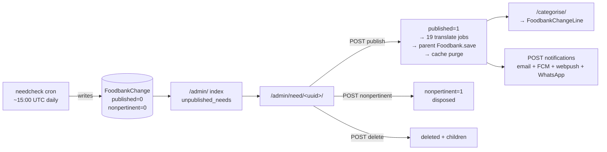

Four independent flags on `FoodbankChange` drive the whole thing: `published`, `nonpertinent`, `is_categorised`, `notified`. Categorise and Notify are only offered once published (`need.html:107,122`).

#### The screen itself

`gfadmin/views.py:1753-1831` builds, for one need:

- `prev_published` and `prev_nonpert` — the previous published and previous non-pertinent needs for that food bank
- four HTML diffs via `givefood.utils.text.diff_html` comparing `change_list()` / `excess_list()`
- subscriber counts across all four channels, so the reviewer sees the blast radius **before** pressing Notify
- the originating `CrawlSet`, resolved through the `CrawlItem` generic foreign key
- a live iframe of the source page via `/admin/proxy/?url=…` (`need.html:261`)

Every one of those is load-bearing to the review decision. The diffs in particular are how a human spots the June 2026 class of extraction drift.

#### Port plan, step by step

1. **Port `diff_html` first, with a unit test, before any UI.** It lives in `givefood/utils/text.py` and drives the four diffs. Golden-test it against 200 real `(prev, current)` pairs pulled from production before anything else in Phase 6 starts. If the diff rendering changes, the reviewer's judgement changes.
2. **Port the index queue query verbatim, including the NULL trap.**
   ```sql
   -- gfadmin/views.py:49 equivalent. NOTE: `nonpertinent` is NULLABLE in production
   -- (18,943 NULLs) and `nonpertinent = 0` EXCLUDES NULL in SQL, exactly as in Django.
   SELECT c.*, f.name AS foodbank_name
   FROM foodbankchange c LEFT JOIN foodbank f ON f.id = c.foodbank_id
   WHERE c.published = 0 AND c.nonpertinent = 0
   ORDER BY c.created DESC;
   ```
   Do **not** "tidy" this to `IS NOT 1` or coerce the 18,943 NULLs to 0 — either change dumps thousands of historical needs into the queue overnight.
3. **Build `/admin/need/<uuid>/` as one D1 `batch()` of six reads**, not six round trips: the need + food bank, prev published, prev nonpertinent, the four subscriber counts (one `UNION ALL` of counts), the crawl item, the translation count.
4. **Port the four transitions as POST-only handlers**, each ending in a D1 `batch()` plus a queue message. §9.4.2 covers the write mechanics.
5. **Port `/categorise/` carefully — it has a latent bug.** `gfadmin/views.py:2076-2127` uses the raw item text as the Django form prefix (`prefix=line`). Item text containing characters that do not survive an HTML `name` attribute silently loses that row. In the Worker, index the form fields by position (`line-0`, `line-1`, …) with the item text in a hidden field. **This is a behaviour fix and needs sign-off** (§9.5) — it changes which rows get saved, in the direction of saving more of them.
6. **Keep the discrepancy screen's three-column layout** (AI text / full food bank form / proxied iframe). It is the "fix it" loop: `gfadmin/views.py:831-836` closes the discrepancy automatically when the food bank form is saved with `?discrepancy=<id>`.
7. **Add `@require_POST` equivalence to `discrepancy_action`**, which reads `request.POST` but is not POST-only today.

#### Acceptance criteria for group A

- [ ] A need can be reviewed, published, categorised and notified end to end against D1, and the resulting rows match what Django produces for the same input.
- [ ] Publishing enqueues exactly 3 translation jobs (`cy`, `ga`, `gd`) — **deliberately not** the 19 Django's current `19 languages − en − tlh` fan-out produces; see §2.7.1's 2026-08-30 language-scope decision. This is the one acceptance criterion in this group that is *supposed* to diverge from Django's output, not match it.
- [ ] The four diffs render identically to Django's for 200 sampled `(prev, current)` pairs.
- [ ] The index queue returns the same row count and order as production for the same data.
- [ ] Notify shows the same four subscriber counts as Django.
- [ ] `/admin/need/<uuid>/` issues **one** D1 batch, verified by a query-count test.

---

### 9.4 D1 write paths — a different risk profile from public reads

Public reads are forgiving: a slow query is a slow page. Admin writes are not. Four properties of D1 change how writes must be built.

| D1 property | Consequence for the admin |
|---|---|
| **No interactive transactions.** `batch()` is the only atomic unit. | `transaction.atomic()` has no implementation. Multi-statement writes must be assembled into one `batch()` or accept partial application. |
| **A constraint violation resets the Durable Object** — *"Durable Object was reset and rolled back to its last known good state"* — not just the statement. | A duplicate food bank name typed into the form would, on a naive `INSERT`, roll back the **entire database**. Every user-facing write must pre-check uniqueness with a `SELECT` and return a form error, and every write must use `ON CONFLICT DO UPDATE`. |
| **100 bound parameters per statement.** | `foodbank` has ~79 columns (54 declared on `Foodbank`, ~25 inherited from `PhysicalPlace`/`TimestampedModel`/`EditableModel`/`UUIDModel`). A full-row `INSERT` is ~79 parameters — **21 spare**. Adding 21 more columns breaks the form silently. Assert the count in CI. |
| **Foreign keys are not declared** (see the data section). | `Foodbank.delete()`'s ten-table cascade at `givefood/models/foodbank.py:598-623` *is* the referential integrity. It must be ported as one `batch()` — which is actually *stronger* than Django gives today. |

#### 9.4.1 Replacing ModelForms — one field spec per model

There is no ORM and no `django-bulma`. Thirteen forms are `fields = "__all__"`, so today the field list, widget choice, labels, help text, validation and error rendering all come free from Django. That has to become explicit.

Do it **once**, with a field-spec module per model that drives both HTML rendering and validation. This is the single highest-leverage decision in Phase 6: it replaces `givefood/forms.py`, `django-bulma`'s `{{ form|bulma }}` filter, and `admin/form.html` (the one generic template serving 14 views) in one go.

```ts
// packages/admin/models/foodbank.ts
import type { FieldSpec } from "./spec";
import { COUNTRIES_CHOICES, FOODBANK_NETWORK_CHOICES } from "@gf/shared/const";

// Order is load-bearing: it reproduces FOODBANK_FIELD_ORDER from givefood/forms.py:17-24,
// which exists because PhysicalPlace's fields would otherwise sort ahead of Foodbank's own.
// gfadmin/tests/test_form_field_order.py pins this today; port that test.
export const foodbankFields: FieldSpec[] = [
  { name: "name",           type: "char",   maxLength: 100, required: true, unique: true,
    help: "E.g. 'Brixton', 'Sid Valley', or 'One Can Trust'" },
  { name: "alt_name",       type: "char",   maxLength: 100 },
  { name: "address",        type: "text",   required: true },
  { name: "postcode",       type: "char",   maxLength: 9, required: true, pattern: POSTCODE_RE },
  { name: "country",        type: "choice", choices: COUNTRIES_CHOICES, required: true },
  { name: "lat_lng",        type: "char",   maxLength: 50, required: true, label: "Latitude, Longitude" },
  { name: "place_id",       type: "char",   maxLength: 1024 },
  { name: "delivery_address", type: "text" },
  { name: "network",        type: "choice", choices: FOODBANK_NETWORK_CHOICES },
  // … 70 more, in FOODBANK_FIELD_ORDER
  { name: "wheelchair_accessible", type: "nullbool" },   // ⚠ TRI-STATE: null ≠ false
];
```

```ts
// packages/admin/forms.ts — 5 partial forms replace 5 near-identical Django ModelForms
export const foodbankUrlsForm    = subset(foodbankFields, ["url","shopping_list_url","rss_url",
                                    "news_url","donation_points_url","locations_url","contacts_url"]);
export const foodbankAddressForm = subset(foodbankFields, ["address","postcode","lat_lng","place_id"]);
export const foodbankPhoneForm   = subset(foodbankFields, ["phone_number","secondary_phone_number",
                                    "delivery_phone_number"]);
export const foodbankEmailForm   = subset(foodbankFields, ["contact_email","notification_email"]);
export const foodbankFsaIdForm   = subset(foodbankFields, ["fsa_id"]);
// All five stamp edited = now() on save, exactly as givefood/forms.py:64-140 does
// with the same six-line block copy-pasted six times.
```

Three validation rules that must survive because they are the *only* validation on some fields:

- `postcode` — `RegexValidator(POSTCODE_REGEX)` on `Foodbank`, `FoodbankLocation`, `FoodbankDonationPoint` and `Foodbank.charity_postcode`.
- `EmailField` — `contact_email`, `notification_email`, and the ten fields `foodbank_use_ai_detail` validates with `validate_email` / `URLValidator` at `gfadmin/views.py:1313-1360`.
- **Tri-state booleans must stay tri-state.** `FoodbankDonationPoint.wheelchair_accessible` is `BooleanField(null=True)` and feeds schema.org `isAccessibleForFree`; production has 832 NULL / 4,907 true / 6 false. A `<select>` with three options, not a checkbox.

`FoodbankLocationAreaForm` (`givefood/forms.py:167`) is the only non-model form and the only place in the admin with real `form.add_error()` paths — six of them, covering MapIt HTTP status, invalid JSON, missing centre coordinates, timeout and generic request failure. Port those error branches individually; they are the template for how every other form should report failure.

#### 9.4.2 The `save()` cascade must become explicit

`Foodbank.save()` (`givefood/models/foodbank.py:626`) is roughly **8 SQL queries plus up to 4 outbound HTTP calls plus a Cloudflare purge**. `FoodbankLocation.save()` and `FoodbankDonationPoint.save()` each additionally trigger a full parent `Foodbank.save()`. None of that fits a Worker request budget, and none of it is expressible as a database write.

Split every save into a synchronous half and an asynchronous tail:

```ts
// packages/db/foodbank.ts
export async function saveFoodbank(
  env: Env, fb: FoodbankRow, opts = { geoUpdate: true, decache: true }
): Promise<{ id: number }> {
  // --- SYNCHRONOUS: local derivations only. No network. One D1 batch. ---
  fb.slug = slugify(fb.name);
  [fb.latitude, fb.longitude] = fb.lat_lng.split(",").map(Number);
  fb.phone_number = stripSpaces(fb.phone_number);
  fb.secondary_phone_number = stripSpaces(fb.secondary_phone_number);
  fb.edited = nowIso();
  fb.modified = nowIso();

  // Pre-check uniqueness BEFORE writing. A UNIQUE violation resets the whole
  // D1 Durable Object, so a duplicate name must surface as a form error.
  const clash = await env.DB.prepare(
    "SELECT id FROM foodbank WHERE (name = ?1 OR slug = ?2) AND id IS NOT ?3"
  ).bind(fb.name, fb.slug, fb.id ?? null).first();
  if (clash) throw new FormError("name", "A food bank with this name already exists");

  const stmts = [
    upsertFoodbank(env, fb),                       // ~79 bound params — 21 under the cap
    recomputeCounters(env, fb.id),                 // no_locations, no_donation_points
    recomputeBounds(env, fb.id),                   // bounds_* from locations + donation points
    recomputeLatestNeed(env, fb.id),               // last_need, latest_need_id
  ];
  await env.DB.batch(stmts);                       // atomic: all or nothing

  // --- ASYNCHRONOUS TAIL: every network call, off the request path. ---
  if (opts.geoUpdate) await env.JOBS_Q.send({ kind: "enrich-foodbank", id: fb.id });
  if (opts.decache)   await env.PURGE_Q.send({ tags: [`fb-${fb.slug}`] });
  return { id: fb.id };
}
```

The `do_geoupdate=False` / `do_foodbank_resave=False` escape hatches must be preserved as options — `gfoffline/views.py:213,222` and `gfadmin/views.py:1722` depend on them, and without them the backfill paths will hammer Google Maps.

**Debounce the parent resave.** Today, importing 50 locations re-saves the parent food bank 50 times and purges Cloudflare 50 times. The queue consumer should coalesce `recompute-foodbank` messages by food bank id within a batch. Same for purges — batch to 100 tags per API call.

#### 9.4.3 Bulk actions

| Action | Today | Port |
|---|---|---|
| `needs_deleteall` (`views.py:422`) | `FoodbankChange.objects.filter(need_id__in=…).delete()` — a **queryset** delete, so it bypasses `FoodbankChange.delete()`'s cascade. This is the source of the 863 orphaned `FoodbankChangeTranslation` rows the data section found. | One D1 `batch()` per 100 needs: delete `foodbankchangeline`, then `foodbankchangetranslation`, then `foodbankchange`. **This fixes a live bug** — say so to the maintainer. |
| `foodbank_addsub` (`views.py:1594`) | Newline-separated email paste → one `FoodbankSubscriber` per line, `confirmed=True`, no validation, no dedupe. | Validate each address, dedupe against `(email, foodbank)`, report per-line results. One `batch()` with `ON CONFLICT DO NOTHING`. |
| `foodbank_resave` (`views.py:1279`) | Re-saves every location, donation point, need and subscriber inline. | Enqueue one `resave-foodbank` job; the page polls. |
| CSV exports — `foodbanks_csv`, `orders_csv`, `needs_csv`, `politics_csv` | Full-table scans built in memory. `needs_csv` is 33,931 rows. | Stream row-by-row into a `TransformStream`. **Never** buffer — the isolate cap is 128 MB. Column orders are frozen (they get pasted into spreadsheets). |
| The 6 data loaders | Read 61 MB `places.csv` etc. from the container filesystem. | Not admin screens. Move to the jobs Container; delete the URLs. |

#### 9.4.4 Admin-triggered jobs — enqueue and poll, no Workflows

Seven admin actions currently do long or expensive work inline:

| View | Work | Why it cannot stay inline |
|---|---|---|
| `foodbank_check` (`views.py:1138`) | up to 6 `requests.get(timeout=20)` + one Gemini call | ~7 subrequests and tens of seconds |
| `foodbank_check_prompt` / `_result` | re-runs the entire scrape | same, twice more |
| `foodbank_urls_form` **GET** (`views.py:1394`) | 1 fetch + BeautifulSoup + 1 Gemini call | a GET that costs money |
| `needtestbed` (`views.py:3420`) | **14 sequential OpenRouter calls** | minutes |
| `need_notifications` (`views.py:1995`) | one email render + enqueue **per confirmed subscriber** — up to 98 | 196 template renders in one request |
| `foodbank_crawl` / `foodbank_charity_crawl` | synchronous RSS / Charity Commission crawl | seconds to minutes |
| `foodbank_rfi` (`views.py:1265`) | inline Postmark send | fast, but should not block |

**All seven become: enqueue a message on the existing `JOBS_Q`, write a row to a small `admin_job` table, redirect, and let the page poll.** Concretely:

```ts
app.post("/admin/foodbank/:slug/check/", requireSession, requireCsrf, async (c) => {
  const jobId = crypto.randomUUID();
  await c.env.DB.prepare(
    "INSERT INTO admin_job (id, kind, target, status, created) VALUES (?1,'check',?2,'queued',?3)"
  ).bind(jobId, c.req.param("slug"), nowIso()).run();
  await c.env.JOBS_Q.send({ kind: "foodbank-check", slug: c.req.param("slug"), jobId });
  return c.redirect(`/admin/foodbank/${c.req.param("slug")}/check/?job=${jobId}`);
});
```

The page renders a spinner and polls `/admin/job/<id>/` with the htmx already in the codebase (`hx-trigger="every 2s"`), exactly the pattern `admin/index.html:117` already uses for the task count.

> **Deliberately NOT using Workflows here.** The architecture design proposed Workflows for `foodbank_check` and `needtestbed`. A Workflow is a whole extra primitive to learn, monitor and debug, and these jobs are: triggered by a human who is watching, short (seconds to a couple of minutes), and safe to simply re-run if they fail. A Queue message plus an `admin_job` row gives the same user experience with a primitive the team already has for the crons. **Queue, not Workflow.** If `needtestbed`'s 14 model calls prove too slow as one message, split it into 14 messages keyed by the same `jobId` — still no new primitive.

The `admin_job` table is four columns and is the only new table this section adds:

```sql
CREATE TABLE admin_job (
  id      TEXT PRIMARY KEY,      -- uuid
  kind    TEXT NOT NULL,         -- check | urls-suggest | needtestbed | notify | resave | crawl | rfi
  target  TEXT,                  -- foodbank slug or need_id
  status  TEXT NOT NULL,         -- queued | running | done | failed
  result  TEXT,                  -- JSON payload the page renders
  error   TEXT,
  created TEXT NOT NULL,
  finished TEXT
);
CREATE INDEX admin_job_created_idx ON admin_job(created DESC);
```

Prune it in the nightly cron alongside `crawlitem` (30 days).

---

### 9.5 Where the admin can be simplified — flagged for approval, not decided

The maintainer has said the admin is the one surface where modest UI simplification is acceptable if it materially reduces effort. These are the candidates. **None is assumed; each needs a yes or no.**

| # | Simplification | Saves | Cost to the user | Recommend |
|---|---|---:|---|---|
| S1 | **Collapse the five near-identical `Foodbank` partial forms** (`FoodbankUrlsForm`, `Address`, `Phone`, `Email`, `FsaId`) into one parameterised form driven by a field subset. Each currently repeats the same six-line `save()` override. | ~1.5 pd | None visible — same fields, same URLs, same layout. | **Yes** |
| S2 | **Hand-write the six `{{ form\|bulma }}` forms** rather than reproducing django-bulma's exact markup. `gfadmin/tests/test_settings_view.py:11,34` asserts on the Bulma classes it emits. | ~1 pd | Field spacing and error placement may differ slightly. | **Yes** |
| S3 | **Replace `/admin/subscriptions/` in-memory merge with SQL pagination.** It currently loads all rows of four subscriber models into Python, sorts them there, then paginates at 500/page. It will exceed the 128 MB isolate limit. | forced | Sorting across the four models becomes per-model or by a `UNION ALL`; the merged "all types" ordering may differ. | **Must do** |
| S4 | **Replace `/admin/places/` 20,000-rows-per-page paginator** over 253,584 rows. | forced | Page size drops to something sane (100). Deep pages get keyset navigation, not arbitrary `?page=`. | **Must do** |
| S5 | **Fix the `need_categorise` form prefix** (item text → positional index, §9.3 step 5). | 0 | Rows that silently vanish today will start saving. A behaviour change in the right direction. | **Yes, with sign-off** |
| S6 | **Drop the "total crawls" count on the food bank page**, or relabel it "crawls (30d)", since `crawlitem` keeps a 30-day window in D1. | 0 | A number changes meaning. Relabelling is honest; leaving it is not. | **Relabel** |
| S7 | **Delete the four orphan templates** (`find_locations.html`, `foodbanks_christmascards.html`, `foodbanks_deliveryaddresses.html`, `nocalories.html`) — no view references any of them. | ~0.5 pd | None, *if* they are abandoned. They may be screens whose views were lost. | **Ask first** |
| S8 | **Delete `gfadmin/locale/`** — 20 language directories, one msgid (`"Search"`), empty `msgstr` in every one. | ~0.5 pd | None. The admin is English-only in practice. | **Yes** |
| S9 | **Merge `foodbank_check_prompt` and `foodbank_check_result`** into `?debug=prompt` / `?debug=json` on the check page, so a debug view does not re-run the whole scrape from scratch. | ~1 pd | Two URLs become query params. | **Yes** |
| S10 | **Add a read-only SQL console** at `/admin/sql/` — POST-only, session-gated, rejects anything not starting with `SELECT`/`EXPLAIN`, shows `EXPLAIN QUERY PLAN` before results, hard `LIMIT 500`. | **costs** ~1 pd | This is a *new feature*, which the brief says is not a goal. But losing `psql` and `manage.py shell` is the biggest day-to-day regression of the whole migration, and this restores most of the diagnostic loss for a day. | **Ask** — I think it earns its place |

S3 and S4 are not optional; they are current designs that will not run on Workers. The rest are genuine choices.

---

### 9.6 Authentication

#### The decision, and the honest comparison

The maintainer has decided: **port the Google OAuth flow into the Worker; do not use Cloudflare Access.** That is the plan below. But the comparison should be on the record, because it is the one place where "keep it simple" and the chosen path point in different directions:

| | Cloudflare Access | Ported OAuth (chosen) |
|---|---|---|
| Code to own forever | **0 lines** | ~180 lines of auth + session code |
| Cost | Free to 50 seats, then $7/user/month | £0 |
| Matches the current gate | Exactly — one policy: *Emails ending in `@givefood.org.uk`*, Google IdP | Exactly |
| Identity in the app | `ctx.access.getIdentity()`, no JWT parsing | Read from the session |
| Revocation | Immediate, central | Delete the KV key (up to 60 s to propagate) |
| Caveats | `ctx.access` does not reach Workers using the Static Assets binding, nor propagate through service bindings; no WebSocket support | JWKS rotation must be handled |
| Extra vendor surface | One more Cloudflare product to configure | None |

Access would have been less code. The maintainer's trade is more code in exchange for no per-seat exposure and identity working exactly as it does today. Recorded, honoured, and not revisited.

**One place Access is used regardless:** Workers preview URLs are **public by default** and enabled by default when `workers_dev` is on. An aliased preview of the admin Worker is otherwise a permanent, guessable, unauthenticated copy of the admin. Put an Access application in front of `*.workers.dev` account-wide (§9.15).

#### The flow to build — keep the existing ID-token flow, do not switch to authorization-code

The architecture design proposed rebuilding this as an authorization-code flow with PKCE and a client secret. **I recommend against that**, on simplicity grounds.

What exists today (`gfauth/templates/auth/sign_in.html:26-32`) is Google Identity Services in `ux_mode="redirect"`: Google POSTs an **ID token** as `credential` directly to `/auth/receiver/`. There is no client secret anywhere in the codebase. Keeping that shape means:

- the Google Cloud console configuration is **unchanged** — same client ID `927281004707-…apps.googleusercontent.com`, same registered redirect URI `https://www.givefood.org.uk/auth/receiver/` and `http://localhost:8000/auth/receiver/`
- `sign_in.html` is unchanged apart from the template engine
- **no client secret to store, rotate or leak**
- no `state`, no PKCE, no code exchange, no token endpoint call

The cost is that the ID token arrives via the browser, so its signature **must** be verified against Google's JWKS. That is about 40 lines of WebCrypto. Net, it is materially less code than the authorization-code dance.

```mermaid
sequenceDiagram
  participant B as Browser
  participant G as accounts.google.com
  participant W as givefood Worker
  participant K as KV (SESSIONS)

  B->>W: GET /auth/  (sign-in page)
  W-->>B: GSI button, client_id, login_uri=/auth/receiver/
  B->>G: user picks account
  G->>B: sets g_csrf_token cookie
  G-->>B: 302 → POST /auth/receiver/ {credential, g_csrf_token}
  B->>W: POST /auth/receiver/
  W->>W: 1. g_csrf_token cookie == body field?
  W->>G: 2. GET /oauth2/v3/certs (cached by kid)
  W->>W: 3. verify RS256, iss, aud, exp, nbf
  W->>W: 4. gate: email_verified && hd == givefood.org.uk
  W->>K: 5. put(session:<id>, {email,name,picture}, ttl 12h)
  W-->>B: Set-Cookie __Host-gfsession; 302 → next_url
```

```ts
// workers/site/src/auth/receiver.ts
const GOOGLE_CLIENT_ID = "927281004707-tboi1tsphl4bgtqn72e76rmc7r2q22tk.apps.googleusercontent.com";
const ALLOWED_HD = "givefood.org.uk";
const JWKS_URL = "https://www.googleapis.com/oauth2/v3/certs";

let jwksCache: { keys: Map<string, CryptoKey>; expires: number } | null = null;

async function getGoogleKey(kid: string): Promise<CryptoKey> {
  // Google rotates these roughly every 6 weeks. NEVER hardcode a key; always
  // match on `kid` and honour the response's Cache-Control max-age.
  if (!jwksCache || Date.now() > jwksCache.expires || !jwksCache.keys.has(kid)) {
    const res = await fetch(JWKS_URL);
    const maxAge = Number(/max-age=(\d+)/.exec(res.headers.get("cache-control") ?? "")?.[1] ?? 3600);
    const { keys } = await res.json<{ keys: JsonWebKey[] & { kid: string }[] }>();
    const map = new Map<string, CryptoKey>();
    for (const jwk of keys) {
      map.set((jwk as any).kid, await crypto.subtle.importKey(
        "jwk", jwk, { name: "RSASSA-PKCS1-v1_5", hash: "SHA-256" }, false, ["verify"]));
    }
    jwksCache = { keys: map, expires: Date.now() + maxAge * 1000 };
  }
  const key = jwksCache.keys.get(kid);
  if (!key) throw new Error("unknown kid");
  return key;
}

const b64u = (s: string) => Uint8Array.from(
  atob(s.replace(/-/g, "+").replace(/_/g, "/")), c => c.charCodeAt(0));

export async function authReceiver(c: Context) {
  const form = await c.req.formData();
  const credential = String(form.get("credential") ?? "");

  // (1) GSI redirect mode sets a g_csrf_token cookie AND puts the same value in
  // the body. Django does NOT check this today — that is a live CSRF hole on the
  // login endpoint. Check it.
  const cookieToken = getCookie(c, "g_csrf_token");
  const bodyToken = String(form.get("g_csrf_token") ?? "");
  if (!cookieToken || !bodyToken || !timingSafeEqual(cookieToken, bodyToken)) {
    return c.text("Bad CSRF token", 403);
  }

  // (2)(3) verify signature and standard claims
  const [h, p, s] = credential.split(".");
  const header = JSON.parse(new TextDecoder().decode(b64u(h)));
  const key = await getGoogleKey(header.kid);
  const ok = await crypto.subtle.verify(
    "RSASSA-PKCS1-v1_5", key, b64u(s),
    new TextEncoder().encode(`${h}.${p}`));
  if (!ok) return c.text("Invalid token", 403);

  const claims = JSON.parse(new TextDecoder().decode(b64u(p)));
  const now = Math.floor(Date.now() / 1000);
  if (!["accounts.google.com", "https://accounts.google.com"].includes(claims.iss)) return c.text("", 403);
  if (claims.aud !== GOOGLE_CLIENT_ID) return c.text("", 403);
  if (claims.exp <= now || (claims.nbf && claims.nbf > now)) return c.text("", 403);

  // (4) THE GATE — byte-for-byte the same test as givefood/middleware.py:68
  if (claims.email_verified !== true || claims.hd !== ALLOWED_HD) return c.text("", 403);

  // (5) session
  const sid = crypto.randomUUID().replace(/-/g, "") + crypto.randomUUID().replace(/-/g, "");
  await c.env.SESSIONS.put(`s:${sid}`, JSON.stringify({
    email: claims.email, name: claims.given_name, picture: claims.picture,
    created: now, csrf: crypto.randomUUID(),
  }), { expirationTtl: 12 * 3600 });

  setCookie(c, "__Host-gfsession", sid, {
    path: "/", secure: true, httpOnly: true, sameSite: "Lax", maxAge: 12 * 3600,
  });

  const next = safeNextUrl(getCookie(c, "__Host-gfnext"));   // must be same-origin, path-only
  deleteCookie(c, "__Host-gfnext");
  return c.redirect(next ?? "/admin/");
}
```

> **`SameSite=Lax`, not `Strict`.** The Google redirect arrives as a cross-site request; `Strict` would drop the cookie and the user would land back on the sign-in page in a loop.

> **Needs verification before build:** whether Google still requires signature verification when the token arrives via the browser (it does — the "you may skip verification" exemption applies only to tokens fetched directly from Google's token endpoint over TLS, which is not this flow). Confirm against current Google Identity documentation during the Phase 6 spike, and confirm the `g_csrf_token` double-submit is still part of GSI redirect mode. Both are Google behaviours, not Cloudflare ones, and were not covered by the platform research.

#### What breaks, and how each is handled

| Thing | Status | Handling |
|---|---|---|
| **Per-user identity in the app** | **Survives.** The admin displays `request.session.user_data.picture`, `.given_name` and `.email` in `admin/page.html:53-56` and `auth/sign_in.html`. | Same three fields, read from the KV session instead of the Django session. Every `request.session["user_data"][…]` becomes `c.get("session").…`. There is no `auth_user` table to attach to — there never was. |
| **`django_session` (706 rows)** | **Deleted.** | Sessions hold exactly two things: `user_data` and `next_url`. Both are replaced. **Audit for other `request.session[…]` uses before dropping the table** — I traced only the login flow and `LoginRequiredAccess`'s `next_url`. |
| **`GfCredential` (43 rows, 31 names)** | **Deleted**, along with all five `/admin/credentials/…` URLs and `delete_all_cached_credentials()`. | §9.13. Note this is unrelated to auth — it is the secret store, and the OAuth client ID is not in it (it is hardcoded in two places). |
| **`gfadmin/context_processors.py`** | **Deleted.** | It injects four Google Maps keys, `offline_key` and `os.environ['DB_HOST']` into **every** template render site-wide (`settings.py:130` — it runs on public pages too). Replace with an explicit per-page context on the two admin screens that need a Maps key. |
| **`LoginRequiredAccess`, `gfauth` (167 lines)** | **Deleted.** | Replaced by the Hono middleware in §9.7. |
| **The `?next_url=` round trip** | Survives, hardened. | Stored in a short-lived `__Host-gfnext` cookie rather than the session, and validated as same-origin and path-only before redirecting. Django's `url_has_allowed_host_and_scheme(next_url, allowed_hosts=None)` is doing very little today. |

---

### 9.7 Session storage — KV, and why

**Recommendation: Workers KV.** One namespace, `SESSIONS`, key `s:<64 hex chars>`, value a small JSON blob, `expirationTtl: 43200` (12 hours).

| Option | Verdict |
|---|---|
| **KV** ✅ | Sessions are small (a few hundred bytes), short-lived, and read on **every** admin request. KV's read path is edge-cached and single-digit milliseconds. A server-side store means logout is a real revocation. |
| D1 | Keeps everything in one place — genuinely attractive under "prefer one datastore". But it makes a read (and a sliding-expiry write) per request against a database Cloudflare describes as *inherently single-threaded*, on the same database serving the public site. Rejected on that basis alone. |
| Signed stateless cookies | No store at all, which is the simplest possible thing. **Rejected: no revocation.** This admin can mass-delete needs and fire notifications to thousands of subscribers. A leaked cookie that cannot be invalidated for 12 hours is not acceptable. |
| Durable Object | Exact, strongly consistent, revocation instant. **Rejected as over-engineering** for two users — it adds a primitive to learn, monitor and debug for a problem KV already solves. |

```ts
// workers/site/src/auth/session.ts
export const requireSession = createMiddleware(async (c, next) => {
  const sid = getCookie(c, "__Host-gfsession");
  if (!sid || !/^[0-9a-f]{64}$/.test(sid)) return redirectToSignIn(c);

  const raw = await c.env.SESSIONS.get(`s:${sid}`, { type: "json", cacheTtl: 60 });
  if (!raw) return redirectToSignIn(c);

  // Sliding expiry: refresh only when under an hour remains, so we are not
  // writing to KV on every request (KV caps writes to ONE PER SECOND PER KEY).
  const age = Math.floor(Date.now() / 1000) - raw.created;
  if (age > 11 * 3600) {
    await c.env.SESSIONS.put(`s:${sid}`, JSON.stringify({ ...raw, created: Math.floor(Date.now()/1000) }),
      { expirationTtl: 12 * 3600 });
  }
  c.set("session", raw);
  c.set("sid", sid);
  await next();
});

export async function signOut(c: Context) {
  const sid = getCookie(c, "__Host-gfsession");
  if (sid) await c.env.SESSIONS.delete(`s:${sid}`);
  deleteCookie(c, "__Host-gfsession", { path: "/", secure: true });
  return c.redirect("/auth/");
}
```

**The one honest cost, stated plainly:** KV is eventually consistent — a write (including a delete) propagates in *up to 60 seconds*. So a sign-out may continue to be honoured at a distant colo for up to a minute. For a two-person admin in one country this is acceptable, and the 12-hour cookie expiry bounds the worst case anyway. It should be written down rather than discovered. If it ever becomes unacceptable, the fix is a Durable Object, not a bigger KV.

**Applying the gate.** `LoginRequiredAccess` matched on the resolved Django `app_name`, which meant a new admin URL was protected automatically. Path-prefix matching does not have that property, so be explicit and default-deny:

```ts
const admin = new Hono<Env>();
admin.use("*", requireSession);      // applies to EVERY route mounted below
admin.use("*", requireCsrf);         // §9.8 — mutating methods only
app.route("/admin", admin);
app.route("/dashboard", admin);      // gfdash was never gated; see §9.16 open question
```

Add a CI test that enumerates every route registered under `/admin` and asserts each returns a redirect-to-sign-in without a session cookie. That restores the "protected automatically" property the middleware gave for free.

---

### 9.8 CSRF — build it, do not port the absence

There is no CSRF protection today. `CsrfViewMiddleware` is commented out; `session_csrf.CsrfMiddleware` was never added; `givefood/checks.py:5` defines a system check written specifically to catch this condition and is **never registered** (there is no `givefood/apps.py` and no `register()` call anywhere), so it never runs.

Build three layers, all cheap:

1. **`SameSite=Lax` on `__Host-gfsession`.** Blocks cross-site POSTs outright in every current browser. This alone closes the hole.
2. **`Origin` / `Sec-Fetch-Site` check on every mutating request.** Three lines, no token plumbing, and sufficient for a same-origin admin.
3. **Double-submit token**, since 17 `` tags already exist in the templates and the markup is therefore already there.

```ts
const SAFE = new Set(["GET", "HEAD", "OPTIONS"]);

export const requireCsrf = createMiddleware(async (c, next) => {
  if (SAFE.has(c.req.method)) return next();

  // Layer 2
  const site = c.req.header("sec-fetch-site");
  const origin = c.req.header("origin");
  const sameOrigin = site === "same-origin"
    || (origin != null && origin === new URL(c.req.url).origin);
  if (!sameOrigin) return c.text("Cross-site request refused", 403);

  // Layer 3
  const sess = c.get("session");
  const form = await c.req.raw.clone().formData().catch(() => null);
  const token = form?.get("csrfmiddlewaretoken") ?? c.req.header("x-csrf-token");
  if (!token || !timingSafeEqual(String(token), sess.csrf)) {
    return c.text("CSRF token missing or invalid", 403);
  }
  await next();
});
```

`timingSafeEqual` must be constant-time — the current `key != get_cred("offline_key")` comparison in `OfflineKeyCheck` is not, and neither should its replacement be.

**Close the GET-mutation holes at the same time.** Nine views mutate state or spend money on a GET, and `admin/page.html:21` carries `<body data-instant-allow-query-string data-instant-allow-external-links>` — an instant.page-style prefetcher that will happily follow those links:

| View | `gfadmin/views.py` | Today | Port as |
|---|---|---|---|
| `order_delete` | 524 | deletes on GET | POST + CSRF |
| `donationpoint_delete` | 1865 | deletes on GET (its siblings `fblocation_delete` and `photo_delete` *are* POST-only) | POST + CSRF |
| `discrepancy_action` | 2206 | reads `request.POST` but is not POST-only | POST + CSRF |
| `clearcache` | 3116 | clears both caches on GET | POST + CSRF |
| `credentials_decache` | 2872 | flushes the credential cache | **deleted with `GfCredential`** |
| `foodbank_check`, `_prompt`, `_result` | 1138, 1218, 1225 | LLM calls on GET | POST (enqueue) + CSRF |
| `foodbank_urls_form` GET | 1394 | fetch + Gemini on page load | move suggestion behind an explicit "Suggest URLs" POST button |
| `needtestbed` | 3420 | 14 LLM calls on GET | POST (enqueue) + CSRF |
| the 6 loaders | 2160-2727 | bulk writes on GET | **removed from the web tier** |

---

### 9.9 Security defects to fix rather than reproduce

#### D1 — `GET /admin/credential/<name>/` returns any secret as plain text

```python
# gfadmin/views.py:2866
def credential_detail(request, name):
    """Return a credential's value as plain text."""
    credential = get_object_or_404(GfCredential, cred_name=name)
    return HttpResponse(credential.cred_value, content_type="text/plain")
```

31 names including `postmark_server_token`, `cf_api_key`, `firebase_service_account` (a full service-account JSON), `VAPID_PRIVATE_KEY`, `salt` and `turnstile_secret`. **Delete this view and all five `/admin/credentials/…` URLs.** Once secrets live in Worker secrets there is nothing for the screen to show.

#### D2 — `GET /admin/proxy/?url=` is an unrestricted SSRF

```python
# gfadmin/views.py:3326
url = request.GET.get("url")
response = requests.get(url, headers={"User-Agent": BOT_USER_AGENT})
```

It fetches any URL the caller names and returns the body with same-domain links rewritten back through itself. It is **load-bearing** — four templates iframe it so a reviewer sees the source page beside the AI's extraction (`need.html:261`, `form.html:25`, `form.html:34`, `discrepancy.html:41`). It cannot simply be deleted.

Port it with an allowlist resolved from D1 per request:

```ts
app.get("/admin/proxy/", requireSession, async (c) => {
  const target = c.req.query("url");
  if (!target) return c.text("", 400);
  let u: URL;
  try { u = new URL(target); } catch { return c.text("Bad URL", 400); }
  if (u.protocol !== "https:" && u.protocol !== "http:") return c.text("", 400);

  // Allowlist: the host must appear in one of the five URL columns we crawl.
  const allowed = await c.env.DB.prepare(`
    SELECT 1 FROM foodbank
     WHERE instr(url, ?1) OR instr(shopping_list_url, ?1) OR instr(locations_url, ?1)
        OR instr(contacts_url, ?1) OR instr(donation_points_url, ?1)
     LIMIT 1`).bind(u.hostname).first();
  if (!allowed) return c.text(`Refused: ${u.hostname} is not a known food bank host`, 403);

  const res = await fetch(u.toString(), {
    headers: { "User-Agent": BOT_USER_AGENT },
    redirect: "manual",                       // do not follow into a non-allowlisted host
    signal: AbortSignal.timeout(20_000),
  });
  // Rewrite same-host anchors through the proxy with HTMLRewriter (streaming,
  // no BeautifulSoup equivalent needed and no full-body buffering).
  return new HTMLRewriter().on("a[href]", new ProxyLinkRewriter(u)).transform(res);
});
```

An `instr()` scan over 1,071 food banks is a full table read; cache the host set in module scope with a 5-minute TTL rather than querying per request.

#### D3 — `/offline/render_proxy/` renders any URL, billed to the account

`gfoffline/views.py:331-357` POSTs an arbitrary `?url=` to Cloudflare Browser Rendering with `Bearer get_cred("gf_browser_api")`, and indexes `response_json["result"]` with no guard. **Delete it.** Nothing in the repository calls it.

#### D4 — `email_tester_test` interpolates user input into a template path

`gfadmin/views.py:3138-3141` does `render_to_string("wfbn/emails/%s" % email)` where `email` comes from `?email=`. Port with a hardcoded allowlist of the six email templates that exist.

#### D5 — `gmap_proxy` takes the Google API key from the browser

`gfadmin/views.py:3362` forwards `request.GET.dict()` verbatim to Google Places, and `givefood/static/js/admin.js:119-120` builds the query string including `key=${gmap_places_key}` — which `page.html:71-76` has written into inline JS. Move the key server-side in the Worker; stop emitting it to the browser.

#### D6 — the duplicate URL name

`gfadmin/urls/geography.py` registers `name="parlcon_form"` **twice** (line 9 for `parlcon/new/`, line 14 for `parlcon/<slug>/edit/`). The second wins for `reverse()`, so `` with no arguments cannot resolve the create URL. Fix it during the port; do not faithfully reproduce it.

---

### 9.10 The `OfflineKeyCheck` endpoints

Ten URLs under `/offline/`, guarded by `givefood/middleware.py:26-41`: a `?key=` query parameter compared with `!=` against `get_cred("offline_key")`. The key is rendered into admin HTML at `gfadmin/templates/admin/foodbank.html:268` as the "Force Check" link, so it has been in every access log, Referer header and Cloudflare analytics row this site has ever produced.

**The whole surface disappears.** Nine of the ten become Cron Triggers or Queue consumers in the jobs Worker with **no public route at all** — that is a strictly better security posture than any key check, because there is nothing to reach.

| `/offline/` endpoint | Becomes |
|---|---|
| `precacher/` | **Deleted.** It warms a per-process locmem cache; the concept does not exist on Workers. |
| `oc_geocode/` | **Deleted.** The function body is `pass`. |
| `render_proxy/` | **Deleted** (D3). |
| `discrepancy_check/` | Cron Trigger → Queue |
| `pluscodes/`, `place_ids/`, `need_categorisation/` | Cron Trigger → Queue |
| `load_mps/`, `refresh_mps/` | Jobs Container (they write JPEGs to disk in **append** mode — `'a+b'` at `gfoffline/views.py:278,323` — so existing files may already be concatenated garbage; validate before copying to R2) |
| `foodbank_need_check/<slug>/` | **The only one that must stay reachable** — it is the admin "Force Check" button. |

`foodbank_need_check` becomes an authenticated admin route inside the existing session and CSRF gate:

```ts
// Replaces:  ?key={{ offline_key }}
app.post("/admin/foodbank/:slug/needcheck/", requireSession, requireCsrf, async (c) => {
  const jobId = crypto.randomUUID();
  await recordJob(c.env, jobId, "needcheck", c.req.param("slug"));
  // Same queue the daily cron fans out onto — one code path, not two.
  await c.env.RENDER_Q.send({ slug: c.req.param("slug"), jobId, source: "admin" });
  return c.redirect(`/admin/foodbank/${c.req.param("slug")}/?job=${jobId}`);
});
```

Note it uses **the same queue the cron uses**, so there is one need-check code path, not an admin variant that can drift. `offline_key` is deleted from the secret list, and `OfflineKeyCheck` is deleted from the middleware chain.

---

### 9.11 Turnstile

Turnstile is already deployed and is unaffected by the migration. It protects three public forms — food bank registration, the page-flag form, and email subscribe — via `givefood/utils/general.py:15-24`, which POSTs to `https://challenges.cloudflare.com/turnstile/v0/siteverify` with `get_cred("turnstile_secret")`. The sitekey `0x4AAAAAAABxtIRWlPcEGwhj` is hardcoded in `givefood/templates/public/human.html`.

From a Worker this is one `fetch`. The only changes:

1. `turnstile_secret` moves from `GfCredential` to a Worker secret.
2. Add error handling. Today `validate_turnstile` does `turnstile_result.json()["success"]` **unguarded**, so a malformed response raises rather than failing closed.
3. Preserve the three-hop flow exactly: form → `POST /human/` (which re-renders the fields into a headless Turnstile interstitial with `target` and `action` hidden inputs) → `POST` to the real target. It is odd, but it is what the sitekey's domain configuration and the existing markup expect.

**Turnstile is not added to the admin.** The admin is behind a Google Workspace login; a bot challenge on top would be noise.

---

### 9.12 WAF and rate limiting

The maintainer has decided: **cache hard, serve everyone — no bot blocking, no rate limiting on public traffic.** That decision stands and this section does not revisit it. But three narrow rules protect endpoints where the argument is about abuse cost rather than access to open data.

**Plan constraints to know first:**

| Plan | Rate-limiting rules | Characteristics | Custom rules |
|---|---:|---|---:|
| Free | **1** | **IP only**, 10 s minimum period | 5, no regex |
| Pro | 2 | IP, Host, URI, Query | 20, no regex |
| Business | 5 | + custom counting | 100, regex |

The plan assumes the zone stays on **Free** (10 Cache Rules is enough for the caching design). That gives **one** rate-limiting rule keyed on IP. Spend it deliberately.

| # | Rule | Why | Plan needed |
|---|---|---|---|
| R1 | **The one rate-limiting rule → `/auth/receiver/`**, 10 requests / 60 s per IP. | It is the authentication endpoint and it does a JWKS fetch plus an RSA verify per request. This is the one place unbounded requests cost real CPU and where brute force has a meaning. | Free |
| R2 | **WAF custom rule: block non-GET to `/admin/*` with no `__Host-gfsession` cookie.** Managed Challenge, not Block. | Cheap outer layer in front of the session check. Costs one of the five Free custom rules. | Free |
| R3 | **A rate-limiting rule on `/aac/`** — the autocomplete is CORS-open (`Access-Control-Allow-Origin: *`), uncredentialed, fires on every keystroke past two characters with a 100 ms debounce, and D1 bills rows **scanned**. | This is the one place the no-rate-limiting decision has a measurable cost consequence. **Take it back to the maintainer rather than assuming** — it is public open data and they may well prefer to serve it. If they say yes, it needs Pro (2 rules) or the rule must replace R1. | Pro |

Two platform facts that matter operationally: the **Log action is Enterprise-only**, so on Free/Pro a WAF rule cannot be deployed in observation mode first — every rule change goes straight to enforcing, on a site whose data feeds governments and councils. Test each rule against a narrow path first. And D1 caps `LIKE`/`GLOB` patterns at **50 bytes**, with no Postgres equivalent; add a length guard on `/aac/?q=` and on the admin search box (`gfadmin/views.py:118-207` pipes user input into 28 `icontains` filters) or a 51-character query throws.

---

### 9.13 Secrets — 31 of them, not ~20

Every secret lives in `givefood_gfcredential` (two columns, `cred_name` and `cred_value`, no unique constraint) and is read through `get_cred()` (`givefood/utils/cache.py:200-216`), which resolves by `filter(cred_name=…).latest("created")` and caches for an hour. **Rotation today is "insert a newer row"**, and old values persist in the table indefinitely.

The complete list, with destination:

| Credential | Used by | Worker |
|---|---|---|
| `turnstile_secret` | public forms | site |
| `postmark_server_token` | all email | **both** |
| `salt` | subscriber key derivation | site |
| `gmap_key`, `gmap_static_key`, `gmap_geocode_key`, `gmap_places_key` | maps, geocoding, place photos | **both** |
| `cf_api_key`, `cf_zone_id`, `cf_account_id` | cache purge, Browser Rendering | **both** |
| `cf_need_browser_render`, `gf_browser_api` | Browser Rendering (two different tokens) | jobs |
| `gemini_api_key` | discrepancy check, categorisation, order parsing | jobs |
| `ew_charity_api_key`, `scot_charity_api_key` | Charity Commission, OSCR | jobs |
| `gcp_translate_key` | 19-language need translation | jobs |
| `mapit_key` | location-from-area form | site (admin) |
| `oc_geocode_key` | OpenCage — **only caller is dead code** (`fire_oc_geocode` is `pass`); verify then drop | — |
| `whatsapp_accesstoken`, `whatsapp_webhookverifytoken` | WhatsApp send + webhook verify | jobs / site |
| `VAPID_PUBLIC_KEY`, `VAPID_PRIVATE_KEY`, `VAPID_ADMIN_EMAIL` | web push | jobs |
| `firebase_service_account` | FCM (full service-account JSON — the one value likely to test any size limit) | jobs |
| `firebase_api_key`, `firebase_auth_domain`, `firebase_project_id`, `firebase_storage_bucket`, `firebase_messaging_sender_id`, `firebase_app_id` | interpolated into `/firebase-messaging-sw.js` | site |
| `offline_key` | **deleted** (§9.10) | — |
| *(not in the table)* `openrouter_liveneed`, `openrouter_needtestbed` | need extraction, model bench | jobs |

That is 31 in `GfCredential` plus 2 OpenRouter keys held elsewhere.

#### Recommendation: per-Worker Worker secrets, not Secrets Store

Cloudflare Secrets Store gives one account-level canonical copy with one rotation point, which is the elegant answer. **I recommend against it here**, on three grounds: it is **open beta**; its `.get()` is async so it cannot sit in module scope; and there are only **two Workers**, of which six secrets are shared. Duplicating six values via a script is simpler for one or two people to run for years than adopting a beta product. Revisit when Secrets Store is GA.

```bash
# tools/secrets/push.sh — the ONLY way secrets reach Cloudflare.
# Reads a gitignored secrets.env of KEY=VALUE lines; never echoes a value.
set -euo pipefail
SITE_SECRETS="TURNSTILE_SECRET POSTMARK_TOKEN SUBSCRIBER_SALT GMAP_STATIC_KEY GMAP_PLACES_KEY \
GMAP_GEOCODE_KEY MAPIT_KEY CF_API_KEY CF_ZONE_ID FIREBASE_API_KEY FIREBASE_AUTH_DOMAIN \
FIREBASE_PROJECT_ID FIREBASE_STORAGE_BUCKET FIREBASE_MESSAGING_SENDER_ID FIREBASE_APP_ID \
WHATSAPP_WEBHOOKVERIFYTOKEN"
JOBS_SECRETS="OPENROUTER_KEY GEMINI_API_KEY GCP_TRANSLATE_KEY EW_CHARITY_KEY SCOT_CHARITY_KEY \
CF_ACCOUNT_ID CF_BROWSER_TOKEN GF_BROWSER_API POSTMARK_TOKEN GMAP_PLACES_KEY GMAP_GEOCODE_KEY \
CF_API_KEY CF_ZONE_ID WHATSAPP_TOKEN FIREBASE_SERVICE_ACCOUNT VAPID_PUBLIC_KEY VAPID_PRIVATE_KEY \
VAPID_ADMIN_EMAIL"

push () {                      # push <worker-dir> <NAME...>
  local dir="$1"; shift
  for name in "$@"; do
    val="$(grep -m1 "^${name}=" secrets.env | cut -d= -f2-)"
    [ -n "$val" ] || { echo "MISSING: $name" >&2; exit 1; }
    printf '%s' "$val" | npx wrangler secret put "$name" --config "$dir/wrangler.jsonc"
  done
}
push workers/site $SITE_SECRETS
push workers/jobs $JOBS_SECRETS
```

Declare the required names in each `wrangler.jsonc` so a missing secret fails at deploy rather than at 3am:

```jsonc
{
  "name": "givefood",
  "secrets": ["TURNSTILE_SECRET", "POSTMARK_TOKEN", "SUBSCRIBER_SALT",
              "GMAP_STATIC_KEY", "GMAP_PLACES_KEY", "GMAP_GEOCODE_KEY", "MAPIT_KEY",
              "CF_API_KEY", "CF_ZONE_ID", "FIREBASE_API_KEY", "FIREBASE_AUTH_DOMAIN",
              "FIREBASE_PROJECT_ID", "FIREBASE_STORAGE_BUCKET",
              "FIREBASE_MESSAGING_SENDER_ID", "FIREBASE_APP_ID",
              "WHATSAPP_WEBHOOKVERIFYTOKEN"]
}
```

#### Rotation

The operational model changes: today a secret is rotated by inserting a row through the admin UI, with no deploy. After the migration it is `wrangler secret put`, which creates and deploys a new version. That is a **regression in convenience and an improvement in auditability** — say both.

```bash
# Rotate one secret. Takes effect on the next request; no code change.
printf '%s' "$NEW_VALUE" | npx wrangler secret put POSTMARK_TOKEN --config workers/site/wrangler.jsonc
npx wrangler secret list --config workers/site/wrangler.jsonc   # names only, never values
```

Rotation runbook, for a shared secret:

1. Create the new credential at the provider, leaving the old one live.
2. `wrangler secret put` on **both** Workers.
3. Verify: trigger one real use (e.g. send a test email from `/admin/emailtester/`).
4. Revoke the old credential at the provider.
5. Record the date in the rotation log.

**Ask the maintainer which credentials are rotated by hand** (§9.16) — any that are rotated frequently without a deploy are the argument for revisiting Secrets Store.

#### The `salt`, correctly stated

An earlier draft of this plan called `SUBSCRIBER_SALT` a blocker on the grounds that 5,855 existing unsubscribe links break if it changes. **That is wrong, and the correction matters.** `givefood/models/subscribers.py:44-57` generates `sub_key` and `unsub_key` **once**, guarded by `if not self.sub_key`, and **stores them in the row**. The confirm and unsubscribe views look up the stored column; the salt is never used on read. Existing keys migrate as ordinary column data.

Carry the salt across anyway so newly-generated keys keep the same derivation — but it is a one-line note, not a cutover risk.

#### Local development

```bash
# workers/site/.dev.vars  — GITIGNORED, never committed
TURNSTILE_SECRET="1x0000000000000000000000000000000AA"   # Cloudflare's always-passes test secret
POSTMARK_TOKEN="POSTMARK_API_TEST"                       # Postmark's test token: accepts, never delivers
SUBSCRIBER_SALT="dev-salt-not-production"
GMAP_STATIC_KEY="" 
GMAP_PLACES_KEY=""
CF_API_KEY="dev-noop"
```

Rules for local development:

1. **`.dev.vars` and `.dev.vars.*` are gitignored and contain no production values.** Use each provider's documented test credential where one exists; use an empty string and let the call fail loudly where one does not.
2. **`make seed` builds a sanitised D1**, with subscriber emails synthesised as `subscriber-N@example.invalid` and phone numbers as `01234 567890`. Production PII does not go on developer laptops.
3. **Never `source .env`.** The existing `.env` contains a `SECRET_KEY` with a single quote in it; sourcing it in zsh opens a quote and swallows the rest of the file. Parse it in Python if you need it during the transition.
4. Browser Rendering and AI Gateway have **no local emulation** — develop those paths against remote services with real credentials in a scratch account, or stub them.
5. A local admin session is created by a dev-only route, gated on `wrangler dev` only:
   ```ts
   if (import.meta.env?.DEV) {
     app.get("/auth/dev-login", async (c) => {
       const sid = "0".repeat(64);
       await c.env.SESSIONS.put(`s:${sid}`, JSON.stringify({
         email: "dev@givefood.org.uk", name: "Dev", picture: "", 
         created: Math.floor(Date.now()/1000), csrf: "dev",
       }), { expirationTtl: 3600 });
       setCookie(c, "__Host-gfsession", sid, { path: "/", secure: true, httpOnly: true, sameSite: "Lax" });
       return c.redirect("/admin/");
     });
   }
   ```
   Assert in CI that this route does **not** exist in a production build.

---

### 9.14 The admin during cutover

Two things the cutover runbook depends on and which belong here:

1. **The freeze must return a maintenance page, not a 500.** The runbook sets Postgres read-only, which surfaces in Django as an unhandled write error. Deploy a freeze version that returns a styled 503 for any non-`GET` under `/admin/*`, plus a banner on `GET` pages, *before* the database goes read-only.
2. **Drain the task queue before disabling `db_worker`.** `db_worker` is the drain; disabling it strands every `READY` task, and those tasks are subscriber emails, 19-language translations and cache purges — and the table is then dropped. The go/no-go must assert `READY = 0 AND RUNNING = 0`, not just `RUNNING = 0`. Budget 30 minutes at the observed ~5 tasks/minute drain rate. (Full sequencing is in the cutover section; it is repeated here because the failure mode is an admin one.)

---

### 9.15 Security checklist for the new deployment

Every line is verifiable. Run it before launch (the single traffic-and-data cutover, §10.1.1a) and again at D+7.

**Authentication and session**
- [ ] `/admin/*` and `/dashboard/*` return a redirect to `/auth/` with no session cookie — **verified by a CI test that enumerates every registered admin route**, not by spot-checking
- [ ] The gate is `email_verified === true && hd === "givefood.org.uk"`, byte-for-byte the same test as `givefood/middleware.py:68`
- [ ] ID token signature verified against Google's JWKS, matched on `kid`, key never hardcoded, JWKS TTL from the response's `Cache-Control`
- [ ] `iss`, `aud`, `exp`, `nbf` all validated
- [ ] `g_csrf_token` double-submit verified on `/auth/receiver/` (**this is new — Django does not check it today**)
- [ ] Session cookie is `__Host-gfsession`, `Secure`, `HttpOnly`, `SameSite=Lax`, `Path=/`, 12-hour TTL
- [ ] Session id is ≥ 32 bytes of `crypto.getRandomValues` entropy
- [ ] Sign-out deletes the KV key **and** clears the cookie; the ≤60 s KV propagation window is documented
- [ ] `?next_url=` is validated as same-origin and path-only before redirect
- [ ] Preview URLs (`*.workers.dev`) are behind Cloudflare Access account-wide

**CSRF and method safety**
- [ ] Every mutating handler passes through `requireCsrf`
- [ ] `Origin` / `Sec-Fetch-Site` checked on every non-safe method
- [ ] Double-submit token compared in constant time
- [ ] Zero admin routes mutate state or spend money on `GET` — verified by a test that issues `GET` to every route and asserts no D1 write and no outbound `fetch`

**Secrets**
- [ ] `GfCredential`, `get_cred()`, `delete_all_cached_credentials()` and all five `/admin/credentials/…` URLs are gone
- [ ] `GET /admin/credential/<name>/` returns 404
- [ ] No secret appears in any rendered page, inline `<script>`, or URL — specifically `gmap_*` keys and `offline_key`, which `admin/page.html:71-76` and `foodbank.html:268` emit today
- [ ] `gfadmin/context_processors.py` is deleted (it leaked four Maps keys, `offline_key` and `DB_HOST` into **every** site-wide render)
- [ ] `wrangler secret list` matches the declared `secrets` array on both Workers
- [ ] `.dev.vars` and `secrets.env` are gitignored; `git log -S` finds no production secret in history
- [ ] A rotation runbook exists and has been executed once, for one secret, end to end

**Input and output**
- [ ] `/admin/proxy/` allowlists the target host against the five food bank URL columns; `redirect: "manual"`; 20 s timeout
- [ ] `/offline/render_proxy/` is deleted
- [ ] `email_tester_test` uses a hardcoded template allowlist, not `?email=` interpolation
- [ ] `gmap_proxy` holds the API key server-side; the browser no longer receives it
- [ ] Every D1 query uses `.bind()`; zero string-interpolated SQL — **specifically check the geo paths**, where `django-earthdistance` interpolates coordinates into SQL with no parameter binding today
- [ ] `?q=` length-guarded on `/aac/` and the admin search box (D1 caps LIKE patterns at 50 bytes)
- [ ] The tri-state booleans (`nonpertinent`, `is_categorised`, `wheelchair_accessible`) preserve NULL

**Write-path safety**
- [ ] Every user-facing write pre-checks uniqueness with a `SELECT` before insert, so a duplicate returns a form error rather than resetting the D1 Durable Object
- [ ] Every write uses `INSERT … ON CONFLICT DO UPDATE`
- [ ] `Foodbank.delete()`'s ten-table cascade is one `batch()`
- [ ] `needs_deleteall` deletes children before parents (fixing the orphan bug)
- [ ] The `foodbank` full-row `INSERT` parameter count is asserted in CI as `< 100`
- [ ] CSV exports stream; nothing buffers a full table

**Headers and platform**
- [ ] `/admin/*` responses carry `Cache-Control: private, no-store` and are excluded from every Cache Rule
- [ ] `X-Frame-Options: DENY` or a frame-ancestors CSP on admin pages (`XFrameOptionsMiddleware` is commented out at `settings.py:99` today)
- [ ] `X-Robots-Tag: noindex` on `/admin/*`
- [ ] `observability.enabled` is on for both Workers; Sentry is wired via `@sentry/cloudflare` with `nodejs_compat`
- [ ] Sentry's `send_default_pii` is **off** and `traces_sample_rate` is **not 1.0** — the Django config carries both today and inheriting them at Workers request volume is a cost and privacy decision, not a default

---

### 9.16 Sequencing, acceptance and open questions

#### Order of work within Phase 6

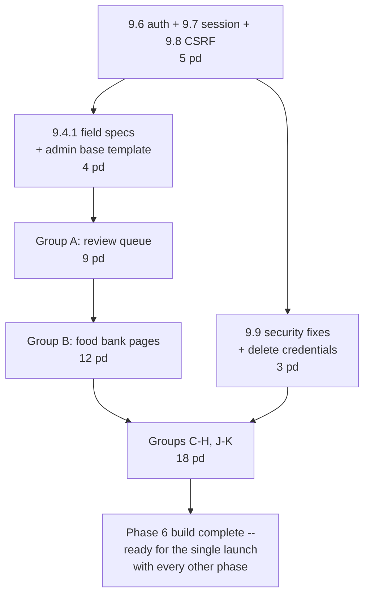

Auth first because nothing else is reachable without it. Field specs second because every form depends on them. The review queue third, so it gets the most build/QA time against the disposable copy. Finishing Phase 6 alone doesn't unblock the Postgres decommission — that happens once, at the single Phase 7 launch (§10.1.1a), alongside every other phase, not per-phase as each one completes.

#### Phase-exit criteria

- [ ] All 113 URL patterns resolve (minus the deletions in §9.2 group I and E)
- [ ] The security checklist in §9.15 is fully green
- [ ] A need can be reviewed → published → categorised → notified, end to end, against D1
- [ ] The 35 `gfadmin` test modules that assert real behaviour (query counts, `FOODBANK_FIELD_ORDER`, `crawl_set.json` shape, htmx partial responses) have been ported or consciously discarded
- [ ] The htmx browser contract is unchanged: `/admin/foodbank/<slug>/tab/<tab>/` returns bare partial HTML for the six valid tabs and 404 otherwise; `foodbank_touch`, `foodbank_use_ai_detail` and `article_toggle_featured` return their replacement `<button>` for `HX-Request`; the three delete routes return an empty 200
- [ ] A Playwright smoke test covers sign-in → review queue → open a need → publish → sign out

#### Open questions for the maintainer

1. **Simplifications S1, S2, S5, S6, S9, S10** in §9.5 — each is a yes or no. S10 (the read-only SQL console) is technically a new feature and therefore against the parity rule; I think it earns an exception because losing `psql` is the migration's biggest day-to-day regression, but that is your call.
2. **The four orphan templates** (`find_locations.html`, `foodbanks_christmascards.html`, `foodbanks_deliveryaddresses.html`, `nocalories.html`) — abandoned, or screens whose views were lost?
3. **Does anything other than the login flow read `django_session`?** I traced `user_data` and `next_url` only. The 706-row table cannot be dropped until a full grep of `request.session` across all eleven apps is done.
4. **Which of the 31 credentials do you rotate by hand?** Anything rotated often without a deploy is the argument for Secrets Store over per-Worker secrets.
5. **`oc_geocode_key`** — its only caller, `fire_oc_geocode`, has a body of `pass`. Confirm it can be dropped.
6. **Should `/dashboard/*` be behind the admin session gate?** It is public today (`LoginRequiredAccess` gates only `gfadmin`) and `robots.txt` does not disallow it, so the 20 dashboards are crawlable. That may be deliberate.
7. **The `/aac/` rate-limiting rule (R3)** — it contradicts the "serve everyone" decision on a genuinely public open-data endpoint, but it is the one place that decision has a measurable cost consequence. Your call.
8. **Which Cloudflare plan is the zone on?** Free gives one IP-only rate-limiting rule and five non-regex custom rules, with no Log action for observation mode. §9.12 assumes Free.
9. **`need_categorise` form-prefix fix (S5)** — it changes which rows save, in the direction of saving more. There is production data behind the current behaviour (331,707 `FoodbankChangeLine` rows).

#### Needing verification before build, not papered over

- **Google's current requirements for GSI redirect mode**: that ID-token signature verification is required for browser-delivered tokens, and that `g_csrf_token` is still set as both a cookie and a body field. These are Google behaviours, not Cloudflare ones, and were not covered by the platform research. Verify against current Google Identity documentation during the Phase 6 spike — a half-hour task that gates §9.6.
- **KV write-propagation behaviour for deletes specifically.** The documented figure is "up to 60 seconds or more" for writes; I have assumed deletes behave identically. Confirm before writing the ≤60 s logout window into operational documentation.
- **Whether secrets count against the same 64/128-per-Worker environment variable budget** or have a separate quota. The limits page documents environment variables; the secrets page states no per-Worker count limit at all. With ~18 secrets on each Worker there is no plausible risk, but the number should be established rather than assumed.

---

## 10. Delivery plan, testing, cutover runbook and rollback

This section is the operational half of the plan. Sections 1–9 describe what to build; this describes how it gets built, proved, switched over and — if necessary — switched back, by one or two people who also have to keep the existing site running throughout.

Three rules govern everything below.

1. **Every phase ends in a working, deployed state.** If the team stops after any phase boundary, the site works and the effort is not wasted. There is exactly one irreversible moment in the whole plan and it is §10.9.
2. **Nothing ships without a way to prove it is identical.** The API contract is absolute; the HTML contract is tolerant. Both need a harness before either needs a rewrite.
3. **Simplicity beats elegance.** Where a phase could be done with a Cron Trigger or a Workflow, it is done with a Cron Trigger. Where it could be one Worker or three, it is one. Each extra moving part is justified against faster / more resilient / quicker deploys, or it is not built.

---

### 10.1 The delivery sequence

#### 10.1.1 The mechanism: build and prove against copies, launch the whole thing once

> **Revised 2026-09-01 — maintainer decision, superseding the 2026-08-30 revision below wherever it scoped itself to traffic only.** The 2026-08-30 decision (kept below for its still-correct reasoning) stopped `www.givefood.org.uk` being widened route by route in production. It did not, on its own, say anything about *data* — read literally, it left open a design where D1 became gradually, partially authoritative for live writes as Phases 5–8 landed (the "Open re-plan" callout after §10.2.3 spent several paragraphs on exactly that gap). **That gap is now closed, in the same direction as the traffic decision: there is no incremental data transition either.** Every phase, including the admin and the need pipeline, is built and tested entirely against a disposable, refreshable copy of production data in D1 — never against live Postgres as a read-or-write dependency, and D1 is never authoritative or exposed to real end-user traffic during the build. That copy can be refreshed from production as often as useful during the build (one-way, Postgres → copy); nothing ever flows the other way, and no real user, subscriber, or admin action during the build touches production data. **At one explicit "launch" event, once the maintainer is happy with everything built: run one comprehensive final migration (a full extract-transform-load from live production Postgres into D1, capturing everything, including whatever changed since the last refresh), verify it, and switch all traffic — reads and writes, every route, the admin, everything — to the Worker stack at once.** Django/Postgres is retired (or frozen as a fallback) at that same moment. This is a genuine big-bang cutover of data and traffic together, not staged in either dimension. See §10.1.1a for the mechanics and what this resolves, and the "Open re-plan" callout after §10.2.3 (now closed out) for the design question this decision dissolves rather than answers.

Cloudflare resolves the **most specific Worker route pattern first**, and anything that matches no route falls through to the origin exactly as it does today. That is still the mechanism *for the Worker's own internal routing* — each phase's Hono routes widen from 501 stubs to real handlers exactly as before, and a route with no handler yet correctly falls through rather than needing a proxy. What changed is *where that widening is proven*: against the proving-ground host, not against the live zone.

```
Phase 1:  <proving-ground>/needs/at/*/photo.jpg     → givefood
          <proving-ground>/needs/at/*/map*.png      → givefood
          <proving-ground>/needs/at/*/favicon.png   → givefood
          <proving-ground>/needs/at/*/screenshots/* → givefood
Phase 2:  <proving-ground>/api/*                    → givefood
Phase 2.5 <proving-ground>/aac/                     → givefood
Phase 3:  <proving-ground>/needs/*                  → givefood
Phase 4:  <proving-ground>/*                        → givefood   ← catch-all, last
                              ⋮
Cutover:  www.givefood.org.uk/*                     → givefood   ← the ONE production event, once everything built is proven
```

This still matters because **a Route cannot be the target of a same-zone `fetch()`**. If the Worker took `/*` on the proving-ground host on day one and proxied unported paths back to Django, you would need a separate unproxied `origin.givefood.org.uk` hostname (or `cf.resolveOverride`), plus `CDN-Loop` handling, plus an analytics/billing exclusion for `cf.worker.upstream_zone`. Widening routes on the proving ground avoids all of it, same as it always did — the only thing that changed is that this narrow-to-wide widening happens entirely off the production zone.

**Rollback before the cutover is "don't cut over yet" — nothing on `www.givefood.org.uk` has changed, at any point, for any phase.** The one rollback that matters is the cutover itself: see §10.1.1a.

#### 10.1.1a The single launch, and what it resolves

**Why:** the maintainer's call, made explicit — "we're not just moving routes over anymore, we're going to big bang launch the whole thing... build against copies of the live data until happy, then with the launch migrate the lot and switch to the worker for everything." This trades the incremental model's per-step safety net (a bad phase only breaks the one route/table just widened, caught in 48 hours, rolled back by deleting that route or reconciling that table) for a simpler operational story: one launch, thoroughly proven beforehand against disposable copies on the proving-ground host, one rollback mechanism if it needs undoing — and, as a direct consequence, no per-table write-ownership question to design during the build, because nothing built during the build is ever authoritative.

**What this means concretely:**
- Every "Route cutover, widening: ... 48h at each step" work package scoped per-phase in the tables below (WP 2.6, WP 3.8, WP 4.9, and any later-phase equivalent) is **no longer a real production event**. What each phase still needs is a confirmation that its build is *launch-ready* — strict/tolerant parity green against the proving-ground host and its disposable D1 copy, per that phase's own acceptance criteria — not a staged widening of `www.givefood.org.uk` or a staged handover of any table's write authority. These rows should be read as "prove Phase N is ready," with the actual domain-and-data move deferred to the single launch.
- **The single launch is its own numbered work package: Phase 7 (§10.2.6a).** It is not "final sync" tacked onto whatever Phase 7 used to scope, and it is not two separate events (a data cutover, then later a traffic cutover) — it is one atomic operation: run the one comprehensive extract-transform-load from live Postgres into D1 (capturing everything, including whatever changed since the last build-time refresh), verify it, then flip all traffic — reads and writes, every route, the admin, everything — to the Worker stack. Phase 8 is what follows once that's done: decommissioning Django/Postgres.
- **Pre-launch verification becomes one comprehensive gate, not N staged ones.** §7.8.6 and §10.4.5's "before widening any `/api/*` route: full corpus, 48h green" gates were written per-phase; under this model they collapse into one gate, run against everything that's going to move — both the route/API parity corpus *and* the final migration's own completeness/correctness checks — immediately before the single launch.
- **The rollback story is genuinely one mechanism, not a per-route or per-table one.** Pre-launch, rollback doesn't exist as a concept — nothing on the live zone or in production data has changed; D1 is a disposable, re-syncable copy throughout the build, and Postgres is never written to by anything Worker-side. Post-launch, rollback means moving the domain back to Django with Postgres frozen at the moment of launch as the fallback — a much higher-stakes single action than deleting one route was under the old model (every user, every path, at once), but a far simpler one than a live, multi-week reverse-sync would have made it, because nothing was ever gradually diverging in the first place. See §10.10 for the rehearsed procedure. Do not treat "delete a route" as the rollback mechanism anywhere past this point; it no longer describes what a rollback actually does.
- **This resolves §10.1.3's "open question" outright, and rewrites the build order's framing in §10.1.2 accordingly** (the sequence of phases is unchanged — Phase 0 through Phase 8 are still built in the order below, for the same build-order reasons — but no phase from 5 onward carries a data-ownership design burden any more). See both sections below for the corrected text.

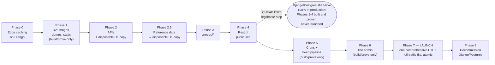

#### 10.1.2 Why this order

| Phase first because | |
|---|---|
| **Phase 0** | It is the only phase that delivers goal 1 (*faster*) with **no migration risk at all**, and it is worth doing even if the migration is then abandoned. Cloudflare does not cache HTML by default, so the 9–11M/month food bank page views are origin-served today. It also forces the 22-language cache-invalidation problem to be solved *while Django is still there to debug it*, so every later phase inherits a working design instead of inventing one mid-flight. |
| **Phase 1** | The only substantial work with **zero database dependency**. Key R2 objects by the URL path itself (`photos/needs/at/<slug>/photo.jpg`) and the image routes are `env.PHOTOS.get(url.pathname.slice(1))` — no lookup, no D1. That makes it a pure proof of the route mechanism, the deploy pipeline and the parity harness on a surface where the worst failure is a missing image. |
| **Phase 2 (APIs before HTML)** | Smallest surface (1,816 LOC across gfapi1/2/3) with the *sharpest* test: byte-equality is pass/fail, no judgement. If reproducing `dicttoxml` + `minidom.toprettyxml` and PyYAML proves intractable, you learn it on 1,816 lines rather than 37,700. It also exercises the real D1 copy-and-query mechanism end to end under real load, on the smallest possible surface — see §10.2.2. |
| **Phase 2.5** | `Postcode` (1.79M rows, exactly one reader at `givefood/views.py:1569`) and `Place` (253,584 rows) are immutable reference data refreshed by management commands — they move with **no sync, no write path, no consistency question**, independent of whatever Phase 2 copied. Moving them forces an early answer to the FTS5-trigram autocomplete question, the hardest single query in the codebase, and takes ~618 MB out of Postgres. |
| **Phase 3** | That is where the traffic is. Everything else public is rounding error beside `/needs/`. |
| **Phase 4** | Content pages and dashboards: low risk, moderate volume, and it is the last thing needed before the *cheap exit*. |
| **Phase 5** | Crons deliver none of the four goals directly. **But see the swap option below.** Built and tested entirely against the disposable D1 copy (§10.1.1a) — needcheck writing new needs during the build never touches production, so there is no write-ownership design to solve before this phase starts, only the pipeline logic itself. |
| **Phase 6** | The admin, as instructed — last, but genuinely planned, with real work packages and real acceptance criteria (§10.2.7). It is a precondition of the Postgres decommission, and the highest-volume write surface in the app — which is exactly why it stays build-and-test-only against the disposable copy the longest, with the review queue (the most-used group) getting the most build/QA time of anything in the plan. |
| **Phase 7** | The single launch (§10.1.1a): one comprehensive extract-transform-load moving everything from Postgres into D1 — not "whatever's left," everything, since nothing before this phase was ever partially migrated — immediately followed by the full traffic flip. This is the one place in the plan where production actually changes. |

**Swap option worth considering with the maintainer.** If the *immediate* worry is the box rather than site speed, swap Phases 4 and 5. `db_worker` runs every minute and needcheck drains ~1,024 django-tasks rows over roughly 3.4 hours; moving those off the box is the single largest load reduction available, and Phase 4 (25–35 pd of content pages) delivers less per day of effort.

#### 10.1.3 D1 is a disposable copy, refreshed as each phase needs it — never authoritative until launch

*(Revised 2026-09-01, folding in the single-launch decision at §10.1.1a. An earlier draft of this section justified reading live Postgres through Hyperdrive as "the mechanism, not a contingency" — the maintainer rejected that design; see §4 and §6 D3. A later draft, after Hyperdrive was dropped but before the single-launch decision, described D1 as being populated "incrementally, as each phase needs it" in a way that implied D1 gradually became more authoritative as the build progressed. That framing is corrected here.)*

A ported route needs a data source to build and test against. The mechanism is: **each phase copies whatever tables its own routes read from Postgres into D1, read-only against the source, as often as useful during the build** (the same discipline as §5's full migration, scoped down and repeatable — see WP 2.2a for the concrete first instance). This copy is disposable: wrong output means delete the rows and re-run the copy, not debug a divergence. There is no live Worker binding to Postgres at any point, in any phase, and — the point the single-launch decision adds — **D1 is never treated as authoritative and never exposed to real end-user or admin traffic before the single launch, no matter how many phases have copied data into it.** Postgres remains the sole source of truth for everything real, for the entire build, regardless of phase number; authority transfers exactly once, at the Phase 7 launch (§10.1.1a), not gradually as tables accumulate in D1.

**What this buys:** one datastore and one query dialect to build against from Phase 2 onward, no second product to configure or later retire, and no dual-binding cache-invalidation scheme to reason about. `cube`/`earthdistance`/`pg_trgm`/`DISTINCT ON` and the five raw-SQL sites are rewritten against D1/SQLite as each phase touches them, rather than kept alive behind Hyperdrive and rewritten once at the end. It also dissolves, by construction, the write-ownership question a live-divergence design would have forced: because nothing built during the build ever receives a real write, there is no "which system owns writes to `foodbankchange` once needcheck is ported" question to answer for Phase 5, no "the admin is the highest-volume write surface" sharpening of it for Phase 6, and no per-table reconciliation design needed before either phase starts. Phase 5's needcheck pipeline and Phase 6's admin are built and fully tested against the disposable copy — real needs keep landing only in Postgres, via Django, until launch.

**What it costs:** the application rewrite and the query rewrite now land together, phase by phase, instead of as two sequential single-variable changes — a real risk the old Hyperdrive-first design was specifically bought to avoid, and one this design still carries (it's a build-order cost, not a data-ownership one, and the single-launch decision doesn't remove it). It also means **goal 2 (resilience) lands earlier and more completely than the Hyperdrive design would have delivered it**: once a route is copied and ported, it no longer depends on the Mythic Beasts box being up at all, not even indirectly through a live database connection — though that resilience benefit, like everything else, only reaches real users at the single launch, not phase by phase. See the corrected Phase 4 assessment below.

#### 10.1.4 The cheap exit

> **Revised 2026-08-30, following the single-cutover decision (§10.1.1a).** Under the old incremental-widening model, "stopping after Phase 4" meant the public site and all three APIs were *already live* on `www.givefood.org.uk` by that point, each widened and proven separately. Under the single-cutover model, nothing is live on the production domain until the one cutover happens. "Stopping after Phase 4" now means: **Phases 1–4 are built and fully proven against the proving-ground host, the single cutover moves that much of the domain over, and Phases 5–8 are never built at all.** The exit is still cheap, and the description of what you'd have below still holds — read it as "proven and ready to cut over," not "already in production," everywhere it says "on Cloudflare."

**Stopping after Phase 4 is a good outcome, not a failure.** You would have the entire public site and all three APIs proven and ready to cut over to Cloudflare; images, dumps and static assets on R2; edge-cached HTML with working tag invalidation; ~3.9 GB out of a 5 GB database ready to move; and one small Django box that, after the cutover, serves only `/admin/`, `/dashboard/`, `/write/` and the crons.

Against the four goals, once that cutover happens: **faster — fully delivered. Resilient — better than the Hyperdrive design would have had it at this point:** every ported route (the whole public site and all three APIs) reads D1, not a live connection to the box, so it survives a box outage outright, not just from cache — only `/admin/`, `/dashboard/`, `/write/` and the crons still depend on the box being up. **Quicker deploys — yes for everything ported. Simple — one Django app on one box with a Workers front end.**

Phases 5–8 are ~60% of the remaining effort and buy the Postgres decommission and the last of goal 2. For a two-person charity that may not be worth it. **Build the plan so that stopping at Phase 4 — and cutting over what's built at that point — is a decision, not a defeat.**

---

### 10.2 Work breakdown

Estimates are person-days, bottom-up. They deliberately do **not** sum the nine subsystem surveys, which were produced independently and double-count shared infrastructure (the base template, i18n, geo and the model layer each appear in three or more).

#### 10.2.0 Phase 0 — Edge caching and groundwork · **10–14 pd**

| WP | Task | Depends | Acceptance criteria | pd |
|---|---|---|---|---|
| **0.0** | **Set-Cookie audit.** Confirm public HTML responses carry no `Set-Cookie`. `SessionMiddleware` and `MessageMiddleware` are both active (`givefood/settings.py:96,98`); a `Set-Cookie` on a cached path makes the response uncacheable to Cloudflare *and* the Cache API, silently nullifying the whole phase. | — | `curl -sI https://www.givefood.org.uk/needs/at/<slug>/ \| grep -i set-cookie` returns nothing, for 10 sampled public URLs including `/`, `/needs/`, a food bank page and `/cy/needs/at/<slug>/`. | 0.25 |
| **0.1** | Cache Rules: HTML, sitemaps, geojson, static, images. TTLs matching `givefood/const/cache_times.py`. **Explicit override TTL for `/needs/at/<slug>/`** — its `@cache_page` is commented out at `gfwfbn/views.py:362`, so it emits no `Cache-Control` and a "respect origin" rule would do nothing for the highest-traffic page family on the site. | 0.0 | Second request to a food bank page returns `cf-cache-status: HIT`. Origin RPS for `/needs/at/*` drops measurably in Cloudflare Analytics. | 2 |
| **0.2** | **`Cache-Tag` middleware** in Django emitting `fb-<slug>, needs-index, lang-<code>` — with the language **deliberately excluded** from the food-bank tag. | 0.1 | Purging tag `fb-<slug>` flips `cf-cache-status` from HIT to MISS on **all 21** language variants plus `/md/needs/at/<slug>/`. | 2 |
| **0.3** | Rewrite `decache()` (`givefood/utils/cache.py:156`) to purge by tag. Fix `url_limit = 30` at line 183 — the documented cap is **100** operations per request. | 0.2 | A full 3,000-food-bank rebuild is ≤30 API calls, not ~900. `decache()` call-site signatures unchanged. | 1.5 |
| **0.4** | **`/cdn-cgi/image/` × Worker-route spike** (§10.2.9, Q4). | — | Written yes/no, with the topology tested. | 0.5 |
| **0.5** | **API language decision, then API Cache Rules.** `gfapi2/views.py:85,508` emit `full_name()`, which branches on `get_language()` (`givefood/models/foodbank.py:261-279`). The API is mounted outside `i18n_patterns`, so Cloudflare — which honours `Vary` only for `Accept-Encoding` — would cache one language's rendering globally for up to a **month** (`@cache_page(SECONDS_IN_MONTH)` on `locations()`). **Do not enable API Cache Rules until this is decided.** Recommended: pin the API to English with an unconditional `translation.activate("en")` in the API views. | 0.1 | `curl -H 'Accept-Language: cy' /api/2/foodbanks/` and `-H 'Accept-Language: en'` return identical bodies. Only then add the API Cache Rule. | 1.5 |
| **0.6** | Verify the two pending `django_tasks_database` migrations. *(The data-migration work found nothing pending as of 2026-08-29 — `givefood` 0001–0012 and `django_tasks_database` 0001–0019 all applied. Confirm again before Phase 7.)* | — | `manage.py showmigrations` clean; `manage.py checkschema --preflight` clean. | 0.5 |
| **0.7** | AI Gateway in front of OpenRouter — two lines in `givefood/utils/ai.py:142`. | — | Need-check calls appear in the AI Gateway dashboard with token and cost data. **A cost and failure-rate baseline exists to migrate against.** | 0.5 |
| **0.8** | **D1 feasibility spike** (§10.2.9, Q1–Q3). | — | Three written yes/no answers. | 3 |
| **0.9** | ~~Hyperdrive prerequisite check~~ — dropped, no Hyperdrive at any point (§4, §6 D3, §10.1.3). Phase 0 itself is not being executed; kept here only so this table doesn't silently disagree with the rest of the plan. | — | — | 0 |
| **0.10** | Cloudflare Notifications: 5xx rate, origin availability. | — | A deliberate origin 500 alerts within 5 minutes. | 0.5 |
| **0.11** | **Confirm the real needcheck schedule** against the Coolify scheduled-task config. `docs/crons.md` says `45 7,11,15,19 * * *` (4×/day); production `givefood_crawlset` shows one `need` set per day at ~15:00 UTC. Fix `docs/crons.md`. | — | The Coolify config is recorded in the plan and the doc matches it. | 0.25 |
| **0.12** | Delete confirmed dead code: `givefood/const/{topplaces,parlcon_mp,parlcon_party,item_classes}.py` (~70 KB, zero importers). Route `/favicon.ico` to the existing `givefood/static/img/favicon.ico` — currently unrouted, so under a catch-all Worker route every browser request for it becomes a billed 404. | — | `grep -rn "topplaces\|parlcon_mp\|parlcon_party\|item_classes" --include="*.py" .` returns only the README. `/favicon.ico` returns 200. | 0.5 |

> **Phase 0 delivers goal 1 on its own, on Django, for ~2 weeks of work and no new spend.** Say that to the maintainer explicitly, because it makes everything after it an *optional purchase of goal 2*, not a continuation.

#### 10.2.1 Phase 1 — R2: images, dumps, static · **18–24 pd**

The image surface is larger than the three photo routes. From `gfwfbn/urls/generic.py`:

| Route family | URLs | Current behaviour | Why it needs R2 |
|---|---:|---|---|
| `at/<slug>/photo.jpg` + location + donationpoint | 7,117 | `PlacePhoto.blob` from Postgres, `@cache_page(WEEK)` | 1,700 MB of TOAST |
| `at/<slug>/map.png`, `maps/<size>.png` + location variants | **9,135** | **Live Google Static Maps proxy**, `gfwfbn/views.py:485`, no persistence | `og:image` on 7 page types |
| `at/<slug>/favicon.png` + donationpoint | ~6,800 | Live `google.com/s2/favicons` fetch per miss, `gfwfbn/views.py:508` | 5 per homepage render |
| `at/<slug>/screenshots/(homepage\|shoppinglist\|donationpoints\|contacts\|locations).png` | **5,355** | **Live Browser Rendering call**, `waitUntil: networkidle0`, `timeout: 45000` | 45s blocking, billed |

**The map/favicon/screenshot routes are a defect in the earlier drafts of this plan, not an oversight to note later.** They have no model, no storage and no work package, and they interact badly with goal 3: the Workers Cache key includes the **Worker version**, so every deploy cold-starts these caches, and more frequent deploys directly increase billed Google Static Maps and Browser Rendering calls. Precomputing them into R2 at Phase 1 removes that coupling entirely.

| WP | Task | Depends | Acceptance criteria | pd |
|---|---|---|---|---|
| 1.1 | R2 buckets. Backfill 7,117 PlacePhoto blobs **keyed by URL path**, with 320/640/1080 derivatives generated at ingest. Store `html_attributions` in `customMetadata`. | 0.4 | Object count = 7,117 × 3. Every `place_id` with `place_has_photo` resolves. **Note:** `html_attributions` is the empty string in all 7,117 rows — carry the column, but do not claim the migration preserves an attribution behaviour that does not currently exist. Raise it with the maintainer as a pre-existing Google Places compliance question. | 3 |
| 1.2 | Photo route in the `givefood` Worker. Workers Cache (`compatibility_date >= 2026-07-21`, `"cache": {"enabled": true}`), `onlyIf` for 304s, `?size=` normalised to the allowlist. | 1.1 | Byte-identical JPEG for 200 sampled photos. `/cdn-cgi/image/width=150,format=avif` prefix still resolves (**gated on the 0.4 spike**). 404 when `place_has_photo` is false. | 3 |
| 1.3 | **Precompute all 9,135 map PNGs into R2**, keyed by path, rebuilt on Foodbank/Location save via the existing `decache_async` hook. Same for ~6,800 favicons and 5,355 screenshots, generated by a Queue consumer. | 1.1 | No Google Static Maps or Browser Rendering call on any request path. `og:image` URLs unchanged and returning the same bytes. | 5 |
| 1.4 | Dumps → R2 + `dumps.givefood.org.uk` custom domain, **gzipped before PUT** (`SUM(size)` is ~9.4 GB uncompressed held in 1,474 MB — TOAST is doing ~6.4× that R2 will not). **Cache Rule marking CSV/JSON/XML cache-eligible** — they are not default-cacheable. Smart Tiered Cache on. | — | `latest.<ext>` and dated objects served with `Content-Disposition: attachment; filename="<type>-<YYYYMMDD>.<fmt>"` exactly as `Dump.file_name()` produces. | 2 |
| 1.5 | Redirect layer: `/dumps/<t>/<f>/latest/` → **302**; `/dumps/<t>/<f>/<Y>-<M>-<D>/` → **301**, normalising non-zero-padded dates (`/2026-8-9/` is a valid live URL — the Django pattern is three separate `<int:>` converters). Django keeps the three listing pages. | 1.4 | All 24 download URLs redirect, none 404. Both `/2026-08-09/` and `/2026-8-9/` resolve. | 2 |
| 1.6 | Static assets → Workers Assets, `html_handling: "none"`, `not_found_handling: "none"`. Content hashing; keep old unhashed paths aliased (they carry `max-age=31536000`). `img/ar/**` (27 MB incl. an 11 MB mp4) and `img/appscreenshots/**` → R2 with Range passthrough. Bundle `givefood/data/bank-holidays.json` (22 KB, read at module import by `givefood/models/foodbank.py:43-52`, on a request path). Move `places.csv` (61 MB), `parlcon/` (27 MB), `2024-candidates.csv`, `sa_locations.csv`, `2024_mps.csv`, `mp_twitter.csv` to an R2 ops bucket. Make `london_postcodes.txt` (1 KB, CWD-relative read per gfdash cache miss) a module constant. | — | Every current `/static/*` URL still 200s. Annual report mp4 streams with Range support. | 3 |
| 1.7 | **Parity harness v1 + the bootstrap run** (§10.4.3). | — | **Django-vs-Django produces zero diffs.** | 3 |

**Sequencing hazard, explicitly:** `place_has_photo` is a denormalised boolean written inside `save()` (`givefood/models/foodbank.py:663`, `:964`, `:1284`) by querying the `PlacePhoto` table, and read as the cheap 404 gate. Do **not** drop the blob column in the same deploy as the code that stops reading it. Three deploys: (1) backfill R2; (2) deploy Django reading R2 with a DB fallback and no longer deriving `place_has_photo` from the blob table; (3) verify for a week; (4) drop the column.

#### 10.2.2 Phase 2 — APIs on Workers + D1 · **30–41 pd** *(revised: Hyperdrive dropped, data copy folded in)*

> **Revised 2026-08-30.** The maintainer rejected the Hyperdrive-behind-Postgres interim this phase was originally built around (§4, §6 D3): no live Worker read path to Postgres, ever. Instead the ~15 queries these APIs need are copied to D1 as the first work package below, and the data-access layer is written against D1 from day one. This removes WP 2.2's two-binding Hyperdrive layer and the `DISTINCT ON` → window-function rewrite it deferred, and adds a real extraction/load work package in its place — net **+2 to +3 pd**, not a wash, because the copy has to be built and verified now rather than assumed away by a live connection. It also removes the later "swap Hyperdrive for D1" work (old WP 7.3) entirely, which is where the pd this phase gained get paid back across the whole project. See the callout after §10.2.3 (closed out 2026-09-01) for how the no-Hyperdrive and single-launch decisions together resolve Phases 3–8's design — Phase 2 and 2.5 were the first rebuilt against it; Phases 3–8's own tables now reflect it too.

| WP | Task | Depends | Acceptance criteria | pd |
|---|---|---|---|---|
| 2.1 | Monorepo skeleton, Hono router, `wrangler types` committed, Workers Builds root-directory + watch-path wiring. | — | `pnpm dev` runs. A change under `packages/templates` does not rebuild the API routes. | 3 |
| **2.2a** | **Extract the 5 tables the API actually reads** (`foodbank`, `foodbanklocation`, `foodbankdonationpoint`, `foodbankchange`, `parliamentaryconstituency` — traced through every gfapi1/2/3 view and the model methods they call; `foodbankchangeline`, `foodbankchangetranslation` and `charityyear` are **not** read by any endpoint, an earlier draft of this row assumed they were) from Postgres, transform to the D1 DDL (§4.6), load into the `givefood` D1 database. Read-only against Postgres throughout; Postgres is untouched and stays authoritative. | 2.1 | Row counts match source exactly, table by table. A spot-checksum (10 sampled rows/table, full-column MD5) matches. | 4 |
| 2.2b | D1 query layer (`packages/db`) implementing the same ~15 queries directly in D1 SQL, **through the Sessions API** (`env.DB.withSession()`, bookmark propagated) — this database has read replication enabled; see §3.3's note. Includes the `DISTINCT ON` → window-function rewrite Postgres's dialect no longer forces. | 2.2a | Results match Django ORM output for a fixed fixture set. | 3 |
| **2.3** | **The serialisation package.** See the detail below — this is the highest-risk WP in the plan and it is bigger than earlier drafts allowed. | 2.1 | Byte-identical against golden files for all 20 endpoints × every allowed format. | **10** |
| 2.4 | The 20 endpoint handlers, **dual-mounted at `/api/*` and `/api/2/*`** (every gfapi2 route is live at both; only the `/api/2/` forms are in the current purge list, so the `/api/` aliases have been going stale to TTL). Preserve the frozen bugs: location `politics.mp_parl_id` carrying the *food bank's* value (`gfapi2/views.py:178`); constituency location entries producing 404ing `/api/2/foodbank/<location-slug>/` URLs; the 500-not-400 responses on malformed `lat_lng`. | 2.2b, 2.3 | Strict parity green across the whole API corpus. | 6 |
| 2.5 | In-memory haversine replacing earthdistance for the search endpoints. **`R = 6378168`** to match `earth_distance()` on `/api/2/*`; **`R = 6367000`** on `/api/1/foodbanks/search/` to match the Python haversine at `givefood/utils/geo.py:493`. The two APIs have differed by 0.175% for years and consumers may diff them. | 2.2b | `distance_m` matches production **to the integer**, and result ordering matches, across 200 sampled coordinates. | 4 |
| 2.6 | *(Revised 2026-08-30 — see §10.1.1a: no per-phase production cutover anymore, one single domain-wide cutover later.)* **Cutover-readiness check**, not a route cutover: prove `/api/2/*`, `/api/*`, `/api/1/`, `/api/3/` strict-parity green against the proving-ground host. Nothing moves on `www.givefood.org.uk` yet. | 2.4 | Full corpus green against the proving-ground host, in one run — not staged, not widened. | 1 |
| 2.7 | The three documentation pages (`/api/1/`, `/api/2/`, `/api/2/docs/` + `api2.js` + 8 method tables). | 2.1 | `#hash` deep links resolve; live XHR preview works. | 3 |

**WP 2.2a is a live-data copy, one-off per run, not the final migration.** It uses the same read-only discipline as §5's full data migration (parse `.env` in Python rather than sourcing it in zsh — a value contains an unbalanced quote; `PGOPTIONS='-c default_transaction_read_only=on'`) and the same extraction mechanism, just scoped to the tables this phase's endpoints read. **Re-run it before Phase 2.6's route cutover** to pick up anything written to Postgres since the initial copy — Django is still the origin for every unported route, including the admin, so writes to these tables continue throughout Phase 2. This copy is disposable and idempotent: if it's wrong, delete the rows and re-run it, because Postgres is still the source of truth.

**WP 2.3 in detail — five serialisers, not three.** Earlier drafts named JSON, XML, YAML. The measured reality:

| Concern | The trap |
|---|---|
| **Python float** | `json.dumps(1.0)` → `1.0`; `JSON.stringify(1.0)` → `1`. `distance_mi` is `round(miles(...), 2)` — a float — at `gfapi2/views.py:415`, `:570`, `:725`. Searching from a food bank's own coordinates (which `/needs/at/<slug>/nearby/` does) yields `distance_mi: 0.0`. Python also switches to exponential at ≥1e16 and <1e-4 (`1e+16`, `1e-05`); JS at 1e21 and 1e-7. **Needs a Float wrapper type or a field allowlist plus a custom stringifier.** The same defect hits `/needs/geo.json`, where coordinates are rounded to 4dp/6dp — `round(51.0, 4)` is `51.0` in Python and `51` in JS, and the UK straddles 0.0 longitude. |
| **JSON** | 2-space indent, `ensure_ascii=True` (every non-ASCII escaped — real for Welsh and Gaelic names), datetimes as `YYYY-MM-DDTHH:mm:ss.SSS` with **no** `Z` (`USE_TZ=False`, so `Date#toISOString` is wrong). |
| **XML** | Header exactly `<?xml version="1.0" ?>` — the encoding attribute is dropped by dicttoxml's parse/re-emit round trip. **Tab** indentation. The singular-name map, **including the literal `<None>` elements** on `/api/2/donationpoints/search/?format=xml` (`xml_item_name` has no `donationpoints` entry — this is live shipped output and reproducing it is deliberate). Empty and null values emit **self-closing with no space**: `<html/>`, not `<html></html>`. Newlines inside text content are emitted **raw and not re-indented** — `<needs>Beans\nPasta</needs>` — because minidom's pretty-printer does not touch text nodes, and every need field contains newlines. |
| **YAML** | **The hardest of the three, and js-yaml cannot be configured into it.** PyYAML emits multiline need text as a *single-quoted folded scalar*: `needs: 'Beans\n\n    Pasta'` — each embedded newline becomes a blank line plus continuation indent. js-yaml produces either a literal block (`needs: \|-`) or a double-quoted scalar. Keys are sorted (`sort_keys` defaults True). |
| **CSV — two dialects** | `gfapi1/views.py:62` uses `unicodecsv.writer` with the **default** dialect (`QUOTE_MINIMAL`): `None` and `''` both render as a bare empty field, `True`/`False` as capitalised bare words. `gfdumps/management/commands/dump.py:434,486,544,596` use **`QUOTE_ALL`**: `None` → `""`, `True` → `"True"`. Both `\r\n`. |

**Escalation path for YAML, agreed in advance:** measure YAML traffic through AI Gateway / Cloudflare Analytics during Phase 0. If it is negligible, take the decision to the maintainer *before* Phase 2 starts — "YAML moves to structural rather than byte parity" — rather than discovering it mid-phase, where it is a plausible trigger for kill criterion K2.

> **Resolved 2026-08-30.** The measurement was never run — no production log access was available at WP 2.3 start. Rather than guess at byte parity's value blind, the maintainer took the decision directly: YAML is structural parity (same keys, sorted; same values; valid YAML; multiline strings as a `|-` block literal rather than PyYAML's folded-scalar style). JSON, XML and CSV are unaffected and remain byte-exact, per K2's own reasoning about API consumers with no version negotiation — verified against the real pinned libraries, not just the plan text. See `packages/serialise/src/pyyaml.ts`.

**Parity exclusions, and why:** `/api/2/docs/` uses `order_by('?')[:5]` (non-deterministic) and `/api/2/` shows a dumps table that changes daily. Both go to structural comparison. Send a **fixed `Accept-Language: en`** on all API parity requests, and test `Accept-Language: cy` separately — assuming WP 0.5 did not already pin the API to English.

#### 10.2.3 Phase 2.5 — Reference data to D1 · **11–15 pd**

| WP | Task | Depends | Acceptance criteria | pd |
|---|---|---|---|---|
| 2.5.1 | Trimmed `postcode` table: `WITHOUT ROWID` on `postcode_normalized` so the PK **is** the prefix index; `postcode` as a VIRTUAL generated column (verified reconstructable for 1,795,944 / 1,795,944 rows). **Confirm the trim with the maintainer.** | 0.8 | Prefix scan under 5 ms. Row count 1,795,944. Measured: 80 MB + 30 MB index, down from 457 MB. | 3 |
| 2.5.2 | `place` in D1 + FTS5 `tokenize='trigram'` for the substring pass, plain index on the folded name for the prefix pass. | 0.8 | See the benchmark and the criterion correction below. | 4 |
| 2.5.3 | `/aac/` route. Preserve `{"n","l","t","c"}`, `Access-Control-Allow-Origin: *`, 20-result cap, 2-char floor, 3-char substring floor. **Two hard requirements**, not notes. | 2.5.1–2 | See below. | 2.5 |
| 2.5.4 | Constituency + location `boundary_geojson` → R2, gzipped. | — | All 650 constituency boundaries served; **assert count = 650 after load**. | 2 |
| 2.5.5 | Places sitemap: replace `OFFSET 250000` (measured **424.95 ms mean**, the slowest geographic query on the site) with keyset pagination, or pre-generate the 26 pages to R2 on a cron. | 2.5.2 | 26 pages served; no deep `OFFSET`. | 1.5 |

**Correction: the 1 MB row-limit claim was wrong.** D1's maximum string/BLOB/row size is **2,000,000 bytes (2 MB)**, not 1 MB. The three largest constituency boundaries — Argyll, Bute and South Lochaber (1,605,556 B), Na h-Eileanan an Iar (1,459,164 B), Orkney and Shetland (1,419,845 B) — **all fit**. Moving boundaries to R2 is still right, but on the real grounds: SQLite does not compress, so 18 MB of Postgres TOAST becomes ~27 MB raw, and a megabyte-class TEXT column travels with every `SELECT *` on a 650-row table. The go/no-go item is a completeness check, not a data-loss guard.

**Two hard requirements on WP 2.5.3 that earlier drafts left as passing notes:**

1. **FTS5 phrase-quoting must replace `_like_escape()`.** Bound parameters do **not** protect against FTS5 query-expression syntax. Reproduced against a real 253,584-row trigram index: `q=king's` → `fts5: syntax error near "'"`; `q=-yn-` → `no such column: yn`. Production returns 228 and 9 matches respectively. The names are not exotic — King's Lynn, Bishop's Stortford, Llanfair-yn-neubwll. The fix, verified to restore exact LIKE-equivalence:

   ```ts
   // packages/db/aac.ts — successor to givefood/views.py:1475 _like_escape()
   const ftsPhrase = (q: string) => '"' + q.replace(/"/g, '""') + '"';
   // king's → 228 = 228 ✓   -yn- → 9 = 9 ✓   'a OR b' → 0 = 0 ✓   '"' → 0 = 0 ✓
   ```

2. **A 50-byte length guard.** D1 caps LIKE/GLOB patterns at 50 bytes. Both the prefix pass and the `NOT LIKE` exclusion take user input, on an endpoint that is public, uncredentialed and CORS-open. Reject over-length queries with an empty array, matching the sub-2-char behaviour.

**Correction to the acceptance criterion.** "Rows read per keystroke <500" is not achievable and would be quietly waived. Measured on the real dataset with the intended query shape: `q=ton` yields 14,123 candidate rows, `ing` 9,278, `and` 5,961, `mon` 3,876. That is 20× better than the 253,584-row scan a naive `LIKE` port would do, and latency is fine (6.92 ms worst case locally), but it is 28× the stated number. **Restate as:** *no `EXPLAIN QUERY PLAN` shows `SCAN` over `place`; p95 under 30 ms; worst-case candidate set under 20,000 rows*, benchmarked on `ton`, `ing`, `and` — not on `st`, which is two characters and never reaches the substring pass.

**The folding contradiction must be resolved before the harness is configured.** SQLite's `upper()` is ASCII-only (`upper('môn')` → `'MôN'`) while Postgres `UPPER()` is Unicode-aware, and 8,442 of 253,584 place names are non-ASCII. Adding a folded `name_fold` column makes `mon` find `Ynys-Môn` — a real improvement for Welsh and Gaelic on a site that serves Welsh as a first-class language, but a **behaviour change**, and measurably so: folded vs unfolded substring counts are `mon` 3876 vs 3872, `dwr` 54 vs 39, `ia` 2399 vs 2371. **Pick one before Phase 2.5 starts:** either keep `/aac/` in STRICT parity and do not fold (accepting the regression), or fold and move `/aac/` to structural comparison with an allowlist of queries expected to differ. What you cannot do is both, which is what the earlier drafts specified.

---

> ### ✅ Re-plan closed out 2026-09-01: the write-ownership question is dissolved, not answered
>
> This callout originally flagged that two maintainer decisions — **no Hyperdrive, ever** (§4, §6 D3) and **one single domain-wide traffic cutover, not staged per-phase widening** (§10.1.1a, as it stood 2026-08-30) — had landed without being threaded through Phases 3–8, and that Phase 5 onward had a genuinely unresolved problem: once `needcheck` writes new needs, wouldn't D1 and Postgres start diverging, with no design for which system owns writes to a table like `foodbankchange` once its pipeline is ported?
>
> **A third decision, made 2026-09-01 (§10.1.1a, current text), answers that by removing the premise.** D1 never diverges from Postgres during the build, because D1 is never live. Every phase — including Phase 5's needcheck pipeline and Phase 6's admin — is built and tested entirely against a disposable, refreshable copy of production data; real needs, real admin edits, real subscriber actions all keep landing exclusively in Postgres, via Django, all the way through the build. There is no per-table write-ownership boundary to design, because there is no split to resolve: Postgres is the sole write target for anything real until the single Phase 7 launch, at which point one comprehensive extract-transform-load moves everything and all traffic flips at once. The "real remaining open question" this callout named is closed, not merely deferred.
>
> What's left from the original callout, still worth tracking:
>
> - **Phases 3 and 4** (`/needs/`, rest of the public site) mostly read the same core tables Phase 2.2a already copied (`foodbank`, `foodbankchange`, `foodbanklocation`, `foodbankdonationpoint`). Their data dependency is likely *smaller* than currently scoped, not larger — re-derive each phase's WP 1 ("data access") against what's already in the disposable D1 copy before assuming a fresh copy is needed. A handful of additional tables (e.g. `foodbankarticle` for `/news/`) still need their own WP 2.2a-shaped copy. Their "route cutover" work packages (WP 2.6, WP 3.8, and WP 4.9, which hadn't yet been updated to match) all now read as cutover-*readiness* checks — parity against the proving-ground host, nothing moving in production — not staged widening. See §10.1.1a.
> - **Phase 7** ("D1 cutover", 14–20 pd) is no longer "shrinks because most tables are already resident" — that framing assumed incremental data residency was itself the goal. Under the current model Phase 7 **is** the single launch: one comprehensive ETL capturing everything (not a delta of leftovers), immediately followed by the full traffic flip. Its pd estimate needs re-deriving against that shape (see §10.2.6a) rather than carried forward from either the Hyperdrive-first draft or the "most tables resident" draft.
> - **The rollback story is simpler now, not harder.** The old worry ("each phase from 5 onward needs its own answer to what happens to a write that landed only in D1") doesn't apply, because no phase before Phase 7 ever lands a real write in D1 at all. §11 risk B5 has been rewritten accordingly (§11.1) — the only rollback that exists is pre-launch ("don't launch yet," free) and post-launch (moving the domain back, with Postgres frozen at the launch moment as the fallback — see §10.10).
>
> Phases 2–4 remain safe to build exactly as scoped; they were always read-only against the disposable copy. Phases 5 and 6 no longer carry a blocking design question either — build them the same way.

#### 10.2.4 Phase 3 — `/needs/` · **32–44 pd**

| WP | Task | Depends | Acceptance criteria | pd |
|---|---|---|---|---|
| 3.1 | **Base template + templating.** `public/page.html` is extended by 70+ templates across seven apps — get it right once and freeze it. Precompiled Nunjucks importing `nunjucks/browser/nunjucks-slim` (**no compiler in the bundle**). | 2.1 | Transpiler converts ``/``/``/``/`` verbatim. Tolerant parity green on the base layout. **Lint rule** forbidding `import nunjucks` — the full package reaches `new Function` and throws `EvalError` at *runtime*, invisible to any test that mocks the renderer. | 6 |
| 3.2 | *(Revised 2026-08-30 — see §2.7.1: 4 languages, not 21.)* i18n: `.po` → per-locale JSON at build time; `` Nunjucks extension preserving `%(name)s` semantics so **the `cy`/`ga`/`gd` catalogues work unmodified** (the other 17 are dropped, not just deferred). Lazy `import()` per locale still applies even at this size — no reason to eagerly load all 3. | 3.1 | All 285 msgids × 3 locales (`cy`, `ga`, `gd`) resolve; missing and fuzzy entries fall through to the msgid, matching gettext. | 2 |
| 3.3 | Language-prefix router reproducing `i18n_patterns(prefix_default_language=False)` **exactly**: prefix wins and is the only signal; no prefix ⇒ hard `en`; **`/en/` 404s**; `Vary: Accept-Language` present only when no prefix matched. | 3.2 | The seven live-verified header cases pass as a pinned test. | 2 |
| 3.4 | 29 i18n page routes + 12 generic + 8 markdown. `APPEND_SLASH` as an explicit `notFound` retry (`html_handling: "force-trailing-slash"` affects **asset lookups only**, not Worker routes — reaching for it will appear to work on `/static/` and do nothing for 3,000 food bank URLs). | 3.1–3.3 | Tolerant parity across 50 stratified food banks × 8 page types × 3 languages. | 8 |
| 3.5 | Nearest-search: in-memory haversine over the ~8,721-point index (285 KB CSV / ~113 KB packed) in module scope, rebuilt on write. | 2.5 | Ordering and `distance_m` match across 200 postcodes — **with the documented divergence below**. | 4 |
| 3.6 | `/needs/geo.json` + three scoped variants precomputed to R2 on write. Preserve `f`/`l`/`lb`/`d`/`b` type codes and the 4dp/6dp precision split — **and the float formatting** (see WP 2.3). | 3.5 | Byte-comparable GeoJSON; `wfbn.js` layer filters unchanged. | 3 |
| 3.7 | Hit beacon → Analytics Engine (§10.7.3). Subscribe/confirm/unsubscribe **including the bare-200 POST for RFC 8058 one-click**. Webpush + mobsub (shipped app contract, keyed on `Foodbank.uuid`). | 3.4 | One-click unsubscribe returns 200 with an empty body. `/needs/mobsub/` returns `{"success": true}`. | 4 |
| 3.8 | *(Revised 2026-08-30 — see §10.1.1a: no per-phase production cutover, one single domain-wide cutover later.)* **Cutover-readiness check**, not a route cutover: prove `/needs/at/place/*`, `/needs/at/*`, `/needs/*` tolerant-parity green against the proving-ground host. Nothing moves on `www.givefood.org.uk` yet. | 3.4–3.7 | Full corpus green against the proving-ground host, in one run — not staged, not widened. | 1 |

**Documented divergence on `/nearby/`.** `find_locations()` (`givefood/utils/geo.py:246-301`) issues two independent queries, each `ORDER BY NearestFirst` (chord) `LIMIT quantity`, then chains, re-sorts by great-circle and slices. `quantity = quantity + 1` for `skip_first` happens *after* the querysets are sliced, so both legs are always `LIMIT 20`. For `skip_first=True` the return is `[1:21]` — global ranks 1..20 — and rank 20 is only guaranteed present if neither leg alone fills 0..19. A food bank with 20+ clustered locations (routine for Trussell) makes the location leg fill 0..19, so the true rank-20 item is that leg's rank 20, never fetched. A global in-memory top-21 scan returns the correct item and therefore **differs**. Decide explicitly: emulate two-leg-limit-then-merge to reproduce production, or do a global scan and add `/needs/at/<slug>/nearby/` and `/md/needs/at/<slug>/nearby/` to a documented known-divergence list. Do not let the team burn days treating a fix as a regression.

Two adjacent geo items to check before porting: `find_donationpoints` applies its optional `foodbank=` filter **after** slicing (`geo.py:435-437`), which in Django raises `TypeError` on a sliced queryset — so that path is dead or broken today; and `find_locations_by_category` materialises an unbounded id list into `foodbank_id__in=[...]` (`geo.py:347-360`), which on D1 hits the hard **100-bound-parameter cap** for any category matching more than ~100 food banks.

**Known bugs to decide on, not discover:** `SlugRedirectMiddleware`'s `^(/[a-z]{2})?` regex (`givefood/middleware.py:171`) cannot match `/zh-hans/` or `/tlh/`, so renamed food banks 404 in exactly those two languages today. `foodbank_location` has two stacked `@cache_page` decorators (`gfwfbn/views.py:833,836`) advertising a 7-day max-age. `/needs/in/constituency/` redirects to `/in/constituencies/` — a 404 (`gfwfbn/urls/i18n.py:44`). Reproduce or fix, but write the decision down.

#### 10.2.5 Phase 4 — Rest of the public site · **26–36 pd**

| WP | Task | pd |
|---|---|---|
| 4.1 | 17 content pages + 3 error pages (12 are static behind week-long caches) | 5 |
| 4.2 | Sitemaps × 21 languages, robots.txt (43 `Sitemap:` directives), llms.txt (fix the "and YAML exports" claim — no YAML dump has ever existed — and the hardcoded `{{domain}}/dumps/` link), manifest × 21, `/sw.js` as a **real static file** (its content is entirely static despite being generated by `givefood/views.py:1252`), security.txt | 4 |
| 4.3 | `/md/` markdown mirror — **whitespace-sensitive**, advertised to LLM crawlers; needs byte-comparison golden tests | 3 |
| 4.4 | `frag/` redesign. Fired **twice per page load site-wide** from `public/page.html:61-62` plus every 130s via `csi.js`'s `setInterval`; `need-hits` aggregates `SUM(hits)` over 709,644 rows **uncached** on every call. Precompute `last-updated` and `need-hits` into KV on a 5-minute cron; `ip-address` stays uncached, reading `CF-Connecting-IP` | 2 | 
| 4.5 | 20 gfdash dashboards. Rewrite `to_char`→`strftime` and `~*`→`LIKE` (both patterns at `gfdash/views.py:385` are plain literals). Precompute the `beautybanks` OR-chain — the query most likely to hit a D1 statement-depth limit | 6 |
| 4.6 | gfwrite 5 routes **plus the security work that must land with it**: Turnstile on both forms, a WAF rate-limit rule on the send path, real CSRF. Today `POST /write/to/<slug>/email/send/` has none of these and relays attacker-controlled `subject`/`body`/`Cc` from `mail@givefood.org.uk` to a sitting MP | 5 |
| 4.7 | Forms + `/human/` Turnstile interstitial + Postmark; hand-write the 6 `django-bulma` forms | 3 |
| 4.8 | WhatsApp webhook → Worker, **adding `X-Hub-Signature-256` verification** that does not exist today | 2 |
| 4.9 | *(Revised 2026-09-01 — see §10.1.1a: no per-phase production cutover, one single launch later.)* **Cutover-readiness check**, not a route cutover: prove the whole public site's catch-all route strict/tolerant-parity green against the proving-ground host. Nothing moves on `www.givefood.org.uk` yet. | 1 |

**Consider as part of 4.2, and raise with the maintainer:** `robots.txt` advertises **43 sitemaps** (21 languages × 2, plus `/md/sitemap.xml`), and `sitemap_places_index` emits 26 child sitemaps × 10,000 place URLs **per language** — 22 × 26 × 10,000 = **5,578,848 advertised place URLs**, each of which runs four KNN searches when crawled. Trimming the place sitemap to English-only is a one-line change that cuts the advertised crawl surface by 95% (5.58M → 254k). Given maintainer decision 2 (serve everyone, no bot rules), that single change would do more for goals 1 and 2 than several phases of this migration. It is a behaviour change and therefore the maintainer's call.

#### 10.2.6 Phase 5 — Crons and the need pipeline · **20–28 pd**

> ✅ **Closed out 2026-09-02, maintainer decision.** 5.1–5.5 and 5.7 built and
> verified against real data (local D1 end-to-end plus, where a WP touched
> external data, live production sources -- see each WP's own commit).
> 5.6 removed entirely (own note above). 5.8 confirmed N/A. **5.9 deferred**,
> not built -- genuinely blocked on the admin (Phase 6) for 2 of its 10
> checks; risk M6 stays open until it lands. Phase 6 starts next.

**Correction that reduces scope.** The needcheck pipeline is **not** a three-phase OpenRouter batch job with a 24-hour wait. Verified: there is no `NeedBatchItem` model, no `needcheck_submit` or `needcheck_collect` command in `gfoffline/management/commands/`, and no batch API call anywhere. `needcheck.py` creates one `CrawlSet` and enqueues `do_foodbank_need_check_async` per open food bank onto the django-tasks `needcheck` queue; `givefood/utils/ai.py:142` makes a **synchronous** `POST` to `openrouter.ai/api/v1/chat/completions` with `openai/gpt-oss-120b`, `temperature=0`, `seed=1`. Suppression is prompt priming plus `need_items_key()` frozenset comparison — **there is no "material change?" LLM gate**.

**So there is no Workflow.** Cron Trigger → Queue → consumer doing render + one synchronous call. That is a genuine simplification and it should be taken.

| WP | Task | Acceptance criteria | pd |
|---|---|---|---|
| 5.1 | Cron Trigger handlers. Every `scheduled()` is **three lines** — start work or `sendBatch()` and return — so the 30s-CPU / 15-min-duration limits are structurally irrelevant. | 6 crons registered; `curl "http://localhost:8787/__scheduled?cron=45+7,11,15,19+*+*+*"` works locally. | 2 |
| 5.2 | needcheck: Cron → Queue with one message per open food bank, `max_concurrency: 25` (under Browser Rendering's 30 Quick Actions/s). **Not `Promise.all` in a handler** — a Worker invocation may have only **six** connections awaiting response headers. | A run produces the same set of unpublished `FoodbankChange` rows as the Django run for the same day, compared by `need_items_key`. | 5 |
| 5.3 | Preserve the safety guards **verbatim**: empty extraction with an existing published need → `FoodbankDiscrepancy`, never an empty change; render failure → discrepancy; unparseable model reply → retryable failure, **never** an empty shopping list. | Injected failures produce discrepancies, not wipes. | 2 |
| 5.4 | **Every queue gets a DLQ whose consumer writes a `FoodbankDiscrepancy`.** Without one, repeatedly failing messages "will eventually be discarded" — silently. Classify OpenRouter 402 as non-retryable so an empty balance dead-letters instead of retrying ~1,024×. (Production lost two full days in Aug 2026 to a 402.) | A forced 402 produces one discrepancy per food bank, not 1,024 retries. | 2 |
| 5.5 | getarticles + charityinfo → Cron + Queue. Rewrite `feedparser` in JS — **validate against all 480 live feeds first**, because a silent parse regression looks exactly like "that food bank stopped posting". Three queues for the three charity regulators. | Article and charity-year counts match a Django run for the same window. | 5 |
| 5.6 | ❌ **REMOVED 2026-09-02, maintainer decision.** Was: `dump` → Container (`standard-2`), running `gfdumps/management/commands/dump.py` unchanged, streaming to R2 multipart. Dropped rather than built -- see §8.8's own note for why. gfdumps (the cron, the `/dumps/*` download/listing routes, `dump` D1 table, `DUMPS` R2 binding, the `/api/2/` "Dumps" table, and the llms.txt bullet advertising it) is gone from the site entirely, not deferred. | — | 0 |
| 5.7 | ✅ **DONE 2026-09-02.** `days_between_needs` → **one window-function statement**, not a fan-out (the current per-food-bank N+1 is a design mistake; reproducing it on Queues is worse). Repurpose the `10 3 * * *` prune slot to a `CrawlItem` 30-day retention delete. | Weekly job completes in one query. | 2 |
| 5.8 | ✅ **N/A, confirmed 2026-09-02.** `db_worker`/`prune_db_task_results` were never ported to this Workers codebase in the first place -- §10.2.6's own "no Workflow" correction means Queues were used from WP 5.1 onward, so there is no django-tasks dependency, no `db_worker` cron, and no `prune_db_task_results` command anywhere in this repo to delete. What's actually left is a **Django/Coolify-side** cleanup (removing the two cron slots and the `django_tasks_database_dbtaskresult` table from the production Postgres app) -- outside this migration codebase, flagged for whoever retires that infrastructure, not a code change here. | Both cron slots removed from Coolify. | 0 |
| 5.9 | ⏸️ **DEFERRED 2026-09-02, maintainer decision.** Pipeline health dead-man's switch (§10.7.4). Not built in this pass: 2 of its 10 invariants (I10's sample-review diff, and rendering results on the admin index) genuinely depend on the admin, which is Phase 6 and doesn't exist yet. The other 8 (D1/AE-only: renders, extractions, queue floor/ceiling, no_402, cron_fired, translations, purge, and I9's churn-median) have no such dependency and could be built standalone -- deferred anyway, as one coherent WP, rather than split. Risk M6 (§11, "monitoring will not catch a repeat of the June 2026 incident") stays open until this lands. | A simulated OpenRouter outage alerts within 30 minutes. | 3 |

**Named porting artefact that appears in no earlier draft:** the five LLM prompt templates — `gfoffline/templates/foodbank_need_prompt.txt` (4,663 bytes, the extraction prompt for all 3,000 food banks), `foodbank_detail_prompt.txt`, `categorisation_prompt.txt`, `gfadmin/templates/admin/prompts/check.txt` and `orderline_prompt.txt`. All five go through `render_to_string()` and therefore need the same engine and identical variable semantics. **Acceptance criterion: `need_items_key()` output identical for a sample of 200 food banks before and after.** A whitespace change in the prompt changes what the model extracts, and the June 2026 incident is what that looks like.

#### 10.2.7 Phase 6 — The admin · **45–60 pd**

The largest phase and the one most likely to slip: 3,570 lines of views, 113 URL patterns, 47 templates, 20 ModelForms of which 13 are `fields = "__all__"`.

| WP | Task | Acceptance criteria | pd |
|---|---|---|---|
| 6.1 | ✅ **DONE 2026-09-02.** **Google OAuth in the Worker** per the maintainer's decision. Authorization-code flow, PKCE + `state` in a signed short-lived `__Host-oauth` cookie, ID-token verification against Google's JWKS (**cache by `kid`; keys rotate**), the `email_verified && hd == "givefood.org.uk"` gate from `givefood/middleware.py:68`. `/auth/receiver/` path unchanged — it is a registered redirect URI. Per the maintainer's own scoping note, `/auth/*` is implemented under `routes/admin/` (`lib/adminAuth.ts`), not as a standalone feature module. | Existing OAuth client keeps working. A user outside the Workspace is refused. | 5 |
| 6.2 | ✅ **DONE 2026-09-02.** **Sessions in KV.** Small, short-lived, read on every admin request — KV's read path is the cheapest and D1 would make a write-per-request out of every admin page. A server-side store makes logout an actual **revocation**, which signed cookies cannot do, on an admin that can mass-delete needs and notify thousands. `__Host-gfsession`, `Secure`, `HttpOnly`, **`SameSite=Lax`** (not Strict — the OAuth callback is a cross-site GET), 12h sliding (throttled: re-extended only past the half-life point, not on every read). CSRF: double-submit token **plus** an `Origin`/`Sec-Fetch-Site` check (already built in WP 4.6 for `routes/write/*`; admin mutations reuse the same `lib/csrf.ts`). | Session survives a deploy. Logout revokes. Missing CSRF token ⇒ 403. **Known cost:** KV's ~60s eventual consistency means a logout may take up to a minute to propagate to other colos. | 4 |
| 6.3 | ✅ **DONE 2026-09-02** (credentials + proxy; third criterion is a standing requirement carried into 6.4–6.8, see note below). **Fix the security defects rather than porting them.** `GET /admin/credential/<name>/` returns any secret as `text/plain` — delete it (secrets move to Secrets Store). `GET /admin/proxy/?url=` is an unrestricted SSRF but **load-bearing** (four templates iframe it so reviewers see the source page beside the extraction) — allowlist to `Foodbank.url`/`shopping_list_url`/`locations_url`/`contacts_url`/`donation_points_url` resolved per request. Nine views mutate or spend money on GET, with `data-instant-allow-query-string` on `<body>`. | Credentials view gone. Proxy allowlisted. All mutating routes POST-only. | 3 |
| 6.4 | 🟡 **Core done 2026-09-02** (index, need detail, publish/unpublish, nonpertinent, delete/delete-all, categorise, translation fan-out, discrepancy actions — see note below); **notify split out as 6.4b, not built**. **Need-review queue first within the phase**: index, `/admin/need/<uuid>/`, the four transitions (publish / nonpertinent / categorise / notify), discrepancy actions. Most operationally critical workflow; give it the most build/QA time against the disposable D1 copy (§10.1.1a) before anything in Phase 6 goes near real production at launch. | A need is reviewed, published (fanning out 19 translations), categorised and notified end to end against the disposable D1 copy, matching Django's output for the same input. | 8 |
| 6.4b | ⏸️ **Not built, split out of 6.4 2026-09-02.** The "notify" transition's four real send channels: Postmark (per-subscriber email), Firebase Cloud Messaging (mobile), VAPID web push, WhatsApp Graph API template send. Genuinely blocked on more than just build time: there is no `whatsappsubscriber` D1 table yet (WP 4.8 enqueues inbound messages but never built the subscribe/unsubscribe flow that would populate one), and VAPID web push has no REST endpoint to call at all -- RFC 8291's message encryption (ECDH + HKDF + AES-GCM) has to be hand-implemented in WebCrypto, a task with its own real risk of getting subtly wrong. `need_email` (notification HTML/TXT preview) is deferred alongside it -- it renders the same `wfbn/emails/notification.txt`/`.html` templates the real send would use, and those don't exist yet either. The need detail page's Notify row shows "Not yet available" rather than a non-functional button in the meantime. | Four channels send for real; a simulated 404/410 web-push response deletes the stale subscription. | 5 |
| 6.5 | Forms: hand-written HTML for ~20 models. `FOODBANK_FIELD_ORDER` is load-bearing and test-pinned. **Flag for approval:** the five near-identical `Foodbank` partial forms each repeat the same six-line `save()` stamping `edited=timezone.now()` and could collapse into one parameterised form. | Field order preserved. | 10 |
| 6.6 | CRUD for remaining models; list views; CSV exports (column orders are pasted into spreadsheets — frozen). | 12 |
| 6.7 | htmx surface: lazy tabs (`admin/foodbank.html#<tab>` partials → separate templates, same URL, same attributes), touch, use-ai, article toggle, delete. `/admin/crawl-set/<id>.json` shape is test-pinned. | Browser contract unchanged. | 5 |
| 6.8 | `foodbank_check` (6 fetches + Gemini) and `needtestbed` (14 sequential OpenRouter calls) → Queue + polling. Neither survives a request-scoped Worker. | The reviewer sees progress, not a hung tab. | 4 |
| 6.9 | Rewrite `DISTINCT ON` at `gfadmin/views.py:3101` as `ROW_NUMBER() OVER (PARTITION BY ...)`. Fix `/admin/subscriptions/` and `/admin/places/` — both load whole tables into memory and will exceed 128 MB. | Real SQL pagination. | 3 |
| 6.10 | **Admin query console** (see below). | Read-only, session-gated, `EXPLAIN QUERY PLAN` shown. | 1 |
| 6.11 | Delete `gfauth`, `LoginRequiredAccess`, `OfflineKeyCheck`, `gfadmin/locale/` (20 dirs translating one empty msgid). | Dead code gone. | 1 |

> **WP 6.3's "nine views," named** (verified against `gfadmin/views.py`/`urls/*.py`, 2026-09-02): `order_delete`, `donationpoint_delete`, `discrepancy_action` (unconditional `.save()`/`.delete()` regardless of method), `foodbank_check`, `foodbank_check_prompt`, `foodbank_check_result`, `foodbank_urls_form` (each does DB writes and/or an external crawl, three of them also spend money — `gemini()` calls), `gmap_proxy` (paid Google Maps/Places passthrough), `needtestbed` (14 sequential paid OpenRouter calls). `foodbank_check`/`foodbank_urls_edit` are the two actually reachable by hover today (real `<a href>` links in `foodbank.html`, and `page.html`'s `data-instant-allow-query-string` prefetches on hover) — the other seven are only wired as POST forms/`hx-post` in Django's own templates but have no server-side guard, so a crafted GET link still works. **Bonus, not in the nine:** six unlinked geography/data-loader endpoints (`locations_loader_sa`, `parlcon_loader`, `parlcon_loader_geojson`, `parlcon_loader_centre`, `parlcon_loader_twitter_handle`, `places_loader`) share the same bug but aren't hover-exploitable since nothing links to them. None of these 15 views have a Workers equivalent yet — they land in 6.4 (need/discrepancy actions), 6.5/6.7 (foodbank forms/htmx, incl. the URL-suggest flow), and 6.8 (`foodbank_check`, `needtestbed`, `gmap_proxy`). **The fix for all fifteen is the same and is not deferred: build every one as a POST-only route from the day it's written — never a bare `path()`/`app.get()` a hover or a crafted link can trigger — rather than porting the Django shape and retrofitting `@require_POST` after.**

> **WP 6.4's Django bugs, fixed rather than ported** (research 2026-09-02, same "fix the defect" ethos WP 6.3 established for the phase): `need_publish` called `.save()` twice back to back, doubling every side effect — 38 translate tasks per publish instead of 19, two foodbank-resave/decache cycles instead of one; this port writes once. Unpublishing never recomputed `Foodbank.latest_need`/`last_need` (only the publish branch called `foodbank.save()`), leaving them stale; this port recomputes on every published-flag change, both directions. The dashboard's bulk `needs_deleteall` used a QuerySet `.delete()`, which bypasses the model's `delete()` override entirely — no foodbank recompute for *any* affected food bank, unlike single-need delete; this port recomputes once per distinct affected food bank. `discrepancy_action` had no `@require_POST` at all; this port is POST-only, matching WP 6.3's carried-forward requirement. Publish's un-validated `<slug:action>` (any value silently no-ops while still running every side effect, and nothing stops publishing a foodbank-less need despite the model's own `clean()` forbidding it) is replaced by two explicit routes, `/publish/` and `/unpublish/`, with a real guard against publishing without a food bank. **Not fixed, not ported:** `gfoffline`'s automated AI categorisation (`need_categorisation`) — WP 6.4's research found its own `is_categorised__isnull=True` filter can never match (the column isn't nullable), so it's dead code with no admin UI ever calling it; only the manual per-line categorise flow (`need_categorise`), which does work today, is built here.

**WP 6.10 exists because losing `psql` is the biggest permanent operational regression in this plan, and `wrangler d1 execute` does not replace it.** What is actually lost is `manage.py shell` against live data plus the ad-hoc fix commands (`resaver.py`, `regenerate_need_ids.py`, `set_foodbank_bounds.py`). A wrong postcode today is three lines in a shell and two minutes, with `save()` side effects (geocode, parlcon lookup, decache) firing automatically. Afterwards it is a deploy, or hand-written SQL that skips every side effect and leaves the row stale and the cache unpurged — **the fast path becomes the wrong path.** One day buys back most of the diagnostic loss:

```ts
// workers/site/src/routes/admin/console.ts — POST only, session-gated
const SAFE = /^\s*(SELECT|EXPLAIN)\b/i;
if (!SAFE.test(sql) || /;/.test(sql.trim().slice(0, -1))) return c.text("read-only", 400);
const plan = await c.env.DB.prepare(`EXPLAIN QUERY PLAN ${sql}`).all();
const rows = await c.env.DB.prepare(`${sql} LIMIT 500`).all();
return c.render("admin/console.njk", { plan: plan.results, rows: rows.results });
```

Also port `resaver` as an **admin-triggered Queue job**, so a single-object re-save with full side effects stays a two-click operation. And accept the `pg_stat_statements` loss explicitly — it is what found the earthdistance `ORDER BY` hotspot, a problem invisible in the code — substituting per-query Analytics Engine timing on the ten hottest D1 queries, **instrumented from day one** rather than added after the first mystery.

#### 10.2.8 Phase 7 — Launch: the single migration and traffic cutover · **pd re-derived below** · Phase 8 — Decommission · **3–5 pd**

*(Revised 2026-09-01 — retitled and re-scoped per §10.1.1a. Phase 7 is no longer "whatever's left after most tables are already D1-resident"; it is the one place production data and production traffic both move, in one operation. WP 7.3's old "nothing to swap, every phase already reads D1" note is replaced below — every phase from 2 onward reads a **disposable, discarded** D1 copy, not a preview of the real thing, so WP 7.2 loads a genuinely fresh copy from live Postgres, not a promotion of anything built earlier.)*

| WP | Task | pd |
|---|---|---|
| 7.1 | D1 schema DDL, **generated from `information_schema` plus a live NULL audit, never from `models.py`** (§10.2.8 note). Translate migration `0004`'s 19 hand-built indexes entry by entry — partial and expression indexes port verbatim; the three GiST entries and the `INCLUDE` do not. | 3 |
| 7.2 | **T-7 bulk load**: the one comprehensive ETL (§10.8.3's three silent-corruption fixes apply here) — every table, extracted fresh from live Postgres, loaded into production D1 seven days ahead of the flip so the import's own blocking duration (§10.9.2) doesn't extend the live freeze window. Chunk INSERTs to ≤400 rows / <100 KB. | 4 |
| 7.3 | ~~Swap Hyperdrive → D1~~ — nothing to swap; there was never a Hyperdrive binding to remove. Struck, not replaced: there is nothing left for this row to do. | 0 |
| 7.4 | **T-0 catch-up + reconciliation** (§10.8.2, re-scoped 2026-09-01): a bounded, one-time diff of what changed in Postgres during the T-7→T-0 window — watermark tables + PK-set reconciliation, full-reload for the small tables — not an open-ended live-divergence design. It's bounded precisely because nothing else was writing to D1 during that window; the risk this WP used to carry ("the single most likely source of a bad cutover") assumed a multi-system dual-run that the build-against-disposable-copies model never lets exist. | 2 |
| 7.5 | Full-corpus parity: D1-backed preview vs production Django, run against the just-caught-up data. **This is the gate.** | 3 |
| 7.6 | **The flip.** Deploy the D1-bound Worker at 100% — not gradually, not a canary — reads and writes, every route, the admin, everything, at once (§10.9.3's 00:00 step). | 1 |
| 7.7 | **Runbook rehearsal**, including the rollback path, timed. | 2 |
| 8.1 | Final `pg_dump` → R2 + an offline copy; Coolify app stopped; box retained per §10.11 | 2 |
| 8.2 | Delete `origin.givefood.org.uk`, the Docker image, unused DNS | 1 |

**Effort note:** the old 14–20 pd estimate priced in an open-ended reconciliation design for WP 7.4 that no longer applies — the table above sums to **18 pd** across both phases, but treat that as provisional pending a real re-derivation once §10.3's totals are revisited (flagged there).

**Why the DDL is generated.** Three columns are `NOT NULL` in Django and nullable-with-NULLs in production, found by having a load *fail*: `foodbankchangetranslation.change_text` (5 NULLs), `placephoto.photo_ref` (26), and — worst — **`foodbankchange.nonpertinent` (18,943 NULLs)**, which the model declares `default=False`. The admin review queue filters `nonpertinent=False`, and in SQL that **excludes NULL**. Coerce those 18,943 NULLs to `0` and 18,943 needs appear in the maintainer's review queue overnight. Preserve NULL as NULL on every tri-state boolean: `nonpertinent` (18,943), `is_categorised` (382), `wheelchair_accessible` (832 NULL / 4,907 true / 6 false, feeding schema.org `isAccessibleForFree`).

#### 10.2.9 The Phase 0 spikes — four questions, four days

Run before any commitment. `wrangler d1 execute --local` runs the same workerd build as production and is **the closest thing this project has ever had to a staging database.**

| Q | Question | Method | If NO |
|---|---|---|---|
| **Q1** | Does in-memory haversine reproduce production nearest-search ordering **and** `distance_m` to the integer? | Load the 8,721-point set, run 200 postcodes, diff against live `/api/2/foodbanks/search/` | Falls back to a bounding-box + haversine **D1 SQL** query (D7) first. If that *also* can't match production ordering: **abandon or descope.** Nearest-food-bank is the site's core function, and there is no Hyperdrive fallback to fall back to — without it on D1 in some form, Postgres never leaves, goal 2 is unmet, and the migration's justification is gone. |
| **Q2** | Does FTS5 `tokenize='trigram'` work on **remote** D1? Local is confirmed; production is not. | `wrangler d1 execute <db> --remote --command "CREATE VIRTUAL TABLE t USING fts5(a, tokenize='trigram');"` — one command | Prefix-only autocomplete (the code already gates substring at 3+ chars), or KV-shard by first letter. |
| **Q3** | Does a ~430 MB D1 import complete, and what does `EXPLAIN QUERY PLAN` say about the ten hottest queries? | REST import flow: init → presigned R2 upload → ingest → poll | Trim harder, or shard reference data into a second database. |
| **Q4** | **Does `/cdn-cgi/image/` still work in front of a path served by a Worker route?** | On a staging zone, put a Worker route on one photo path, then request `https://<zone>/cdn-cgi/image/width=300,format=avif/<that path>`. Test **both** the `/*` catch-all topology and a narrow `/needs/at/*/photo.jpg` route. | **Material design change.** Cloudflare documents error **9524** — "The /cdn-cgi/image/ resizing service could not perform resizing. This may happen when an image URL is intercepted by a Worker" — with the recommended workaround being to resize *within* the Worker; and error **9403** cautions specifically against "Workers scoped to the entire domain /*". Fallback: the Worker does the transform via `fetch(..., {cf: {image: {...}}})` (which reinstates the Cloudflare Images cost the plan avoided), or precompute all four widths used in the templates (150/300/540/1080) and remove the `/cdn-cgi/image/` prefix — a template change, i.e. an HTML change on pages the fidelity rule covers. |

> **Q4 is not optional.** 18 `<picture>`/`<source>` elements across 5 templates depend on it (`gfwfbn/templates/wfbn/index.html:145-147`, `foodbank/donationpoint.html:113-115`, `foodbank/donationpoints.html:78-80,97-99`, `foodbank/location.html:119-121`, `foodbank/locations.html:82-84`), plus `locations.html:91-92` which puts `/cdn-cgi/image/` in front of the **map PNG** route too. Same-origin photo serving is a fixed maintainer decision *and* the first code shipped, and it rests on an interaction Cloudflare documents as a failure mode. Half a day.

Run these spikes **even if the migration is deferred.** They permanently retire the four largest unknowns.

---

### 10.3 Effort totals and calendar

| Phase | pd (low–high) |
|---|---:|
| 0 Groundwork + spikes | 10–14 |
| 1 R2 (incl. maps, favicons, screenshots) | 18–24 |
| 2 APIs | 28–38 |
| 2.5 Reference data | 11–15 |
| 3 `/needs/` | 32–44 |
| 4 Rest of public | 26–36 |
| 5 Crons | 20–28 |
| 6 Admin | 45–60 |
| 7 D1 cutover | 14–20 |
| 8 Decommission | 3–5 |
| Cross-cutting (parity harness, CI, observability, seed data) | 18–24 |
| **Total** | **225–308** |

**Midpoint ≈ 265 person-days.**

Calendar assumptions, stated so they can be argued with:

- A charity developer does not get five productive days a week on one project. **3.5 productive days/week per FTE.**
- The maintainer also runs the site day-to-day: **0.6 FTE**. A second developer at **0.8 FTE**. Effective **1.4 FTE**.
- 265 ÷ 1.4 = 189 person-days ÷ 3.5 = **54 weeks ≈ 12–13 months.**

| Staffing | To Phase 8 | To Phase 4 (the cheap exit) |
|---|---|---|
| **1.4 FTE (recommended)** | **~13 months** | **~7 months** |
| 0.6 FTE (maintainer alone) | ~30 months — the plan goes stale | ~14 months |
| 2.0 FTE | ~9 months | ~5 months |

**Honest conclusion: at one part-time developer, scope this to Phase 4 and stop there.** Phases 5–8 need a second person.

**The estimate assumes skills this repository does not evidence.** It is 37,700 lines of Python with vendored JS only (echarts, maplibre, htmx, pmtiles) and no build tooling. The plan asks for a pnpm TypeScript monorepo, a Django→Nunjucks transpiler over **181 template files** (149 `.html` + 16 `.txt` + 10 `.md` + 6 `.xml` — earlier drafts said 148 and omitted the whitespace-sensitive `.md` mirror, the RSS/sitemap `.xml` and the five LLM prompts), byte-exact reimplementations of dicttoxml, minidom and PyYAML, WebCrypto VAPID and RFC 8291 payload encryption, and 20 hand-written admin forms.

**De-risk the estimate before committing to it:**

1. Before Phase 3, spend **3 days** transpiling the ten hardest templates — `wfbn/index.html` (45 translation tags), `foodbank/index.html`, `public/page.html`, and two whitespace-sensitive `md/*.md` — and run them through tolerant parity in three languages. Publish actual-vs-estimated and **re-baseline the whole Phase 3 number from it**.
2. Do the same for two admin ModelForms before committing to Phase 6's 45–60.
3. Make kill criterion K3 (§10.12) a **scheduled review with a date**, not a threshold someone has to notice while at 0.6 FTE.

---

### 10.4 Testing strategy

#### 10.4.1 What the existing suite actually is

`TESTING.md` documents 766 tests. It also says, in the project's own words:

> "**Empty Database Testing**: Some views (like the homepage) expect database data and will fail gracefully with an empty database. Tests are designed to handle this."

There are 27 `if response.status_code == 200:` guards, and `gfapi2/tests.py` defines `TestAPI2DonationPointSearch` **twice** (lines 231 and 288), so the first class is shadowed and never runs.

**This is a smoke suite, not a migration safety net.** A suite that passes against an empty database creates false confidence, which during a migration is worse than no suite at all. The real safety net has to be built, and it has to run against production data.

#### 10.4.2 Disposition of the 766

| Category | ≈ | Disposition |
|---|---:|---|
| **Pure unit tests** — `givefood/tests/test_utils.py`: text normalisation, `need_items_key`, `clean_foodbank_need_text`, haversine, `is_uk`, geojson parsing, plus codes, user IP, the 4 custom template filters | 120 | **Port to Vitest.** Highest value per line, translates mechanically, and these are the functions whose semantics are load-bearing — `need_items_key()` *is* the false-positive suppression mechanism. |
| **Domain/model behaviour** — `test_schema_org`, `test_foodbank_bounds`, `test_foodbank_change`, `test_opening_hours_days`, `test_slug_redirect`, `test_order`, `test_foodbank_service_area` | 90 | **Port to Vitest** against the new data layer. `test_schema_org.py` additionally becomes a **byte-level parity test** — `json.dumps(indent=4, sort_keys=True)` is literally in the HTML of all 1,071 food bank pages. |
| **API tests** | 60 | **Replaced by golden-file contract tests** (§10.4.5). Strictly stronger. |
| **View smoke tests** asserting only status against an empty DB | 300 | **Discard.** Replaced by the parity harness, which tests against real data. |
| **gfadmin's 35 modules / ~5,800 lines** | 180 | **Port ~40** that assert real behaviour: N+1 query counts, `FOODBANK_FIELD_ORDER`, `crawl_set.json` shape, htmx partial responses, need categorisation. Discard the rest; replace with parity plus a Playwright smoke of the review queue. All 35 forge `session['user_data']`, so the auth fixture changes for every one of them regardless. |
| **CI migration checks** (`makemigrations --check`, migrate-on-empty) | 2 jobs | **Keep until Postgres is decommissioned** — they guard the origin for the entire strangler period, which is exactly when you need them. Replace at Phase 8 with a D1 schema-drift check. |

**Net: 766 → ~250 ported tests plus a parity harness.** That is a reduction, and it is correct.

#### 10.4.3 The parity harness

A Node CLI (`tools/gfdiff`), not a Worker — it must run locally and in CI and hit two origins.

```bash
pnpm gfdiff --baseline https://www.givefood.org.uk \
            --candidate https://pr-123-givefood.<subdomain>.workers.dev \
            --corpus corpus/needs.json --mode tolerant --concurrency 10
```

```
tools/gfdiff/
  corpus/       needs.json  api.json  edge-cases.json  places.json
  normalise/    html.ts  json.ts  xml.ts  csv.ts  headers.ts
  fetchpair.ts  concurrent paired fetch, retry on 5xx, records timing
  report.ts     junit xml + html + per-URL diff
```

Both origins emit production URLs (`SITE_DOMAIN` is hardcoded in `givefood/const/general.py:149` and in ~40 literals across gfapi2), so a Worker on a preview host still emits production URLs. For parity testing that is a **feature** — the URLs match without normalisation.

**STRICT — byte-equality.** Applies to `/api/1/*`, `/api/2/*`, `/api/*`, `/api/3/*`, `/dumps/*/latest/`, dated dumps, all four `geo.json` families, photo JPEGs, map PNGs. Compare `Buffer` to `Buffer`. Any difference is a build failure. Carve-outs: `/api/2/docs/` (`order_by('?')`) and `/api/2/` (daily dumps table) → structural. **`/aac/` goes to STRICT only if the folding decision (§10.2.3) says do not fold.**

**TOLERANT — structural/visual.** All HTML. Canonical form: parse with `linkedom`, walk the tree emitting `tagName` + sorted attributes + children, collapse whitespace runs in text nodes and drop empties, keep comments (the debug comment is visible output).

Known-variable substitutions applied to **both** sides before comparison:

| Pattern | → | Why |
|---|---|---|
| `?v=[0-9a-f]{7}` | `?v=VERSION` | `SOURCE_COMMIT[:7]` cache buster |
| `Took [\d.]+ms` | `Took RENDERTIME` | `RenderTime` middleware token |
| instance id in `debugcomment.html` | `INSTANCE` | `COOLIFY_CONTAINER_NAME[:7]` |
| `csrfmiddlewaretoken` value | `CSRF` | |
| Relative-time text (`timesince`, `naturaltime`) | shape assertion only | `/frag/last-updated/` differs between two requests seconds apart |

**Assertions that must hold regardless of normalisation** — this is what makes "roughly the same HTML" testable rather than vague:

- the multiset of every `class` token (the CSS is being kept, so class names are contract)
- the set of every `id`
- every `href` and `src`
- the DOM element tree, ignoring whitespace text nodes
- all visible text content
- every `<meta>` name/property/content pair
- `<link rel="canonical">`, and the full 21-entry `hreflang` set (present only when `page_translatable`)
- **parsed JSON-LD, deep-equal** — plus a warning-level byte check, since reproducing `indent=4, sort_keys=True` is cheap
- `h1`–`h6` text in document order

**Header contract, both modes:** status, `content-type`, `cache-control`, `content-language`, `vary`, `link` (the `GeoJSONPreload` header), `access-control-allow-origin`, `content-disposition`.

**The bootstrap run — do not skip this.** Before trusting a single result, run the harness **Django-vs-Django** (production against a second Django instance, or production against itself twice). It must produce **zero diffs**. If it diffs against itself, the normalisation is wrong and every subsequent result is noise. One day, and it is the difference between a safety net and a false-alarm generator.

**Recording mode.** `--record ./baseline/` writes every STRICT response body to disk. Run it **before Phase 7** so that post-cutover you can diff against a frozen baseline even after Django is gone.

#### 10.4.4 The corpus

| Set | Size | Source |
|---|---:|---|
| API shapes | ~300 | 20 endpoints × allowed formats × 5 fixed slugs/ids/coords, **at both `/api/` and `/api/2/`** |
| Food bank pages | ~1,200 | 50 **stratified** food banks × 8 page types × 3 languages (`en`; `cy` for `alt_name` + Welsh word order; `ar` for RTL) |
| Place pages | 200 | random sample of the 253,584 |
| Constituencies | 50 | including the three largest boundaries |
| Edge cases | ~90 | hand-curated (below) |
| **Total** | **~1,840** | ~3,700 requests, a few minutes at concurrency 10 |

**Stratification for the 50 food banks** — pick to cover every branch: highest-traffic; a closed one; `change_text == "Nothing"`, `"Unknown"`, `"Facebook"`; one with `alt_name` set; one with a service-area `boundary_geojson`; one with no charity details; one with no `rss_url` (so `/news/` 404s); one with zero locations (so `/locations/` 404s); one with 20+ locations (the `/nearby/` divergence in §10.2.4); one with donation points.

**Edge cases** — the 400/404/500 boundaries are where a port silently changes behaviour:

```
/en/                                       → 404 (no Vary: Accept-Language)
/de/                                       → 404 (WITH Vary: Accept-Language)
/needs/?lat_lng=junk                       → 500 today
/api/1/needs/?limit=abc                    → 500 today
/api/2/donationpoints/search/?format=xml   → literal <None> elements
/api/2/foodbanks/search/?lat_lng=<a foodbank's own coords>  → distance_mi: 0.0
/needs/at/durham/                          → 301 to county-durham/
/dumps/foodbanks/csv/2026-8-9/             → non-zero-padded, valid
/needs/at/<slug>/photo.jpg?size=2048       → ?size= is a no-op for stored photos
/aac/?q=king's                             → 228 matches (FTS5 syntax trap)
/aac/?q=-yn-                               → 9 matches (FTS5 column trap)
/aac/?q=a OR b                             → 0 matches
/aac/?q=<51 characters>                    → D1 50-byte LIKE cap
/wp-login.php                              → rickroll
```

#### 10.4.5 API contract tests as frozen golden files

Capture **now**, before any change:

```bash
pnpm gfdiff --baseline https://www.givefood.org.uk \
            --corpus corpus/api.json --record tests/golden/api/ --mode strict
```

~300 files. Exclude `/api/2/constituency/<slug>/?format=geojson` from golden files (multi-MB boundary payloads) and test it structurally with a size assertion.

```ts
// packages/api/tests/contract.test.ts  — @cloudflare/vitest-pool-workers
import { SELF } from "cloudflare:test";
import golden from "./golden/api/manifest.json";

describe.each(golden)("API contract: $path", ({ path, file, headers }) => {
  it("is byte-identical", async () => {
    const res = await SELF.fetch(`https://www.givefood.org.uk${path}`,
      { headers: { "Accept-Language": "en" } });          // pin the language
    expect(res.status).toBe(headers.status);
    expect(res.headers.get("content-type")).toBe(headers["content-type"]);
    expect(Buffer.from(await res.arrayBuffer()))
      .toEqual(await readFile(`./golden/api/${file}`));
  });
});
```

Plus targeted invariants, because these are the things a reviewer cannot eyeball:

```ts
const XML_INVARIANTS = [
  ["header",          (b) => b.startsWith('<?xml version="1.0" ?>')],
  ["tab indent",      (b) => b.includes("\n\t")],
  ["self-closing",    (b) => /<html\/>|<[a-z_]+\/>/.test(b)],     // null AND '' → <tag/>
  ["raw newlines",    (b) => /<needs>[^<]*\n[^<\t]/.test(b)],     // text nodes NOT re-indented
  ["None elements",   (b, p) => !p.includes("donationpoints/search") || b.includes("<None>")],
];
const JSON_INVARIANTS = [
  ["2-space indent",  (b) => b.includes('\n  "')],
  ["ensure_ascii",    (b) => /^[\x00-\x7F]*$/.test(b)],
  ["no tz suffix",    (b) => !/\d\d:\d\d:\d\d\.\d{3}Z/.test(b)],
  ["float has point", (b) => !/"distance_mi":\s*\d+(?![.\d])/.test(b)],   // 0 vs 0.0
];
```

#### 10.4.6 Where the harness runs

| Trigger | Corpus | Gate |
|---|---|---|
| Per PR | routes the PR touches | **Blocking** |
| Nightly | full corpus, production vs latest preview | **Blocking on strict**, warn on tolerant cosmetic |
| Pre-cutover (§10.1.1a — one single domain-wide event, not per-route) | full corpus, green in one comprehensive run against the proving-ground host | **Blocking** |
| Post-cutover, hourly for 7 days | strict corpus vs the recorded baseline | Alerts |
| Weekly | re-record golden files from production, fail if they moved | Catches Django changes made mid-migration |

---

### 10.5 Local development

#### 10.5.1 What `wrangler dev` gives you

Local D1 (real SQLite via workerd), local R2 on the filesystem under `.wrangler/state`, local KV, local Queues, and cron via:

```bash
curl "http://localhost:8787/__scheduled?cron=45+7,11,15,19+*+*+*"   # spaces MUST be +
```

**Not available locally:** Browser Rendering and AI Gateway (both remote-only, need real credentials — develop needcheck against remote services or a stub). D1 itself works locally out of the box (`wrangler dev` runs a local SQLite-backed copy) with no equivalent of the old Hyperdrive-to-local-Postgres story, since there is no Hyperdrive.

**Local D1 is the closest thing this project has ever had to a staging database.** Given there is no staging Postgres, that alone justifies the Phase 0 spikes.

#### 10.5.2 The seed dataset

The instinct is to load a production dump. **Do not.** It is ~430 MB, slow, and contains **5,858 subscriber email addresses** — real PII on developer laptops.

```bash
make seed          # read-only against prod, emits seed.sql (~10 MB), seeds local D1 + R2
make seed-refresh  # regenerate; cached in CI by content hash
```

| Content | Volume | Notes |
|---|---:|---|
| 50 food banks (the parity stratification list) | 50 | plus all their locations, donation points, needs, changelines, translations, articles, charity years |
| All constituencies | 650 | boundaries in local R2, not D1 |
| Places | 5,000 | **must include every `/aac/` test case** — `hackney`, `king's lynn`, `ynys-môn`, `llanfair-yn-neubwll` |
| Postcodes | 20,000 | outward codes covering the test coordinates |
| Photos / maps | 50 each | small files into local R2 |
| Dumps | 2 | one small `articles` pair |
| **PII** | **zero** | subscribers, orders and credentials **synthesised**: emails → `subscriber-N@example.invalid`, phones → `01234 567890`, credentials → obvious dummies |

Test fixtures are a smaller `fixtures.sql` (5 food banks) applied per test file through the vitest pool's D1 migration support, so tests get a **known database** rather than an empty one — the specific failure of the existing pytest suite.

#### 10.5.3 During the transition

Two runtimes coexist for ~12 months. This is a genuine developer-experience regression and it should be named, not glossed:

```bash
make dev     # docker compose: postgres:17 on 5433 + django runserver:8000
             # + wrangler dev:8787 against local D1, seeded from the fixture
             #   set above -- no live connection between the two runtimes;
             #   see §4/§6 D3, there is no Hyperdrive to point at anything
make test    # uv run pytest && pnpm vitest
make parity  # local Worker vs local Django
```

---

### 10.6 CI/CD and D1 migrations

#### 10.6.1 Division of labour

**GitHub Actions for testing, Workers Builds for deploying.** Two systems, but each does what the other cannot: Actions runs pytest (Workers Builds cannot) and the parity harness; Workers Builds produces preview URLs, versions and monorepo root-directory isolation without any of it being hand-written.

| Workflow | Trigger | Does |
|---|---|---|
| `test.yml` (**existing, keep**) | push/PR | PG16 service, `makemigrations --check`, migrate-on-empty, pytest. **Keep until Django is gone.** |
| `workers-test.yml` | push/PR | `pnpm install --frozen-lockfile`, `tsc --noEmit`, `vitest` (workers pool), `wrangler deploy --dry-run` |
| `parity.yml` | PR + nightly | Waits for the preview alias, runs `gfdiff`, uploads JUnit, blocks on strict failures |
| `golden-drift.yml` | weekly | Re-records golden files from production; fails if they moved |

#### 10.6.2 Preview deployments

```bash
wrangler versions upload --preview-alias pr-${{ github.event.number }}
# → https://pr-123-givefood.<subdomain>.workers.dev
```

Workers Builds runs `wrangler versions upload` on non-production branches, creating a preview **without** promoting it. The alias makes the URL deterministic so the parity job knows where to point.

> ⚠️ **Preview URLs are public by default**, and enabled by default when `workers_dev` is on. Once the admin is in the Worker, an aliased preview is a permanent, guessable, unauthenticated copy of it. **Put Cloudflare Access in front of preview URLs account-wide.** This is the one place Access is used even though the maintainer chose to port OAuth for the production admin.

Monorepo isolation: per-Worker **root directory** (`workers/site`) plus **build watch paths** (`workers/site/*, packages/*`). Six concurrent builds on Paid covers the fleet. Note builds run regardless on pushes with 3,000+ file changes or 20+ commits.

#### 10.6.3 Production rollout

```bash
wrangler versions upload                                  # create, don't route
wrangler versions deploy <NEW>@10% <CURRENT>@90% --yes    # 10% for 30 min
#   watch: 5xx rate, parity spot-checks, p95 TTFB
wrangler versions deploy <NEW>@50% <CURRENT>@50% --yes    # 50% for 30 min
wrangler versions deploy <NEW>@100% --yes
```

**Turn version affinity on during rollouts.** It is off by default, so consecutive requests from one visitor route independently — they can see two different versions on two clicks. Also: gradual deployments only work across the **last 100 uploaded versions**, so do not upload 150 previews and expect to roll back to the first.

#### 10.6.4 D1 migrations

D1 has **no interactive transactions**, and the migrations docs make no atomicity guarantee — **assume a failed migration leaves the schema half-applied.**

```bash
# 1. Baseline for rollback
wrangler d1 time-travel info givefood --json | tee .migration-bookmark

# 2. Local → preview → production, in that order
wrangler d1 migrations apply givefood --local
wrangler d1 migrations apply givefood-preview --remote
wrangler d1 migrations apply givefood --remote

# 3. Verify the schema is what you expected
wrangler d1 execute givefood --remote --command \
  "SELECT name FROM sqlite_master WHERE type='index' ORDER BY name" > schema-after.txt
diff schema-expected.txt schema-after.txt

# 4. Planner stats — D1 has no ANALYZE scheduling
wrangler d1 execute givefood --remote --command "PRAGMA optimize;"
```

**Rules:**

- **Expand → migrate → contract, always.** Never ship a schema change and the code requiring it in one deploy: add the column → deploy code tolerating both shapes → backfill → deploy code using it → drop the old column. Three deploys, no coupled rollback. **This rule applies to the Postgres `PlacePhoto.blob` drop too** (§10.2.1), not just to D1.
- Every migration forward-only and additive where possible.
- FTS5 virtual tables **cannot be exported** by `wrangler d1 export`; script their rebuild into any restore.
- **`PRAGMA foreign_keys` applies per transaction, not per connection** — re-issue it inside every batch that needs it.
- **Declare no foreign keys in the D1 schema.** D1 has `PRAGMA foreign_keys = 1` and a violation returns *"Durable Object was reset and rolled back to its last known good state"* — a database-wide rollback, not a failed statement. The data contains real orphans (863 `foodbankchangetranslation` rows, 13,261 `crawlitem.object_id` references). Every Django FK here is `on_delete=DO_NOTHING`, so cascades already live in `Foodbank.delete()` (`givefood/models/foodbank.py:609-618`). Declaring no FKs preserves current behaviour exactly, removes the DO-reset failure mode, and removes load-ordering constraints. **Index every FK column** — D1 bills rows scanned, so an unindexed join is a billing incident as well as a slow page.
- **Use `INSERT ... ON CONFLICT DO UPDATE` throughout the delta sync**, never plain `INSERT`, so a re-run cannot trip a unique index and reset the database.

---

### 10.7 Observability and alerting

**Design principle:** for a two-person charity, **alerts must reach a phone and must be about the thing that matters**, not a dashboard someone might read. Everything below is built around that.

#### 10.7.1 Error tracking — Sentry

`@sentry/cloudflare` with the `nodejs_compat` flag (needed for `AsyncLocalStorage`), wrapping each handler with `Sentry.withSentry()`. Release detection via the `CF_VERSION_METADATA` binding so an exception is attributable to a version during a gradual deployment.

> ⚠️ **"Server-side spans will display 0ms for their durations."** Cloudflare deliberately coarsens timers. This is a regression from the current Python `sentry-sdk`, which reports real durations. **Sentry becomes exceptions-only; latency comes from Analytics Engine doubles.** Say this out loud, or someone will conclude post-migration that the site became infinitely fast.

Also drop `traces_sample_rate: 1.0` and `send_default_pii: True` from `givefood/settings.py:44-49` — carrying those to Workers request volume is a cost and privacy decision that should be made deliberately, not inherited.

#### 10.7.2 Workers Logs

```jsonc
"observability": { "enabled": true, "head_sampling_rate": 1 }
```

Retention is **7 days** on Paid — a debugging window, not an audit trail. Log structured JSON so fields are filterable. Set `head_sampling_rate: 0.05` on the hit-beacon route (uncached, ~11M requests/month on its own) and `1` elsewhere.

#### 10.7.3 Analytics Engine

**`foodbank_hits`.** The beacon already works with a cached site — `gfwfbn/templates/wfbn/includes/hit.html` is a **separate uncached `POST`** with `keepalive: true`, so it always reaches origin regardless of edge caching. That is the answer to the hard part of maintainer decision 4, and it means the mechanism survives untouched.

```ts
app.post('/needs/at/:slug/hit/', async (c) => {
  c.env.HITS.writeDataPoint({
    indexes: [c.req.param('slug')],                       // ~1,071 values — good cardinality
    blobs:   [c.req.param('slug'), c.req.raw.cf?.country ?? ''],
    doubles: [1],
  });
  return c.body(null, 204);                               // fire-and-forget, zero D1 write
});
```

Read back with **`SUM(_sample_interval)`, never `COUNT()`** — the sample interval varies per row under equitable sampling, and `COUNT()` under-reports the busiest food banks by the largest margin, i.e. exactly the ones anyone looks at first.

> ⚠️ **AE retains three months. `FoodbankHit` holds 942 days and feeds the annual reports.** So AE is an **ingest buffer only**: a nightly cron reads the SQL API for yesterday and upserts ~1,071 rollup rows into a D1 table `foodbankhit(foodbank_id, day, hits)` — ~19 MB for the whole existing 709,644-row history, which migrates in unchanged. **No history is lost.**
>
> Second caveat to state plainly: post-migration counts become **sampled estimates**, and the 128,417-hits-in-a-day outlier is exactly the kind of value that gets sampled. These figures appear in the footer via `/frag/need-hits/` and in the annual reports, so the methodology change creates a **discontinuity in a published metric at the cutover date**. If exactness is required, a Durable Object per food bank gives exact counts at the price of a DO round trip on the beacon path. Recommend AE; escalate only if asked.

**`crawl_log`.** AE for dashboards and throughput; a **30-day rolling window in D1** (171,415 rows, 22 MB + 25 MB indexes) for the admin's per-food-bank crawl list, which AE cannot serve because sampling means individual rows may simply not be stored. 634 MB → a few tens of MB.

#### 10.7.4 Catching a silent need-extraction regression

This is the sharpest question in the brief and it deserves a mechanism, not a hope. Six failure modes — and the June 2026 incident proves the dangerous one is a **flood**, not a drought:

| Failure | Symptom | Caught by |
|---|---|---|
| Renders failing (Browser Rendering down / 429) | zero staged items | I1 |
| OpenRouter 402 out of credits (cost 2 full days, Aug 2026) | 1,767 RuntimeErrors | I5 |
| Model returns prose | empty extractions | I2 + I4 |
| Cron never fired | no run recorded | I6 |
| Publish succeeds, translations don't fan out | non-English pages stale | I7 |
| Publish succeeds, purge doesn't | stale needs served | I8 |
| **Extraction quality degrades** | plausible-but-wrong needs | **I9 + I10** ← the June 2026 mode |

A dead-man's-switch Worker on a **30-minute** cron (not daily, or detection latency is up to 24h on a daily pipeline), asserting invariants against D1 and AE:

```ts
// workers/site/src/health.ts
const checks: [string, boolean][] = [
  ["renders",       staged_today            >= 0.8 * open_foodbank_count],
  ["extractions",   extracted_today         >= 0.8 * staged_today],
  ["queue_floor",   unpublished_24h         >= floor],
  ["queue_ceiling", unpublished_24h         <= 3 * median_7d],      // I4: the June 2026 flood
  ["no_402",        openrouter_402_today    === 0],
  ["cron_fired",    hours_since_last_run    <  26],
  ["translations",  translations_24h        >= 15 * published_24h],
  ["purge",         purge_failures_24h      === 0],
  // ── content quality, NOT volume ────────────────────────────────
  ["churn_median",  median_jaccard_churn    <= 2 * churn_baseline_30d],   // I9
  ["sample_review", stale_sample_age_hours  <  36],                       // I10
];
```

**I9 and I10 are the additions that matter**, and they are absent from every earlier draft. Every other invariant is a count, and 1,024 *successful* extractions of *incorrect* content satisfies all of them. I9 computes, per food bank, the Jaccard distance between today's `need_items_key` and its last published one, and alarms when the **median across all food banks** exceeds its own 30-day baseline by ~2× — a prompt or model regression moves the whole distribution, which no per-food-bank check can see. I10 requires a daily sample of 10 extractions to be diffed (by a second model, or by a human in the admin) with the result recorded, and alarms if that record goes stale.

**Alert channel: WhatsApp, via the Graph API integration that already exists** (`whatsapp_accesstoken`, `graph.facebook.com` v24.0). No new vendor, no new account, and it reaches a phone. Email is the channel that already gets ignored. Health-check results also render on the admin index beside the existing queue counts.

#### 10.7.5 Outer layers

- **Cloudflare Notifications** on 5xx rate and origin health — built-in, free, no code.
- The existing **uptime.givefood.org.uk** monitor, repointed.
- A **synthetic transaction every 15 minutes**: fetch a known food bank page and assert its need text matches the database. This catches the cache-invalidation failure mode, which no error rate would ever show.

---

### 10.8 Before the cutover: three things the earlier drafts got wrong

*(Revised 2026-08-30 — the first sentence below described the old per-phase widening model; see §10.1.1a. Phases 1–8 are now build-and-prove work against the proving-ground host, none of it touching `www.givefood.org.uk`, so none of it needs a production runbook at all. **The single domain cutover is the one irreversible moment**, whenever it happens — and three of its load-bearing assumptions, below, are contradicted by the code regardless of which phase it lands after. Fix these before booking a Saturday night.)*

~~Phases 1–6 are route *additions* and need no runbook beyond "watch parity for 48 hours". Phase 7 is the one irreversible moment, and three of its load-bearing assumptions are contradicted by the code.~~

#### 10.8.1 Delta sync is blind to deletes

There are **no soft deletes anywhere** in 39 tables — no tombstone, no flag, no audit table. Both proposed watermark strategies (`modified > wm`, `id > max_id`) are structurally blind to rows that disappear.

Confirmed hard-delete sites with no watermark side-effect:

| Site | What |
|---|---|
| `gfwfbn/views.py:1185` | public unsubscribe — `sub.delete()` |
| `gfwfbn/views.py:1341`, `:1412` | webpush / mobsub unsubscribe |
| `gfadmin/views.py:427` | `needs_deleteall` — queryset `.delete()`, which also bypasses `FoodbankChange.delete()`'s cascade (the source of the 863 orphans) |
| `givefood/models/foodbank.py:609-618` | `Foodbank.delete()` cascading over ten tables |
| `gfoffline/management/commands/cleanup_subs.py:29` | unconfirmed subscriber pruning |
| `givefood/utils/notifications.py:427` | dead webpush pruning |
| **`givefood/utils/crawlers.py:147` and `:206`** | **`charityinfo` runs DAILY at 05:30 and does `CharityYear.objects.filter(foodbank=foodbank).delete()` then reinserts** |

That last one is the worst. `CharityYear` is a `CreatedModel` with no `modified`, so a naive catch-up would sync it by `id > max_id`: the new rows are picked up, **the old ones are never removed from D1**. That is ~4,198 duplicate rows per day of the launch's T-7→T-0 window (§5.11) — left uncaught, a 3-day gap leaves ~12,000 phantom rows in the launched system, and every `/needs/at/<slug>/charity/` page renders each financial year three or four times.

**The subscriber tables are worse still**, because they are `UPDATE`s to rows with no watermark: `FoodbankSubscriber.confirmed` flips False→True via `/needs/at/<slug>/updates/confirm/`, `last_contacted` is updated by `post_to_subscriber`, `WhatsappSubscriber.last_notified` likewise. All are `CreatedModel`. A subscriber who signs up in Postgres before T-7 and confirms in the T-7→T-0 window would arrive in the launched D1 with `confirmed=False` if this isn't handled, **never receive a notification, and nothing would alert** — the row exists, the count looks right, only the boolean is wrong. Real risk to the launch catch-up; no subscriber is ever live against D1 before it.

**The corrected T-7→T-0 catch-up strategy:**

| Class | Tables | Strategy |
|---|---|---|
| **Full reload every cycle** | all 5 subscriber tables, `charityyear`, `orderline`, `orderitem`, `crawlset`, `slugredirect`, `gfcredential`, `dump` | Under 20 MB and ~15,000 rows total; a truncate-and-reload takes **seconds** and removes the entire delete-blindness class. |
| **Full reload every cycle** | `foodbankchangetranslation` (88,880 rows / 36 MB) | See §10.8.2 — it has no timestamp at all and is delete-then-insert on re-translation. |
| **Watermark + PK reconciliation** | `foodbank`, `foodbankchange`, `foodbanklocation`, `foodbankdonationpoint`, `foodbankarticle`, `foodbankdiscrepancy`, `place`, `placephoto`, `order`, `ordergroup` | `modified > :wm` for inserts/updates, **plus** an `EXCEPT` in both directions to catch deletes. |
| **Not synced** | `postcode`, `parliamentaryconstituency` | Immutable reference data, loaded once at Phase 2.5. |

```sql
-- The reconciliation step, run per watermarked table in the T-0 delta.
-- Row counts and content checksums do NOT catch a row present in D1 that was
-- deleted from Postgres, because each side is checksummed over its own rows.
-- Postgres side:
COPY (SELECT id FROM givefood_foodbank ORDER BY id) TO STDOUT;
-- D1 side:  SELECT id FROM foodbank ORDER BY id;
-- Then in the harness:  pg_ids - d1_ids  (missing inserts)
--                       d1_ids - pg_ids  (missed deletes)  ← both must be empty
```

#### 10.8.2 The translation delta races the async task — and the consequence is a database rollback

`FoodbankChangeTranslation` is a bare `models.Model` with **no `created` and no `modified`** (`givefood/models/needs.py:345`), and its `save()` does not touch the parent. The proposed predicate was `WHERE t.need_id IN (SELECT id FROM foodbankchange WHERE modified > :wm) OR t.id > :max_id`, with the D1-side `DELETE` driven only by the first branch.

But `translate_need_async` is **enqueued** by `FoodbankChange.save()` (`needs.py:317`) and **executed later** by `db_worker` — a cron running once a minute, draining 50 tasks, against a queue that fans out 19 tasks per publish at an observed ~5 tasks/min. So: the parent's `modified` is bumped at T; the delta cycle at T+30s advances the watermark past T; the translation rows land at T+90s or later; they are then picked up by `id > :max_id` **alone, with no matching DELETE** — while `translate_need` (`givefood/utils/general.py:207`) has already done `filter(need, language).delete()` then insert, so the D1 row for that `(need_id, language)` still exists.

The plan adds a `UNIQUE(need_id, language)` constraint that the model never declared. **On D1 a constraint violation resets the Durable Object and rolls back the entire database**, losing every write since its last known good state.

**Fix:** stop deriving the translation delta from the parent. Reload the whole table on every delta cycle — it is 88,880 rows / 36 MB and it is *already* a full reload in the T-0 sequence. And use `INSERT ... ON CONFLICT DO UPDATE` throughout the delta sync regardless.

#### 10.8.3 The three silent-corruption paths in the ETL

None of these errors. All three produce wrong data with no symptom.

| # | Path | Fix | Verification |
|---|---|---|---|
| 1 | **Booleans.** `pg_dump` emits `true`/`false`; SQLite stores those as the literal **strings** `'true'`/`'false'` in an INTEGER-affinity column, and `WHERE published = 1` then returns zero rows. | Map explicitly `true`→`1`, `false`→`0`, and **`NULL`→`NULL`** (§10.2.8). | `SELECT typeof(published), count(*) FROM foodbankchange GROUP BY 1` → only `integer` (and `null`). |
| 2 | **UUIDs.** Django's SQLite backend stores `UUIDField` as **32-char hex without hyphens**; Postgres dumps them dashed. `need_id` is a **public URL identifier** (there is a `regenerate_need_ids` command). | `replace(uuid::text,'-','')` during export; normalise on input in the router. | A known `/needs/uuid/<uuid>/` resolves in **both** dashed and undashed form. |
| 3 | **Timestamps.** Production columns are `timestamp with time zone` despite `USE_TZ=False`, so the raw rendering carries `+00` and **trims trailing fractional zeros** (`...11.377+00`). Parsed as 377 µs instead of 377000 µs, an API field becomes `...:11.000`. | Export via `to_char(col AT TIME ZONE 'UTC','YYYY-MM-DD HH24:MI:SS.US')` — verified always 6 digits. | `SELECT created FROM foodbankchange ORDER BY created DESC LIMIT 1` has no `+00` and 6 fractional digits. |

Also: **run migration 0009 before extraction.** `givefood_charityyear` has no primary key and 4,183 NULL `id`s on production until it is applied; loading before it silently rowid-assigns in load order. *(The 2026-08-29 audit found 0009 applied — confirm again at T-7.)*

#### 10.8.4 The rollback mechanism, chosen once

Earlier drafts specified three incompatible mechanisms across three documents and the runbook implemented none. **Pick one: the D1 → Postgres reverse sync.** It keeps Postgres continuously queryable, which is what makes a week-2 rollback a route flip rather than a reconstruction project.

```python
# tools/reverse_sync.py — D1 → Postgres, every 60s from T-0 until decommission.
# Postgres is the fallback, so it must stay current. Measured write volume is
# under 9,000 rows/day total, so this is small.
for table, wm_col in DELTA_TABLES:
    rows = d1_query(f'SELECT * FROM "{table}" WHERE {wm_col} > ? ORDER BY {wm_col}',
                    [wm[table]])
    for chunk in batched(rows, 500):
        pg_upsert(table, chunk)                    # ON CONFLICT (id) DO UPDATE
    if rows:
        wm[table] = max(r[wm_col] for r in rows)

# Full-reload tables (subscribers, charityyear, ...) — same list as §10.8.1
for table in FULL_RELOAD_TABLES:
    pg_replace(table, d1_query(f'SELECT * FROM "{table}"'))

# CRITICAL: a food bank created in D1 gets id max(rowid)+1 = 6,755,286,043,852,801
# (legacy Google Datastore IDs). Advance the Postgres sequence past it or the
# first post-rollback Django insert collides.
pg_exec("""SELECT setval('givefood_foodbank_id_seq',
             GREATEST((SELECT max(id) FROM givefood_foodbank),
                      nextval('givefood_foodbank_id_seq')), true);""")
```

**The reverse sync has the same delete-blindness as the forward sync**, so it uses the same full-reload list. Run `parity_tables.py --direction d1-to-pg` **nightly with a WhatsApp alarm on mismatch**. Keep it running for **four weeks minimum**.

---

### 10.9 The cutover runbook — Phase 7

#### 10.9.1 Timing and roles

**Saturday 23:00 → Sunday 03:00 UTC.** Lowest UK traffic; avoids every cron slot (03:10, 03:30, 04:30, 05:30, and the need check) with all crons disabled anyway.

| Role | Who | Owns |
|---|---|---|
| **Conductor** | Maintainer | Go/no-go, the rollback call, the clock. **Does not type.** |
| **Operator** | Second developer | Runs every command |
| **Observer** | Either | Watches dashboards, runs verification. **Touches nothing.** |

A one-person cutover is possible but not advised — the conductor must be free to think while someone else types.

#### 10.9.2 T-7 days

1. Bulk-load the ~190 MB relational core into production D1 via the REST import flow (init → presigned R2 upload → ingest → poll). ⚠️ **"Imports block the D1 for their duration"** — this is why it is T-7, not T-0.
2. Record the `final_bookmark` from the import; it plugs straight into Time Travel.
3. Full-corpus parity: D1-backed preview vs production Django. **Must be green.**
4. `pnpm gfdiff --record ./baseline-strict/` — the frozen post-cutover comparison set.
5. **Rehearse the whole runbook** against a preview D1, **including the rollback path**. Time each step. The rollback is the procedure that must work under stress at 3am and it is the one least likely to have been exercised.
6. Verify the delta-sync script on the preview, especially the full-reload tables (§10.8.1).
7. Re-run `manage.py checkschema --preflight` and confirm migration 0009 is applied.
8. Post an admin banner announcing the read-only window.

#### 10.9.3 Hour by hour

| Time | Step | Command / action | Owner |
|---|---|---|---|
| **22:30** | Assemble. Read the go/no-go list aloud. | — | Conductor |
| **22:30** | **Stop only the work-PRODUCING crons.** Leave `db_worker` running. | Coolify UI: disable needcheck, getarticles, charityinfo, dump, days_between_needs | Operator |
| **22:35** | **Drain the task queue.** Poll until both counts are zero. | `SELECT status, count(*) FROM django_tasks_database_dbtaskresult GROUP BY status;` — repeat every 60s | Operator |
| **22:55** | Once `READY = 0` **and** `RUNNING = 0`, disable `db_worker` and `prune_db_task_results`. **Hard abort if the queue is not empty by 23:00.** | Coolify UI | Operator |
| **23:00** | **Write freeze begins.** Deploy the freeze Worker version. | `wrangler versions deploy <FREEZE>@100% --yes` | Operator |
| **23:05** | Postgres read-only. **Then restart gunicorn** — `default_transaction_read_only` applies to new sessions only, and `CONN_MAX_AGE` persistent connections will otherwise keep writing. | `ALTER DATABASE givefood SET default_transaction_read_only = on;` then Coolify restart | Operator |
| **23:10** | **Delta sync.** Watermark tables + PK reconciliation; full-reload tables truncated and reloaded. | `pnpm etl:delta --since <T-7 watermark>` | Operator |
| **23:40** | **Reconciliation.** Row counts, content checksums, **and `EXCEPT` in both directions** per table. | `pnpm etl:verify` | Observer |
| **23:50** | **GO / NO-GO** (§10.9.5) | — | **Conductor** |
| **00:00** | **The flip.** Deploy the D1-bound version at **100%, not gradually** — a mixed fleet would have two Workers on two different databases. | `wrangler versions deploy <D1>@100% --name givefood --yes` | Operator |
| **00:05** | Purge everything | `curl -X POST ".../purge_cache" --data '{"purge_everything":true}'` | Operator |
| **00:10** | **Smoke tests** (§10.9.6) | `pnpm smoke` | Observer |
| **00:25** | **Strict parity** against the recorded baseline | `pnpm gfdiff --candidate https://www.givefood.org.uk --baseline-dir ./baseline-strict/ --mode strict` | Observer |
| **00:40** | **Start the reverse sync.** ⚠️ This must be running *before* the freeze lifts. | `pnpm reverse-sync --interval 60 &` | Operator |
| **00:45** | **Verify the reverse sync applied one cycle** — compare a known row in both databases. | `pnpm reverse-sync --verify-once` | Observer |
| **00:50** | **Lift the write freeze.** ⚠️ **This is the point of no return.** Drain the WhatsApp Queue. | `wrangler versions deploy <D1>@100% --yes` (freeze version retired) | Conductor authorises |
| **01:00** | Re-enable crons **as Cloudflare Cron Triggers**, not on the box | `wrangler triggers deploy` | Operator |
| **01:15** | **Manually trigger one needcheck run and watch it end to end.** Highest-value smoke test in the runbook. | Queue dashboard + admin review queue | Conductor |
| **02:00** | Django to read-only mode — **not stopped.** It is the rollback path. | Coolify env var | Operator |
| **02:30** | Tolerant parity, full corpus | `pnpm gfdiff --mode tolerant --corpus corpus/all.json` | Observer |
| **03:00** | **Stand down, or roll back.** | — | Conductor |

**The write freeze covers the admin too.** Earlier drafts froze only six public endpoints and left the admin to fail on a read-only database — which surfaces as an unhandled 500, and since `ATOMIC_REQUESTS` is not set, a failed write mid-view can leave a request partially applied.

```ts
// The FREEZE version — deployed at 23:00, retired at 00:50.
const FROZEN_PUBLIC = [
  /^\/(?:[a-z-]+\/)?needs\/at\/[^/]+\/updates\//,     // subscribe/confirm/unsubscribe
  /^\/needs\/webpush\//, /^\/needs\/mobsub/,
  /^\/(?:[a-z-]+\/)?flag\//, /^\/(?:[a-z-]+\/)?register-foodbank\//,
];
if (req.method !== "GET" && req.method !== "HEAD") {
  if (url.pathname.startsWith("/whatsapp_hook/"))
    return env.WHATSAPP_Q.send(await req.json()).then(() => new Response(null, { status: 200 }));
    //  ⚠ Meta DE-REGISTERS a webhook that stops returning 200. Queue it, don't 503 it.
  if (url.pathname.startsWith("/admin/"))
    return new Response(MAINTENANCE_HTML, { status: 503, headers: { "Retry-After": "5400" }});
  if (FROZEN_PUBLIC.some(r => r.test(url.pathname)))
    return new Response("Back shortly", { status: 503, headers: { "Retry-After": "5400" }});
}
// The hit beacon is UNAFFECTED — it already writes to Analytics Engine, not Postgres.
```

Add a banner to admin **GET** pages too, so nobody starts editing a form they cannot submit.

#### 10.9.4 What happens to in-flight work

| Thing | During the freeze |
|---|---|
| django-tasks queue | Drained to zero **before** `db_worker` stops (22:35–22:55). ~120 tasks can be outstanding after a single need publish — 19 translations + 3 notifications + up to 98 subscriber emails. If they are stranded, they are lost forever: Phase 8 drops the table. |
| Hit beacons | Unaffected. Writing to Analytics Engine since Phase 3. |
| WhatsApp inbound | Queued, replayed at 00:50. Never 503'd. |
| Subscriber confirmations | 503 with `Retry-After: 5400`. Roughly a dozen attempts in the window, based on measured volume. |
| Browser sessions | Admin sessions in KV survive the flip. |

#### 10.9.5 Go / no-go — every line must be YES

- [ ] `READY = 0` **and** `RUNNING = 0` in `django_tasks_database_dbtaskresult`
- [ ] Row counts match per table, D1 vs Postgres, within the expected delta
- [ ] **`EXCEPT` in both directions is empty** for every watermarked table (catches deletes)
- [ ] Content checksums match on `foodbank`, `foodbankchange`, `foodbankchangeline`, `foodbankchangetranslation`
- [ ] `SELECT count(*) FROM foodbankchangetranslation` = **88,880** (the full-reload table)
- [ ] `SELECT count(*) FROM foodbanksubscriber WHERE confirmed = 1` matches Postgres exactly
- [ ] `SELECT count(*) FROM charityyear` = **4,198** — no duplicates from the daily delete-and-reinsert
- [ ] UUID spot check: a known `need_id` resolves in **both** dashed and undashed form
- [ ] Boolean spot check: `SELECT typeof(published), count(*) FROM foodbankchange GROUP BY 1` returns only `integer`
- [ ] Tri-state check: `nonpertinent IS NULL` = **18,943**; `is_categorised IS NULL` = **382**; `wheelchair_accessible IS NULL` = **832**
- [ ] Timestamp spot check: latest `created` has no `+00` suffix and 6 fractional digits
- [ ] `charityyear` has no NULL ids (migration 0009 applied before extraction)
- [ ] Constituency boundaries in R2: exactly **650** objects
- [ ] **Max ID check:** `SELECT max(id) FROM foodbank` ≤ `9007199254740991`. Measured max is 6,755,286,043,852,800 — **75% of `Number.MAX_SAFE_INTEGER`**, not "nowhere near" it. Keep this as a CI assertion, not just a cutover check.
- [ ] Strict parity on the preview: **zero failures**
- [ ] Time Travel bookmark recorded, restore command pasted into the channel
- [ ] **Rollback rehearsed this week and timed at under 5 minutes**
- [ ] `reverse_sync.py` tested against the preview
- [ ] All three people present and awake

> **Any NO ⇒ abort, unfreeze, reschedule.** An aborted cutover costs one evening. A bad one costs the charity's data.

#### 10.9.6 Smoke tests — `pnpm smoke`, ~90 seconds

1. `/` returns 200 with a populated food bank list
2. `/needs/at/<busiest-slug>/` shows current need text matching D1
3. `/cy/needs/at/<slug>/` shows Welsh chrome **and translated need text**
4. `/needs/?lat_lng=51.5,-0.12` returns 20 results in the same order as the baseline
5. `/aac/?q=hackney` and `/aac/?q=king's` both return the expected results
6. `/api/2/foodbanks/` byte-matches the baseline
7. `/api/1/foodbanks/?format=csv` byte-matches (`QUOTE_MINIMAL` dialect)
8. `/needs/at/<slug>/photo.jpg` returns a JPEG of the expected byte length
9. `/needs/at/<slug>/map.png` returns a PNG **from R2, with no Google call** (check the Worker log)
10. `/dumps/items/json/latest/` 302s to R2 and the object is fetchable
11. A test subscribe → confirm → unsubscribe round trip completes
12. `POST /needs/at/<slug>/hit/` returns **204** and the data point appears in AE
13. Admin: sign in, open the review queue, open one need, publish it, confirm 3 translation jobs enqueue (`cy`/`ga`/`gd` — §2.7.1's 4-language decision, not Django's current 19)
14. `pnpm reverse-sync --verify-once` shows that publish landed back in Postgres

---

### 10.10 Rollback

#### 10.10.1 Trigger conditions — pre-agreed, objective, no debate at 01:00

| Trigger | Threshold |
|---|---|
| Strict parity failure on any API endpoint | **any**, immediate |
| 5xx rate | >0.5% sustained 5 min |
| p95 TTFB on `/needs/at/*` | >2× the Django baseline for 10 min |
| Photo / map 404 rate | >1% |
| Row-count or `EXCEPT` mismatch found post-flip | **any** |
| Review queue not populating after the 01:15 needcheck run | immediate |
| Reverse sync failing to apply | immediate |
| **Anything unexplained** | **Conductor's call, no justification required** |

#### 10.10.2 Hour 2 — before the freeze lifts, or minutes after

> This runbook previously carried a warning that it still assumed two designs already dropped elsewhere — a Hyperdrive-bound fallback version (never built; see §4, §6 D3) and per-phase route widening on the live zone (superseded by §10.1.1a's single cutover). Both are resolved now that Phase 7 is explicitly the single launch (§10.1.1a, §10.2.8) and every phase before it is built only against a disposable, non-authoritative D1 copy: the "hour-2 recovery version" below is simply whatever was deployed immediately before 23:00's freeze version — the last build built and proven against the proving-ground host, which by construction has never written anything to D1 that matters, because D1's real, launch-authoritative contents don't exist until WP 7.2's T-7 load. Nothing further needs re-scoping for this step to be correct as written.

No writes have landed in D1 yet, or one reverse-sync cycle has already replayed them. Recovery: **seconds. Data loss: none.**

```bash
export CF_API_TOKEN=...  ZONE=...  PG_URL=...

# 1. Redeploy the pre-launch Worker version -- whatever was live immediately
#    before 23:00's freeze version. It has never written anything to
#    Postgres doesn't also have, because nothing before the launch flip
#    (00:00, §10.9.3) is authoritative.
PREV=$(wrangler versions list --name givefood --json | jq -r '.[1].id')
wrangler versions deploy "${PREV}@100%" --name givefood --yes

# 2. Postgres back to read-write, then RESTART gunicorn so sessions pick it up
psql "$PG_URL" -c "ALTER DATABASE givefood SET default_transaction_read_only = off;"
#    → Coolify: restart the app

# 3. Django back to read-write in Coolify; crons back on the box.
#    (Django was never stopped — this is precisely why.)

# 4. Remove the Cloudflare Cron Triggers so both do not run
#    Edit workers/site/wrangler.jsonc to remove triggers.crons, then:
wrangler deploy --name givefood

# 5. Purge everything
curl -X POST "https://api.cloudflare.com/client/v4/zones/$ZONE/purge_cache" \
  -H "Authorization: Bearer $CF_API_TOKEN" -H "Content-Type: application/json" \
  --data '{"purge_everything":true}'

# 6. Verify
pnpm smoke --baseline-only
```

#### 10.10.3 Day 2

The reverse sync has been replaying D1 writes into Postgres for ~36 hours. **Verify before reverting**, then revert identically:

```bash
# 1. Stop the reverse sync cleanly and confirm it caught up
pkill -f reverse_sync.py
pnpm etl:verify --direction d1-to-pg     # MUST be green, including EXCEPT both ways

# 2. If green: exactly the six steps of §10.10.2.
# 3. If NOT green: reconcile the named tables by hand from the D1 export
#    before reverting. Do not revert onto a Postgres you have not verified.
pnpm etl:export-d1 --tables foodbankchange,foodbank,foodbanksubscriber --out ./recover/
```

Recovery: **~30 minutes.** Data loss: none if the reverse sync is green.

#### 10.10.4 Week 2

Two weeks of admin edits, ~460 published needs, ~80,000 crawl items and ~14M hits exist only in D1 unless the reverse sync has been running. **This is why it is not optional and why its checksum must alarm.**

```bash
# A. If the nightly reverse-sync checksum has been green:
#    → the same route flip. Recovery ~30 minutes.

# B. If it has been failing silently (this is what the nightly alarm prevents):
wrangler d1 export givefood --remote --output ./recover/d1-full.sql
pnpm etl:d1-to-pg --in ./recover/d1-full.sql --pg "$PG_URL" --reconcile
#    → a day of work, and the hit counters are unrecoverable to Postgres
#      (Analytics Engine has no path back into FoodbankHit; replay from the
#       AE SQL API, which covers 3 months — far more than any rollback window).
```

**If D1 itself is corrupted** — a bad delta discovered after writes have landed:

```bash
wrangler d1 time-travel info givefood --timestamp="2026-11-15T23:00:00Z"
wrangler d1 time-travel restore givefood --bookmark=<BOOKMARK>
```

⚠️ Restore is **destructive and whole-database**, granular to the **minute, not the second**. It is disaster recovery, not selective undo.

**Nuclear option — remove every route, Django serves everything:**

```bash
curl -s "https://api.cloudflare.com/client/v4/zones/$ZONE/workers/routes" \
  -H "Authorization: Bearer $CF_API_TOKEN" | jq -r '.result[].id' | \
while read ID; do
  curl -X DELETE "https://api.cloudflare.com/client/v4/zones/$ZONE/workers/routes/$ID" \
    -H "Authorization: Bearer $CF_API_TOKEN"
done
```

**The rollback works because Postgres is never touched and Django is never stopped.** Everything up to the flip is additive; the flip is a version deploy; the rollback is the previous version plus a verified reverse sync.

---

### 10.11 Post-cutover watchlist

| Day | Watch | Alarm threshold |
|---|---|---|
| **D+0** | Hourly strict parity vs the recorded baseline; 5xx rate; needcheck completes; review queue populates; **reverse sync applying** | any strict failure, or any reverse-sync error |
| **D+1** | First full cron cycle: getarticles ×8, charityinfo, dump, prune. **Compare article and charity-year counts to the same weekday last week** — and specifically check `charityyear` for duplicates (§10.8.1). | ±20% |
| **D+2** | Cache hit ratio by route family; D1 `rows_read`; Workers CPU-ms. **Any `EXPLAIN QUERY PLAN` showing `SCAN` is a billing incident, not just a slow page** — one unindexed scan of `postcode` is 1,795,944 billable rows. | hit ratio <85% on `/needs/at/*` |
| **D+3** | **Subscriber notification round trip** — publish a need, confirm email + webpush + FCM + WhatsApp all deliver. Four independent channels, each can fail silently. | any channel silent |
| **D+4** | Analytics Engine hit counts vs the last Postgres week. Expect *some* variance from sampling; a >15% gap means the beacon is misfiring, not sampling. | >15% |
| **D+5** | Search Console: crawl errors, indexing, hreflang. 21 languages × 3,000 food banks is a lot of surface for an SEO regression to hide in. | any new error class |
| **D+6** | Google Maps / Places / Geocoding console usage. Confirm map PNGs are being served from R2 and Static Maps calls have gone to ~zero. | any Static Maps traffic |
| **D+7** | **The 7-day intensive window closes.** Reduce parity to daily. **Keep the reverse sync running.** | — |

Run the **full tolerant parity corpus daily for the first week**, then weekly for a month.

---

### 10.12 Decommissioning

> **Be precise about what "decommission" means here.** `gunicorn.conf.py` records, in the maintainer's own words: *"Six vCPUs are shared with five other Django sites on this box."* **Migrating givefood off it does not remove the box** — five applications remain. This sequence retires givefood's *use* of it and frees capacity; it does not eliminate a line item. The cost consequences belong in the costing section, but the operational consequence belongs here: there is no "turn off the server" moment, and the fallback stays available for as long as you keep the app image.

| When | Action | Why then |
|---|---|---|
| **D+0** | Django read-only, still running. Postgres read-only, still running. Reverse sync running. | Rollback is a route flip. |
| **D+7** | Intensive watch ends. **Django app stopped** (Coolify container down, **not deleted**). Postgres **still running and reachable**. Reverse sync **continues**. | Postgres is the only rollback path for a data problem discovered late. |
| **D+30** | Matches D1's Time Travel retention. **Stop the reverse sync** and take a final `pg_dump -Fc` to **two** destinations: R2 (`archive/postgres-final-YYYYMMDD.dump`) and an offline copy **off Cloudflare entirely**. **Verify by restoring into a scratch Postgres and running row counts.** Only then stop Postgres. | Four weeks of reverse sync is the stated minimum. |
| **D+90** | Delete the givefood database from the shared Postgres. Delete the `origin.givefood.org.uk` DNS record, the Docker image, the Coolify project. | A charity's data problems surface on a **reporting cadence, not a daily one.** A quarterly figure that looks wrong is the classic late discovery. |

**Archive alongside the final dump** — things deliberately dropped that would otherwise be gone forever:

```bash
# Archive to R2 before dropping anything
for T in givefood_crawlitem \
         django_tasks_database_dbtaskresult \
         givefood_dropped_foodbank_columns \
         givefood_dropped_places; do
  psql "$PG_URL" -c "COPY (SELECT row_to_json(t) FROM $T t) TO STDOUT" \
    | gzip > "archive/${T}.ndjson.gz"
  aws s3 cp "archive/${T}.ndjson.gz" "s3://givefood-archive/final/" \
    --endpoint-url "https://${CF_ACCOUNT_ID}.r2.cloudflarestorage.com"
done
```

That is 2,562,501 `crawlitem` rows (only 171,415 of which move to D1), 41,625 task results, and the two archive tables created by migrations 0008 and 0010.

**Also at D+30:** replace the `test.yml` CI job's `makemigrations --check` and migrate-on-empty steps with a D1 schema-drift check, since the Django migration chain stops being the source of truth.

---

### 10.13 Kill criteria and the point of no return

#### 10.13.1 Kill criteria — agreed before starting, checked at every phase boundary

| # | Criterion | Check at | Action |
|---|---|---|---|
| **K1** | The nearest-search spike (Q1) fails, including its D1-SQL bounding-box fallback | End Phase 0 | **Abandon or descope.** Nearest-food-bank is the site's core function, and there is no Hyperdrive fallback under the current design (§4, §6 D3) — without it on D1 in some form, Postgres never leaves and goal 2 is unmet. |
| **K2** | API byte-parity unachievable: after **8 dedicated days** on the serialisation layer, strict mode still fails on >1% of the API corpus | Mid Phase 2 | **Abandon**, or escalate the YAML carve-out (§10.2.2) to the maintainer as a scoped exception. Governments, councils, universities and supermarkets parse these with no version negotiation and no way to notify them. |
| **K3** | Burn rate: cumulative actual >1.5× cumulative estimate | **End Phase 3, as a diarised review with a date** | **Descope to Phase 4 and stop.** |
| **K4** | Admin overrun: Phase 6 tracking >2× estimate at its 50% mark | Mid Phase 6 | **Stop and never launch.** Under the single-launch model (§10.1.1a) there is no partial-split fallback to fall back on — Phase 6 not finishing means Phase 7 never happens, full stop, and Django/Postgres keep serving 100% of production exactly as they always have. This is a cheaper failure mode than the old "keep Django for `/admin/` indefinitely" contingency, which would have reopened the Cloudflare Access question the maintainer declined — there is nothing to reopen if the admin was never launched at all. |
| **K5** | Undiagnosable parity regression surviving **2 days** of investigation | Any phase | **Pause the phase.** Losing the ability to verify is worse than not launching — you would be launching blind to 3,000 food banks' data. |
| **K6** | Key-person loss: the maintainer unavailable >4 weeks mid-migration | Any phase | **Freeze at the last completed phase boundary.** Freezing pre-launch is cheap: production stays on Django/Postgres, untouched, exactly as before the freeze — there is no "half-migrated system across two platforms" to resume, only unfinished build work against a disposable D1 copy. Only the author can safely resume that build work, which is the real risk here. |
| **K7** | Traffic doubles again (it grew ~100× Oct 2025 → Jul 2026) and Phase 0 caching does not hold the origin | Continuous | **Accelerate Phases 3–4, or buy capacity.** A capacity emergency is not the time to be mid-rewrite. |

**Freeze at phase boundaries, not mid-phase.** Every boundary pre-launch is a coherent, tested, working state against the proving-ground host and its disposable D1 copy — not a production deployment; nothing is live until Phase 7's launch flip.

#### 10.13.2 The point of no return

**Phases 0–6 carry no production footprint at all, so there is nothing to roll back before the launch.** Freezing at any boundary just means the build stops there; Django and Postgres keep serving 100% of real traffic exactly as they did before the migration started, and D1's contents at that point are disposable build/test data with no bearing on production.

**The point of no return is 00:50 on launch night**, when the write freeze lifts and the first write lands in D1 that is not in Postgres.

- *Before it:* stop the build, or don't launch. Nothing in production has changed, at any point, for any phase.
- *After it:* rollback requires the reverse sync (§10.10).

**Mitigation:** the reverse sync runs from 00:40 — ten minutes **before** the freeze lifts — and continues for four weeks, so a reverse migration stays mechanically possible throughout.

**The second and final point of no return is D+30**, when Postgres is stopped. **Do not let that date slip past unnoticed** — it is the last moment the old system can be restarted without a restore. Put it in a calendar, with the verification-restore step attached.

---

## 11. Risks, cost model, spikes and open questions

This section is where the plan stops being persuasive and starts being honest. Three things in it are unwelcome and all three are load-bearing:

1. **This migration costs money it does not save.** The Mythic Beasts box is shared with five other Django sites — `gunicorn.conf.py` says so in the maintainer's own words — so moving givefood off it removes no line item. The current *marginal* cost of hosting givefood is close to £0. The Cloudflare bill is **~£37/month central, up to ~£87/month under plausible bot load**. That is £450–£1,050 a year of new spend. It buys goals 1 and 2. It is not a saving and must never be sold as one.
2. **Four earlier claims in this document were wrong and are corrected below.** D1's row limit is 2 MB, not 1 MB, so the "three Scottish constituencies physically cannot be stored" claim is false. The request model was ~2.5× too low because it counted page views rather than billable Worker invocations. Three image route families have no work package. The `SUBSCRIBER_SALT` risk was overstated. A plan whose stated hard constraints turn out to be soft erodes trust in the constraints that are real, so they are fixed here rather than quietly left.
3. **Phase 7 (the D1 cutover) is not safe to execute as written.** Delta sync cannot see deletes, and `charityinfo` does a delete-then-reinsert on ~807 food banks *every day at 05:30*. That is fixed in the register below, but it is a redesign, not a tweak.

None of this makes the migration wrong. **Phase 0 alone delivers goal 1 for about ten person-days and £0 of new spend**, and it makes everything after it optional rather than obligatory. That is the recommendation at the end of this section.

---

### 11.1 Risk register

Ordered by severity. **B** = blocker (must be resolved before the phase it sits in can start). **M** = major. **N** = minor.

Owner is a role, not a name: **Maintainer** = Jason (decisions, go/no-go, rollback calls); **Dev** = the second developer (implementation, spikes); **Both** = requires agreement.

#### Blockers

| # | Risk | Likelihood | Impact | Mitigation | Owner | Trigger to act |
|---|---|---|---|---|---|---|
| **B1** | **`/cdn-cgi/image/` breaks behind a Worker route.** Cloudflare error 9524 is documented as "an image URL is intercepted by a Worker"; error 9403 explicitly cautions against "Workers scoped to the entire domain `/*`" — which is our recommended topology. **22 `<source>`/`` elements across 6 templates** depend on this working, including `wfbn/foodbank/locations.html:91-93` which puts `/cdn-cgi/image/` in front of the **Static Maps proxy**, not just photos. | **High** — documented failure mode, no verification done | **Fatal to Phase 1.** Photos and location thumbnails break on the food bank, locations, donation points and search pages simultaneously. Same-origin serving is a fixed maintainer constraint, so there is no fallback design. | **Spike S1 (§11.2) before any Phase 1 commitment.** If it fails: either the Worker does the transform itself via `fetch(url, {cf:{image:{width,format}}})` — which reinstates the ~$8/month Cloudflare Images cost the plan currently rejects — or precompute all four widths (150/300/540/1080) into R2 and strip the `/cdn-cgi/image/` prefix from the templates, which is an HTML change on pages the fidelity rule covers. | Dev | Before Phase 1 kick-off. No code until S1 returns. |
| **B2** | **The T-7→T-0 catch-up sync cannot detect deletes if built as an incremental diff.** There are no soft deletes anywhere in 39 tables. `givefood/utils/crawlers.py:147` and `:206` run `CharityYear.objects.filter(foodbank=foodbank).delete()` then reinsert — **daily, at 05:30, across ~807 food banks**. `CharityYear` is a `CreatedModel` with no `modified`, so an `id > max_id` sync would see new rows arrive and never see old rows leave. Also affects public unsubscribe (`gfwfbn/views.py:1185`), `needs_deleteall` (`gfadmin/views.py:427`), `Foodbank.delete()`'s ten-table cascade (`givefood/models/foodbank.py:609-618`), `cleanup_subs`, and dead-webpush pruning. | **Certain if built as an incremental diff** — the daily cron guarantees it | **Data corruption + legal, if it ships.** ~4,198 duplicate CharityYear rows per day of the T-7→T-0 window, so every `/needs/at/<slug>/charity/` page would render each financial year three or four times post-launch. Worse: a subscriber who unsubscribes in Postgres during that window would still show subscribed in the launched D1 and get emailed after launch — a PECR failure on a request the charity is obliged to honour. This is a risk to the one-time launch catch-up, not to anything live pre-launch — nothing serves real traffic from D1 before the flip. | **Redesign the T-7→T-0 catch-up.** (a) **Full truncate-and-reload** every table without a reliable `modified`: all five subscriber tables, `charityyear`, `foodbankchangeline`, `crawlset`, `orderline`, `orderitem`, `gfcredential`. Combined they are under 20 MB and reload in seconds. (b) For the eight tables that *do* have `modified`, add **PK-set reconciliation** to go/no-go: `SELECT id FROM pg EXCEPT SELECT id FROM d1` and its inverse, both must be empty. Add as an explicit checklist line — a per-side checksum will not catch a row present in D1 that was deleted from Postgres. | Dev | Before Phase 7 T-7 rehearsal (WP 7.4). |
| **B3** | **`FoodbankChangeTranslation`'s T-7→T-0 catch-up races the async translate task and trips the new UNIQUE constraint — which on D1 rolls back the entire database.** `FoodbankChangeTranslation` has no `created` and no `modified` (`givefood/models/needs.py:345`). `translate_need_async` is *enqueued* by `FoodbankChange.save()` (`needs.py:317`) and executed later by `db_worker`, which drains ~5 tasks/min against a 19-task-per-publish fan-out. So the parent's `modified` is bumped at T, a watermark-based catch-up would advance past T, and the rows land at T+90s — picked up by `id > max_id` with **no matching DELETE**. | **High** for any need published in Postgres during the T-7→T-0 window, if the catch-up is watermark-based | **Serious.** A D1 constraint violation returns *"Durable Object was reset and rolled back to its last known good state"* — the whole database, not the statement — during the one-time launch load. Still confined to the launch operation itself; nothing live is affected before it. | **Two changes.** (a) Full-reload `foodbankchangetranslation` on every catch-up run — 88,880 rows / 36 MB, and the runbook already does exactly this at T-0. (b) Use `INSERT ... ON CONFLICT DO UPDATE` throughout the T-7→T-0 catch-up, never plain `INSERT`, so no re-run can trip a unique index. | Dev | Before Phase 7 T-7 rehearsal (WP 7.4). |
| **B4** | **The runbook disables `db_worker` before draining the queue, and only checks `RUNNING`.** `db_worker` *is* the drain. Once disabled, `READY` tasks are stranded — and Phase 8 then drops `django_tasks_database_dbtaskresult` entirely. Production has been observed with **694 READY rows**. | **High** — a publish in the 20 minutes before the freeze is enough | **Silent, permanent.** A need published at 22:40 enqueues 19 translate tasks + 3 notification tasks + up to 98 `send_email_async` tasks (`gfadmin/views.py:1995-1997`). None run. Subscribers are never told; the need renders in English on all 21 non-English pages **forever**, because nothing will re-enqueue the translations. | **Reorder the runbook.** 22:30 stop only the *producing* crons (needcheck, getarticles, charityinfo, dump, days_between_needs) and **leave `db_worker` running**. Poll `SELECT status, count(*) FROM django_tasks_database_dbtaskresult GROUP BY status` until `READY = 0 AND RUNNING = 0`. Only then disable `db_worker`. Add "READY = 0 and RUNNING = 0" as a go/no-go line. Budget 30 minutes at the observed ~5/min drain rate; hard-abort if not empty by 23:00. | Maintainer | Rewrite the runbook before T-7. |
| **B5** | *(Resolved 2026-09-01 — kept for the record; see §10.1.1a and §10.8.4 for the actual, current mechanism.)* This risk originally read: three documents specified three different rollback mechanisms and the runbook implemented none, the named "roll back to the Hyperdrive version" mechanism was architecturally impossible (no Hyperdrive binding was ever built), and — under the design current at the time — Phase 5 onward would have had real writes landing only in D1 with no reconciliation-back-to-Postgres mechanism designed, making it "load-bearing before Phase 5 starts." **The single-launch decision removes the premise entirely: no phase before Phase 7 ever writes anything real to D1**, so there is no "writes landing only in D1" during the build to reconcile, and no rollback mechanism is needed before Phase 5, Phase 6, or any other pre-launch phase — pre-launch rollback is simply "don't launch," free, at any point. What remains is the much smaller, genuinely post-launch question this risk was really circling: how do you fall back if the *launched* system needs reverting? That's answered directly — reverse sync, D1 → Postgres, chosen once, running from 00:40 (before the freeze even lifts) through the decommission window (§10.8.4, §10.9.3, §10.10, §10.12) — and it fixes its own delete-blindness (same fix as B2) and `setval`s the Postgres sequences past any D1-assigned id, so a food bank created in D1 post-launch (`6,755,286,043,852,801`) doesn't collide with the first post-rollback Django insert. | N/A — dissolved | N/A | N/A | — | Resolved. |
| **B6** | **API byte-equality will fail on Python float serialisation, and no design document mentions floats.** Verified on this machine: `json.dumps(0.0)` → `0.0` but `JSON.stringify(0.0)` → `0`; `json.dumps(1e16)` → `1e+16` but JS → `10000000000000000`. `distance_mi` is `round(miles(...), 2)` — a Python float — at `gfapi2/views.py:415`, `:570`, `:725`. `/needs/at/<slug>/nearby/` searches from a food bank's own coordinates, so `distance_mi` is `0.0` on the first result of every one of 1,071 pages. The same defect hits **geo.json**, where `gfwfbn/views.py:263,277,302,318` round to 4 or 6 dp and the UK straddles the 0.0 meridian. | **Certain** | **Kills the plan's headline guarantee.** "Exactly the same API responses" is declared absolute, and every search response carries 10–20 of these values. | **Specify float handling in WP 2.3 and budget for it.** `JSON.stringify` cannot distinguish `1.0` from `1`, so the serialiser needs a `Float` wrapper (or a field allowlist) plus a stringifier reproducing Python's `repr()` thresholds — exponential at ≥1e16 and <1e-4, with Python's `e+16`/`e-05` spelling. Add golden files pinning `distance_mi = 0.0` (search a food bank's own coordinates) and a non-integral value, for all three search endpoints × three formats, plus a geo.json case at a rounded-to-integer coordinate. | Dev | Phase 2, WP 2.3. Add 1.5 pd. |
| **B7** | **PyYAML's multiline scalar style is not reproducible by configuring js-yaml.** Verified with the repo's own PyYAML: `yaml.dump(...)` on `'Beans\nPasta'` emits a **single-quoted scalar with each newline becoming a blank line plus continuation indent**. js-yaml emits either a literal block (`\|-`) or a double-quoted scalar; there is no option that produces PyYAML's form. `change_text` and `excess_change_text` are newline-separated shopping lists and appear as `needs`/`excess` in **every** YAML response from `/api/2/foodbanks/`, `/foodbank/<slug>/`, `/locations/`, `/needs/`, `/need/<id>/` and all three search endpoints. | **Certain** | YAML is one of three declared byte-exact formats. This is a plausible trigger for kill criterion K2. | **Two options, decide in Phase 0 not mid-Phase-2.** (a) Reimplement PyYAML's emitter analysis for the scalar styles reachable in this data (plain, single-quoted-folded, null/bool/number) — genuinely several days on top of WP 2.3's seven. (b) **Measure YAML traffic** through Cloudflare Analytics; if negligible, take the decision to the maintainer explicitly as "YAML moves to structural rather than byte parity". YAML — not XML — is the hardest of the three formats. | Both | Measure in Phase 0. Decide before Phase 2 starts. |
| **B8** | **`/needs/at/<slug>/map.png` and `/maps/<size>.png` have no work package, no storage layer, and are a billed Google Static Maps call on every cache miss.** `gfwfbn/views.py:485` is a live `requests.get()` to `maps.googleapis.com/maps/api/staticmap` returning `HttpResponse(response.content)`. No model, no R2, only `@cache_page(WEEK)`. These are the **`og:image` on seven page types**, so every social and chat unfurler hotlinks them. 1,071 × 3 + 1,974 × 3 = **9,135 distinct URLs**. | **Certain** — the routes exist and the plan omits them | **Broken social previews at best; a runaway Google bill at worst.** And the Workers Cache key includes the **Worker version**, so goal 3 (quicker deploys) directly multiplies a billed third-party API call. | **Add to Phase 1 alongside photos:** precompute all 9,135 PNGs into R2 keyed by path, rebuild on `Foodbank`/`Location` save (the same hook that fires `decache_async`), serve as a pure R2 read with no Google call on the request path. Until that lands, price the interim exposure: 20 deploys/month × ~2,000 popular map URLs ≈ 40k Static Maps calls at $2/1,000 = **$80/month**, absorbed by the $200 Google credit that must *also* cover Geocoding and Places. | Dev | Add WP to Phase 1 now. +3 pd. |

#### Major

| # | Risk | Likelihood | Impact | Mitigation | Owner | Trigger |
|---|---|---|---|---|---|---|
| **M1** | `favicon.png` (×2 routes) and `screenshots/*.png` (5,355 URLs) also have no work package. `gfwfbn/views.py:519` fetches `google.com/s2/favicons` live per cache miss (5 per homepage render via `public/frags/news.html`); `:552` calls Browser Rendering with `waitUntil: networkidle0, timeout: 45000`. | Certain | Unpriced Browser Rendering cost that scales with deploy frequency, for the same version-keyed-cache reason as B8. | Add both to Phase 1: R2-backed, generated by a Queue consumer, served as pure R2 reads. Add ~$3.21/month to the cost model (§11.3). | Dev | Phase 1. +2 pd. |
| **M2** | **The FTS5 autocomplete drops `_like_escape()` without replacing it.** Reproduced against the plan's own probe DB: `q=king's` → `fts5: syntax error near "'"`; `q=-yn-` → `no such column: yn`. Production returns 228 and 9 matches. Bound parameters do **not** protect against FTS5 query-expression syntax. `/aac/` is public, uncredentialed and `Access-Control-Allow-Origin: *`. | Certain — King's Lynn, Bishop's Stortford, Llanfair-yn-neubwll are real UK place names | 500-class errors on ordinary queries on a public endpoint. | Wrap as an FTS5 phrase: `'"' + q.replace('"','""') + '"'`. **Verified on the probe DB to restore exact LIKE-equivalence** (`king's` 228=228, `-yn-` 9=9). Add `king's`, `-yn-`, `a OR b`, `"` to the `/aac/` edge-case corpus. Add the D1 **50-byte LIKE-pattern guard** as a hard requirement, not a note. | Dev | Phase 2.5, WP 2.5.2. |
| **M3** | **`/aac/` cannot be both STRICT byte-parity and Unicode-folded.** The delivery plan lists `/aac/` under STRICT; the data plan adopts `name_fold` so `mon` finds `Ynys-Môn`. Measured on the probe DB: `q=mon` folded 3,876 vs unfolded 3,872; `q=dwr` 54 vs 39; `q=ia` 2,399 vs 2,371. Because the pass fills to 10 ordered by population DESC, a changed candidate set changes the emitted JSON. | Certain | Phase 2.5 opens with a parity suite that is **red by design**. | **Pick one and get maintainer sign-off before configuring the harness.** Either keep STRICT and do not fold (accepting a Welsh/Gaelic search regression on a site serving Welsh as first-class), or fold and move `/aac/` to structural comparison with an allowlist of queries expected to differ. See open question **Q3**. | Maintainer | Before Phase 2.5. |
| **M4** | **Phase 0 turns on API edge caching before the parity harness exists**, on responses that vary by `Accept-Language`. `gfapi2/views.py:451` has `@cache_page(SECONDS_IN_MONTH)` on `locations()` and `:508` emits `location.full_name()`, which branches on `get_language()` (`givefood/models/foodbank.py:261-279`) returning `alt_name` for `cy` and inverting word order for `cy`/`gd`. The API is outside `i18n_patterns`, so Django patches `Vary: Accept-Language` — which Cloudflare only honours for `Accept-Encoding`. | High | Today the blast radius is one locmem cache per gunicorn worker. A Cache Rule makes it **one global edge entry for up to a month** on the contract declared absolute. | Either exclude `/api/*` from the Phase 0 Cache Rules, or make the decision in Phase 0: pin the API to English by activating `'en'` unconditionally in the API views — a one-line Django change, testable immediately — and only then cache. See **Q4**. | Maintainer | Before WP 0.1 ships. |
| **M5** | **`FoodbankSubscriber.confirmed` and `last_contacted` are UPDATEs to rows with no watermark column.** `FoodbankSubscriber` extends `CreatedModel` — `created` only. Confirmation flips `confirmed` False→True on an existing row. Same for `WhatsappSubscriber.last_notified`, `WebPushSubscription`, `MobileSubscriber`, `ConstituencySubscriber`. A naive `id > max_id` T-7→T-0 catch-up would miss the class entirely. | High, if the catch-up is watermark-based | A user who subscribes in Postgres before T-7 and confirms between T-7 and T-0 would arrive in the launched D1 as `confirmed=False` if this isn't handled. They'd never receive a notification post-launch, the subscriber count would look correct, and **nothing would alert** — a real risk to the one-time launch catch-up, not to anything live before it (D1 never serves real subscribers pre-launch). | Full-reload all five subscriber tables in the T-0 catch-up — ~1.6 MB, ~6,000 rows, seconds. Removes the whole class including the delete-blindness. Add a go/no-go line: `SELECT count(*) FROM foodbanksubscriber WHERE confirmed` must match on both sides. | Dev | Phase 7 T-0 catch-up design (WP 7.4). |
| **M6** | **Monitoring will not catch a repeat of the June 2026 incident.** All eight proposed invariants are volume checks. That failure was a *content-quality* regression — 1,024 successful extractions of wrong content satisfies `staged ≥ 0.8 × count`, `extracted ≥ 0.8 × staged`, and a 3× median ceiling if the drift is gradual. | Medium | Wrong shopping lists on 3,000 food bank pages and in the API consumed by councils and supermarkets, detected by a human days later — exactly what happened before. | Add two **content** invariants: (a) **churn distribution** — per food bank, Jaccard distance between today's `need_items_key` and its last published one; alarm if the *median across all food banks* exceeds its own 30-day baseline by ~2× (a prompt regression moves the whole distribution, which a per-food-bank check cannot see); (b) a daily sample of 10 extractions diffed by a human via the admin, result recorded. Run the health check **every 30 minutes**, not daily. | Dev | Phase 5, WP 5.9 -- **deferred 2026-09-02** (blocked on the admin, Phase 6, for 2 of its 10 checks); still open. |
| **M7** | **The needcheck Workflow is designed for a pipeline that does not exist.** There is no `NeedBatchItem` model, no `needcheck_submit`/`needcheck_collect` command, and no OpenRouter batch call anywhere. `needcheck.py` creates one `CrawlSet` and enqueues `do_foodbank_need_check_async` per open food bank onto the django-tasks queue; extraction is a **synchronous** `openai/gpt-oss-120b` chat completion. | Certain | Whoever implements Phase 5 from the architecture document builds a Workflow with `waitForEvent` and a 50-step poll loop against an endpoint the code never calls. The real in-flight risk at cutover is a **~3.4-hour drain of 1,024 queued django-tasks rows** (B4), not a 24-hour batch. | Correct the architecture document and the compute-jobs research before Phase 5 starts. The real design is simpler and **should be taken under the keep-it-simple rule**: Cron Trigger → Queue with 1,024 messages → consumer doing render + synchronous OpenRouter call. **No Workflow at all.** Re-scope WP 5.2 and re-estimate. | Both | Before Phase 5. |
| **M8** | **The template inventory is wrong by ~22% and omits the five LLM prompt templates.** Actual: 149 `.html` + 16 `.txt` + 10 `.md` + 6 `.xml` = **181 template files**. The omitted ones carry the strictest fidelity requirements — `gfoffline/templates/foodbank_need_prompt.txt` (4,663 bytes) is the extraction prompt for all 3,000 food banks, rendered via `render_to_string()` at `givefood/utils/crawlers.py:414`. | Certain | Phase 3/4 estimates are built on the wrong denominator, and the single highest-consequence porting artefact appears in **no phase**. | Restate as 181 files and re-derive Phase 3/4. Add an explicit work package for the five prompt templates with a hard acceptance criterion: **`need_items_key()` output identical for 200 sampled food banks before and after**. A whitespace change in that file changes what the model extracts. | Dev | Before Phase 3 estimate is committed. |
| **M9** | **The estimate assumes expertise the repository shows no evidence of.** 37,700 lines of Python, vendored JS only, no build tooling. The plan asks for a pnpm TypeScript monorepo, a Django→Nunjucks transpiler over 181 templates, byte-exact reimplementations of dicttoxml + minidom and PyYAML, a `blocktrans` Nunjucks extension, WebCrypto VAPID and RFC 8291, and 20 hand-written admin forms. Phase 6 allots ~1.5 hours per URL pattern *including tests*. | High | Kill criterion K3 fires at month 8, by which point eight months are sunk and the descope decision is made under pressure rather than cleanly. | **Move the risk earlier.** Before committing to Phase 3, spend **3 days transpiling the ten hardest templates** (`wfbn/index.html` with 45 translation tags, `foodbank/index.html`, `public/page.html`, and the whitespace-sensitive `md/*.md`) and running tolerant parity in three languages. Publish actual-vs-estimated and **re-baseline the whole of Phase 3 from it**. Same for two admin ModelForms before Phase 6. Make K3 a **scheduled review with a date**, not a threshold someone must notice. | Both | Immediately after Phase 2. |
| **M10** | **Losing `psql` is under-mitigated.** The replacement named (`wrangler d1 execute --remote`) does not cover the workflow it replaces: `manage.py shell` against live data, plus `resaver.py`, `regenerate_need_ids.py`, `set_foodbank_bounds.py`. `pg_stat_statements` — used to find the earthdistance ORDER BY hotspot, a problem invisible in the code — has no D1 equivalent. | Certain | A wrong postcode reported on a Friday is today three lines in a shell with side effects (geocode, parlcon, decache) firing automatically. After: hand-written SQL that skips every `save()` side effect and leaves the row geographically stale and the cache unpurged. **The fast path becomes the wrong path.** | Budget 1 day in Phase 6 for a **guarded admin query console**: POST-only, session-gated, parameterised, rejects anything not starting with `SELECT`/`EXPLAIN`, shows `EXPLAIN QUERY PLAN` before results, hard `LIMIT`. Port `resaver` as an admin-triggered Queue job so a single-object re-save with full side effects stays two clicks. Accept the `pg_stat_statements` loss explicitly and instrument per-query Analytics Engine timing on the ten hottest D1 queries **from day one**. | Dev | Phase 6. |
| **M11** | **`/aac/` is the D1-heaviest public endpoint and its edge hit rate will be poor.** `givefood/static/js/autocomplete.js:64-67` fires per keystroke past 2 chars with a 100ms debounce. The query space is every prefix of 253,584 place names plus 1.79M postcodes — effectively unbounded, so hit rate beyond common 3–4 char prefixes is near zero. Measured candidate sets on the probe DB: `ton` 14,123 rows, `ing` 9,278, `and` 5,961. | High | Stays free against the 25-billion row allowance, but it is the dominant D1 consumer (see §11.3) and the endpoint most exposed to scripted abuse. | Model it separately at a **50% assumed hit ratio**, not 97%. Restate the acceptance criterion (see M12). Add a WAF rate-limit rule scoped to `/aac/` only — **the one place where the no-rate-limiting decision has a cost consequence worth revisiting**, see **Q5**. | Both | Phase 2.5. |
| **M12** | The stated acceptance criterion "rows read per keystroke <500" is unachievable and will be quietly waived. | Certain | A criterion nobody can pass gets ignored, and then nobody notices when it regresses to a full 253,584-row scan. | Restate as: **no `EXPLAIN QUERY PLAN` shows `SCAN` over `place`; p95 latency <30 ms; worst-case candidate set <20,000 rows.** Use `ton`, `ing`, `and` as the benchmark set — not `st`, which is 2 characters and never reaches the substring pass. | Dev | Phase 2.5. |
| **M13** | **The crawl surface is never modelled.** `givefood/views.py:830-838` loops all 21 languages emitting `Sitemap:` for both `sitemap` and `sitemap_places_index` → **43 sitemaps**. `sitemap_places_index` = 253,584 ÷ 10,000 = 26 children, and `sitemap_places.xml` emits `` in the *active* language. **22 × 26 × 10,000 = 5,578,848 advertised place URLs**, each of which runs four KNN searches. `Crawl-delay: 2` is ignored by Google. | Certain | The largest single uncertainty in the cost model, and the maintainer's decision 2 (serve everyone) means none of it is filtered. | State crawler volume as a **named assumption with a sensitivity band** in §11.3. Separately raise **Q6**: trimming the place sitemap to English-only is a one-line change that cuts the advertised crawl surface by 95% (5.58M → 254k) and would do more for goals 1 and 2 than several migration phases. | Maintainer | Phase 0. |

#### Minor

| # | Risk | Likelihood | Impact | Mitigation | Owner |
|---|---|---|---|---|---|
| **N1** | **The `SUBSCRIBER_SALT` risk was overstated as a blocker and is wrong.** `givefood/models/subscribers.py:44-57` generates `sub_key`/`unsub_key` **once**, guarded by `if not self.sub_key`, and **stores them in the row**. The salt is never used on read — the views do `get_object_or_404(FoodbankSubscriber, sub_key=key)` against the stored column. | n/a | Existing keys migrate as ordinary column data. **No operational failure.** The cost is credibility: a blocker that dissolves on inspection makes an operator discount the ones next to it. | Downgrade to a one-line note: carry the salt so newly-generated keys stay format-consistent; existing keys are data. | — |
| **N2** | **D1's row limit is 2 MB, not 1 MB.** The claim that Argyll (1,605,556 B), Na h-Eileanan an Iar (1,459,164 B) and Orkney and Shetland (1,419,845 B) "physically cannot be stored" is **false** — all three fit. The error propagated into a go/no-go checklist item presented as guarding against data loss that cannot occur. | n/a | Boundaries should still go to R2 — but on the real grounds: SQLite does not compress, so 18 MB of Postgres TOAST becomes ~27 MB raw, and a megabyte-class TEXT column travels with every `SELECT *` on a 650-row table. | Correct the number everywhere. Downgrade the go/no-go item from a data-loss guard to a completeness check. | Dev |
| **N3** | **The write freeze covers six public endpoints but not the admin.** Admin POSTs during the freeze will 500 against a read-only Postgres rather than showing a maintenance page. `ATOMIC_REQUESTS` is not set, so a failed write mid-view can leave state partially applied. | Medium | Sentry noise at exactly the moment attention is scarcest, plus possible inconsistent state. | Extend the freeze version to return a maintenance page for any non-GET under `/admin/`, **before** setting Postgres read-only, and banner admin GETs. Note `default_transaction_read_only` applies to **new sessions only** — "bounce connections" must actually restart gunicorn, or `CONN_MAX_AGE` persistent connections keep writing. | Dev |
| **N4** | **`place_has_photo` has a sequencing hazard** between Phase 1 and the blob-column drop. It is set inside `save()` on three models and read as the cheap 404 gate on the photo routes. | Medium | Drop the blob column while Django still runs `place_has_photo()` and every food bank save either errors or silently sets `False` — photo routes 404 for photos that exist in R2. | Apply the plan's own expand/migrate/contract rule (currently stated only for D1 migrations) to this Postgres column drop: (1) backfill R2; (2) deploy Django reading R2 with DB fallback and no longer writing `place_has_photo` from the blob table; (3) verify a week; (4) drop. | Dev |
| **N5** | **Four const modules (~70 KB) are confirmed dead code.** `grep` across the repo finds **zero** importers for `topplaces.py` (13.5 KB), `parlcon_mp.py` (26 KB), `parlcon_party.py` (24.8 KB), `item_classes.py` (5.9 KB). Only references are four lines in `givefood/README.md`. | Certain | 70 KB someone would otherwise transpile. | Delete before Phase 0. Add to the "deleted rather than ported" list. | Dev |
| **N6** | **`/favicon.ico` is not routed.** The file exists (`givefood/static/img/favicon.ico`, 15,086 bytes) but no URL pattern serves it, and `page.html` links only the `.svg` and `.png`. Browsers request it unconditionally. | Certain | Today a Django 404. Under `www.givefood.org.uk/*` it becomes a **billed Worker invocation per visitor**. | Route it to the static asset (free under Workers Assets) or drop the file into the asset directory so asset-first routing catches it. One line, fixes a real 404. | Dev |
| **N7** | Small runtime data files are unassigned: `bank-holidays.json` (22 KB, read at module import by `givefood/models/foodbank.py:43-52`, **on a request path**), `london_postcodes.txt` (1 KB, CWD-relative read per dashboard cache miss), `sa_locations.csv`, `2024_mps.csv`, `mp_twitter.csv`. | Certain | Opening-hours logic breaks; dashboard 500s on a path that will not exist in a Worker. | Bundle `bank-holidays.json`; make `london_postcodes.txt` a module constant; loader CSVs to the R2 ops bucket alongside `places.csv`. | Dev |
| **N8** | **The two design documents disagree on the needcheck schedule**, and therefore on the largest non-Workers cost line: 535 h/month ($47) vs 116 h/month ($9.54) — a 4.6× discrepancy. Production `CrawlSet` data shows **once daily at ~15:00 UTC**; `docs/crons.md` says 4×/day. | Certain | If the true answer is 4×/day the monthly total rises by ~$40. | Reconcile against the **Coolify scheduled-task configuration** (the actual source of truth) and fix `docs/crons.md` at the same time. See **Q7**. | Maintainer |
| **N9** | The XML reimplementation spec is missing two details a naive pretty-printer gets wrong. Reproduced with the repo's own dicttoxml + minidom: (a) null and empty-string emit **self-closing with no space** — `<html/>`, not `<html></html>`; (b) newlines inside text content are emitted **raw and not re-indented** — `<needs>Beans\nPasta</needs>` — because minidom does not touch text nodes. Every need/excess field contains newlines, so (b) affects essentially every XML response. | Certain | Silent byte-parity failures across the whole XML corpus. | Add both to the XML invariants alongside the existing header/tab/`<None>` checks. | Dev |
| **N10** | Two CSV dialects are needed and the plan names one. `gfapi1/views.py:62` uses the default `QUOTE_MINIMAL`; `gfdumps/management/commands/dump.py:434,486,544,596` use `QUOTE_ALL`. They render `None` and `True` differently. | Certain | Dump CSVs or API CSVs diverge. | Specify both in `packages/serialise` with golden files for each. Note both dialects lose the null-vs-empty distinction, so that fidelity worry does not apply to CSV (it does to JSON; it is already lost in XML). | Dev |
| **N11** | `find_locations` diverges from production on `/nearby/` pages, and the plan flags the symptom without the mechanism. `givefood/utils/geo.py:246-301` issues two queries each `LIMIT 20` by *chord*, then merges and re-sorts by *great-circle*, then slices `[1:21]` for `skip_first`. A food bank with 20+ clustered locations (routine for Trussell) makes the location leg fill ranks 0–19, so the true rank-20 item is never fetched. A global in-memory top-21 returns the correct item and therefore **differs**. | Medium | Two routes fail tolerant parity on "all visible text content" and the team burns days treating a fix as a regression. | Decide explicitly in the geo package spec: emulate two-leg-limit-then-merge, or do a global scan and put `/needs/at/<slug>/nearby/` and `/md/needs/at/<slug>/nearby/` on a documented known-divergence list. **Also check two adjacent items:** `find_donationpoints` applies its `foodbank=` filter *after* slicing (`geo.py:435-437`), which in Django raises `TypeError` on a sliced queryset — so that path is dead or broken today; and `find_locations_by_category` materialises an unbounded id list into `foodbank_id__in=[...]` (`geo.py:347-360`), which on D1 hits the **hard 100-bound-parameter cap** for any category matching >100 food banks. | Dev |
| **N12** | The architecture document's suggestion to embed display fields in the geo index blob so search can "skip D1 entirely" would serve **stale need text** on a public API. `gfapi2/views.py:588-593` returns `item.latest_need.change_text` in every location-search result; need text changes on publish and is the entire point of the site. The blob is also language-blind, while `foodbank_queryset()` prefetches translations filtered on `get_language()`. | Medium if implemented | 5-minute-stale shopping lists in an API response — a correctness regression, not an optimisation. | Strike the suggestion, or restrict it to fields that do not change between rebuilds (slug, name, coordinates, type). Keep need text and translations on the D1 hydration step. Add a null guard: `item.latest_need` is dereferenced unconditionally, so a food bank with `last_need` set but `latest_need` null **already 500s that endpoint today**. | Dev |

---

### 11.2 Spikes to run before committing

Six spikes, **17 person-days total**, run before any migration commitment. They are ordered by how much of the plan they invalidate if the answer is no.

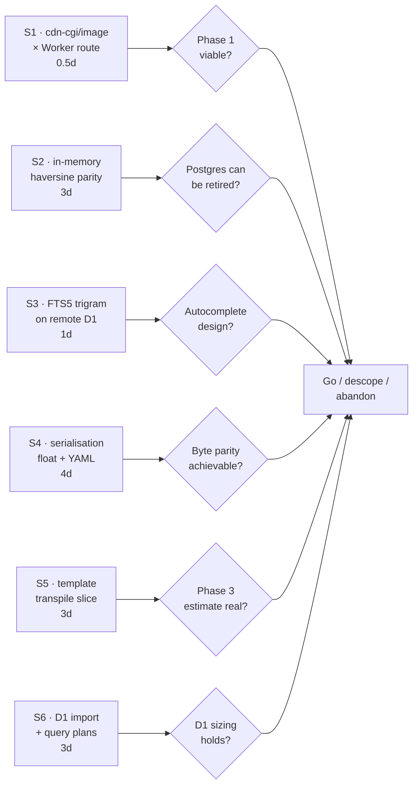

---

#### S1 — Does `/cdn-cgi/image/` survive a Worker route on the same zone?

**Time-box:** 0.5 person-days. **Run first. No Phase 1 code until this returns.**

**Question.** With a Worker route on `www.givefood.org.uk` serving image bytes at a path, does a request to `https://<zone>/cdn-cgi/image/width=300,format=avif/<that path>` return a resized image, or a 9524/9403 error?

**Method.**

```bash
# 1. Staging zone, minimal Worker returning a real JPEG from R2.
cat > /tmp/spike-s1/src/index.ts <<'TS'
export default {
  async fetch(req: Request, env: { PHOTOS: R2Bucket }) {
    const obj = await env.PHOTOS.get("photo/spike.jpg");
    if (!obj) return new Response(null, { status: 404 });
    const h = new Headers();
    obj.writeHttpMetadata(h);
    h.set("etag", obj.httpEtag);
    h.set("cache-control", "public, max-age=604800");
    return new Response(obj.body, { headers: h });
  },
};
TS

# 2. Test BOTH topologies -- they may behave differently.
#    (a) narrow route
npx wrangler deploy   # routes: ["staging.example.org/needs/at/*/photo.jpg"]
curl -sD- -o /tmp/a.avif \
  "https://staging.example.org/cdn-cgi/image/width=300,format=avif/needs/at/spike/photo.jpg"

#    (b) catch-all route -- THE RECOMMENDED TOPOLOGY, and the one 9403 warns about
npx wrangler deploy   # routes: ["staging.example.org/*"]
curl -sD- -o /tmp/b.avif \
  "https://staging.example.org/cdn-cgi/image/width=300,format=avif/needs/at/spike/photo.jpg"

# 3. Also test the Static Maps path shape from locations.html:91-93
curl -sD- -o /tmp/c.avif \
  "https://staging.example.org/cdn-cgi/image/width=300,format=avif/needs/at/spike/loc/maps/300.png"

file /tmp/a.avif /tmp/b.avif /tmp/c.avif   # expect AVIF, not HTML error pages
```

**Decision rule.**

| Result | Action |
|---|---|
| Both topologies return AVIF | ✅ Design stands. Proceed with Phase 1 as written. |
| Narrow works, catch-all fails (9403) | ⚠️ **Split the Worker.** A dedicated `givefood-media` Worker on `/needs/at/*/photo.jpg`, `/maps/*` etc., with the main Worker on a route pattern that excludes them. This costs one extra Worker and violates "prefer one Worker" — justified here because the alternative is broken images on every food bank page. |
| Both fail (9524) | 🔴 **Redesign.** Option A: Worker does the transform via `fetch(url, {cf:{image:{width,format}}})` — add **~$8/month recurring** to §11.3 for Cloudflare Images unique transformations. Option B: precompute 150/300/540/1080 into R2 and strip `/cdn-cgi/image/` from all 22 template sites — an HTML change on pages the fidelity rule covers, so it needs maintainer sign-off. **Recommend Option B**: it is simpler to run for years, costs nothing recurring, and the widths are already a fixed set. |

---

#### S2 — Does in-memory haversine reproduce production nearest-search exactly?

**Time-box:** 3 person-days. **This is the spike that decides whether Postgres can ever be retired.**

**Question.** Over the ~8,721 open points, does a JS haversine + top-K reproduce production's *ordering* and `distance_m` **to the integer**, for both `/api/2/foodbanks/search/` (R = 6378168) and `/api/1/foodbanks/search/` (R = 6367000)?

**Method.**

```bash
# 1. Extract the point set read-only from production.
psql "$PG_URL" -At -F$'\t' -c "
  SELECT 'f', id, slug, latitude, longitude FROM givefood_foodbank WHERE is_closed = false
  UNION ALL SELECT 'l', id, slug, latitude, longitude FROM givefood_foodbanklocation WHERE is_closed = false
  UNION ALL SELECT 'd', id, slug, latitude, longitude FROM givefood_foodbankdonationpoint WHERE is_closed = false
" > /tmp/points.tsv
wc -l /tmp/points.tsv   # expect ~8,721

# 2. 200 sampled coordinates: 100 real UK postcodes + 50 food bank own-coords
#    (these force distance_m = 0, the float edge case in B6)
#    + 50 boundary cases (Shetland, Scilly, Northern Ireland, the 0.0 meridian).

# 3. Diff live production against the JS implementation.
for c in $(cat /tmp/coords.txt); do
  curl -s "https://www.givefood.org.uk/api/2/foodbanks/search/?lat_lng=$c" > "/tmp/pg/$c.json"
  node spike/knn.js --lat_lng "$c" --radius 6378168 > "/tmp/js/$c.json"
  diff <(jq -S . "/tmp/pg/$c.json") <(jq -S . "/tmp/js/$c.json") || echo "DIFF $c"
done
```

**Decision rule.**

| Result | Action |
|---|---|
| Ordering identical, `distance_m` identical to the integer, on ≥199/200 | ✅ Proceed. Document the one divergence. |
| Ordering identical, `distance_m` off by ±1 m on some | ⚠️ Investigate `Math.acos` vs Postgres `acos` precision and the `min(1.0, …)` clamp. Likely fixable in a day. |
| Ordering differs on `/nearby/` only | ⚠️ Expected — see **N11**. Decide: emulate the two-leg-limit merge, or document the divergence. |
| Ordering differs on the search endpoints | 🔴 **Kill criterion K1.** Nearest-food-bank is the site's core function. Without it on D1, Postgres never leaves, goal 2 is unmet, and the migration pays the full rewrite cost for none of the resilience. **Abandon, or descope to "Phase 4 and stop".** |

---

#### S3 — Does FTS5 with `tokenize='trigram'` work on *remote* D1, and does phrase-quoting restore LIKE-equivalence?

**Time-box:** 1 person-day. The plan's three platform corrections (`foreign_keys = 1`, R\*Tree → `SQLITE_AUTH`, `sqlite_version()` not authorised) were all derived from **local** D1. This is the cheapest possible remote check and the whole autocomplete design rests on it.

**Method.**

```bash
npx wrangler d1 create givefood-spike
npx wrangler d1 execute givefood-spike --remote --command \
  "CREATE TABLE place (id INTEGER PRIMARY KEY, name_fold TEXT, population INTEGER);
   CREATE VIRTUAL TABLE place_fts USING fts5(name_fold, content='place',
     content_rowid='id', tokenize='trigram');"

# load 253,584 places, then:
npx wrangler d1 execute givefood-spike --remote --command \
  "INSERT INTO place_fts(place_fts) VALUES('rebuild');"

# The escaping fix from M2 -- phrase-quote, do not pass raw.
for q in "ackne" "king's" "-yn-" "a OR b" '"' "ton" "ing"; do
  esc="\"$(printf '%s' "$q" | sed 's/"/""/g')\""
  npx wrangler d1 execute givefood-spike --remote --json --command \
    "SELECT count(*) FROM place_fts WHERE name_fold MATCH '$esc';"
done

# Rows scanned, not returned -- this is what D1 bills.
npx wrangler d1 execute givefood-spike --remote --command \
  "EXPLAIN QUERY PLAN SELECT p.name_fold FROM place_fts f JOIN place p ON p.id=f.rowid
   WHERE f.name_fold MATCH '\"ton\"' ORDER BY p.population DESC LIMIT 10;"
```

**Decision rule.**

| Result | Action |
|---|---|
| Trigram tokenizer available; phrase-quoting returns the same counts as production `LIKE`; no `SCAN place` in the plan | ✅ Proceed with §2.5 as written plus the M2 escaping fix. |
| Trigram available but `king's` still errors | ⚠️ Escaping is wrong — iterate. Half a day. |
| Trigram tokenizer **unavailable on remote D1** | 🔴 **Fall back to the KV prefix index.** Key `aac:<3-char prefix>` → JSON array of top-20 by population; ~10–15k keys, rebuilt nightly (Place changes only when `import_places` runs). One KV read per keystroke, <10 ms, **zero D1 rows**. Loses true arbitrary-position infix for queries >3 chars — filter the 20 candidates in JS. A modest quality regression on the second pass only, and **preferable to scanning a quarter-million rows**. |

---

#### S4 — Can the serialisation layer actually produce byte-identical JSON, XML, YAML and CSV?

**Time-box:** 4 person-days. This is **B6 + B7 + N9 + N10** collapsed into one spike, and it directly tests kill criterion K2.

**Method.**

```bash
# 1. Capture golden files from PRODUCTION, now, before anything changes.
pnpm gfdiff --baseline https://www.givefood.org.uk \
            --corpus corpus/api.json --record tests/golden/api/ --mode strict

# 2. Build the four emitters against those goldens, hardest first:
#    (a) YAML  -- see B7. Do this FIRST; it is the most likely to fail.
#    (b) JSON  -- Float wrapper + Python repr() thresholds (B6).
#    (c) XML   -- self-closing empties, raw newlines in text, <None> items (N9).
#    (d) CSV   -- both QUOTE_MINIMAL and QUOTE_ALL dialects (N10).

# 3. Specific cases that MUST be in the corpus:
#    - /api/2/foodbanks/search/?lat_lng=<a food bank's own coords>  -> distance_mi = 0.0
#    - /api/2/locations/search/?...&format=yaml                     -> multiline needs
#    - /api/2/donationpoints/search/?format=xml                     -> literal <None>
#    - /needs/at/<slug>/geo.json where a coordinate rounds to 51.0
#    - /api/1/foodbanks/?format=csv                                 -> QUOTE_MINIMAL
```

**Decision rule.**

| Result | Action |
|---|---|
| All four formats byte-identical across the ~300-file corpus | ✅ Proceed. WP 2.3 estimate holds at 7 pd. |
| JSON + XML + CSV pass, YAML fails | ⚠️ **Measure YAML traffic in Cloudflare Analytics.** If <0.1% of API requests, take **Q8** to the maintainer: YAML moves to structural parity. If material, add 3–4 pd for the emitter. |
| JSON fails on floats after the Float-wrapper attempt | 🔴 Re-scope. This is fixable but the estimate is wrong. |
| >1% of the corpus still failing after 5 dedicated days | 🔴 **Kill criterion K2. Abandon.** Governments, councils, universities, supermarkets and apps parse these with no version negotiation and no way to notify them. **An API you cannot prove identical is a contract you cannot keep.** |

---

#### S5 — Is the Phase 3 template estimate real?

**Time-box:** 3 person-days. This is **M9** made concrete, and it must happen *before* Phase 3 is committed, not at its K3 checkpoint.

**Method.**

1. Build the minimum viable `tools/django-to-njk` transpiler (regex pass only, no cleverness).
2. Transpile the ten hardest templates:
   - `gfwfbn/templates/wfbn/index.html` (45 translation tags, the `` island)
   - `gfwfbn/templates/wfbn/foodbank/index.html` (schema.org JSON-LD, `<picture>` blocks)
   - `givefood/templates/public/page.html` (the base extended by 70+ templates)
   - `givefood/templates/public/index.html` (38 translation tags)
   - `gfwfbn/templates/wfbn/foodbank/md/index.md` + two siblings (whitespace-sensitive)
   - `givefood/templates/public/sitemap.xml`, `robots.txt`
   - `gfwfbn/templates/wfbn/foodbank/includes/subscribe.html` (`blocktrans with`)
3. Write the `` Nunjucks extension and compile three `.po` catalogues (`en`, `cy`, `ar`).
4. Run tolerant parity on those ten templates × three languages against production.
5. **Write down actual person-hours per template.**

**Decision rule.**

| Result | Action |
|---|---|
| ≤1.5× the implied per-template rate | ✅ Phase 3's 30–40 pd stands. |
| 1.5–2.5× | ⚠️ **Re-baseline the whole of Phase 3 and Phase 4 from the measured rate** before committing. Take the new number to the maintainer. |
| >2.5×, or the `{{ obj.method }}` auto-call problem proves unautomatable | 🔴 **Descope: stop building after Phase 2, never launch.** Under the single-launch model (§10.1.1a) there is no permanent live split to fall back on — Phase 0's caching win is real and already delivered regardless, but the APIs stay proven-and-unlaunched on the proving-ground host rather than going live on Workers while HTML stays on Django. |

Do the equivalent for Phase 6: transpile **two** admin ModelForms (`FoodbankForm` with ~60 fields, and one partial form) before committing to 45–60 pd.

---

#### S6 — Does a ~427 MB D1 import complete, and what do the query plans say?

**Time-box:** 3 person-days.

**Method.**

```bash
# 1. Full ETL dry run into a THROWAWAY database, three times on consecutive days.
npx wrangler d1 create givefood-spike-load
python3 tools/pg-to-d1/export.py --out /tmp/out
python3 tools/pg-to-d1/tosql.py  --in /tmp/out --out /tmp/sql
python3 tools/pg-to-d1/d1_import.py --db givefood-spike-load --dir /tmp/sql
# TIME THIS. The 20-40 minute estimate is the least certain number in the plan.

# 2. The three silent-corruption checks (all return no error if wrong).
npx wrangler d1 execute givefood-spike-load --remote --command \
  "SELECT typeof(published), count(*) FROM foodbankchange GROUP BY 1;"       # ONLY 'integer'
npx wrangler d1 execute givefood-spike-load --remote --command \
  "SELECT uuid FROM foodbank LIMIT 1;"                                        # 32 chars, no dashes
npx wrangler d1 execute givefood-spike-load --remote --command \
  "SELECT created FROM foodbankchange ORDER BY created DESC LIMIT 1;"         # no '+00' suffix

# 3. Tri-state preservation -- coercing these is a visible behaviour change.
npx wrangler d1 execute givefood-spike-load --remote --command \
  "SELECT 'nonpertinent_null', count(*) FROM foodbankchange WHERE nonpertinent IS NULL
   UNION ALL SELECT 'wheelchair_null', count(*) FROM foodbankdonationpoint
     WHERE wheelchair_accessible IS NULL;"
# expect 18943 and 832

# 4. EXPLAIN QUERY PLAN on the ten hottest queries. Any 'SCAN' is a billing bug.
```

**Decision rule.**

| Result | Action |
|---|---|
| Import completes <45 min, all invariants pass, no `SCAN` | ✅ Phase 7 runbook timings hold. |
| Import 45–120 min | ⚠️ Fine — it happens at T-7, outside the freeze — but **update the runbook** and re-rehearse. |
| Import >2 h or fails | 🔴 Split reference data (`postcode`, `place`) into a second D1 database and import separately. Note D1 has **no `ATTACH`**, so any split must fall on a join boundary the app can serve with two round trips. |
| Any `SCAN` on a hot path | 🔴 Fix the index before proceeding. Make `SCAN` a **CI failure**, not a review note. |

---

### 11.3 Cost model

#### The baseline is not what the earlier draft said

`gunicorn.conf.py`, verbatim:

> *"Six vCPUs are shared with five other Django sites on this box, and this app had more workers than any of them — 8, against opencompanies' 4 for 13x the database traffic (460 txn/s vs 36)."*

**Five other applications keep that box alive.** Migrating givefood off it frees capacity but eliminates no line item. Unless the box is then downsized — and nobody has costed what a five-app box costs versus a six-app box — **the current marginal cost of hosting givefood is approximately £0**.

That is the honest comparison. The £15–40/month figure in the earlier draft was the *total* box cost, which is not what this migration removes.

#### Traffic assumptions — stated so they can be checked

The earlier model counted **page views**. Cloudflare bills **Worker invocations**, and under a catch-all route every non-asset request is one. Per food bank page view:

| Request | Count | Source |
|---|---:|---|
| HTML document | 1 | — |
| Hit beacon `POST /needs/at/<slug>/hit/` | 1 | `wfbn/includes/hit.html`, `fetch(..., {keepalive:true})` |
| `/frag/last-updated/` + `/frag/need-hits/` on load | 2 | `public/page.html:61-62` |
| Same two again per 130 s of dwell | ~2 | `data-update="130"`, `static/js/csi.js` `setInterval` |
| `geo.json` (preloaded then fetched) | 1 | `GeoJSONPreload` `Link: rel=preload`, then `wfbn.js` |
| One image (`photo.jpg` or `map.png`) | ~1 | `<picture>` blocks |
| `manifest.json` | ~0.3 | `page.html:15` |
| **Billable requests per page view** | **~8.3** | |

| Assumption | Value | Basis | Confidence |
|---|---:|---|---|
| Food bank page views/month | 11,000,000 | `FoodbankHit` Jul 2026: 357,030/day | **High** (measured) |
| Billable requests per view | 8.3 | above | **Medium** — verify in Phase 0 |
| Food bank page requests | 91,300,000 | 11M × 8.3 | Medium |
| Non-JS crawlers (never fire the beacon, so invisible to `FoodbankHit`) | ~5,000,000 | 43 sitemaps advertising 5.58M place URLs, `Crawl-delay: 2` ignored by Google | **Low** — see M13 |
| `/aac/` autocomplete | 4,000,000 | ~500k searches × ~8 keystrokes past 2 chars | **Low** |
| APIs, RSS, sitemaps, dumps, `/write/`, `/dashboard/` | ~2,000,000 | — | Low |
| **Total billable Worker requests/month** | **~100,000,000** | | **Medium** |
| Edge cache hit ratio on HTML | 85% | achievable with tag purge; today it is ~0% because Cloudflare does not cache HTML by default | Medium |
| `/aac/` cache hit ratio | **50%** | unbounded query space — see M11 | Medium |
| needcheck frequency | **1×/day** at ~15:00 UTC | production `CrawlSet` data, **not** `docs/crons.md` | **Needs Q7** |

#### Central case

| Product | Arithmetic | £/month |
|---|---|---:|
| **Workers** — base | Workers Paid subscription | **$5.00** |
| **Workers** — requests | (100,000,000 − 10,000,000 included) × $0.30/M | **$27.00** |
| **Workers** — CPU | HTML misses 11M×0.15 = 1.65M × 10 ms = 16.5M<br>Beacons 11M × 1.5 ms = 16.5M<br>`/frag/` 30M × 10% miss × 2 ms = 6.0M<br>`/aac/` 4M × 50% miss × 5 ms = 10.0M<br>APIs, geojson, images ≈ 5.0M<br>**= 54.0M − 30M included = 24.0M × $0.02/M** | **$0.48** |
| **D1** — storage | ~427 MB measured (§ data plan), 5 GB included | **$0.00** |
| **D1** — rows read | HTML misses 1.65M × ~30 rows = 50M<br>**`/aac/` 2M misses × ~1,500 rows avg = 3,000M** ← dominant<br>APIs ≈ 100M<br>**= ~3.2 billion vs 25 billion included** | **$0.00** |
| **D1** — rows written | needcheck ~128k/mo + admin + subscribers + nightly hit rollup (1,071/day) ≈ 0.2M vs 50M included | **$0.00** |
| **R2** — storage | 2.7 GB photos (3 widths) + ~1.5 GB gzipped dumps + ~0.5 GB maps/favicons/screenshots = **4.7 GB vs 10 GB free** | **$0.00** |
| **R2** — Class A / Class B | Backfill one-off (~40k Class A, free tier 1M); ~150k GetObject/mo at 97% hit vs 10M free | **$0.00** |
| **R2** — egress | free by design | **$0.00** |
| **Queues** | ~1.35M ops − 1M included = 350k × $0.40/M | **$0.14** |
| **Workflows** | ~150 instances, ~10k steps vs 500k included — and see **M7**, we may not need Workflows at all | **$0.00** |
| **Analytics Engine** | 11M hit beacons + ~180k crawl points = 11.2M − 10M included = 1.2M × $0.25/M | **$0.30** |
| **Workers Logs** | `head_sampling_rate: 0.05` on the beacon Worker, `1` elsewhere ≈ 10M vs 20M included | **$0.00** |
| **Browser Rendering** — needcheck | 1,024 renders/day × ~15 s = 4.27 h/day = **128 h/mo** − 10 included = 118 × $0.09 | **$10.62** |
| **Browser Rendering** — screenshots (**M1**, omitted from the earlier model) | 5,355 URLs, ~20% touched weekly = 4,280/mo × 30 s = 35.7 h × $0.09 | **$3.21** |
| **Containers** (daily 5-min `standard-2` dump) | 150 vCPU-min / 15 GiB-h / 30 GB-h — **inside all three inclusions** | **$0.00** |
| **AI Gateway / Turnstile / Zero Trust** | free; OAuth ported so no Access seats | **$0.00** |
| **Cloudflare zone** | **Free plan**: 10 Cache Rules (design needs ~8), 5 tag-purges/min (a full rebuild is 30 calls = 6 min) | **$0.00** |
| | | |
| **TOTAL** | | **$46.75/mo ≈ £37** |

#### Sensitivity

| Scenario | Change | Total |
|---|---|---:|
| **Central** | as above | **$47 (£37)** |
| Bot traffic 4× my estimate | requests 100M → 130M: +$9.00 | **$56 (£44)** |
| needcheck really runs 4×/day (**Q7**) | Browser Rendering 128 h → 512 h: +$34.56 | **$81 (£64)** |
| **Both** | | **$110 (£87)** |
| Cache hit ratio collapses to 50% | CPU 54M → 96M: +$0.84. D1 rows read → ~10bn, still free. | **$48 (£38)** |
| S1 fails, Images needed | +$8.17/mo recurring unique transformations | **$55 (£44)** |
| Cloudflare Pro (if 10 Cache Rules or 5 purges/min bind) | +$20 | **$67 (£53)** |

**The last row of that table is the useful finding: cache hit ratio barely moves the bill**, because requests are billed whether they hit the Worker cache or invoke the Worker. Cache hit ratio is a **latency and D1-load lever, not a cost lever**. That is freeing — optimise the cache for goal 1 without watching the meter.

#### Not on the Cloudflare bill, but affected

| Service | Today | After | Note |
|---|---|---|---|
| Google Static Maps / Places / Geocoding | Shared **$200/month Google credit** | Same credit, but **B8** means every deploy cold-starts the map cache until the R2 backfill lands | ~40k extra Static Maps calls/month at $2/1,000 = $80 of credit consumed. **Goal 3 (quicker deploys) is currently a cost driver here.** Fix by precomputing to R2 in Phase 1. |
| OpenRouter | Own invoice, BYOK | Unchanged (fronted by AI Gateway for logging only) | Not a Unified Billing provider. Keep the account. |
| Postmark | Own invoice | Unchanged | Keeping it, per §Email decision. |
| Mythic Beasts VPS | Shared across 6 apps | Shared across 5 apps | **Saving unknown and probably £0.** Quantify by asking what the box costs with one fewer app. |

#### The bottom line

> **This migration adds roughly £37–£64 per month (£450–£770 a year) of spend that replaces nothing.**
>
> It buys: HTML served from ~300 PoPs instead of one Shoreditch box; the elimination of 8.6% of all Postgres time (the earthdistance KNN queries); deploys in seconds instead of a Docker build and Coolify restart; and a site that stays up when the box does not.
>
> **Present it to the board as buying speed and resilience for ~£40/month.** Do not present it as a saving. It is not one.

---

### 11.4 What the team loses, and what replaces it

Requested explicitly, because a plan that only lists gains is a sales document.

| Lost | Today | Replacement | Honest verdict |
|---|---|---|---|
| **`psql` against production** | `EXPLAIN ANALYZE`, `pg_stat_statements`, a 40-line diagnostic query answered in a second | `wrangler d1 execute --remote` (no `EXPLAIN ANALYZE`, no statement stats) + a **guarded admin query console** (M10) + Analytics Engine timing on the ten hottest queries | **The single biggest day-to-day regression, and it is permanent.** `pg_stat_statements` found the earthdistance hotspot — a problem invisible in the code. Nothing replaces that capability. |
| **`manage.py shell` for data fixes** | Three lines, side effects (geocode, parlcon lookup, decache) fire automatically because `save()` runs | `resaver` ported as an admin-triggered Queue job so a single-object re-save with full side effects stays two clicks | Partial. Multi-object ad-hoc fixes become a deploy. |
| **Log retention** | Own box, effectively unlimited | Workers Logs: **7 days** (Paid). Logpush → R2 for anything auditable. | Real loss. Budget the Logpush job or you will want a log from three weeks ago and it will be gone. |
| **Real latency in Sentry** | Python `sentry-sdk` reports true durations | `@sentry/cloudflare` for exceptions; **spans report `0ms`** because the Workers runtime coarsens timers. Latency comes from **Analytics Engine doubles you thought to record in advance.** | Say this out loud. Someone will otherwise conclude the site became infinitely fast. |
| **`makemigrations`** | Schema change in one command | Hand-written D1 SQL, **no atomicity guarantee**, three-deploy expand→migrate→contract | Real friction. Every schema change is now three deploys. |
| **`checkschema`** | 411 lines of Postgres catalogue introspection — **currently the single best source of truth about what the schema really is** | Nothing equivalent. A D1 schema-drift check in CI comparing `sqlite_master` against a committed expectation. | Genuine loss of a tool this project built *because* it needed it. |
| **Django admin's free CRUD** | 13 `fields = "__all__"` ModelForms | ~20 hand-written forms; `Foodbank` alone is ~60 fields with `FOODBANK_FIELD_ORDER` test-pinned | The bulk of Phase 6's 45–60 pd. |
| **Django's forgiving templates** | Missing variable → `''`; `{{ obj.method }}` auto-calls | Nunjucks: `throwOnUndefined: false` + a global undefined→`''` coercion; auto-call needs a bespoke enumeration script cross-referencing 181 templates against 33 model classes | The auto-call divergence is a **silent-failure class** — invisible to regex and to status-code tests. |
| **One runtime** | `uv run pytest && manage.py runserver` | pnpm + wrangler + a seed script, alongside the existing Django tooling **for the whole build** | Real, but confined to *development*: production runs on Django/Postgres alone throughout the build (§10.1.1a) — nothing is live on both stacks at once. The build-complexity cost is real; the "operating two live systems" cost the old incremental model would have carried is not. It resolves in one moment, at the Phase 7 launch, not gradually by Phase 8. |
| **Exact hit counts** | `ON CONFLICT` upsert, exact | Analytics Engine **sampled estimates**, `SUM(_sample_interval)`, lagging up to a day. Full history preserved in the D1 rollup. | The methodology changes at cutover, creating a discontinuity in a figure that appears in **annual reports**. Explain it, don't discover it. |
| **CrawlItem history in the database** | `SELECT` over 2.5M rows | 30-day window in D1; full history as monthly NDJSON in R2 | "What did we crawl in March" becomes an R2 fetch and a local query. |
| **Multi-language search parity** *(if Q3 chooses folding)* | `UPPER()` is Unicode-aware in Postgres | `name_fold` improves it (`mon` finds `Ynys-Môn`) — but SQLite's `upper()` is ASCII-only, so **not** folding is a regression for 8,442 Welsh and Gaelic names | There is **no neutral option**. See Q3. |

---

### 11.5 Open questions — the maintainer's decisions, not ours

Each of these changes the plan materially and none should be decided by a developer.

| # | Question | Why it needs you | Deadline | Default if unanswered |
|---|---|---|---|---|
| **Q1** | **Is a second developer available, and at what fraction of their time?** 245 pd at 1.4 effective FTE (3.5 productive days/week) ≈ 12 months; at 0.6 FTE (you alone) ≈ 28 months, by which point the plan is stale and the site has changed underneath it. | This single answer decides whether the plan runs to Phase 8 or should be **openly scoped to stop at Phase 4**. | **Before Phase 0.** | Scope to Phase 4 and say so. |
| **Q2** | **Confirm the trimmed `postcode` table.** Only 3 of ~20 columns are read, by one caller at `givefood/views.py:1569`. Trimming: 457 MB → ~80 MB. The dropped columns (district, ward, lsoa, msoa, region, police, country) are **public ONS data, re-importable at any time**. | Cheap to reverse, but you may want them later and I will not decide that for you. | Before Phase 2.5. | Trim. |
| **Q3** | **`/aac/`: Unicode folding, or byte-parity?** Folding makes `mon` find `Ynys-Môn` (an improvement, and new features are not a goal). Not folding means SQLite's ASCII-only `upper()` regresses search for **8,442 Welsh and Gaelic place names** on a site that serves Welsh as first-class. **There is no neutral option**, and the two current documents contradict each other (M3). | It is a user-visible change to a public endpoint either way. | Before Phase 2.5, and before the parity harness is configured. | Fold, and move `/aac/` to structural parity with a documented divergence list. |
| **Q4** | **Pin the API to English, or preserve `Accept-Language` variance?** Today `full_name()` varies by language on cached API responses with no working `Vary` — so whichever language warms a gunicorn worker's cache is served to everyone for up to an hour. Both options change observable output for someone. | It is a change to the contract declared absolute. Today's behaviour is an **accident**, not a design. | **Before WP 0.1** (M4). | Pin to English. |
| **Q5** | **A WAF rate-limit rule on `/aac/` only?** Decision 2 says serve everyone with no bot rules, and I have honoured that everywhere else. But `/aac/` is `Access-Control-Allow-Origin: *`, uncredentialed, trivially scriptable, and D1 bills **rows scanned** (M11). This is the one place where the no-limits decision has a cost consequence. | It is your open-data decision to revisit or hold. | Phase 2.5. | Hold the decision — no rate limit. Monitor and revisit. |
| **Q6** | **Do 22 language variants of the 26 place sitemaps earn their place?** `givefood/views.py:830-838` advertises **5,578,848 place URLs** across 21 non-English languages. Trimming to English-only is a one-line change cutting the advertised crawl surface by **95%** (5.58M → 254k). | **This would do more for goals 1 and 2 than several migration phases**, and it is an SEO decision, not a technical one. | Phase 0. | Ask. Do not change unilaterally. |
| **Q7** | **What is the real needcheck schedule?** `docs/crons.md` says `45 7,11,15,19 * * *` (4×/day). Production `CrawlSet` shows **one run/day at ~15:00 UTC** for 20 consecutive days. The Coolify scheduled-task config is the source of truth. | It swings the largest non-Workers cost line from **$10.62 to $45.18/month** (N8). | Phase 0. | Assume 1×/day, flag the discrepancy, fix `docs/crons.md`. |
| **Q8** | **If YAML byte-parity proves intractable (S4/B7), is structural parity acceptable for `?format=yaml`?** | It is a stated-absolute contract, and only you know who uses YAML. | After S4. | Escalate rather than decide. |
| **Q9** | **Which of the 43 `GfCredential` values do you rotate by hand?** Moving them to Workers Secrets / Secrets Store changes the model from admin-editable to deploy-time, and `/admin/credentials/` loses its reason to exist. | Any credential you rotate without a deploy needs a different answer. | Phase 2. | Move all to Secrets Store; keep a documented rotation runbook. |
| **Q10** | **What publishes `github.com/givefood/data`?** **Nothing in this repository does** — no `subprocess`, no GitPython, no `api.github.com` call anywhere. It is almost certainly external automation consuming the 12 `/dumps/*/latest/` URLs. | It is an **invisible, untestable consumer of a public contract** and the most likely thing to break silently at cutover. | **Before Phase 1.** | Assume it consumes `/latest/`; keep those redirects permanently regardless. |
| **Q11** | **Are per-food-bank hit counts a published figure that must be exact?** Analytics Engine gives sampled estimates. Exactness means a Durable Object per food bank — one more primitive, a round trip on the beacon path, ~$2/month. | The numbers feed the annual reports. | Phase 3. | Accept sampling; document the methodology change at the cutover date. |
| **Q12** | **Admin UI simplifications — approve or reject?** Two candidates: (a) collapse the five near-identical `Foodbank` partial forms (URLs, address, phone, email, FSA id) into one parameterised form; (b) replace `/admin/subscriptions/` (loads all four subscriber models into memory) and `/admin/places/` (20,000 rows/page over 253,584) with real SQL pagination. Both will **look and feel different to use**. | The admin is the one surface where modest simplification is allowed, but you asked to be asked. | Phase 6. | Ask before implementing either. |
| **Q13** | **Four admin templates have no view** — `find_locations.html`, `foodbanks_christmascards.html`, `foodbanks_deliveryaddresses.html`, `nocalories.html`. Abandoned, or screens whose views were lost? | Deleting something you meant to rebuild would be bad. | Phase 6. | Archive, do not delete. |
| **Q14** | **Does web push earn its place?** RFC 8291 payload encryption (ECDH + HKDF-SHA256 + AES-128-GCM + `aes128gcm` framing) plus ES256 VAPID JWTs in WebCrypto is the hardest cryptographic item in the port — for **49 subscriptions**, with almost no population to debug against. | Retiring a feature is your call, not mine. | Phase 3. | One-day spike; if it goes badly, come back and ask. |
| **Q15** | **How long should Postgres stay alive after cutover?** Plan: read-only at D+0, Django stopped at D+7, final dump and Postgres stopped at D+30, VPS deleted at D+90. Charity data problems surface on a **reporting cadence**, so a quarterly boundary may argue for longer. | Only you know the finance and governance cycle. | Phase 7. | D+90 as planned. |
| **Q16** | **Should the 863 orphaned translations and the underlying bug be fixed in Postgres first?** `needs_deleteall` at `gfadmin/views.py:427` uses queryset `.delete()`, bypassing `FoodbankChange.delete()`'s cascade, and **will keep producing orphans**. Fix first → the migration drops nothing. Fix later → the new system inherits the bug. | It is a live bug and a data-loss acknowledgement. | Phase 0. | Fix it in Django now — it is a one-line change and it makes the migration cleaner. |

---

### 11.6 What happens next week

If this plan is accepted, **nothing irreversible happens in the first four weeks.** Week 1 is measurement and cheap wins on the existing Django site.

#### Week 1 — measure, delete, and answer four questions

```bash
# ── Day 1 ────────────────────────────────────────────────────────────────
# 1. Answer Q7 from the source of truth, not the docs.
#    Read the Coolify scheduled-task config. Fix docs/crons.md in the same commit.

# 2. Answer Q10. Ask: what publishes github.com/givefood/data?
#    Confirmed: nothing in this repo does.
grep -rn "subprocess\|GitPython\|api\.github\|import git" --include="*.py" . | grep -v __pycache__
#    -> no output. It is external. Find out what it is before touching /dumps/.

# 3. Delete confirmed dead code (N5) -- 70 KB, zero importers, verified.
git rm givefood/const/topplaces.py givefood/const/parlcon_mp.py \
       givefood/const/parlcon_party.py givefood/const/item_classes.py
#    Remove the four lines describing them from givefood/README.md.

# ── Day 2 ────────────────────────────────────────────────────────────────
# 4. Pull real traffic from Cloudflare Analytics and validate the §11.3 model:
#      - total requests/month vs my 100M estimate
#      - the /api/ vs /api/2/ prefix split (both are live; only /api/2/ is purged today)
#      - ?format=yaml share  -> answers Q8's precondition
#      - /aac/ request volume -> validates the D1 rows-read line
#      - cf-cache-status HIT ratio by route family (expect ~0% on HTML)

# 5. FIVE-MINUTE CHECK that gates all of Phase 0. If any public HTML response
#    carries Set-Cookie, it is uncacheable and the whole caching phase does nothing.
curl -sI https://www.givefood.org.uk/needs/at/county-durham/ | grep -i "set-cookie\|cache-control\|vary"
#    SessionMiddleware and MessageMiddleware are both active (settings.py:96,98).

# ── Day 3 ────────────────────────────────────────────────────────────────
# 6. RUN SPIKE S1 -- the cdn-cgi/image x Worker-route question (§11.2).
#    Half a day. It gates Phase 1 entirely and there is currently no fallback design.

# 7. ~~Verify the Hyperdrive precondition~~ -- dropped, no Hyperdrive at any
#    point (§4, §6 D3). Nothing replaces this step; D1 has no live-connection
#    precondition to verify the way a Hyperdrive-to-Postgres binding would.

# ── Day 4-5 ──────────────────────────────────────────────────────────────
# 8. RUN SPIKE S3 -- FTS5 trigram on REMOTE D1, with the M2 phrase-quoting fix.
# 9. Fix the needs_deleteall cascade bug (Q16) -- one line, and it stops the
#    orphan count growing while everything else is decided.
```

#### Week 1 decision meeting — end of day 5

Six things on the agenda, in this order:

1. **Q1 — is there a second developer?** Everything downstream depends on it. If no: agree now, in writing, that the scope is **Phase 0 + Phase 1 and stop**, and re-plan from there. That is a good outcome, not a failure.
2. **S1 result.** If `/cdn-cgi/image/` breaks behind a Worker route, Phase 1 needs redesigning before it starts.
3. **S3 result.** If FTS5 trigram is unavailable remotely, the autocomplete design changes to the KV prefix index.
4. **Q7 — needcheck schedule.** Fixes the largest uncertain cost line.
5. **Q6 — the 5.58M place sitemap URLs.** A one-line change that may deliver more for goals 1 and 2 than several phases.
6. **Q4 — pin the API to English?** Must be settled before any Cache Rule touches `/api/*`.

#### Weeks 2–3 — Phase 0, on Django, no new spend

The single highest-value fortnight in the whole plan:

1. Cache Rules for HTML, sitemaps, geojson, static (WP 0.1) — **excluding `/api/*` until Q4 is answered**.
2. `Cache-Tag` middleware emitting `fb-<slug>, needs-index, lang-<code>`, with the **language deliberately omitted** from the food-bank tag (WP 0.2).
3. Rewrite `decache()` to purge by tag. Fix `url_limit = 30` → **100** at `givefood/utils/cache.py:183` (WP 0.3).
4. **Explicit Cache Rule TTL for `/needs/at/<slug>/`** — that view's `@cache_page` is commented out at `gfwfbn/views.py:362`, so it emits no `Cache-Control` at all and a "respect origin" rule would do **nothing** for the highest-traffic page family on the site.
5. AI Gateway in front of OpenRouter — two lines in `givefood/utils/ai.py` — to establish a **cost and failure-rate baseline before anything moves**.
6. Cloudflare Notifications on 5xx rate and origin health.

**Success criterion:** `curl -sI` on a food bank page returns `cf-cache-status: HIT` on the second request, and origin RPS for `/needs/at/*` drops measurably in Cloudflare Analytics.

#### Week 4 — the go/no-go on the migration itself

Run **S2** (in-memory haversine parity — 3 days) and start **S4** (serialisation) and **S5** (template slice).

Then decide, with real numbers rather than estimates:

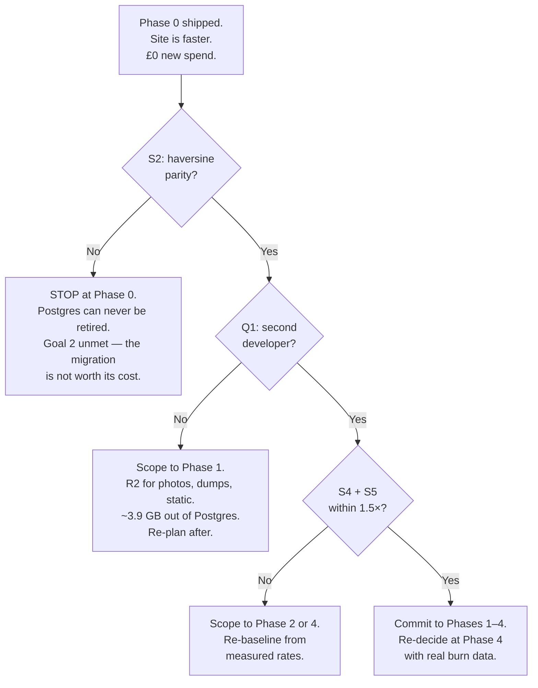

**Note what is *not* on that diagram: a commitment to Phases 5–8.** They are 60% of the remaining effort and buy only the Postgres decommission. That decision belongs at the Phase 4 boundary, with **real build-effort data** behind it (actual person-days spent through Phase 4 against the estimate, not projected operational history — nothing is live yet at that point under the single-launch model, §10.1.1a) — not now, on estimates.

#### The one thing to hold on to

If nothing else in this document survives contact with reality, this should:

> **Phase 0 is ten person-days, costs nothing, is entirely reversible configuration, and delivers the maintainer's number-one goal.** The site gets faster in a fortnight, on Django, on the existing box. Everything after it is a deliberate purchase of resilience and deploy velocity for ~£40/month and up to a year of work.
>
> **Do Phase 0 next week regardless of what you decide about the rest.**
